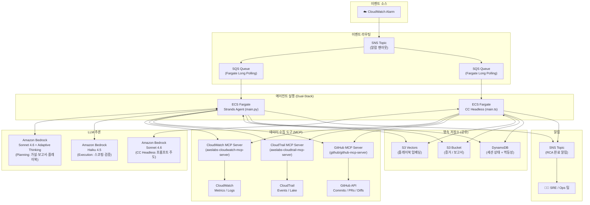
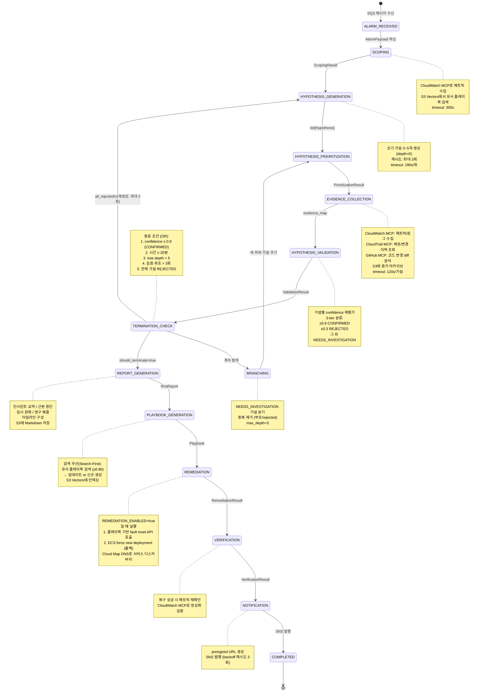
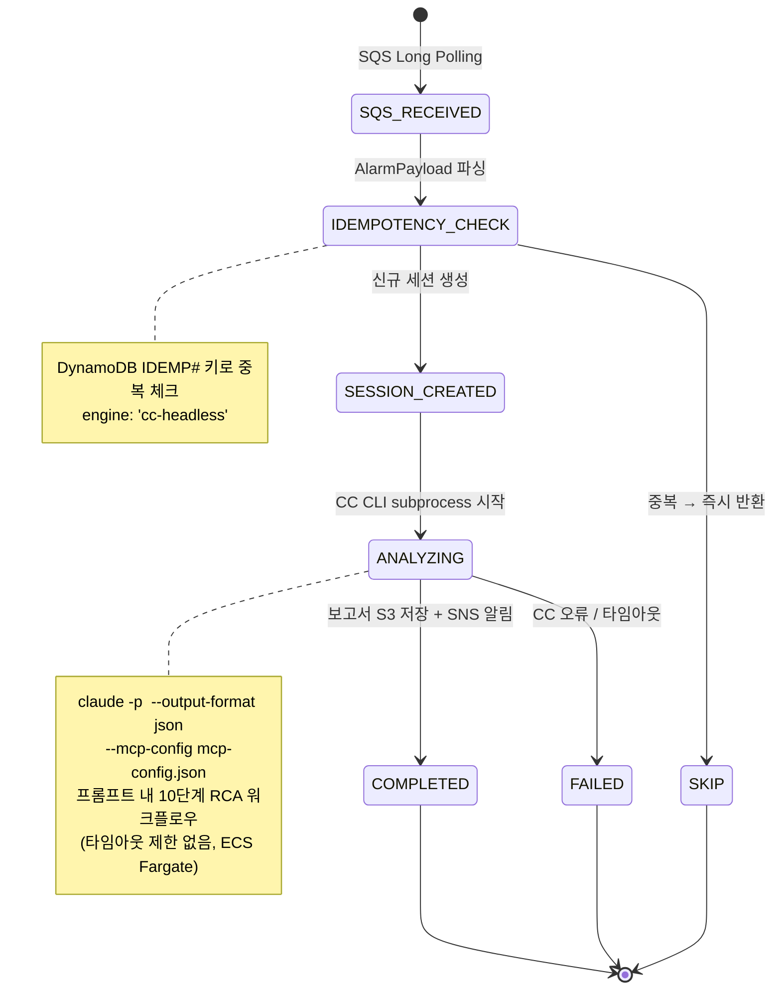

# RCA Agent Project Guide

RCA Agent는 AWS 기반 자동 RCA(근본원인분석) 에이전트 시스템의 Nx 모노레포(pnpm workspace)입니다.

## Repository Structure

| Package | Description | Tech |
|---------|-------------|------|
| [`packages/agent`](./packages/agent/) | Strands Agents SDK 기반 RCA 에이전트 — 12단계 closed-loop 파이프라인 (2-tier 모델 아키텍처) | Python, Strands Agents SDK, Amazon Bedrock |
| [`packages/infra`](./packages/infra/) | AWS CDK 인프라 — ECS Fargate, SNS/SQS, S3, S3 Vectors, VPC, Cloud Map | TypeScript, CDK |
| [`packages/cc-headless`](./packages/cc-headless/) | CC on Bedrock headless 기반 RCA 에이전트 — ECS Fargate에서 SQS Long Polling + CC CLI로 단일 프롬프트 RCA 수행 | TypeScript, Claude Code CLI, ECS Fargate |
| [`packages/healthcare-sensor-app`](./packages/healthcare-sensor-app/) | 헬스케어 센서 데이터 수집/조회 서비스 — 영구 지속형 장애 주입 + reset API, background traffic generator | Python, FastAPI, SQLAlchemy, PostgreSQL, OpenTelemetry |
| [`packages/dashboard`](./packages/dashboard/) | RCA 대시보드 — DynamoDB 세션 상태 및 S3 보고서 조회 (로컬 전용) | TypeScript, Nuxt.js 4, @nuxt/ui |

## Dual-Stack Architecture

동일한 CloudWatch 알람에 대해 두 가지 실행 엔진이 독립적으로 RCA를 수행합니다.

| | Fargate Stack (Strands) | Fargate Stack (CC Headless) |
|---|---|---|
| **실행 환경** | ECS Fargate (Long Polling) | ECS Fargate (Long Polling) |
| **에이전트 엔진** | Strands Agents SDK (Python) | Claude Code CLI (headless, Bedrock) |
| **RCA 방식** | 12단계 closed-loop 파이프라인 | 단일 프롬프트 + MCP 도구 자율 호출 |
| **모델** | 2-tier (Sonnet 4.6 + Haiku 4.5) | CC 기본 모델 (Sonnet 4.6) |
| **타임아웃** | 제한 없음 | 제한 없음 |
| **동시성** | Fargate 태스크 스케일링 | Fargate 태스크 1 |
| **공유 리소스** | SNS (알람/알림), DynamoDB, S3, S3 Vectors |
| **구분** | DynamoDB `engine` 필드: `strands` vs `cc-headless` |

## Quick Start

Prerequisites와 환경 설정은 각 패키지의 AGENTS.md를 참조하세요.

```bash
pnpm install
pnpm nx run-many -t build
pnpm nx run-many -t test
```

## Agent Work Protocol

### Development Cycle

```
1. Review/Create ADR → 2. Implement feature → 3. Build/lint verification → 4. Test → 5. Sync ADR → 6. Commit
```

- **New feature**: 관련 ADR을 먼저 읽거나 새로 작성한 후 구현을 시작합니다.
- **Bug fix**: ADR 업데이트 불필요 (아키텍처 변경이 없는 경우).
- **Before commit**: 구현이 ADR과 달라졌으면 ADR과 `docs/adr/README.md` 인덱스를 반드시 업데이트합니다.
- **Rollback**: 빌드/테스트 실패 시 `git stash` 또는 `git checkout -- <file>`로 복원. `git reset --hard`나 force push는 사용자 확인 없이 실행하지 않습니다.

### Principles

- 한 번에 하나의 기능/버그에 집중
- 큰 변경은 원자적 커밋으로 분리 ([CONTRIBUTING.md](./CONTRIBUTING.md) 참조)
- 세션 종료 시 코드는 빌드 가능하고 린트를 통과해야 함
- `git log`만으로 진행 상황을 파악할 수 있도록 서술적 커밋 메시지 작성
- 아키텍처 결정 변경 시 ADR 업데이트, 단순 버그 수정이나 스타일 변경은 생략
- Early return 패턴 선호: 에러와 엣지 케이스를 먼저 처리한 후 메인 로직 수행

### Sub-Agent Delegation

이 모노레포는 패키지별로 기술 스택이 다릅니다. **메인 에이전트가 오케스트레이터 역할을 하고, 패키지별 작업은 서브 에이전트에게 위임합니다.** 각 서브 에이전트는 자기 패키지의 AGENTS.md를 읽고, 해당 디렉토리에서 명령을 실행하며, 다른 패키지의 패턴을 적용하지 않습니다.

#### Sub-Agent Definitions

| Sub-Agent | Directory | Language | Lint/Build |
|-----------|-----------|----------|------------|
| **Agent** | `packages/agent/` | Python | `uv run ruff check`, `uv run pytest` |
| **CC Headless** | `packages/cc-headless/` | TypeScript (Node.js) | `pnpm build`, `pnpm test` |
| **Infra** | `packages/infra/` | TypeScript (CDK) | `pnpm lint`, `pnpm build`, `pnpm test` |
| **Healthcare Sensor App** | `packages/healthcare-sensor-app/` | Python (FastAPI) | `uv run ruff check`, `uv run pytest` |
| **Dashboard** | `packages/dashboard/` | TypeScript (Nuxt.js) | `pnpm dev`, `pnpm build` |

#### Orchestrator Responsibilities

1. **Plan** — ADR 읽기, 범위 정의, 영향받는 패키지 식별
2. **Define API contract** — 패키지 간 기능의 경우 인터페이스(이벤트 페이로드, DynamoDB 스키마, S3 경로 규칙 등) 사전 정의
3. **Delegate** — 각 서브 에이전트에게 계약과 제약 조건을 포함한 명확한 태스크 전달
4. **Integrate** — 통합 변경 사항 검토 후 커밋

#### Cross-Package Development

기본 순서: **Infra → Agent → Web** (의존성 하향). 각 패키지를 완료하고 검증한 후 다음으로 진행합니다. API 계약을 컨텍스트로 전달하여 서브 에이전트가 호환 가능한 인터페이스를 독립적으로 구현합니다.

## Architecture Overview

### System Architecture



### Agent Pipeline — Fargate (Strands, 12단계)

에이전트는 증거 수집-가설 검증 루프를 반복하며, 5가지 종료 조건(OR) 중 하나라도 만족하면 종료합니다. 분석 완료 후 자동 복구(Remediation)와 복구 검증(Verification) 단계를 거치는 closed-loop 파이프라인입니다.



### Agent Pipeline — ECS Fargate (CC Headless, 프롬프트 주도)

CC on Bedrock headless 모드에서 단일 프롬프트로 RCA 전체 워크플로우를 수행합니다. CC가 MCP 도구를 자율적으로 호출합니다.



### Data Flow — Fargate (모듈 간 데이터 흐름)

각 모듈이 생산/소비하는 Pydantic 모델과 모듈 간 의존 관계를 나타냅니다.

```mermaid
flowchart TD
    subgraph Input["입력 파싱 (main.py)"]
        SQS_MSG["SQS Message (JSON)"]
        SNS_PARSE["_parse_sns_envelope()"]
        AP["AlarmPayload"]
        SQS_MSG --> SNS_PARSE --> AP
    end

    subgraph F1["F1: Scoping (scoping.py)"]
        direction TB
        PB_SEARCH["search_similar_playbooks()<br/>S3 Vectors → PlaybookMatch[]"]
        SCOPING_AGENT["Scoping Agent<br/>(CloudWatch MCP)"]
        SO["ScopingOutput<br/>(structured_output)"]
        SR["ScopingResult"]
        PB_SEARCH --> SCOPING_AGENT
        SCOPING_AGENT --> SO --> SR
    end

    subgraph F2["F2: Hypothesis Generation (hypothesis.py)"]
        direction TB
        HYP_AGENT["Hypothesis Agent"]
        HO["HypothesisOutput<br/>(structured_output)"]
        HGR["HypothesisGenerationResult"]
        H["Hypothesis[]<br/>(tree_id, depth=0)"]
        HYP_AGENT --> HO --> HGR
        HGR --> H
    end

    subgraph F3["F3: Prioritization (prioritization.py)"]
        direction TB
        PRIO_AGENT["Prioritization Agent"]
        PO["PrioritizationOutput<br/>(structured_output)"]
        PR["PrioritizationResult"]
        PH["PrioritizedHypothesis[]<br/>(rank, tools, parallel_group)"]
        PRIO_AGENT --> PO --> PR
        PR --> PH
    end

    subgraph F4["F4: Evidence Collection (evidence.py)"]
        direction TB
        EV_AGENT["Evidence Agent<br/>(CloudWatch + CloudTrail + GitHub MCP)"]
        EO["EvidenceOutput<br/>(structured_output)"]
        ECR["EvidenceCollectionResult[]"]
        EM["evidence_map<br/>(hypothesis_id → text)"]
        S3_EV["save_evidence_to_s3()<br/>→ S3 아카이브"]
        EV_AGENT --> EO --> ECR --> EM
        ECR --> S3_EV
    end

    subgraph F5["F5: Validation (validation.py)"]
        direction TB
        VAL_AGENT["Validation Agent"]
        VO["ValidationOutput<br/>(structured_output)"]
        VJ["ValidationJudgment[]"]
        VR["ValidationResult<br/>(all_rejected flag)"]
        VAL_AGENT --> VO --> VJ --> VR
    end

    subgraph F6["F6: Branching (branching.py)"]
        direction TB
        BR_AGENT["Branching Agent"]
        BO["BranchingOutput<br/>(structured_output)"]
        BR["BranchingResult"]
        CH["Child Hypothesis[]<br/>(depth=parent+1)"]
        BR_AGENT --> BO --> BR
        BR --> CH
    end

    subgraph F7["F7: Termination (termination.py)"]
        direction TB
        TC["check_termination()<br/>(순수 로직, LLM 미사용)"]
        TD_OUT["TerminationDecision<br/>(should_terminate, reason,<br/>best_hypothesis)"]
        TC --> TD_OUT
    end

    subgraph F8["F8: Report (report.py)"]
        direction TB
        RPT_AGENT["Report Agent"]
        RO["ReportOutput<br/>(structured_output)"]
        RCA["RcaReport"]
        S3_SAVE["save_report_to_s3()<br/>→ Markdown"]
        RPT_AGENT --> RO --> RCA --> S3_SAVE
    end

    subgraph F9["F9: Playbook (playbook_gen.py)"]
        direction TB
        PB_EXIST["search_existing_playbooks()<br/>S3 Vectors (≥0.86)"]
        PBK_AGENT["Playbook Agent<br/>(update or create)"]
        PBO["PlaybookOutput<br/>(structured_output)"]
        PBK["Playbook"]
        S3V_SAVE["save_playbook_to_s3_vectors()<br/>→ S3 Vectors 인덱싱"]
        PB_EXIST --> PBK_AGENT --> PBO --> PBK --> S3V_SAVE
    end

    subgraph F10["F10: Remediation (remediation.py)"]
        direction TB
        REM_PARSE["플레이북 기반 복구 액션 결정"]
        REM_EXEC["fault reset API 호출<br/>+ ECS force deploy"]
        REM_RESULT["RemediationResult"]
        REM_PARSE --> REM_EXEC --> REM_RESULT
    end

    subgraph F11["F11: Verification (verification.py)"]
        direction TB
        VER_AGENT["Verification Agent<br/>(CloudWatch MCP)"]
        VER_OUT["VerificationResult"]
        VER_AGENT --> VER_OUT
    end

    subgraph F12["F12: Notification (notification.py)"]
        direction TB
        BUILD_N["build_notification()"]
        NM["NotificationMessage"]
        SEND_N["send_notification()<br/>→ SNS Publish"]
        BUILD_N --> NM --> SEND_N
    end

    AP --> F1
    SR --> F2
    H --> F3
    SR --> F3
    PH --> F4
    EM --> F5
    VR --> F7
    H --> F7
    VJ -->|NEEDS_INVESTIGATION| F6
    TD_OUT -->|should_terminate=true| F8
    CH -->|새 가설 추가| F3
    RCA --> F9
    PBK --> F10
    REM_RESULT --> F11
    VER_OUT --> F12

    style F7 fill:#f9f3e3,stroke:#d4a843
    style F4 fill:#e8f5e9,stroke:#388e3c
    style Input fill:#e3f2fd,stroke:#1976d2
```



### Agent Architecture

#### Fargate Stack (Strands Agents SDK)
- **12단계 closed-loop 파이프라인**: F1(Scoping) → F2(Hypothesis) → F3(Prioritization) → F4(Evidence) → F5(Validation) → F6(Branching) → F7(Termination) → F8(Report) → F9(Playbook) → F10(Remediation) → F11(Verification) → F12(Notification)
- **2-Tier 모델 아키텍처**: Planning(Sonnet 4.6 + adaptive thinking)은 추론 단계, Execution(Haiku 4.5)은 수집/판정 단계에 사용
- **가설-트리 탐색**: 증거에 따라 가지치기/확장하는 트리형 점진적 추론
- **검증 루프**: Prioritization → Validation → Termination Check → Branching을 반복하며, 전체 기각 시 가설 재생성
- **플레이북 검색 우선**: 기존 플레이북 업데이트를 우선하고, 없으면 신규 생성
- **자동 복구**: `REMEDIATION_ENABLED=true` 시 플레이북 기반 fault reset API 호출 + ECS force deployment
- **복구 검증**: CloudWatch MCP로 메트릭 정상화 확인

#### Fargate Stack (CC Headless)
- **프롬프트 주도 RCA**: 단일 시스템 프롬프트에 10단계 워크플로우 정의 (스코핑 ~ 복구 ~ 보고서), CC가 자율적으로 MCP 도구 호출
- **MCP 도구 연동**: CloudWatch, CloudTrail, GitHub MCP 서버를 `mcp-config.json`으로 구성
- **타임아웃 없음**: ECS Fargate에서 실행되므로 Lambda 15분 제한 없음
- **멱등성**: DynamoDB `IDEMP#` 키로 Strands 스택과의 중복 처리 방지
- **세션 추적**: 동일 DynamoDB 테이블, `engine: 'cc-headless'` 필드로 구분

### Technology Stack

| Component | Fargate Stack (Strands) | Fargate Stack (CC Headless) |
|-----------|--------------|--------------|
| 에이전트 엔진 | Strands Agents SDK (Python) | Claude Code CLI headless (TypeScript) |
| 실행 환경 | AWS ECS Fargate | AWS ECS Fargate |
| 이벤트 수신 | SQS Long Polling | SQS Long Polling |
| LLM 추론 | Bedrock — Sonnet 4.6 (Planning) + Haiku 4.5 (Execution) | Bedrock — Sonnet 4.6 (CC 프롬프트 주도) |
| MCP 도구 | CloudWatch + CloudTrail + GitHub MCP | CloudWatch + CloudTrail + GitHub MCP |
| 환경 설정 | python-dotenv (`env/local.env`) | ECS 환경변수 |

| Component (공유) | Technology |
|-----------|-----------|
| 이벤트 라우팅 | Amazon SNS → 각 스택별 SQS Queue |
| 임베딩 | Amazon S3 Vectors (서버사이드 임베딩) |
| 증거/보고서 저장 | Amazon S3 |
| 세션 관리 | Amazon DynamoDB (`engine` 필드로 스택 구분) |
| 알림 | Amazon SNS |
| 네트워크 보안 | VPC + PrivateLink |

## Architecture Decision Records

`docs/adr/` — 새로운 기능이나 주요 변경 시 ADR 작성이 필수입니다. ADR은 **한국어**로 작성합니다. 전체 인덱스: **[docs/adr/README.md](./docs/adr/README.md)**

### ADR Workflow

#### Before Implementation (Required)

1. **Check existing ADRs** — `docs/adr/README.md` 인덱스에서 관련 ADR 확인
2. **Create or review ADR**
   - 관련 ADR이 없으면 → `docs/adr/TEMPLATE.md` 기반으로 새 ADR 작성 (status: `Proposed`)
   - 관련 ADR이 있으면 → 읽고 현재 구현 방향과 일치하는지 확인
3. **Scope implementation to ADR** — ADR에 기술된 결정을 따라 구현

#### After Implementation (Required)

1. **Sync ADR** — 아키텍처 결정 자체가 변경되었으면 ADR 업데이트 (status → `Accepted`). 구현 세부사항(파일 경로, 코드 스니펫, DB 필드 스키마)은 ADR에 넣지 않음
2. **Update README index** — `docs/adr/README.md` 인덱스를 최신 상태로 유지
3. **Cascade updates** — 변경이 다른 ADR에 영향을 주면 해당 ADR도 업데이트

#### When ADR is Not Required

- 단순 버그 수정 (아키텍처 변경 없음)
- 스타일/포매팅 변경
- 문서 오타 수정
- 의존성 패치 버전 업데이트

## Documentation Maintenance

- ADR 인덱스 (`docs/adr/README.md`) 동기화 유지
- 주요 기능 추가나 프로젝트 구조 변경 시 관련 AGENTS.md 업데이트
- DynamoDB 스키마 변경 시 관련 문서 업데이트
- 프롬프트 변경 시 시나리오 테스트셋으로 정확도 검증

## Reference Documents

| Document | Description |
|----------|-------------|
| [PRD](./docs/prd/aws-rca-agent-prd.md) | 제품 요구사항 정의서 — 기능 명세, 데모 시나리오, KPI |
| [아키텍처 & 데모 플로우](./docs/architecture-and-demo-flow.md) | 데이터 플로우, 상태 전이, 데모 시나리오 머메이드 다이어그램 |
| [ADR Index](./docs/adr/README.md) | 아키텍처 결정 기록 인덱스 |
| [운영 가이드](./docs/system-guide-for-ops.md) | 주니어 DevOps 운영팀원을 위한 시스템 안내서 |
| [Contributing Guide](./CONTRIBUTING.md) | 커밋 메시지, 브랜치 전략, PR 규칙 |

## Deployment

### Infrastructure (CDK)

```bash
cd packages/infra
pnpm nx deploy infra          # 전체 스택 배포
pnpm cdk diff                 # 변경사항 확인
pnpm cdk deploy <StackName>   # 특정 스택 배포
```

CDK 스택 구성 (9개):

| Stack | Description |
|-------|-------------|
| EcrStack | ECR 리포지토리 (rca-agent, healthcare, cc-headless) |
| NetworkStack | VPC (Public + Private subnets, NAT Gateway) |
| EventBusStack | SNS Alarm Topic + SQS Queue (Fargate용) + DLQ |
| DatabaseStack | DynamoDB RCA 세션 테이블 |
| StorageStack | S3 Evidence/Report 버킷 |
| RdsStack | PostgreSQL 17.4 (Healthcare 서비스용) |
| RcaAgentServiceStack | ECS Fargate — Strands RCA 에이전트 |
| CcHeadlessStack | ECS Fargate — CC headless RCA 에이전트 |
| HealthcareServiceStack | ECS Fargate — Healthcare 센서 서비스 + Cloud Map Private DNS |

모든 서비스는 Private subnet에 배포되며, 인바운드 트래픽이 차단됩니다. 자세한 스택 의존관계와 IAM 권한은 [`packages/infra/AGENTS.md`](./packages/infra/AGENTS.md)를 참조하세요.

### Agent — Fargate (Strands)

에이전트는 ECS Fargate 태스크로 배포됩니다. SQS 큐를 Long Polling으로 구독하며, 알람 메시지 수신 시 RCA 워크플로우를 자동 시작합니다.

### Agent — Fargate (CC Headless)

CC Headless 에이전트는 ECS Fargate 태스크로 배포됩니다. SQS 큐를 Long Polling으로 구독하며, CC CLI를 subprocess로 호출하여 RCA를 수행합니다.

```bash
cd packages/cc-headless
docker build -t cc-headless .
```

### Healthcare Sensor App

PostgreSQL + background traffic generator로 CloudWatch baseline 메트릭을 축적합니다. ECS Fargate로 배포되며, fault injection API로 장애 시나리오를 트리거합니다.

## Testing

```bash
# 전체 테스트
pnpm nx run-many -t test

# 특정 패키지 테스트
pnpm nx test agent
pnpm nx test infra

# 영향받은 프로젝트만 테스트
pnpm nx affected -t test
```

### RCA 정확도 테스트

에이전트의 RCA 정확도는 시나리오 테스트셋(과거 실제 인시던트 재현 케이스)으로 측정합니다:
- **Precision**: 에이전트가 제시한 근본 원인이 실제 원인과 일치하는 비율 (목표 90%+)
- **Recall**: 실제 원인이 에이전트의 가설 목록에 포함되는 비율 (목표 90%+)
- **오탐율**: 정상 상태에서 에이전트가 오보를 내는 비율 (목표 20% 이하)
