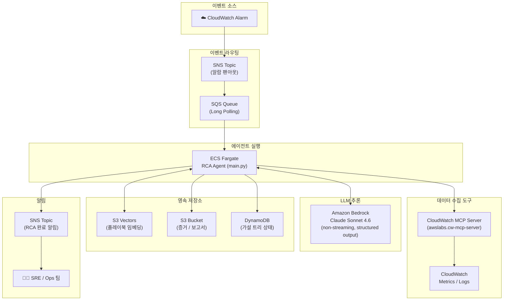
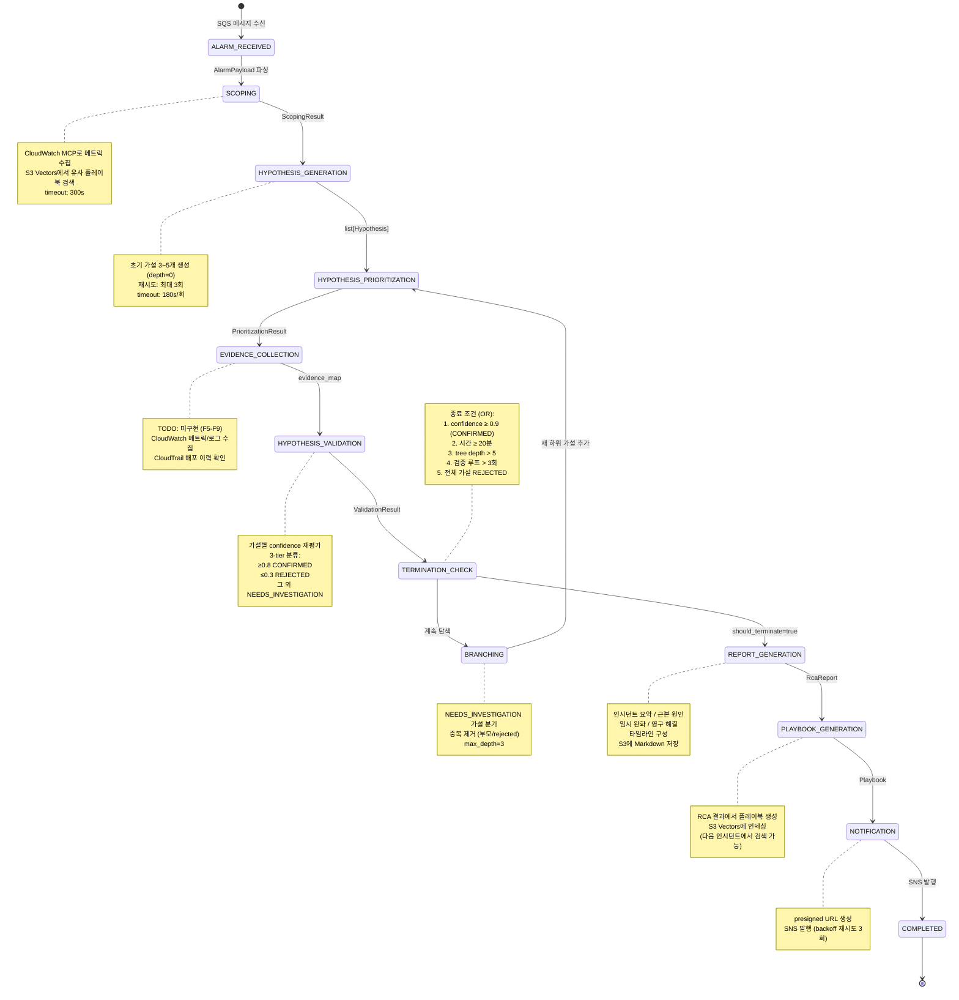
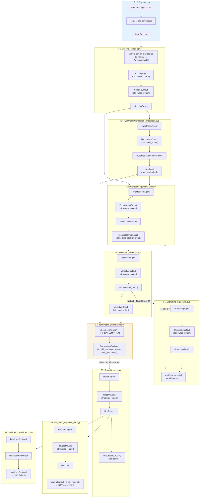

# RCA Agent Project Guide

RCA Agent는 AWS 기반 자동 RCA(근본원인분석) 에이전트 시스템의 Nx 모노레포(pnpm workspace)입니다.

## Repository Structure

| Package | Description | Tech |
|---------|-------------|------|
| [`packages/agent`](./packages/agent/) | Strands Agents SDK 기반 RCA 에이전트 — 가설 생성기(Orchestrator) + 툴-콜러(Tool-Caller) | Python, Strands Agents SDK, Amazon Bedrock |
| [`packages/infra`](./packages/infra/) | AWS CDK 인프라 — ECS Fargate, SNS/SQS, DynamoDB, S3, VPC | TypeScript, CDK |
| [`packages/web`](./packages/web/) | RCA 대시보드 웹 프론트엔드 — RCA 목록, 가설 트리, 증거 패널, 보고서 뷰 | TypeScript, Nuxt 4, TailwindCSS, DaisyUI |
| [`packages/healthcare-sensor-app`](./packages/healthcare-sensor-app/) | 헬스케어 센서 데이터 수집/조회 서비스 — RCA 에이전트 검증용 장애 주입 지원 | Python, FastAPI, SQLAlchemy, OpenTelemetry |

## Quick Start

Prerequisites와 환경 설정은 각 패키지의 AGENTS.md를 참조하세요.

```bash
pnpm install
pnpm nx run-many -t build
pnpm nx run-many -t test
```

## Agent Work Protocol

### Development Cycle

```
1. Review/Create ADR → 2. Implement feature → 3. Build/lint verification → 4. Test → 5. Sync ADR → 6. Commit
```

- **New feature**: 관련 ADR을 먼저 읽거나 새로 작성한 후 구현을 시작합니다.
- **Bug fix**: ADR 업데이트 불필요 (아키텍처 변경이 없는 경우).
- **Before commit**: 구현이 ADR과 달라졌으면 ADR과 `docs/adr/README.md` 인덱스를 반드시 업데이트합니다.
- **Rollback**: 빌드/테스트 실패 시 `git stash` 또는 `git checkout -- <file>`로 복원. `git reset --hard`나 force push는 사용자 확인 없이 실행하지 않습니다.

### Principles

- 한 번에 하나의 기능/버그에 집중
- 큰 변경은 원자적 커밋으로 분리 ([CONTRIBUTING.md](./CONTRIBUTING.md) 참조)
- 세션 종료 시 코드는 빌드 가능하고 린트를 통과해야 함
- `git log`만으로 진행 상황을 파악할 수 있도록 서술적 커밋 메시지 작성
- 아키텍처 결정 변경 시 ADR 업데이트, 단순 버그 수정이나 스타일 변경은 생략
- Early return 패턴 선호: 에러와 엣지 케이스를 먼저 처리한 후 메인 로직 수행

### Sub-Agent Delegation

이 모노레포는 패키지별로 기술 스택이 다릅니다. **메인 에이전트가 오케스트레이터 역할을 하고, 패키지별 작업은 서브 에이전트에게 위임합니다.** 각 서브 에이전트는 자기 패키지의 AGENTS.md를 읽고, 해당 디렉토리에서 명령을 실행하며, 다른 패키지의 패턴을 적용하지 않습니다.

#### Sub-Agent Definitions

| Sub-Agent | Directory | Language | Lint/Build |
|-----------|-----------|----------|------------|
| **Agent** | `packages/agent/` | Python | `ruff check`, `pytest` |
| **Infra** | `packages/infra/` | TypeScript (CDK) | `pnpm lint`, `pnpm build`, `pnpm test` |
| **Web** | `packages/web/` | TypeScript (Nuxt) | `pnpm lint`, `pnpm build` |
| **Healthcare Sensor App** | `packages/healthcare-sensor-app/` | Python (FastAPI) | `ruff check`, `pytest` |

#### Orchestrator Responsibilities

1. **Plan** — ADR 읽기, 범위 정의, 영향받는 패키지 식별
2. **Define API contract** — 패키지 간 기능의 경우 인터페이스(이벤트 페이로드, DynamoDB 스키마, S3 경로 규칙 등) 사전 정의
3. **Delegate** — 각 서브 에이전트에게 계약과 제약 조건을 포함한 명확한 태스크 전달
4. **Integrate** — 통합 변경 사항 검토 후 커밋

#### Cross-Package Development

기본 순서: **Infra → Agent → Web** (의존성 하향). 각 패키지를 완료하고 검증한 후 다음으로 진행합니다. API 계약을 컨텍스트로 전달하여 서브 에이전트가 호환 가능한 인터페이스를 독립적으로 구현합니다.

## Architecture Overview

### System Architecture



### Agent Pipeline (State Machine)

에이전트는 가설-검증 루프를 반복하며, 5가지 종료 조건(OR) 중 하나라도 만족하면 종료합니다.



### Data Flow (모듈 간 데이터 흐름)

각 모듈이 생산/소비하는 Pydantic 모델과 모듈 간 의존 관계를 나타냅니다.



### Agent Architecture

- **Supervisor-Orchestrator 패턴**: 가설 생성기(Orchestrator Agent)가 전문 툴 에이전트(Tool-Caller)에게 작업 위임
- **가설-트리 탐색**: 증거에 따라 가지치기/확장하는 트리형 점진적 추론
- **상태 머신**: `ALARM_RECEIVED` → `SCOPING` → `HYPOTHESIS_GENERATION` → `HYPOTHESIS_PRIORITIZATION` → `EVIDENCE_COLLECTION` → `HYPOTHESIS_VALIDATION` → `REPORT_GENERATION` → `COMPLETED`

### Technology Stack

| Component | Technology |
|-----------|-----------|
| 에이전트 프레임워크 | Strands Agents SDK |
| 에이전트 실행 환경 | AWS ECS Fargate |
| 이벤트 라우팅 | Amazon SNS + SQS |
| LLM 추론 | Amazon Bedrock (Claude) |
| 임베딩 | Amazon Bedrock Cohere Embed v4 |
| 메트릭/로그 도구 | AWS Labs CloudWatch MCP 서버 (`awslabs/cloudwatch-mcp-server`) |
| 배포 이력 도구 | AWS Labs CloudTrail MCP 서버 (`awslabs/cloudtrail-mcp-server`) |
| 코드 변경 분석 도구 | GitHub MCP 서버 (`github/github-mcp-server`) |
| 분산 트레이스 | ADOT + AWS X-Ray (MVP 이후) |
| 증거/보고서 저장 | Amazon S3 |
| 벡터 검색 | Amazon S3 Vectors |
| 가설 트리 상태 | Amazon DynamoDB |
| 시크릿 관리 | AWS Secrets Manager |
| 알림 | Amazon SNS |
| 네트워크 보안 | VPC + PrivateLink |

## Architecture Decision Records

`docs/adr/` — 새로운 기능이나 주요 변경 시 ADR 작성이 필수입니다. ADR은 **한국어**로 작성합니다. 전체 인덱스: **[docs/adr/README.md](./docs/adr/README.md)**

### ADR Workflow

#### Before Implementation (Required)

1. **Check existing ADRs** — `docs/adr/README.md` 인덱스에서 관련 ADR 확인
2. **Create or review ADR**
   - 관련 ADR이 없으면 → `docs/adr/TEMPLATE.md` 기반으로 새 ADR 작성 (status: `Proposed`)
   - 관련 ADR이 있으면 → 읽고 현재 구현 방향과 일치하는지 확인
3. **Scope implementation to ADR** — ADR에 기술된 결정을 따라 구현

#### After Implementation (Required)

1. **Sync ADR** — 아키텍처 결정 자체가 변경되었으면 ADR 업데이트 (status → `Accepted`). 구현 세부사항(파일 경로, 코드 스니펫, DB 필드 스키마)은 ADR에 넣지 않음
2. **Update README index** — `docs/adr/README.md` 인덱스를 최신 상태로 유지
3. **Cascade updates** — 변경이 다른 ADR에 영향을 주면 해당 ADR도 업데이트

#### When ADR is Not Required

- 단순 버그 수정 (아키텍처 변경 없음)
- 스타일/포매팅 변경
- 문서 오타 수정
- 의존성 패치 버전 업데이트

## Documentation Maintenance

- ADR 인덱스 (`docs/adr/README.md`) 동기화 유지
- 주요 기능 추가나 프로젝트 구조 변경 시 관련 AGENTS.md 업데이트
- DynamoDB 스키마 변경 시 관련 문서 업데이트
- 프롬프트 변경 시 시나리오 테스트셋으로 정확도 검증

## Reference Documents

| Document | Description |
|----------|-------------|
| [PRD](./docs/prd/aws-rca-agent-prd.md) | 제품 요구사항 정의서 — 기능 명세, 데모 시나리오, KPI |
| [ADR Index](./docs/adr/README.md) | 아키텍처 결정 기록 인덱스 |
| [Contributing Guide](./CONTRIBUTING.md) | 커밋 메시지, 브랜치 전략, PR 규칙 |

## Deployment

### Infrastructure (CDK)

```bash
cd packages/infra
pnpm nx deploy infra
```

### Agent (ECS Fargate)

에이전트는 ECS Fargate 태스크로 배포됩니다. SQS 큐를 Long Polling으로 구독하며, 알람 메시지 수신 시 RCA 워크플로우를 자동 시작합니다.

### Web Dashboard

```bash
pnpm nx build web
```

## Testing

```bash
# 전체 테스트
pnpm nx run-many -t test

# 특정 패키지 테스트
pnpm nx test agent
pnpm nx test infra

# 영향받은 프로젝트만 테스트
pnpm nx affected -t test
```

### RCA 정확도 테스트

에이전트의 RCA 정확도는 시나리오 테스트셋(과거 실제 인시던트 재현 케이스)으로 측정합니다:
- **Precision**: 에이전트가 제시한 근본 원인이 실제 원인과 일치하는 비율 (목표 90%+)
- **Recall**: 실제 원인이 에이전트의 가설 목록에 포함되는 비율 (목표 90%+)
- **오탐율**: 정상 상태에서 에이전트가 오보를 내는 비율 (목표 20% 이하)
