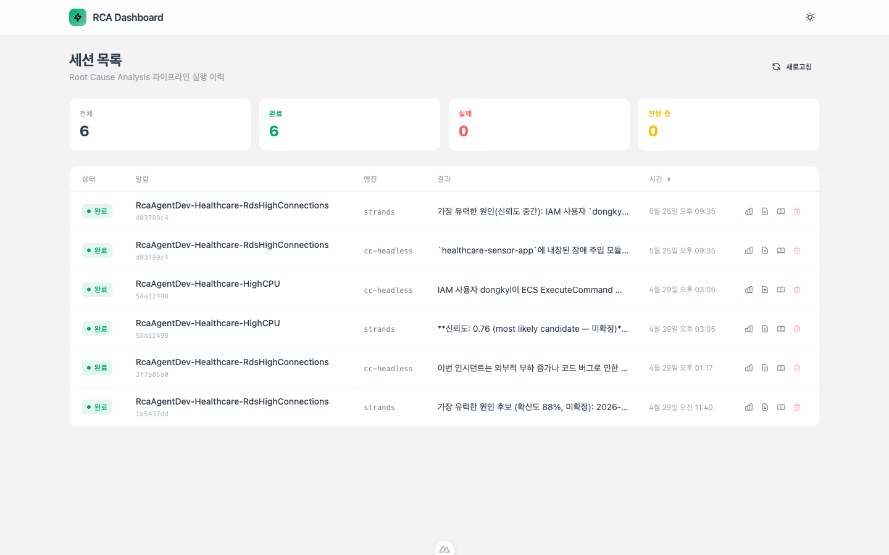
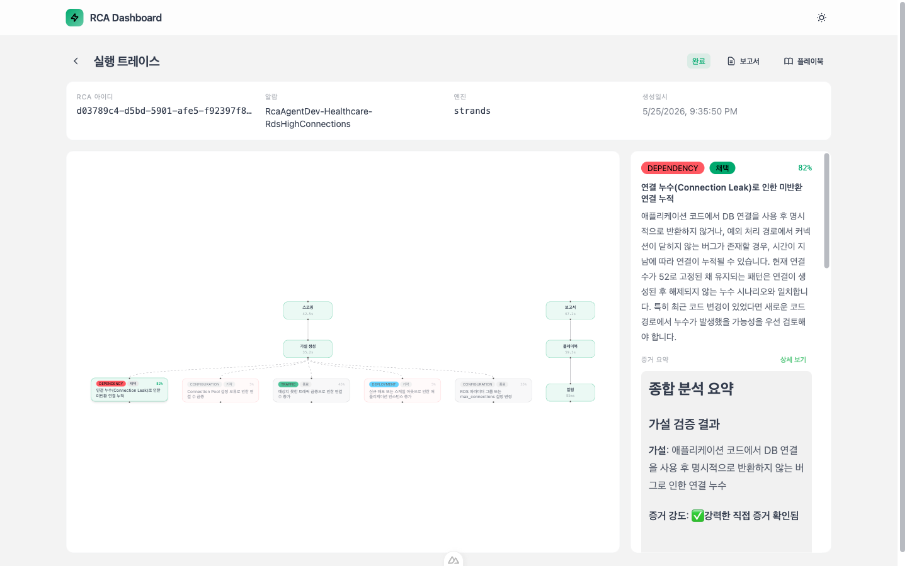
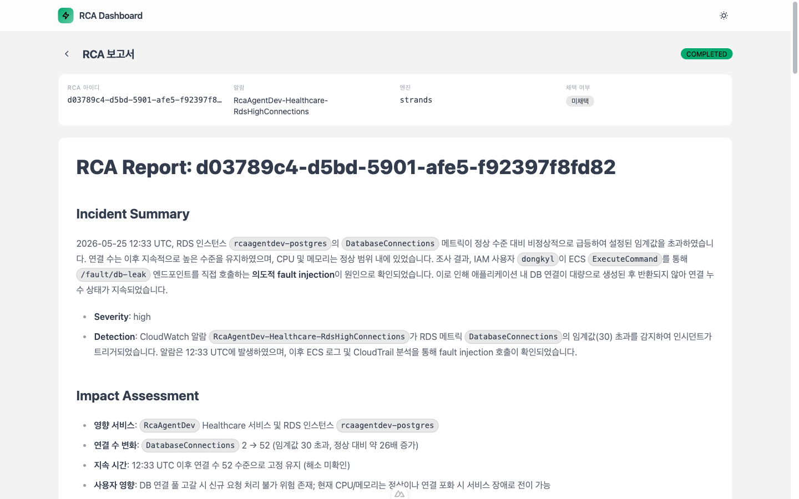
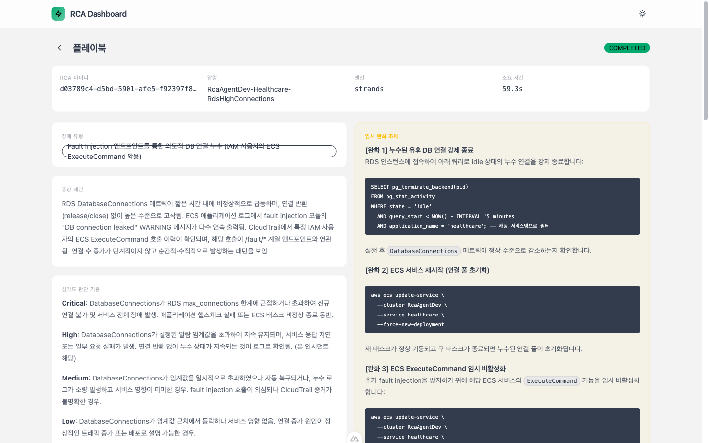

# RCA Agent — AWS 기반 자동 RCA 분석 에이전트

[](./LICENSE)

AWS 환경에서 CloudWatch 알람 발생 시 자동 RCA(근본원인분석)를 수행하는 closed-loop 에이전트 시스템입니다. 두 가지 실행 엔진(Strands Agents SDK 9단계 파이프라인 / Codex on Bedrock Runtime headless 전문 서브 에이전트 오케스트레이션)을 지원하며, MCP 서버를 통해 CloudWatch, CloudTrail, GitHub 데이터 소스를 자동 분석합니다.

## 패키지 구성

| Package | Description | Tech |
|---------|-------------|------|
| [`packages/agent`](./packages/agent/) | Strands Agents SDK 기반 RCA 에이전트 — 9단계 파이프라인 (단일 Sonnet 모델 + Planning/Execution 행동 분리) | Python, Strands Agents SDK, Amazon Bedrock |
| [`packages/headless-codex`](./packages/headless-codex/) | Codex on Bedrock Runtime headless 오케스트레이터 — 읽기 전용 RCA → Report와 승인 기반 실행 → 회고 | Python, Codex CLI, ECS Fargate |
| [`packages/infra`](./packages/infra/) | AWS CDK 인프라 — ECS Fargate, SNS/SQS, S3, S3 Vectors, DynamoDB, VPC, Cloud Map | TypeScript, CDK |
| [`packages/healthcare-sensor-app`](./packages/healthcare-sensor-app/) | Vital 센서 이벤트 수용·조회 — 전역 1Hz, PostgreSQL 내구 inbox·재시도, 단일 SQL 컬럼 오류 검증 | Python, FastAPI, PostgreSQL |
| [`packages/dashboard`](./packages/dashboard/) | RCA 대시보드 — DynamoDB 세션 상태, S3 보고서/플레이북/증거 조회, 파이프라인 트레이스 그래프 (로컬 전용) | TypeScript, Nuxt.js 4, Vue Flow |

## 주요 기능

### Dual-Stack RCA 실행
- **Fargate Stack (Strands)**: CloudWatch Alarm → SNS → SQS → ECS Fargate, 9단계 closed-loop 파이프라인 (Scoping → Hypothesis → Prioritization → Beam Selection → Evidence → Validation → Branching → Report → Playbook → Notification)
- **Fargate Stack (Headless Codex)**: CloudWatch Alarm → SNS → SQS → ECS Fargate, 역할별 전문 서브 에이전트 오케스트레이션
- 동일 SNS 토픽을 독립 구독하여 A/B 비교 가능
- DynamoDB `engine` 필드로 실행 엔진 구분, `IDEMP#` 키로 멱등성 보장

### Strands Agent Stack
- 단일 모델(Sonnet 5) + Planning/Execution 행동 분리 (Planning은 adaptive thinking, Execution은 thinking 없음)
- 가설별 독립 Agent 인스턴스로 증거 수집 세션 격리 (컨텍스트 오버플로우 방지)
- 계층적 부모 요약 주입으로 하위 가설 증거 수집 컨텍스트 강화
- Beam Search 탐색: 우선순위 상위 N개(기본 3) 가설만 선택적 검증
- 신뢰도/시간/깊이/루프 기반 종료 조건으로 운영 통제
- 전체 기각 시 자동 가설 재생성 (최대 2회)
- 가설 상태: PENDING → CONFIRMED / REJECTED / CLOSED / NEEDS_INVESTIGATION
- 유사 보고서 검색: 스코핑 시 과거 RCA 보고서의 "증상 → 근본 원인" 경로를 활용하여 가설 생성 정확도 향상
- 플레이북 검색 우선(search-first) 전략: 유사 플레이북 업데이트 또는 신규 생성

### Headless Codex Stack
- Codex CLI headless 모드 + Bedrock Runtime Global Inference Profile
- 모델 `global.openai.gpt-5.6-sol`, reasoning effort `high`
- 분석은 RCA → Report 전문 에이전트를 순차 호출하고 어떤 복구도 수행하지 않음
- 사용자가 승인한 플레이북만 별도 실행 워커가 수행하며, 해결 후 회고가 절차를 교정

### 공통 — Hexagonal Architecture
- 양쪽 패키지(agent, headless-codex) 모두 Ports & Adapters 패턴 적용
- 비즈니스 로직(services/)은 Port 인터페이스(ports/interfaces/)에만 의존, 인프라 구체 클래스(adapters/)와 분리
- DI Container로 AWS Adapter(DynamoDB, S3, SNS, Bedrock)를 lazy-init 주입
- DTO(ports/dto/)를 공유 데이터 모델로 사용

### 공통
- AWS Knowledge + CloudWatch + CloudTrail + GitHub MCP 서버를 통한 데이터 자동 수집
- RCA 보고서 자동 생성 및 S3 저장
- S3 Vectors 기반 유사 보고서/플레이북 검색 (가설 생성 정확도 향상)
- SNS 알림 전송 (Presigned URL 보고서 링크 포함)
- DynamoDB 기반 파이프라인 실행 트레이스 (단계별 추적)

## 대시보드로 보는 동작 흐름

RCA 결과는 로컬 전용 Nuxt 대시보드(`packages/dashboard`, `http://localhost:3100`)에서 확인합니다. DynamoDB 세션 상태와 S3 보고서/증거를 로컬 AWS 크레덴셜(`~/.aws`)로 직접 조회하며, Strands / Headless Codex 두 엔진의 결과를 나란히 비교할 수 있습니다.

### 1. 세션 목록

알람별 RCA 실행 이력을 상태(완료/실패/진행 중) 통계와 함께 나열합니다. 각 행에서 엔진(strands / headless-codex), 근본 원인 요약, 트레이스·보고서·플레이북으로의 바로가기를 제공합니다.



### 2. 실행 트레이스 그래프

9단계 파이프라인의 실행 과정을 Vue Flow DAG로 시각화합니다. 스코핑 → 가설 생성 → 가설별 검증 → 보고서 → 플레이북 → 알림 흐름을 노드로 표현하며, 가설 노드를 클릭하면 신뢰도·증거 요약·상세 분석이 우측 패널에 표시됩니다.



### 3. RCA 보고서

근본 원인, 영향 범위, 조치 방안을 담은 Markdown 보고서를 렌더링합니다. Incident Summary, Impact Assessment 등 구조화된 섹션으로 구성됩니다.



### 4. 플레이북

재사용 가능한 대응 플레이북을 조회합니다. 장애 유형, 증상 패턴, 심각도 판단 기준, 임시 완화 조치(실행 가능한 명령 포함)를 제공합니다.



## 사전 요구사항

- Node.js 24+, pnpm
- Python 3.13+, [uv](https://docs.astral.sh/uv/)
- AWS CLI (인증 설정 완료)
- [gh](https://cli.github.com/) (GitHub CLI)
- Docker (컨테이너 빌드 및 배포용)

## 설치

```bash
# 모노레포 의존성 설치
pnpm install

# 전체 빌드
pnpm nx run-many -t build

# 전체 테스트
pnpm nx run-many -t test

# 전체 린트
pnpm nx run-many -t lint
```

### 패키지별 설치

```bash
# Agent (Python)
cd packages/agent
uv sync --extra dev

# Headless Codex (Python)
cd packages/headless-codex
uv sync --extra dev

# Healthcare Sensor App (Python)
cd packages/healthcare-sensor-app
uv sync --extra dev

# Infra (TypeScript CDK)
cd packages/infra
pnpm install

# Dashboard (TypeScript Nuxt.js)
cd packages/dashboard
pnpm install
```

## 시크릿 설정

GitHub PAT(Personal Access Token)를 GitHub repo secret과 AWS Secrets Manager에 동시에 등록하는 스크립트를 제공합니다. 등록된 토큰은 CDK 배포 시 ECS task에 `GITHUB_PERSONAL_ACCESS_TOKEN` 환경변수로 자동 주입됩니다.

### GitHub PAT 발급

1. GitHub → Settings → Developer settings → Personal access tokens → Fine-grained tokens
2. Repository access: 대상 레포지토리 선택
3. Permissions: 필요한 read 권한 부여
4. 토큰 생성 후 복사

### 시크릿 등록

```bash
# 기본 설정 (NAMESPACE=RcaAgentDev, AWS_REGION=us-east-1)
./packages/infra/scripts/setup-github-secrets.sh

# 커스텀 설정
NAMESPACE=RcaAgentProd AWS_REGION=ap-northeast-2 ./packages/infra/scripts/setup-github-secrets.sh
```

이 스크립트는 다음 두 곳에 토큰을 등록합니다:
- **GitHub repo secret**: `GH_PAT` (CI/CD용)
- **AWS Secrets Manager**: `{NAMESPACE}/github/pat` (ECS task 런타임용)

## 인프라 배포

### 설정

인프라 설정은 `packages/infra/.toml`에서 관리합니다.

```toml
[app]
ns = "RcaAgent"
stage = "Dev"

[aws]
region = "us-east-1"

[alarm]
notificationEmail = "your@email.com"

[agent]
imageTag = "latest"

[healthcare]
imageTag = "latest"

[ccHeadless]
imageTag = "latest"

[storage]
evidenceBucket = "rca-agent-dev-evidence"
vectorBucket = "rca-agent-dev-vectors"

[table.rcaSession]
name = "RcaAgentDevRcaSession"

[tracing]
enabled = true
```

### 배포

```bash
cd packages/infra

# CloudFormation 템플릿 합성 (검증용)
npx cdk synth

# 전체 스택 배포
npx cdk deploy --all

# 개별 스택 배포
npx cdk deploy RcaAgentDevRcaAgentServiceStack
npx cdk deploy RcaAgentDevCcHeadlessStack
npx cdk deploy RcaAgentDevHealthcareServiceStack
```

### 스택 구성 (9개)

| 스택 | 설명 |
|------|------|
| `EcrStack` | ECR 레포지토리 (Codex 이미지는 기존 `cc-headless` 물리 이름 유지) |
| `NetworkStack` | VPC, 서브넷, NAT Gateway |
| `EventBusStack` | SNS 토픽, SQS 큐 (알람 → 에이전트 연결) |
| `DatabaseStack` | DynamoDB 테이블 (RCA 세션) |
| `StorageStack` | S3 버킷 (증거, 보고서), S3 Vectors (플레이북/보고서 임베딩) |
| `RdsStack` | RDS PostgreSQL (Healthcare 서비스용) |
| `HealthcareServiceStack` | Healthcare 센서 앱 (ECS Fargate + CloudWatch 알람 + Cloud Map DNS) |
| `RcaAgentServiceStack` | Strands RCA 에이전트 (ECS Fargate) |
| `HeadlessCodexStack` | Headless Codex RCA 에이전트 (배포 스택 물리 이름은 `CcHeadlessStack` 유지) |

## Vital 단일 저장 컬럼 오류 데모

활성 장애는 측정 INSERT의 `timestamp`를 존재하지 않는 `sampled_at`으로 참조하는 한 가지다.
이벤트 v1/v2와 앱 빌드 v1/v2는 다르다. 정상 앱은 두 이벤트 형식을 물리 `timestamp`로
정규화하고, 결함 빌드도 같은 v2 이벤트와 내구 inbox를 사용하면서 실제 PostgreSQL
`42703` 오류를 낸다. 폐기된 연결 누수·CPU·메모리 fault/reset API는 실행하지 않는다.

서비스 전체 신규 생성은 1Hz다. 미완료 이벤트는 기존 PostgreSQL에 보존하고 최대
86,400건에서 신규 생성을 멈춘다. rollback 후에도 원래 ID·측정 시각·내용으로 재시도하며
중복 측정 행을 만들지 않는다. 기존 측정과 스키마를 초기화해서 전제를 맞추지 않는다.

운영 순서는 정상 이미지·실제 저장 근거를 `plan`으로 보존한 뒤 `backlog-open`,
`apply`, RCA의 정상화·근본원인·운영 개선, 별도 사용자 승인 실행, 정상 배포 수렴 후
`backlog-close`와 `backlog-check`다. Vital 스냅샷은 유효한 `backlog-open` 없이
`apply`할 수 없다. 아래 안내의 첫 실행 예제부터 이 순서를 따른다. 명령의 실제 필수 인자는 다음 안내를 따른다.

- [실행 가능한 CLI·전제·기본 ECS read-only probe](scripts/run_realistic_demo.html)
- [Vital 시나리오와 검증 경계](docs/demo/realistic-scenarios.html)
- [센서 빌드와 로컬 PostgreSQL 증거](packages/healthcare-sensor-app/demo/README.md)

```bash
uv run --project packages/agent --no-sync python scripts/run_realistic_demo.py --help
```

기본 backlog 명령은 pinned 정상 TD/network/secrets/role의 고정 read-only 단독 ECS
probe를 사용한다. 노트북에 RDS 연결 경로나 DB 자격 증명을 새로 요구하지 않는다.
`--vital-db-env-file`은 로컬/기존 DB 접근 환경을 위한 선택적 직접 어댑터다.
구형 이미지에 probe 모듈이 없거나 원본·실제 DB proof·종료 확인이 부족하면 완료 처리하지 않는다.

`backlog-check`는 최초 pending과 이후 모든 admission을 포함한 고정 epoch/순번 범위를
한 번 읽는다. 이미 처리된 이벤트도 포함하며 미완료면 같은 범위를 나중에 재조회한다.
기존 서버 `RESOLVED`와 두 고정 60초 구간을 다시 판정하지 않는다. 전체 데모 완료에는
승인된 에이전트 복구와 별도 backlog proof가 모두 필요하고, 운영자의 `restore`는
에이전트 성공으로 세지 않는다. runner의 `scenarioSuccess`는 계속 false다.

로컬 native 시험, 모형 AWS/CLI 시험, 실제 클라우드·모델 실행 결과를 구분한다.
이 안내가 새 이미지 배포나 새 라이브 데모 성공을 뜻하지 않으며 기존 역사적 실패·증거는 보존한다.

## 환경 변수

### Strands Agent (packages/agent)

`python-dotenv`를 사용하여 `packages/agent/env/local.env`에서 설정을 로드합니다 (`override=False`, 기존 환경변수 우선).

| 변수 | 기본값 | 설명 |
|------|--------|------|
| `BEDROCK_MODEL_ID` | `global.anthropic.claude-sonnet-5` | Planning/Execution 공용 모델 |
| `BEDROCK_MAX_TOKENS` | `65536` | 모델 최대 출력 토큰 |
| `THINKING_ENABLED` | `false` | Planning 호출 시 adaptive thinking 피처플래그 |
| `SQS_QUEUE_URL` | - | SQS 큐 URL (필수) |
| `S3_VECTOR_BUCKET_NAME` | - | S3 Vectors 버킷 |
| `S3_REPORT_BUCKET` | - | 보고서 저장 S3 버킷 |
| `SNS_NOTIFICATION_TOPIC_ARN` | - | RCA 완료 알림 SNS 토픽 |
| `GITHUB_PERSONAL_ACCESS_TOKEN` | - | GitHub MCP 인증 (Secrets Manager에서 주입) |

전체 환경변수 목록은 [`packages/agent/env/local.env`](./packages/agent/env/local.env)를 참조하세요.

### Headless Codex (packages/headless-codex)

ECS Fargate 환경변수로 설정됩니다 (CDK 스택에서 자동 주입).

| 변수 | 기본값 | 설명 |
|------|--------|------|
| `CODEX_MODEL` | `global.openai.gpt-5.6-sol` | Bedrock Global Inference Profile |
| `CODEX_REASONING_EFFORT` | `high` | Codex reasoning effort |
| `CODEX_MODEL_PROVIDER` | `amazon-bedrock-runtime` | Codex Bedrock Runtime provider |
| `CODEX_BEDROCK_BASE_URL` | 리전 기반 | Bedrock Runtime OpenAI-compatible endpoint |
| `DYNAMODB_TABLE_NAME` | - | 공유 RCA 세션 테이블 |
| `S3_EVIDENCE_BUCKET` | - | 공유 증거 버킷 |
| `S3_VECTOR_BUCKET_NAME` | - | 공유 S3 Vectors 버킷 |
| `S3_REPORT_BUCKET` | - | 공유 보고서 버킷 |
| `SNS_NOTIFICATION_TOPIC_ARN` | - | 알림 토픽 |
| `GITHUB_PERSONAL_ACCESS_TOKEN` | - | GitHub MCP 인증 (Secrets Manager에서 주입) |

### Dashboard (packages/dashboard)

로컬 전용 대시보드로, 로컬 AWS 크레덴셜(`~/.aws`)을 사용합니다.

```bash
cd packages/dashboard
pnpm dev   # http://localhost:3100
```

## 테스트

```bash
# 테스트 환경 구성
pnpm setup:test

# 포맷, lint, 패키지 테스트, 공통 RCA 평가, typecheck
pnpm verify

# 공통 RCA 시나리오 오프라인 평가
pnpm eval:offline

# 제공된 관측을 사용하는 실모델 의미 평가 (명시적 환경 설정 필요)
pnpm eval:model
```

실모델 엔진 command 계약과 의미 기준선 승인 절차는
[RCA Evaluation Harness](./tests/README.md)를 참조하세요.

## 문서

| 문서 | 설명 |
|------|------|
| [PRD](./docs/prd/aws-rca-agent-prd.md) | 제품 요구사항 정의서 — 기능 명세, 데모 시나리오, KPI |
| [아키텍처 & 데모 플로우](./docs/architecture-and-demo-flow.md) | 데이터 플로우, 상태 전이, 데모 시나리오 머메이드 다이어그램 |
| [ADR Index](./docs/adr/.mapping.json) | 아키텍처 결정 기록 인덱스 |
| [회고 공용 반영 데이터](./docs/tables/retrospective-publication.md) | 후속 반영·대기 작업·불변 공용 기준 연결의 키와 필드 |
| [운영 가이드](./docs/system-guide-for-ops.md) | 주니어 DevOps 운영팀원을 위한 시스템 안내서 |
| [RCA에서 플레이북 실행까지](./docs/rca-to-remediation-flow.md) | 알람부터 분석·승인·실행·해결 판정·회고까지 전체 흐름을 한곳에서 설명 (머메이드) |
| [Contributing Guide](./CONTRIBUTING.md) | 커밋 메시지, 브랜치 전략, PR 규칙 |
| 패키지별 AGENTS.md | 각 패키지의 AGENTS.md에서 세부 기술 가이드 확인 |

## 기여하기

커밋 메시지, 브랜치 전략, PR 규칙 등 기여 규칙은 [CONTRIBUTING.md](./CONTRIBUTING.md)를 따릅니다.

## License

이 프로젝트는 [MIT License](./LICENSE) 하에 배포됩니다.
