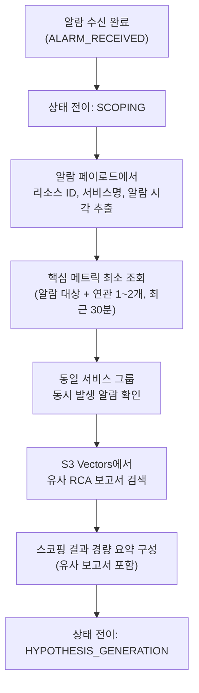

# ADR 0001: 초기 스코핑 + RCA 보고서 유사도 검색 (Roll-up)

Date: 2026-04-28

## Status

Accepted (Roll-up — 체인 내 최소 번호로 재사용)

## Context

RCA Agent는 알람 수신 후 가설을 생성하기 전에 **초기 스코핑** 단계를 거친다. 이 단계는 전체 RCA 시간 예산(20분) 중 첫 5분 내에 완료되어야 하며, 가설 생성에 필요한 최소 컨텍스트(영향 리소스, 증상, 이상 시작 시점, 영향 범위)와 **과거 유사 장애의 근본 원인 경로**를 함께 확보하는 것을 목표로 한다.

요구사항:

1. **속도**: 5분 타임 버짓 — 스코핑이 늘어지면 검증에 쓸 시간이 줄어든다
2. **충분성**: 가설 생성에 필요한 최소 컨텍스트 확보
3. **과거 경험 반영**: 유사한 과거 장애의 "증상 → 근본 원인" 추론 경로를 가설 생성에 직접 주입
4. **깊은 조사 회피**: 로그 전문 검색, 트레이스 분석 같은 상세 수집은 가설 검증 단계로 위임

## Decision

**얕은 스코핑(Shallow Scoping) + S3 Vectors 기반 유사 RCA 보고서 검색** 전략을 채택한다.

### 스코핑 흐름



### 핵심 결정사항

1. **얕은 스코핑 원칙**: 가설을 세울 수 있는 최소한의 컨텍스트만 수집한다. 알람 대상 메트릭과 핵심 연관 메트릭 1~2개를 최근 30분 기준으로 조회하며, 로그 전문 검색이나 트레이스 분석은 하지 않는다. 상세 데이터 수집은 가설 검증 단계에서 수행한다.

2. **영향 범위 개략 파악**: 동일 서비스 그룹의 동시 발생 알람 유무만 확인하여 단일 리소스 문제인지 광범위 장애인지 식별한다. 리소스 태그 기반 서비스 그룹 식별을 우선 시도하되, 태그가 없으면 알람 대상 리소스만으로 진행한다.

3. **S3 Vectors 기반 유사 RCA 보고서 검색**: 알람 컨텍스트를 벡터화하여 RCA 보고서 인덱스에서 유사도 검색을 수행한다. 유사도 임계치 이상인 상위 N개(기본 3개) 보고서를 가설 생성 단계로 전달한다. 보고서 인덱스가 비어 있거나 검색이 실패해도 스코핑은 빈 결과로 계속 진행한다(비차단).

4. **구조화 임베딩 템플릿**: 저장과 검색 모두 동일한 한국어 템플릿을 사용하여 임베딩 공간 일관성을 보장한다:
   ```
   장애유형: {root_cause/alarm_name} | 증상: {incident_summary/state_reason} | 메트릭: {metric_name}
   ```
   각 필드는 80자로 truncate한다. Cohere Embed V4(1536차원, float32, cosine 유사도)를 사용하며, 저장 시 `input_type=search_document`, 검색 시 `input_type=search_query`를 적용한다. 동일 템플릿을 플레이북 인덱스(ADR 0008)에도 적용하여 두 인덱스 간 공간 일관성을 유지한다.

5. **정성적(qualitative) 요약 전략**: 임베딩 필드(`incident_summary`, `root_cause`)에 구체적 수치(임계치, 퍼센트, 타임스탬프)를 포함하지 않는다. LLM 프롬프트에서 "abnormally high", "exceeds threshold", "sustained spike" 등 정성적 표현을 사용하도록 지시한다. 숫자가 다른 동일 패턴 장애(예: CPU 85% vs 92%)가 유사도 검색에서 매칭되도록 하기 위함이다.

6. **보고서 인덱싱 시점**: RCA 보고서가 S3에 저장된 직후 동일 파이프라인에서 벡터 인덱싱을 수행한다. S3 Vectors 메타데이터는 2048 bytes 제한 내에서 `incident_summary`(80자), `root_cause`(80자), `hypothesis_path`(첫 항목, 200자), `confirmed`(true/false), `rca_id`를 저장한다. 상세 내용은 S3 Markdown 본문에서 조회한다.

7. **스코핑 결과 경량 JSON 구성**: 스코핑 결과를 알람 요약, 이상 시점, 영향 범위 추정, 초기 심각도, 유사 보고서 목록, 원본 알람 페이로드로 구성한 경량 구조(`ScopingResult`)로 가설 생성 단계에 전달한다.

8. **가설 생성 프롬프트 주입**: 유사 보고서 검색 결과를 가설 생성 프롬프트에 `## Similar Past RCA Reports` 섹션으로 주입한다. 각 보고서의 `root_cause`, `incident_summary`, `hypothesis_path`, `confirmed` 여부를 포함하여 LLM이 과거 경험을 바탕으로 초기 가설을 세우도록 한다. 확정된 보고서(`confirmed=true`)의 근본 원인에 더 높은 신뢰도를 부여하도록 지시한다.

9. **5분 타임아웃**: 스코핑이 5분을 초과하면 그 시점까지 수집된 데이터만으로 강제 완료한다. 메트릭 데이터가 없더라도 알람 페이로드와 유사 보고서만으로 가설 생성에 진입한다.

10. **CloudWatch MCP 기반 메트릭 조회**: 스코핑 에이전트는 CloudWatch MCP 서버를 도구로 사용하여 메트릭을 조회한다. MCP 서버가 CloudWatch API 호출을 대행하므로 에이전트 코드에서 직접 API를 호출하지 않는다.

11. **Strands SDK structured output**: 스코핑 에이전트는 Strands Agents SDK의 `structured_output_model`로 Pydantic 모델(`ScopingOutput`)을 지정하여 구조화된 결과를 반환받는다. SQS 배치 처리 특성상 비스트리밍(`streaming=False`) 모드로 호출한다.

12. **비차단 실행 + 재시도**: S3 Vectors 유사 보고서 검색은 exponential backoff(base 1초, 최대 3회 재시도)로 일시적 오류를 처리한다. 검색 실패 시 빈 결과로 진행하여 스코핑이 중단되지 않도록 한다. `ThreadPoolExecutor`로 LLM 호출에 타임아웃을 강제하며, 타임아웃 또는 에이전트 실패 시 알람 페이로드만으로 fallback `ScopingResult`를 반환한다.

13. **별도 인덱스 운영**: 보고서(`S3_VECTOR_REPORT_INDEX`, 기본 `report`)와 플레이북(`S3_VECTOR_PLAYBOOK_INDEX`, 기본 `playbook`) 인덱스를 분리하여 독립 관리한다. 스코핑 경로에서는 보고서 인덱스만 조회하고, 플레이북 인덱스는 플레이북 생성의 Search-First 업데이트와 향후 Remediation Agent 전용으로 사용된다(ADR 0008).

14. **모델 티어**: 스코핑 에이전트는 **Execution 티어**를 사용한다. MCP 도구 호출과 얕은 분석으로 구성되어 고도의 추론이 불필요하므로 adaptive thinking 없이 호출한다. 실제 모델은 단일 Sonnet 4.6이며, Planning/Execution 구분은 thinking 유무로 차등화된다. 상세는 [ADR 0010](0010-model-tier-architecture.md) 참조.

### 대안 검토

| 접근 | 평가 | 결론 |
|---|---|---|
| **깊은 스코핑(Deep Scoping)**: 모든 관련 메트릭·로그·트레이스를 스코핑 단계에서 수집 | 정보 풍부하나 가설 없이 수집하면 불필요한 데이터가 대부분이며 시간 소모 큼 | 기각 |
| **스코핑 없이 바로 가설 생성**: 알람 페이로드만으로 가설 생성 | 빠르지만 컨텍스트 부족으로 초기 가설 질이 낮아 검증 루프가 길어짐 | 기각 |
| **얕은 스코핑 + 유사 플레이북 검색**: 플레이북 인덱스에서 과거 대응 절차 검색 | 플레이북은 "어떻게 대응하는가" 중심이라 가설 생성에 필요한 "증상 → 근본 원인" 경로가 빈약 | 초기 채택 후 폐기 (ADR 0001 → 0016) |
| **얕은 스코핑 + 유사 RCA 보고서 검색**: 보고서의 `root_cause`/`hypothesis_path`를 직접 주입 | 가설 생성에 필요한 추론 경로를 가장 직접 제공 | **채택** |
| **보고서 + 플레이북 병행 검색**: 두 인덱스 모두 조회 | 스코핑 지연이 2배, 가설 프롬프트가 비대해져 LLM 주의 분산 | 기각 |

## Consequences

### Positive

- 5분 내 스코핑 완료로 가설 검증에 충분한 시간 확보
- 과거 RCA의 "증상 → 근본 원인" 추론 경로를 가설 생성에 직접 반영하여 초기 가설 정확도 향상
- 동일 임베딩 템플릿 + 정성적 요약으로 숫자가 다른 동일 패턴 장애 간 높은 유사도 매칭
- 스코핑 시 벡터 검색 1회만 수행되어 지연 증가 없음 (플레이북 병행 대비)
- 메트릭 데이터 부재 시에도 알람 페이로드 + 유사 보고서만으로 가설 생성 진입 가능

### Negative

- 보고서가 축적되지 않은 초기 단계에서는 유사 검색 효용이 제한적 (빈 컨텍스트로 가설 생성)
- 오판된 RCA 보고서의 근본 원인이 향후 가설 생성을 오도할 수 있음
- S3 Vectors 저장 비용이 보고서 인덱스만큼 추가 발생

### Risks

- `confirmed=false`인 추정 근본 원인이 높은 유사도로 매칭되면 잘못된 가설을 높은 우선순위로 생성할 수 있다. 메타데이터의 `confirmed` 플래그를 프롬프트에 노출하여 LLM이 가중치를 조절하도록 한다.
- 유사도 임계치가 너무 높으면 관련 보고서를 놓치고, 너무 낮으면 무관한 보고서가 가설 생성을 오도할 수 있다. 운영 데이터를 바탕으로 임계치를 조정한다.
- 플레이북 검색이 스코핑에서 제거되어 과거 대응 절차 정보는 가설 생성 시점에 참조할 수 없다. 보고서의 `hypothesis_path`로 부분 보완되며, 실제 대응은 RCA 완료 후 플레이북 생성·복구 단계에서 별도 처리된다.

## Related

- [ADR agent/0002: 가설 트리 라이프사이클](0002-hypothesis-tree-lifecycle.md) — 스코핑 결과를 소비하는 가설 트리 단계
- [ADR agent/0007: RCA 보고서 생성](0007-rca-report-generation.md) — 벡터 인덱싱의 입력인 보고서 생성
- [ADR agent/0008: 플레이북 생성](0008-playbook-generation.md) — 동일 임베딩 템플릿을 공유하는 플레이북 인덱싱 (스코핑 경로에서는 비사용)
- [ADR agent/0010: 모델 티어 아키텍처](0010-model-tier-architecture.md) — 스코핑에 적용된 Execution 티어
- [ADR infra/0001: 알람 수신 아키텍처](../infra/0001-alarm-ingestion-sns-sqs-fargate.md) — 스코핑의 입력인 알람 페이로드 전달 경로
- [ADR infra/0002: 증거 저장](../infra/0002-evidence-storage.md) — 보고서와 플레이북을 S3 Vectors에 저장
