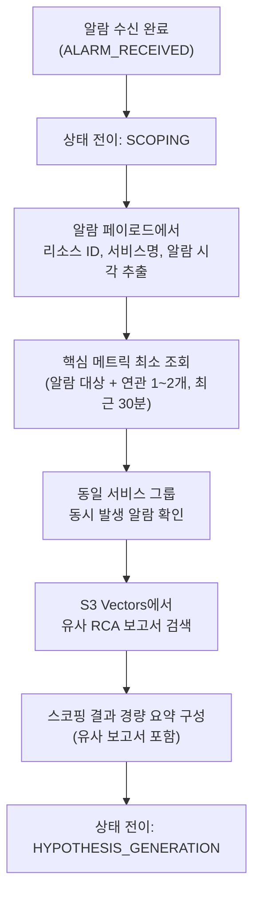

# ADR 0001: 초기 스코핑 + RCA 보고서 유사도 검색 (Roll-up)

Date: 2026-04-28

## Status

Accepted (2026-04-28)

## Context

RCA Agent는 알람 수신 후 가설을 생성하기 전에 **초기 스코핑** 단계를 거친다. 이 단계는 가설 생성에 필요한 최소 컨텍스트(영향 리소스, 증상, 이상 시작 시점, 영향 범위)와 **과거 유사 장애의 근본 원인 경로**를 함께 확보하는 것을 목표로 한다.

## Decision Drivers

- 스코핑은 전체 RCA 시간 예산 20분 중 첫 5분 내에 완료되어야 한다. 스코핑이 늘어지면 가설 검증에 쓸 시간이 줄어든다.
- 가설 생성에 필요한 최소 컨텍스트는 확보되어야 한다. 컨텍스트가 부족하면 초기 가설 질이 낮아 검증 루프가 길어진다.
- 유사한 과거 장애의 "증상 → 근본 원인" 추론 경로가 가설 생성에 직접 반영되어야 한다.
- 로그 전문 검색 같은 상세 수집은 가설이 정해진 뒤에 해야 한다. 가설 없이 수집한 데이터는 대부분 쓰이지 않는다.
- 과거 경험 조회의 실패가 RCA 시작을 막아서는 안 된다.

## Decision

**얕은 스코핑(Shallow Scoping) + S3 Vectors 기반 유사 RCA 보고서 검색** 전략을 채택한다.

### 스코핑 흐름

```mermaid
flowchart TD
    Start["알람 수신 완료<br/>(ALARM_RECEIVED)"] --> UpdateState["상태 전이: SCOPING"]
    UpdateState --> ExtractContext["알람 페이로드에서<br/>리소스 ID, 서비스명, 알람 시각 추출"]
    ExtractContext --> QueryMetrics["핵심 메트릭 최소 조회<br/>(알람 대상 + 연관 1~2개, 최근 30분)"]
    QueryMetrics --> CheckBlast["동일 서비스 그룹<br/>동시 발생 알람 확인"]
    CheckBlast --> SearchReports["S3 Vectors에서<br/>유사 RCA 보고서 검색"]
    SearchReports --> Summarize["스코핑 결과 경량 요약 구성<br/>(유사 보고서 포함)"]
    Summarize --> NextState["상태 전이: HYPOTHESIS_GENERATION"]
```

### 핵심 결정사항

1. **얕은 스코핑 원칙**: 가설을 세울 수 있는 최소한의 컨텍스트만 수집한다. 알람 대상 메트릭과 핵심 연관 메트릭 1~2개를 최근 30분 기준으로 조회하며, 로그 전문 검색이나 트레이스 분석은 하지 않는다. 상세 데이터 수집은 가설 검증 단계에서 수행한다.

2. **영향 범위 개략 파악**: 동일 서비스 그룹의 동시 발생 알람 유무만 확인하여 단일 리소스 문제인지 광범위 장애인지 식별한다. 리소스 태그 기반 서비스 그룹 식별을 우선 시도하되, 태그가 없으면 알람 대상 리소스만으로 진행한다.

3. **S3 Vectors 기반 유사 RCA 보고서 검색**: 알람 컨텍스트를 벡터화하여 RCA 보고서 인덱스에서 유사도 검색을 수행한다. 유사도 **0.7 이상**인 상위 **3개** 보고서를 가설 생성 단계로 전달한다. 임계치를 플레이북 병합보다 낮게 두는 이유는, 여기서는 병합이 아니라 참고 컨텍스트를 주입하므로 느슨한 관련성도 가설 생성에 도움이 되고 확정 여부가 프롬프트에서 가중치를 조절하기 때문이다([ADR 0008](0008-playbook-generation.md)). 상위 3개로 제한하는 것은 프롬프트 비대화를 막는 상한이다. 보고서 인덱스가 비어 있거나 검색이 실패해도 스코핑은 빈 결과로 계속 진행한다(비차단).

   S3 Vectors는 cosine **거리**를 반환하므로 임계치와 비교하기 전에 `유사도 = 1 - 거리`로 변환한다. 거리를 유사도로 직접 쓰면 관련도 순서가 역전되어 가장 무관한 보고서가 통과하므로, 이 변환과 메타데이터 조회 요청은 벡터 인덱스 어댑터 한 곳에만 두고 검색 경로를 단일화한다.

4. **구조화 임베딩 템플릿**: 저장과 검색이 동일한 템플릿(장애 유형 · 증상 · 메트릭)으로 임베딩 텍스트를 만들어 임베딩 공간 일관성을 보장한다. 각 필드는 상한 길이로 truncate하며, 저장과 검색에 각 용도에 맞는 임베딩 입력 유형을 적용한다. 같은 템플릿을 플레이북 인덱스에도 적용해 두 인덱스 간 공간 일관성을 유지한다([ADR 0008](0008-playbook-generation.md)).

   "동일 템플릿"은 렌더링 경로를 하나로 공유하는 것으로 강제한다. 저장 측과 검색 측이 각자 문자열을 조립하면 truncate 방식이나 빈 필드 처리가 갈라지고(예: 트리거 없는 알람에서 메트릭 레이블만 남는 경우) 같은 장애가 서로 다른 벡터로 매핑된다. 이 어긋남은 검색 결과가 조용히 비는 형태로만 드러나므로, 두 인덱스의 저장·검색이 같은 텍스트를 만드는지 테스트로 고정한다.

5. **정성적(qualitative) 요약 전략**: 임베딩되는 증상·근본 원인 필드에 구체적 수치(임계치, 퍼센트, 타임스탬프)를 포함하지 않는다. LLM에 "abnormally high", "exceeds threshold", "sustained spike" 같은 정성적 표현을 사용하도록 지시한다. 숫자가 다른 동일 패턴 장애(예: CPU 85% vs 92%)가 유사도 검색에서 매칭되어야 하기 때문이다.

6. **보고서 인덱싱 시점**: RCA 보고서가 저장된 직후 동일 파이프라인에서 벡터 인덱싱을 수행한다. 벡터 인덱스 메타데이터는 크기 제한이 있으므로 증상 요약, 근본 원인, 가설 경로 첫 항목, 확정 여부, RCA 식별자만 담고 상세는 보고서 본문에서 조회한다. 인덱싱을 후속 배치로 미루면 직후 발생한 유사 장애가 방금 얻은 경험을 참조할 수 없다.

7. **스코핑 결과 경량 구조**: 스코핑 결과를 알람 요약, 이상 시점, 영향 범위 추정, 초기 심각도, 메트릭 관측, 동시 발생 알람, 유사 보고서 목록, 원본 알람 페이로드로 구성한 경량 구조로 가설 생성 단계에 전달한다. 수집한 원본 데이터를 그대로 넘기지 않는다 — 가설 생성 프롬프트가 비대해지면 LLM 주의가 분산된다.

   **메트릭 관측은 관측한 것을 보존하는 형태를 가진다.** 지표마다 조회 구간, 그 구간의 데이터포인트 시퀀스, 관측한 추세, 단위를 보유한다. 동시 발생 알람은 알람 이름과 그 시점의 상태를 함께 보유한다. 어떤 지표를 볼지는 제한하지 않으며 관측이 비어도 스코핑은 진행한다(11번) — 계약이 규정하는 것은 관측의 **형태**이고, 무엇을 관측할지는 모델의 판단이다.

   현재 값과 기준선 두 숫자만 넘기면 하류 단계가 **"지금 높다"만 알고 "계속 오르는 중인가, 한 번 튀었다 내려왔나"를 구별할 수 없다.** 그 구별은 커넥션 누수와 일시적 부하를 가르는 근거이므로, 두 숫자로 압축한 뒤에는 어느 프롬프트로도 복원되지 않는다. 마찬가지로 2번이 요구한 동시 발생 알람 확인 결과를 구조에 담지 않으면, 확인은 수행되어도 그 사실이 검증 단계에 도달하지 못해 "다른 알람은 발화하지 않았다"는 반대 서술이 근거 없이 성립한다.

   **추세는 모델이 판정하고 서버는 시퀀스와의 정합만 검사한다.** 데이터포인트 두 개 미만으로 추세를 단정하는 것은 거부하되, 어떤 형태로 읽을지는 모델에 남긴다. 추세를 서버 규칙으로 도출하면 규칙이 알지 못하는 형태(계단형·톱니형·주기적 진동)를 가장 가까운 항목으로 뭉개고, 그 판정을 모델이 반박할 수 없다. 추세는 파괴적 액션이나 해결 판정과 달리 **되돌릴 수 없는 결정이 아니므로** 서버가 권위를 가질 이유가 없다 — 오독은 다음 검증 루프가 교정하고 외부 상태를 바꾸지 않는다. 서버의 권위는 관측이 버려지지 않게 하는 데까지다.

   이 형태는 두 엔진이 공유한다. 한쪽만 시퀀스를 보유하면 같은 장애에 대한 두 엔진의 판정이 관측 품질 차이로 갈리고, 엔진 비교라는 dual-stack의 목적이 무의미해진다.

8. **가설 생성 프롬프트 주입**: 유사 보고서 검색 결과를 가설 생성 프롬프트에 별도 섹션으로 주입한다. 각 보고서의 근본 원인, 증상 요약, 가설 경로, 확정 여부를 함께 전달하고, 확정된 보고서의 근본 원인에 더 높은 신뢰도를 부여하도록 지시한다. 확정 여부를 숨기면 추정 원인이 검증된 원인과 같은 무게로 가설을 오도한다.

9. **5분 타임아웃 강제 완료**: 스코핑이 5분을 초과하면 그 시점까지 수집된 데이터만으로 강제 완료한다. 메트릭 데이터가 없더라도 알람 페이로드와 유사 보고서만으로 가설 생성에 진입한다. 스코핑 지연이 검증에 쓸 시간을 잠식하는 것이 컨텍스트 부족보다 큰 손해다.

10. **CloudWatch MCP 기반 메트릭 조회**: 스코핑은 CloudWatch MCP 서버를 도구로 사용해 메트릭을 조회하고, 에이전트가 관측 API를 직접 호출하지 않는다([ADR tools/0001](../tools/0001-metrics-collection.md)).

11. **비차단 실행 + fallback**: 유사 보고서 검색은 exponential backoff로 재시도하되 최종 실패 시 빈 결과로 진행한다. LLM 호출에는 타임아웃을 강제하고, 타임아웃이나 실패 시 알람 페이로드만으로 최소 스코핑 결과를 반환한다. 스코핑은 RCA의 입력을 만드는 단계이므로 어떤 실패도 파이프라인 진행을 막지 않는다.

12. **별도 인덱스 운영**: 보고서 인덱스와 플레이북 인덱스를 분리해 독립 관리한다. 스코핑 경로는 보고서 인덱스만 조회한다. 한 인덱스에 두 종류를 섞으면 유사도 순위가 서로를 밀어내고, 인덱스별 임계치를 따로 조정할 수 없다([ADR 0008](0008-playbook-generation.md)).

13. **모델 티어**: 스코핑은 **Execution 티어**를 사용한다. 도구 호출과 얕은 분석으로 구성되어 깊은 추론이 불필요하다([ADR 0010](0010-model-tier-architecture.md)).

### 대안 검토

| 접근 | 평가 | 결론 |
|---|---|---|
| **깊은 스코핑(Deep Scoping)**: 모든 관련 메트릭·로그·트레이스를 스코핑 단계에서 수집 | 정보 풍부하나 가설 없이 수집하면 불필요한 데이터가 대부분이며 5분 예산을 넘긴다 | 기각 |
| **스코핑 없이 바로 가설 생성**: 알람 페이로드만으로 가설 생성 | 빠르지만 컨텍스트 부족으로 초기 가설 질이 낮아 검증 루프가 길어짐 | 기각 |
| **얕은 스코핑 + 유사 플레이북 검색**: 플레이북 인덱스에서 과거 대응 절차 검색 | 플레이북은 "어떻게 대응하는가" 중심이라 가설 생성에 필요한 "증상 → 근본 원인" 경로가 빈약 | 기각 |
| **얕은 스코핑 + 유사 RCA 보고서 검색**: 보고서의 근본 원인과 가설 경로를 직접 주입 | 가설 생성에 필요한 추론 경로를 가장 직접 제공 | **채택** |
| **보고서 + 플레이북 병행 검색**: 두 인덱스 모두 조회 | 스코핑 지연이 2배, 가설 프롬프트가 비대해져 LLM 주의 분산 | 기각 |

## Consequences

### Positive

- 5분 내 스코핑 완료로 가설 검증에 충분한 시간 확보
- 과거 RCA의 "증상 → 근본 원인" 추론 경로를 가설 생성에 직접 반영하여 초기 가설 정확도 향상
- 동일 임베딩 템플릿 + 정성적 요약으로 숫자가 다른 동일 패턴 장애 간 높은 유사도 매칭
- 스코핑 시 벡터 검색 1회만 수행되어 지연 증가 없음 (플레이북 병행 대비)
- 메트릭 데이터 부재 시에도 알람 페이로드 + 유사 보고서만으로 가설 생성 진입 가능

### Negative

- 보고서가 축적되지 않은 초기 단계에서는 유사 검색 효용이 제한적 (빈 컨텍스트로 가설 생성)
- 오판된 RCA 보고서의 근본 원인이 향후 가설 생성을 오도할 수 있음
- S3 Vectors 저장 비용이 보고서 인덱스만큼 추가 발생

### Risks

- 미확정 추정 근본 원인이 높은 유사도로 매칭되면 잘못된 가설을 높은 우선순위로 생성할 수 있다. 확정 여부를 프롬프트에 노출하여 LLM이 가중치를 조절하도록 한다.
- 유사도 임계치가 너무 높으면 관련 보고서를 놓치고, 너무 낮으면 무관한 보고서가 가설 생성을 오도할 수 있다. 운영 데이터를 바탕으로 임계치를 조정한다.
- 거리↔유사도 변환이 검색 경로마다 중복 구현되면 한쪽만 틀려도 조용히 순서가 역전된다. 변환·임계치·메타데이터 요청을 인덱스 어댑터에 모으고, 두 인덱스에 대해 동일 계약을 검증하는 테스트로 회귀를 막는다.
- 스코핑이 플레이북을 조회하지 않으므로 과거 대응 절차는 가설 생성 시점에 참조할 수 없다. 보고서의 가설 경로로 부분 보완되며, 대응 절차는 RCA 완료 후 플레이북 단계에서 다룬다.
- 관측 형태를 계약으로 두지 않으면 모델이 조회한 시계열을 스스로 두 숫자로 요약해 넘기고, 하류 단계는 그 요약만 본다. 라이브 실측에서 지속 상승 중인 커넥션 지표를 "단발적 급증"으로 읽어 가설이 기각되는 것을 관측했다. 조회는 정상 수행되었으므로 도구나 시간 예산의 문제가 아니라 관측 결과를 담을 형태가 없었던 것이며, 시퀀스를 필드로 요구해 막는다. 그 오독은 모델이 추세를 판정해서 생긴 것이 아니라 판정할 근거가 전달되지 않아서 생겼다.

  전환 뒤 같은 장애를 재실측해 두 엔진 모두 첫 검증 루프에서 원인을 확정했다(신뢰도 0.96, 0.93). 확정 증거가 스코핑 시퀀스와 대조해 "계단형 급증"으로 판정하고, 같은 구간 CPU·메모리가 평시 수준임을 근거로 쿼리 부하 증가를 배제했다 — 커넥션 누수와 부하 증가는 현재 값이 같으므로 이 판정은 추이 없이는 도달할 수 없다.
- 추세 어휘가 관측 형태를 모두 담지 못할 수 있다. 시퀀스가 함께 전달되므로 하류 단계가 원본을 읽어 다르게 해석할 수 있으며, 추세는 근거가 아니라 요약이다. 실측에서 어휘에 없는 "톱니형 등락"을 뭉개지 않고 서술하는 것을 확인했다 — 서버가 추세를 도출했다면 가장 가까운 항목으로 흡수됐을 형태다.

## Related

- [ADR agent/0002: 가설 트리 라이프사이클](0002-hypothesis-tree-lifecycle.md) — 스코핑 결과를 소비하는 가설 트리 단계
- [ADR agent/0007: RCA 보고서 생성](0007-rca-report-generation.md) — 벡터 인덱싱의 입력인 보고서 생성
- [ADR agent/0008: 플레이북 생성](0008-playbook-generation.md) — 동일 임베딩 템플릿을 공유하는 플레이북 인덱싱 (스코핑 경로에서는 비사용)
- [ADR agent/0010: 모델 티어 아키텍처](0010-model-tier-architecture.md) — 스코핑에 적용된 Execution 티어
- [ADR infra/0001: 알람 수신 아키텍처](../infra/0001-alarm-ingestion-sns-sqs-fargate.md) — 스코핑의 입력인 알람 페이로드 전달 경로
- [ADR infra/0002: 증거 저장](../infra/0002-evidence-storage.md) — 보고서와 플레이북을 S3 Vectors에 저장
