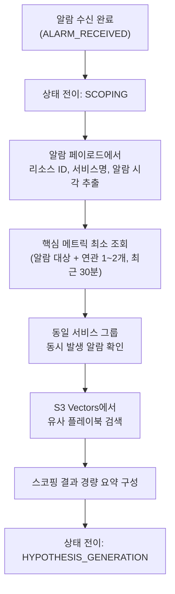

# ADR 0001: 초기 스코핑 전략 — 얕은 스코핑 + 유사 플레이북 검색

Date: 2026-04-21

## Status

Accepted

## Context

RCA Agent는 알람 수신 후 가설을 생성하기 전에 "초기 스코핑" 단계를 거쳐야 한다. 이 단계에서 에이전트는 알람 컨텍스트를 파악하고 영향 범위를 개략적으로 확인하여, 가설 생성에 충분한 최소한의 정보를 수집한다.

스코핑 설계 시 다음 요구사항이 있다:

1. **속도**: 스코핑이 길어지면 전체 RCA 시간(목표 20분)에서 가설 검증에 쓸 시간이 줄어든다. 5분 이내에 완료되어야 한다
2. **충분성**: 가설 생성에 필요한 최소 컨텍스트(어떤 리소스에서, 어떤 증상이, 언제부터, 얼마나 넓은 범위로)를 확보해야 한다
3. **과거 경험 활용**: 유사한 장애가 이전에 발생한 적이 있다면 해당 플레이북을 참고하여 가설 생성의 정확도를 높여야 한다
4. **깊은 조사 회피**: 상세한 데이터 수집(로그 전문 검색, 트레이스 분석 등)은 가설 검증 단계에서 수행하므로 스코핑에서는 하지 않아야 한다

검토한 대안:

- **깊은 스코핑(Deep Scoping)**: 모든 관련 메트릭, 로그, 트레이스를 스코핑 단계에서 수집 — 정보는 풍부하나 시간 소모가 크고, 가설 없이 수집하면 불필요한 데이터가 대부분
- **스코핑 없이 바로 가설 생성**: 알람 페이로드만으로 가설 생성 — 빠르지만 컨텍스트 부족으로 초기 가설의 질이 낮아 검증 루프가 길어질 수 있음
- **얕은 스코핑(Shallow Scoping)**: 핵심 메트릭만 최소 조회 + 유사 플레이북 검색으로 가설 생성에 충분한 컨텍스트를 빠르게 확보

## Decision

**얕은 스코핑(Shallow Scoping) + S3 Vectors 기반 유사 플레이북 검색** 전략을 채택한다.

### 스코핑 흐름

### 핵심 결정사항

1. **얕은 스코핑 원칙**: 스코핑은 "가설을 세울 수 있는 정도"로만 수행한다. 알람 대상 메트릭과 핵심 연관 메트릭 1~2개만 최근 30분 추이를 조회하며, 로그 전문 검색이나 트레이스 분석은 하지 않는다. 상세 데이터 수집은 가설 검증 단계(F5~F9)에서 수행한다.

2. **S3 Vectors 기반 유사 플레이북 검색**: 알람 컨텍스트(알람 유형, 서비스명, 증상)를 벡터화하여 S3 Vectors에서 유사도 검색을 수행한다. 유사도 임계치(0.7 이상)를 충족하는 상위 3개 플레이북을 가설 생성에 참고 자료로 전달한다. 플레이북이 없거나 검색에 실패해도 흐름은 중단되지 않는다.

3. **영향 범위 개략 파악**: 동일 서비스 그룹에서 동시 발생한 알람 유무만 확인하여 단일 리소스 문제인지 광범위한 장애인지를 개략적으로 식별한다. 리소스 태그 기반 서비스 그룹 식별을 우선 시도하되, 태그가 없으면 알람 대상 리소스만으로 진행한다.

4. **스코핑 결과 경량 JSON 구성**: 스코핑 결과를 알람 요약, 이상 시점, 영향 범위 추정, 초기 심각도, 유사 플레이북 참조로 구성한 경량 JSON으로 구조화하여 가설 생성 단계에 전달한다.

5. **5분 타임아웃**: 스코핑이 5분을 초과하면 그 시점까지 수집된 데이터만으로 강제 완료한다. 메트릭 데이터가 없더라도 알람 페이로드 정보만으로 가설 생성에 진입한다.

### CloudWatch MCP 기반 메트릭 조회

스코핑 에이전트는 CloudWatch MCP 서버(`awslabs.cw-mcp-server`)를 도구로 사용하여 메트릭을 조회한다. MCP 서버가 CloudWatch API 호출을 대행하므로 에이전트 코드에서 직접 API를 호출하지 않는다.

### Strands SDK structured output

스코핑 에이전트는 Strands Agents SDK의 `structured_output_model` 파라미터를 사용하여 Pydantic 모델(`ScopingOutput`)로 구조화된 결과를 반환받는다. SQS 배치 처리 특성상 비스트리밍(`streaming=False`) 모드로 호출한다.

### 타임아웃 및 fallback

`ThreadPoolExecutor`로 5분(300초) 타임아웃을 강제하며, 타임아웃 또는 에이전트 실패 시 알람 페이로드만으로 구성된 fallback `ScopingResult`를 반환하여 파이프라인이 중단되지 않도록 한다.

### 모델 티어

스코핑 에이전트는 **Execution 티어**(Haiku 4.5)를 사용한다. CloudWatch MCP 도구 호출 + 얕은 분석으로 구성되어 고도의 추론이 불필요하며, 비용 효율을 우선한다. 상세한 모델 티어 설계는 [ADR agent/0010](0010-model-tier-architecture.md) 참조.

### 플레이북 검색 재시도

S3 Vectors 유사 플레이북 검색은 exponential backoff(base 1초, 최대 3회 재시도)로 일시적 오류를 처리한다. 검색 실패 시에도 빈 결과로 진행한다.

## Consequences

### Positive

- 5분 이내 스코핑 완료로 전체 RCA 시간 예산(20분) 중 가설 검증에 충분한 시간 확보
- 유사 플레이북 검색으로 과거 장애 경험을 가설 생성에 반영하여 초기 가설의 정확도 향상
- 불필요한 깊은 조사를 회피하여 LLM 토큰 비용과 API 호출 비용 절감
- 메트릭 데이터 부재 시에도 알람 페이로드만으로 가설 생성에 진입 가능한 탄력성 확보

### Negative

- 얕은 스코핑으로 인해 초기 가설의 컨텍스트가 제한적일 수 있으며, 이 경우 가설 검증 단계에서 추가 데이터 수집이 필요
- S3 Vectors에 충분한 플레이북이 축적되기 전까지는 유사 플레이북 검색의 효용이 제한적

### Risks

- 유사도 임계치(0.7)가 너무 높으면 관련 플레이북을 놓칠 수 있고, 너무 낮으면 무관한 플레이북이 가설 생성을 오도할 수 있다. MVP 운영 데이터를 바탕으로 임계치를 조정한다.
- 연관 메트릭 1~2개만 조회하는 전략이 복합적인 장애 시나리오에서는 영향 범위를 과소 추정할 수 있다. 가설 검증 단계에서 추가 메트릭 수집으로 보완한다.

## Related

- [ADR infra/0001: 알람 수신 아키텍처](../infra/0001-alarm-ingestion-sns-sqs-fargate.md) — 스코핑의 입력인 알람 페이로드가 전달되는 경로
- [ADR agent/0008: 플레이북 생성](0008-playbook-generation.md) — S3 Vectors에 플레이북을 저장하는 기능으로, 스코핑의 유사 플레이북 검색에 데이터를 공급
