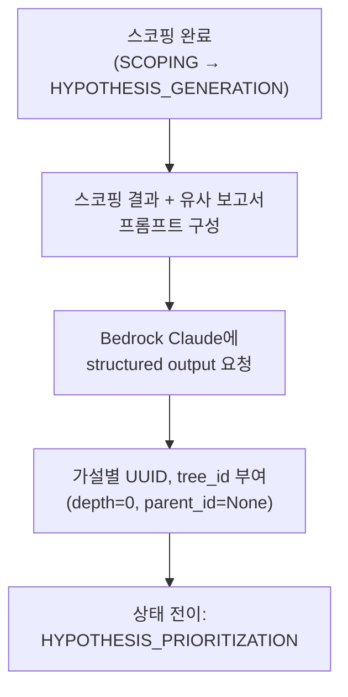

# ADR 0002: 가설 생성 — LLM 기반 Top 3~5 가설 트리 생성

Date: 2026-04-21

## Status

Accepted (ADR 0016으로 일부 개정: 유사 플레이북 → 유사 RCA 보고서)

> 2026-04-28 업데이트: 가설 생성 시 참조하던 "유사 플레이북"이 **유사 RCA 보고서**로 교체되었다.
> 변경 배경과 세부사항은 [ADR 0016](0016-report-similarity-search.md) 참조.

## Context

RCA Agent는 초기 스코핑 완료 후 장애의 가능한 원인을 체계적으로 도출해야 한다. 가설 생성 설계 시 다음 요구사항이 있다:

1. **구조화된 출력**: 가설이 트리 루트 노드로 저장되어 이후 검증/분기/가지치기에 활용되어야 한다
2. **카테고리 분류**: 배포 변경, 리소스 병목, 트래픽 급증, 의존 서비스 장애, 설정 변경 등 사전 정의된 카테고리로 분류하여 검증 전략을 체계화해야 한다
3. **과거 경험 반영**: 유사한 과거 장애의 RCA 보고서가 있으면 해당 장애 패턴의 근본 원인과 가설 경로를 우선 반영해야 한다
4. **적절한 수량**: 너무 적으면 실제 원인을 놓칠 수 있고, 너무 많으면 검증 비용이 증가한다

검토한 대안:

- **규칙 기반 가설 생성**: 알람 유형별 사전 정의 가설 목록에서 선택 — 빠르지만 미리 정의하지 않은 장애 패턴에 대응 불가
- **LLM 자유 형식 분석**: LLM에 스코핑 결과를 전달하고 자유 텍스트로 분석 — 유연하나 구조화가 어렵고 이후 단계 자동화에 부적합
- **LLM 구조화 가설 생성**: 스코핑 결과 + 유사 RCA 보고서를 LLM에 전달하고 구조화된 가설 목록을 반환받음

## Decision

**LLM 구조화 가설 생성 + 유사 RCA 보고서 우선 반영** 전략을 채택한다.

### 가설 생성 흐름

### 핵심 결정사항

1. **Strands SDK structured output**: 스코핑 결과와 유사 RCA 보고서를 프롬프트에 포함하여 Strands Agents SDK의 `structured_output_model` 파라미터로 `HypothesisOutput` Pydantic 모델을 지정한다. SDK가 출력 파싱을 처리하므로 프롬프트에 JSON 포맷 지시가 불필요하다. 비스트리밍 모드(`streaming=False`)로 호출한다. Pydantic 모델의 `max_length=5` 제약으로 레벨당 최대 5개 가설을 하드 제한하며, 생성 후에도 방어적으로 5개를 초과하면 잘라낸다.

2. **가설 구조**: 각 가설은 설명, 카테고리(DEPLOYMENT/INFRASTRUCTURE/TRAFFIC/DEPENDENCY/CONFIGURATION), 초기 신뢰도(0.0~1.0), 필요 증거 목록, 참조한 플레이북 ID(있는 경우)를 포함한다. `referenced_playbook_id` 필드는 과거 호환성 목적으로 유지되나, 가설 생성 프롬프트에는 더 이상 플레이북이 주입되지 않으므로 실질적으로는 비어 있다.

3. **트리 노드 할당**: 생성된 가설에 UUID 기반 `hypothesis_id`와 공통 `tree_id`를 부여하며, 루트 노드이므로 `depth=0`, `parent_id=None`으로 설정한다. DynamoDB 저장은 오케스트레이션 레이어에서 별도 구현 예정이다.

4. **유사 보고서 활용**: 유사 RCA 보고서의 `root_cause`(확정/추정 근본 원인), `incident_summary`(증상), `hypothesis_path`(증상 → 근본 원인 추론 경로), `confirmed`(확정 여부)를 프롬프트에 주입하여 가설 생성 시 우선순위와 검증 전략에 반영한다. 확정된 보고서의 근본 원인에 더 높은 신뢰도를 부여하도록 프롬프트에 지시한다. 유사 보고서가 없는 경우 LLM의 일반 지식으로 가설을 생성한다.

5. **3분 타임아웃 + 최대 3회 재시도**: 시도당 3분(180초) 타임아웃을 `ThreadPoolExecutor`로 강제하며, 파싱 실패 또는 타임아웃 시 최대 3회 재시도한다. 모든 시도 실패 시 빈 가설 목록을 반환한다.

6. **모델 티어**: **Planning 티어**(Sonnet 4.6 + adaptive thinking)를 사용한다. 다각도 근본 원인 추론이 핵심이므로 adaptive thinking으로 모델이 복잡도에 맞춰 사고량을 자율 조절한다. [ADR agent/0010](0010-model-tier-architecture.md) 참조.

## Consequences

### Positive

- LLM의 추론 능력으로 사전 정의하지 않은 장애 패턴에도 가설 도출 가능
- 유사 RCA 보고서의 "증상 → 근본 원인" 추론 경로 반영으로 반복 장애에 대한 가설 정확도 향상
- 구조화된 출력으로 이후 우선순위 결정, 검증, 가지치기 자동화 용이

### Negative

- Bedrock API 호출 비용이 가설 생성마다 발생 (재시도 시 추가 비용)
- RCA 보고서가 축적되기 전까지는 과거 경험 반영의 효용이 제한적

### Risks

- LLM이 알람과 무관한 가설을 생성할 수 있다. 프롬프트에 스코핑 결과를 구체적으로 포함하여 완화한다.
- 확정되지 않은(`confirmed=false`) 보고서의 추정 근본 원인이 오판일 경우 가설을 오도할 수 있다. 검색 결과에 확정 여부를 표시하여 LLM이 가중치를 조절하도록 한다.
- 3회 재시도 모두 실패 시 빈 가설 목록이 반환되어 파이프라인이 조기 종료된다. 이 경우 로그에 에러를 기록하여 모니터링한다.

## Related

- [ADR agent/0001: 초기 스코핑 전략](0001-initial-scoping-strategy.md) — 가설 생성의 입력인 스코핑 결과를 생성하는 단계
- [ADR agent/0016: 보고서 기반 유사도 검색](0016-report-similarity-search.md) — 유사 보고서 검색 방식과 가설 생성 주입 전략
