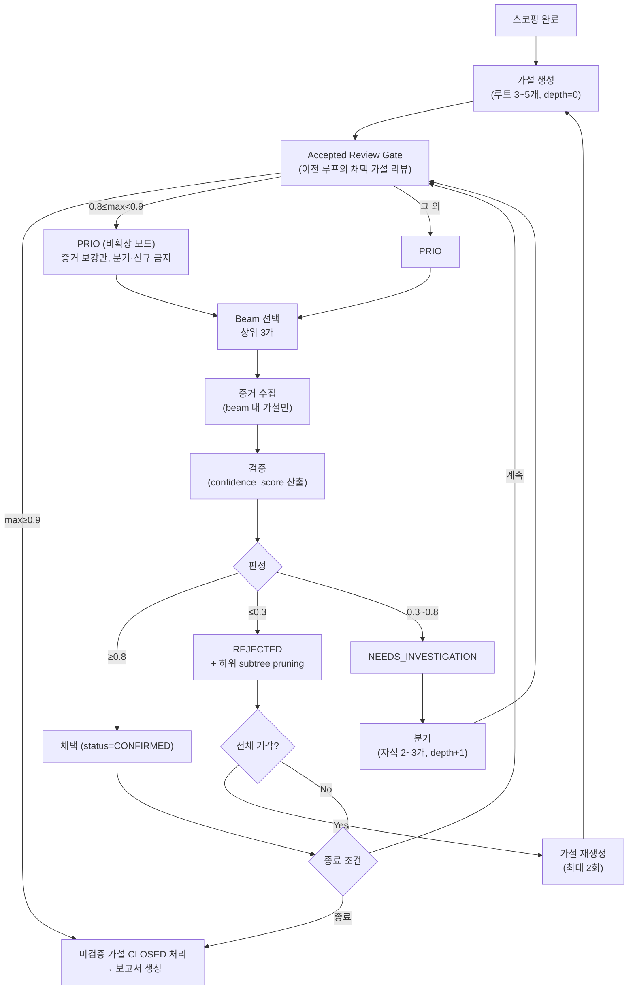

# ADR 0002: 가설 트리 라이프사이클 — 생성·우선순위·검증·분기·Beam 탐색 (Roll-up)

Date: 2026-04-28

## Status

Accepted (2026-04-28)

## Context

RCA Agent는 스코핑 결과를 바탕으로 **가설 트리**를 생성하고, 증거 수집·검증·분기를 반복하여 근본 원인에 수렴해야 한다.

## Decision Drivers

- 가설은 루트에서 시작해 필요 시 분기되므로, 우선순위·검증·분기 단계가 각 노드의 상태를 일관되게 관리할 수 있어야 한다.
- 모든 미검증 가설을 매 루프마다 검증하면 트리 분기 누적 시 LLM 호출이 폭발한다. 20분 시간 예산 안에 근본 원인에 수렴해야 한다.
- 확정·기각·추가조사의 경계는 코드에서 일관되게 적용해야 한다. LLM 판단의 편차가 파이프라인을 왜곡해서는 안 된다.
- 무제한 분기는 탐색 폭발을 야기하므로 깊이와 폭에 상한이 필요하다.
- 단일 경로 탐색은 복합 원인을 놓치고 전체 검증은 비용이 폭증한다. 둘 사이의 균형이 필요하다.

## Decision

**구조화된 가설 트리 + LLM 기반 판단 + Beam Search + Accepted Review Gate** 전략을 채택한다. 가설의 생성·우선순위 결정·검증·분기 네 단계가 공통 도메인 모델을 공유하며, 검증 루프는 우선순위 상위 N개만 선택적으로 검증하는 Beam Search 방식으로 운영된다. 매 검증 루프 진입 시 **Accepted Review Gate**가 먼저 기존 채택 가설을 리뷰하여 추가 탐색 필요 여부를 판단한다.

### 상태 용어 (Terminology)

사용자가 보는 표현(문서·UI·프롬프트)에서 확정된 가설을 **"채택(Accepted)"**으로 표기한다. 반면 저장·전송되는 상태 값은 `CONFIRMED`를 유지한다. 표현 변경이 저장 스키마까지 내려가면 이미 기록된 세션·보고서 조회가 깨지므로, 변경 범위를 표현 계층으로 한정한다.

### 가설 트리 라이프사이클

### 공통 도메인 모델

가설 노드는 트리 정체성(자신과 트리 식별자, 부모 참조, 깊이), 내용(설명, 카테고리, 필수 증거), 판정(신뢰도, 상태)을 갖는다. 카테고리는 DEPLOYMENT / INFRASTRUCTURE / TRAFFIC / DEPENDENCY / CONFIGURATION 다섯 가지이며, 상태는 PENDING에서 시작해 CONFIRMED / REJECTED / NEEDS_INVESTIGATION / CLOSED 중 하나로 귀결된다.

카테고리를 다섯 가지로 고정하는 이유는 두 가지다. 검증 전략을 카테고리별로 체계화할 수 있고, 가설 생성 시 카테고리 분포를 보아 단일 원인 가정에 빠졌는지 판정할 수 있다.

### 1. 가설 생성

- **LLM 구조화 출력**: 가설 목록을 구조화 출력으로 받아 이후 단계가 파싱 없이 소비한다.
- **개수 제한**: 루트 레벨 3~5개. 스키마 제약으로 상한을 강제하며 초과 시 방어적으로 잘라낸다. 하한 3개는 단일 원인 가정을 막고, 상한 5개는 첫 루프의 검증 비용을 묶는다.
- **카테고리 필수**: 각 가설은 5개 카테고리 중 하나에 분류되어 검증 전략을 체계화한다.
- **유사 보고서 주입**: 스코핑에서 전달된 유사 RCA 보고서를 프롬프트에 포함해 과거 경험을 우선 반영하고, 확정된 보고서의 근본 원인에 더 높은 신뢰도를 부여하도록 지시한다([ADR 0001](0001-initial-scoping-and-report-similarity.md)).
- **재시도**: 시도당 타임아웃과 **최대 3회** 재시도를 두고, 모두 실패하면 빈 가설 목록을 반환해 파이프라인이 미확정 보고서로 종료되게 한다. 무한 재시도는 20분 예산을 가설 생성에서 소진시키므로 실패를 미확정 결과로 확정한다.
- **전체 기각 후 재생성**: 검증 결과 모든 가설이 기각되면 가설 생성으로 루프백한다. 재생성은 **최대 2회**까지만 허용한다 — 무제한 재생성은 20분 예산을 가설 생성에만 소모한다.
- **모델 티어**: Planning 티어([ADR 0010](0010-model-tier-architecture.md)).
- **5 Whys 사고 프레임 (Toyota / AWS COE)**: 각 가설은 "증상에 대한 1차 '왜?'의 답 후보" 로 구성하여, 분기 단계에서 다시 "왜 그게 발생했는가?" 로 한 단계 더 내려갈 수 있어야 한다. 다음 가드레일을 프롬프트에 강제한다.
  - **"휴먼 에러" 종착 금지**: 운영자 실수로 귀결되는 가설은 검증 부재·권한 과다·런북 결함 등 시스템·프로세스 결함으로 풀어 표현.
  - **단일 원인 가정 회피**: 카테고리 분포가 다양하도록 다요인 후보를 제시 — 한 카테고리에 모든 가설을 몰지 않는다.
  - **사실 기반 검증성**: `description`에 "어떤 증거로 어떻게 검증할 것인가" 를 함께 명시. 검증 불가능한 추상적·심리적 원인은 금지.
  - **Blameless 톤**: 사람·팀을 특정하지 않고 시스템 관점으로만 작성.

  동일 가드레일이 cc-headless 엔진의 `hypothesis-generation` skill·서브에이전트 프롬프트에도 적용된다([ADR 0011](0011-cc-headless-prompt-driven-rca.md)). 보고서 단계 5 Whys 작성 규칙은 [ADR 0007](0007-rca-report-generation.md) 참조.

### 2. Accepted Review Gate (매 검증 루프 진입 시)

가설 생성 또는 직전 루프의 분기 이후, 우선순위 결정으로 진입하기 **직전에** 실행되는 게이트. 이전 루프에서 채택된(CONFIRMED 상태) 가설이 있을 때 추가 탐색이 필요한지 판정한다. 도입 이유는 게이트 부재 시 관측된 문제다 — 동일 원인 영역의 자식 가설이 반복 분기되면서 루프가 자연스럽게 수렴하지 못하고 최대 루프 한도까지 돌진하는 경향.

**입력**: 현재 가설 목록, 누적 judgment, 현재 루프 인덱스.

**판정 로직** (순수 코드, LLM 미사용):

| 조건 | 액션 |
|------|------|
| CONFIRMED 가설 중 max confidence ≥ 0.9 | `early_exit=True` 반환 → 루프 즉시 종료, 보고서 생성으로 전환 |
| CONFIRMED 가설 존재하나 0.8 ≤ max < 0.9 | `expansion_blocked=True` 반환 → 증거 보강만 허용, 새 분기·재생성 금지. 그 다음 루프에서도 0.9 돌파 실패 시 종료 |
| CONFIRMED 가설 없음 | gate 통과, 기존 흐름대로 진행 |

**Accepted-유사 자동 기각**: 채택 가설이 하나라도 존재하면, 미검증·추가조사 상태 가설 중 같은 카테고리이고 설명 토큰 유사도가 **0.6 이상**인 것은 자동 기각하고 그 근거를 판정 사유에 남긴다. 임계치를 0.6으로 보수적으로 두는 이유는 독립적이지만 표현이 비슷한 원인까지 묶여 기각되는 것을 막기 위함이다.

동일 영역 분기 누적을 근원에서 억제하는 가드레일이다. subtree pruning과 달리 부모가 기각되지 않았어도 **채택된 형제** 기준으로 prune한다.

**비확장 모드 세부**:

- 분기 호출 생략 — 추가조사 가설이 있어도 자식 생성 금지
- 전체 기각 시 재생성 생략 — 재생성 한도와 무관하게 스킵
- 증거 수집 + 검증은 계속 수행하여 max confidence를 0.9 이상으로 끌어올리는 것만 목표
- 해당 루프 종료 후 gate 재실행. 여전히 0.8~0.9이면 다음 루프도 비확장. **연속 2회** 비확장에도 0.9 미도달이면 조기 종료로 전환한다 — 증거 보강만으로 임계를 넘지 못하는 가설은 추가 루프로도 확정되지 않는다.

### 3. 우선순위 결정

- **LLM 동적 우선순위**: 각 가설의 순위, 필요 도구, 예상 소요, 병렬 그룹을 구조화 출력으로 받는다.
- **컨텍스트 기반 판단**: 알람 유형, 스코핑 결과, 가설 카테고리를 종합해 순서를 결정한다(예: 최근 배포가 확인되면 배포 가설 우선).
- **병렬 그룹**: 독립적 가설은 같은 그룹으로 묶어 병렬 검증 가능성을 표시한다.
- **Fallback**: LLM 실패나 타임아웃 시 카테고리 기본 순서(DEPLOYMENT > INFRASTRUCTURE > TRAFFIC > DEPENDENCY > CONFIGURATION)로 정렬한다. 우선순위 결정 실패가 탐색 자체를 막아서는 안 되며, 이 기본 순서는 배포가 가장 흔한 원인이라는 경험을 반영한다.
- **모델 티어**: Planning 티어.

### 4. Beam Search — 상위 N개 선택적 검증

- **Beam 선택**: 우선순위 결정 후 상위 **3개**만 증거 수집·검증·분기에 참여시킨다. 루프당 LLM 호출을 고정 폭으로 묶어 비용을 예측 가능하게 만드는 값이다.
- **상태 필터**: CONFIRMED/REJECTED는 beam 후보에서 제외한다. PENDING/NEEDS_INVESTIGATION만 후보.
- **비선택 가설 보존**: beam에 포함되지 않은 가설은 삭제하지 않고 목록에 유지한다. 다음 루프에서 우선순위가 재평가되어 beam에 진입할 수 있어 한 번 배제된 가설도 복귀 가능하다(DFS 백트래킹과 구분되는 특성).
- **증거 재사용**: beam 진입 가설 중 이전 루프에서 이미 증거가 수집된 가설은 재수집하지 않는다.

### 5. 증거 수집 및 검증

- **LLM 신뢰도 기반 3단 판정**: 검증 결과로 상태, 신뢰도, 판단 근거, 증거 요약, 검증된 원인 유형을 구조화 출력으로 받는다.
- **Score 기반 재분류**: LLM이 반환한 상태는 참고만 하고, **신뢰도를 기준으로 코드에서 상태를 재분류**한다:
  - `≥ 0.8` → **CONFIRMED**
  - `≤ 0.3` → **REJECTED**
  - 그 사이 → **NEEDS_INVESTIGATION**
  LLM의 상태 판단은 같은 증거에도 흔들리지만 신뢰도는 상대적으로 안정적이므로, 경계 판정의 권위를 코드가 갖는다.
- **복구 유형 독립 검증**: 가설 생성·분기 단계가 붙인 원인 유형은 조사 힌트일 뿐
  자동 복구의 권위가 아니다. 검증 단계가 실제 수집 증거를 기준으로 허용 목록
  원인 유형을 독립 분류하고, 확정 판정과 함께 저장된 검증 원인 유형만 후속 복구가
  사용할 수 있다. 확정되지 않았거나 증거가 부족하거나 설명·증거와 유형이 일치하지
  않으면 지원 불가로 저장해 복구를 fail-closed로 만든다([ADR 0012](0012-automated-remediation.md)).
- **증거 수집 실패 시 CONFIRMED 금지**: 증거 수집이 실패한 가설은 필수 증거 목록이 비어있지 않으면 확정을 금지하고 최대 NEEDS_INVESTIGATION까지만 허용한다. 이 가드레일이 없으면 LLM이 가설 설명만 보고 증거 없이 확정한다. 필수 증거를 요구하지 않는 가설은 증거 없이도 확정할 수 있다.
- **판단 근거 기록**: 판단 근거와 증거 요약을 검증 판정과 함께 남겨 보고서와 사후 검토에 사용한다.
- **REJECTED subtree pruning**: 가설이 기각되면 해당 노드의 하위 subtree 전체에 기각을 전파한다. 반증된 부모의 자식은 전제 자체가 무효다.
- **모델 티어**: Execution 티어. 증거-가설 일치도 판정은 분류 작업이므로 사고 없이 호출한다([ADR 0010](0010-model-tier-architecture.md)).

### 6. 하위 가설 분기

- **NEEDS_INVESTIGATION 대상**: 판정이 NEEDS_INVESTIGATION인 가설만 분기한다.
- **LLM 구조화 자식 생성**: 부모 가설, 수집된 증거, 기각된 가설 목록을 전달해 자식 가설을 구조화 출력으로 받는다. 기각 목록을 함께 주지 않으면 이미 반증된 방향이 자식으로 되살아난다.
- **자식 개수 제한**: 부모당 **최대 3개**. 스키마 제약으로 상한을 강제하고 초과 시 방어적으로 잘라낸다.
- **트리 확장**: 자식에 새 식별자를 부여하고 부모 참조와 깊이(부모+1)를 기록한다.
- **분기 깊이 제한**: 분기는 **깊이 3까지만** 확장한다. 상한에 도달한 부모는 LLM 호출 없이 분기를 건너뛴다. 5 Whys는 통상 3단계 안에서 시스템·프로세스 결함에 도달하며, 그보다 깊은 분기는 비용만 늘린다.
- **중복 방지**: 부모 가설과 기각된 가설에 대해 대소문자 무시 비교로 중복 자식을 제거한다.
- **모델 티어**: Planning 티어.
- **5 Whys 한 단계 내려가기**: 분기는 본질적으로 부모 가설에 대한 "왜 그게 발생했는가?" 의 답이다. 자식이 "휴먼 에러" 로 귀결되면 한 번 더 분기해 시스템·프로세스·설계 결함까지 내려간다. 자식의 `required_evidence` 는 부모보다 좁고 구체적이어야 한다. 가설 생성 단계의 4가지 가드레일이 동일하게 적용된다.

### 7. 루프 종료 시 정리

검증 루프가 종료되면(CONFIRMED 발견, 타임 버짓 소진, 최대 루프 도달 등) PENDING 또는 NEEDS_INVESTIGATION 상태로 남은 가설을 **CLOSED**로 처리한다. REJECTED는 증거에 의해 명시적으로 기각된 가설에만 사용하고, 예산 소진/미검증으로 종료된 가설은 CLOSED로 구분한다. best_hypothesis로 선택된 가설은 제외한다. 모든 가설이 CONFIRMED/REJECTED/CLOSED 중 하나의 최종 상태를 갖게 하여 세션 완료 시 상태 일관성을 보장한다. CC Headless에서도 산출물 파싱과 프롬프트로 동일 동작을 구현한다.

### 대안 검토

#### 가설 생성 방식

| 접근 | 평가 | 결론 |
|---|---|---|
| **규칙 기반**: 알람 유형별 사전 정의 가설 | 빠르지만 미리 정의하지 않은 패턴 대응 불가 | 기각 |
| **LLM 자유 형식**: 자유 텍스트 분석 | 유연하나 구조화 부족으로 이후 단계 자동화 불가 | 기각 |
| **LLM 구조화 생성**: structured output + 카테고리 | 구조화·자동화·유연성 모두 확보 | **채택** |

#### 검증 판단 방식

| 접근 | 평가 | 결론 |
|---|---|---|
| **규칙 기반**: 메트릭 임계치 정량 규칙 | 복합 증거 종합 불가 | 기각 |
| **LLM 신뢰도 기반**: confidence_score 산출 | 복합 증거 종합 + 3단 판단 가능 | **채택** |
| **하이브리드**: 규칙 1차 + LLM 2차 | MVP에서 복잡도 대비 이점 불분명 | 기각 |

#### 탐색 전략

| 접근 | 루프당 LLM 호출 | 잘못된 경로 탈출 | 복합 원인 탐지 | 비용 예측성 | 결론 |
|---|---|---|---|---|---|
| **DFS 백트래킹** | 1건 | 느림 (깊이 비례) | 불가 | 높음 | 기각 (불확실성 높은 RCA에 부적합) |
| **전체 일괄 검증** | 가설 수 비례 | 해당 없음 | 가능 | 낮음 (가변) | 기각 (분기 누적 시 비용 폭증) |
| **Beam Search (상위 N)** | N건 (고정) | 빠름 (다음 루프 재평가) | 가능 | 높음 (N으로 제어) | **채택** |

## Consequences

### Positive

- 공통 도메인 모델(hypothesis_id, tree_id, parent_id, depth, status)로 4단계 간 일관된 관리
- LLM 추론 능력으로 사전 정의하지 않은 장애 패턴에도 가설 도출
- 3단 판정으로 불확실한 가설에 점진적 탐색 가능
- Beam Search로 루프당 LLM 호출이 N건으로 고정되어 비용 예측 가능
- 유망 가설에 리소스 집중 + 다중 경로 동시 탐색으로 복합 원인 탐지
- 깊이/폭 제한으로 무한 탐색 방지
- 증거 수집 실패 시 CONFIRMED 금지 가드레일로 증거 없는 오확정 방지
- 루프 종료 시 CLOSED 처리로 모든 가설이 최종 상태를 가져 세션 일관성 확보
- **Accepted Review Gate**로 중간에 결론이 난 경우 조기 종료, 동일 원인 영역의 중복 분기를 선제 차단하여 루프가 무의미하게 연장되는 현상 방지

### Negative

- 단계별 LLM 호출로 비용 누적 (가설 생성·우선순위·검증·분기 각각)
- LLM 판단 일관성이 완벽하지 않아 동일 증거에 다른 결과 가능 — confidence_score 재분류로 부분 완화
- Beam width가 너무 작으면 유효 가설이 검증 기회를 얻지 못할 수 있음
- 우선순위 결정 정확도에 대한 의존도 높음 — 우선순위 오류가 탐색 실패로 직결 가능
- Accepted-유사 자동 기각이 공격적이면 **독립적이지만 유사한 원인**도 묶여서 기각될 수 있음 — 유사도 임계치 0.6으로 보수 설정, 운영 데이터로 조정

### Risks

- 3회 재시도 모두 실패 시 빈 가설 목록이 반환되어 파이프라인이 조기 종료된다. 로그로 모니터링한다.
- 신뢰도 임계치(0.3, 0.8), beam width(3), 최대 깊이(3), 재생성 횟수(2)는 장애 유형에 따라 최적이 아닐 수 있다. 운영 데이터를 바탕으로 조정한다.
- 확정되지 않은(`confirmed=false`) 유사 보고서가 오판일 경우 가설을 오도할 수 있다. 프롬프트에 확정 여부를 노출하여 가중치 조절을 유도한다.
- 기각된 가설 목록을 우선순위 결정과 분기 단계에 컨텍스트로 제공하여 beam 오선택과 중복 분기를 완화한다.

## Related

- [ADR agent/0001: 초기 스코핑 + RCA 보고서 유사도 검색](0001-initial-scoping-and-report-similarity.md) — 가설 생성의 입력인 스코핑 결과와 유사 보고서 생성
- [ADR agent/0006: 중단 조건](0006-termination-conditions.md) — 검증 루프 종료 판단 기준 (확정 / 시간 예산 / 최대 루프 / 전체 기각 등)
- [ADR agent/0007: RCA 보고서 생성](0007-rca-report-generation.md) — 최적 가설과 검증 판단 근거를 소비하여 보고서 생성
- [ADR agent/0010: 모델 티어 아키텍처](0010-model-tier-architecture.md) — 각 단계의 Planning/Execution 티어 매핑
- [ADR agent/0014: 계층형 증거 수집 세션 격리](0014-hierarchical-evidence-session-isolation.md) — 증거 수집 컨텍스트 오버플로우 해결과 가설별 격리
