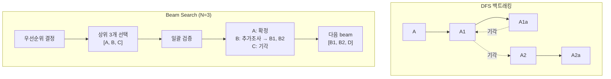

# ADR 0013: Beam Search 탐색 전략 — 우선순위 상위 N개 가설 선택적 검증

Date: 2026-04-23

## Status

Accepted

## Context

기존 검증 루프는 매 반복마다 **모든 PENDING/NEEDS_INVESTIGATION 가설**에 대해 증거 수집과 검증을 수행했다. 가설 트리가 분기를 거듭하면 검증 대상이 누적되어 LLM 호출 비용과 시간이 빠르게 증가한다. 20분 타임 버짓 내에 근본 원인을 찾아야 하는 운영 제약 하에서 효율적인 탐색 전략이 필요하다.

검토한 대안:

### 1. DFS 백트래킹

하나의 가설 경로를 깊이까지 탐색하고, 기각되면 형제 가설로 백트래킹하는 전통적인 깊이 우선 탐색.

- **장점**: 루프당 LLM 호출이 1건으로 비용 최소
- **단점**: 잘못된 가지에 깊이 진입하면 빠져나오기까지 시간이 낭비됨. 장애 원인이 초기에 낮은 우선순위로 분류된 경우 도달이 매우 지연됨. 복합 원인(다중 가설이 동시에 기여) 탐지 불가
- **RCA 맥락 적합성**: 낮음 — 장애 원인의 불확실성이 높은 초기 단계에서 단일 경로에 올인하는 리스크가 큼

### 2. 전체 일괄 검증 (기존 방식)

매 루프마다 살아있는 모든 가설을 동시에 검증.

- **장점**: 넓은 탐색으로 놓치는 가설 없음
- **단점**: 가설 수에 비례하여 LLM 호출이 증가. 트리 분기가 누적되면 루프당 비용이 급증. 우선순위가 낮은 가설에도 동일한 리소스를 투자
- **RCA 맥락 적합성**: 중간 — 정확하지만 비효율적

### 3. Beam Search (상위 N개 선택적 검증)

우선순위 결정 후 상위 N개 가설만 증거 수집·검증·분기를 진행. 나머지 가설은 다음 루프에서 재평가 대상으로 유지.

- **장점**: 비용과 정확도의 균형. 유망한 가설에 리소스 집중하면서도 다중 경로를 동시 탐색. N 조정으로 비용-정확도 트레이드오프 제어 가능
- **단점**: N이 너무 작으면 유효한 가설을 놓칠 수 있음
- **RCA 맥락 적합성**: 높음 — 시간 제약 하에서 유망한 방향에 집중하되, 단일 경로에 갇히지 않음

## Decision

**Beam Search 탐색 전략**을 채택한다. 검증 루프에서 우선순위 상위 N개(beam width) 가설만 선택하여 증거 수집·검증·분기를 수행한다.

### 핵심 결정사항

1. **Beam 선택**: 우선순위 결정(F3) 결과에서 `priority_rank` 기준 상위 N개를 선택한다. REJECTED/CONFIRMED 상태의 가설은 선택 대상에서 제외하고, PENDING/NEEDS_INVESTIGATION 상태만 후보로 삼는다.

2. **Beam Width 설정**: 환경 변수 `RCA_BEAM_WIDTH`로 설정 가능하며, 기본값은 3이다. 장애 복잡도에 따라 운영 시 조정할 수 있다.

3. **비선택 가설 보존**: beam에 포함되지 않은 가설은 삭제하지 않고 가설 목록에 유지한다. 다음 루프에서 우선순위가 재평가되어 beam에 진입할 수 있다. 이는 DFS 백트래킹과 달리 한 번 배제된 가설도 새로운 증거에 의해 우선순위가 올라갈 수 있음을 의미한다.

4. **가설 상태 동기화**: 검증 판정 결과(CONFIRMED/REJECTED/NEEDS_INVESTIGATION)를 가설 객체에 즉시 반영하여 다음 루프의 beam 선택에서 이미 확정/기각된 가설이 자동으로 제외되도록 한다.

5. **증거 수집 최적화**: beam에 포함된 가설 중 아직 증거가 수집되지 않은 가설에 대해서만 증거를 수집한다. 이전 루프에서 수집된 증거는 재사용한다.

### 탐색 전략 비교

| 기준 | DFS 백트래킹 | 전체 일괄 검증 | Beam Search |
|------|-------------|---------------|-------------|
| 루프당 LLM 호출 | 1건 | 가설 수 비례 | N건 (고정) |
| 잘못된 경로 탈출 | 느림 (깊이에 비례) | 해당 없음 | 빠름 (다음 루프에서 재평가) |
| 복합 원인 탐지 | 불가 | 가능 | 가능 (N개 병렬 탐색) |
| 비용 예측성 | 높음 (고정) | 낮음 (가변) | 높음 (N으로 제어) |
| 시간 효율 | 최악 케이스 나쁨 | 평균적으로 나쁨 | 균형 |

## Consequences

### Positive

- 루프당 LLM 호출 수가 beam width로 제한되어 비용 예측 가능
- 우선순위 높은 가설에 리소스가 집중되어 타임 버짓 내 수렴 확률 향상
- DFS와 달리 다중 경로를 동시에 탐색하여 복합 원인 탐지 가능
- beam width 조정으로 비용-정확도 트레이드오프를 운영 시 제어 가능

### Negative

- beam width가 너무 작으면 유효한 가설이 검증 기회를 얻지 못할 수 있음
- 우선순위 결정(F3)의 정확도에 대한 의존도가 높아짐 — 우선순위가 잘못되면 beam에 포함될 가설도 잘못됨

### Risks

- beam width가 가설 총 수보다 작을 때, 우선순위 결정의 오류가 탐색 실패로 직결될 수 있다. 기각된 가설 목록을 LLM 우선순위 결정에 컨텍스트로 제공하여 완화한다.
- beam width 기본값 3이 특정 장애 유형에 부적합할 수 있다. 운영 데이터를 바탕으로 장애 유형별 최적값을 도출한다.

## Related

- [ADR agent/0003: 가설 우선순위 결정](0003-hypothesis-prioritization.md) — beam 선택의 기반이 되는 우선순위 결정
- [ADR agent/0004: 가설 검증 및 가지치기](0004-hypothesis-validation-pruning.md) — beam 내 가설의 검증 판정 기준
- [ADR agent/0005: 하위 가설 분기](0005-hypothesis-branching.md) — beam 내 NEEDS_INVESTIGATION 가설의 분기
- [ADR agent/0006: 중단 조건](0006-termination-conditions.md) — beam search 루프의 종료 판단
