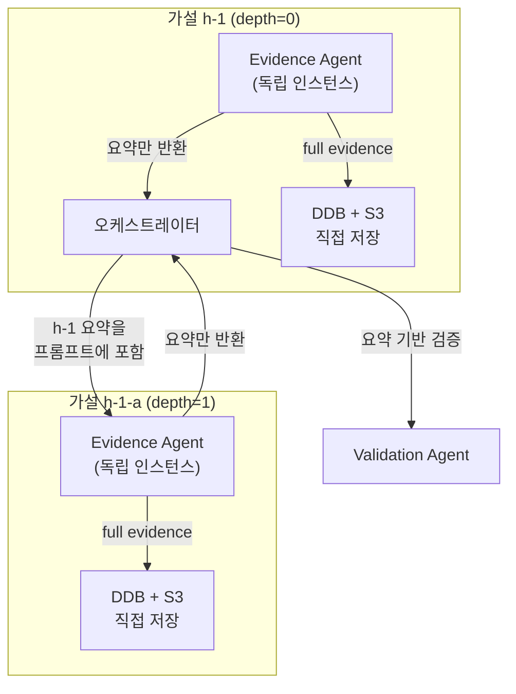

# ADR 0014: 계층형 증거 수집 세션 격리 — 가설별 독립 컨텍스트 윈도우 관리

Date: 2026-04-24
Updated: 2026-04-24

## Status

Accepted (Phase 2 완료)

## Context

Evidence collection agent가 CloudWatch 메트릭, Logs Insights, CloudTrail, GitHub 등 MCP 도구를 호출하면서 **도구 응답이 에이전트 대화 컨텍스트에 누적**된다. 현재 구조에서는 오케스트레이터가 하나의 evidence agent 인스턴스를 beam 내 전체 가설에 순차적으로 재사용하므로, 가설 수가 늘어나면 컨텍스트가 200K 토큰 한도를 초과하여 `ContextWindowOverflowException`이 발생한다. 실제 운영에서 219,963 tokens > 200,000 maximum 에러가 확인되었다.

또한 현재 구조에서는 evidence agent의 **전체 raw 데이터(로그 원본, 메트릭 시계열, 코드 diff 등)가 오케스트레이터의 `evidence_map`에 저장**되어 validation agent 프롬프트에도 전달된다. 오케스트레이터가 알아야 할 정보는 요약 수준이지만, 실제로는 수십 KB의 raw 데이터가 흘러다닌다.

가설 트리가 분기될 때도 문제가 있다. 하위 가설(depth=1, 2)의 증거 수집 시 부모 가설의 raw evidence를 참조할 필요가 있지만, 현재는 모든 증거가 flat한 `evidence_map` 딕셔너리에 저장되어 계층 관계 없이 관리된다.

검토한 대안:

### 1. Strands SlidingWindowConversationManager

Strands SDK 내장 기능으로, 오래된 대화 턴을 자동으로 잘라내는 슬라이딩 윈도우 방식이다.

- **장점**: SDK 기본 기능으로 구현 비용이 낮음
- **단점**: 턴 단위 제거 방식이라, **단일 턴 내에서 도구 응답이 폭발하는 케이스에 대응 불가**. 증거 수집은 한 번의 에이전트 호출(= 한 세션) 내에서 여러 도구를 연쇄 호출하므로 윈도우 크기를 조절해도 해결되지 않음
- **RCA 맥락 적합성**: 낮음

### 2. MCP 도구 응답 크기 제한

MCP 서버 수준 또는 에이전트 시스템 프롬프트에서 도구 응답을 일정 크기로 truncate한다.

- **장점**: 기존 아키텍처 변경 없이 적용 가능
- **단점**: 어디서 자를지 결정이 어렵고, 중요 증거(에러 스택트레이스의 마지막 줄, 특정 시간대의 메트릭 스파이크 등)를 놓칠 수 있음. CloudWatch Logs Insights 결과를 강제로 잘라내면 근본 원인 탐지율이 하락
- **RCA 맥락 적합성**: 중간 — 보조적 완화 수단으로는 유효하나 근본 해결이 아님

### 3. 가설별 신규 Agent 인스턴스 (Flat 격리)

각 가설에 대해 fresh Agent 인스턴스를 생성하여 컨텍스트를 격리한다. 수집 완료 후 요약만 오케스트레이터에 반환한다.

- **장점**: 컨텍스트 오버플로우 근본 해결. 가설 간 도구 결과가 격리됨
- **단점**: 하위 가설이 부모 가설의 증거를 참조할 때 계층 구조가 반영되지 않음. 모든 가설이 동일하게 flat한 요약만 받음
- **RCA 맥락 적합성**: 높음 — 오버플로우 문제 해결

### 4. 계층형 세션 관리 (Hierarchical 격리)

3번의 확장으로, 가설 트리 구조를 반영한 정보 흐름을 설계한다. 하위 가설의 evidence agent는 **부모 가설의 요약만** 프롬프트 컨텍스트로 받고, 자신의 raw evidence는 자체 세션에서만 유지한다. 상위 가설일수록 추상화된 인사이트만 보유하게 된다.

- **장점**: 3번의 장점에 더해 계층적 추상화로 상위 수준 판단의 품질 향상. 필요 시 하위 가설의 DDB 레코드를 조회하여 디테일 접근 가능
- **단점**: 요약 품질이 하위 가설 분석 정확도에 영향. 계층 간 정보 전달 로직 추가
- **RCA 맥락 적합성**: 높음 — 가설 트리 구조와 자연스럽게 정합

## Decision

**계층형 세션 관리 (대안 4)**를 채택한다. 대안 2(응답 크기 제한)를 보조 수단으로 병행한다.

### 핵심 결정사항

1. **가설별 독립 Agent 인스턴스**: 증거 수집 시 기존의 공유 evidence agent를 사용하지 않고, **가설마다 새 Agent를 생성**하여 독립된 컨텍스트 윈도우를 부여한다. Agent 생성 비용(MCP 클라이언트 연결)은 MCP 클라이언트 풀을 공유하되 Agent 인스턴스만 분리하여 최소화한다.

2. **서브에이전트의 직접 영속화**: evidence agent가 수집한 full evidence를 **DynamoDB(evidence_summary)와 S3(원본)에 직접 저장**한다. 오케스트레이터는 저장 책임에서 분리되며, 서브에이전트의 structured output으로 반환되는 **요약(combined_summary)만** 수신한다.

3. **오케스트레이터 컨텍스트 경량화**: 오케스트레이터의 `evidence_map`에는 요약 텍스트만 저장한다. validation agent에도 요약만 전달된다. raw 데이터는 오케스트레이터 컨텍스트에 진입하지 않는다.

4. **계층적 정보 흐름**: 하위 가설(depth > 0)의 evidence agent 프롬프트에는 **부모 가설의 evidence 요약**을 포함한다. 부모의 raw evidence는 전달하지 않는다. REJECTED된 가설은 기각 사실만 짧게 기록한다. beam width 3 × 최대 depth 3 기준, 오케스트레이터가 보유하는 요약 정보는 가설당 500자 이내로 전체 수 KB 수준에 불과하므로 오케스트레이터 레벨의 컨텍스트 압박은 발생하지 않는다. 하위 가설이 부모의 디테일이 필요한 경우, DDB/S3에서 직접 조회할 수 있는 경로를 열어둔다(초기 구현에서는 요약만 전달).

5. **증거 수집 실패 시 CONFIRMED 방지**: 증거 수집이 타임아웃/실패한 가설은 `required_evidence`가 비어있지 않은 경우 **CONFIRMED 상태를 금지**하고 최대 `NEEDS_INVESTIGATION`까지만 허용한다. `required_evidence`가 비어있으면 증거 없이도 확정 가능하다.

6. **CC Headless 미적용**: CC Headless 엔진은 파일 기반으로 산출물을 관리하며, CC CLI가 자체적으로 컨텍스트를 관리한다. 파이프라인 단계별로 산출물 파일을 읽어 필요한 만큼만 컨텍스트에 포함하므로 별도 격리가 불필요하다.

7. **MCP 도구 응답 제한 (보조 수단)**: evidence agent의 시스템 프롬프트에 Logs Insights 쿼리 시 `limit` 절 사용과 결과 요약을 지시한다. 이는 단독 해결책이 아닌 방어적 가드레일이다.

8. **대시보드 full evidence 조회**: 대시보드 트레이스 뷰의 가설 상세 패널에서 DynamoDB의 `evidence_summary`(요약)를 기본 표시하고, "상세 보기" 버튼으로 S3에 저장된 **full evidence**를 on-demand로 조회한다. S3 경로는 `rca/{rca_id}/evidence/{hypothesis_id}/combined.md`이다. 이를 통해 요약만으로 부족할 때 원본 증거(메트릭 시계열, 로그 원본, 코드 diff 등)를 확인할 수 있다.

### 정보 흐름

### 컨텍스트 크기 비교

| 구간 | 변경 전 | 변경 후 |
|------|---------|---------|
| Evidence Agent 1회 호출 | 이전 가설의 도구 결과 누적 (무제한 증가) | 해당 가설의 도구 결과만 (격리) |
| 오케스트레이터 evidence_map | raw 메트릭/로그/diff 전체 | 가설당 요약 텍스트 (500자 이내) |
| Validation Agent 프롬프트 | raw evidence 전체 | 요약 텍스트만 |
| 하위 가설 프롬프트 | 부모 raw evidence | 부모 요약만 |

## Consequences

### Positive

- 컨텍스트 오버플로우 근본 해결 — 가설별 독립 컨텍스트로 200K 한도 초과 불가
- 오케스트레이터 컨텍스트 경량화로 validation, branching 등 후속 단계의 토큰 효율 향상
- 계층적 추상화로 트리 깊이가 증가해도 상위 수준의 판단 품질 유지
- full evidence가 DDB/S3에 영속화되므로 대시보드에서 가설별 상세 증거 조회 가능
- 가설별 격리로 한 가설의 증거 수집 실패가 다른 가설에 영향을 주지 않음

### Negative

- 가설마다 Agent 인스턴스를 생성하므로 초기화 비용 증가 (MCP 클라이언트 풀 공유로 완화)
- 오케스트레이터가 요약만 보유하므로 validation의 판단 근거가 요약 품질에 의존
- 서브에이전트가 DDB/S3에 직접 쓰므로 에이전트에 인프라 클라이언트를 주입하는 설계가 필요
- 기존 evidence 수집 → 저장 흐름의 책임 분리가 변경되어 테스트 구조 재설계 필요

### Risks

- **요약 품질 의존**: evidence agent의 `combined_summary` 품질이 낮으면 validation이 잘못된 판단을 내릴 수 있다. structured output의 summary 필드에 대한 프롬프트 가이드를 강화하고, 요약에 핵심 데이터 포인트(시간, 수치, 에러 메시지)를 포함하도록 지시하여 완화한다.
- **MCP 클라이언트 연결 비용**: 가설마다 MCP 서버에 재연결하면 지연이 발생할 수 있다. MCP 클라이언트 인스턴스를 오케스트레이터에서 생성하고 서브에이전트에 공유하여 완화한다.
- **단일 가설 내 오버플로우**: 하나의 가설에 대해서도 도구 호출이 과도하면 200K를 초과할 가능성이 있다. 다만 219K 초과가 발생한 실제 사례는 여러 가설의 도구 결과가 하나의 agent에 누적된 경우였으며, 단일 가설만으로는 현실적으로 도달하기 어렵다. 보조 수단(대안 2, 시스템 프롬프트의 `limit` 가이드)을 병행하여 방어한다.

## Implementation Notes

Phase 1 (완료): 가설별 독립 Agent 인스턴스 + 요약만 반환 + DDB/S3 직접 저장 + 대시보드 full evidence 조회 (오버플로우 해결 및 책임 분리)
Phase 2 (완료): 계층적 부모 요약 주입 (하위 가설 프롬프트에 부모 요약 포함, REJECTED 가설은 기각 사실만 전달)

## Related

- [ADR agent/0002: 가설 트리 라이프사이클](0002-hypothesis-tree-lifecycle.md) — 가설 트리 구조, 검증 시 증거 실패 가드레일, Beam Search에 따른 증거 수집 범위
- [ADR agent/0010: 모델 티어 아키텍처](0010-model-tier-architecture.md) — evidence agent는 Execution 티어(Haiku) 사용
- [ADR infra/0002: 증거 저장](../infra/0002-evidence-storage.md) — S3 + DynamoDB 증거 저장 구조
- [ADR infra/0005: 파이프라인 실행 트레이스](../infra/0005-execution-trace-dynamodb.md) — DynamoDB 트레이스 스키마
