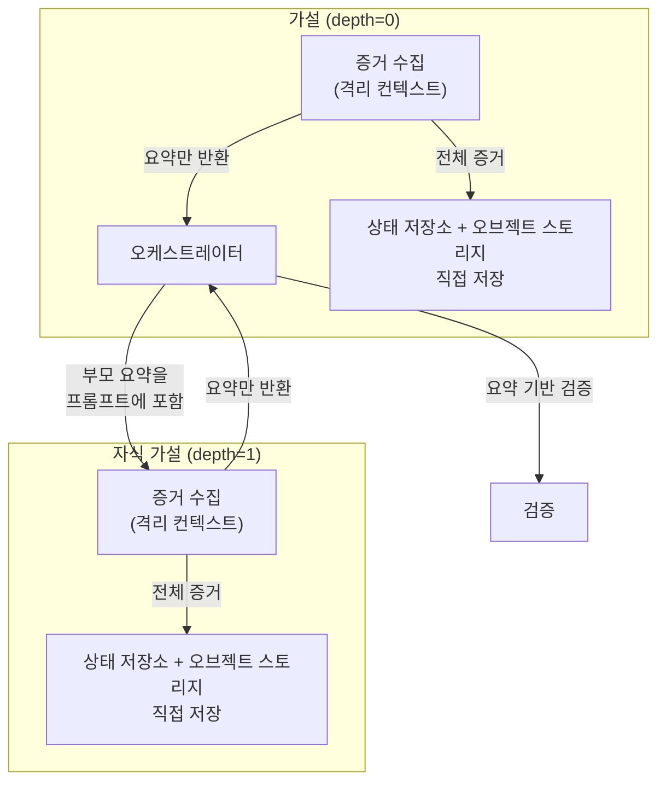

# ADR 0014: 계층형 증거 수집 세션 격리 — 가설별 독립 컨텍스트 윈도우 관리

Date: 2026-04-24
Updated: 2026-04-24

## Status

Accepted (2026-04-24)

## Context

증거 수집 에이전트가 관측·변경 이력·코드 MCP 도구를 호출하면 **도구 응답이 에이전트 대화 컨텍스트에 누적**된다. 하나의 증거 수집 에이전트를 beam 내 전체 가설에 순차 재사용하면 가설 수가 늘어남에 따라 컨텍스트가 모델 한도를 초과한다. 실제 운영에서 20만 토큰 한도를 넘긴 오버플로우가 관측되었다.

같은 구조는 두 번째 문제도 만든다. 증거 수집이 얻은 **전체 원본 데이터(로그 원본, 메트릭 시계열, 코드 diff)가 오케스트레이터를 거쳐** 검증 단계 프롬프트까지 전달된다. 오케스트레이터가 판단에 필요한 것은 요약 수준인데 실제로는 수십 KB의 원본이 흘러다닌다.

가설 트리가 분기될 때도 문제가 있다. 하위 가설의 증거 수집은 부모 가설이 무엇을 관측했는지 알아야 하지만, 모든 증거가 계층 없는 평면 구조로 관리되면 부모-자식 관계를 반영한 정보 전달을 할 수 없다.

## Decision Drivers

- 가설 수가 늘어나도 증거 수집이 모델 컨텍스트 한도를 넘지 않아야 한다.
- 오케스트레이터와 검증 단계는 판단에 필요한 만큼만 보유해야 한다. 원본 데이터가 상위 단계로 올라오면 후속 단계의 토큰 효율이 함께 나빠진다.
- 하위 가설은 부모 가설의 관측 결과를 알아야 하되, 부모의 원본까지 물려받아서는 안 된다.
- 수집된 원본은 사후 검증을 위해 보존되고 필요할 때 조회할 수 있어야 한다.
- 한 가설의 증거 수집 실패가 다른 가설의 수집을 오염시켜서는 안 된다.

## Decision

**가설별 컨텍스트 격리 + 계층적 요약 전달**을 채택한다. 도구 응답 크기 제한을 보조 수단으로 병행한다.

### 핵심 결정사항

1. **가설별 독립 증거 수집 컨텍스트**: 가설마다 새 증거 수집 컨텍스트를 만들어 도구 응답 누적을 격리한다. 컨텍스트만 분리하고 MCP 연결은 공유해 초기화 비용을 억제한다.

2. **수집 주체의 직접 영속화**: 수집한 전체 증거를 수집 주체가 상태 저장소(요약)와 오브젝트 스토리지(원본)에 직접 저장하고, 오케스트레이터에는 **요약만** 반환한다. 저장 책임을 오케스트레이터에 두면 원본이 반드시 오케스트레이터 컨텍스트를 통과해야 하므로, 저장 책임과 컨텍스트 경량화는 함께 결정된다.

3. **오케스트레이터·검증 컨텍스트 경량화**: 오케스트레이터와 검증 단계는 요약 텍스트만 보유한다. 원본은 상위 단계 컨텍스트에 진입하지 않는다.

4. **계층적 정보 흐름**: 하위 가설의 증거 수집 프롬프트에는 **부모 가설의 증거 요약**만 포함하고 부모의 원본은 전달하지 않는다. 기각된 가설은 기각 사실만 짧게 전달한다. 가설당 요약을 500자 이내로 제한하므로, beam 폭 3 × 깊이 3 기준 오케스트레이터 보유량은 수 KB에 머문다. 하위 가설이 부모의 세부가 필요하면 저장소에서 직접 조회할 수 있는 경로를 열어둔다.

5. **증거 수집 실패 시 CONFIRMED 방지**: 증거 수집이 실패한 가설은 필수 증거를 요구하는 경우 확정을 금지하고 최대 추가조사까지만 허용한다([ADR 0002](0002-hypothesis-tree-lifecycle.md)).

6. **Codex Headless 미적용**: Codex Headless 엔진은 산출물 파일로 단계 간 정보를 전달하고 Codex CLI가 자체 컨텍스트를 관리한다. 각 단계가 필요한 산출물만 읽으므로 별도 격리가 불필요하다.

7. **도구 응답 크기 제한 (보조 수단)**: 증거 수집 프롬프트에서 로그 쿼리에 결과 상한을 걸고 요약을 지시한다. 단독 해결책이 아닌 방어적 가드레일이다 — 어디서 잘라도 중요 증거를 놓칠 위험이 있으므로 격리를 대체하지 못한다.

8. **원본 증거 온디맨드 조회**: 대시보드는 가설 상세에 요약을 기본 표시하고, 요구 시 저장된 원본 증거를 조회한다. 요약만으로 판단이 어려울 때 사람이 원본을 확인할 수 있어야 격리가 정보 손실이 되지 않는다.

### 정보 흐름

```mermaid
flowchart TD
    Orch["오케스트레이터"]

    subgraph H1["가설 (depth=0)"]
        EA1["증거 수집\n(격리 컨텍스트)"]
        EA1 -- "전체 증거" --> STORE1["상태 저장소 + 오브젝트 스토리지\n직접 저장"]
        EA1 -- "요약만 반환" --> Orch
    end

    subgraph H1A["자식 가설 (depth=1)"]
        EA1A["증거 수집\n(격리 컨텍스트)"]
        EA1A -- "전체 증거" --> STORE2["상태 저장소 + 오브젝트 스토리지\n직접 저장"]
        EA1A -- "요약만 반환" --> Orch
    end

    Orch -- "부모 요약을\n프롬프트에 포함" --> EA1A
    Orch -- "요약 기반 검증" --> Val["검증"]
```

### 컨텍스트 보유량 계약

| 구간 | 보유 범위 |
|------|-----------|
| 증거 수집 1회 | 해당 가설의 도구 결과만 |
| 오케스트레이터 | 가설당 요약 텍스트 500자 이내 |
| 검증 프롬프트 | 요약 텍스트만 |
| 하위 가설 프롬프트 | 부모 요약만 |

## 대안 검토

| 대안 | 장점 | 단점 및 미채택 이유 |
|------|------|---------------------|
| SDK 내장 슬라이딩 윈도우 대화 관리 | 구현 비용이 거의 없다. | 오래된 **턴**을 제거하는 방식이라 단일 턴 안에서 도구 응답이 폭발하는 경우에 대응하지 못한다. 증거 수집은 한 번의 호출 안에서 여러 도구를 연쇄 호출하므로 윈도우 크기를 조절해도 해결되지 않는다. |
| 도구 응답 크기 제한만 적용 | 기존 구조 변경 없이 적용 가능하다. | 어디서 자를지 결정할 근거가 없고 중요 증거(에러 스택의 마지막 줄, 특정 시각의 스파이크)를 놓칠 수 있다. 근본 해결이 아니라 보조 수단으로만 유효하다. |
| 가설별 격리 (평면) | 오버플로우를 근본 해결하고 가설 간 도구 결과가 섞이지 않는다. | 하위 가설이 부모의 관측 결과를 물려받지 못해 분기 이후 탐색이 부모의 발견을 반복한다. |
| 가설별 격리 + 계층적 요약 전달 | 오버플로우를 해결하면서 트리 구조를 따라 관측 결과가 전달되고, 상위 단계는 추상화된 정보만 보유한다. | 요약 품질이 하위 분석과 검증 정확도에 직접 영향을 주고, 계층 간 정보 전달 로직이 추가된다. |

## Consequences

### Positive

- 컨텍스트 오버플로우 근본 해결 — 가설별 격리로 여러 가설의 도구 결과가 누적되지 않는다
- 오케스트레이터 경량화로 검증·분기 등 후속 단계의 토큰 효율 향상
- 계층적 추상화로 트리 깊이가 증가해도 상위 수준의 판단 품질 유지
- 전체 증거가 영속화되므로 요약이 부족할 때 사람이 원본을 조회할 수 있다
- 가설별 격리로 한 가설의 증거 수집 실패가 다른 가설에 영향을 주지 않음

### Negative

- 가설마다 수집 컨텍스트를 만들므로 초기화 비용이 증가한다 (MCP 연결 공유로 완화)
- 오케스트레이터가 요약만 보유하므로 검증의 판단 근거가 요약 품질에 의존한다
- 수집 주체가 저장소에 직접 쓰므로 수집 경로에 저장 의존성을 주입해야 한다

### Risks

- **요약 품질 의존**: 증거 요약의 품질이 낮으면 검증이 잘못된 판단을 내린다. 요약에 핵심 데이터 포인트(시간, 수치, 에러 메시지)를 포함하도록 프롬프트로 강제해 완화한다. 격리의 대가가 요약 품질 의존이라는 점은 이 결정의 본질적 트레이드오프다.
- **MCP 연결 비용**: 가설마다 도구 서버에 재연결하면 지연이 발생한다. 연결을 상위에서 만들어 공유하고 컨텍스트만 분리해 완화한다.
- **단일 가설 내 오버플로우**: 한 가설에 대해서도 도구 호출이 과도하면 한도를 넘을 수 있다. 관측된 오버플로우는 여러 가설의 결과가 한 컨텍스트에 누적된 경우였고, 단일 가설만으로는 도달하기 어렵다. 도구 응답 크기 제한을 보조 방어로 병행한다.

## Related

- [ADR agent/0002: 가설 트리 라이프사이클](0002-hypothesis-tree-lifecycle.md) — 가설 트리 구조, 검증 시 증거 실패 가드레일, Beam Search에 따른 증거 수집 범위
- [ADR agent/0010: 모델 티어 아키텍처](0010-model-tier-architecture.md) — 증거 수집은 Execution 티어 사용
- [ADR infra/0002: 증거 저장](../infra/0002-evidence-storage.md) — 원본과 요약의 3계층 저장 구조
- [ADR infra/0005: 파이프라인 실행 트레이스](../infra/0005-execution-trace-dynamodb.md) — 가설 상태와 스팬 기록 구조
