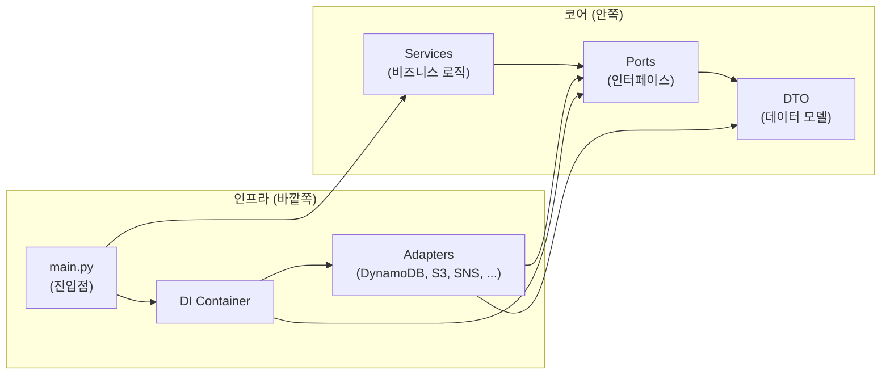

# ADR 0015: Hexagonal Architecture — Ports & Adapters 기반 패키지 구조 전환

Date: 2026-04-28

## Status

Accepted

## Context

기존 agent/cc-headless 패키지는 비즈니스 로직(파이프라인 오케스트레이션, 가설 관리, 종료 판단 등)과 인프라 의존성(DynamoDB, S3, S3 Vectors, SNS, SQS, Bedrock)이 동일 모듈에 혼재되어 있었다. 이로 인해:

1. **테스트 어려움**: DynamoDB, S3 등 AWS 서비스를 직접 호출하는 코드가 비즈니스 로직에 산재하여, 단위 테스트 시 모킹 대상이 넓고 경계가 불명확했다.
2. **교체 비용**: 저장소 전략 변경(예: DynamoDB → 다른 스토어)이나 임베딩 모델 교체 시 비즈니스 로직 모듈을 직접 수정해야 했다.
3. **중복 구현**: agent/cc-headless 두 패키지가 동일 인프라(DynamoDB 세션, S3 보고서, S3 Vectors 플레이북)에 대해 유사한 클라이언트 코드를 독립적으로 유지했다.

## Decision

**Hexagonal Architecture(Ports & Adapters)** 패턴을 agent/cc-headless 양쪽 패키지에 적용한다.

### 핵심 결정사항

1. **계층 분리**: 각 패키지를 4개 계층으로 분리한다.

   | 계층 | 역할 |
   |------|------|
   | Ports | 비즈니스 로직이 외부 세계와 소통하는 인터페이스(추상 클래스). Primary Port(인바운드)와 Secondary Port(아웃바운드)로 구분 |
   | Adapters | Port 인터페이스의 구체 구현. Primary Adapter(SQS 컨슈머, Health 서버)와 Secondary Adapter(DynamoDB, S3, SNS, Bedrock 등) |
   | Services | 순수 비즈니스 로직. Port 인터페이스에만 의존하며 인프라 구체 클래스를 알지 못함 |
   | DI (Dependency Injection) | Container가 Adapter를 생성하고 Service에 Port로 주입 |

2. **Port 설계 원칙**: Port는 Python 추상 클래스(ABC)로 정의하며, 메서드 시그니처에는 DTO만 사용한다. AWS SDK 타입(boto3 client, DynamoDB item 형식 등)이 Port 인터페이스에 노출되지 않는다.

3. **DTO 계층**: `ports/dto`에 패키지 전체에서 공유하는 데이터 모델(Pydantic)을 정의한다. 기존 `models.py`의 도메인 모델을 이 계층으로 이동하여 Port와 Service가 공통으로 참조한다.

4. **DI Container 패턴**: 추상 `Container` 클래스가 모든 Port를 property로 선언하고, `AppContainer`가 실제 AWS Adapter를 lazy-init으로 생성한다. 테스트 시 `Container`를 상속하여 인메모리 구현을 주입할 수 있다.

5. **양 패키지 동일 구조**: agent와 cc-headless 모두 동일한 계층 구조(`ports/`, `adapters/`, `services/`, `di/`, `config/`)를 사용한다. 패키지별로 필요한 Port/Adapter 범위가 다르지만(예: agent는 QueueConsumerPort를 가지고, cc-headless는 CcRunnerPort를 가짐) 구조적 일관성을 유지한다.

6. **Config 모듈 분리**: 환경변수 로딩과 상수 정의를 `config/settings.py`로 분리하여 Adapter 생성 시 참조한다. 비즈니스 로직(Service)은 설정값을 직접 읽지 않고 Container나 생성자 인자로 전달받는다.

7. **기존 모듈 유지(Thin Wrapper)**: 기존 최상위 모듈(`hypothesis.py`, `branching.py`, `scoping.py`, `evidence.py`, `report.py`, `playbook_gen.py`, `notification.py` 등)은 Service 계층으로 로직을 이동한 후 얇은 re-export 래퍼로 남겨둔다. 실제 비즈니스 로직은 모두 `services/` 하위에 위치하며, 루트 래퍼는 하위호환용으로만 존재한다. 외부 진입점(`main.py`)은 Container를 통해 Service를 조합하여 파이프라인을 실행한다.

### Adapter 분류

| 방향 | Adapter | Port | 설명 |
|------|---------|------|------|
| Primary (인바운드) | SQS Consumer | QueueConsumerPort | 알람 메시지 수신 (agent) |
| Primary (인바운드) | Health Server | — | 헬스체크 엔드포인트 |
| Secondary (아웃바운드) | DynamoDB Session Store | SessionStorePort | 세션 CRUD + 멱등성 |
| Secondary (아웃바운드) | S3 Report Store | ReportStorePort | 보고서 저장/조회 |
| Secondary (아웃바운드) | S3 Evidence Store | EvidenceStorePort | 증거 아카이브 |
| Secondary (아웃바운드) | S3 Vectors Playbook Store | PlaybookStorePort | 플레이북 임베딩 검색/저장 |
| Secondary (아웃바운드) | SNS Notification | NotificationPort | RCA 완료 알림 |
| Secondary (아웃바운드) | Bedrock Embedding | EmbeddingPort | 텍스트 임베딩 |
| Secondary (아웃바운드) | CC Subprocess Runner | CcRunnerPort | CC CLI 프로세스 실행 (cc-headless) |

### 의존성 방향

의존성은 항상 바깥에서 안쪽으로 향한다. Service는 Port 인터페이스만 참조하고, Adapter의 존재를 알지 못한다.

## Consequences

### Positive

- 비즈니스 로직(Service)을 인프라 없이 단위 테스트 가능 — Port를 구현하는 인메모리 스텁만으로 충분
- 인프라 교체(DynamoDB → 다른 스토어, 임베딩 모델 교체 등) 시 Adapter만 교체하면 되며 비즈니스 로직 수정 불필요
- agent/cc-headless 양쪽에 동일 구조가 적용되어 패키지 간 탐색 비용 감소
- DI Container로 의존성 생명주기(lazy-init, cleanup)를 중앙에서 관리

### Negative

- 계층 분리로 인한 파일/디렉토리 수 증가 — 소규모 변경에도 Port → Adapter → Container를 모두 수정해야 할 수 있음
- 추상화 계층 추가로 코드 추적 경로가 길어져 디버깅 시 간접 참조를 따라가야 함
- 두 패키지가 유사한 Port/Adapter를 독립적으로 유지하므로 공유 라이브러리 추출 없이는 일부 중복이 잔존

### Risks

- Port 인터페이스가 특정 Adapter의 특성에 과도하게 맞춰지면(leaky abstraction) 교체 이점이 사라진다. Port 메서드 설계 시 도메인 관점에서 정의하고 인프라 용어를 배제하여 완화한다.
- 양 패키지의 Port/Adapter가 시간이 지나며 분기될 수 있다. 공통 인터페이스가 필요해지면 shared 패키지 추출을 검토한다.

## Related

- [ADR agent/0010: 모델 티어 아키텍처](0010-model-tier-architecture.md) — Planning/Execution 모델 팩토리가 DI Container를 통해 주입됨
- [ADR agent/0011: CC Headless 프롬프트 주도 RCA](0011-cc-headless-prompt-driven-rca.md) — CC Headless 패키지에도 동일 구조 적용
- [ADR agent/0014: 계층형 증거 수집 세션 격리](0014-hierarchical-evidence-session-isolation.md) — 증거 수집 Service가 EvidenceStorePort를 통해 격리된 세션 관리
