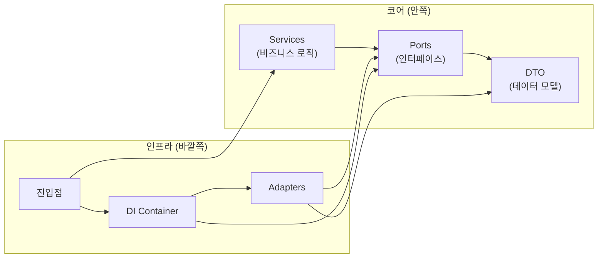

# ADR 0015: Hexagonal Architecture — Ports & Adapters 기반 패키지 구조

Date: 2026-04-28

## Status

Accepted (2026-04-28)

## Context

두 엔진 패키지는 비즈니스 로직(파이프라인 오케스트레이션, 가설 관리, 종료 판단)과
인프라 의존성(상태 저장소, 오브젝트 스토리지, 벡터 인덱스, 알림, 큐, 모델 호출)이
같은 모듈에 혼재된 상태로 자랐다. 이 때문에 세 가지 비용이 발생했다.

1. **테스트 경계 불명확**: AWS 서비스를 직접 호출하는 코드가 비즈니스 로직에
   산재해 단위 테스트의 모킹 대상이 넓고 무엇을 검증하는지 흐려졌다.
2. **교체 비용**: 저장 전략이나 임베딩 모델을 바꾸려면 비즈니스 로직 모듈을 직접
   수정해야 했다.
3. **엔진 간 중복**: 두 패키지가 같은 인프라에 대해 유사한 클라이언트 코드를
   독립적으로 유지했다.

## Decision Drivers

- 비즈니스 로직은 AWS 자격 증명 없이 결정적으로 테스트할 수 있어야 한다. 오프라인
  계약 테스트가 필수 CI 게이트이기 때문이다([ADR 0016](0016-rca-evaluation-test-harness.md)).
- 인프라 교체(저장소·임베딩 모델)가 비즈니스 로직 수정을 강제해서는 안 된다.
- 두 엔진이 오케스트레이션 방식은 달라도 구조는 같아야 한다. 구조가 갈라지면 같은
  결정이 두 곳에서 다르게 구현되어 엔진 비교가 흐려진다.
- 기존 import 경로를 사용하는 코드가 한 번에 깨지지 않아야 한다.

## Decision

**Hexagonal Architecture(Ports & Adapters)** 패턴을 양쪽 엔진 패키지에 적용한다.

### 핵심 결정사항

1. **네 계층 분리**

   | 계층 | 역할 |
   |------|------|
   | Ports | 비즈니스 로직이 외부와 소통하는 인터페이스. 인바운드(Primary)와 아웃바운드(Secondary)로 구분 |
   | Adapters | Port의 구체 구현. 인바운드는 메시지 소비·헬스체크, 아웃바운드는 저장소·알림·모델 호출 |
   | Services | 순수 비즈니스 로직. Port 인터페이스에만 의존하며 인프라 구체 구현을 알지 못함 |
   | DI | Container가 Adapter를 생성해 Service에 Port로 주입 |

2. **Port 시그니처에 인프라 타입 금지**: Port 메서드는 도메인 DTO만 주고받는다.
   AWS SDK 클라이언트나 저장소별 아이템 형식이 Port에 노출되면 추상화가 새어
   교체 이점이 사라지고, 인메모리 구현으로 대체할 수도 없다.

3. **DTO 공유 계층**: 도메인 모델을 Port와 Service가 함께 참조하는 단일 계층에
   둔다. 계층마다 자체 모델을 두면 경계마다 변환 코드가 생기고 필드가 갈라진다.

4. **Container를 통한 주입**: 추상 Container가 모든 Port를 선언하고 실제 구현이
   인프라 Adapter를 지연 생성한다. 테스트는 Container를 상속해 인메모리 구현을
   주입한다. 이것이 "AWS 없이 비즈니스 로직 테스트"를 성립시키는 경로다.

5. **양 패키지 동일 구조**: 두 엔진이 같은 계층 구조를 쓴다. 필요한 Port 집합은
   다르지만(한쪽은 큐 소비, 다른 쪽은 CC 프로세스 실행) 구조적 일관성을 유지한다.

6. **Service는 설정을 직접 읽지 않는다**: 환경 설정 로딩은 별도 모듈로 분리하고
   Service는 Container나 생성자 인자로 값을 받는다. Service가 환경을 직접 읽으면
   테스트마다 환경을 조작해야 하고 설정 의존이 시그니처에 드러나지 않는다.

7. **기존 진입 경로는 얇은 re-export로 유지**: 로직을 Service·Adapter로 옮긴 뒤
   기존 모듈 위치에는 re-export만 남긴다. 하위호환 목적이며 새 코드는 계층 경로를
   직접 참조한다. 한 번의 대규모 import 변경으로 두 패키지를 동시에 깨뜨리지 않기
   위한 전환 장치다.

### 의존성 방향

```mermaid
graph LR
    subgraph Core["코어 (안쪽)"]
        DTO["DTO<br/>(데이터 모델)"]
        PORTS["Ports<br/>(인터페이스)"]
        SERVICES["Services<br/>(비즈니스 로직)"]
    end

    subgraph Infra["인프라 (바깥쪽)"]
        ADAPTERS["Adapters"]
        DI["DI Container"]
        ENTRY["진입점"]
    end

    SERVICES --> PORTS
    PORTS --> DTO
    ADAPTERS --> PORTS
    ADAPTERS --> DTO
    DI --> ADAPTERS
    DI --> PORTS
    ENTRY --> DI
    ENTRY --> SERVICES
```

의존성은 항상 바깥에서 안쪽으로 향한다. Service는 Port 인터페이스만 참조하고
Adapter의 존재를 알지 못한다.

## 대안 검토

| 대안 | 장점 | 단점 및 미채택 이유 |
|------|------|---------------------|
| 현행 유지(레이어 없는 모듈 구성) | 변경 비용이 없고 파일 수가 적다. | 비즈니스 로직 테스트가 AWS 모킹에 계속 묶여 필수 CI 게이트를 결정적으로 만들 수 없다. |
| 인프라 호출만 얇은 유틸 모듈로 추출 | 구조 변경이 작고 즉시 적용 가능하다. | 인터페이스가 아니라 함수 묶음이라 인메모리 대체가 불가능하고, 유틸이 여전히 인프라 타입을 노출한다. |
| 공유 라이브러리 패키지를 먼저 추출 | 두 엔진의 인프라 중복을 근본적으로 없앤다. | 두 엔진의 Port 집합이 아직 다르고 변화 중이라 공통 인터페이스를 조기에 고정하면 잘못된 추상화가 굳는다. 구조를 먼저 맞추고 중복이 안정되면 추출한다. |
| Ports & Adapters 적용 | 비즈니스 로직을 인프라 없이 테스트하고 인프라 교체를 Adapter로 국소화한다. | 파일·디렉토리 수가 늘고 작은 변경에도 Port·Adapter·Container를 함께 수정해야 한다. |

## Consequences

### Positive

- 비즈니스 로직을 인프라 없이 단위 테스트할 수 있다 — Port 인메모리 구현만으로 충분
- 인프라 교체 시 Adapter만 바꾸면 되고 비즈니스 로직 수정이 불필요하다
- 양쪽 엔진에 동일 구조가 적용되어 패키지 간 탐색 비용이 감소한다
- 의존성 생명주기(지연 생성, 정리)를 Container에서 중앙 관리한다

### Negative

- 계층 분리로 파일·디렉토리 수가 증가하고, 소규모 변경에도 Port → Adapter →
  Container를 모두 수정해야 할 수 있다
- 추상화 계층이 늘어 디버깅 시 간접 참조를 따라가야 한다
- 두 패키지가 유사한 Port·Adapter를 독립 유지하므로 공유 라이브러리 추출 전까지
  일부 중복이 잔존한다
- re-export 래퍼가 남아 있는 동안 같은 심볼에 두 경로가 존재한다

### Risks

- Port 인터페이스가 특정 Adapter의 특성에 과도하게 맞춰지면(leaky abstraction)
  교체 이점이 사라진다. Port 메서드를 도메인 관점에서 정의하고 인프라 용어를
  배제해 완화한다.
- 양 패키지의 Port·Adapter가 시간이 지나며 분기할 수 있다. 공통 인터페이스가
  안정되면 shared 패키지 추출을 검토한다.

## Related

- [ADR agent/0010: 모델 티어 아키텍처](0010-model-tier-architecture.md) — 모델 생성 경로가 Container를 통해 주입됨
- [ADR agent/0011: Codex Headless 전문 서브 에이전트 오케스트레이션](0011-cc-headless-prompt-driven-rca.md) — Codex Headless 패키지에도 동일 구조 적용
- [ADR agent/0014: 계층형 증거 수집 세션 격리](0014-hierarchical-evidence-session-isolation.md) — 증거 수집이 저장소 Port를 통해 직접 영속화
- [ADR agent/0016: RCA 평가 테스트 하네스](0016-rca-evaluation-test-harness.md) — 오프라인 계약 테스트가 이 구조를 전제로 함
