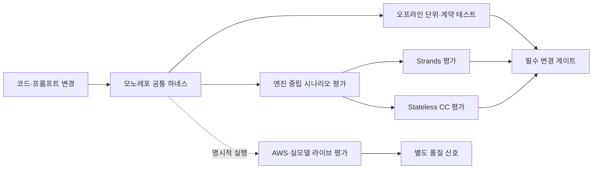

# ADR 0016: RCA 평가 테스트 하네스

Date: 2026-07-21

## Status

Accepted (2026-07-21)

## Context

RCA 시스템은 동일한 CloudWatch 알람을 Strands 기반 파이프라인과 Stateless CC
Headless가 각각 분석한다. 두 실행 엔진은 오케스트레이션 방식이 다르지만 프롬프트,
MCP 도구 계약, 중간 산출물, 최종 보고서라는 공통 품질 기준을 충족해야 한다.

현재 테스트는 개별 함수와 일부 프롬프트 조립을 확인하지만, 프롬프트 변경이 RCA
단계나 산출물 계약을 깨뜨리는지, 두 엔진이 동일 장애 시나리오에서 동등한 핵심
원인을 도출하는지, Stateless CC가 공유 하네스의 격리 조건을 지키는지는
결정적으로 검증하지 못한다. 실 AWS와 모델 호출에만 의존하는 검증은 비용과
비결정성 때문에 일반 개발 주기와 CI의 필수 게이트로 사용할 수 없다.

## Decision Drivers

- 일반 CI는 AWS 자격 증명과 유료 모델 호출 없이 반복 가능하게 실행되어야 한다.
- 프롬프트, MCP 도구, 산출물, DTO 경계의 변경은 결과 품질 저하 전에 계약 위반으로 탐지되어야 한다.
- Strands와 Stateless CC는 구현 차이를 유지하면서도 동일한 장애 시나리오의 핵심 기대값으로 비교 가능해야 한다.
- 실 AWS와 모델의 통합 품질을 검증할 경로는 유지하되 일반 CI의 속도와 안정성을 저해하지 않아야 한다.
- 프롬프트 변경은 정량화된 시나리오 회귀 결과 없이 배포되지 않아야 한다.

## Decision

RCA 검증을 **오프라인 테스트, 공통 시나리오 평가, 선택적 라이브 평가**의 세
계층으로 구성하고, 모노레포 루트 하네스가 계층별 실행 정책을 통제한다.

1. **오프라인 테스트**는 모든 변경에서 실행한다. 외부 서비스의 가용성과
   무관하게 상태 전이, 시간 제한, 세션 격리, 프롬프트 구성,
   읽기 전용 도구 노출, 산출물 저장과 감시, 실패 복구를 재현 가능하게 검증한다.
2. **공통 시나리오 평가**는 장애 입력, 관측 증거, 허용 가능한 근본원인,
   필수 산출물 조건을 엔진 중립적인 시나리오 계약으로 정의한다. 일반 CI에서는
   검토된 엔진별 정규화 결과 스냅샷을 같은 평가 차원으로 재평가하고, 프롬프트,
   평가 정책, 결과 스냅샷의 digest가 바뀌면 명시적 재승인을 요구한다. 실제 엔진
   결과 생성은 라이브 평가에서 같은 계약으로 수행한다.
3. **선택적 라이브 평가**는 실제 AWS와 모델을 사용해 도구 연결과 의미 품질을
   검증한다. 명시적 실행에서만 동작하고 일반 CI 필수 게이트에서는 제외한다.
   라이브 결과는 오프라인 계약을 대체하지 않고 별도의 품질 신호로 취급한다.
4. **Stateless CC 공유 원칙**을 적용한다. Stateless CC를 위한 독립된 루트
   하네스를 만들지 않으며, 모노레포의 공통 실행 명령과 시나리오 계약을
   공유한다. CC 프로세스의 작업 디렉터리, 홈 디렉터리, MCP 설정, 산출물
   디렉터리는 실행마다 격리되어 이전 실행 상태가 평가 결과에 영향을 주지
   못하게 한다.
5. **변경 게이트**를 구분한다. 코드와 정적 프롬프트 계약은 오프라인 테스트의
   필수 게이트이고, 공통 시나리오 평가는 검토된 결과 스냅샷과 의미 기준선의
   회귀를 막는다. 프롬프트 변경 후 실제 모델 의미 품질은 라이브 결과를 검토해
   새 스냅샷과 기준선을 승인하는 절차로 확인한다. 네트워크, 자격 증명, 모델
   변동으로 실패할 수 있는 라이브 평가는 일반 CI와 분리한다.
6. **시나리오 합격 정책**을 엔진 공통으로 적용한다. 근본원인 식별, 필수 증거
   연결, 필수 단계와 산출물 완료, 복구 제안의 안전성을 필수 평가 차원으로
   삼는다. 안전성은 결과의 자체 선언만 신뢰하지 않고 사전조건, 승인 주체,
   롤백 조건, 사후 검증 계획이 모두 있는지 확인한다. 어느 엔진이든 필수 차원을
   충족하지 못하면 필수 게이트를 실패한다.
   표현 다양성을 허용하는 의미 점수는 검토된 기준선과 비교하고, 프롬프트 변경이
   기준선을 낮추면 명시적인 기준선 재승인 없이는 배포할 수 없다.

## 대안 검토

| 대안 | Decision Drivers 대비 장점 | Decision Drivers 대비 단점 및 미채택 이유 |
|------|---------------------------|-------------------------------------------|
| 패키지별 단위 테스트만 확장 | 자격 증명 없이 빠르고 결정적으로 실행되며 계약 위반의 원인 추적이 쉽다. | 엔진 중립 시나리오와 의미 기준선이 없어 두 엔진 비교와 프롬프트 품질 게이트를 충족하지 못한다. |
| AWS·실모델 E2E를 주 검증 수단으로 사용 | 실제 도구 연결과 모델의 RCA 의미 품질을 가장 직접적으로 평가한다. | 비용, 지연, 자격 증명, 비결정성 때문에 일반 CI의 반복 가능성과 필수 게이트 안정성을 충족하지 못한다. |
| 로컬 계약 테스트와 외부 관리형 시나리오 평가를 결합 | 로컬에서 정적 계약을 빠르게 검증하면서 중앙 평가 실행과 결과 대시보드를 확보할 수 있다. | 공통 시나리오와 실행 결과가 저장소 밖 서비스 정책에 종속되어 Stateless CC의 격리·MCP·산출물 계약을 같은 방식으로 재현하기 어렵고, 개발자의 로컬 회귀 재현성이 낮아진다. |

## Consequences

### Positive

- AWS나 모델 없이 대부분의 회귀를 로컬과 CI에서 빠르게 재현할 수 있다.
- 두 엔진이 구현 세부가 아닌 동일한 RCA 품질 계약으로 비교된다.
- 프롬프트, skill, MCP, 산출물 형식의 드리프트가 조기에 탐지된다.
- Stateless CC의 실행 간 상태 누출이 공통 하네스의 필수 계약으로 관리된다.
- 라이브 평가를 유지하면서도 일반 CI의 비용과 비결정성을 제한할 수 있다.

### Negative

- 공통 시나리오 계약과 엔진별 결과 정규화 규칙을 함께 유지해야 한다.
- 의미적으로 허용 가능한 여러 RCA 결과를 평가 규칙에 반영하는 비용이 든다.
- 오프라인 검증만으로 실제 AWS 또는 모델의 모든 동작 차이를 재현하지는 못한다.

### Risks

- 시나리오 계약이 구현 결과에 과도하게 맞춰지면 실제 RCA 품질 저하를 놓칠 수 있다.
  장애 원인과 필수 증거를 기준으로 평가하고 표현 문자열의 완전 일치는 피한다.
- 라이브 평가가 선택 사항이라는 이유로 장기간 실행되지 않을 수 있다. 프롬프트
  또는 도구 계약 변경 시 라이브 결과를 별도 릴리스 신호로 기록한다.
- 두 엔진의 정규화 규칙이 서로 다른 해석을 적용하면 비교가 왜곡될 수 있다. 공통
  평가 결과의 필수 의미와 실패 조건을 엔진 중립 계약으로 유지한다.

## Related

- [ADR agent/0011: CC Headless 프롬프트 주도 RCA](0011-cc-headless-prompt-driven-rca.md)
- [ADR agent/0015: Hexagonal Architecture](0015-hexagonal-architecture.md)
