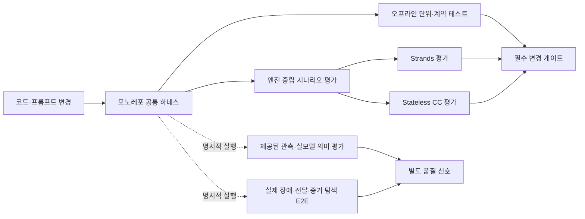

# ADR 0016: RCA 평가 테스트 하네스

Date: 2026-07-21
Updated: 2026-08-07

## Status

Accepted (2026-08-07)

## Context

RCA 시스템은 동일한 CloudWatch 알람을 Strands 기반 파이프라인과 Stateless CC
Headless가 각각 분석한다. 두 실행 엔진은 오케스트레이션 방식이 다르지만 프롬프트,
MCP 도구 계약, 중간 산출물, 최종 보고서라는 공통 품질 기준을 충족해야 한다.

현재 테스트는 개별 함수와 일부 프롬프트 조립을 확인하지만, 프롬프트 변경이 RCA
단계나 산출물 계약을 깨뜨리는지, 두 엔진이 동일 장애 시나리오에서 동등한 핵심
원인을 도출하는지, Stateless CC가 공유 하네스의 격리 조건을 지키는지는
결정적으로 검증하지 못한다. 실 AWS와 모델 호출에만 의존하는 검증은 비용과
비결정성 때문에 일반 개발 주기와 CI의 필수 게이트로 사용할 수 없다.

## Decision Drivers

- 일반 CI는 AWS 자격 증명과 유료 모델 호출 없이 반복 가능하게 실행되어야 한다.
- 프롬프트, MCP 도구, 산출물, DTO 경계의 변경은 결과 품질 저하 전에 계약 위반으로 탐지되어야 한다.
- Strands와 Stateless CC는 구현 차이를 유지하면서도 동일한 장애 시나리오의 핵심 기대값으로 비교 가능해야 한다.
- 실 AWS와 모델의 통합 품질을 검증할 경로는 유지하되 일반 CI의 속도와 안정성을 저해하지 않아야 한다.
- 프롬프트 변경은 정량화된 시나리오 회귀 결과 없이 배포되지 않아야 한다.

## Decision

RCA 검증을 **오프라인 계약, fixture 의미 회귀, 실모델 의미 평가, 배포 E2E**의 네
계층으로 구성하고, 모노레포 루트 하네스가 계층별 실행 정책을 통제한다.

1. **오프라인 단위·계약 테스트**는 모든 변경에서 실행한다. 외부 서비스의 가용성과
   무관하게 상태 전이, 시간 제한, 세션 격리, 프롬프트 구성,
   읽기 전용 도구 노출, 산출물 저장과 감시, 실패 복구를 재현 가능하게 검증한다.
2. **fixture 의미 회귀**는 장애 입력, 관측 증거, 허용 가능한 근본원인,
   필수 산출물 조건을 엔진 중립적인 시나리오 계약으로 정의한다. 일반 CI에서는
   검토된 엔진별 정규화 결과 스냅샷을 같은 평가 차원으로 재평가하고, 프롬프트,
   평가 정책, 결과 스냅샷의 digest가 바뀌면 명시적 재승인을 요구한다.
3. **실모델 의미 평가(`model-eval`)**는 실제 모델과 필요한 AWS 조회 API를 사용해
   두 엔진의 의미 품질을 검증한다. 명시적 실행에서만 동작하고 일반 CI 필수
   게이트에서는 제외한다. 시나리오가 제공한 `observations`와 관측 식별자를 초기
   컨텍스트에 넣으므로, 이 결과는 모델이 주어진 증거를 해석하고 인용하는 품질을
   측정할 뿐 실제 증거 소스에서 관측을 찾아내는 능력을 입증하지 않는다.
   각 엔진은 **시나리오 하나를 입력받아 정규화 결과 하나를 표준 출력으로 내는
   실행 가능한 어댑터**를 제공한다. 하네스는 엔진 내부를 알지 못하고 이 계약만
   요구하므로, 엔진의 평상시 구동 방식이 이벤트 소비든 단일 호출이든 무관하게
   같은 평가에 참여한다. 어댑터는 `executionModes`에 `model-eval`이 없는
   시나리오를 거부하고, 자체적으로 RCA를 수행하지 않으며 공용 분석 경로의 결과를
   공통 스키마로 옮기는 번역 계층으로만 존재한다.
   이벤트 소비로만 구동되는 엔진에는 평가 전용 진입점이 필요하다. 이때 평가
   진입점은 운영 경로가 사용하는 것과 같은 분석 파이프라인을 호출해야 하며,
   평가용으로 분리된 별도 분석 경로를 두지 않는다. 두 경로가 갈라지면 평가
   결과가 운영 동작을 대변하지 못한다.
4. **배포 E2E(`deployed-e2e`)**는 실제 장애 주입, CloudWatch 증상 알람,
   SNS/SQS 전달, 두 배포 엔진의 신규 세션, 실제 증거 탐색, 산출물 저장을 함께
   검증한다. 이 경로는 시나리오의 `observations`를 엔진에 제공하지 않는다.
   배포 가능한 시나리오만 `deployed-e2e`를 선언할 수 있고, 주입부터 정리까지
   호출자가 소유한 하나의 실행 ID로 계보를 묶는다. 과거 세션은 현재 실행의
   증거로 재사용하지 않는다.
5. **Stateless CC 공유 원칙**을 적용한다. Stateless CC를 위한 독립된 루트
   하네스를 만들지 않으며, 모노레포의 공통 실행 명령과 시나리오 계약을
   공유한다. CC 프로세스의 작업 디렉터리, 홈 디렉터리, MCP 설정, 산출물
   디렉터리는 실행마다 격리되어 이전 실행 상태가 평가 결과에 영향을 주지
   못하게 한다.
6. **변경 게이트**를 구분한다. 코드와 정적 프롬프트 계약은 오프라인 테스트의
   필수 게이트이고, 공통 시나리오 평가는 검토된 결과 스냅샷과 의미 기준선의
   회귀를 막는다. 프롬프트 변경 후 실제 모델 의미 품질은 `model-eval` 결과를 검토해
   새 스냅샷과 기준선을 승인하는 절차로 확인한다. 네트워크, 자격 증명, 모델
   변동으로 실패할 수 있는 실모델 평가와 배포 E2E는 일반 CI와 분리한다.
7. **시나리오 합격 정책**을 엔진 공통으로 적용한다. 근본원인 식별, 필수 증거
   연결, 필수 단계와 산출물 완료, 복구 제안의 안전성을 필수 평가 차원으로
   삼는다.
   복구 안전성은 **제안의 안전성**을 측정하며 실행 성공 여부와 구분한다. 분석은
   실행하지 않고 플레이북 절차를 제안하는 데서 끝나므로([ADR 0017](0017-playbook-execution-agent.md)),
   평가가 측정하는 것은 그 절차가 되돌릴 수 없는 조치를 요구하는지, 대상과 관측
   기준이 확정 원인과 정합한지다. 절차가 파괴적 조치를 담고 있으면 안전하지 않다.
   이 판정 규칙은 엔진마다 같아야 한다. 한 엔진은 항상 안전으로 보고하고 다른 엔진은
   상태로 판정하면 같은 차원의 점수가 비교 불가능해진다.
   평가는 어떤 실행도 수행하지 않는다. 실행은 사용자 승인을 요구하므로 평가 경로에
   실행을 포함하면 반복 실행마다 대상 서비스 상태가 바뀌어 후속 실행의 증거가
   오염된다. 실제 실행과 회고 품질은 운영 경로에서 검증한다.
   `model-eval`의 증거 연결은 시나리오가 정의한 **관측 식별자를 산출물에 명시적으로
   인용**했는지로 측정한다. 따라서 이 모드에서만 관측 식별자를 엔진에 전달하고,
   그 식별자를 증거마다 함께 기록하도록 요구한다. 식별자를 전달하지 않거나 인용을
   요구하지 않으면 어떤 관측이 결론에 쓰였는지 판정할 수 없다. 배포 E2E에는 이
   식별자를 주입하지 않으며 실제 증거 탐색 결과로 별도 판정한다.
   안전성은 결과의 자체 선언만 신뢰하지 않고 사전조건, 승인 주체,
   롤백 조건, 사후 검증 계획이 모두 있는지 확인한다. 어느 엔진이든 필수 차원을
   충족하지 못하면 필수 게이트를 실패한다.
   표현 다양성을 허용하는 의미 점수는 검토된 기준선과 비교하고, 프롬프트 변경이
   기준선을 낮추면 명시적인 기준선 재승인 없이는 배포할 수 없다.

## 대안 검토

| 대안 | Decision Drivers 대비 장점 | Decision Drivers 대비 단점 및 미채택 이유 |
|------|---------------------------|-------------------------------------------|
| 패키지별 단위 테스트만 확장 | 자격 증명 없이 빠르고 결정적으로 실행되며 계약 위반의 원인 추적이 쉽다. | 엔진 중립 시나리오와 의미 기준선이 없어 두 엔진 비교와 프롬프트 품질 게이트를 충족하지 못한다. |
| AWS·실모델 E2E를 주 검증 수단으로 사용 | 실제 도구 연결과 모델의 RCA 의미 품질을 가장 직접적으로 평가한다. | 비용, 지연, 자격 증명, 비결정성 때문에 일반 CI의 반복 가능성과 필수 게이트 안정성을 충족하지 못한다. |
| 로컬 계약 테스트와 외부 관리형 시나리오 평가를 결합 | 로컬에서 정적 계약을 빠르게 검증하면서 중앙 평가 실행과 결과 대시보드를 확보할 수 있다. | 공통 시나리오와 실행 결과가 저장소 밖 서비스 정책에 종속되어 Stateless CC의 격리·MCP·산출물 계약을 같은 방식으로 재현하기 어렵고, 개발자의 로컬 회귀 재현성이 낮아진다. |

이벤트 소비 엔진을 실모델 의미 평가에 참여시키는 방법에 대한 대안:

| 대안 | 장점 | 단점 및 미채택 이유 |
|------|------|---------------------|
| 평가 시 실제 이벤트 큐에 시나리오를 주입 | 운영 경로를 그대로 통과하므로 전달 계층까지 검증된다. | 상시 실행 중인 소비자와 경합하고, 평가 실행이 어느 결과를 만들었는지 특정하기 어렵다. 평가가 운영 큐 상태를 오염시킨다. |
| 엔진 결과를 저장소에서 사후 조회해 정규화 | 새 진입점이 필요 없고 이미 남은 결과를 재사용한다. | 평가가 실행을 소유하지 않아 어떤 코드 버전이 그 결과를 냈는지 보증할 수 없고, 시나리오를 반복 실행할 수 없다. |
| 평가 전용 진입점이 운영과 같은 파이프라인을 직접 호출 | 실행을 평가가 소유하므로 반복 가능하고, 분석 경로가 운영과 동일하다. | 진입점을 하나 더 유지해야 하고, 이벤트 전달 계층은 이 경로로 검증되지 않는다. |

평가에서 복구 안전성을 측정하는 방법에 대한 대안:

| 대안 | 장점 | 단점 및 미채택 이유 |
|------|------|---------------------|
| 평가가 승인을 대행해 실제 실행까지 수행 | 실행과 회고 경로까지 배포 E2E로 검증된다. | 평가가 실제 서비스에 쓰기를 수행한다. 시나리오를 반복 실행할 때마다 대상 서비스 상태가 바뀌어 후속 실행의 증거가 오염되고, 평가 실패가 서비스 장애로 번질 수 있다. 승인 게이트를 평가가 우회하는 것 자체가 안전 경계의 예외를 만든다. |
| 실행하지 않았음을 그대로 안전으로 판정 | 규칙이 단순하고 엔진 간 판정이 같아진다. | 절차의 내용을 보지 않으므로 파괴적 조치를 담은 플레이북도 안전으로 통과한다. 플레이북이 실행 근거가 된 이상 절차 내용이 곧 안전 신호다. |
| 제안된 절차의 내용을 정적으로 판정 | 실행 없이 절차의 파괴성과 대상·관측 기준 정합성을 측정하고, 엔진 간 판정이 같아진다. | 절차가 실제로 이슈를 해소하는지는 이 계층에서 측정되지 않으므로 운영 경로에서 따로 확인해야 한다. |

증거 커버리지를 측정하는 방법에 대한 대안:

| 대안 | 장점 | 단점 및 미채택 이유 |
|------|------|---------------------|
| 관측 요약의 핵심 용어가 산출물에 나타나는지로 측정 | 프롬프트를 바꾸지 않아도 되고 표현 다양성을 허용한다. | 어떤 관측이 실제로 결론에 쓰였는지 구별하지 못한다. 무관한 서술이 용어를 우연히 포함하면 인용으로 집계되어 커버리지가 과대평가된다. |
| 도구 호출 이력으로 어떤 증거를 조회했는지 추적 | 모델의 자기 보고에 의존하지 않는다. | 조회와 결론 사용은 다르다. 조회했지만 기각한 증거와 결론의 근거를 구별할 수 없고, 엔진마다 도구 호출 기록 방식이 달라 중립 계약을 만들기 어렵다. |
| 관측 식별자를 전달하고 증거마다 인용을 요구 | 어떤 관측이 결론의 근거인지 명시적으로 판정된다. 증거 추적성 자체가 올라간다. | 프롬프트 계약이 늘고, 평가에서만 쓰이는 컨텍스트가 생긴다. 모델이 인용을 누락하면 실제보다 낮게 평가된다. |

## Consequences

### Positive

- AWS나 모델 없이 대부분의 회귀를 로컬과 CI에서 빠르게 재현할 수 있다.
- 두 엔진이 구현 세부가 아닌 동일한 RCA 품질 계약으로 비교된다.
- 프롬프트, skill, MCP, 산출물 형식의 드리프트가 조기에 탐지된다.
- Stateless CC의 실행 간 상태 누출이 공통 하네스의 필수 계약으로 관리된다.
- 실모델 평가와 배포 E2E를 유지하면서도 일반 CI의 비용과 비결정성을 제한할 수 있다.
- 두 엔진이 구동 방식이 달라도 동일한 어댑터 계약으로 같은 평가에 참여한다.
- 평가가 실행을 소유하므로 같은 시나리오를 반복 실행해 결과를 비교할 수 있다.

### Negative

- 공통 시나리오 계약과 엔진별 결과 정규화 규칙을 함께 유지해야 한다.
- 의미적으로 허용 가능한 여러 RCA 결과를 평가 규칙에 반영하는 비용이 든다.
- 오프라인 검증만으로 실제 AWS 또는 모델의 모든 동작 차이를 재현하지는 못한다.
- 엔진마다 평가 진입점을 유지해야 하고, 운영 진입점과 함께 갱신해야 한다.
- 평가 진입점은 이벤트 전달 계층을 우회하므로 큐·구독·재전달 동작은 이 경로로
  검증되지 않는다.

### Risks

- 시나리오 계약이 구현 결과에 과도하게 맞춰지면 실제 RCA 품질 저하를 놓칠 수 있다.
  장애 원인과 필수 증거를 기준으로 평가하고 표현 문자열의 완전 일치는 피한다.
- 실모델 평가와 배포 E2E가 선택 사항이라는 이유로 장기간 실행되지 않을 수 있다.
  프롬프트 또는 도구 계약 변경 시 관련 결과를 별도 릴리스 신호로 기록한다.
- 두 엔진의 정규화 규칙이 서로 다른 해석을 적용하면 비교가 왜곡될 수 있다. 공통
  평가 결과의 필수 의미와 실패 조건을 엔진 중립 계약으로 유지한다.
- 평가 진입점이 운영 파이프라인과 갈라지면 평가 결과가 운영 동작을 대변하지
  못한다. 평가 진입점은 분석 로직을 자체 구현하지 않고 운영과 같은 파이프라인을
  호출하며, 이 호출 관계를 계약 테스트로 고정한다.
- 평가 실행이 운영과 같은 저장소·알림 대상을 사용하면 운영 상태를 오염시킬 수
  있다. 평가 실행은 자신이 만든 결과만 조회하고, 부작용 대상은 실행 환경 설정으로
  분리한다.

## Implementation Notes

실모델 의미 평가에서 확인된 사항:

- 이벤트 소비 엔진의 완료 판정은 메시지 확인 여부와 다르다. 알림 발행 대상이
  구성되지 않은 평가 환경에서는 분석이 끝나도 메시지를 확인하지 않으므로,
  어댑터는 저장된 세션 상태를 완료 판정의 권위로 삼는다.
- 증거 인용 목록은 알림 payload가 아니라 보고서 본문에 남는다. 어댑터는 세션이
  기록한 보고서 키로 자기 실행의 보고서만 읽어 증거 커버리지를 계산한다. 조회에
  실패하면 증거 목록이 비어 점수에 드러난다.
- 알람 식별자가 알람명과 상태 변경 시각으로 결정되므로, 같은 시나리오를 반복
  실행하려면 실행 시각을 알람에 반영해야 한다. 그러지 않으면 이전 세션과 충돌해
  중복으로 처리된다.
- 첫 실모델 실행은 증거 수집 타임아웃으로 근본원인이 미확정으로 끝났고, 평가
  하네스가 이를 필수 게이트 실패로 판정했다. 어댑터와 채점 정책이 미확정 결과를
  통과시키지 않는다는 것이 확인되었다.

## Related

- [ADR agent/0011: CC Headless 프롬프트 주도 RCA](0011-cc-headless-prompt-driven-rca.md)
- [ADR agent/0015: Hexagonal Architecture](0015-hexagonal-architecture.md)
- [ADR agent/0017: 플레이북 실행 에이전트](0017-playbook-execution-agent.md) — 평가가 측정하지 않는 실제 실행 경로
