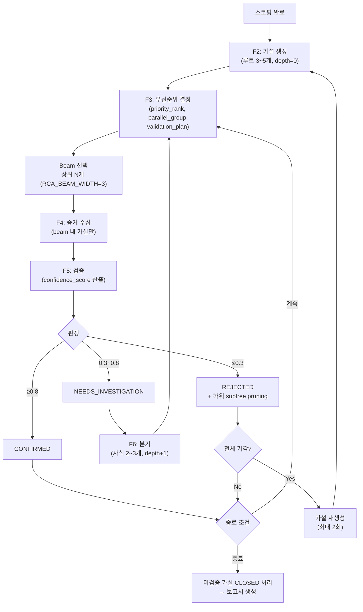

# ADR 0018: 가설 트리 라이프사이클 — 생성·우선순위·검증·분기·Beam 탐색 (Roll-up)

Date: 2026-04-28

## Status

Accepted (Roll-up of 0002, 0003, 0004, 0005, 0013)

## Context

RCA Agent는 스코핑 결과를 바탕으로 **가설 트리**를 생성하고, 증거 수집·검증·분기를 반복하여 근본 원인에 수렴해야 한다. 가설 트리 라이프사이클 설계 시 고려 사항:

1. **구조화된 트리**: 가설은 루트 노드로 시작해 필요 시 분기되어 트리를 형성한다. 이후 우선순위, 검증, 분기 단계에서 각 노드의 상태를 일관되게 관리할 수 있어야 한다.
2. **탐색 효율**: 모든 PENDING 가설을 매 루프마다 검증하면 트리 분기 누적 시 LLM 호출이 폭발한다. 20분 타임 버짓 내에 근본 원인에 수렴해야 한다.
3. **판단 기준 명확성**: 확정/기각/추가조사의 경계를 코드에서 일관되게 적용해야 LLM 판단의 편차가 파이프라인을 왜곡하지 않는다.
4. **탐색 폭 제어**: 무제한 분기는 폭발을 야기하므로 깊이와 폭을 제한해야 한다.
5. **복합 원인 대응**: 단일 경로(DFS)로 몰아가면 복합 원인을 놓치고, 전체 검증은 비용이 폭증한다. 둘 사이의 균형이 필요하다.

## Decision

**구조화된 가설 트리 + LLM 기반 판단 + Beam Search** 전략을 채택한다. 가설의 생성·우선순위 결정·검증·분기 네 단계가 공통 도메인 모델을 공유하며, 검증 루프는 우선순위 상위 N개만 선택적으로 검증하는 Beam Search 방식으로 운영된다.

### 가설 트리 라이프사이클

### 공통 도메인 모델

가설 노드는 다음 속성을 갖는다:

- `hypothesis_id` (UUID), `tree_id` (트리 루트 공통)
- `parent_id` (루트는 None), `depth` (루트=0, 자식은 부모+1)
- `description`, `category` (DEPLOYMENT/INFRASTRUCTURE/TRAFFIC/DEPENDENCY/CONFIGURATION)
- `confidence_score` (0.0~1.0), `required_evidence` (list)
- `status`: PENDING → CONFIRMED / REJECTED / NEEDS_INVESTIGATION / CLOSED
- `referenced_playbook_id` (과거 호환, 현재는 비어 있음)

### 1. 가설 생성 (F2)

- **LLM 구조화 출력**: Strands SDK `structured_output_model`로 `HypothesisOutput` Pydantic 모델을 지정한다. SDK가 파싱을 처리하므로 프롬프트에 JSON 포맷 지시가 불필요하다. 비스트리밍 모드로 호출한다.
- **개수 제한**: 루트 레벨 3~5개. Pydantic `max_length=5` 제약으로 하드 제한하며, 초과 시 방어적으로 잘라낸다.
- **카테고리 필수**: 각 가설은 5개 카테고리 중 하나에 분류되어 검증 전략을 체계화한다.
- **유사 보고서 주입**: 스코핑에서 전달된 유사 RCA 보고서(`root_cause`, `incident_summary`, `hypothesis_path`, `confirmed`)를 프롬프트에 포함하여 과거 경험을 우선 반영한다. 확정된 보고서의 근본 원인에 더 높은 신뢰도를 부여하도록 지시한다(ADR 0017).
- **재시도**: 시도당 3분 타임아웃, 최대 3회 재시도. 모두 실패 시 빈 가설 목록 반환.
- **전체 기각 후 재생성**: 검증 결과 모든 가설이 REJECTED이면 가설 생성으로 루프백한다. 최대 `RCA_MAX_REGENERATION_ROUNDS=2`회 제한.
- **모델 티어**: Planning 티어 (Sonnet 4.6 + adaptive thinking).

### 2. 우선순위 결정 (F3)

- **LLM 동적 우선순위**: `PrioritizationOutput` Pydantic 모델로 LLM이 각 가설의 `priority_rank`, `tools`(필요 도구 목록), `estimated_seconds`, `parallel_group`을 반환한다.
- **컨텍스트 기반 판단**: 알람 유형, 스코핑 결과, 가설 카테고리를 종합해 순서를 결정한다(예: 최근 배포 확인 시 배포 가설 우선).
- **병렬 그룹**: 독립적 가설은 동일 `parallel_group`으로 묶어 병렬 검증 가능성을 표시한다.
- **Fallback**: LLM 실패 시 카테고리 기본 순서(DEPLOYMENT > INFRASTRUCTURE > TRAFFIC > DEPENDENCY > CONFIGURATION)로 정렬한다. 120초 타임아웃을 `ThreadPoolExecutor`로 강제한다.
- **모델 티어**: Planning 티어.

### 3. Beam Search — 상위 N개 선택적 검증

- **Beam 선택**: 우선순위 결정 후 `priority_rank` 기준 상위 N개만 증거 수집·검증·분기에 참여시킨다. `RCA_BEAM_WIDTH` 기본 3.
- **상태 필터**: CONFIRMED/REJECTED는 beam 후보에서 제외한다. PENDING/NEEDS_INVESTIGATION만 후보.
- **비선택 가설 보존**: beam에 포함되지 않은 가설은 삭제하지 않고 목록에 유지한다. 다음 루프에서 우선순위가 재평가되어 beam에 진입할 수 있어 한 번 배제된 가설도 복귀 가능하다(DFS 백트래킹과 구분되는 특성).
- **증거 재사용**: beam 진입 가설 중 이전 루프에서 이미 증거가 수집된 가설은 재수집하지 않는다.

### 4. 증거 수집 및 검증 (F4, F5)

- **LLM 신뢰도 기반 3단 판정**: `ValidationOutput` Pydantic 모델로 `status`, `confidence_score`, `reasoning`, `evidence_summary`를 반환받는다.
- **Score 기반 재분류**: LLM이 반환한 status는 참고만 하고, **confidence_score를 기준으로 코드에서 status를 재분류**한다:
  - `≥ 0.8` → **CONFIRMED**
  - `≤ 0.3` → **REJECTED**
  - 그 사이 → **NEEDS_INVESTIGATION**
  이는 LLM status 판단의 일관성 부족을 보완한다.
- **증거 수집 실패 시 CONFIRMED 금지**: 증거 수집이 타임아웃/예외로 실패한 가설은 `required_evidence`가 비어있지 않으면 CONFIRMED를 금지하고 최대 NEEDS_INVESTIGATION까지만 허용한다. LLM이 description과 초기 confidence_score만으로 증거 없이 확정하는 문제를 방지하는 가드레일이다. `required_evidence`가 비어있는 가설은 증거 없이도 확정 가능하다.
- **판단 근거 기록**: `reasoning`과 `evidence_summary`를 `ValidationJudgment`에 기록하여 보고서와 사후 검토에 활용한다.
- **REJECTED subtree pruning**: 가설이 REJECTED로 판정되면 해당 노드의 하위 subtree 전체를 REJECTED로 전파한다.
- **모델 티어**: Execution 티어 (Haiku 4.5). 증거-가설 일치도 판정은 단순 분류 작업이므로 경량 모델로 충분하다.

### 5. 하위 가설 분기 (F6)

- **NEEDS_INVESTIGATION 대상**: 판정이 NEEDS_INVESTIGATION인 가설만 분기한다.
- **LLM 구조화 자식 생성**: `BranchingOutput` Pydantic 모델로 자식 가설 목록을 반환한다. 부모 가설, 수집된 증거, 기각된 가설 목록을 LLM에 전달한다.
- **자식 개수 제한**: 부모당 최대 3개. Pydantic `max_length=3`으로 하드 제한, 초과 시 방어적 truncate.
- **트리 확장**: 자식에 새 UUID 부여, `parent_id=부모ID`, `depth=부모.depth+1`.
- **깊이 제한**: `MAX_BRANCHING_DEPTH=3`. 부모 depth가 제한에 도달하면 LLM 호출 없이 빈 결과 반환.
- **중복 방지**: 부모 가설과 기각된 가설과 대소문자 무시 비교로 중복 자식을 자동 제거한다.
- **모델 티어**: Planning 티어.

### 6. 루프 종료 시 정리

검증 루프가 종료되면(CONFIRMED 발견, 타임 버짓 소진, 최대 루프 도달 등) PENDING 또는 NEEDS_INVESTIGATION 상태로 남은 가설을 **CLOSED**로 처리한다. REJECTED는 증거에 의해 명시적으로 기각된 가설에만 사용하고, 예산 소진/미검증으로 종료된 가설은 CLOSED로 구분한다. best_hypothesis로 선택된 가설은 제외한다. 모든 가설이 CONFIRMED/REJECTED/CLOSED 중 하나의 최종 상태를 갖게 하여 세션 완료 시 상태 일관성을 보장한다. CC Headless에서도 산출물 파싱과 프롬프트로 동일 동작을 구현한다.

### 대안 검토

#### 가설 생성 방식

| 접근 | 평가 | 결론 |
|---|---|---|
| **규칙 기반**: 알람 유형별 사전 정의 가설 | 빠르지만 미리 정의하지 않은 패턴 대응 불가 | 기각 |
| **LLM 자유 형식**: 자유 텍스트 분석 | 유연하나 구조화 부족으로 이후 단계 자동화 불가 | 기각 |
| **LLM 구조화 생성**: structured output + 카테고리 | 구조화·자동화·유연성 모두 확보 | **채택** |

#### 검증 판단 방식

| 접근 | 평가 | 결론 |
|---|---|---|
| **규칙 기반**: 메트릭 임계치 정량 규칙 | 복합 증거 종합 불가 | 기각 |
| **LLM 신뢰도 기반**: confidence_score 산출 | 복합 증거 종합 + 3단 판단 가능 | **채택** |
| **하이브리드**: 규칙 1차 + LLM 2차 | MVP에서 복잡도 대비 이점 불분명 | 기각 |

#### 탐색 전략

| 접근 | 루프당 LLM 호출 | 잘못된 경로 탈출 | 복합 원인 탐지 | 비용 예측성 | 결론 |
|---|---|---|---|---|---|
| **DFS 백트래킹** | 1건 | 느림 (깊이 비례) | 불가 | 높음 | 기각 (불확실성 높은 RCA에 부적합) |
| **전체 일괄 검증** | 가설 수 비례 | 해당 없음 | 가능 | 낮음 (가변) | 기각 (분기 누적 시 비용 폭증) |
| **Beam Search (상위 N)** | N건 (고정) | 빠름 (다음 루프 재평가) | 가능 | 높음 (N으로 제어) | **채택** |

## Consequences

### Positive

- 공통 도메인 모델(hypothesis_id, tree_id, parent_id, depth, status)로 4단계 간 일관된 관리
- LLM 추론 능력으로 사전 정의하지 않은 장애 패턴에도 가설 도출
- 3단 판정으로 불확실한 가설에 점진적 탐색 가능
- Beam Search로 루프당 LLM 호출이 N건으로 고정되어 비용 예측 가능
- 유망 가설에 리소스 집중 + 다중 경로 동시 탐색으로 복합 원인 탐지
- 깊이/폭 제한으로 무한 탐색 방지
- 증거 수집 실패 시 CONFIRMED 금지 가드레일로 증거 없는 오확정 방지
- 루프 종료 시 CLOSED 처리로 모든 가설이 최종 상태를 가져 세션 일관성 확보

### Negative

- 단계별 LLM 호출로 비용 누적 (가설 생성·우선순위·검증·분기 각각)
- LLM 판단 일관성이 완벽하지 않아 동일 증거에 다른 결과 가능 — confidence_score 재분류로 부분 완화
- Beam width가 너무 작으면 유효 가설이 검증 기회를 얻지 못할 수 있음
- 우선순위 결정(F3) 정확도에 대한 의존도 높음 — 우선순위 오류가 탐색 실패로 직결 가능

### Risks

- 3회 재시도 모두 실패 시 빈 가설 목록이 반환되어 파이프라인이 조기 종료된다. 로그로 모니터링한다.
- 신뢰도 임계치(0.3, 0.8), beam width(3), 최대 깊이(3), 재생성 횟수(2)는 장애 유형에 따라 최적이 아닐 수 있다. 운영 데이터를 바탕으로 조정한다.
- 확정되지 않은(`confirmed=false`) 유사 보고서가 오판일 경우 가설을 오도할 수 있다. 프롬프트에 확정 여부를 노출하여 가중치 조절을 유도한다.
- 기각된 가설 목록을 우선순위 결정과 분기 단계에 컨텍스트로 제공하여 beam 오선택과 중복 분기를 완화한다.

## Evolution History

| ADR | 주요 내용 | 현재 반영 여부 |
|---|---|---|
| 0002 | LLM 구조화 가설 생성, 카테고리 분류, 루트 3~5개, 3회 재시도 | 완전 반영 (단, 유사 플레이북 주입 → 유사 보고서로 교체, ADR 0017) |
| 0003 | LLM 동적 우선순위, 검증 계획 수립, 병렬 그룹 판단, 카테고리 fallback | 완전 반영 |
| 0004 | confidence_score 기반 3단 판정, score 기반 재분류, 전체 기각 재생성(최대 2회), 증거 실패 시 CONFIRMED 금지, 루프 종료 시 CLOSED 정리 | 완전 반영 |
| 0005 | NEEDS_INVESTIGATION 분기, 부모당 최대 3개, 깊이 제한 3, 중복 방지 | 완전 반영 |
| 0013 | Beam Search (상위 N), 비선택 가설 보존, 증거 재사용, 기각된 가설 컨텍스트 제공 | 완전 반영 |

## Related

- [ADR agent/0006: 중단 조건](0006-termination-conditions.md) — 검증 루프 종료 판단 기준 (CONFIRMED / 타임 버짓 / 최대 루프 / 전체 기각 등)
- [ADR agent/0007: RCA 보고서 생성](0007-rca-report-generation.md) — best_hypothesis와 검증 판단 근거를 소비하여 보고서 생성
- [ADR agent/0010: 모델 티어 아키텍처](0010-model-tier-architecture.md) — 각 단계의 Planning/Execution 티어 매핑
- [ADR agent/0014: 계층형 증거 수집 세션 격리](0014-hierarchical-evidence-session-isolation.md) — 증거 수집 실패의 근본 원인(컨텍스트 오버플로우) 해결 및 가설별 독립 세션 관리
- [ADR agent/0017: 초기 스코핑 + RCA 보고서 유사도 검색](0017-initial-scoping-and-report-similarity.md) — 가설 생성의 입력인 스코핑 결과와 유사 보고서 생성
