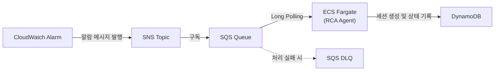

# ADR 0001: 알람 수신 아키텍처 — SNS + SQS + ECS Fargate

Date: 2026-04-21

## Status

Proposed

## Context

RCA Agent는 CloudWatch Alarm 발생 시 자동으로 근본 원인 분석을 시작해야 한다. 알람 수신부터 에이전트 실행까지의 경로를 설계할 때 다음 요구사항이 있다:

1. **자동 트리거**: 알람 발생 시 사람 개입 없이 RCA 에이전트가 즉시 분석을 시작해야 한다
2. **장시간 실행**: 가설-트리 기반 RCA는 최대 20분까지 수행될 수 있으므로 Lambda의 15분 타임아웃으로는 부족하다
3. **안정적 전달**: 알람 메시지가 유실되지 않아야 하며, 에이전트 장애 시 재처리가 가능해야 한다
4. **중복 방지**: 동일 알람에 대해 여러 RCA가 동시에 실행되면 리소스 낭비와 결과 혼란이 발생한다
5. **상태 추적**: 각 RCA 세션의 진행 상태를 실시간으로 조회할 수 있어야 한다

검토한 대안:

- **EventBridge → Lambda**: 서버리스로 간편하나 15분 타임아웃 제약이 RCA 워크로드에 부적합
- **EventBridge → Step Functions → Lambda**: 오케스트레이션은 유연하나 MVP에서는 에이전트 자체 루프로 충분하며 복잡도만 증가
- **EventBridge → ECS RunTask**: 알람마다 새 Fargate Task를 실행하면 콜드스타트(30초~1분)로 초기 응답 지연 발생
- **SNS → SQS → ECS Fargate(Long Polling)**: 상시 실행 Fargate가 SQS를 폴링하여 즉시 수신, 타임아웃 제약 없음

## Decision

**CloudWatch Alarm → SNS → SQS → ECS Fargate(Long Polling)** 아키텍처를 채택한다.

### 알람 전달 경로

### 핵심 결정사항

1. **SNS → SQS 버퍼링**: SNS Topic이 알람을 수신하고 SQS Queue로 전달한다. SQS가 버퍼 역할을 하여 에이전트의 처리 속도와 무관하게 메시지를 안정적으로 보존한다.

2. **ECS Fargate 상시 실행 + Long Polling**: 에이전트는 Fargate에서 상시 실행되며 SQS를 Long Polling으로 구독한다. 콜드스타트 없이 알람 수신 즉시(목표 60초 이내) RCA를 시작할 수 있고, 장시간 실행에 타임아웃 제약이 없다.

3. **DynamoDB 기반 RCA 세션 상태 관리**: 알람 수신 즉시 DynamoDB에 RCA 세션을 생성하고 상태를 기록한다. 상태 전이 흐름: `ALARM_RECEIVED` → `SCOPING` → `HYPOTHESIS_GENERATION` → `HYPOTHESIS_PRIORITIZATION` → `EVIDENCE_COLLECTION` → `HYPOTHESIS_VALIDATION` → `REPORT_GENERATION` → `COMPLETED` (또는 `FAILED`). 이를 통해 대시보드에서 실시간 진행 상태를 조회할 수 있다.

4. **이중 멱등성 체크**: SQS Visibility Timeout으로 동일 메시지 중복 처리를 1차 방지하고, DynamoDB에 알람 ID + 타임스탬프 기반 멱등성 키로 2차 중복을 방지한다. 기존 진행 중인 RCA가 있으면 새 메시지를 스킵한다.

5. **DLQ(Dead Letter Queue)를 통한 실패 메시지 보존**: 메시지 처리가 최대 3회 재시도 후에도 실패하면 DLQ로 이동하여 메시지를 보존한다. 이를 통해 장애 원인 사후 분석과 수동 재처리가 가능하다.

### 지원 알람 유형

단일 메트릭 알람과 Composite Alarm 모두 수신 가능하다. SNS 메시지 포맷이 동일하므로 별도 처리 분기 없이 AlarmName, NewStateReason, Trigger(MetricName, Namespace, Dimensions)를 파싱한다.

## Consequences

### Positive

- 콜드스타트 없이 알람 수신 60초 이내 RCA 시작 가능
- SQS 버퍼링으로 알람 급증 시에도 메시지 유실 없이 순차 처리
- 장시간 RCA 실행에 타임아웃 제약 없음
- DLQ로 실패 메시지를 보존하여 사후 분석 및 재처리 가능
- DynamoDB 상태 관리로 RCA 진행 상황 실시간 추적 가능
- 이중 멱등성 체크로 중복 RCA 실행 방지

### Negative

- Fargate 상시 실행으로 알람이 없는 시간에도 컴퓨팅 비용 발생 (이벤트 기반 RunTask 대비 비용 증가)
- SQS Long Polling 기반이므로 최대 20초의 폴링 간격 지연이 발생할 수 있음
- SNS → SQS → Fargate 3계층 구조로 인프라 구성요소가 증가

### Risks

- Fargate Task가 비정상 종료되면 SQS 메시지가 Visibility Timeout 후 재처리되지만, 그 사이 알람 대응이 지연될 수 있다. 헬스체크 및 자동 재시작 정책으로 완화한다.
- 대량 알람 동시 발생 시 단일 Fargate 인스턴스의 처리량이 병목이 될 수 있다. MVP 이후 오토스케일링 정책을 검토한다.
- DynamoDB 멱등성 체크와 SQS 처리 사이 레이스 컨디션 가능성이 있다. DynamoDB Conditional Write로 원자적 세션 생성을 보장한다.

## Related

- [ADR agent/0001: 초기 스코핑 전략](../agent/0001-initial-scoping-strategy.md) — 알람 수신 후 스코핑을 시작하는 다음 단계
- [ADR infra/0002: 증거 저장](0002-evidence-storage.md) — DynamoDB RCA 세션 상태 관리의 확장
