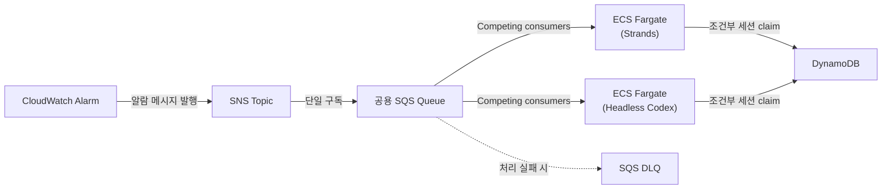

# ADR 0001: 알람 수신 아키텍처 — SNS + SQS + ECS Fargate

Date: 2026-04-21
Updated: 2026-08-31

## Status

Accepted (2026-08-31)

## Context

RCA Agent는 CloudWatch Alarm 발생 시 자동으로 근본 원인 분석을 시작해야 한다.
알람 수신부터 에이전트 실행까지의 경로를 설계해야 한다.

## Decision Drivers

- 알람 발생 시 사람 개입 없이 분석이 시작되고, 수신부터 분석 시작까지 **60초 이내**여야 한다. 콜드스타트가 이 목표를 위협한다.
- RCA는 최대 20분까지 수행되므로 15분 실행 상한이 있는 실행 모델은 쓸 수 없다([ADR agent/0006](../agent/0006-termination-conditions.md)).
- 알람 메시지가 유실되지 않아야 하고, 에이전트 장애 후 재처리가 가능해야 한다.
- 같은 알람으로 여러 RCA가 동시 실행되면 리소스 낭비와 결과 혼란이 발생한다.
- 각 RCA 세션의 진행 상태를 실시간으로 조회할 수 있어야 한다.

## Decision

**CloudWatch Alarm → SNS → SQS → ECS Fargate(Long Polling)** 아키텍처를 채택한다.

### 알람 전달 경로


```mermaid
flowchart LR
    CWA["CloudWatch Alarm"] -->|알람 메시지 발행| SNS["SNS Topic"]
    SNS -->|단일 구독| SQS["공용 SQS Queue"]
    SQS -->|Competing consumers| Strands["ECS Fargate\n(Strands)"]
    SQS -->|Competing consumers| Codex["ECS Fargate\n(Headless Codex)"]
    SQS -.->|처리 실패 시| DLQ["SQS DLQ"]
    Strands -->|조건부 세션 claim| DDB["DynamoDB"]
    Codex -->|조건부 세션 claim| DDB
```

### 핵심 결정사항

1. **SNS → 공용 SQS 단일 전달**: SNS Topic은 알람을 공용 SQS Queue 하나에 한 번만
   전달한다. Strands와 Headless Codex의 모든 Fargate 인스턴스가 같은 큐를 Long
   Polling하는 competing consumer다. 알람 이벤트 하나는 두 엔진에 팬아웃되지 않으며,
   가시성 구간 안에서는 메시지를 받은 소비자 하나만 분석 소유권을 요청한다.

2. **ECS Fargate 상시 실행 + Long Polling**: 두 엔진은 Fargate에서 상시 실행되며
   공용 SQS를 Long Polling한다. 콜드스타트 없이 알람 수신 즉시(목표 60초 이내) RCA를
   시작할 수 있고, 장시간 실행에 타임아웃 제약이 없다. 엔진 선택은 메시지를 먼저
   수신하고 세션의 조건부 쓰기에 성공한 소비자가 결정한다.

3. **DynamoDB 기반 RCA 세션 상태 관리**: 알람 수신 즉시 DynamoDB에 RCA 세션을 생성하고 상태를 기록한다. 이를 통해 대시보드에서 실시간 진행 상태를 조회할 수 있다.

4. **상태 머신 기반 전이 검증**: 각 엔진은 허용된 상태 전이 집합을 정의하고, 전이 전에 현재 상태에서 목표 상태로의 이동이 허용되는지 검증한다. 허용되지 않은 전이는 거부한다. 저장소의 조건부 쓰기 가드는 동시성 보호를 위해 그대로 유지하고, 상태 머신은 그 위에서 논리적 검증 계층으로 동작한다 — 조건부 쓰기는 "누가 쓰는가"를 지키고 상태 머신은 "무엇으로 갈 수 있는가"를 지키므로 둘 중 하나만으로는 부족하다.

   **Strands 엔진 상태 전이**:

   ```
   ALARM_RECEIVED → SCOPING → HYPOTHESIS_GENERATION → HYPOTHESIS_PRIORITIZATION
   → EVIDENCE_COLLECTION → HYPOTHESIS_VALIDATION → REPORT_GENERATION → COMPLETED
   ```
   - HYPOTHESIS_VALIDATION에서 전체 기각 시 HYPOTHESIS_GENERATION으로 재진입 가능
   - HYPOTHESIS_VALIDATION에서 추가 증거 필요 시 EVIDENCE_COLLECTION으로 재진입 가능
   - 모든 non-terminal 상태에서 FAILED, OUTDATED, CANCELLED로 전이 가능

   **Headless Codex 엔진 상태 전이**:

   ```
   ALARM_RECEIVED → ANALYZING → COMPLETED
   ```
   - ALARM_RECEIVED에서 ANALYZING, FAILED, CANCELLED로 전이 가능
   - ANALYZING에서 COMPLETED, FAILED, CANCELLED로 전이 가능

5. **엔진 중립 세션의 낙관적 락**: 알람 이름과 `StateChangeTime`으로 만든
   결정적 RCA ID는 같은 이벤트의 재전달만 식별한다. 같은 장애 중에 CloudWatch 상태가
   `OK → ALARM`으로 다시 바뀌면 `StateChangeTime`이 달라지므로, 이 ID만으로는 중복
   분석을 막을 수 없다. 따라서 알람 ARN을 우선하고 ARN이 없으면 리전과 알람 이름을
   조합한 안정 식별자를 사용해 알람별 전역 활성 장애 레코드를 별도로 둔다.

   같은 이벤트의 분석 세션은 엔진과 무관한 단일 아이템이다.

   - 키: `PK = RCA#<deterministic-id>`, `SK = ANALYSIS#SESSION`
   - 소유자: 분석 엔진, SQS 메시지 식별자, receive count, claim token
   - 상태: 선택된 엔진의 허용 상태 머신 값
   - 보존: 세션 보존 기간의 TTL

   첫 소비자는 세션 아이템이 없다는 조건으로 생성해 소유권을 얻는다. 조건 충돌 시
   기존 세션을 일관 읽기로 확인한다. 완료·만료·취소 상태는 분석을 다시 시작하지 않고
   중복으로 소비한다. 미완료·실패 상태는 **같은 SQS 메시지 식별자**의 더 큰 receive
   count만 원자적으로 reclaim할 수 있다. reclaim한 소비자는 엔진이 달라도 새 claim
   token과 자기 엔진 식별자로 소유권을 교체하며, 이전 claim token의 상태·트레이스·
   산출물 확정은 조건부 쓰기에서 거부된다. 같은 receive count나 별도 메시지는 소유권을
   가져갈 수 없다.

   활성 장애 레코드는 다음 논리 키와 생명주기 정보를 공유 계약으로 사용한다.

   - 키: `PK = ALARM#<stable-identity-hash>`, `SK = ACTIVE_INCIDENT`
   - 식별: 원본 안정 알람 식별자, 알람 이름, 현재 candidate RCA ID, incident generation
   - 시각: 장애가 열린 시각, 마지막 `ALARM` 시각, 마지막 `OK` 시각
   - 보존: 세션과 같은 보존 기간의 TTL

   동일 candidate RCA ID는 활성 장애를 새로 열지 않고 통과시킨다. 같은 candidate에는
   엔진 중립 세션 하나만 존재하며, 선택된 엔진은 세션의 `engine` 속성으로 식별한다.

6. **활성 장애 억제와 안정 복구 구간**: 현재 candidate와 다른 `ALARM` 이벤트는 먼저
   이벤트 시각으로 기존 장애와의 순서를 판정한다.

   - 현재 generation의 시작보다 오래되었거나 같은 이벤트와, 마지막 `OK` 뒤 안정화
     cooldown 안에 발생한 이벤트는 같은 장애의 지연·진동으로 보고 성공적으로 소비한다.
   - 그보다 새로운 이벤트인데 현재 candidate의 분석 세션이 non-terminal이거나
     `EXEC_ACTIVE`가 존재하면 메시지를 확인하지 않고 재전달로 보류한다.
   - 새로운 이벤트인데 아직 `OK`가 관측되지 않았으면 전달 순서가 뒤바뀌었을 수 있으므로
     메시지를 확인하지 않고 재전달로 보류한다.

   분석 세션이 terminal이고 활성 실행이 없으며 마지막 `OK` 뒤 cooldown이 지난
   경우에만 새 candidate와 다음 generation을 연다. 새 generation 전환은 활성 장애
   레코드의 기존 candidate, 분석 세션의 terminal 상태, `EXEC_ACTIVE` 부재를 한
   DynamoDB 트랜잭션의 조건으로 검증한다. 조건 충돌 시 승자의 값을 다시 읽어 같은
   candidate면 진행하고 다른 candidate면 억제한다. cooldown은 배포 설정이며 기본값은
   300초다.

7. **복구 이벤트 기록 우선**: `OK` 이벤트는 RCA 세션을 만들지 않는다. 각 분석 파이프라인은
   non-ALARM으로 건너뛰기 전에 활성 장애 레코드의 마지막 `OK` 시각을 단조 증가
   조건으로 기록하고 메시지를 확인한다. `OK`가 첫 `ALARM`보다 먼저 전달돼도 candidate가
   없는 recovery-only watermark를 생성한다. 뒤늦은 `ALARM`은 이 watermark와 이벤트
   시각을 비교해 오래된 장애면 억제하고 cooldown 뒤의 새 장애면 첫 generation을 연다.
   오래된 `OK` 재전달은 더 최신 복구 시각을 덮어쓰지 않는다.

8. **stale 판정 선행**: 최초 수신부터 staleness 상한을 넘은 `ALARM`은 공통 세션 하나에
   `OUTDATED`로 남기되 전역 활성 장애를 열지 않는다. 과거 이벤트가 recovery 없는
   candidate를 만들어 현재 장애를 막지 않아야 한다.

9. **관측 계보와 운영 키 분리**: `RCA_TEST_RUN_ID` 같은 테스트 실행 표식은 배포와 증거를
   연결하는 선택적 관측 계보다. 활성 장애의 식별, 억제, generation 전환 조건에는
   사용하지 않는다.

10. **DLQ(Dead Letter Queue)를 통한 실패 메시지 보존**: 메시지 처리가 최대 3회 재시도 후에도 실패하면 DLQ로 이동하여 메시지를 보존한다. 이를 통해 장애 원인 사후 분석과 수동 재처리가 가능하다.

### 지원 알람 유형

단일 메트릭 알람과 Composite Alarm 모두 수신 가능하다. SNS 메시지 포맷이 동일하므로 별도 처리 분기 없이 AlarmName, NewStateReason, Trigger(MetricName, Namespace, Dimensions)를 파싱한다.

### 알람 발행 주체 제한

알람 입력 토픽의 발행은 **이 시스템이 소유한 알람만** 허용한다. 토픽 정책은 알람
서비스 주체를 허용하는 데서 멈추지 않고, 발행 요청이 **이 배포의 계정에서 시작되고
이 배포가 만든 알람에서 왔다는 것**을 함께 요구한다.

서비스 주체만 허용하면 해당 서비스를 쓰는 **모든 계정의 알람**이 발행 자격을
갖는다. 알람 하나가 두 분석 엔진의 전체 실행을 기동하므로, 외부에서 임의 알람을
발행할 수 있으면 이 시스템은 모델 호출 비용을 무제한으로 소모하고 조사 대상이 아닌
알람으로 세션을 만든다. 알람 수신은 인증 없는 진입점이므로 이 제한이 유일한 경계다.

발행 자격의 판단 기준은 요청의 내용이 아니라 요청의 출처다. 메시지 본문을 소비
시점에 검사하는 방식은 이미 발행된 메시지를 걸러낼 뿐이므로, 발행 자체를 막는
토픽 정책 조건으로 표현한다.

여러 계정을 분석하는 배포에서는 이 출처 범위가 조직 경계로 넓어지고, 계정 단위 허용은
레지스트리 등록으로 판정한다([ADR 0009](0009-multi-account-rca-hub-spoke.md)). 판단
기준이 요청의 출처라는 원칙은 그대로다 — 넓어지는 것은 범위이지 기준이 아니다.

## 대안 검토

| 대안                               | 장점                                                                           | 단점 및 미채택 이유                                                                                                         |
| ---------------------------------- | ------------------------------------------------------------------------------ | --------------------------------------------------------------------------------------------------------------------------- |
| 이벤트 → 서버리스 함수             | 유휴 비용이 없고 운영 단위가 작다.                                             | 15분 실행 상한이 20분 RCA 예산과 충돌해 복잡한 장애 분석이 중간에 끊긴다.                                                   |
| 이벤트 → 워크플로 엔진 → 함수      | 단계 격리와 재시도가 명확하다.                                                 | 에이전트 자체 루프가 이미 탐색을 오케스트레이션하므로 이중 오케스트레이션이 되고, 각 단계가 여전히 함수 실행 상한에 묶인다. |
| 이벤트 → 알람마다 태스크 실행      | 유휴 비용이 없고 실행이 완전히 격리된다.                                       | 태스크 시작 콜드스타트가 30초~1분이라 60초 목표를 위협하고, 알람 급증 시 동시 태스크가 무제한 늘어난다.                     |
| 알림 → 큐 → 상시 워커 Long Polling | 콜드스타트 없이 즉시 수신하고 실행 시간 제약이 없으며, 큐가 급증을 버퍼링한다. | 알람이 없는 시간에도 컴퓨팅 비용이 발생하고 구성요소가 3계층으로 늘어난다.                                                  |
| SNS가 엔진별 큐로 팬아웃            | 두 엔진 결과를 같은 알람에서 항상 비교할 수 있다.                              | 알람 하나가 두 번 분석되어 모델 비용과 결과가 중복되고, replica 수와 무관한 단일 분석 계약을 충족하지 못한다.              |
| 공용 큐 + 엔진별 세션               | 큐 구성은 단순하고 기존 세션 형태를 유지한다.                                  | 재전달이 다른 엔진에 도착하면 엔진별 세션이 각각 생성되어 SQS 중복 전달을 전역에서 차단하지 못한다.                         |
| 공용 큐 + 엔진 중립 세션            | 모든 엔진과 replica가 같은 낙관적 락을 경쟁해 한 이벤트의 권위 있는 분석이 하나다. | 어떤 엔진이 분석할지 사전에 고정되지 않고, 긴 실행 시간에 맞춘 visibility 때문에 장애 후 재시작이 늦어질 수 있다.          |

발행 주체 제한 방식의 대안:

| 대안                         | 장점                                                          | 단점 및 미채택 이유                                                                                                          |
| ---------------------------- | ------------------------------------------------------------- | ---------------------------------------------------------------------------------------------------------------------------- |
| 알람 서비스 주체만 허용      | 정책이 한 줄이고 알람 리소스 이름 변경에 영향받지 않는다.     | 그 서비스를 쓰는 모든 계정이 발행 자격을 갖는다. 외부 계정의 알람이 두 엔진의 전체 실행을 기동해 모델 비용을 소모할 수 있다. |
| 소비 시점에 메시지 출처 검증 | 토픽 정책을 건드리지 않고 엔진 코드에서 판단한다.             | 발행은 이미 일어난 뒤이므로 큐 비용과 소비 경로가 열려 있고, 두 엔진이 같은 검증을 따로 구현해 갈라진다.                     |
| 계정과 알람 출처를 함께 요구 | 발행 자체가 막히므로 소비 경로에 임의 알람이 도달하지 않는다. | 알람 리소스 식별 규칙이 정책에 들어가므로 알람을 다른 스택으로 옮길 때 정책도 함께 넓혀야 한다.                              |

## Consequences

### Positive

- 콜드스타트 없이 알람 수신 60초 이내 RCA 시작 가능
- SQS 버퍼링으로 알람 급증 시에도 메시지 유실 없이 순차 처리
- 장시간 RCA 실행에 타임아웃 제약 없음
- DLQ로 실패 메시지를 보존하여 사후 분석 및 재처리 가능
- DynamoDB 상태 관리로 RCA 진행 상황 실시간 추적 가능
- 이벤트 멱등성과 활성 장애 억제를 분리해 같은 장애의 재알람으로 인한 중복 RCA 실행 방지
- `OK` 복구와 안정화 cooldown을 기록해 짧은 상태 진동을 하나의 incident generation으로 처리
- 외부 계정의 알람이 분석을 기동할 수 없어, 인증 없는 진입점의 비용 소모 경로가 닫힌다

### Negative

- Fargate 상시 실행으로 알람이 없는 시간에도 컴퓨팅 비용 발생 (이벤트 기반 RunTask 대비 비용 증가)
- SQS Long Polling 기반이므로 최대 20초의 폴링 간격 지연이 발생할 수 있음
- SNS → SQS → Fargate 3계층 구조로 인프라 구성요소가 증가
- 알람마다 전역 활성 장애 레코드가 추가되고 새 generation 전환에 DynamoDB 트랜잭션 읽기·쓰기 비용이 발생
- `OK`가 전달되지 않으면 새 generation 후보가 재시도 후 DLQ로 이동할 수 있으므로
  운영자가 복구 이벤트 전달과 활성 장애 레코드를 함께 점검해야 할 수 있음
- 알람을 다른 스택이나 계정으로 옮기면 토픽 정책의 출처 조건도 함께 넓혀야 한다. 조건을 갱신하지 않으면 새 알람의 발행이 조용히 거부된다

### Risks

- Fargate Task가 비정상 종료되면 SQS 메시지가 Visibility Timeout 후 재처리되지만, 그 사이 알람 대응이 지연될 수 있다. 헬스체크 및 자동 재시작 정책으로 완화한다.
- 대량 알람 동시 발생 시 단일 Fargate 인스턴스의 처리량이 병목이 될 수 있다. MVP 이후 오토스케일링 정책을 검토한다.
- DynamoDB 멱등성 체크와 SQS 처리 사이 레이스 컨디션 가능성이 있다. 엔진 중립 세션의
  Conditional Write와 claim token fencing으로 원자적 소유권과 이전 실행의 확정 차단을
  보장한다.
- 두 분석 엔진 중 하나가 공통 세션 계약을 구현하지 않으면 중복 분석이나 소유권 없는
  쓰기가 발생할 수 있다. 두 엔진은 동일한 키, 메시지 식별자, receive count, terminal
  판정, cooldown, claim token 조건을 구현해야 한다.
- 공용 큐의 visibility timeout이 가장 긴 엔진의 정상 최대 실행 시간보다 짧으면 정상
  실행이 재전달되어 소유권이 교체될 수 있다. 큐의 가시성은 가장 긴 분석 예산보다 길게
  유지한다.

## Related

- [ADR agent/0001: 초기 스코핑 + RCA 보고서 유사도 검색](../agent/0001-initial-scoping-and-report-similarity.md) — 알람 수신 후 스코핑을 시작하는 다음 단계
- [ADR infra/0002: 증거 저장](0002-evidence-storage.md) — 세션 상태 저장의 확장
- [ADR infra/0006: 세션 복구](0006-session-recovery-on-restart.md) — 메시지 확인 시점과 세션 소유권 규칙
- [ADR infra/0009: 멀티 계정 RCA](0009-multi-account-rca-hub-spoke.md) — 유입 경로와 발행 자격 범위의 확장
