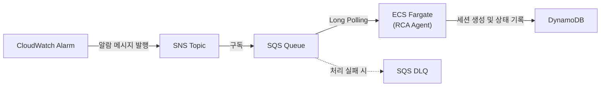

# ADR 0001: 알람 수신 아키텍처 — SNS + SQS + ECS Fargate

Date: 2026-04-21
Updated: 2026-07-31

## Status

Accepted (2026-04-21)

## Context

RCA Agent는 CloudWatch Alarm 발생 시 자동으로 근본 원인 분석을 시작해야 한다.
알람 수신부터 에이전트 실행까지의 경로를 설계해야 한다.

## Decision Drivers

- 알람 발생 시 사람 개입 없이 분석이 시작되고, 수신부터 분석 시작까지 **60초 이내**여야 한다. 콜드스타트가 이 목표를 위협한다.
- RCA는 최대 20분까지 수행되므로 15분 실행 상한이 있는 실행 모델은 쓸 수 없다([ADR agent/0006](../agent/0006-termination-conditions.md)).
- 알람 메시지가 유실되지 않아야 하고, 에이전트 장애 후 재처리가 가능해야 한다.
- 같은 알람으로 여러 RCA가 동시 실행되면 리소스 낭비와 결과 혼란이 발생한다.
- 각 RCA 세션의 진행 상태를 실시간으로 조회할 수 있어야 한다.

## Decision

**CloudWatch Alarm → SNS → SQS → ECS Fargate(Long Polling)** 아키텍처를 채택한다.

### 알람 전달 경로


```mermaid
flowchart LR
    CWA["CloudWatch Alarm"] -->|알람 메시지 발행| SNS["SNS Topic"]
    SNS -->|구독| SQS["SQS Queue"]
    SQS -->|Long Polling| Fargate["ECS Fargate\n(RCA Agent)"]
    SQS -.->|처리 실패 시| DLQ["SQS DLQ"]
    Fargate -->|세션 생성 및 상태 기록| DDB["DynamoDB"]
```

### 핵심 결정사항

1. **SNS → SQS 버퍼링**: SNS Topic이 알람을 수신하고 SQS Queue로 전달한다. SQS가 버퍼 역할을 하여 에이전트의 처리 속도와 무관하게 메시지를 안정적으로 보존한다.

2. **ECS Fargate 상시 실행 + Long Polling**: 에이전트는 Fargate에서 상시 실행되며 SQS를 Long Polling으로 구독한다. 콜드스타트 없이 알람 수신 즉시(목표 60초 이내) RCA를 시작할 수 있고, 장시간 실행에 타임아웃 제약이 없다.

3. **DynamoDB 기반 RCA 세션 상태 관리**: 알람 수신 즉시 DynamoDB에 RCA 세션을 생성하고 상태를 기록한다. 이를 통해 대시보드에서 실시간 진행 상태를 조회할 수 있다.

4. **상태 머신 기반 전이 검증**: 각 엔진은 허용된 상태 전이 집합을 정의하고, 전이 전에 현재 상태에서 목표 상태로의 이동이 허용되는지 검증한다. 허용되지 않은 전이는 거부한다. 저장소의 조건부 쓰기 가드는 동시성 보호를 위해 그대로 유지하고, 상태 머신은 그 위에서 논리적 검증 계층으로 동작한다 — 조건부 쓰기는 "누가 쓰는가"를 지키고 상태 머신은 "무엇으로 갈 수 있는가"를 지키므로 둘 중 하나만으로는 부족하다.

   **Strands 엔진 상태 전이**:
   ```
   ALARM_RECEIVED → SCOPING → HYPOTHESIS_GENERATION → HYPOTHESIS_PRIORITIZATION
   → EVIDENCE_COLLECTION → HYPOTHESIS_VALIDATION → REPORT_GENERATION → COMPLETED
   ```
   - HYPOTHESIS_VALIDATION에서 전체 기각 시 HYPOTHESIS_GENERATION으로 재진입 가능
   - HYPOTHESIS_VALIDATION에서 추가 증거 필요 시 EVIDENCE_COLLECTION으로 재진입 가능
   - 모든 non-terminal 상태에서 FAILED, OUTDATED, CANCELLED로 전이 가능

   **CC Headless 엔진 상태 전이**:
   ```
   ALARM_RECEIVED → ANALYZING → COMPLETED
   ```
   - ALARM_RECEIVED에서 ANALYZING, FAILED, CANCELLED로 전이 가능
   - ANALYZING에서 COMPLETED, FAILED, CANCELLED로 전이 가능

5. **이중 멱등성 체크**: SQS Visibility Timeout으로 동일 메시지 중복 처리를 1차 방지하고, DynamoDB에 알람 ID + 타임스탬프 기반 멱등성 키로 2차 중복을 방지한다. 기존 진행 중인 RCA가 있으면 새 메시지를 스킵한다.

6. **DLQ(Dead Letter Queue)를 통한 실패 메시지 보존**: 메시지 처리가 최대 3회 재시도 후에도 실패하면 DLQ로 이동하여 메시지를 보존한다. 이를 통해 장애 원인 사후 분석과 수동 재처리가 가능하다.

### 지원 알람 유형

단일 메트릭 알람과 Composite Alarm 모두 수신 가능하다. SNS 메시지 포맷이 동일하므로 별도 처리 분기 없이 AlarmName, NewStateReason, Trigger(MetricName, Namespace, Dimensions)를 파싱한다.

### 알람 발행 주체 제한

알람 입력 토픽의 발행은 **이 시스템이 소유한 알람만** 허용한다. 토픽 정책은 알람
서비스 주체를 허용하는 데서 멈추지 않고, 발행 요청이 **이 배포의 계정에서 시작되고
이 배포가 만든 알람에서 왔다는 것**을 함께 요구한다.

서비스 주체만 허용하면 해당 서비스를 쓰는 **모든 계정의 알람**이 발행 자격을
갖는다. 알람 하나가 두 분석 엔진의 전체 실행을 기동하므로, 외부에서 임의 알람을
발행할 수 있으면 이 시스템은 모델 호출 비용을 무제한으로 소모하고 조사 대상이 아닌
알람으로 세션을 만든다. 알람 수신은 인증 없는 진입점이므로 이 제한이 유일한 경계다.

발행 자격의 판단 기준은 요청의 내용이 아니라 요청의 출처다. 메시지 본문을 소비
시점에 검사하는 방식은 이미 발행된 메시지를 걸러낼 뿐이므로, 발행 자체를 막는
토픽 정책 조건으로 표현한다.

## 대안 검토

| 대안 | 장점 | 단점 및 미채택 이유 |
|------|------|---------------------|
| 이벤트 → 서버리스 함수 | 유휴 비용이 없고 운영 단위가 작다. | 15분 실행 상한이 20분 RCA 예산과 충돌해 복잡한 장애 분석이 중간에 끊긴다. |
| 이벤트 → 워크플로 엔진 → 함수 | 단계 격리와 재시도가 명확하다. | 에이전트 자체 루프가 이미 탐색을 오케스트레이션하므로 이중 오케스트레이션이 되고, 각 단계가 여전히 함수 실행 상한에 묶인다. |
| 이벤트 → 알람마다 태스크 실행 | 유휴 비용이 없고 실행이 완전히 격리된다. | 태스크 시작 콜드스타트가 30초~1분이라 60초 목표를 위협하고, 알람 급증 시 동시 태스크가 무제한 늘어난다. |
| 알림 → 큐 → 상시 워커 Long Polling | 콜드스타트 없이 즉시 수신하고 실행 시간 제약이 없으며, 큐가 급증을 버퍼링한다. | 알람이 없는 시간에도 컴퓨팅 비용이 발생하고 구성요소가 3계층으로 늘어난다. |

발행 주체 제한 방식의 대안:

| 대안 | 장점 | 단점 및 미채택 이유 |
|------|------|---------------------|
| 알람 서비스 주체만 허용 | 정책이 한 줄이고 알람 리소스 이름 변경에 영향받지 않는다. | 그 서비스를 쓰는 모든 계정이 발행 자격을 갖는다. 외부 계정의 알람이 두 엔진의 전체 실행을 기동해 모델 비용을 소모할 수 있다. |
| 소비 시점에 메시지 출처 검증 | 토픽 정책을 건드리지 않고 엔진 코드에서 판단한다. | 발행은 이미 일어난 뒤이므로 큐 비용과 소비 경로가 열려 있고, 두 엔진이 같은 검증을 따로 구현해 갈라진다. |
| 계정과 알람 출처를 함께 요구 | 발행 자체가 막히므로 소비 경로에 임의 알람이 도달하지 않는다. | 알람 리소스 식별 규칙이 정책에 들어가므로 알람을 다른 스택으로 옮길 때 정책도 함께 넓혀야 한다. |

## Consequences

### Positive

- 콜드스타트 없이 알람 수신 60초 이내 RCA 시작 가능
- SQS 버퍼링으로 알람 급증 시에도 메시지 유실 없이 순차 처리
- 장시간 RCA 실행에 타임아웃 제약 없음
- DLQ로 실패 메시지를 보존하여 사후 분석 및 재처리 가능
- DynamoDB 상태 관리로 RCA 진행 상황 실시간 추적 가능
- 이중 멱등성 체크로 중복 RCA 실행 방지
- 외부 계정의 알람이 분석을 기동할 수 없어, 인증 없는 진입점의 비용 소모 경로가 닫힌다

### Negative

- Fargate 상시 실행으로 알람이 없는 시간에도 컴퓨팅 비용 발생 (이벤트 기반 RunTask 대비 비용 증가)
- SQS Long Polling 기반이므로 최대 20초의 폴링 간격 지연이 발생할 수 있음
- SNS → SQS → Fargate 3계층 구조로 인프라 구성요소가 증가
- 알람을 다른 스택이나 계정으로 옮기면 토픽 정책의 출처 조건도 함께 넓혀야 한다. 조건을 갱신하지 않으면 새 알람의 발행이 조용히 거부된다

### Risks

- Fargate Task가 비정상 종료되면 SQS 메시지가 Visibility Timeout 후 재처리되지만, 그 사이 알람 대응이 지연될 수 있다. 헬스체크 및 자동 재시작 정책으로 완화한다.
- 대량 알람 동시 발생 시 단일 Fargate 인스턴스의 처리량이 병목이 될 수 있다. MVP 이후 오토스케일링 정책을 검토한다.
- DynamoDB 멱등성 체크와 SQS 처리 사이 레이스 컨디션 가능성이 있다. DynamoDB Conditional Write로 원자적 세션 생성을 보장한다.

## Related

- [ADR agent/0001: 초기 스코핑 + RCA 보고서 유사도 검색](../agent/0001-initial-scoping-and-report-similarity.md) — 알람 수신 후 스코핑을 시작하는 다음 단계
- [ADR infra/0002: 증거 저장](0002-evidence-storage.md) — 세션 상태 저장의 확장
- [ADR infra/0006: 세션 복구](0006-session-recovery-on-restart.md) — 메시지 확인 시점과 세션 소유권 규칙
