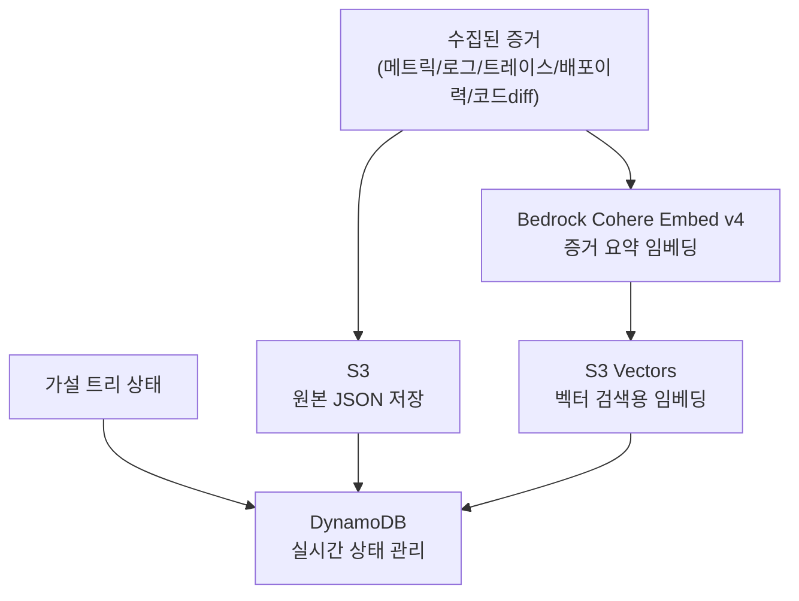

# ADR 0002: 증거 저장 — S3 + S3 Vectors + DynamoDB 기반 증거 아카이브

Date: 2026-04-21

## Status

Proposed

## Context

RCA 과정에서 수집된 증거(메트릭, 로그, 트레이스, 배포 이력, 코드 diff)와 가설 트리 상태를 체계적으로 저장하고, 향후 유사 장애 분석 시 과거 증거를 유사도 검색으로 빠르게 참조할 수 있어야 한다.

저장 요구사항:

1. **원본 데이터 보존**: 수집된 증거 원본을 변경 없이 저장하여 사후 검증에 활용
2. **벡터 검색 지원**: 과거 증거를 유사도 검색하여 현재 장애 분석에 참조
3. **실시간 상태 관리**: 가설 트리의 생성/검증/확정/기각 상태를 실시간으로 추적
4. **증거 보존 정책**: 적절한 보존 기간 후 자동 정리

## Decision

**S3(원본 저장) + S3 Vectors(벡터 검색) + DynamoDB(상태 관리)** 3계층 저장 전략을 채택한다.

### 저장 구조

### 핵심 결정사항

1. **S3 저장 경로**: `s3://{bucket}/rca/{rca_id}/evidence/{hypothesis_id}/{evidence_type}/` 구조로 저장한다. evidence_type은 `metrics/`, `logs/`, `traces/`, `deploy_history/`, `code_diff/`로 분류한다.

2. **S3 Vectors 임베딩**: 증거 데이터의 요약 텍스트를 Bedrock Cohere Embed v4로 임베딩하여 S3 Vectors에 저장한다. 메타데이터로 rca_id, hypothesis_id, evidence_type, alarm_type, service_name, timestamp를 함께 저장한다.

3. **DynamoDB 가설 트리**: PK는 rca_id, SK는 hypothesis_id로 구성한다. parent_id, depth, status, confidence_score, evidence_refs, vector_ids, created_at, updated_at를 속성으로 관리한다.

4. **증거 보존 정책**: S3 원본 증거는 RCA 완료 시점 기준 60일 보존 후 S3 Lifecycle으로 자동 삭제한다. S3 Vectors 임베딩은 플레이북과 동일 주기로 관리한다. DynamoDB 가설 트리 상태는 90일 보존한다.

5. **감사 로그**: 모든 증거 저장/조회 행위를 CloudTrail로 기록한다.

6. **임베딩 실패 처리**: S3 Vectors 임베딩 저장 실패 시 S3에 원본 증거는 저장하되, 임베딩 저장을 비동기로 재시도한다.

## Consequences

### Positive

- 3계층 분리로 원본 보존, 벡터 검색, 실시간 상태 관리를 각각 최적화
- S3 Vectors 인덱싱으로 과거 증거를 유사도 검색하여 현재 RCA에 참조 가능
- 구조화된 S3 경로로 증거 접근과 관리 용이
- S3 Lifecycle으로 비용 효율적인 증거 보존 정책 적용

### Negative

- 3개 저장소 관리로 인프라 복잡도 증가
- S3 Vectors 임베딩 비용이 증거 수량에 비례하여 발생
- DynamoDB 쓰기 쓰로틀링 시 상태 업데이트 지연 가능

### Risks

- S3 저장 실패가 RCA 흐름을 블로킹할 수 있다. 최대 3회 재시도 후 DynamoDB에 "저장 실패" 메타데이터만 기록하여 완화한다.
- DynamoDB 쓰로틀링이 동시 다수 RCA 실행 시 발생할 수 있다. 온디맨드 용량 모드 또는 프로비저닝 오토스케일링으로 완화한다.

## Related

- [ADR infra/0001: 알람 수신 아키텍처](0001-alarm-ingestion-sns-sqs-fargate.md) — DynamoDB RCA 세션 상태 관리의 확장
- [ADR agent/0008: 플레이북 생성](../agent/0008-playbook-generation.md) — 플레이북도 S3 + S3 Vectors에 저장
