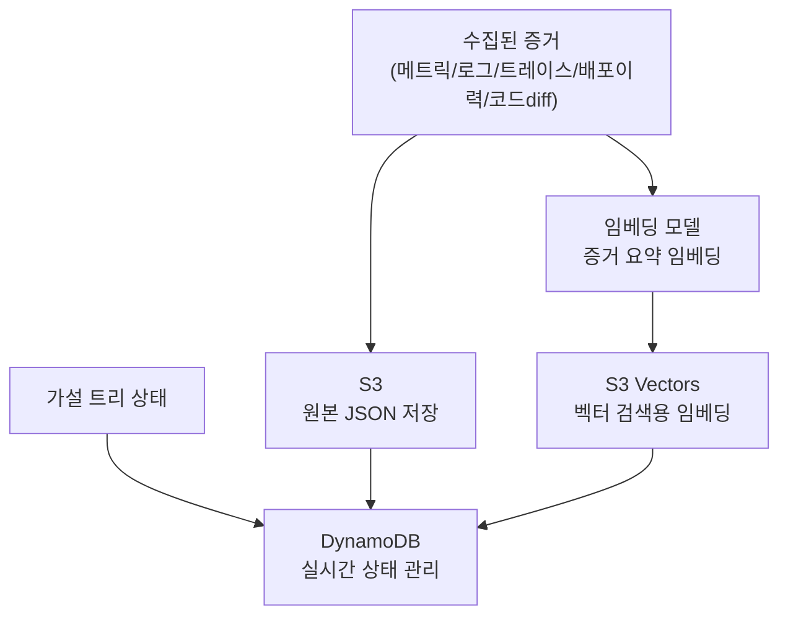

# ADR 0002: 증거 저장 — S3 + S3 Vectors + DynamoDB 기반 증거 아카이브

Date: 2026-04-21

## Status

Accepted (2026-04-21)

## Context

RCA 과정에서 수집된 증거(메트릭, 로그, 트레이스, 배포 이력, 코드 diff)와 가설 트리 상태를 체계적으로 저장하고, 향후 유사 장애 분석 시 과거 증거를 유사도 검색으로 빠르게 참조할 수 있어야 한다.

## Decision Drivers

- 수집된 증거 원본은 변경 없이 보존되어야 한다. 사후 검증에서 요약이 아닌 원본을 봐야 하는 경우가 있다.
- 과거 경험을 유사도로 검색할 수 있어야 한다([ADR agent/0001](../agent/0001-initial-scoping-and-report-similarity.md)).
- 가설 트리의 상태 변화를 실시간으로 조회할 수 있어야 한다. 대시보드가 진행 중인 분석을 보여주기 때문이다.
- 증거는 무기한 축적되어서는 안 된다. 보존 기간 후 자동 정리되어야 한다.
- 증거 저장 실패가 RCA 분석을 중단시켜서는 안 된다.

## Decision

**S3(원본 저장) + S3 Vectors(벡터 검색) + DynamoDB(상태 관리)** 3계층 저장 전략을 채택한다.

### 저장 구조

```mermaid
flowchart TD
    Evidence["수집된 증거\n(메트릭/로그/트레이스/배포이력/코드diff)"] --> S3["S3\n원본 JSON 저장"]
    Evidence --> Embed["임베딩 모델\n증거 요약 임베딩"]
    Embed --> SV["S3 Vectors\n벡터 검색용 임베딩"]
    HypTree["가설 트리 상태"] --> DDB["DynamoDB\n실시간 상태 관리"]
    S3 --> DDB
    SV --> DDB
```

### 핵심 결정사항

1. **RCA·가설 단위로 분할된 저장 경로**: 증거 원본은 RCA 식별자와 가설 식별자로 구분된 경로에 저장한다. 가설별로 경로가 갈라지므로 특정 가설의 증거만 조회하거나 정리할 수 있고, 가설별 컨텍스트 격리와 저장 구조가 일치한다([ADR agent/0014](../agent/0014-hierarchical-evidence-session-isolation.md)).

2. **벡터 인덱스는 경량 메타데이터만 보유**: 증거 요약을 임베딩해 벡터 인덱스에 저장하되, 인덱스 메타데이터에는 크기 제한이 있어 검색·판별에 필요한 최소 필드만 담는다. 상세는 상태 저장소에서 식별자로 조회한다. 같은 상세를 두 저장소에 중복 저장하면 갱신 시 어긋나므로, 인덱스는 "무엇을 찾을지"만 알고 "무엇인지"는 저장소가 갖는다([ADR agent/0008](../agent/0008-playbook-generation.md)).

3. **가설 트리 상태를 RCA 단위 파티션에 저장**: RCA 식별자로 파티션하고 가설 식별자로 정렬해, 한 RCA의 가설 전체를 단일 조회로 읽는다. 부모 참조와 깊이를 함께 기록해 트리 구조를 복원할 수 있게 한다.

4. **증거 보존 정책**: 증거 원본은 RCA 완료 기준 **60일** 보존 후 자동 삭제한다. 가설 트리 상태는 **90일** 보존한다. 상태를 원본보다 오래 두는 이유는, 원본이 정리된 뒤에도 어떤 가설이 어떤 판정을 받았는지는 조회 가치가 남기 때문이다.

5. **증거 접근 감사**: 증거 저장·조회 행위는 클라우드 감사 로그에 기록된다. 증거에는 운영 로그와 코드가 포함되므로 누가 언제 접근했는지 추적 가능해야 한다.

6. **저장 실패의 비차단 처리**: 벡터 인덱싱이 실패해도 증거 원본 저장은 완료하고 인덱싱만 재시도한다. 검색 가능성은 편의이고 원본 보존은 계약이므로, 둘의 실패 처리를 다르게 둔다.

## 대안 검토

| 대안 | 장점 | 단점 및 미채택 이유 |
|------|------|---------------------|
| 단일 저장소(관계형 DB)에 모두 저장 | 저장소가 하나라 일관성 관리가 쉽고 조인 질의가 가능하다. | 증거 원본이 수십 KB~MB 규모여서 행 크기와 비용이 급증하고, 유사도 검색을 위한 벡터 인덱스가 없어 과거 경험 검색이 성립하지 않는다. |
| 원본과 상태를 모두 오브젝트 스토리지에 저장 | 저장 비용이 가장 낮다. | 진행 중 분석의 상태를 실시간 조회·갱신할 수 없어 대시보드가 성립하지 않고, 조건부 갱신으로 동시성을 제어할 수 없다. |
| 벡터 인덱스에 상세까지 함께 저장 | 검색 한 번으로 상세를 얻어 조회 홉이 줄어든다. | 메타데이터 크기 제한을 넘고, 같은 상세가 두 저장소에 존재해 갱신 시 어긋난다. |
| 원본·벡터·상태 3계층 분리 | 각 접근 패턴(보존, 검색, 실시간 갱신)에 맞는 저장소를 쓴다. | 저장소가 셋이라 인프라 복잡도와 정합성 관리 부담이 늘어난다. |

## Consequences

### Positive

- 3계층 분리로 원본 보존, 벡터 검색, 실시간 상태 관리를 각각 최적화
- 벡터 인덱싱으로 과거 증거·보고서를 유사도 검색해 현재 RCA에 참조 가능
- RCA·가설 단위 경로로 증거 접근과 선택적 정리가 용이
- 수명주기 정책으로 비용 효율적인 보존 정책 적용

### Negative

- 3개 저장소 관리로 인프라 복잡도 증가
- 임베딩 비용이 증거 수량에 비례하여 발생
- 상세 조회에 저장소 홉이 하나 더 필요하다 (벡터 검색 → 상태 저장소)
- 상태 저장소 쓰로틀링 시 상태 업데이트 지연 가능

### Risks

- 증거 저장 실패가 RCA 흐름을 막을 수 있다. 재시도 후에도 실패하면 "저장 실패"를 메타데이터로만 기록하고 분석을 계속한다.
- 동시 다수 RCA 실행 시 상태 저장소 쓰로틀링이 발생할 수 있다. 온디맨드 용량 모드로 완화한다.
- 원본 보존 60일이 지난 뒤 그 RCA에서 파생된 플레이북 상세를 로드할 수 없어 같은 유형의 플레이북이 새로 생성될 수 있다([ADR agent/0008](../agent/0008-playbook-generation.md)).

## Related

- [ADR infra/0001: 알람 수신 아키텍처](0001-alarm-ingestion-sns-sqs-fargate.md) — DynamoDB RCA 세션 상태 관리의 확장
- [ADR infra/0005: 파이프라인 실행 트레이스](0005-execution-trace-dynamodb.md) — 가설 트리 상태 저장의 구현
- [ADR agent/0008: 플레이북 생성](../agent/0008-playbook-generation.md) — 플레이북도 같은 3계층에 저장
