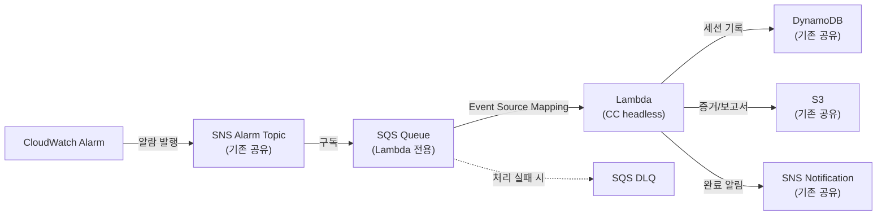
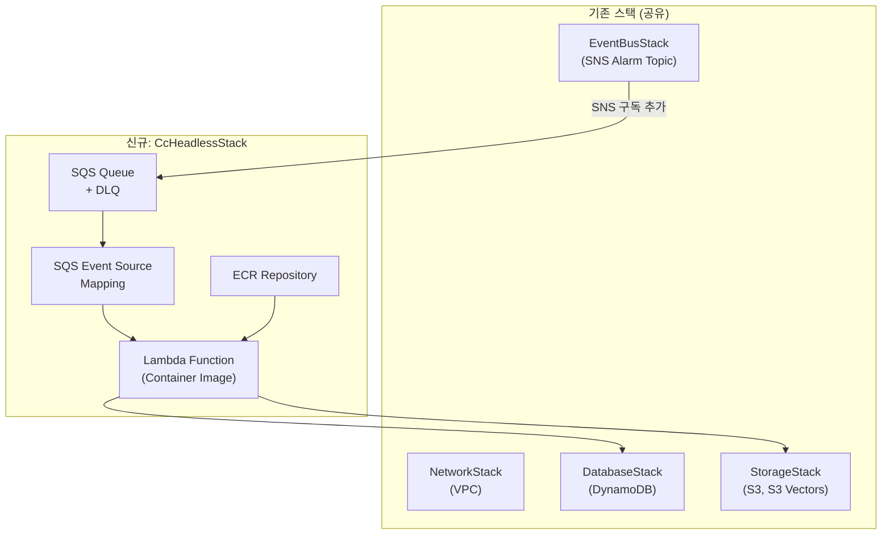

# ADR 0003: Lambda + CC on Bedrock headless 스택 — 서버리스 RCA 실행 인프라

Date: 2026-04-22
Updated: 2026-04-22

## Status

Accepted

## Context

기존 RCA 에이전트는 ECS Fargate에서 상시 실행되며 SQS를 Long Polling으로 구독한다(infra/0001). 이 구조는 장시간 실행이 가능하지만, 알람이 없는 시간에도 컴퓨팅 비용이 발생한다. CC on Bedrock headless 기반 프롬프트 주도 RCA(agent/0011)를 도입하면서, 서버리스 실행 환경이 필요하다.

검토한 대안:

- **Lambda (Container Image) + SQS Event Source**: SQS에서 Lambda를 직접 트리거. 가장 단순하지만 15분 타임아웃 제약이 있음
- **Step Functions + Lambda**: 단계별 Lambda 호출로 타임아웃 우회 가능. 그러나 CC headless가 단일 호출로 전체 RCA를 수행하므로 단계 분리가 불필요하여 복잡도만 증가
- **Lambda + ECS RunTask 위임**: Lambda에서 Fargate Task를 실행하여 타임아웃 제약 해소. 그러나 콜드스타트 30초~1분 발생하며, 이미 Fargate 스택이 존재하므로 차별화가 안 됨

CC headless의 RCA 분석은 프롬프트 지시로 10분 이내 완료를 유도할 수 있으므로, Lambda 15분 타임아웃으로 충분하다고 판단한다.

## Decision

**SNS → SQS → Lambda (Container Image)** 아키텍처를 채택한다. Lambda 컨테이너 이미지에 Claude Code CLI를 포함하고, SQS Event Source Mapping으로 알람을 수신한다.

### 알람 전달 경로

### 핵심 결정사항

1. **SNS Topic 공유, SQS Queue 분리**: 기존 Fargate 스택의 SNS Alarm Topic에 새로운 SQS Queue를 구독으로 추가한다. 두 스택이 동일 알람을 독립적으로 수신하여 A/B 비교가 가능하다. 필요 시 한쪽 SQS 구독을 비활성화하여 단일 스택만 운영할 수 있다.

2. **Lambda Container Image**: `public.ecr.aws/lambda/nodejs:22` base 이미지에 CC CLI, MCP 설정 파일, `uv` (standalone installer)를 포함한 컨테이너 이미지를 ECR에 저장한다. Lambda base 이미지가 Runtime Interface Client를 내장하므로 별도 RIC 설치가 불필요하다. Python은 시스템 패키지 대신 `uv`가 자체 관리하는 Python을 사용하여 Lambda base 이미지의 OpenSSL 버전 충돌을 회피한다.

3. **Lambda 설정**:
   - 타임아웃: 900초 (15분, Lambda 최대값)
   - 메모리: 2048MB (CC CLI subprocess + MCP 서버 동시 실행 고려)
   - 아키텍처: ARM64 (비용 최적화)
   - 동시성: Reserved concurrency 1 (한 번에 하나의 RCA만 실행, 리소스 경합 방지)
   - 임시 스토리지: 512MB (CC 워크스페이스 및 임시 파일용)

4. **SQS Event Source Mapping**:
   - batchSize: 1 (알람 1건씩 처리)
   - maxConcurrency: 1 (Reserved concurrency와 일치)
   - Visibility Timeout: 960초 (Lambda 타임아웃 + 60초 여유)
   - DLQ: maxReceiveCount 3 후 DLQ 이동

5. **IAM 권한**: 기존 Fargate Task Role과 동일한 권한 셋을 Lambda Execution Role에 부여한다 — DynamoDB 읽기/쓰기, S3 읽기/쓰기, S3 Vectors 조회/저장, Bedrock InvokeModel, SNS Publish. CloudWatch와 CloudTrail은 `CloudWatchReadOnlyAccess`, `AWSCloudTrail_ReadOnlyAccess` AWS 매니지드 정책으로 부여하여 MCP 서버가 사용하는 모든 읽기 API를 커버한다.

6. **환경변수**:
   - `CLAUDE_CODE_USE_BEDROCK=1`: Bedrock 백엔드 활성화
   - `ANTHROPIC_DEFAULT_SONNET_MODEL`: 사용할 모델 ID
   - `DYNAMODB_TABLE_NAME`, `S3_EVIDENCE_BUCKET`, `S3_VECTOR_BUCKET_NAME`, `S3_REPORT_BUCKET`, `SNS_NOTIFICATION_TOPIC_ARN`: 기존 공유 리소스
   - `GITHUB_PERSONAL_ACCESS_TOKEN`: GitHub MCP용 (Secrets Manager에서 주입)

7. **MCP 서버 설정**: Lambda 컨테이너 이미지 내 MCP 설정 파일(`.mcp.json`)에 CloudWatch MCP, CloudTrail MCP, GitHub MCP를 정의한다. CC headless가 시작 시 이 설정을 읽어 MCP 서버를 자동 연결한다.

8. **멱등성**: 기존 DynamoDB 기반 멱등성 체크를 그대로 활용한다. `engine` 필드로 실행 엔진을 구분하여 Fargate/Lambda 양쪽에서 동일 알람을 중복 처리하지 않도록 한다.

9. **결과 저장**: CC headless의 JSON 출력을 파싱하여 기존 스택과 동일한 경로에 저장한다 — S3 보고서(`reports/{rca_id}.md`), S3 Vectors 플레이북, DynamoDB 세션 상태.

### CDK 스택 구성

기존 스택과 독립적인 새 CDK 스택으로 추가한다:

## Consequences

### Positive

- 알람이 없는 시간에 컴퓨팅 비용 제로 (Fargate 상시 실행 비용 절감)
- 기존 인프라(SNS, DynamoDB, S3)를 그대로 재사용하여 추가 인프라 비용 최소화
- A/B 비교 가능 — 동일 알람에 대해 Fargate vs Lambda 결과를 비교할 수 있음
- Lambda 자동 스케일링으로 동시 알람 처리 가능 (Reserved concurrency 조정 시)
- CDK 스택이 독립적이므로 기존 스택에 영향 없이 배포/롤백 가능

### Negative

- Lambda 15분 타임아웃으로 복잡한 RCA가 중단될 수 있음 (Fargate는 제한 없음)
- CC CLI 포함 컨테이너 이미지 크기가 커서 콜드스타트가 길어질 수 있음
- Lambda 2048MB 메모리로 CC CLI + MCP 서버 동시 실행 시 메모리 압박 가능
- Reserved concurrency 1로 제한 시 알람 폭증 시 처리 대기열이 길어짐

### Risks

- Lambda 컨테이너 이미지에서 CC CLI의 subprocess 실행이 제한될 수 있다. Lambda 컨테이너 런타임은 일반적인 Linux 프로세스를 지원하므로 가능하지만, `/tmp` 디스크 용량과 프로세스 수 제한을 사전 검증한다.
- CC headless가 MCP 서버를 시작하는 데 시간이 걸려 Lambda 호출 초기 지연이 발생할 수 있다. SnapStart 또는 Provisioned Concurrency로 완화를 검토한다.
- 두 스택이 동일 DynamoDB 테이블을 공유하므로, 멱등성 체크 없이 양쪽이 동시에 같은 알람을 처리하면 충돌이 발생한다. DynamoDB Conditional Write로 원자적 세션 생성을 보장한다.

## Related

- [ADR agent/0011: CC headless 기반 프롬프트 주도 RCA](../agent/0011-cc-headless-prompt-driven-rca.md) — Lambda에서 실행될 RCA 에이전트 설계
- [ADR infra/0001: 알람 수신 아키텍처 (Fargate)](0001-alarm-ingestion-sns-sqs-fargate.md) — 기존 Fargate 기반 스택
- [ADR infra/0002: 증거 저장](0002-evidence-storage.md) — 공유 저장소 아키텍처
