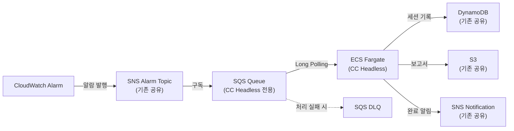

# ADR 0003: CC Headless 스택 — ECS Fargate 기반 RCA 실행 인프라

Date: 2026-04-22
Updated: 2026-04-23

## Status

Accepted (Updated — Lambda에서 ECS Fargate로 전환)

## Context

CC on Bedrock headless 기반 프롬프트 주도 RCA(agent/0011)를 실행할 인프라가 필요하다. 초기 설계(2026-04-22)에서는 Lambda Container Image를 채택했으나, 다음 문제가 확인되어 ECS Fargate로 전환한다:

1. **Lambda 15분 타임아웃**: CC headless가 30턴까지 MCP 도구를 호출하며 분석하면 10분을 초과하는 경우가 빈번하다. 프롬프트 지시로 제한하더라도 복잡한 알람에서는 타임아웃 리스크가 높다
2. **CC CLI 콜드스타트**: Lambda 컨테이너 이미지에서 CC CLI + MCP 서버 초기화에 10-20초가 소요되어, 호출마다 반복되는 오버헤드가 크다
3. **아키텍처 통일**: 기존 Strands Agent가 이미 ECS Fargate + SQS Long Polling 패턴(infra/0001)을 사용하므로, CC Headless도 동일 패턴을 사용하면 운영/배포 스크립트를 통일할 수 있다

ECS Fargate로 전환하면 타임아웃 제약이 없고, CC CLI가 상시 실행 환경에서 MCP 서버를 한 번만 초기화하며, 배포 스크립트(`deploy-service.sh`)를 공유할 수 있다.

## Decision

**SNS → SQS → ECS Fargate (Long Polling)** 아키텍처를 채택한다. Strands Agent 스택(infra/0001)과 동일한 패턴이되, 별도 ECS 클러스터/서비스로 독립 운영한다.

### 알람 전달 경로

### 핵심 결정사항

1. **SQS Long Polling**: Fargate Task가 상시 실행되며 SQS를 20초 간격으로 Long Polling한다. Strands Agent와 동일한 패턴이다.

2. **컨테이너 이미지**: `python:3.12-slim` base에 Node.js(`node:22-slim`에서 바이너리 복사), CC CLI(`@anthropic-ai/claude-code`), GitHub MCP 서버(Go 바이너리), uv를 포함한다. Docker 멀티스테이지 빌드로 최적화한다.

3. **ECS 설정**:
   - CPU: 1024 (1 vCPU)
   - Memory: 2048MB
   - 아키텍처: ARM64 (Graviton, 비용 최적화)
   - Desired Count: 1 (한 번에 하나의 RCA만 실행)
   - Health Check: `GET /healthz` (HTTP 8080)

4. **MCP 서버 연결**: 컨테이너 내 `mcp-config.json`에 CloudWatch MCP, CloudTrail MCP, AWS Knowledge MCP, GitHub MCP를 정의한다. CC headless가 시작 시 `--mcp-config` 플래그로 이 설정을 읽어 MCP 서버를 자동 연결한다.

5. **세션 상태 관리**: 기존 DynamoDB 테이블에 세션을 기록한다. `engine` 필드를 `cc-headless`로 설정하여 Strands Agent(`strands`)와 구분한다.

6. **멱등성**: DynamoDB Conditional Write 기반 이중 멱등성 체크(idempotency key + session creation)를 사용한다.

7. **구조화 로깅**: structlog 라이브러리로 구조화된 로그를 출력한다. ECS 환경(`ECS_CONTAINER_METADATA_URI_V4` 존재)에서는 JSON 포맷, 로컬에서는 plain text 포맷을 자동 선택한다.

8. **파일 경로 탐색**: 프롬프트 파일(`prompts/`)과 MCP 설정(`mcp-config.json`)은 `Path.parents` 순회 방식으로 탐색한다. 컨테이너(`/app/src/cc_headless/`)와 로컬 개발 환경 모두에서 동작한다.

### 공유 인프라

Strands Agent 스택과 다음 인프라를 공유한다:
- SNS Alarm Topic (동일 알람을 양쪽에서 수신)
- DynamoDB RCA 세션 테이블
- S3 보고서 버킷
- SNS 알림 Topic

## Consequences

### Positive

- 타임아웃 제약 없이 복잡한 RCA를 끝까지 수행할 수 있다
- Strands Agent와 동일한 ECS 패턴으로 배포 스크립트(`deploy-service.sh`), 모니터링, 운영 절차를 통일할 수 있다
- 상시 실행으로 콜드스타트 없이 알람 수신 즉시 분석을 시작할 수 있다
- A/B 비교 가능 — 동일 알람에 대해 Strands vs CC Headless 결과를 비교할 수 있다

### Negative

- 상시 실행으로 알람이 없는 시간에도 컴퓨팅 비용이 발생한다 (Lambda 대비 비용 증가)
- SQS Long Polling 기반이므로 최대 20초의 폴링 간격 지연이 발생할 수 있다

### Risks

- Fargate Task가 비정상 종료되면 진행 중인 RCA가 유실된다. SQS Visibility Timeout 후 메시지가 재처리되지만, DynamoDB에 `ANALYZING` 상태로 남은 세션에 대한 복구 메커니즘이 필요하다
- CC headless가 프롬프트 지시를 무시하고 과도한 도구 호출을 수행할 수 있다. `--max-turns` 플래그로 최대 턴 수를 제한하여 완화한다
- 두 스택이 동일 DynamoDB 테이블을 공유하므로, 멱등성 체크 없이 양쪽이 동시에 같은 알람을 처리하면 충돌이 발생한다. DynamoDB Conditional Write로 원자적 세션 생성을 보장한다

## Related

- [ADR agent/0011: CC headless 기반 프롬프트 주도 RCA](../agent/0011-cc-headless-prompt-driven-rca.md) — CC Headless RCA 에이전트 설계
- [ADR infra/0001: 알람 수신 아키텍처 (Fargate)](0001-alarm-ingestion-sns-sqs-fargate.md) — Strands Agent의 동일 패턴
- [ADR infra/0002: 증거 저장](0002-evidence-storage.md) — 공유 저장소 아키텍처
