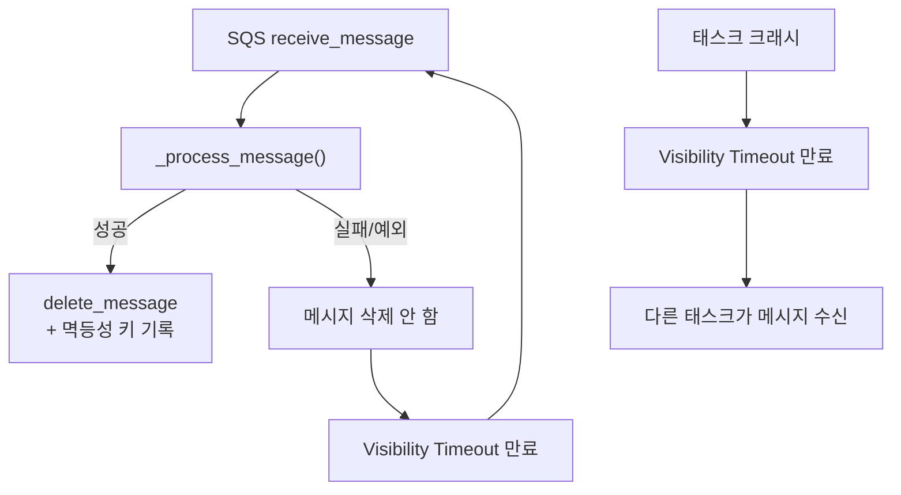

# ADR 0006: SQS Visibility Timeout 기반 미완료 RCA 세션 자동 복구

Date: 2026-04-23

## Status

Accepted

## Context

ECS Fargate에서 실행되는 CC Headless는 다음 상황에서 재시작될 수 있다:

1. **서비스 배포**: `deploy-service.sh`로 force new deployment 실행 시 기존 태스크가 SIGTERM → DRAINING → 종료
2. **태스크 장애**: OOM, 헬스체크 실패, 인프라 이벤트 등으로 태스크가 비정상 종료
3. **수동 재시작**: ECS 콘솔이나 CLI에서 태스크를 직접 중지

기존 설계에서는 SQS 메시지를 처리 시작 시점에 즉시 삭제(`delete_message`)하고, DynamoDB에서 세션 상태를 관리했다. 이 경우:

- 처리 중 태스크가 죽으면 SQS 메시지는 이미 삭제되어 재처리할 수 없다
- DynamoDB에 진행 중 상태(`ANALYZING` 등)로 남은 세션이 영원히 미완료 상태가 된다
- 멱등성 키가 이미 기록되어 같은 알람이 다시 와도 중복으로 스킵된다

### 검토한 대안

1. **Heartbeat + Scan + Claim**: 서비스 시작 시 DynamoDB를 스캔하여 stale 세션을 찾고, 조건부 쓰기로 복구를 클레임하는 방식. 그러나 heartbeat이 CPU 쓰로틀이나 GC 지연으로 늦어지면 정상 진행 중인 세션을 잘못 stale로 판단할 위험이 있고, heartbeat 스레드 관리가 복잡하다.

2. **SQS Visibility Timeout 활용 (채택)**: 메시지 삭제를 처리 완료 시점으로 미뤄 SQS의 내장 재전달 메커니즘을 활용하는 방식.

## Decision

SQS 메시지 삭제 시점을 **처리 성공 후**로 변경하여, 실패/크래시 시 SQS가 자동으로 메시지를 재전달하는 방식으로 복구한다.

### 핵심 변경사항

1. **메시지 삭제 시점 변경**: `finally` 블록(항상 삭제)에서 성공 시에만 삭제로 변경. 처리 실패 또는 태스크 크래시 시 메시지가 삭제되지 않아 visibility timeout 후 SQS에 다시 나타난다.

2. **멱등성 키 기록 시점 변경**: 세션 생성 시점이 아닌 **RCA 완료 시점**에 멱등성 키를 기록한다. 이를 통해 재전달된 메시지가 중복 체크에 걸리지 않고 재처리된다.

3. **Heartbeat/Scan/Claim 제거**: DynamoDB 기반 복구 인프라(heartbeat 스레드, stale 세션 스캔, 조건부 클레임)를 모두 제거한다. SQS가 복구 메커니즘을 대체한다.

### 복구 흐름

### SQS Visibility Timeout 설정

- SQS 큐의 Visibility Timeout을 CC Headless의 최대 처리 시간(`CC_TIMEOUT_SECONDS`, 기본 600초)보다 충분히 크게 설정한다 (예: 900초).
- 처리 중 다른 컨슈머가 같은 메시지를 받지 않도록 보장한다.

## Consequences

### Positive

- **단순성**: heartbeat 스레드, stale 스캔, 조건부 클레임 등 복잡한 복구 로직이 불필요하다
- **신뢰성**: SQS의 검증된 재전달 메커니즘에 의존하므로 false positive(정상 세션을 stale로 오판)이 없다
- **CPU 쓰로틀 내성**: heartbeat 방식과 달리 CPU 부하가 높아도 복구 판단에 영향을 주지 않는다
- **다중 인스턴스 안전**: SQS가 메시지를 하나의 컨슈머에게만 전달하므로 경합이 발생하지 않는다

### Negative

- **재처리 지연**: visibility timeout이 만료될 때까지 기다려야 하므로 크래시 후 복구까지 최대 visibility timeout만큼 지연된다
- **처음부터 재실행**: 중간 상태를 복원할 수 없으므로 이미 수행한 분석이 반복된다 (CC Headless는 subprocess 기반이라 중간 상태 직렬화 불가)
- **DDB에 FAILED 세션 누적**: 크래시 후 재처리 시 이전 세션이 FAILED로 남고 새 세션이 생성된다

### Risks

- Visibility timeout이 실제 처리 시간보다 짧으면 처리 중에 메시지가 재전달되어 중복 처리가 발생할 수 있다. `CC_TIMEOUT_SECONDS`보다 50% 이상 여유를 두고 설정한다.

## Related

- [ADR infra/0001: 알람 수신 아키텍처](0001-alarm-ingestion-sns-sqs-fargate.md) — SQS 메시지 처리 흐름
- [ADR infra/0003: CC Headless 스택](0003-lambda-cc-headless-stack.md) — CC Headless ECS Fargate 인프라
- [ADR infra/0005: 실행 트레이스 DynamoDB](0005-execution-trace-dynamodb.md) — 세션 상태 관리
