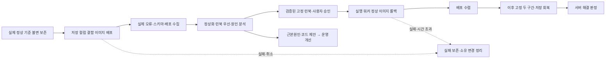

# ADR 0007: 단일 저장 컬럼 오류 데모 — 실제 증거·승인 롤백·복구 검증

Date: 2026-07-29
Updated: 2026-09-17

## Status

Proposed

## Context

Healthcare의 센서 저장이 실패할 때 실제 오류와 배포 변경으로 원인을 확정하고,
사람이 승인한 정상 이미지로 실행 워커가 복구할 수 있어야 한다. 정상 리비전을
준비자만 알고 있으면 모델이 롤백 대상을 추정하게 되고, 배포 요청의 성공만 확인하면
저장이 계속 실패하는 서비스도 해결로 표시할 수 있다.

## Decision Drivers

- 실제 DB가 실행한 SQL과 실제 스키마의 불일치가 저장 실패를 만들어야 한다.
- 원인 확정과 승인된 조치 후 실제 회복을 하나의 실행 계보로 검증해야 한다.
- 정상 대상은 장애 이전 저장 성공 관측으로 입증되어야 한다.
- 알람과 이미지 이름은 증거를 찾는 단서이며 정답을 제공해서는 안 된다.
- 같은 부하 조건과 소유권을 유지해 다른 배포와 운영자 정리를 자동 성공에서 구별해야 한다.

## Decision

활성 데모는 PostgreSQL 저장 컬럼 불일치 하나다. Strands는 검증된 정상 기준과
입력 호환성에 근거한 고정 정상화 런북을 먼저 제공한다. 근본원인·코드 수정 제안과
운영 개선·CI 예방 제안은 그 뒤 순차 진행하고 사용자 승인·실행 결과를 기다리지 않는다.
실행 워커는 사용자 승인 뒤에만 정상 이미지 롤백, 배포 수렴과 실제 저장 회복을 수행한다.
전체 데모 성공에는 올바른 원인 분석과 필요한 분석 산출물, 승인된 실행과 서버의
해결 판정이 모두 필요하다. 실행 증거 기반 회고·검증됨 승격은 해결 뒤 별도로 기록한다.

### 실제 결함과 관측 계약

| 의무 | 관측 가능한 충족 결과 |
|---|---|
| 같은 소스 스냅샷에서 정상·결함 이미지의 실제 차이를 저장 INSERT 컬럼 참조 한 곳으로 한정한다. | 정상은 `sensor_readings.timestamp`, 결함은 없는 `sampled_at`을 참조하고 실제 PostgreSQL 오류 SQLSTATE `42703`이 발생한다. |
| 실제 스키마에서 `timestamp` 존재와 `sampled_at` 부재를 주입 전에 확인한다. | 전제 불일치 시 주입이 중단되고 스키마와 데이터가 바뀌지 않는다. |
| 정상 서비스 동작을 보존한다. | ORM 모델·테이블 정의·기동 초기화·기존 데이터·센서/알림 조회·헬스 응답 본문·트랜잭션 정리가 정상이며 부분 저장이나 연결 누수가 없다. |
| 정상·장애·복구에 동일 요청 내용과 부하를 적용한다. | 요청 시작·완료·실패·진행 중 및 실행하지 못한 요청이 구별되고 무한 대기열이나 몰아 보내기가 없다. |
| 실제 오류·스키마·배포/코드·서비스 증상을 수집한다. | 안전한 드라이버 진단, 정상·장애 구간의 실제 컬럼 목록과 관측 시각, 실행 태스크·태스크 정의·이미지 지문·배포 시각과 SQL 차이, 저장 성공/실패·요청량·조회·헬스가 원본 참조와 연결된다. |
| 진단은 실제 허용 필드만 사용한다. | 없는 오류 필드를 추정하지 않으며 컬럼명이 없으면 실제 SQL 식별자와 스키마를 대조한다. 스키마 조회는 실패한 트랜잭션 밖에서 읽기 전용으로 수행한다. |
| 민감 데이터가 진단 경로로 나가지 않는다. | SQL 매개변수·환자 값·자격 증명이 HTTP 오류·배경 작업·로그·트레이스·증거에 없고 시험용 민감 값으로 비노출을 확인한다. |
| 활성 카탈로그와 실행 진입점은 이 결함만 제공한다. | 다른 결함을 선택하는 분기가 없으며 정상 기능·일반 안전 검증과 과거 실측·실패·승인 이력은 남는다. |

이미지 지문은 이미지 내용을 식별하는 해시이며 태스크 정의가 직접 참조한다. 새 리비전
식별자를 사용하고 과거 식별자를 재사용하지 않는다. 예외·로그·알람 상태를 합성하거나
DB 호출 전 오류로 실패를 흉내 내지 않는다. 분석 엔진에는 DB 쓰기 권한을 추가하지 않는다.

저장 실패 알람은 증상만 전달한다. 30초 집계, 1분 주기 2회 평가와 최소 2분 30초
관측 구간을 유지하고 알람 임계치·차원·평가 조건을 바꾸지 않는다. 요청 완료와 독립적인
지표 방출 및 기존 완료 기반 계수 의미를 유지한다. 알람 설명·이미지 이름·시나리오
식별자를 정답으로 쓰지 않으며 준비된 정답 관측을 배포 분석에 주입하지 않는다.
관측 부재를 경쟁 원인의 반증으로 사용하지 않는다.

### 장애 이전 정상 기준과 실행 소유권

1. 데모 실행기는 정상 이미지의 실제 저장 성공을 먼저 검증하고 기존 증거 S3 버킷의
   허용된 전용 정상 기준 영역에 실행별 불변 기록을 게시한다. 이 기록 없이 장애를
   시작하지 않는다. 정상/결함 이미지는 시연 전에 빌드한다.
2. 정상 기준은 계정·리전·클러스터·서비스·애플리케이션 컨테이너, 정상 태스크 정의 ARN,
   실제 실행 이미지 지문, 소스·SQL 형태 지문, 저장 완료 증거·실패 지표·실제 스키마·
   관측 시각, 트래픽 조건·유지할 서비스 설정·실행 ID·원본 위치와 내용 지문을 담는다.
   정상이라는 판정 문구만으로는 저장 성공 근거가 되지 않는다.
3. 알람 메타데이터에는 정상 기준 참조·실행 ID·서비스 좌표만 연결하며 원인이나 복구
   정답 문구를 넣지 않는다. 원래 메타데이터와 부재 값도 보존하고 종료 시 복원한다.
4. 새 RCA 세션은 수신 알람 원본의 참조를 고정한다. 초기 수집은 설정된 버킷·허용 영역,
   내용 지문, 같은 실행과 서비스, 장애 이전 관측인지 읽기 전용으로 검증한다. 외부
   임의 위치·다른 계정 자료를 따라가지 않는다. 정상 저장이나 필수 자료가 검증되지
   않으면 롤백 대상을 추정하거나 승인을 제공하지 않는다.
5. 장애 배포 뒤 이번 실행이 만든 결함 태스크 정의와 이미지도 기록한다. 승인 전과
   쓰기 직전에 현재 서비스가 그 결함 대상이며 유지할 서비스 설정이 같은지 확인한다.
   다른 배포 개입이나 설정 변경은 실행 중단과 새 검토를 요구한다. 이전/최대 리비전
   번호와 `latest` 태그를 정상의 근거로 사용하지 않는다.

### 조기 정상화와 독립된 후속 분석

정상화 전에 장애 시점 알람·구간·현재 배포·소스·원본 오류·지표 참조를 고정한다.
원인 확정 전에도 서버가 검증한 정상 기준·현재 대상·입력 호환성·완전한 고정 롤백 런북은
사용자가 승인할 수 있다. 근거 부족·미완성·철회·만료·손상은 승인하지 않으며 정상화 제안을
원인 확정이나 실행 성공으로 표시하지 않는다. 실제 입력 호환성이 입증되지 않은 과거
정상 버전이나 다른 입력으로 측정한 정상 기록을 현재 롤백 근거로 추정하지 않는다.

원인 담당과 운영 개선 담당은 정상화 결과 또는 제안 불가 사유 뒤 순차 진행한다.
런북 미승인·미실행·실패·취소가 뒤 분석의 중단 조건은 아니며, 분석 자체의 취소·소유권
상실·전체 예산 부족 조건은 유지한다. 코드 PR과 CI/CD 변경은 원본 파일·행·diff·검증
상태가 있는 미리보기이며 분석이 실제 저장소·서비스·배포 파이프라인을 바꾸지 않는다.
전체 분석 완료, 조기 승인 적격, 각 파트 완료와 실제 실행 결과를 분리한다.

### 승인 조치와 복구 증거

런북은 현재 결함 태스크 정의·이미지, 입증된 정상 태스크 정의·이미지·정상 저장 근거와
대상 계정·리전·클러스터·서비스·컨테이너를 고정한다. ECS UpdateService 롤백 명령과
인자·순서, 배포 수렴 확인, 사후 지표 좌표·단위·통계·알람·성공 기준·시각 결합 규칙을
기존 승인 지문 범위에 포함한다. 기존 사용자 승인과 expectedDigest 일치 검사를 따른다.
실행 역할의 실제 롤백·읽기 권한과 대상 리비전의 유효성을 배포 전에 확인한다.

배포 API 성공은 수렴이 아니다. 서비스 배포·실행·대기·정상 상태와 실제 애플리케이션
태스크의 태스크 정의·이미지를 대조해 승인 정상 버전으로 모이고 결함 버전 혼재가
끝났는지 확인한다. 일부 정상 태스크나 일반 대기 명령 성공만으로 통과하지 않는다.

최초 수렴 확인 서버 UTC 시각이 속한 분의 다음 분부터 첫 두 완결된 60초 구간을
고정한다. 정확한 분 경계라도 다음 분부터다. 두 구간 각각 저장 시도가 양수이고
실패가 0이며 해당 실패 알람이 OK이고 실제 저장 완료 증거가 있어야 한다. 완료 지표의
계수 의미가 입증되지 않으면 저장 완료 로그나 조회 검증이 필요하다. 누락·진행 중·
배포 혼재 구간은 정상으로 추정하지 않는다.

배포 수렴 대기와 수렴 뒤 메트릭 도착 대기는 각각 최대 900초이며 실제 허용 시간은
해당 상한·기존 실행의 남은 예산·도구 호출의 남은 시간 중 최솟값이다. 같은 요청의
재시도는 고정 관측 구간이나 대기 시작점을 옮기지 않는다. 남은 시간에 두 구간을
확보할 수 없거나 자료가 부족하면 미해결이다. 상한 적합성은 사전 실측하고 반복 평가
중 늘리지 않는다. 구체 실행 경계는 [승인 실행](../agent/0017-playbook-execution-agent.md)을 따른다.

실행 전체 강제 종료 기한은 기존 3600초, 실행 MCP 도구 호출 한도는 1200초다. 두 대기는 한 호출에서
수행되면 그 호출 한도를 공유한다. Strands 전체 분석 시작 예산은 3600초, 스코핑·가설
생성·기본 LLM 단계는 각각 900초, 증거 수집 배치는 1800초다. Strands SDK 모델 응답의 총시간 제한은
없으며 Bedrock 300초는 첫/다음 소켓 데이터 유휴 한도다. 데이터 수신 중에는 응답을
끝까지 받되 예산 소진 후 새 작업을 시작하지 않고, 명시적 취소·소유권 상실에는 중단과
늦은 쓰기 차단을 적용한다. 일반 AWS 읽기는 60초이며 모델 최대 출력은 65536토큰이다.
알람 큐 가시성과 오래된 알람 기준은 10800초이고, 정당한 처리 중 가시성 갱신 및 실패 시
안전한 중단은 [알람 수신](0001-alarm-ingestion-sns-sqs-fargate.md)을 따른다.

Headless 분석의 기존 60분 강제 프로세스 기한과 실행 전체의 3600초 강제 제어는
유지한다. Strands SDK 수신 예외를 이 두 경로로 확장하거나 새 응답별 SDK 한도를
도입하지 않는다.

### 운영과 실패 정리

검증할 Strands 분석 워커 1개와 Headless Codex 분석 워커 0개로 실행하고 승인 실행
워커를 별도로 둔다. 이전 버전 분석 태스크나 다른 진행 실행이 있으면 시작하지 않는다.
공용 알람 전달과 분석 소유권을 우회하지 않는다.

분석 미확정·필수 증거 부족·승인 오류·실행 실패·배포 지연·복구 미확인·취소는 실패로
보존한다. 준비자의 정리는 이번 실행이 바꾼 태스크 정의·이미지·알람 메타데이터만
복원하고 실제 저장 회복을 별도로 확인한다. 원래 없던 값도 복원한다. 한 정리 실패가
나머지 가능한 정리 시도를 생략하게 하지 않는다. 현재 값과 소유권이 다르면 자동
덮어쓰기를 중단하고 수동 조정 필요를 기록한다. 네트워크·원하는 태스크 수 등 바꾸지
않은 설정과 다른 실행의 자원은 보존한다. 다른 주체가 정상화했거나 운영자가 정리한
실행을 에이전트의 자동 성공으로 세지 않는다.

로컬 PostgreSQL 재현, 제공 관측 모델 평가, 실제 배포 전체 흐름을 구분한다. 시연 중
사람은 실행 승인만 담당하고 원인·증거·명령의 중간 보정은 실패다. 3회 연속 전체 성공
뒤 사전 확정한 10회에서 9회 이상 전체 성공·중대 위반 0건을 요구한다. 첫 분석 4회,
재사용 4회, 서로 다른 사전 지정 승인 대기 2회의 평가와 전역 기준선 승인 경계는
[평가 하네스](../agent/0016-rca-evaluation-test-harness.md)가 소유한다.

## 대안 검토

| 대안 | 장점 | 단점 및 미채택 이유 |
|---|---|---|
| 네 가지 설정·조회·락·연결 결함을 함께 시연 | 다양한 원인을 비교한다. | 복원 방식과 관측 조건이 달라 승인부터 회복까지의 반복 검증 범위가 커진다. |
| 오류·알람을 합성해 원인 확정만 시연 | 빠르게 분석 화면을 재현한다. | 실제 SQL 인과관계와 승인된 조치의 회복 효과를 입증하지 못한다. |
| 불변 이미지의 단일 실제 INSERT 오류와 승인 롤백 | 같은 입력에서 저장 실패와 회복을 직접 비교한다. | 정상 기준 보존과 배포 수렴·지표 지연을 함께 검증해야 한다. |

## Consequences

### Positive

- 실제 오류·스키마·코드 변경과 저장 실패의 인과관계를 대조할 수 있다.
- 승인된 대상과 실제 복구 증거가 연결되어 원인 확정 이후 흐름까지 검증된다.
- 실행 계보가 운영자 정리와 에이전트 성공을 구별한다.

### Negative

- 정상·결함 이미지, 안전 진단과 불변 정상 기준을 함께 유지해야 한다.
- 배포 수렴과 지표 도착에 시간이 필요하며 관측이 부족하면 실패로 남는다.
- 단일 결함의 데모 결과로 다른 장애나 엔진의 성능을 주장할 수 없다.

### Risks

- 정상 기준 변조·대상 불일치나 다른 배포 개입을 놓치면 잘못된 대상을 변경할 수 있다.
- 민감 SQL 인자가 드라이버 오류에 섞일 수 있어 모든 출력 경로의 비노출 확인이 필요하다.
- 로컬 재현은 실제 알람·모델 원인 확정·승인 실행 성공의 증거가 아니다.

## Related

- [Healthcare 배포](0004-rds-healthcare-deployment.md)
- [알람 수신](0001-alarm-ingestion-sns-sqs-fargate.md)
- [증거 저장](0002-evidence-storage.md)
- [초기 스코핑](../agent/0001-initial-scoping-and-report-similarity.md)
- [평가 하네스](../agent/0016-rca-evaluation-test-harness.md)
- [승인 실행](../agent/0017-playbook-execution-agent.md)
