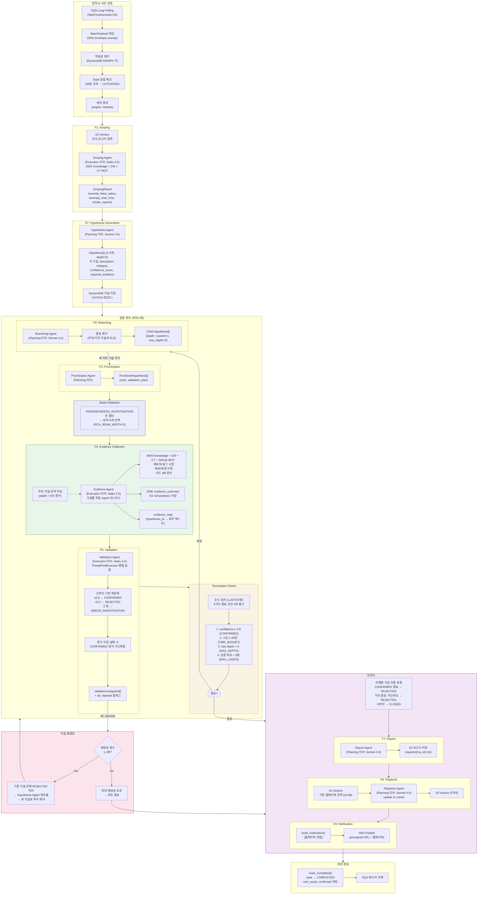
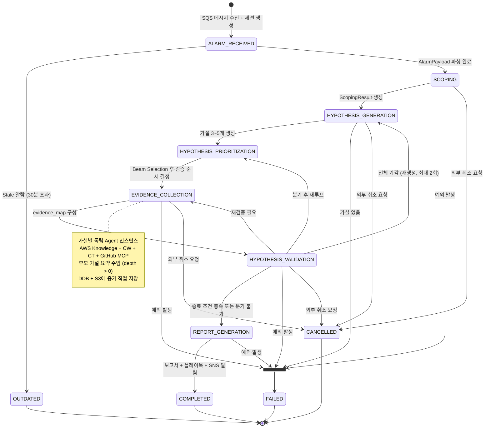
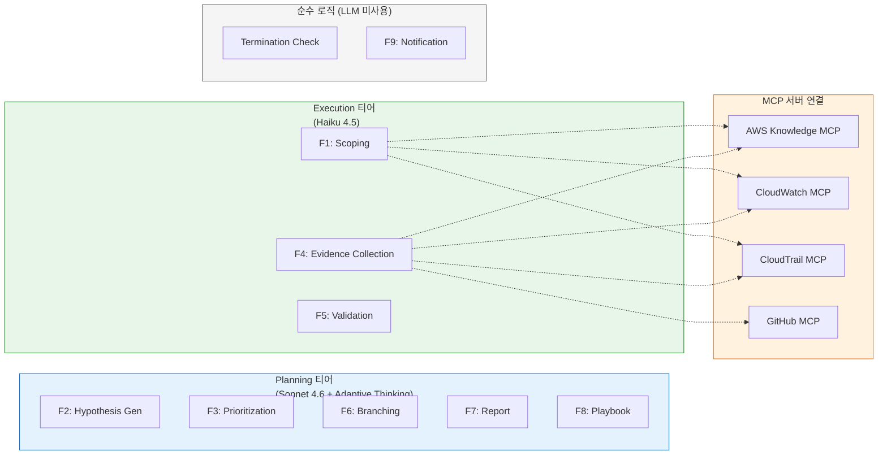
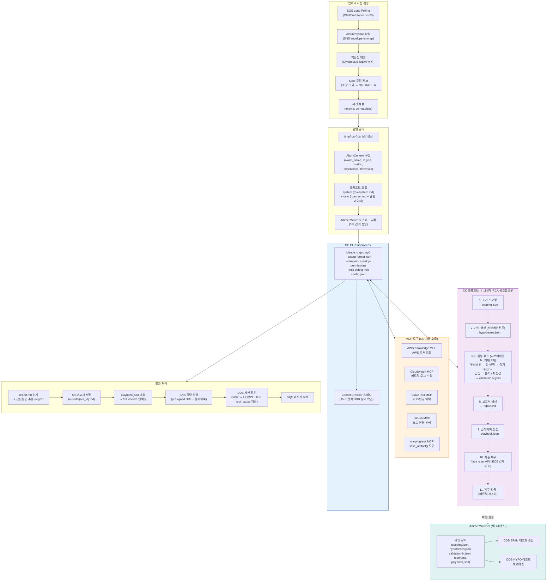
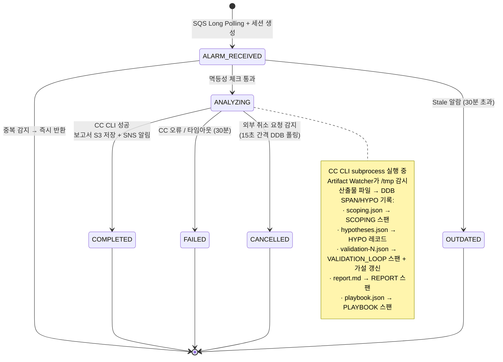
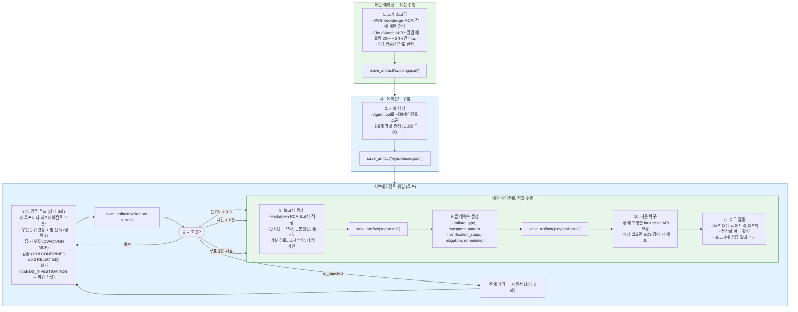
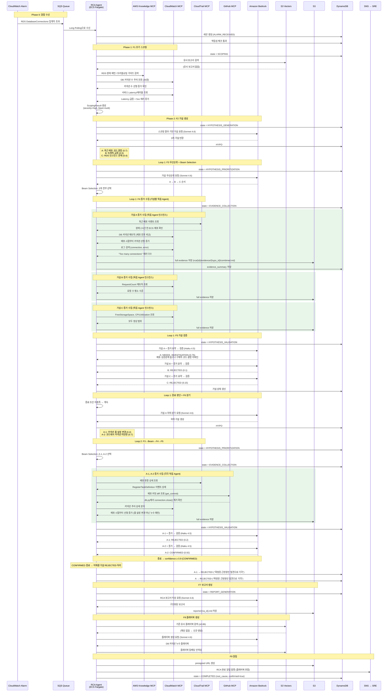

# RCA Agent 아키텍처 및 데모 시나리오 흐름

## 1. Fargate Stack (Strands) — 9단계 파이프라인

### 1.1. 전체 플로우

SQS 메시지 수신부터 SNS 알림 발행까지, 9단계 파이프라인의 전체 흐름입니다. 검증 루프 내에서 Beam Selection으로 우선순위 상위 N개(기본 3) 가설만 선택적으로 검증합니다.



### 1.2. 상태 전이 다이어그램

DynamoDB에 기록되는 RCA 세션 상태 전이입니다.



### 1.3. 모델 티어 매핑



### 1.4. 단계별 데이터 흐름

| 단계 | 입력 | 출력 | 모델 티어 | MCP 도구 |
|------|------|------|----------|---------|
| F1: Scoping | AlarmPayload | ScopingResult (severity, blast_radius, similar_reports, anomaly_start_time) | Execution | AWS Knowledge + CW + CT |
| F2: Hypothesis Gen | ScopingResult | Hypothesis[] (3~5개, depth=0) | Planning | - |
| F3: Prioritization | Hypothesis[] + ScopingResult | PrioritizedHypothesis[] (rank, plan) | Planning | - |
| Beam Selection | PrioritizedHypothesis[] | 상위 N개 필터 (기본 3) | 순수 로직 | - |
| F4: Evidence | Beam 가설 + ScopingResult | evidence_map (hypothesis_id → 요약) | Execution | AWS Knowledge + CW + CT + GH |
| F5: Validation | Beam 가설 + evidence_map | ValidationJudgment[] + all_rejected | Execution | - |
| Termination | judgments + hypotheses + start_time | TerminationDecision (should_terminate, reason) | 순수 로직 | - |
| F6: Branching | NEEDS_INVESTIGATION 가설 + evidence | Child Hypothesis[] (depth+1) | Planning | - |
| F7: Report | best_hypothesis + evidence + timeline | RcaReport (Markdown) → S3 저장 + S3 Vectors 인덱싱 | Planning | - |
| F8: Playbook | RcaReport | Playbook → S3 Vectors 인덱싱 | Planning | - |
| F9: Notification | RcaReport + Playbook | SNS 메시지 (presigned URL + 플레이북) | 순수 로직 | - |

### 1.5. 주요 설정값

| 상수 | 기본값 | 용도 |
|------|--------|------|
| `RCA_BEAM_WIDTH` | 3 | 루프당 검증할 가설 수 |
| `RCA_MAX_VALIDATION_LOOPS` | 3 | 검증 루프 최대 반복 |
| `RCA_MAX_REGENERATION_ROUNDS` | 2 | 전체 기각 시 재생성 최대 횟수 |
| `RCA_TIME_BUDGET_SECONDS` | 1200 | 시간 예산 (20분) |
| `RCA_MAX_TREE_DEPTH` | 5 | 가설 트리 최대 깊이 |
| `TERMINATION_CONFIDENCE_THRESHOLD` | 0.9 | 종료 판단 신뢰도 임계치 |
| `CONFIRMATION_THRESHOLD` | 0.8 | CONFIRMED 분류 임계치 |
| `REJECTION_THRESHOLD` | 0.3 | REJECTED 분류 임계치 |
| `MAX_BRANCHING_DEPTH` | 3 | 분기 최대 깊이 |
| `ALARM_STALENESS_SECONDS` | 1800 | Stale 알람 판정 (30분) |

---

## 2. Fargate Stack (CC Headless) — 프롬프트 주도

### 2.1. 전체 플로우

CC on Bedrock headless 모드에서 단일 프롬프트로 전체 RCA를 수행합니다. Python 핸들러가 SQS 수신/세션 관리를 담당하고, CC CLI subprocess가 MCP 도구를 자율적으로 호출하며 RCA를 진행합니다. Artifact Watcher 스레드가 `/tmp/rca-{id}/` 디렉토리를 감시하여 산출물 파일이 생성될 때마다 DynamoDB에 트레이스를 기록합니다.



### 2.2. 상태 전이 다이어그램

CC Headless는 Strands와 달리 단 2개의 활성 상태만 갖습니다. 파이프라인 내부 진행 상황은 Artifact Watcher가 SPAN/HYPO 레코드로 DynamoDB에 기록합니다.



### 2.3. CC 프롬프트 내 11단계 워크플로우 상세

CC CLI가 자율적으로 수행하는 파이프라인입니다. 메인 에이전트가 직접 수행하는 단계와 서브에이전트에게 위임하는 단계로 구분됩니다.



### 2.4. MCP 서버 구성

| MCP 서버 | 실행 방식 | 용도 |
|---------|----------|------|
| `aws-knowledge` | `uvx fastmcp run https://knowledge-mcp.global.api.aws` | AWS 서비스 문서 참조, 장애 패턴 검색 |
| `cloudwatch` | `uvx awslabs.cloudwatch-mcp-server` | 메트릭 조회, Logs Insights 쿼리, 알람 조회 |
| `cloudtrail` | `uvx awslabs.cloudtrail-mcp-server` | 배포/변경 이벤트 조회, Lake SQL 분석 |
| `github` | `github-mcp-server stdio` | 커밋 diff, PR diff, 파일 내용 조회 |
| `rca-progress` | `python -m fastmcp run mcp_server.py:mcp` | `save_artifact(filename, content)` — 산출물 파일 저장 |

### 2.5. Artifact Watcher 파일 → DDB 매핑

| 파일 | DDB 스팬 타입 | 추가 동작 |
|------|-------------|----------|
| `scoping.json` | `SCOPING` | — |
| `hypotheses.json` | `HYPOTHESIS_GENERATION` | HYPO# 레코드 batch write (최대 25개) |
| `validation-N.json` | `VALIDATION_LOOP` | HYPO# 레코드 상태 갱신 (confirmed/rejected/closed/needs_investigation) |
| `report.md` | `REPORT` | — |
| `playbook.json` | `PLAYBOOK` | failure_type, tags 등 메타데이터 저장 |

---

## 3. 두 스택 비교

| | Fargate Stack (Strands) | Fargate Stack (CC Headless) |
|---|---|---|
| **실행 환경** | ECS Fargate (Long Polling) | ECS Fargate (Long Polling) |
| **에이전트 엔진** | Strands Agents SDK (Python) | Claude Code CLI (headless, Bedrock) |
| **RCA 방식** | 9단계 코드 기반 파이프라인 | 단일 프롬프트 + 11단계 자율 수행 |
| **모델** | 2-tier (Sonnet 4.6 + Haiku 4.5) | CC 기본 모델 (Sonnet 4.6) |
| **서브에이전트** | Strands Agent 인스턴스 (코드로 생성) | CC Agent tool (프롬프트로 스폰) |
| **상태 관리** | Python 코드가 매 단계 DDB 업데이트 | Artifact Watcher가 파일 감시 → DDB 기록 |
| **DDB 상태 수** | 7개 활성 상태 + 4개 terminal | 2개 활성 상태 + 4개 terminal |
| **자동 복구** | 미구현 (ADR 0012, 모듈만 준비) | 프롬프트 내 10-11단계로 직접 수행 |
| **타임아웃** | 20분 (RCA_TIME_BUDGET_SECONDS) | 30분 (CC_TIMEOUT_SECONDS) |
| **취소 감지** | update_state() 시 ConditionExpression | Cancel Checker 스레드 (15초 간격 DDB 폴링) |
| **증거 격리** | 가설별 독립 Agent 인스턴스 | CC 자체 컨텍스트 관리 |
| **공유 리소스** | SNS (알람/알림), DynamoDB, S3, S3 Vectors |

---

## 4. 데모 시나리오: DB 커넥션 누수 장애

### 시나리오 개요

최근 배포된 코드가 DB 커넥션을 세션마다 열기만 하고 닫지 않아 커넥션이 누적됩니다. RDS DatabaseConnections가 한계에 도달하면서 서비스 전체에 장애가 전파됩니다.

### 데모 흐름 (Strands Agent)



### 각 Phase별 산출물

| Phase | 단계 | 주요 산출물 | 저장소 |
|-------|------|-----------|--------|
| 0 | 알람 수신 | AlarmPayload, RCA 세션 | DynamoDB |
| 1 | F1 스코핑 | ScopingResult (severity=high, blast=multi) | - |
| 2 | F2 가설 생성 | 가설 A/B/C (3개) | DynamoDB (HYPO#) |
| 3 | F3 우선순위 + Beam Selection | A→B→C 검증 순서, 상위 3개 선택 | - |
| 4 | F4 증거 수집 | 메트릭(커넥션 추이), 로그(Too many connections), 배포 이력, 코드 diff | S3, DynamoDB |
| 5 | F5 검증 (1차) | A: NEEDS_INVESTIGATION, B/C: REJECTED | DynamoDB |
| 6 | F6 분기 | A-1(풀 설정), A-2(커넥션 미반환) | DynamoDB (HYPO#) |
| 4-5 | F4-F5 (2차) | A-1: REJECTED, A-2: CONFIRMED (0.92) | S3, DynamoDB |
| - | REJECTED 처리 | A-1, A → REJECTED (확정된 근본원인 발견으로 기각) | DynamoDB |
| 7 | F7 보고서 | RCA Report (Markdown) | S3 |
| 8 | F8 플레이북 | DB 커넥션 누수 대응 플레이북 | S3 Vectors |
| 9 | F9 알림 | SNS 알림 (presigned URL + 플레이북 포함) | SNS → SRE |

### 데모에서 사용되는 MCP 도구

| MCP 서버 | 도구 | 용도 |
|---------|------|------|
| AWS Knowledge MCP | `search_documentation`, `read_documentation` | AWS 서비스 문서 참조, 모범 사례 검색 |
| CloudWatch MCP | `get_metric_data` | DB 커넥션 수, Latency, RequestCount, CPU 메트릭 조회 |
| CloudWatch MCP | `execute_log_insights_query` | "Too many connections" 에러 로그 검색 |
| CloudWatch MCP | `analyze_metric` | 커넥션 증가 트렌드 분석 |
| CloudTrail MCP | `lookup_events` | ECS 배포 이벤트(RegisterTaskDefinition) 조회 |
| GitHub MCP | `get_commit`, `list_commits` | 배포 커밋 diff 조회, 결함 패턴 탐지 |
| GitHub MCP | `pull_request_read` | PR diff, 변경 파일 목록, 리뷰 코멘트 조회 |

### 종료 조건 매핑

이 데모에서는 **CONFIRMED** 종료 조건이 트리거됩니다:
- 가설 A-2 "코드에서 커넥션 미반환"이 confidence 0.92로 확정
- 임계치 0.9 이상 → 즉시 종료 → 나머지 가설 REJECTED 처리 → 보고서 → 플레이북 → 알림

---

## 5. DynamoDB 트레이스 스팬 계층

대시보드 트레이스 그래프에 표시되는 스팬 구조입니다. 두 스택 모두 동일한 DynamoDB 테이블에 스팬을 기록하며, `engine` 필드로 구분됩니다.

### Strands 스팬 구조

```
SCOPING
HYPOTHESIS_GENERATION
VALIDATION_LOOP (반복 컨테이너)
  ├─ PRIORITIZATION
  ├─ EVIDENCE_COLLECTION
  ├─ VALIDATION
  ├─ TERMINATION
  ├─ BRANCHING (NEEDS_INVESTIGATION 존재 시)
  └─ HYPOTHESIS_GENERATION (재생성 시)
REPORT
PLAYBOOK
NOTIFICATION
```

### CC Headless 스팬 구조

```
SCOPING (scoping.json 감지 시)
HYPOTHESIS_GENERATION (hypotheses.json 감지 시)
VALIDATION_LOOP (validation-N.json 감지 시, N=1,2,3)
REPORT (report.md 감지 시)
PLAYBOOK (playbook.json 감지 시)
```
