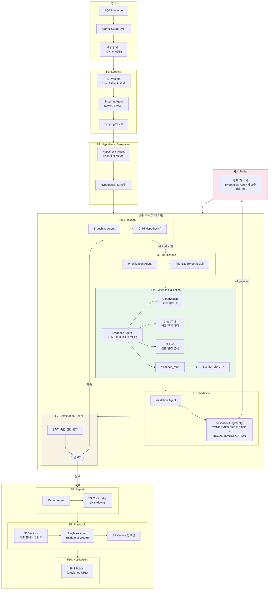
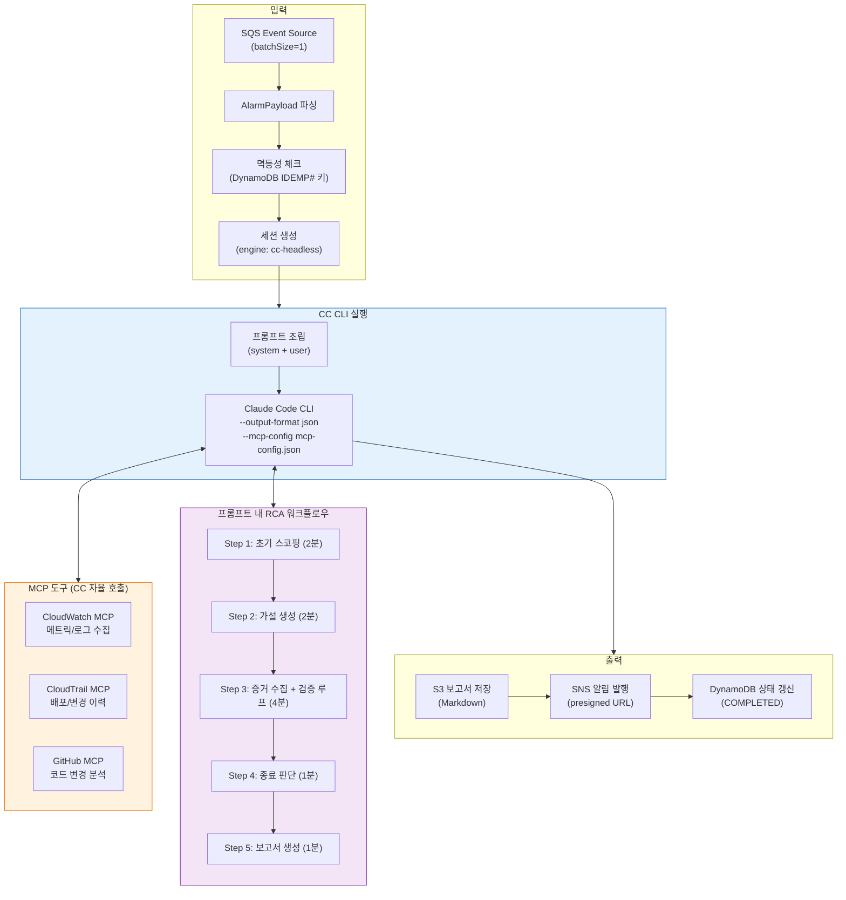
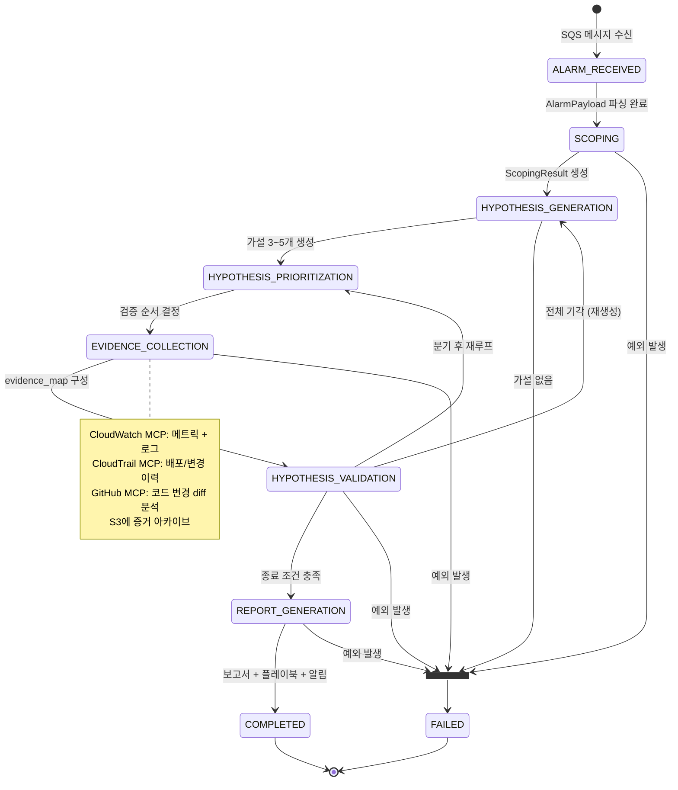
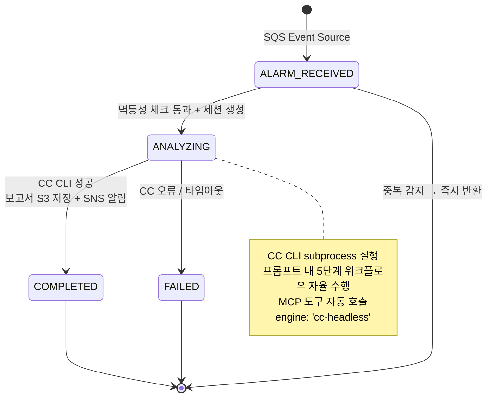
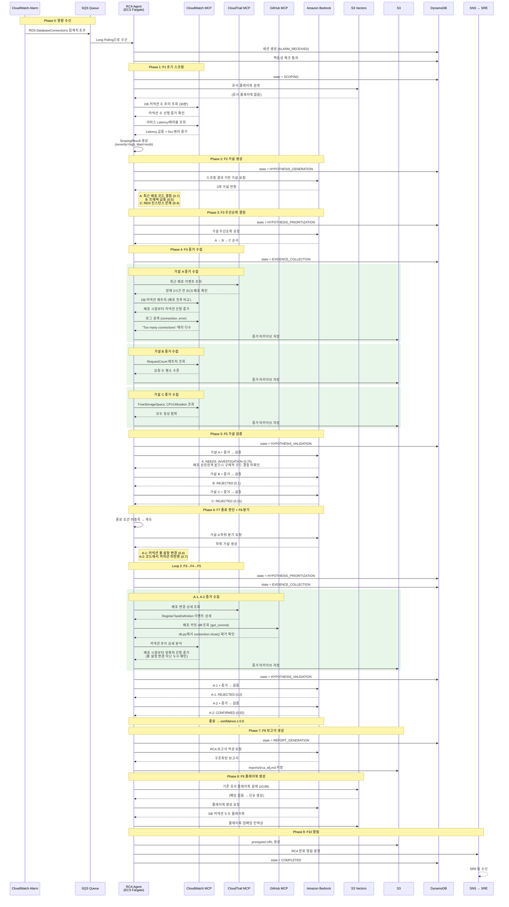
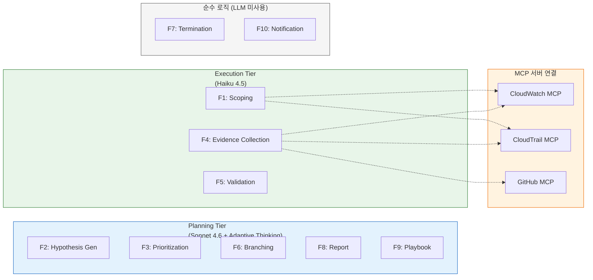
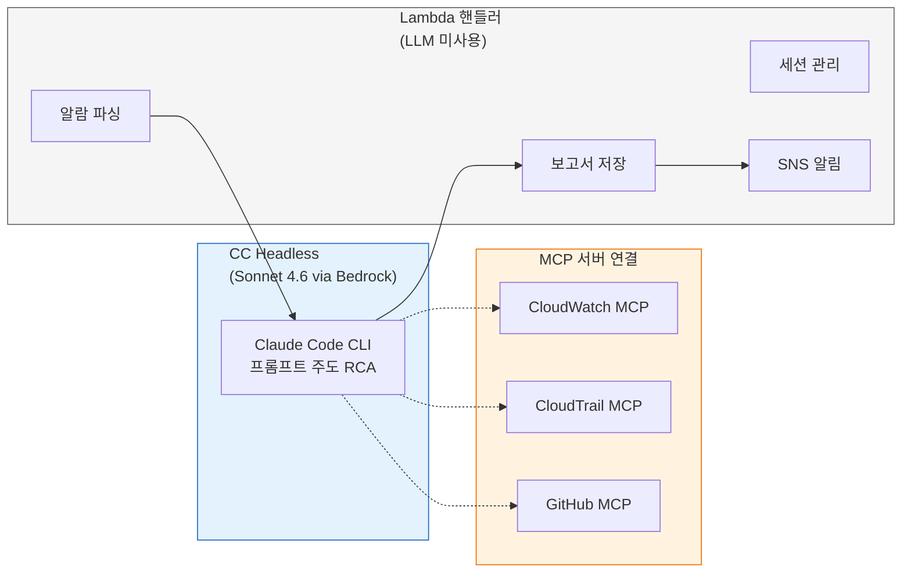

# RCA Agent 아키텍처 및 데모 시나리오 흐름

## 1. 전체 데이터 플로우 — Fargate (Strands, 10단계)

SQS 메시지 수신부터 SNS 알림 발행까지, 10단계 파이프라인의 전체 데이터 흐름을 나타냅니다.

## 2. 전체 데이터 플로우 — Lambda (CC Headless, 프롬프트 주도)

CC on Bedrock headless 모드에서 단일 프롬프트로 전체 RCA를 수행합니다. CC가 MCP 도구를 자율적으로 호출하며, 동일한 DynamoDB/S3/SNS를 공유합니다.

## 3. 상태 전이 다이어그램

DynamoDB에 기록되는 RCA 세션 상태 전이입니다. 두 스택이 동일한 DynamoDB 테이블을 사용하며, `engine` 필드로 구분합니다.

### Fargate Stack (Strands) 상태 전이

### Lambda Stack (CC Headless) 상태 전이

## 4. 데모 시나리오: DB 커넥션 누수 장애

PRD Section 3에 정의된 데모 시나리오의 10단계 파이프라인 흐름입니다.

### 시나리오 개요

최근 배포된 코드가 DB 커넥션을 세션마다 열기만 하고 닫지 않아 커넥션이 누적됩니다. RDS DatabaseConnections가 한계에 도달하면서 서비스 전체에 장애가 전파됩니다.

### 흐름도

### 각 Phase별 산출물

| Phase | 단계 | 주요 산출물 | 저장소 |
|-------|------|-----------|--------|
| 0 | 알람 수신 | AlarmPayload, RCA 세션 | DynamoDB |
| 1 | F1 스코핑 | ScopingResult (severity=high, blast=multi) | - |
| 2 | F2 가설 생성 | 가설 A/B/C (3개) | - |
| 3 | F3 우선순위 | A→B→C 검증 순서 | - |
| 4 | F4 증거 수집 | 메트릭(커넥션 추이), 로그(Too many connections), 배포 이력, 코드 diff | S3 |
| 5 | F5 검증 (1차) | A: NEEDS_INVESTIGATION, B/C: REJECTED | DynamoDB |
| 6 | F6 분기 | A-1(풀 설정), A-2(커넥션 미반환) | - |
| 4-5 | F4-F5 (2차) | A-1: REJECTED, A-2: CONFIRMED (0.92) | S3, DynamoDB |
| 7 | F8 보고서 | RCA Report (Markdown) | S3 |
| 8 | F9 플레이북 | DB 커넥션 누수 대응 플레이북 | S3 Vectors |
| 9 | F10 알림 | SNS 알림 (presigned URL 포함) | SNS → SRE |

### 데모에서 사용되는 MCP 도구

| MCP 서버 | 도구 | 용도 |
|---------|------|------|
| CloudWatch MCP | `get_metric_data` | DB 커넥션 수, Latency, RequestCount, CPU 메트릭 조회 |
| CloudWatch MCP | `execute_log_insights_query` | "Too many connections" 에러 로그 검색 |
| CloudWatch MCP | `analyze_metric` | 커넥션 증가 트렌드 분석 |
| CloudTrail MCP | `lookup_events` | ECS 배포 이벤트(RegisterTaskDefinition) 조회 |
| GitHub MCP | `get_commit`, `list_commits` | 배포 커밋 diff 조회, 결함 패턴 탐지 |
| GitHub MCP | `pull_request_read` | PR diff, 변경 파일 목록, 리뷰 코멘트 조회 |

### 종료 조건 매핑

이 데모에서는 **CONFIRMED** 종료 조건이 트리거됩니다:
- 가설 A-2 "코드에서 커넥션 미반환"이 confidence 0.92로 확정
- 임계치 0.9 이상 → 즉시 종료 → 보고서 생성 단계 진입

## 5. 에이전트 모델 티어 매핑

### Fargate Stack (Strands) — 2-Tier

### Lambda Stack (CC Headless) — 단일 모델

