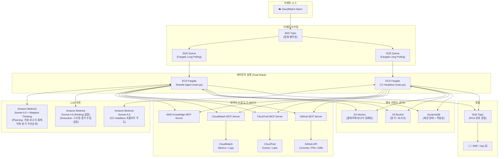
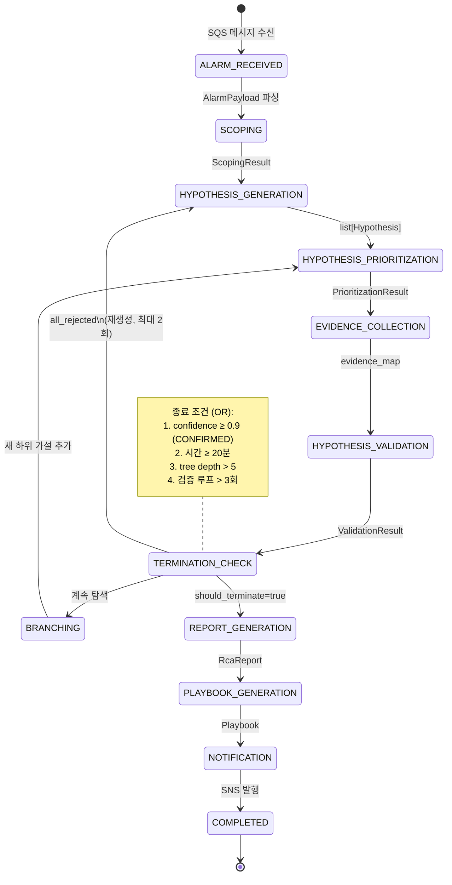
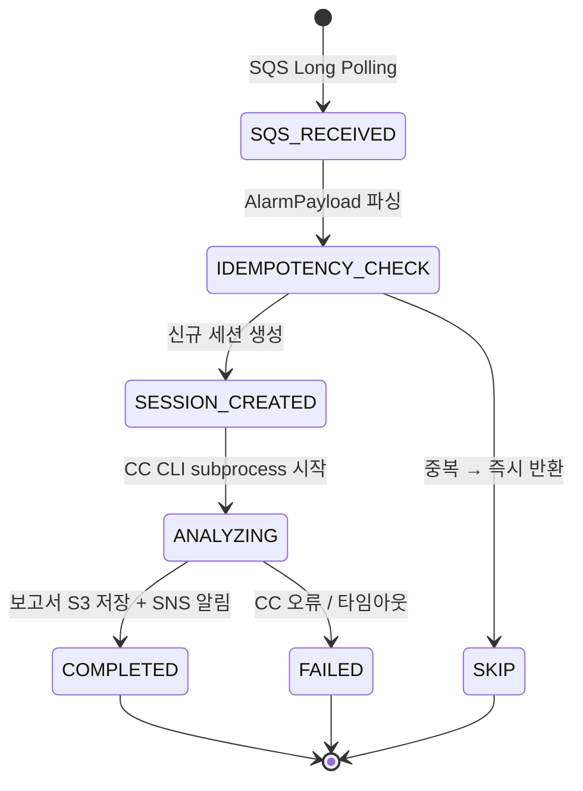

# Architecture

RCA Agent 시스템의 전체 아키텍처, 실행 파이프라인, 모듈 간 데이터 흐름, 기술 스택을 정리합니다.

## Dual-Stack Overview

동일한 CloudWatch 알람에 대해 두 가지 실행 엔진이 독립적으로 RCA를 수행합니다.

| | Fargate Stack (Strands) | Fargate Stack (CC Headless) |
|---|---|---|
| **실행 환경** | ECS Fargate (Long Polling) | ECS Fargate (Long Polling) |
| **에이전트 엔진** | Strands Agents SDK (Python) | Claude Code CLI (headless, Bedrock) |
| **RCA 방식** | 9단계 closed-loop 파이프라인 | 단일 프롬프트 + MCP 도구 자율 호출 |
| **모델** | 단일 Sonnet 4.6 (Planning/Execution 행동 분리) | CC 기본 모델 (Sonnet 4.6) |
| **타임아웃** | 제한 없음 | 제한 없음 |
| **동시성** | Fargate 태스크 스케일링 | Fargate 태스크 1 |
| **공유 리소스** | SNS (알람/알림), DynamoDB, S3, S3 Vectors |
| **구분** | DynamoDB `engine` 필드: `strands` vs `cc-headless` |

## System Architecture



## Agent Pipeline — Fargate (Strands, 9단계)

에이전트는 증거 수집-가설 검증 루프를 반복하며, 4가지 종료 조건(OR) 중 하나라도 만족하면 종료합니다. 전체 기각 시 가설 재생성(최대 2회)을 시도합니다. 분석 완료 후 보고서와 플레이북을 생성하고, 플레이북을 포함한 SNS 알림을 발행합니다.

**플레이북은 생성/저장/인덱싱만 수행되며, 자동 복구(Remediation)는 아직 미구현입니다.** ADR agent/0012에 따라 별도 Remediation Agent가 SNS → SQS로 구독하여 수행하도록 설계되었으나, 해당 에이전트는 아직 배포되지 않았습니다. `remediation.py`와 `verification.py` 모듈이 준비되어 있습니다.



단계별 timeout/재시도, 증거 소스, 플레이북 검색 우선(≥0.86) 등 세부 동작은 `packages/agent/` 소스와 관련 ADR을 참조하세요.

## Agent Pipeline — Fargate (CC Headless, 프롬프트 주도)

CC on Bedrock headless 모드에서 단일 프롬프트로 RCA 전체 워크플로우를 수행합니다. CC가 MCP 도구를 자율적으로 호출합니다.



CC CLI는 `claude -p <prompt> --output-format json --mcp-config mcp-config.json`으로 호출되며, 프롬프트 내에 11단계 RCA 워크플로우(스코핑~검증~보고서~플레이북~복구~검증)가 정의되어 있습니다.

## Data Flow — Fargate (모듈 간 데이터 흐름)

각 모듈이 생산/소비하는 Pydantic 모델과 모듈 간 의존 관계:

- **F1 Scoping** — `search_similar_reports()`(S3 Vectors) → Scoping Agent(AWS Knowledge+CloudWatch+CloudTrail MCP) → `ScopingResult`
- **F2 Hypothesis Generation** — Hypothesis Agent → `Hypothesis[]` (tree_id, depth=0)
- **F3 Prioritization** — Prioritization Agent → `PrioritizedHypothesis[]` (rank, tools, parallel_group)
- **F4 Evidence Collection** — Evidence Agent(AWS Knowledge+CloudWatch+CloudTrail+GitHub MCP) → `evidence_map`, S3 증거 아카이브
- **F5 Validation** — Validation Agent → `ValidationJudgment[]` (CONFIRMED/REJECTED/NEEDS_INVESTIGATION)
- **Termination Check** — 순수 로직(LLM 미사용) → `TerminationDecision`
- **F6 Branching** — Branching Agent → 자식 가설(depth=parent+1)
- **F7 Report** — Report Agent → `RcaReport` → S3 Markdown + S3 Vectors 인덱싱
- **F8 Playbook** — 기존 플레이북 검색(≥0.86) → update or create → S3 Vectors 인덱싱
- **F9 Notification** — `build_notification()` (플레이북 포함) → SNS Publish

각 단계의 Pydantic 스키마 및 structured_output 정의는 `packages/agent/`의 ports/dto를 참조하세요.

## Agent Architecture

### Hexagonal Architecture (Ports & Adapters)

agent/cc-headless 양쪽 패키지는 Hexagonal Architecture를 적용하여 비즈니스 로직과 인프라를 분리합니다 (ADR agent/0015).

```
패키지 구조 (agent, cc-headless 공통):
├── ports/                    # 인터페이스 계층
│   ├── dto/                  # 공유 데이터 모델 (Pydantic)
│   └── interfaces/           # 추상 Port (ABC)
├── adapters/                 # 인프라 구현
│   ├── primary/              # 인바운드 (SQS Consumer, Health Server)
│   └── secondary/            # 아웃바운드 (DynamoDB, S3, SNS, Bedrock 등)
├── services/                 # 순수 비즈니스 로직 (Port 인터페이스에만 의존)
├── di/                       # DI Container (Adapter 생성 + Port 주입)
├── config/                   # 환경변수, 설정값
└── main.py                   # 진입점 (Container → Service 조합)
```

- **의존성 방향**: Service → Port(인터페이스) ← Adapter. Service는 인프라 구체 클래스를 알지 못함
- **DI Container**: 추상 `Container`가 Port property를 선언하고, `AppContainer`가 AWS Adapter를 lazy-init으로 생성. 테스트 시 인메모리 구현 주입 가능

### Fargate Stack (Strands Agents SDK)

- **9단계 파이프라인**: F1(Scoping) → F2(Hypothesis) → [검증 루프: F3(Prioritization) → Beam Selection → F4(Evidence) → F5(Validation) → Termination Check → F6(Branching)] → F7(Report) → F8(Playbook) → F9(Notification)
- **단일 모델 + Planning/Execution 행동 분리**: 모든 단계가 Sonnet 4.6을 사용하되, Planning은 adaptive thinking을 활성화하고 Execution은 thinking 없이 호출(ADR agent/0010, 2026-04-29 업데이트)
- **Beam Search 탐색**: 우선순위 상위 N개(기본 3) 가설만 선택적으로 검증하여 효율적 탐색
- **검증 루프**: 전체 기각 시 가설 재생성(최대 2회)
- **유사 보고서 검색**: 스코핑 단계에서 S3 Vectors 보고서 인덱스를 검색하여 과거 RCA의 "증상 → 근본 원인" 추론 경로를 가설 생성에 활용 (ADR agent/0016)
- **플레이북 검색 우선**: 기존 플레이북 업데이트를 우선하고, 없으면 신규 생성
- **Remediation 분리 (미구현)**: 플레이북 포함 SNS 알림 발행까지 구현됨. 별도 Remediation Agent가 SNS → SQS로 구독(ADR agent/0012)하도록 설계되었으나 미배포

### Fargate Stack (CC Headless)

- **프롬프트 주도 RCA**: 단일 시스템 프롬프트에 11단계 워크플로우 정의 (스코핑 ~ 보고서 ~ 플레이북 ~ 복구 ~ 검증), CC가 자율적으로 MCP 도구 호출. Strands와 달리 복구를 프롬프트 내에서 직접 수행
- **MCP 도구 연동**: CloudWatch, CloudTrail, GitHub MCP 서버를 `mcp-config.json`으로 구성
- **타임아웃 없음**: ECS Fargate에서 실행되므로 Lambda 15분 제한 없음
- **멱등성**: DynamoDB `IDEMP#` 키로 Strands 스택과의 중복 처리 방지
- **세션 추적**: 동일 DynamoDB 테이블, `engine: 'cc-headless'` 필드로 구분

## Technology Stack

| Component | Fargate Stack (Strands) | Fargate Stack (CC Headless) |
|-----------|--------------|--------------|
| 에이전트 엔진 | Strands Agents SDK (Python) | Claude Code CLI headless (Python) |
| 실행 환경 | AWS ECS Fargate | AWS ECS Fargate |
| 이벤트 수신 | SQS Long Polling | SQS Long Polling |
| LLM 추론 | Bedrock — 단일 Sonnet 4.6 (Planning: adaptive thinking / Execution: thinking 없음) | Bedrock — Sonnet 4.6 (CC 프롬프트 주도) |
| MCP 도구 | AWS Knowledge + CloudWatch + CloudTrail + GitHub MCP | AWS Knowledge + CloudWatch + CloudTrail + GitHub MCP |
| 환경 설정 | python-dotenv (`env/local.env`) | ECS 환경변수 |

| Component (공유) | Technology |
|-----------|-----------|
| 이벤트 라우팅 | Amazon SNS → 각 스택별 SQS Queue |
| 임베딩 | Bedrock Cohere Embed V4 (`cohere.embed-v4:0`, 1536차원) → S3 Vectors (플레이북 + 보고서 인덱스) |
| 증거/보고서 저장 | Amazon S3 |
| 세션 관리 | Amazon DynamoDB (`engine` 필드로 스택 구분) |
| 알림 | Amazon SNS |
| 네트워크 보안 | VPC + PrivateLink |
