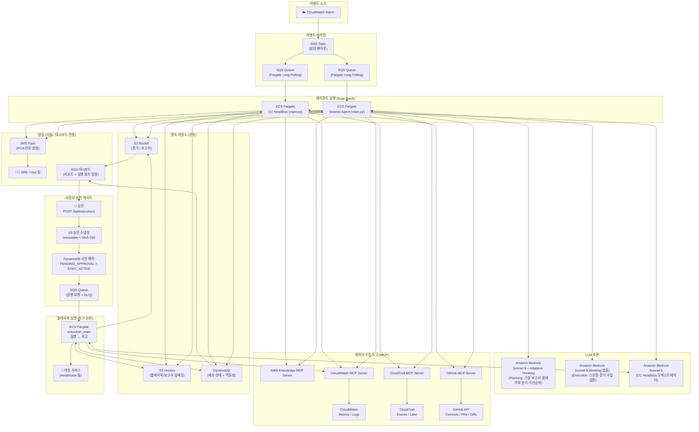
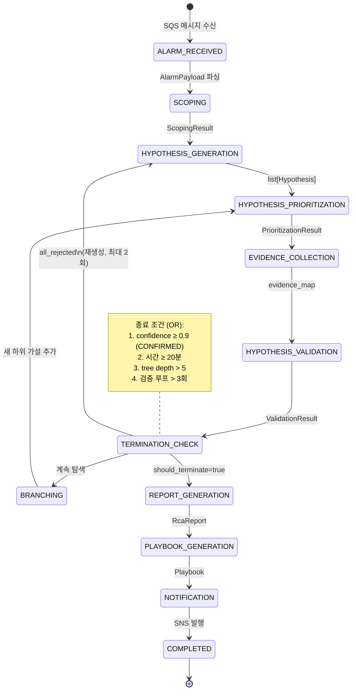
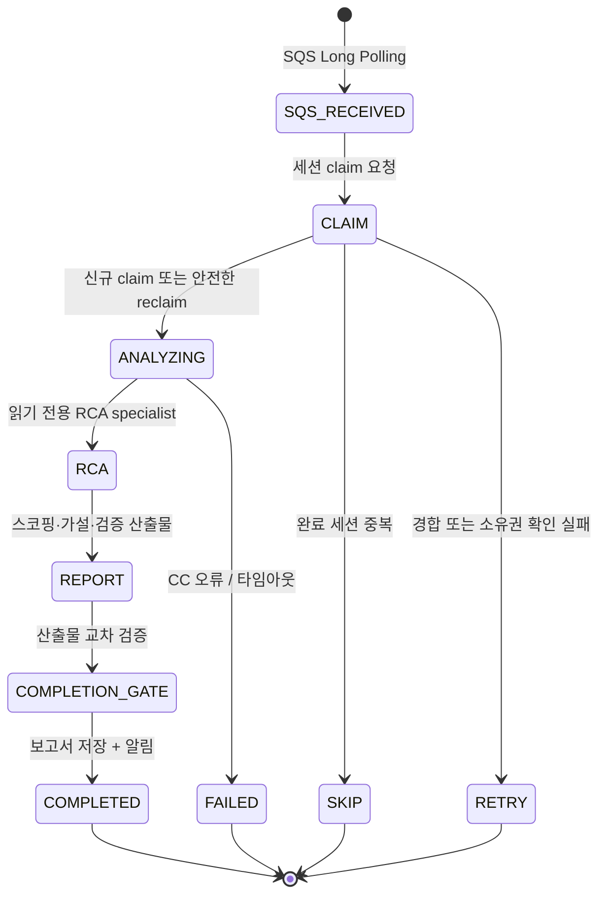
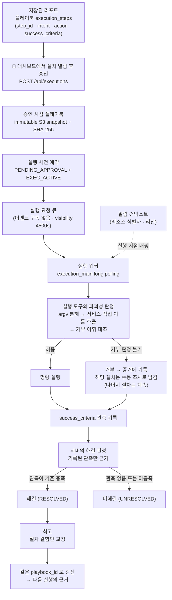
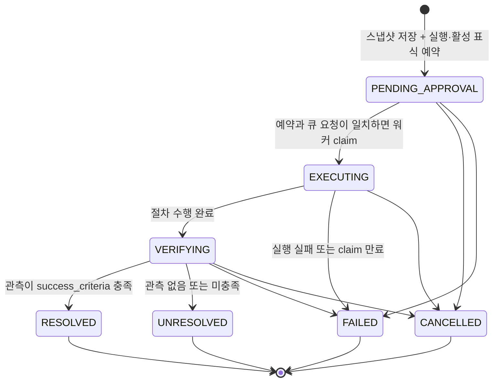

# Architecture

RCA Agent 시스템의 전체 아키텍처, 실행 파이프라인, 모듈 간 데이터 흐름, 기술 스택을 정리합니다.

## 분석과 실행의 분리

시스템은 **읽기 전용 분석**과 **사용자 승인 기반 실행** 두 축으로 나뉩니다.

- **분석**은 알람을 받아 플레이북을 포함한 리포트 하나를 만들고 끝납니다. 어떤 서비스나 인프라도 변경하지 않으며, 태스크 역할에 쓰기 권한이 없습니다.
- **실행**은 별도 에이전트이며, 사람이 대시보드에서 플레이북 절차를 승인하면 승인 시점의 immutable S3 스냅샷과 SHA-256 digest, DynamoDB의 `PENDING_APPROVAL`·`EXEC_ACTIVE` 예약을 만든 뒤 실행 요청을 큐에 발행합니다. 워커는 예약과 메시지가 정확히 일치할 때만 실행하므로 **사람의 승인 없이 실행이 기동될 경로가 존재하지 않습니다**.
- 분석 완료 알림은 어떤 기계 동작도 트리거하지 않습니다. 수신자는 사람과 대시보드뿐입니다.

## Dual-Stack Overview

동일한 CloudWatch 알람에 대해 두 가지 실행 엔진이 독립적으로 RCA를 수행합니다.

|                   | Fargate Stack (Strands)                                          | Fargate Stack (CC Headless)         |
| ----------------- | ---------------------------------------------------------------- | ----------------------------------- |
| **실행 환경**     | ECS Fargate (Long Polling)                                       | ECS Fargate (Long Polling)          |
| **에이전트 엔진** | Strands Agents SDK (Python)                                      | Claude Code CLI (headless, Bedrock) |
| **RCA 방식**      | 9단계 closed-loop 파이프라인                                     | 전문 서브 에이전트 오케스트레이션   |
| **모델**          | 단일 Sonnet 5 (Planning/Execution 행동 분리)                     | CC 기본 모델 (Sonnet 5)             |
| **타임아웃**      | 종료 조건 및 시간 예산 (20분)                                    | CC 프로세스 60분 제한               |
| **동시성**        | Fargate 태스크 스케일링                                          | Fargate 태스크 1                    |
| **쓰기 권한**     | 없음 (읽기 전용 분석)                                            | 없음 (읽기 전용 분석)               |
| **산출물**        | 플레이북을 포함한 리포트 1개                                     | 플레이북을 포함한 리포트 1개        |
| **실행 경로**     | 두 엔진 공통 — 사용자 승인 후 별도 플레이북 실행 에이전트가 수행 |
| **공유 리소스**   | SNS (알람/알림), DynamoDB, S3, S3 Vectors                        |
| **구분**          | DynamoDB `engine` 필드: `strands` vs `cc-headless`               |

## System Architecture


```mermaid
graph TB
    subgraph EventSource["이벤트 소스"]
        CW_ALARM["☁️ CloudWatch Alarm"]
    end

    subgraph Messaging["이벤트 라우팅"]
        SNS_IN["SNS Topic<br/>(알람 팬아웃)"]
        SQS_FARGATE["SQS Queue<br/>(Fargate Long Polling)"]
        SQS_CC["SQS Queue<br/>(Fargate Long Polling)"]
    end

    subgraph Compute["에이전트 실행 (Dual-Stack)"]
        ECS["ECS Fargate<br/>Strands Agent (main.py)"]
        ECS_CC["ECS Fargate<br/>CC Headless (main.py)"]
    end

    subgraph LLM["LLM 추론"]
        BEDROCK_PLAN["Amazon Bedrock<br/>Sonnet 5 + Adaptive Thinking<br/>(Planning: 가설·보고서·플레이북·분기·우선순위)"]
        BEDROCK_EXEC["Amazon Bedrock<br/>Sonnet 5 (thinking 없음)<br/>(Execution: 스코핑·증거 수집·검증)"]
        BEDROCK_CC["Amazon Bedrock<br/>Sonnet 5<br/>(CC Headless 오케스트레이터)"]
    end

    subgraph DataTools["데이터 수집 도구 (MCP)"]
        AK_MCP["AWS Knowledge MCP Server"]
        CW_MCP["CloudWatch MCP Server"]
        CT_MCP["CloudTrail MCP Server"]
        GH_MCP["GitHub MCP Server"]
        CW_API["CloudWatch<br/>Metrics / Logs"]
        CT_API["CloudTrail<br/>Events / Lake"]
        GH_API["GitHub API<br/>Commits / PRs / Diffs"]
    end

    subgraph Storage["영속 저장소 (공유)"]
        S3_VECTORS["S3 Vectors<br/>(플레이북/보고서 임베딩)"]
        S3["S3 Bucket<br/>(증거 / 보고서)"]
        DDB["DynamoDB<br/>(세션 상태 + 멱등성)"]
    end

    subgraph Notification["알림 (사람 · 대시보드 전용)"]
        SNS_OUT["SNS Topic<br/>(RCA 완료 알림)"]
        SRE["👩‍💻 SRE / Ops 팀"]
        DASH["RCA 대시보드<br/>(리포트 + 실행 절차 열람)"]
    end

    subgraph Approval["사용자 승인 게이트"]
        APPROVE["👤 승인<br/>POST /api/executions"]
        SNAPSHOT["S3 승인 스냅샷<br/>immutable + SHA-256"]
        RESERVE["DynamoDB 사전 예약<br/>PENDING_APPROVAL + EXEC_ACTIVE"]
        SQS_EXEC["SQS Queue<br/>(실행 요청 + DLQ)"]
    end

    subgraph Execution["플레이북 실행 (쓰기 권한)"]
        ECS_EXEC["ECS Fargate<br/>execution_main<br/>실행 → 회고"]
        TARGET["🏥 대상 서비스<br/>(Healthcare 등)"]
    end

    CW_ALARM --> SNS_IN
    SNS_IN --> SQS_FARGATE --> ECS
    SNS_IN --> SQS_CC --> ECS_CC
    ECS <--> BEDROCK_PLAN
    ECS <--> BEDROCK_EXEC
    ECS_CC <--> BEDROCK_CC
    ECS --> AK_MCP
    ECS --> CW_MCP
    ECS --> CT_MCP
    ECS --> GH_MCP
    ECS_CC --> AK_MCP
    ECS_CC --> CW_MCP
    ECS_CC --> CT_MCP
    ECS_CC --> GH_MCP
    CW_MCP --> CW_API
    CT_MCP --> CT_API
    GH_MCP --> GH_API
    ECS <--> S3_VECTORS
    ECS --> S3
    ECS --> DDB
    ECS_CC <--> S3_VECTORS
    ECS_CC --> S3
    ECS_CC --> DDB
    ECS --> SNS_OUT
    ECS_CC --> SNS_OUT
    SNS_OUT --> SRE
    DDB --> DASH
    S3 --> DASH
    DASH --> APPROVE
    APPROVE --> SNAPSHOT --> RESERVE --> SQS_EXEC --> ECS_EXEC
    ECS_EXEC --> TARGET
    ECS_EXEC <--> BEDROCK_CC
    ECS_EXEC --> CW_MCP
    ECS_EXEC --> S3
    ECS_EXEC --> DDB
    ECS_EXEC <--> S3_VECTORS
```

분석 완료 알림에서 실행 스택으로 가는 화살표는 없습니다. 알림은 사람과 대시보드만
소비합니다. 실행으로 가는 유일한 간선은 `사용자 승인 → immutable snapshot → 사전 예약
→ 큐 요청`이며, 큐 메시지만 직접 넣어서는 워커가 실행 예약을 claim할 수 없습니다.

## Agent Pipeline — Fargate (Strands, 9단계)

에이전트는 증거 수집-가설 검증 루프를 반복하며, 4가지 종료 조건(OR) 중 하나라도 만족하면 종료합니다. 전체 기각 시 가설 재생성(최대 2회)을 시도합니다. 분석 완료 후 보고서와 플레이북을 생성하고, 플레이북 요약을 포함한 SNS 알림을 발행하며 파이프라인은 여기서 끝납니다.

파이프라인은 읽기 전용입니다. 복구를 수행하는 워커가 없고, 알림은 아무것도
트리거하지 않습니다. 플레이북의 `verification_status`는 항상 `DRAFT`이며 분석은
이 값을 바꾸지 못합니다 — 실행으로 수행되지 않은 절차는 검증되지 않았기 때문입니다.


```mermaid
stateDiagram-v2
    [*] --> ALARM_RECEIVED: SQS 메시지 수신
    ALARM_RECEIVED --> SCOPING: AlarmPayload 파싱
    SCOPING --> HYPOTHESIS_GENERATION: ScopingResult
    HYPOTHESIS_GENERATION --> HYPOTHESIS_PRIORITIZATION: list[Hypothesis]
    HYPOTHESIS_PRIORITIZATION --> EVIDENCE_COLLECTION: PrioritizationResult
    EVIDENCE_COLLECTION --> HYPOTHESIS_VALIDATION: evidence_map
    HYPOTHESIS_VALIDATION --> TERMINATION_CHECK: ValidationResult

    state TERMINATION_CHECK <<choice>>
    TERMINATION_CHECK --> BRANCHING: 계속 탐색
    TERMINATION_CHECK --> REPORT_GENERATION: should_terminate=true
    TERMINATION_CHECK --> HYPOTHESIS_GENERATION: all_rejected\n(재생성, 최대 2회)

    note left of TERMINATION_CHECK
        종료 조건 (OR):
        1. confidence ≥ 0.9 (CONFIRMED)
        2. 시간 ≥ 20분
        3. tree depth > 5
        4. 검증 루프 > 3회
    end note

    BRANCHING --> HYPOTHESIS_PRIORITIZATION: 새 하위 가설 추가
    REPORT_GENERATION --> PLAYBOOK_GENERATION: RcaReport
    PLAYBOOK_GENERATION --> NOTIFICATION: Playbook
    NOTIFICATION --> COMPLETED: SNS 발행
    COMPLETED --> [*]
```

단계별 timeout/재시도, 증거 소스, 플레이북 검색 우선(≥0.80) 등 세부 동작은 `packages/agent/` 소스와 관련 ADR을 참조하세요.

## Agent Pipeline — Fargate (CC Headless 오케스트레이터)

CC on Bedrock headless 메인 에이전트는 직접 RCA를 수행하지 않고, 한 실행 안에서
RCA와 Report 두 전문 서브 에이전트만 순서대로 호출합니다. 이 실행에는 서비스나
인프라를 바꾸는 도구가 없으며, 산출물은 플레이북을 포함한 리포트 하나로 끝납니다.
플레이북은 사람이 승인한 뒤 별도 실행 에이전트가 수행할 초안입니다.


```mermaid
stateDiagram-v2
    [*] --> SQS_RECEIVED: SQS Long Polling
    SQS_RECEIVED --> CLAIM: 세션 claim 요청
    CLAIM --> ANALYZING: 신규 claim 또는 안전한 reclaim
    CLAIM --> SKIP: 완료 세션 중복
    CLAIM --> RETRY: 경합 또는 소유권 확인 실패
    ANALYZING --> RCA: 읽기 전용 RCA specialist
    RCA --> REPORT: 스코핑·가설·검증 산출물
    REPORT --> COMPLETION_GATE: 산출물 교차 검증
    COMPLETION_GATE --> COMPLETED: 보고서 저장 + 알림
    ANALYZING --> FAILED: CC 오류 / 타임아웃
    COMPLETED --> [*]
    FAILED --> [*]
    SKIP --> [*]
    RETRY --> [*]
```

CC CLI는 비영속 세션과 엄격한 MCP 설정으로 호출됩니다. 세션 claim을 잃은 실행은
상태와 trace를 기록할 수 없고, S3·SNS 같은 외부 쓰기는 claim에 종속된 부작용
lease 안에서만 시작합니다. 완료 게이트는 보고서와 플레이북의 상태·원인 참조가
일치하는지, 그리고 플레이북의 `verification_status`가 `DRAFT`인지 확인합니다.

산출물은 `scoping.json`, `hypotheses.json`, `validation-{N}.json`, `playbook.json`,
`report.md` 다섯 가지입니다.

## Playbook Execution — 사용자 승인 기반 실행 에이전트

실행은 분석과 별개의 워커입니다. 진입점은 `python -m cc_headless.execution_main`이며,
분석 워커와 같은 컨테이너 이미지를 다른 진입점으로 실행합니다.


```mermaid
flowchart TD
    REPORT["저장된 리포트<br/>플레이북 execution_steps<br/>(step_id · intent · action · success_criteria)"]
    HUMAN["👤 대시보드에서 절차 열람 후 승인<br/>POST /api/executions"]
    SNAPSHOT["승인 시점 플레이북<br/>immutable S3 snapshot + SHA-256"]
    RESERVE["실행 사전 예약<br/>PENDING_APPROVAL + EXEC_ACTIVE"]
    QUEUE["실행 요청 큐<br/>(이벤트 구독 없음 · visibility 4500s)"]
    WORKER["실행 워커<br/>execution_main long polling"]
    ALARM["알람 컨텍스트<br/>(리소스 식별자 · 리전)"]
    GATE["실행 도구의 파괴성 판정<br/>argv 분해 → 서비스·작업 이름 추출<br/>→ 거부 어휘 대조"]
    RUN["명령 실행"]
    MANUAL["거부 → 증거에 기록<br/>해당 절차는 수동 조치로 남김<br/>(나머지 절차는 계속)"]
    OBSERVE["success_criteria 관측 기록"]
    JUDGE["서버의 해결 판정<br/>기록된 관측만 근거"]
    RESOLVED["해결 (RESOLVED)"]
    UNRESOLVED["미해결 (UNRESOLVED)"]
    RETRO["회고<br/>절차 결함만 교정"]
    PLAYBOOK["같은 playbook_id 로 갱신<br/>→ 다음 실행의 근거"]

    REPORT --> HUMAN --> SNAPSHOT --> RESERVE --> QUEUE --> WORKER
    ALARM -.->|실행 시점 매핑| WORKER
    WORKER --> GATE
    GATE -->|허용| RUN --> OBSERVE
    GATE -->|거부·판정 불가| MANUAL --> OBSERVE
    OBSERVE --> JUDGE
    JUDGE -->|관측이 기준 충족| RESOLVED --> RETRO --> PLAYBOOK
    JUDGE -->|관측 없음 또는 미충족| UNRESOLVED
```

**왜 이렇게 만들었는가**

- **승인은 정확한 내용에 묶인다.** 대시보드는 사람이 본 플레이북을 결정적 JSON 스냅샷으로 저장하고 SHA-256 digest를 계산합니다. 워커는 최신 개정본을 다시 고르지 않고 이 스냅샷의 digest를 검증해 실행하므로 승인 뒤 변경된 절차에는 새 승인이 필요합니다.
- **메시지만으로는 실행할 수 없다.** 대시보드는 큐 발행 전에 `PENDING_APPROVAL` 실행과 `EXEC_ACTIVE`를 원자적으로 예약합니다. 워커는 요청의 모든 필드가 예약과 일치할 때만 claim하고, 실행 역할은 자기 큐에 메시지를 보낼 수 없습니다.
- **파괴적 조치는 서버가 거부한다.** IAM 정책이나 프롬프트 지시가 아니라 실행 도구가 명령을 argv로 분해해 AWS 서비스와 작업 이름을 추출하고 거부 어휘와 대조합니다. **작업 이름을 확정할 수 없는 명령은 거부합니다** — 판정 불가를 허용으로 읽으면 셸 합성이나 중첩 호출로 거부 목록을 비울 수 있습니다.
- **해결 판정의 권위는 서버에 있다.** 승인 스냅샷에 선언된 모든 절차가 시도되고 관측을 남겨야 합니다. 에이전트의 최종 서술은 관측이 아니므로 근거가 되지 않으며, 건너뛴 절차나 빈 관측이 있으면 `RESOLVED`가 될 수 없습니다.
- **거부는 실행을 중단시키지 않는다.** 거부된 절차는 증거에 남고 수동 조치로 표시되며, 남은 절차는 계속 수행됩니다.

### 실행 상태 전이


```mermaid
stateDiagram-v2
    [*] --> PENDING_APPROVAL: 스냅샷 저장 + 실행·활성 표식 예약
    PENDING_APPROVAL --> EXECUTING: 예약과 큐 요청이 일치하면 워커 claim
    EXECUTING --> VERIFYING: 절차 수행 완료
    VERIFYING --> RESOLVED: 관측이 success_criteria 충족
    VERIFYING --> UNRESOLVED: 관측 없음 또는 미충족
    PENDING_APPROVAL --> CANCELLED
    PENDING_APPROVAL --> FAILED
    EXECUTING --> FAILED: 실행 실패 또는 claim 만료
    EXECUTING --> CANCELLED
    VERIFYING --> FAILED
    VERIFYING --> CANCELLED

    RESOLVED --> [*]
    UNRESOLVED --> [*]
    FAILED --> [*]
    CANCELLED --> [*]
```

한국어 표기는 `승인 대기` → `실행 중` → `검증 중` → `해결`/`미해결`, 그리고
`실행 중` → `실패`/`취소`입니다. **`실행 중`에서 `해결`로 직접 가는 전이는 없습니다** —
관측 없이 해결로 전이하면 해소되지 않은 장애가 완료로 기록됩니다.

실행은 분석 세션과 별도 생명주기를 가집니다. 실행 실패는 분석 세션을 실패로 만들지
않고 저장된 리포트를 변경하지 않습니다. 하나의 리포트는 여러 번 실행될 수 있으며,
실행 아이템은 같은 DynamoDB 파티션에 `EXEC#{execution_id}`로 저장됩니다 — 엔진
접두사를 붙이지 않는데, 어느 엔진이 리포트를 만들었든 실행 경로는 하나이기 때문입니다.
같은 RCA의 동시 승인은 `EXEC_ACTIVE` 조건부 쓰기로 하나만 허용됩니다. claim이 만료되면
외부 쓰기 중복을 피하기 위해 자동 재실행하지 않고 `FAILED`로 종결하며, 사용자가 새 승인
UUID로 다시 승인해야 합니다.

### 실행 증거

증거는 명령 단위로 누적됩니다: 절차 식별자, 명령과 인자, 종료 상태, 오류 출력,
실패 분류, 재시도, 관측 결과. 실행이 실패해도 보존되는데, 사람이 왜 실패했는지 알
수 있는 유일한 기록이기 때문입니다. 주 보관소는 S3(오브젝트 저장소)이고 DynamoDB에는
요약만 둡니다. 자격 증명으로 보이는 인자는 가립니다 — 증거는 사람이 읽는 자료이고
자격 증명이 남으면 열람 자체가 노출이 됩니다.

### 회고

`RESOLVED` 실행만 회고에 들어갑니다. `UNRESOLVED`·`FAILED`·`CANCELLED`는 들어가지
않는데, 이슈를 해소하지 못한 절차는 올바름이 입증되지 않았기 때문입니다.

- 교정 대상은 **절차의 결함으로 환원되는 실패**뿐입니다: 잘못된·누락된 인자, 빠진 선행 조건, 순서 오류, 해결 확정에 필요했던 검증 절차.
- **일시적 오류는 교정하지 않습니다.** 같은 명령이 재시도로 성공했다면 절차 자체는 옳았습니다.
- **삭제는 일어나지 않으며 이것은 프롬프트가 아니라 코드가 보장합니다.** 모델이 담지 않은 필드는 기존 값을 유지하고, `step_id`와 순서는 살아남고, 관측 가능한 성공 기준이 없는 새 절차는 버립니다.
- 승인 시점의 **immutable 플레이북 스냅샷을 보존**합니다. 이것이 실행 입력이자 회고 diff의 기준이므로 회고가 현재 개정본을 덮어써도 승인된 내용은 바뀌지 않습니다.
- 갱신된 플레이북은 같은 `playbook_id`를 유지하며 다음 실행의 근거가 됩니다.
- **회고가 갱신을 반영하면 `verification_status`가 `DRAFT` → `VERIFIED`로 승격됩니다.** 교정할 결함이 없어도 승격되지만(절차가 그대로 이슈를 해소한 것), 회고가 실패하면 승격도 없습니다. 이후 설명·태그만 보강하면 상태를 유지하고, `execution_steps`가 추가·교정되면 새 절차는 아직 입증되지 않았으므로 `DRAFT`로 돌아갑니다. 이 값은 서버가 소유하며 모델이 갱신안에 담아도 무시됩니다.
- 승격은 개정본과 검색 인덱스 양쪽에 함께 반영됩니다. 다음 실행은 개정본을, 다음 RCA의 보강은 인덱스를 읽습니다.
- 회고 실패는 이미 확정된 해결을 되돌리지 않습니다.

## Data Flow — Fargate (모듈 간 데이터 흐름)

각 모듈이 생산/소비하는 Pydantic 모델과 모듈 간 의존 관계:

- **F1 Scoping** — 보고서 인덱스 유사도 검색(S3 Vectors) → Scoping Agent(AWS Knowledge+CloudWatch+CloudTrail MCP) → `ScopingResult`
- **F2 Hypothesis Generation** — Hypothesis Agent → `Hypothesis[]` (tree_id, depth=0)
- **F3 Prioritization** — Prioritization Agent → `PrioritizedHypothesis[]` (rank, tools, parallel_group)
- **F4 Evidence Collection** — Evidence Agent(AWS Knowledge+CloudWatch+CloudTrail+GitHub MCP) → `evidence_map`, S3 증거 아카이브
- **F5 Validation** — Validation Agent → `ValidationJudgment[]` (CONFIRMED/REJECTED/NEEDS_INVESTIGATION)
- **Termination Check** — 순수 로직(LLM 미사용) → `TerminationDecision`
- **F6 Branching** — Branching Agent → 자식 가설(depth=parent+1)
- **F7 Report** — Report Agent → `RcaReport` → S3 Markdown + S3 Vectors 인덱싱
- **F8 Playbook** — 기존 플레이북 검색(≥0.80) → 상세 로드(실패 시 후보 제외) → update or create → S3 Vectors 인덱싱
- **F9 Notification** — `build_notification()` (플레이북 요약 포함) → SNS Publish. 수신자는 사람과 대시보드뿐이며 어떤 기계 동작도 트리거하지 않습니다. 복구 트리거용 필드(`fault_type`, 복구 검증 결과)는 담지 않고, 실행 절차 자체도 담지 않습니다 — 실행 주체는 저장된 리포트를 직접 읽으므로, 알림 payload를 실행 입력으로 쓰면 전달 과정에서 잘린 절차가 실행될 수 있습니다

각 단계의 Pydantic 스키마 및 structured_output 정의는 `packages/agent/`의 ports/dto를 참조하세요.

## Agent Architecture

### Hexagonal Architecture (Ports & Adapters)

agent/cc-headless 양쪽 패키지는 Hexagonal Architecture를 적용하여 비즈니스 로직과 인프라를 분리합니다.

```
패키지 구조 (agent, cc-headless 공통):
├── ports/                    # 인터페이스 계층
│   ├── dto/                  # 공유 데이터 모델 (Pydantic)
│   └── interfaces/           # 추상 Port (ABC)
├── adapters/                 # 인프라 구현
│   ├── primary/              # 인바운드 (SQS Consumer, Health Server)
│   └── secondary/            # 아웃바운드 (DynamoDB, S3, SNS, Bedrock 등)
├── services/                 # 순수 비즈니스 로직 (Port 인터페이스에만 의존)
├── di/                       # DI Container (Adapter 생성 + Port 주입)
├── config/                   # 환경변수, 설정값
└── main.py                   # 진입점 (Container → Service 조합)
```

- **의존성 방향**: Service → Port(인터페이스) ← Adapter. Service는 인프라 구체 클래스를 알지 못함
- **DI Container**: 추상 `Container`가 Port property를 선언하고, `AppContainer`가 AWS Adapter를 lazy-init으로 생성. 테스트 시 인메모리 구현 주입 가능

### Fargate Stack (Strands Agents SDK)

- **9단계 파이프라인**: F1(Scoping) → F2(Hypothesis) → [검증 루프: F3(Prioritization) → Beam Selection → F4(Evidence) → F5(Validation) → Termination Check → F6(Branching)] → F7(Report) → F8(Playbook) → F9(Notification)
- **단일 모델 + Planning/Execution 행동 분리**: 모든 단계가 Sonnet 5을 사용하되, Planning은 adaptive thinking을 활성화하고 Execution은 thinking 없이 호출
- **Beam Search 탐색**: 우선순위 상위 N개(기본 3) 가설만 선택적으로 검증하여 효율적 탐색
- **검증 루프**: 전체 기각 시 가설 재생성(최대 2회)
- **유사 보고서 검색**: 스코핑 단계에서 S3 Vectors 보고서 인덱스를 검색하여 과거 RCA의 "증상 → 근본 원인" 추론 경로를 가설 생성에 활용
- **플레이북 검색 우선**: 기존 플레이북 업데이트를 우선하고, 없으면 신규 생성
- **읽기 전용**: 복구 워커가 없고, 파이프라인은 리포트 하나로 끝남. 플레이북은
  `verification_status=DRAFT` 초안으로만 저장

### Fargate Stack (CC Headless)

- **전문 서브 에이전트**: RCA → Report 순서로 호출하고 역할별 도구 권한과 산출물
  계약을 분리. 오케스트레이터가 호출할 수 있는 전문 에이전트는 이 둘뿐
- **MCP 도구 연동**: CloudWatch, CloudTrail, GitHub MCP 서버를 `mcp-config.json`으로 구성
- **쓰기 도구 없음**: 분석 하네스에 쓰기 도구가 들어가면 사용자 승인 게이트가
  무의미해지므로, 하네스 계약 테스트가 양쪽 도구의 혼입을 모두 막음
- **reclaim fencing**: claim 조건부 trace와 부작용 lease로 이전 실행의 늦은 쓰기를 차단
- **실행 시간 제한**: Lambda 15분 제한은 없지만 CC 프로세스는 60분 후 종료. 이 엔진은
  예산이 소진되면 산출물이 남지 않으므로 완주 회차 실측(24~29분)의 두 배를 예산으로 둠
- **멱등성**: 알람별 안정 세션 키와 receive count/claim token으로 재전달을 제어
- **세션 추적**: 동일 DynamoDB 테이블, `engine: 'cc-headless'` 필드로 구분

### Playbook Execution (CC Headless 실행 워커)

- **같은 이미지, 다른 진입점**: `python -m cc_headless.execution_main`. 하나의 하네스를 두 진입점으로 나눔
- **트리거는 승인뿐**: 승인 스냅샷과 `PENDING_APPROVAL`·`EXEC_ACTIVE` 예약을 거친 실행 요청 큐 long polling. 예약 없는 메시지는 거부
- **실행 근거**: SHA-256으로 검증한 승인 시점 플레이북의 `execution_steps`. 리소스 식별자와 리전은 실행 시점의 알람 컨텍스트에서 매핑
- **서버 판정형 게이트**: 파괴적 조치 거부와 해결 판정 모두 서버가 수행. 판정 불가는 거부
- **재승인 경계**: claim 만료는 `FAILED`로 종결하고 자동 재실행하지 않음. 새 실행에는 새 사용자 승인 필요
- **회고 연결**: `RESOLVED` 실행만 회고로 이어지고, 같은 `playbook_id`를 유지하며 절차를 교정

## Technology Stack

| Component     | Fargate Stack (Strands)                                                          | Fargate Stack (CC Headless)                          |
| ------------- | -------------------------------------------------------------------------------- | ---------------------------------------------------- |
| 에이전트 엔진 | Strands Agents SDK (Python)                                                      | Claude Code CLI headless (Python)                    |
| 실행 환경     | AWS ECS Fargate                                                                  | AWS ECS Fargate                                      |
| 이벤트 수신   | SQS Long Polling                                                                 | SQS Long Polling                                     |
| LLM 추론      | Bedrock — 단일 Sonnet 5 (Planning: adaptive thinking / Execution: thinking 없음) | Bedrock — Sonnet 5 (CC 전문 서브 에이전트)           |
| MCP 도구      | AWS Knowledge + CloudWatch + CloudTrail + GitHub MCP                             | AWS Knowledge + CloudWatch + CloudTrail + GitHub MCP |
| 환경 설정     | python-dotenv (`env/local.env`)                                                  | ECS 환경변수                                         |

| Component (실행) | Technology                                                                              |
| ---------------- | --------------------------------------------------------------------------------------- |
| 실행 엔진        | Claude Code CLI headless — 분석 워커와 동일 이미지, `cc_headless.execution_main` 진입점 |
| 실행 환경        | AWS ECS Fargate (상시 1 태스크)                                                         |
| 트리거           | 실행 요청 SQS Queue (대시보드 승인 발행) + DLQ                                          |
| MCP 도구         | 읽기 전용 CloudWatch MCP + 서버 판정형 명령 실행·증거 기록 MCP + 회고 갱신 MCP          |
| 증거 저장        | Amazon S3 (주 보관) + DynamoDB (요약)                                                   |
| 권한             | PowerUserAccess + 실행 대상 외 범위 명시적 Deny (시스템 유일의 쓰기 태스크 역할)        |

| Component (공유) | Technology                                                                                      |
| ---------------- | ----------------------------------------------------------------------------------------------- |
| 이벤트 라우팅    | Amazon SNS → 각 스택별 SQS Queue                                                                |
| 임베딩           | Bedrock Cohere Embed V4 (`cohere.embed-v4:0`, 1536차원) → S3 Vectors (플레이북 + 보고서 인덱스) |
| 증거/보고서 저장 | Amazon S3                                                                                       |
| 세션 관리        | Amazon DynamoDB (`engine` 필드로 스택 구분, 실행은 `EXEC#` 접두사)                              |
| 알림             | Amazon SNS                                                                                      |
| 네트워크 보안    | VPC + PrivateLink                                                                               |
