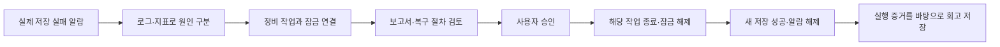

> **운영 절차 폐기 — 이력 열람 전용.** 활성 데모는 [단일 네이티브 컬럼 오류](realistic-scenarios.html)다.
> 아래 정비 잠금 명령은 현재 runner에서 실행할 수 없다. 과거 관측과 승인·복구 이력을
> 설명하기 위해 보존하며 새 사례의 성공 근거로 사용하지 않는다. 새 RunId는 단일 실행기를 따른다.

# 고객 시연: 조회는 되는데 환자 활력 데이터가 저장되지 않는 장애

현재 상태: 사용자 요청에 따라 실환경 재시연을 중단하고 장애·임시 설정 정리를 완료했다. 코드와 오프라인 검증을 보완했으며, 고객 시연 준비 완료로 판정하지 않았다.

코드 수정과 검증 결과: [오프라인 검증 보고서](../test-reports/offline-rca-review-2026-09-10/index.html).

RCA(Root Cause Analysis, 근본원인분석)가 보여줄 가치는 “저장 실패”라는 증상에서 출발해, 데이터베이스 연결 부족과 느린 쿼리를 구분하고 실제로 쓰기를 막은 정비 작업을 찾아내는 것이다. 승인된 작업만 종료한 뒤 새 데이터가 정상 저장되는 것까지 확인한다.

## 고객에게 보여줄 한 가지 이야기

환자 기록 조회는 정상인데 새 활력 데이터 저장이 실패한다. 정비 작업이 데이터베이스 트랜잭션을 끝내지 않아 쓰기 잠금을 계속 보유한 상황이다. 트랜잭션은 여러 데이터 작업을 하나로 묶는 단위이며, 이 사례의 잠금은 조회를 허용하면서 쓰기만 기다리게 한다.

분석은 실패 건수, 정상 조회 지연, 여유 있는 연결 수, 기다리는 쓰기 요청과 잠금 소유자를 같은 시간대에서 대조한다. 정비 작업의 프로세스 ID와 실제 실행 중인 ECS 태스크를 연결해 조치 대상을 좁힌다. ECS 태스크는 AWS에서 실행되는 컨테이너 작업 한 개다.

## 화면을 넘기는 순서

1. 장애 기록에서 이번 회차의 알람 한 건을 연다. “조회는 되지만 새 데이터 저장이 실패한다”는 업무 영향을 설명한다.
2. 분석 경로에서 검증한 가설과 증거를 보여준다. 연결 수를 늘리는 조치가 필요한지, 실제 쿼리 작업이 느린지, 다른 작업이 쓰기를 막았는지를 구분한다.
3. 보고서에서 원인과 대상 작업을 확인하고 복구 절차를 읽는다. 현재 회차의 태스크와 소유 관계가 확인된 절차만 승인한다.
4. 실행 이력에서 실제 조치와 결과를 확인한다. 이후 완전히 끝난 두 분 구간에서 저장 요청이 존재하고 실패가 0이며 조회도 정상인지 확인한다.
5. 회고 화면에서 실행 증거와 저장된 개정 결과를 확인한다. 변경이 필요 없다는 판단도 근거와 함께 저장되어야 한다.

세부 명령과 전체 로그는 질문을 받았을 때 연다. 설명 시간을 줄이더라도 실제 분석·승인·복구 확인 단계를 생략하지 않는다. 발표 시간은 반복 실측 결과로 정한다.

## 화면별 짧은 설명

| 화면 | 설명 | 고객이 확인할 내용 |
|------|------|--------------------|
| 알람 | “기존 환자 기록 조회는 되지만 새 활력 데이터가 저장되지 않습니다.” | 실제 저장 실패가 발생한 시각과 영향 |
| 분석 | “연결 부족과 쿼리 지연을 확인했고, 쓰기를 기다리게 한 별도 정비 작업을 찾았습니다.” | 기각한 원인의 근거와 잠금 소유자 |
| 복구 절차 | “이 작업이 현재 잠금 소유자인지 다시 확인한 뒤, 이 작업 하나를 종료하도록 승인합니다.” | 이번 회차의 대상과 승인 범위 |
| 실행 | “종료 요청이 수락됐고, 같은 작업의 트랜잭션 정리 기록을 확인합니다.” | 실제 종료 명령과 동일 작업의 정리 완료 기록 |
| 회복·회고 | “조치 후 새 요청이 정상 저장되는지 확인하고, 실행 근거와 개선 판단을 남깁니다.” | 두 완결 구간의 요청·실패 지표와 저장된 회고 |

표의 설명은 해당 증거가 실제 화면에 나타난 뒤 사용한다. 분석이나 복구가 진행 중이면 현재 단계만 설명한다. 회복 관측을 기다리는 동안에는 잠금 소유자를 어떻게 찾았는지와 승인 범위를 보여주면 된다.

발표 시간을 줄이려면 긴 원시 로그를 읽는 시간을 줄인다. 장애 주입부터 시작하는 전체 시연과, 이미 시작한 이번 회차의 알람에서 시작하는 시연은 구분해 안내한다. 준비된 과거 성공 기록을 보여주는 경우에는 녹화·기록 재생이라고 표시한다.

## 고객 발표와 전체 재현을 구분하기

고객 발표에서는 “담당자가 도착했을 때 분석이 끝나 있고 승인을 기다리는 상황”으로 시작할 수 있다. 발표 전에 **이번 회차**의 실제 장애·알람·분석을 완료하고, 장애는 아직 지속되며 승인하지 않은 상태에서 화면을 연다. 첫 설명은 “현재 장애의 분석은 사전에 완료됐습니다. 근거를 검토하고 지금 복구를 승인하겠습니다”로 한다.

고객 앞에서는 이번 회차의 알람과 분석 경로, 기각한 원인, 잠금 소유자를 차례로 보여준 뒤 실제 승인·조치·회복 확인·회고를 진행한다. 이전 성공 회차의 분석을 현재 회차에 붙이지 않는다. 회복 관측을 기다리는 동안에는 조치 대상이 왜 이 정비 작업인지 설명한다.

장애 주입부터 분석 완료까지의 자동 동작 자체를 보고 싶어 하는 고객에게는 전체 재현을 진행한다. 두 방식의 소요 시간은 전체 재현 시간과 승인 이후 시간으로 나누어 실측한다. 발표 전부터 실행 중인 장애 감시·정리 절차도 유지하고, 발표 중단 시 이번 회차의 장애와 엔진 설정을 복원한다.

## 회복 화면에서 구분할 지표

`patient_vitals`는 환자 기록 **조회** 작업이고 `ingest`는 새 데이터 **저장** 작업이다. 조회 성공 로그만으로 저장 복구를 설명하면 안 된다.

이 서비스의 `VitalIngestAttempts`는 처리가 끝난 데이터 건수이고 `VitalIngestFailures`는 그중 실패한 건수다. 두 구간 각각에서 완료 건수가 존재하고 실패 건수가 0인지 확인한다. 필요하면 같은 시간대의 `operation=ingest` 성공 로그를 함께 연다. 잠금 정리 기록, 알람 정상화, 정상 조회 지표는 각각 별도로 확인한다.

## 시연 준비 완료 기준

- 수정된 배포 이미지에서 분석·보고서·실행·회고 도구가 준비된다.
- 실제 알람으로 시작한 새 회차에서 원인, 실행 절차, 승인, 조치, 회복 판정, 회고가 모두 연결된다.
- 조치 대상은 이번 회차가 소유한 정비 태스크이며, 작업 종료와 트랜잭션 롤백 기록이 일치한다.
- 재시도와 실패 결과를 보존한다. 운영자가 실패 회차를 정리한 결과를 승인 복구 성공으로 세지 않는다.
- 같은 배포로 반복 시연하고 전체 소요 시간을 기록한다.

실측과 실패 이력: `docs/test-reports/customer-maintenance-demo-2026-09-10/`.
