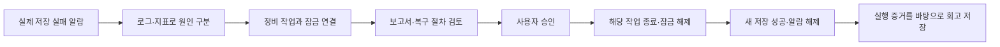

# 고객 시연: 조회는 되는데 환자 활력 데이터가 저장되지 않는 장애

현재 상태: 실환경 전체 흐름 검증 진행 중. 고객 시연 준비 완료로 판정하지 않았다.

RCA(Root Cause Analysis, 근본원인분석)가 보여줄 가치는 “저장 실패”라는 증상에서 출발해, 데이터베이스 연결 부족과 느린 쿼리를 구분하고 실제로 쓰기를 막은 정비 작업을 찾아내는 것이다. 승인된 작업만 종료한 뒤 새 데이터가 정상 저장되는 것까지 확인한다.

## 고객에게 보여줄 한 가지 이야기

환자 기록 조회는 정상인데 새 활력 데이터 저장이 실패한다. 정비 작업이 데이터베이스 트랜잭션을 끝내지 않아 쓰기 잠금을 계속 보유한 상황이다. 트랜잭션은 여러 데이터 작업을 하나로 묶는 단위이며, 이 사례의 잠금은 조회를 허용하면서 쓰기만 기다리게 한다.

분석은 실패 건수, 정상 조회 지연, 여유 있는 연결 수, 기다리는 쓰기 요청과 잠금 소유자를 같은 시간대에서 대조한다. 정비 작업의 프로세스 ID와 실제 실행 중인 ECS 태스크를 연결해 조치 대상을 좁힌다. ECS 태스크는 AWS에서 실행되는 컨테이너 작업 한 개다.

## 화면을 넘기는 순서

1. 장애 기록에서 이번 회차의 알람 한 건을 연다. “조회는 되지만 새 데이터 저장이 실패한다”는 업무 영향을 설명한다.
2. 분석 경로에서 검증한 가설과 증거를 보여준다. 연결 수를 늘리는 조치가 필요한지, 실제 쿼리 작업이 느린지, 다른 작업이 쓰기를 막았는지를 구분한다.
3. 보고서에서 원인과 대상 작업을 확인하고 복구 절차를 읽는다. 현재 회차의 태스크와 소유 관계가 확인된 절차만 승인한다.
4. 실행 이력에서 실제 조치와 결과를 확인한다. 이후 완전히 끝난 두 분 구간에서 저장 요청이 존재하고 실패가 0이며 조회도 정상인지 확인한다.
5. 회고 화면에서 실행 증거와 저장된 개정 결과를 확인한다. 변경이 필요 없다는 판단도 근거와 함께 저장되어야 한다.

세부 명령과 전체 로그는 질문을 받았을 때 연다. 설명 시간을 줄이더라도 실제 분석·승인·복구 확인 단계를 생략하지 않는다. 발표 시간은 반복 실측 결과로 정한다.

## 시연 준비 완료 기준

- 수정된 배포 이미지에서 분석·보고서·실행·회고 도구가 준비된다.
- 실제 알람으로 시작한 새 회차에서 원인, 실행 절차, 승인, 조치, 회복 판정, 회고가 모두 연결된다.
- 조치 대상은 이번 회차가 소유한 정비 태스크이며, 작업 종료와 트랜잭션 롤백 기록이 일치한다.
- 재시도와 실패 결과를 보존한다. 운영자가 실패 회차를 정리한 결과를 승인 복구 성공으로 세지 않는다.
- 같은 배포로 반복 시연하고 전체 소요 시간을 기록한다.

실측과 실패 이력: `docs/test-reports/customer-maintenance-demo-2026-09-10/`.
