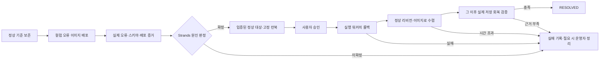

# 단일 RCA 데모 계획 — 원인 확정부터 승인된 복구까지

작성·보완일: 2026-09-15
상태: 리뷰 반영안·구현 및 실측 전. 이번 수정은 계획 문서에 한정한다.

## 승인 개정 — 2026-09-15

이 개정은 사용자 승인을 받은 계약이며 코드 반영 전 기록이다. Strands 전체 시작 예산은
3600초(60분), 스코핑·가설 생성·기본 LLM 단계는 각각 900초, 증거 수집 배치는 1800초다.
Bedrock 읽기는 첫/다음 소켓 데이터까지의 유휴 300초, 일반 AWS 읽기는 60초이며
모델 최대 출력은 65536토큰이다. Strands SDK의 스트리밍 모델 응답에는 총시간 제한을 두지 않는다.
Strands의 단계·전체 예산은 새 작업과 재시도의 시작을 제한하며, 데이터를 받고 있는 응답을
벽시계로 끊지 않는다. 명시적 취소·소유권 상실은 응답 중단 요청과 늦은 쓰기 차단을 유지한다.

배포·메트릭 대기는 각각 900초, 실행 MCP 도구 호출은 1200초이며 실행 전체 3600초의 기존 강제 종료 기한은
유지한다. Headless 분석의 60분 강제 프로세스 기한도 유지하며, 이 두 경로에는
활성 응답 예외나 새 응답별 SDK 한도를 도입하지 않는다. 알람 큐 가시성과 오래된 알람 기준은 10800초이고 정당한 처리 중 가시성을
갱신한다. 갱신 실패에는 기존 claim 규칙 안에서 안전하게 중단한다.

확정 신뢰도·깊이·검증 루프·재생성·승인 내용과 최초 수렴 이후 두 완결된 60초 구간은
바꾸지 않는다. **3회 연속 전체 성공 후 사전 지정 10회 중 9회 이상 성공·중대 위반 0건**,
첫 분석 4회·재사용 4회·승인 대기 2회 및 전역 기준선 승인 경계도 유지한다.
시간의 권위는 [종료 조건](../adr/agent/0006-termination-conditions.md), 실행 대기는
[승인 실행](../adr/agent/0017-playbook-execution-agent.md), 큐 갱신은
[알람 수신](../adr/infra/0001-alarm-ingestion-sns-sqs-fargate.md)에 있다.

## 1. 목표와 남길 시나리오

**실제 컬럼 불일치 장애를 Strands가 올바르게 확정하고, 사용자 승인 뒤 실행 워커가 정상 이미지로 되돌려 실제 저장 회복과 `RESOLVED`(해결)까지 확인하는 것**이 근본원인분석(RCA) 데모의 목표다.

정상 서비스는 `sensor_readings.timestamp`에 측정 시각을 저장한다. 변경 이미지의 저장 쿼리 한 곳만 실제 DB에 없는 `sampled_at` 컬럼을 참조하게 만든다. `INSERT`는 데이터를 저장하는 SQL 문이며, PostgreSQL 오류 코드 SQLSTATE `42703`은 존재하지 않는 컬럼 참조를 뜻한다.

| 비교 항목 | 정상 | 장애 | 승인된 복구 후 |
|---|---|---|---|
| 배포 코드의 저장 컬럼 | `timestamp` | `sampled_at` | `timestamp` |
| 실제 DB 컬럼 | `timestamp` 존재, `sampled_at` 없음 | 동일 | 동일 |
| 센서 저장 | 성공 | 실제 PostgreSQL 오류 `42703` | 성공 |
| 기존 데이터 조회·헬스 상태 | 정상 | 정상 유지가 전제 | 정상 |
| 요청 내용·부하 설정 | 고정 | 동일 | 동일 |
| 저장 실패 알람 | OK | 실제 실패 지표로 ALARM | 실제 회복 지표로 OK |

결함은 DB가 실제로 실행하는 저장 SQL에 한정한다. 객체와 DB 테이블을 연결하는 ORM 모델, 테이블 정의, 기동 시 스키마 초기화, 조회와 정상적인 트랜잭션 정리를 유지한다. 잘못된 ORM 인자 때문에 DB 호출 전에 실패하거나, 앱이 시작되지 않거나, 테이블이 자동 변경되면 이 시나리오의 전제를 충족하지 못한 것이다.

정상·변경 이미지는 같은 소스 스냅샷에서 만들고 실제 차이가 저장 컬럼 참조에 한정됐는지 비교한다. 각 이미지의 내용을 식별하는 해시값인 이미지 지문을 기록하고, 태스크 정의가 그 지문을 직접 참조하게 한다. 새 리비전 식별자를 사용하며 과거 식별자를 새 결함에 재사용하지 않는다. 시작 전에 실제 컬럼 목록을 읽어 `timestamp`가 있고 `sampled_at`이 없는지 확인한다. 전제가 다르면 주입을 중단하며 스키마를 바꿔 전제를 맞추지 않는다.

DB에 컬럼을 추가하거나 기존 데이터를 삭제하지 않는다. 애플리케이션에서 예외·로그·알람 상태를 만들어 장애를 흉내 내지 않는다. 아직 이 새 오류 경로와 전체 복구 흐름의 실제 성공은 검증하지 않았다.

## 2. 역할과 성공 범위

| 역할 | 수행할 일 |
|---|---|
| 데모 실행기 | 실제 정상 상태를 관측·보존하고 변경 이미지를 배포한다. 실패 시 환경 정리도 담당한다 |
| Strands 분석 워커 | 읽기 전용으로 실제 증거를 수집하고 원인·사고별 런북을 만든다 |
| 사용자 | 대시보드에서 근거와 고정된 롤백 대상·명령을 검토하고 실행을 승인한다 |
| 실행 워커 | 승인된 범위에서 롤백하고 배포 전환·실제 저장 회복을 검증한다 |
| 서버 판정·대시보드 | 실행 증거로 해결 여부를 결정하고 분석·승인·실행 결과를 구분해 보여준다 |

Headless Codex **분석 워커는 0개**, 검증할 버전의 Strands 분석 워커는 1개로 둔다. 승인 실행 워커는 별도로 실행한다. 이전 버전의 분석 태스크나 진행 중인 다른 실행이 남아 있으면 시작하지 않는다.

필수 통과 경로는 `원인 확정 → 고정 런북 → 사용자 승인 → 실행 워커의 롤백 → 정상 배포 수렴 → 사후 저장 회복 → RESOLVED`다. **원인 확정만으로 통과시키지 않는다.** 회고는 해결 뒤의 후속 결과로 별도 기록하며, 이 데모의 원인 확정·조치 성공과 구분한다.

## 3. 실제 증거의 생성과 전달

### 네 증거 묶음

| 증거 | 수집할 사실 | 확인할 내용 |
|---|---|---|
| 저장 오류 | 실제 SQLSTATE·오류 종류, 대상 관계, 요청 시각·식별자, 매개변수를 제외한 INSERT 식별자와 지문 | 실제 저장 SQL이 어떤 컬럼을 참조해 실패했는가 |
| 실제 DB 스키마 | 정상·장애 구간의 실제 테이블 컬럼 목록과 관측 시각 | `timestamp`는 있고 `sampled_at`은 없으며 스키마는 바뀌지 않았는가 |
| 배포와 코드 | 실행 태스크·태스크 정의·이미지 지문·배포 시각, 실제 정상/변경 저장 SQL 차이 | 오류 시작이 새 이미지의 저장 쿼리 변경과 연결되는가 |
| 서비스 증상 | 저장 완료·실패와 실제 성공 증거, 요청량, 조회·헬스 상태 | 같은 요청 조건에서 변경 이미지의 저장만 실패하는가 |

서비스가 실제 드라이버 오류에서 허용된 진단 필드만 추출한다. 컬럼명이 별도 필드로 제공되지 않으면 실제 SQL의 식별자와 실제 컬럼 목록을 대조하며, 없는 필드를 추정해 채우지 않는다. 스키마 조회는 실패한 트랜잭션 밖의 읽기 전용 경로에서 수행한다.

SQL 매개변수, 환자 값, 자격 증명을 진단 로그나 증거 패킷에 넣지 않는다. 시험용 민감 값을 넣어 HTTP 오류·배경 작업·트레이스·증거 저장에 노출되지 않는지도 확인한다. 분석 워커에 DB 쓰기 권한을 추가하지 않는다.

### 검증 단계까지 보존할 핵심 사실

가설 생성 전에 현재 사고의 제한된 오류 조회를 수행한다. 전체 로그 탐색을 먼저 요구하지 않고, 대상 서비스·사고 시간 구간·필요한 결과 수로 조회를 제한한다.

SQLSTATE, 실제 SQL의 관계·컬럼 식별자와 지문, 실제 스키마, 태스크 정의·이미지 연결, 관측 시각·원본 참조는 산문 요약과 구분해 보존한다. 산문 길이를 줄일 때 이 핵심 사실이 잘려 나가지 않아야 한다. 원본은 필요 시 읽을 수 있게 보관한다.

실제 관측이 없는 필드는 미확인으로 남긴다. 서로 다른 서비스·시간 구간·배포의 자료를 하나의 증거처럼 합치지 않는다. 첫 가설 입력과 최종 검증 입력을 실제 원본과 대조해 보존 여부를 검사한다.

알람은 기존 `RcaAgentDev-Healthcare-VitalIngestFailures`처럼 증상을 전달한다. 알람 설명·이미지 이름·시나리오 ID를 정답으로 사용하거나 준비된 정답 관측을 실제 수집 결과로 주입하지 않는다.

## 4. 정상 롤백 대상의 보존·조회 계약

준비자가 정상 리비전을 알고 있는 것만으로는 에이전트가 안전한 명령을 만들 수 없다. 다음 경로로 **실제로 관측된 정상 기준 기록**을 승인 전에 전달한다.

1. 데모 실행기가 정상 저장을 검증한 뒤, 기존 증거용 S3 버킷의 전용 정상 기준 영역에 실행별 불변 기록을 저장한다. S3는 객체 저장소이며, 불변 기록은 같은 식별자의 내용을 나중에 덮어쓰지 않는 기록이다.
2. 기록에는 아래 값과 실제 원본 관측의 참조·내용 지문을 포함한다. “정상임”이라는 판정 문구만 저장하지 않는다.
3. 알람 메타데이터에는 정상 기준 기록의 참조, 실행 ID와 서비스 좌표만 연결한다. 예상 원인이나 복구 정답 문장은 넣지 않는다. 원래 메타데이터를 보존하고 종료 시 되돌리며, 알람 임계치·차원·평가 조건은 유지한다.
4. 새 RCA 세션은 수신한 알람 원본의 참조를 고정한다. 초기 수집 계층이 이를 읽기 전용으로 조회하고, 검증된 사실을 분석·런북 생성 단계에 전달한다.

정상 기준 기록에 필요한 내용:

- 대상 계정·리전·클러스터·서비스와 애플리케이션 컨테이너 식별자.
- 정상 태스크 정의 ARN(AWS 리소스의 고유 식별자), 실제 실행 이미지 지문, 해당 소스·SQL 형태의 지문.
- 정상 저장 완료 증거, 실패 지표, 실제 스키마와 관측 시각.
- 트래픽 조건, 유지할 서비스 설정, 실행 ID와 원본 증거 위치.

참조를 읽을 때는 설정된 버킷·허용된 영역인지, 기록의 지문이 맞는지, 같은 실행·서비스의 장애 이전 관측인지 확인한다. 임의의 외부 위치나 다른 계정의 자료를 따라가지 않는다. 필수 자료가 없거나 정상 저장 근거를 검증할 수 없으면 롤백 대상을 추정하지 않고 승인을 제공하지 않는다.

“이전 리비전 번호”, “가장 큰 번호”, `latest` 태그를 정상 대상의 근거로 사용하지 않는다.

장애 배포 뒤에는 이번 실행이 만든 변경 태스크 정의와 이미지도 기록한다. 승인 전과 쓰기 직전에 현재 서비스가 그 대상인지 재확인한다. 다른 배포가 개입했거나 서비스 설정이 달라졌다면 실행을 중단하고 새 검토를 요구한다. 이미 다른 주체가 정상화한 경우도 에이전트의 조치 성공으로 세지 않는다.

## 5. 증거 수집 예산·실패 처리

직전 라이브 실행에는 timeout 이벤트 8개가 남았고 `MAX_LOOPS`로 탐색이 종료됐다. 리뷰의 로컬 재현에서는 한 호출이 공유 예산을 소진한 뒤 실제로 시작하지 않은 가설까지 실패 처리되고, 그 표식이 캐시에 남아 재수집 후보에서 빠지는 동작이 확인됐다. 이벤트 개수를 독립적인 외부 조회 횟수로 해석하지 않는다.

다음 조건을 라이브 주입의 선행 통과 조건으로 둔다.

- **상태 구분:** 수집의 미시작·실행 중·실패·완료를 구분한다. 시작하지 않은 가설을 수집 실패나 완료로 기록하지 않는다.
- **예산 통제:** 위 승인 개정의 시작 예산과 기존 탐색·검증 한도를 적용한다. 신규 수집·재시도의 입장과 실행 순서를 정하고, 부족한 예산으로 시작하지 않은 이유를 남긴다. 수신 중인 모델 응답은 총 경과 시간으로 중단하지 않는다.
- **제한된 재수집:** 미시작 가설은 남은 예산이 있을 때 다시 실행 후보가 된다. 일시적인 수집 실패는 동일 가설에 최대 1회 재수집 기회를 주되 기존 전체 한도 안에서만 수행한다. 권한·입력 오류처럼 반복해도 해결되지 않는 실패는 재시도하지 않는다.
- **캐시 구분:** 같은 사고·대상·조회 범위의 완료 증거만 재사용한다. 실패 표식이 있다는 이유로 해당 가설을 영구히 수집 대상에서 제외하지 않는다.
- **실제 종료 확인:** 호출 시작·종료·남은 예산·재시도 이유와 외부 요청의 종료 여부를 기록한다. 이전 요청이 아직 실행 중이면 같은 수집을 중복 시작하지 않는다.
- **늦은 결과 차단:** 유휴 읽기 실패·취소·소유권 상실로 무효화된 시도의 늦은 결과를 차단한다. 시작 예산만 경과한 활성 응답을 무효 시도로 간주하지 않는다.
- **실패 원본 보존:** 이미 받은 원본은 실패 진단용으로 보존한다. 완료되지 않은 수집은 확정 근거로 승격하지 않는다.

핵심 사실을 잃지 않는 요약, 예산 소진 뒤 미시작 가설의 처리, 일시 실패의 재수집, 늦은 결과 차단을 각각 검증한다. 특정 시나리오에 확정 값을 부여하거나 신뢰도 임계치를 낮추지 않는다.

## 6. 승인된 롤백과 배포 후 복구 검증

앞선 리뷰의 로컬 검토에서는 `ecs update-service`가 허용됐지만, 기존 `metric_wait`는 StopTask만 참조할 수 있었고 `ecs wait services-stable`은 생성 검증에서 거부됐다. 따라서 이 경로를 그대로 붙여 자동 복구가 된다고 가정하지 않는다.

**배포 확인과 그 이후 복구 관측을 승인 가능한 단계로 지원하는 작업**을 필수 선행 구현으로 둔다. 생성기·대시보드·실행 워커가 같은 단계 정의와 필수 입력을 검증해야 한다.

| 단계 | 승인 전에 고정할 것 | 서버가 실제로 확인할 것 |
|---|---|---|
| 대상 재확인 | 계정·리전·서비스, 이번 사고의 변경 태스크 정의·이미지, 유지할 설정 | 현재 대상과 전제가 일치하며 다른 실행·배포가 개입하지 않았는가 |
| 서비스 롤백 | 정상 태스크 정의 ARN을 명시한 구체 `UpdateService` 명령과 인자 | 승인된 명령의 실제 수행·응답·시각. API 성공을 배포 완료로 간주하지 않음 |
| 배포 수렴 확인 | 정상 태스크 정의·이미지 지문, 대상 컨테이너, 기대 서비스 상태 | 대상의 실행 태스크가 승인한 정상 버전으로 전환되고 이전 장애 버전과의 혼재가 끝났는가 |
| 사후 복구 관측 | 메트릭 좌표·단위·통계·알람·성공 기준, 시각 결합 규칙 | 배포 수렴 이후 실제 저장 성공과 완결된 지표 구간의 정상 상태 |
| 해결 판정 | 모든 필수 단계와 성공 기준 | 서버 증거가 모두 충족될 때만 `RESOLVED` |

배포 수렴은 목표 정상 리비전과 이미지로 실행 상태가 모인 것을 뜻한다. 서비스의 배포·실행·대기·정상 상태와 실제 애플리케이션 태스크의 태스크 정의·이미지를 대조한다. 일부 정상 태스크의 존재나 일반 대기 명령의 성공만으로 판정하지 않는다.

최초로 수렴을 확인한 서버 시각을 UTC로 기록하고, 그 시각이 속한 분의 **다음 분부터 첫 두 완결된 60초 구간**을 관측한다. 정확한 분 경계에서 확인했어도 다음 분부터 시작한다. 같은 확인 요청의 재시도는 구간을 이동하거나 대기 예산을 다시 시작하지 않는다.

두 구간 모두 저장 시도가 양수이고 저장 실패가 0이어야 하며, 해당 실패 알람이 OK이고 실제 저장 완료 증거도 있어야 한다. 완료 지표를 성공 쓰기의 증거로 쓰려면 생산자의 계수 의미가 입증돼야 한다. 그렇지 않으면 저장 완료 로그나 조회 검증을 추가한다. 누락·진행 중 구간·배포 혼재 구간은 정상으로 추정하지 않는다.

배포 수렴 대기와 사후 메트릭 도착 대기는 **각각 최대 900초**로 제한한다. 실제 허용 시간은 해당 상한, 기존 실행의 남은 예산, 도구 호출의 남은 시간 중 가장 작은 값이다. 남은 시간 안에 두 관측 구간을 확보할 수 없거나 자료가 부족하면 미해결로 기록한다. 이 상한의 적합성은 사전 점검에서 실측하며, 반복 평가 중 조용히 늘리거나 재호출로 초기화하지 않는다.

관측 단계는 승인된 대상·좌표·규칙에 서버가 실제 수렴 시각만 결합한다. 모델이 실행 중 다른 리소스를 고르거나 명령·인자를 수정하는 예외를 만들지 않는다. 실제 실행 역할의 롤백·읽기 권한과 대상 리비전의 유효성도 배포 전 확인한다.

## 7. 데모 진행 순서와 실패 시 정리

| 순서 | 진행 내용 | 화면에서 확인할 결과 |
|---|---|---|
| 1. 정상 기준 | 정상 이미지·고정 입력으로 저장과 관측을 검증하고 기준 기록 게시 | 정상 이미지, 실제 컬럼, 저장 성공·실패 0·알람 OK |
| 2. 장애 배포 | 저장 컬럼 참조만 다른 불변 이미지 배포 | 실제 변경 태스크·오류 시작·실패 지표·ALARM |
| 3. Strands 분석 | 새 알람을 Strands만 소비하고 제한된 증거 수집 | 새 RCA 링크, 현재 단계, 실제 오류·스키마·배포 증거 |
| 4. 원인 확정 | 기존 서버 확정 규칙으로 판정 | `confirmed=true`와 구체적인 컬럼 불일치 원인·원본 참조 |
| 5. 런북 승인 | 입증된 정상 대상과 고정된 롤백·관측 단계를 사용자에게 표시 | 플레이북 지식과 사고별 런북 구분, 검토 내용과 승인 사본 일치 |
| 6. 에이전트 조치 | 실행 워커가 승인된 롤백 수행 | 실제 명령·대상·응답·실행 이력 |
| 7. 배포·복구 검증 | 정상 이미지 수렴 뒤 저장 성공과 두 관측 구간 검증 | 시간 기준·메트릭·성공 증거와 `RESOLVED` |

시연 중 사용자는 실행 승인만 담당한다. 원인·증거·명령을 사람이 중간에 대신 채우거나 수정해야 했다면 전체 자동 성공으로 세지 않는다. 배포 시작과 최종 상태를 사람이 확인하는 데모 운영은 이와 구분한다.

분석 미확정, 승인·명령 오류, 실행 실패, 배포 지연, 복구 관측 부족, 취소가 발생하면 원인과 증거를 보존하고 자동 성공 판정을 중단한다. 필요하면 준비자가 실행 ID에 묶인 복원 작업으로 환경을 정리한다. **운영자 정리로 정상화돼도 해당 자동 실행은 실패로 남긴다.**

정리 작업은 이번 실행이 바꾼 태스크 정의·이미지·알람 메타데이터를 원래 값으로 복원하고 실제 저장 회복을 별도로 확인한다. 네트워크·원하는 태스크 수처럼 이번 실행이 바꾸지 않은 서비스 설정은 유지한다. 현재 값과 소유권을 대조해 다른 주체의 변경이 발견되면 자동 덮어쓰기를 중단하고 필요한 수동 조정을 기록한다. 다른 실행의 자원을 종료하지 않는다.

정상·변경 이미지 빌드와 최초 기준 관측은 시연 전에 마친다. 원인 확정 시간과 승인 후 복구 시간을 따로 측정하고, 실제 시연 시간표는 반복 실측으로 정한다.

## 8. 검증 단계와 데모 채택 기준

### 선행 검증

1. **실제 PostgreSQL:** 같은 데이터·입력에서 정상 저장 성공 → 변경 이미지의 실제 오류 42703 → 정상 이미지 복귀 후 저장 성공이 성립한다. DB 스키마, 기존 데이터 조회·알림 조회, 헬스 응답 본문과 세션 정리가 정상이어야 한다. 부분 저장이나 연결 누수가 없어야 한다.
2. **증거 전달:** 실제 오류·스키마·배포·정상 기준의 핵심 사실이 가설 생성과 검증, 런북 생성까지 보존된다. 보호해야 할 값은 로그·오류·트레이스에 노출되지 않는다.
3. **수집 제어:** 미시작·실패·완료, 제한된 재수집, 총예산 준수, 외부 요청 종료, 늦은 결과 차단이 확인된다.
4. **실행 계약:** 원인 미확정, 정상 기준 누락·변조·대상 불일치, 승인 지문 변경, 다른 배포 개입, 명령·인자 변경, 배포 미수렴, 지표 누락과 잘못된 시각 구간을 거부한다.

### 라이브 검증

먼저 서로 다른 실행 ID로 **3회 연속 전체 흐름**을 통과시킨다. 전체 흐름은 올바른 원인 확정부터 사용자 승인, 실행 워커의 롤백, 사후 회복 관측과 `RESOLVED`까지다.

그 다음 소스·이미지·평가 조건을 고정하고 아래 **10회 평가를 시작 전에 확정**한다.

| 묶음 | 횟수 | 반복 조건 |
|---|---|---|
| 첫 분석 조건 | 4회 | 이번 원인의 검증된 재사용 플레이북이 없는 조건, 새 실행·태스크 식별자 |
| 재사용 조건 | 4회 | 앞서 축적된 지식이 있는 조건에서도 현재 사고의 대상과 명령을 새로 고정 |
| 승인 대기 조건 | 2회 | 미리 정한 서로 다른 승인 대기 시간을 적용하고, 같은 대상·전제가 유지되는지 재확인 |

첫 분석 조건은 격리된 시연용 저장 범위로 준비하고, 재사용 조건의 기록과 분리한다. 운영 이력이나 과거 실패를 삭제하거나 실제 분석 경로를 우회해 조건을 만들지 않는다. 모든 실행에서 정상·장애·복구의 입력·부하 조건을 같게 유지하며 원인 메커니즘도 동일하게 둔다.

**10회 중 9회 이상 전체 성공**을 데모 채택 기준으로 삼는다. 원인 미확정, 필수 증거 부족, 런북 생성 실패, 승인·실행 오류, 복구 미확인, 사람의 중간 보정·정리는 실패로 계수한다. 성공한 실행만 고르거나 실패 뒤 횟수를 다시 세지 않는다.

틀린 원인을 확정한 사례, 잘못된 서비스 변경, 승인 범위 밖 명령 실행, 근거 없는 복구 성공 표시는 **0건**이어야 한다. 9회가 성공했어도 이런 위반이 있으면 채택하지 않는다. 실패 원인과 구간별 소요 시간은 모두 남긴다.

검증 중 구현이나 이미지가 바뀌면 해당 평가 묶음의 비교 가능성을 잃은 것으로 기록하고 새 버전에 대해 다시 평가한다. 이전 결과는 보존한다. 이 기준은 데모 채택을 위한 실측 기준이며 운영 성공률 90%의 통계적 보장이나 다른 장애에 대한 성능 주장이 아니다. Strands 성공을 전체 엔진 모델 평가 승인으로 간주하지 않는다.

## 9. 기존 시나리오 정리와 구현 순서

활성 카탈로그·실행 진입점·현재 데모 문서를 이 사례 하나로 통일한다. 기존 풀 설정 회귀, 조회 증폭, 정비 트랜잭션 락, 세션 정리 회귀와 레거시 CPU·메모리·느린 쿼리·연결 누수 주입 분기를 제거한다. 정상 서비스 기능과 일반 안전 계약 테스트, 과거 실측·실패·승인 이력은 보존한다.

| 순서 | 작업 | 다음 단계 진입 조건 |
|---|---|---|
| 1 | 기존 소유 ADR에 보완된 계약 반영 | 데모·서비스·평가 범위와 증거 수집·승인 실행의 변경 계약이 확정되고 선행 조건 해결 |
| 2 | 정상/변경 저장 경로와 오류·스키마 관측 | 실제 PostgreSQL 정상→장애→원복 및 데이터·세션 안전성 통과 |
| 3 | 정상 기준 기록·참조·검증 경로 | 사람이 대상을 채우지 않아도 실제 정상 대상이 런북 생성 전에 입증 |
| 4 | 핵심 사실 전달과 수집 상태·예산 개선 | 요약 손실·실패 캐시·미시작 처리·재수집·늦은 결과 검사 통과 |
| 5 | 승인된 배포·복구 관측 단계 지원 | 생성기·대시보드·실행 워커 계약 일치와 승인 후 전체 복구 확인 |
| 6 | 한 시나리오로 실행기·카탈로그·문서 정리 | 이전 데모 분기를 선택할 수 없고 정상 복원 경로 보존 |
| 7 | 3회 연속 점검과 사전 확정한 10회 평가 | 전체 성공률·안전성 기준 충족 |
| 8 | 최종 시연 안내서 작성 | 실제 성공 화면·증거·실측 시간과 실패 시 정리 절차 반영 |

데모·서비스·평가 범위는 infra/0004, infra/0007, agent/0016의 기존 결정을 우선 확인한다. 초기 증거 전달·수집 상태와 배포 후 복구 관측은 해당 소유 ADR을 찾아 수정하며, 기존 승인·명령 일치·파괴적 작업 차단 경계를 유지한다. 미완료 선행 결정을 건너뛰지 않는다.

## 10. 리뷰 반영과 현재 한계

| 리뷰 항목 | 이번 계획의 보완 | 구현 시 입증할 것 |
|---|---|---|
| H1 자동 조치 제외·배포 후 검증 미지원 | 자동 롤백·수렴·사후 관측·RESOLVED를 필수화 | UpdateService 뒤 실제 수렴에 연결된 검증이 서버 경계 안에서 동작 |
| H2 핵심 증거 생성·전달 부족 | 실제 진단·스키마 관측과 잘리지 않는 핵심 사실 정의 | 실제 원본과 첫 가설·검증 입력의 값 일치 |
| H3 공유 예산·실패 캐시 | 수집 상태 구분, 제한된 재수집, 늦은 결과 차단 | 미시작을 실패로 오인하지 않고 전체 한도 안에서 다시 처리 |
| H4 정상 복구 대상 조회 미정 | 불변 S3 기준 기록·알람 참조·읽기 검증·런북 연결 | 사람이 명령을 보정하지 않아도 올바른 정상 리비전 고정 |
| M1 원인 확정 3회만 평가 | 전체 흐름 3회 연속 + 사전 확정 10회 중 9회, 중대 위반 0건 | 모든 실패와 소요 시간을 포함한 반복 결과 |

이번 보완으로 **계획상의 누락을 채웠으며 구현·실측의 차단 조건이 해결된 것은 아니다.** 새 오류 경로, 원인 확정률, 승인된 롤백과 복구 관측은 아직 검증 전이다.

근거:

- 수정 전 계획의 리뷰: `single-scenario-review-2026-09-15.md`.
- 직전 실제 실패: `docs/test-reports/dashboard-runbook-2026-09-15/live-analysis-trace.json`, `live-evidence-timeouts.json`.
- 현재 저장 모델과 초기화·저장 경로를 읽어 결함을 저장 SQL에 한정하는 전제를 세웠다.
- PostgreSQL 오류 코드: https://www.postgresql.org/docs/17/errcodes-appendix.html
- AWS 롤링 배포: https://docs.aws.amazon.com/AmazonECS/latest/developerguide/deployment-type-ecs.html
