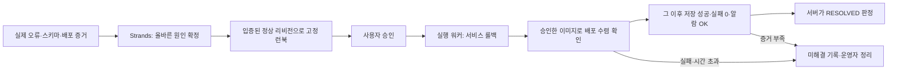

# 단일 RCA 시나리오의 원인 확정·조치 가능성 리뷰

검토일: 2026-09-15
대상: `single-scenario-plan-2026-09-15.md`와 검토 시점의 서비스·Strands·실행 워커 코드
범위: 읽기 전용 검토와 로컬 검증 함수 재현. 계획 원문·구현·ADR은 수정하지 않았고 AWS 장애 주입·배포·명령 실행은 수행하지 않았다.

## 결론

**시나리오는 유지할 만하다. 현재 계획과 구현 그대로의 데모 투입은 보류해야 한다.**

실제 DB에 없는 컬럼을 저장 쿼리가 참조하는 결함은 오류·스키마·배포 차이를 직접 대조할 수 있고, 정상 이미지로 되돌리는 조치도 명확하다. 이를 구현하고 증거 전달과 배포 후 검증을 보완하면 반복 시연을 검증할 가치가 있다. 아직 성공률을 말할 실측은 없다.

사용자가 이번에 요구한 목표는 **원인 확정에 이어 에이전트 시스템이 실제 조치하고 회복을 확인하는 것**이다. 기존 계획은 원인 확정까지만 필수이며 자동 조치를 제외하므로, 현재 통과 기준을 충족해도 이 목표가 달성됐다고 할 수 없다.

Strands는 읽기 전용 분석을 담당하고, 대시보드의 사용자 승인 뒤 별도 실행 워커가 조치하는 기존 경계를 유지해야 한다. Headless Codex 분석 워커를 끄는 것과 승인 실행 워커를 끄는 것은 다르다.

## 주요 발견 사항

High는 요청한 원인 확정·조치 데모를 막는 조건, Medium은 반복 성공 판단의 신뢰성을 떨어뜨리는 조건이다. 새 구현이 필요한 항목과 현재 동작의 결함을 구분했다.

### H1. High — 자동 조치가 통과 조건에서 빠져 있고 배포 후 검증도 연결되지 않는다

**계획 보완과 실행 계약 확장이 필요하다.**

계획 5절은 자동 실행을 제외하고 준비자의 복원을 허용한다. 이 방식으로 정상화돼도 에이전트가 올바른 명령을 생성·실행했다는 증거는 아니다.

현재 명령 검증기는 정상 태스크 정의로 되돌리는 `ecs update-service`를 받아들인다. 그러나 `metric_wait`는 앞선 `ecs stop-task` 단계만 참조할 수 있다. `ecs wait services-stable`도 현재 생성 검증에서 거부된다.

로컬에서 재현한 결과:

| 입력 | 결과 | 의미 |
|---|---|---|
| 고정 대상·리전을 가진 `ecs update-service` | 런북 검증 통과, 실행 명령 게이트 허용 | 명령 형태와 정책 검사 결과다. 실제 AWS 권한·API 성공을 검증한 것은 아니다 |
| 그 조치 뒤 `metric_wait` | 거부: 앞선 StopTask 필요 | 기존 정형 관측을 그대로 붙일 수 없다 |
| `ecs wait services-stable` | 거부: 알려진 서비스 작업이 아님 | CLI 대기 명령을 목록에 넣는 것만으로 해결되지 않는다 |

일반 조회 명령을 반복해 상태를 살피는 것은 별도 가능성이지만, 그것으로 이번 계획의 배포 후 관측 조건이 자동 충족된다고 볼 수는 없다.

**권고:** 통과 경로를 `원인 확정 → 승인 → 정상 리비전으로 UpdateService → 승인한 리비전·이미지로 배포 수렴 확인 → 그 이후 저장 회복 검증 → RESOLVED`로 바꾼다. 배포 수렴은 대상 서비스의 실행 태스크들이 승인한 정상 태스크 정의와 이미지로 전환된 상태를 뜻한다.

지표 구간은 UpdateService의 API 반환 시각이 아니라 **목표 배포가 실제로 수렴한 뒤**를 기준으로 해야 한다. 롤링 배포 중에는 이전·새 태스크가 함께 있을 수 있다. 정상 태스크 일부의 성공이나 이전 구간의 알람 OK를 전체 복구로 읽어서는 안 된다.

이 관측은 승인된 서비스·정상 리비전·이미지·메트릭·시간 규칙에 제한해야 한다. 모델이 실행 중 새 대상을 찾거나 명령 인자를 바꾸는 예외를 만들지 않는다.

근거:

- 계획 원문 69–78행.
- `packages/headless-codex/src/headless_codex/services/runbook_contract.py:142`
- `packages/headless-codex/src/headless_codex/services/post_action_metrics.py:244`, `:276`
- AWS 공식 롤링 배포 문서: https://docs.aws.amazon.com/AmazonECS/latest/developerguide/deployment-type-ecs.html

### H2. High — 결정적 증거의 생성부터 검증 입력까지 아직 연결되지 않는다

**서비스 관측의 새 구현과 분석 입력 전달 보완이 필요하다. 계획이 지적한 선행 사항을 구체적인 완료 조건으로 바꿔야 한다.**

현재 저장 실패 로그는 주로 `error_type=DBAPIError` 수준이다. DB 관측은 SQL 지문·시간·연결·락을 기록하지만, 이번 사례에 필요한 실제 컬럼 목록과 SQLSTATE·컬럼 참조 자료를 모두 제공하지 않는다.

초기 스코핑은 로그 검색을 금지한다. 따라서 가설 생성은 결정적인 컬럼 오류를 보지 못한 채 증상 지표부터 해석할 수 있다. 이후 수집에 성공해도 검증 입력으로 쓰는 요약은 앞 500자로 잘린다. 전체 증거를 보고서에 전달하는 개선은 이미 있지만, 보고서보다 먼저 일어나는 가설 검증의 정보 손실을 해결하지는 않는다.

**권고:**

- 실제 오류의 SQLSTATE·종류, 매개변수를 제외한 INSERT 식별자와 지문, 실제 컬럼 목록, 태스크·이미지·시각·원본 참조를 수집한다.
- 스키마 관측은 실패한 트랜잭션 밖의 읽기 전용 경로에서 수행한다.
- 첫 가설과 검증 단계가 이 핵심 사실을 받을 수 있어야 한다. 긴 산문의 뒤에 붙인 뒤 잘리는 구조를 피한다.
- 드라이버가 제공하지 않은 필드를 추정하지 않고, 오류 메시지나 SQL 매개변수를 무제한으로 기록하지 않는다.
- 수집·전달한 값과 실제 로그·DB 관측이 일치하는지 검사한다. 정답 라벨을 제공하는 것으로 대체하지 않는다.

이번 컬럼 결함은 아직 구현되지 않았다. 저장 SQL 한 곳에 한정한 변경이 실제 PostgreSQL에 도달하고, 앱 기동·기존 데이터 조회·헬스 상태·트랜잭션 정리가 유지되는지 먼저 실DB로 확인해야 한다. ORM 모델의 필드 이름만 바꾸면 다른 경로까지 영향을 주거나 DB 호출 전에 실패할 수 있다.

근거:

- `packages/healthcare-sensor-app/src/test_service/services/sensor.py:48`
- `packages/healthcare-sensor-app/src/test_service/services/db_observability.py:75`
- `packages/healthcare-sensor-app/src/test_service/adapters/secondary/database_adapter.py:178`
- `packages/agent/src/rca_agent/prompts/scoping.py:11`
- `packages/agent/src/rca_agent/services/evidence.py:192`
- `packages/agent/src/rca_agent/services/pipeline.py:844`

### H3. High — 공유 예산 소진과 실패 캐시가 재시도 기회를 없앤다

**현재 수집 동작의 결함이다. 장애를 더 명확하게 만드는 것만으로 해결되지 않는다.**

한 수집 라운드의 가설들이 같은 마감 시각을 공유한다. 앞 호출이 예산을 소진하면 뒤 가설은 실제로 시작하지 못한 채 실패 처리될 수 있다. 이 실패 표식도 증거 캐시에 들어가며, 다음 라운드는 캐시에 없는 가설만 다시 수집한다.

로컬 대역으로 가설 3개·공유 예산 50ms·첫 호출 200ms를 재현했을 때, 실제 에이전트 시작은 1회였지만 3개 모두 실패로 기록됐고 동일 가설의 재수집 후보는 0개였다. 직전 라이브의 timeout 이벤트 8개를 독립적인 외부 조회 8회 실패라고 해석해서는 안 된다.

**권고:** 미시작·수집 실패·완료 증거를 구분하고, 총 실행 예산과 탐색 한도 안에서 가설별 호출 기회와 제한된 재수집을 보장한다. 외부 요청의 실제 종료와 남은 예산도 관측한다. 실패 시 확보한 원본은 진단용으로 보존하되, 미완료 수집을 성공한 확정 근거로 승격하지 않는다.

근거:

- `packages/agent/src/rca_agent/services/evidence.py:183`, `:230`, `:245`
- `packages/agent/src/rca_agent/services/pipeline.py:779`
- 직전 실제 실패 기록: `docs/test-reports/dashboard-runbook-2026-09-15/live-evidence-timeouts.json`

### H4. High — 정상 복구 대상을 에이전트가 입증하며 조회할 경로가 미정이다

**계획에서 빠진 데이터 전달 계약이다.**

준비자가 정상 태스크 정의를 기록하는 것과 에이전트가 그 기록을 찾아 승인 전 명령에 고정하는 것은 다른 단계다. 계획에는 기록 위치·조회 경로·현재 사고와의 연결 검증이 없다. 현재 런북 생성기는 자체 조회 도구가 없고, 제어 근거가 부족하면 빈 실행 목록을 반환하도록 되어 있다.

**권고:** 정상 기준 관측을 읽기 전용으로 발견할 수 있게 하고 다음 값을 연결한다.

- 현재 대상 계정·리전·클러스터·서비스.
- 정상 저장이 관측된 태스크 정의 ARN과 실제 이미지 지문.
- 그 관측의 시각·실행 식별자·원본 위치.
- 장애 배포 이전의 정상 상태라는 근거와 현재 서비스에 적용 가능한 복원 대상이라는 확인.

단순히 “이전 리비전”, “가장 큰 리비전 번호”, “latest 이미지”를 고르면 안 된다. 정답 원인을 주입하는 대신 실제 정상 배포와 성공 관측을 제공해야 한다. 대상이 불명확하거나 다른 배포가 끼어들면 새 검토를 요구하고 실행하지 않는다.

근거:

- 계획 원문 45행.
- `packages/agent/src/rca_agent/di/app_container.py:175`
- `packages/agent/src/rca_agent/agent_factory.py:204`
- `packages/agent/src/rca_agent/prompts/playbook.py:72`

### M1. Medium — 원인 확정 3회만으로는 반복 조치 성공을 평가할 수 없다

계획의 3회 연속 확정은 초기 점검으로 유용하지만, 승인·조치·배포 대기·회복 판정을 검증하지 않는다. 같은 조건 세 번만으로 “대부분의 경우 성공”이라는 성공률을 추정하기도 어렵다.

**권고하는 데모 채택 기준:**

1. 먼저 3회 연속으로 원인 확정부터 승인 실행·복구 확인까지 전체 흐름을 통과시킨다.
2. 그 다음 평가할 10회를 미리 정하고, **10회 중 9회 이상 전체 성공**을 제안 기준으로 삼는다. 성공한 실행만 고르거나 실패 후 횟수를 다시 세지 않는다.
3. 첫 분석·재사용 지식이 있는 분석, 새로운 태스크 정의 식별자, 승인 대기 시간 차이를 포함하되 원인 메커니즘은 같은 컬럼 불일치로 유지한다.
4. 잘못된 원인 확정, 잘못된 서비스 변경, 승인되지 않은 명령 실행은 0건이어야 한다. 9회가 성공했어도 이런 위반이 있으면 데모 투입을 보류한다.
5. 원인 확정 시간과 승인 후 실제 복구 시간을 분리해 기록한다. 시연 허용 시간은 이 실측으로 정한다.

이 숫자는 제안하는 **데모 채택 기준**이며 통계적으로 운영 성공률 90%를 보장한다는 뜻이 아니다. 다른 종류의 장애에 대한 성공률로 확대하지 않는다.

## 권고하는 성공 흐름

사용자 승인 외에 사람이 원인·SQL·명령을 중간에 대신 채우면 전체 자동 성공으로 세지 않는다. 준비자의 원복은 실패 후 환경 정리이며 실행 워커의 복구 성공과 구분한다.

## 구현·검증 순서 제안

| 순서 | 먼저 입증할 것 | 다음 단계 진입 조건 |
|---|---|---|
| 1 | 실제 DB의 정상→컬럼 오류→원복 | 저장만 실패하고 42703이 실제로 발생, 스키마·조회·세션 정리 유지 |
| 2 | 결정적 관측의 생성과 전달 | 첫 가설·검증 입력에 오류·컬럼·배포 근거가 보존 |
| 3 | 수집 예산·실패 상태 처리 | 가설별 실제 시작과 종료, 제한된 재수집, 미완료 확정 금지 확인 |
| 4 | 입증된 정상 대상의 런북 생성 | 수동 명령 수정 없이 올바른 서비스·정상 리비전·이미지가 고정 |
| 5 | 배포 후 복구 검증 | 승인 실행으로 정상 이미지 수렴과 사후 저장 회복, RESOLVED 확인 |
| 6 | 반복 리허설 | 미리 정한 전체 성공률·안전성 기준 충족 |

기존 시나리오 정리는 새 계획에 맞춰 수행하되, 활성 목록이 하나라는 사실을 신뢰성 검증으로 대체하지 않는다. 코드·이미지·평가 조건을 고정한 뒤 반복 실행해야 결과를 비교할 수 있다.

## 검증 범위와 출처

- 계획 원문, Healthcare·Strands·실행 워커의 관련 코드를 읽었다. 병행 변경 중인 워킹트리이며, 실제 배포 버전과 동일하다고 가정하지 않았다.
- 서로 분리된 읽기 전용 검토로 Healthcare/인프라와 Strands 수집·런북 생성 경로를 확인했다.
- UpdateService/관측 대기/CLI waiter는 현재 Python 검증 함수와 명령 게이트로 재현했다. AWS 명령은 실행하지 않았다.
- 수집 예산과 요약 손실은 대역을 이용한 로컬 재현이다. 새 컬럼 결함의 실DB 또는 라이브 Strands 성공 실험은 수행하지 않았다.
- 실제 태스크 역할의 UpdateService 권한, 실제 롤백 대상의 유효성, 새 이미지의 런타임 동작은 사전 실측 항목으로 남아 있다.
- AWS 공식 문서에서 롤링 배포의 태스크 교체와 배포 설정을 확인했다: https://docs.aws.amazon.com/AmazonECS/latest/developerguide/deployment-type-ecs.html

문서 검토에서도 원인 확정 이후에 승인·조치·배포 수렴·사후 관측이 각각 필요하다는 순서를 확인했다. 원인 판정만 통과한 사실이 다음 단계의 성공 근거가 되지 않도록 구분했다.
