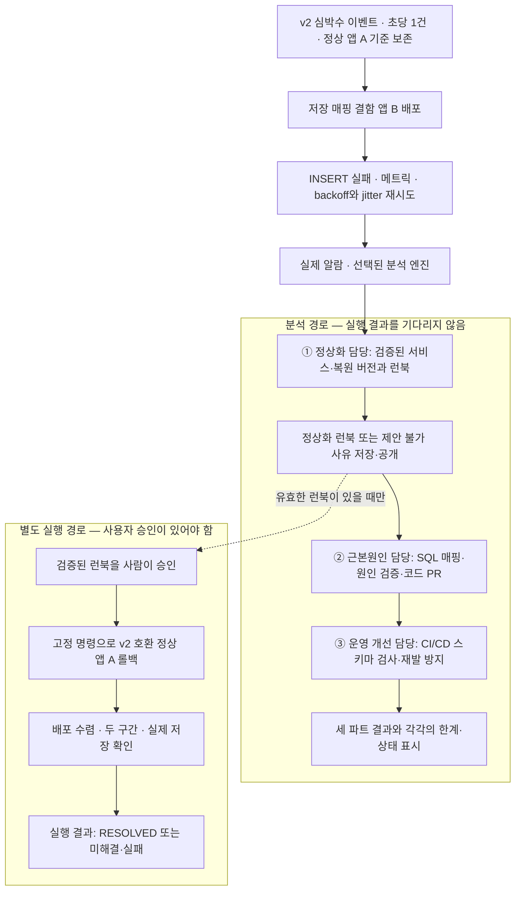

# Vital Sensor RCA — 빠른 정상화·근본원인·운영 개선 3단계 검토안

상태: RCA 3파트·조기 승인 계약은 코드에 반영하고 로컬 검증을 마쳤다. 이벤트 v2·매초 생성·지속 재시도는 아래 시나리오의 검토 대상이며, 이 문서는 해당 앱 기능의 구현·배포나 실제 장애 시연 성공을 뜻하지 않는다.
다음 장애 시연에서는 아래 입력·관측·승인 조건을 실제 환경에서 확인해야 한다.
실제 계정·리전·배포 리비전·이미지 지문은 다음 실행의 관측으로 채운다.
근본원인 확정 전 검증된 롤백의 승인과 진행 중 런북 공개는 승인된 범위다. 실제 반영 상태와 검증 결과는 구현 기록으로 확인한다.

## 1. 무엇을 증명하려는가

Vital Sensor 앱은 사용자의 센서에서 얻은 **심박수 중심 vital 이벤트 한 건을 매초 처리하고 INSERT를 시도**한다.
주요 값은 `heart_rate`이고 단위는 분당 심박수를 뜻하는 `bpm`이다.
데모 생성기가 센서 입력을 모사하며, 정상·장애·복구 구간 모두 같은 v2 이벤트를 매초 한 건씩 발생시킨다.
심전도 파형을 수집하는 앱으로 가정하지 않는다.
**vital 이벤트 스키마 v2의 필드 변경을 DB 저장 매핑에 잘못 반영한 버전**을 배포하면 INSERT가 실패하고, 앱은
backoff와 jitter를 적용해 재시도를 계속한다. 실패 메트릭으로 알람이 발생하면
선택된 분석 엔진의 **정상화 담당이 어떤 서비스를 어떤 정상 버전으로 되돌릴지 먼저 찾아 런북을 공개**한다.
그다음 **근본원인 담당이 코드 결함과 수정 PR을, 운영 개선 담당이 CI/CD 스키마 검사 등의 예방책을 순서대로 작성**한다.
사용자의 런북 승인·미승인과 실행 성공·실패 여부는 뒤의 두 분석을 막지 않는다.
실제 롤백과 저장 회복 확인은 사용자가 승인한 경우에만 별도 실행 에이전트가 수행한다.

여기서 사용자가 말한 서비스 팟은 현재 구성의 ECS 태스크 안에서 실행되는
앱 컨테이너를 뜻한다. Kubernetes로 옮기는 시나리오는 아니다.
문서의 서비스 표시명은 **Vital Sensor 앱**으로 바꾼다. 현재 AWS 리소스 이름과
코드 경로에 남아 있는 `Healthcare`/`healthcare-sensor-app`은 실제 식별자이므로 아래 근거와 명령에는 그대로 표시한다.
이 검토안은 초당 1건을 **서비스 전체의 신규 vital 생성·최초 저장 시도율**로 해석한다.
재시도는 별도로 집계하므로 총 DB 시도 수는 초당 1건보다 많아질 수 있다.

### 이벤트 스키마 변경과 DB 스키마를 구분한다

vital 이벤트 스키마 v1에서는 측정 시각이 `timestamp`이고, v2에서는
`sampled_at`으로 이름이 바뀐다. 다음은 변경할 필드를 보여주는 설명용 예시이며
실제 사용자 데이터나 이미 구현된 이벤트 형식은 아니다.

```json
{
  "event_id": "demo-vital-001",
  "schema_version": 1,
  "sensor_id": "demo-sensor-01",
  "reading_type": "heart_rate",
  "value": 72,
  "unit": "bpm",
  "timestamp": "2026-09-17T00:00:00Z"
}
```

```json
{
  "event_id": "demo-vital-001",
  "schema_version": 2,
  "sensor_id": "demo-sensor-01",
  "reading_type": "heart_rate",
  "value": 72,
  "unit": "bpm",
  "sampled_at": "2026-09-17T00:00:00Z"
}
```

이 검토안에서는 **이벤트의 필드명만 바꾸고 DB 컬럼은 `sensor_readings.timestamp`로
유지**하는 계약을 가정한다. 정상 처리는 `v2 sampled_at → 내부 측정 시각 → DB timestamp`다.
결함 버전은 이벤트 필드명 `sampled_at`을 SQL 컬럼명으로 그대로 사용한다.
INSERT는 DB에 행을 저장하는 SQL 명령이며, DB에 `sampled_at` 컬럼이 없어 실패한다.

### 롤백 대상은 v2 이벤트와 호환되는 정상 앱이다

이벤트 스키마 버전과 앱 배포 버전을 구분한다. **정상 앱 A**는 v1·v2 이벤트를 모두
해석하고 `timestamp` DB 컬럼에 올바르게 저장하는 호환 버전이다.
**결함 앱 B**는 같은 이벤트 해석·재시도 로직을 가지지만, v2 전환을 반영하는 과정에서
SQL 저장 컬럼을 `sampled_at`으로 잘못 바꾼 배포다.

먼저 앱 A에 v2 이벤트를 보내 정상 저장을 검증하고 정상 기준을 보존한다.
그다음 앱 B를 배포해 결함을 드러낸다. 롤백 후에도 이벤트 생성기는 v2를 계속 보낸다.
v1 이벤트만 처리하는 과거 앱으로 되돌리면 새 장애가 되므로 그런 버전은 롤백 대상으로 삼지 않는다.

| 비교 항목 | 정상 | 장애 | 복구 |
|---|---|---|---|
| 입력 이벤트 | 스키마 v2, sampled_at | 동일한 v2 이벤트 | 동일한 v2 이벤트 유지 |
| 앱 배포 | v2 호환 정상 앱 A | 저장 매핑 결함 앱 B | 검증된 정상 앱 A |
| 애플리케이션의 SQL 저장 컬럼 | timestamp | sampled_at | timestamp |
| 실제 DB 스키마 | timestamp 있음, sampled_at 없음 | 동일 | 동일 |
| 신규 vital | 초당 1건 생성·저장 시도 | 초당 1건 유지 | 초당 1건 유지 |
| INSERT 결과 | 커밋 성공 | PostgreSQL 42703 오류 | 커밋 성공 |
| 실패한 vital | 없음 | backoff + jitter로 재시도 대기 | 정상 버전에서 재시도·완료 확인 |
| 기존 데이터 조회·헬스 | 정상 | 정상 유지 | 정상 |
| 요청 내용·부하 설정 | 고정 | 동일 | 동일 |

정확한 원인 설명은 “vital 이벤트 v2의 필드명을 DB 컬럼명으로 잘못 사용한 저장 매핑 결함”이다.
증거 없이 “DB 마이그레이션을 누락했다”까지 원인을 확장하지 않는다.
복구는 v2 호환 정상 앱 A로 되돌리는 것이다. 이벤트 v2를 v1로 되돌리거나
DB 컬럼을 추가하지 않으며, 영구 수정은 v2 이벤트 계약을 유지한 채 저장 매핑을 고친다.

세 분석 파트와 실제 서비스 복구는 각각 상태를 표시한다. 코드 PR이나 운영 개선 제안이
완료돼도 서비스가 복구됐다는 뜻은 아니다. 실행 실패는 뒤 분석의 중단 사유가 아니며,
뒤 분석 실패도 이미 확인된 복구 결과를 취소하지 않는다.

## 2. 먼저 시나리오 자체를 통과시킨다

에이전트 성능을 시험하기 전에, 준비자가 별도 실행 ID로 다음 순환이 가능한지 확인하는
사전 점검을 제안한다. 실행 ID는 한 번의 주입·관측·복원을 묶는 식별자다.

1. 정상 앱 A에서 v2 심박수 이벤트가 매초 한 건씩 저장되고, 저장된 측정 시각이 입력의 `sampled_at`과 일치한다.
2. 동일한 v2 해석·재시도 로직에서 SQL 저장 컬럼만 잘못 바꾼 앱 B를 배포하면 실제 DB 오류가 난다.
3. 실패 직후 메트릭이 증가하고, 같은 vital이 backoff·jitter 간격을 두고 재시도된다.
4. v2 이벤트 발행을 유지한 채 앱 A로 복원하면 신규 vital 저장이 회복되고 미완료 v2 이벤트도 추적할 수 있다.
5. 세 구간에서 스키마·기존 데이터·조회·헬스·신규 발생률·연결 반환이 유지된다.
6. 장애 이미지에서 실행된 소스와 파일·행, 정상 소스의 차이를 실제 원본으로 연결할 수 있다.

하나라도 확인되지 않으면 시나리오 준비 실패로 멈춘다. 이 사전 점검의 운영자 복원은
에이전트 복구 성공으로 세지 않는다. 본 시연은 새 실행 ID와 새 정상 기준으로 시작하며,
사전 점검의 복구 결과나 정답 설명을 에이전트 입력으로 넣지 않는다.
다른 분석·실행이 진행 중이거나 이전 버전 분석 태스크가 남아 있으면 새 시연을 시작하지 않는다.

## 3. 본 시연의 전체 흐름




### 세 담당과 한 실행 워커의 관계

| 분석 순서 | 담당 | 먼저 답할 질문 | 산출물 |
|---|---|---|---|
| 1 | 정상화 담당 | 어떤 서비스를 어떤 검증된 버전으로 되돌릴 것인가? | 고정 런북과 근거, 또는 제안 불가 사유 |
| 2 | 근본원인 담당 | 왜 실패했으며 어떤 SQL 관련 코드를 고쳐야 하는가? | 원인·대안 검증, 파일·행, 코드 수정 PR 미리보기 |
| 3 | 운영 개선 담당 | 다음 배포 전에 어떤 검사로 같은 문제를 막을 것인가? | 스키마 lint·계약 테스트·배포 절차 개선 제안 |

정상화 담당의 결과 저장 뒤 근본원인 담당이 시작하고, 그 결과 또는 분석 한계가
저장되면 운영 개선 담당이 시작한다. 런북 미승인·거절·실행 중·실패·취소 모두 같은 순서다.
분석 전체 취소·소유권 상실·저장 실패와 같은 기존 중단 조건은 유지한다.

세 담당은 선택된 Strands 또는 Headless 분석 엔진 안의 역할이다. 본 시연은 Strands
분석 워커 1개, Headless 분석 워커 0개를 유지하며 별도 실행 워커만 승인된 쓰기를 한다.
세 역할을 만들기 위해 두 분석 엔진이 같은 알람을 동시에 처리하게 바꾸지 않는다.

[3파트 에이전트·보고서 템플릿](three-part-rca-template.html)에서 각 담당의 입력·종료 조건과 출력 양식을 볼 수 있다.

### ① 장애를 넣기 전에 정상 상태와 복원 대상을 확보한다

준비자는 실제 AWS ECS 서비스에서 정상 이미지가 실행 중인지 확인한다.
ECS는 컨테이너 실행 서비스이고, 태스크 정의는 실행할 이미지와 설정을 묶은 배포 명세다.
이미지 지문(digest)은 태그 이름과 달리 이미지 내용을 고정한다.

새 vital 한 건을 매초 발생시키는 부하에서 저장 완료, 실패 0, 실제 스키마, 알람 OK를 관측한다.
이 정상 관측은 **v2 심박수 이벤트를 실제로 처리한 결과**여야 하며, 입력 측정 시각의 보존도 확인한다.
그 결과와 아래 배포 정보를 실행별 S3 정상 기준 파일로 보존한다.
S3는 원본 파일을 저장하는 객체 저장소다.

| 정상 기준에 담을 것 | 필요한 이유 |
|---|---|
| 계정·리전·클러스터·서비스·애플리케이션 컨테이너 | 다른 서비스나 계정을 복원하지 않도록 대상을 고정 |
| 정상 태스크 정의 ARN과 실제 앱 이미지 지문 | 준비자의 기억이나 “이전 리비전” 추측 없이 정상 버전을 식별 |
| 정상 저장 완료·실패 지표·스키마·소스 관측 | 그 버전이 실제로 정상 저장한 사실을 증명 |
| v2 이벤트 원본·해석 결과·저장된 측정 시각 | sampled_at이 정상 앱에서 해석되고 DB timestamp 값으로 정확히 저장됨을 증명 |
| 요청 부하·서비스 설정·관측 시각·실행 ID | 장애 구간과 비교할 조건 및 시간 관계를 보존 |
| 원본 위치와 내용 해시 | 읽을 때 같은 원본인지 검사 |

ARN은 AWS 리소스의 고유 식별자다. 기준 파일은 같은 실행에서 덮어쓰지 않는다.
알람에는 기준 파일의 참조와 실행·서비스 정보만 연결한다. 원인 정답이나 미리 만든
복구 명령을 넣지 않는다. 기준을 확보하지 못하면 장애 주입을 시작하지 않는다.

### ② 실제 장애 이미지를 배포한다

정상 앱 A와 결함 앱 B는 같은 이벤트 v1·v2 해석, 재시도, 계수 로직을 가지며 SQL 저장 컬럼 매핑만 다르게 한다.
장애 이미지의 태스크 정의와 지문을 기록한 뒤 해당 서비스에 배포한다.
테이블 정의, ORM, DB 데이터, 네트워크, 태스크 수, 요청 부하를 함께 바꾸지 않는다.

두 앱 모두 v2의 `sampled_at`을 유효한 측정 시각으로 읽고 내부의 기존 `timestamp`
필드로 정규화한다. 결함은 그 뒤 SQL의 대상 컬럼을 선택하는 부분에 한정한다.
v2 이벤트가 입력 검증에서 거부되거나 측정 시각이 현재 시각으로 대체되는 경우는
이번 DB 저장 매핑 결함을 재현한 것이 아니므로 사전 점검에서 걸러낸다.

DB는 실제 INSERT 실행에서 SQLSTATE `42703`을 반환해야 한다.
이는 존재하지 않는 컬럼 참조 오류다. 앱 기동 실패나 DB 호출 전 오류가 발생하면
다른 장애가 된 것이므로 이번 시나리오의 성공적인 주입으로 인정하지 않는다.

장애 버전의 배포 상태와 실행 태스크도 기록한다. 이후 승인·실행 시 다른 배포가
끼어들었는지 대조할 기준이다.

사후 코드 분석을 위해 장애 이미지에 대응하는 소스 리비전과 원본 파일도 보존한다.
빌드 중 문자열만 바꾸고 원본·변경 내역을 남기지 않으면, 나중에 어느 소스의 몇 번째
행을 수정할지 입증할 수 없다.

### 장애 중 동작: 신규 vital 발생과 실패 재시도를 분리한다

신규 vital의 매초 발생이 한 건의 재시도 대기에 막히면 안 된다. 최초 저장과
재시도는 각각 시각·vital 식별자·시도 번호·결과를 남긴다.
재시도할 때 이벤트 ID, `schema_version=2`, 원래 `sampled_at`, 심박수 값을 유지한다.
재시도를 새 측정 이벤트로 만들거나 수집 시각을 바꾸지 않는다.

- INSERT 실패 시 해당 트랜잭션을 정리하고 연결을 반환한 뒤 재시도를 예약한다.
  연결이나 트랜잭션을 잡은 채 backoff 시간을 기다리지 않는다.
- backoff는 연속 실패 시 대기 간격을 늘리는 방식이고, jitter는 대기에 임의 편차를
  넣어 재시도가 한꺼번에 몰리지 않게 하는 방식이다.
- 잘못된 저장 매핑이 있는 동안에는 동일한 SQL이 계속 실패한다. backoff·jitter는 부하를
  조절할 뿐 매핑을 고치지 않는다. v2 호환 정상 앱으로 롤백해야 저장이 회복된다.
- 재시도 대기 상한과 동시성 한도를 두되, 횟수만 채우고 실패한 vital을 조용히
  성공 처리하거나 삭제하지 않는다. 취소·종료 시 미완료 상태도 기록한다.
- 재시도는 한 계층이 책임진다. 서비스·저장소·드라이버가 각각 같은 요청을
  재시도해 시도 수가 곱해지지 않도록 한다.

**추가 설계 제안:** 재시도마다 같은 vital 식별자를 사용하고, 커밋 후 응답을 놓친
경우에도 같은 vital을 중복 저장하지 않는다. 롤백으로 팟이 교체돼도 미완료 vital을
새 팟이 이어받을 수 있게 보존한다. 팟 메모리에만 둔 대기 작업이 종료와 함께
사라지는 것을 복구 성공으로 보지 않는다.

서비스 전체의 발생률을 지키려면 팟 교체 중 신규 vital을 생성하는 주체도 겹치지
않아야 한다. 미완료 보관 방식, 최대 수용량, backoff 기본·최대 간격, jitter 범위,
재시도 동시성은 구현 전에 정할 항목이다. 이 검토안에서 임의 수치를 확정하지 않는다.

### ③ 실제 실패 지표로 알람을 발생시킨다

`VitalIngestAttempts`와 `VitalIngestFailures`가 실제 저장 요청 결과로 기록되고,
기존 `RcaAgentDev-Healthcare-VitalIngestFailures` 알람이 ALARM으로 전환되어야 한다.
알람 상태를 수동으로 바꾸거나 가짜 오류를 발행하지 않는다.

기존 알람의 임계치·차원·평가 조건을 유지한다. 알람은 SNS/SQS의 공용 전달 경로를
거쳐 분석 워커에 도착한다. SNS는 알림 전달, SQS는 작업 대기열 역할이다.
본 시연은 Strands 분석 워커 1개, Headless 분석 워커 0개, 별도 승인 실행 워커로 구성한다.
실행 워커까지 끄면 런북 실행을 검증할 수 없다.

**재시도 루프가 끝날 때까지 실패 집계를 미루면 알람이 울리지 않을 수 있다.**
따라서 각 실제 INSERT 시도의 성공·실패를 그 시도 종료 시점에 기록한다.
기존 시도·실패 지표와 함께 아래 관측값을 구분해 보여준다.

| 관측값 | 데모에서 확인할 의미 |
|---|---|
| 신규 vital 수·발생 시각 | 초당 1건 발생이 유지되는가 |
| 실제 INSERT 시도 수·실패 수 | 최초 시도와 재시도를 포함한 DB 오류가 즉시 드러나는가 |
| 재시도 수·예정/실제 대기 시간 | backoff·jitter가 실제로 적용되는가 |
| 미완료 vital 수·가장 오래된 대기 시간 | 실패한 작업이 쌓이거나 사라지지 않는가 |
| 커밋 완료 vital 식별자 | 재시도 횟수와 고유 저장 건수를 구분하고 중복을 찾을 수 있는가 |

재시도 실패 수를 새로운 vital 수로 해석하지 않는다. 알람은 실제 실패 지표로
발생시키고, 신규 발생·재시도·미완료·고유 커밋 수는 원인 분석과 복구 확인에 함께 사용한다.
중복 요청에 정상 응답을 반환해도 새로운 vital을 커밋한 것으로 세지 않는다.
재시도·중복 방지 도입 후에는 생산자의 집계 의미를 정상 이미지의 실제 관측으로
다시 검증한다. 기존 `attempts - failures` 값을 그대로 고유 저장 완료 건수로
사용하거나, 이전 정상 버전의 완료 쓰기 증명을 새 집계 방식에 재사용하지 않는다.

### ④ 파트 1 — 빠른 정상화 담당이 런북을 먼저 만든다

정상화 담당은 전체 코드 원인을 밝히기 전에 현재 장애 서비스와 최근 배포, 실제
장애 이전 정상 기준을 읽는다. **현재 B에서 v2 호환 정상 A로 되돌릴 근거**를 먼저 확인한다.
초기 화면에는 “근본원인 분석 진행 중”과 “임시 정상화 제안”을 구분해 표시한다.

| 우선 확인 | 이번 시나리오의 필요한 근거 |
|---|---|
| 장애 대상 | 실제 계정·리전·클러스터·서비스·앱 컨테이너 |
| 현재 버전 | 장애가 관측되는 태스크 정의·앱 digest·배포 ID·설정 |
| 복원 버전 | 같은 서비스에서 v2 이벤트를 실제 저장한 정상 앱 A의 태스크 정의·digest |
| 정상 기준 | 허용된 S3 원본·해시·실행 ID·장애 이전 관측·측정 시각 보존 |
| 조치의 적용 가능성 | 최근 배포와 증상 발생의 시간 관계, 현재와 정상의 동일 서비스·설정·입력 호환성 |

정상 기준은 모델의 자체 선언이 아니라 서버가 원본·대상·시각·호환성 근거를 검증한
결과여야 한다. 리비전 번호가 작거나 `latest`라는 이유로 정상 대상을 선택하지 않는다.

빠른 롤백 뒤에도 원인을 분석할 수 있도록, 런북 공개 전에 장애 시간 구간·현재 B의
배포와 소스 식별·오류 및 지표 원본 참조를 고정한다. 전체 코드 분석을 기다리지는 않되,
당시 상태를 다시 읽을 최소 근거는 남긴다. 뒤 담당은 이를 사용하고 정상화된 A의
현재 관측을 B의 장애 시점 관측으로 바꾸어 해석하지 않는다.

**변경 제안:** 근본원인 확정과 전체 분석 완료 전이어도, 위 근거와 고정 런북이 서버
검증을 통과하면 해당 롤백을 사용자가 승인할 수 있게 한다. 대상·근거가 부족하면
명령을 추정하지 않고 제안 불가 사유를 저장한다. 두 경우 모두 다음 근본원인 분석으로 진행한다.

이 조기 산출물은 이번 사고의 검토·승인용이다. 원인이 확정됐거나 공개 플레이북 지식이
완료 게시됐다는 뜻이 아니며, 다음 분석의 검색 지식으로 자동 승격하지 않는다.

#### 정상화 런북과 플레이북 지식의 구분

| 플레이북: 장애 유형의 대응 지식 | 런북: 이번 사고의 실행 계획 |
|---|---|
| 저장 실패율, SQLSTATE, 스키마, 배포 시각, 연결 반환을 확인하는 방법 | 이번 계정·리전·서비스·현재 장애 버전·정상 복원 버전 |
| 컬럼 불일치와 연결 누수 등을 구분하는 판단 기준 | 실제 명령 문자열, 순서, 고정된 대기 단계와 인자 |
| 정상 이미지 롤백을 고려할 조건과 에스컬레이션·재발 방지 | 승인 전제, 단계별 성공 기준, 실패 시 중단 조건 |

이번 플레이북에는 “재시도 실패 증가를 신규 입력 폭증으로 오인하지 않는 방법”과
“이벤트와 DB의 매핑 결함은 재시도 대기만으로 해결되지 않는다는 판단”도 포함한다.

플레이북은 재사용할 지식이다. 런북의 대상과 명령은 이번 사고의 관측으로 확정해야 한다.
과거 플레이북에 정상 버전이 적혀 있다는 이유로 이번 복원 대상으로 사용하지 않는다.


유형별 지식을 모두 완성하느라 정상화 런북 공개를 늦추지 않는다. 근본원인과 운영 개선 지식은 뒤의 담당이 보완한다.

#### 먼저 검토·승인할 고정 런북

아래는 런북의 구조 예시이며 실행 명령이 확정된 상태가 아니다.
`<...>`는 다음 실행에서 실제로 관측할 값이다. 승인 화면에는 이런 자리표시자가
남으면 안 되며 실제 값으로 완성된 명령과 성공 기준을 보여줘야 한다.

| 순서 | 실제 수행 항목 | 승인 전에 고정할 내용 |
|---|---|---|
| 전제 검사 | 서버가 현재 서비스·태스크·복원 대상 명세를 조회 | 현재 장애 배포 ID·이미지·설정과 정상 대상 |
| 1. 지표 좌표 조회 | 시도·실패 지표 각각의 `aws cloudwatch list-metrics` 명령 | namespace, metric name, dimensions, region |
| 2. 알람 설정 조회 | `aws cloudwatch describe-alarms` 명령 | 이번 사고의 정확한 실패 알람 이름과 region |
| 3. 롤백 | 정상 태스크 정의를 지정한 정확한 UpdateService 명령 | 모든 대상 값과 명령 문자열 |
| 4. 배포 대기 | `wait_for_service_deployment` 정형 도구 | 앞선 롤백 단계, 정상 태스크 정의·앱 이미지, 기대 태스크 수, 최대 900초 |
| 5. 저장 회복 대기 | `wait_for_post_action_metrics` 정형 도구 | 앞선 수렴 단계, 시도·실패 지표 좌표, 실패 알람, 완료 증거 참조, 최대 900초 |
| 최종 판정 | 서버가 단계·실행·증거를 종합 | 다음 절의 모든 성공 기준 |

지표·알람 조회도 설명문으로만 두지 않고 완성된 명령 문자열로 승인한다.
CLI 명령은 다음 순서이며, 이어서 표의 배포·저장 회복 대기를 수행한다.

```bash
aws cloudwatch list-metrics --namespace Healthcare/Sensor --metric-name VitalIngestAttempts --dimensions Name=ServiceName,Value=healthcare-sensor-app --region <확인된_리전>
aws cloudwatch list-metrics --namespace Healthcare/Sensor --metric-name VitalIngestFailures --dimensions Name=ServiceName,Value=healthcare-sensor-app --region <확인된_리전>
aws cloudwatch describe-alarms --alarm-names <이번_사고의_실패_알람_이름> --region <확인된_리전>

aws ecs update-service \
  --cluster <이번_사고의_클러스터_ARN> \
  --service <이번_사고의_서비스_ARN> \
  --task-definition <정상_저장이_검증된_태스크_정의_ARN> \
  --region <확인된_리전>
```

이 명령의 실제 조회 결과가 같은 실행의 증거로 남아야 뒤의 지표 대기를 진행할 수 있다.
정형 대기는 모델이 새 셸 명령을 만드는 단계가 아니다. 승인된 좌표와 조건을 전용
도구가 조회·검증하고 결과를 기록한다. 완료 지표만으로 실제 커밋을 증명할 수 없으면,
저장 완료 로그를 조회할 구체 명령도 승인 전에 런북에 포함해야 한다.

사용자는 뒤의 분석이 진행 중이어도 준비된 명령·대상·순서·성공 기준을 검토할 수 있다.
사람이 명령·대상·순서·성공 기준을 확인해 승인하면, 서버가 먼저 열람한 내용 지문을 대조한다.
실제 ECS의 현재 배포와 정상 복원 대상 전제까지 확인한 뒤에만 승인 사본을 저장하고 실행을 예약한다.
승인 후 변경하려면 새 승인이 필요하다. 시연 중 사람이 원인·명령을 대신 채웠다면
그 회차를 에이전트 전체 성공으로 세지 않는다.


이 승인 화면에서 사용자의 응답을 기다리는 동안에도 근본원인 담당은 다음 분석을 진행한다. 실행 대기와 분석 대기는 같은 상태가 아니다.

### ⑤ 파트 2 — 근본원인 담당이 코드 원인과 수정안을 만든다

정상화 결과가 저장되면 근본원인 담당이 읽기 전용으로 실제 관측을 찾는다.
런북이 미승인·미실행이거나 실패했어도 이 분석을 계속한다. 기존 원인 확정·신뢰도·검증 한도는 바꾸지 않는다. 원인·기대 답안을 적은 시나리오 설명을
증거로 주지 않는다.
장애 시점에 고정한 소스·시간 구간과 복구 후 관측을 구분해, 이미 롤백됐더라도 당시 결함을 분석한다.

| 질문 | 필요한 실제 관측 | 판단 |
|---|---|---|
| 무엇이 실패했는가? | DB 오류 42703, INSERT 컬럼 목록, 요청·관측 시각 | 없는 컬럼을 참조한 저장 실패 |
| 어떤 이벤트를 처리했는가? | 이벤트 스키마 버전·sampled_at·심박수 유형과 값, 해석 경로 | v2 입력은 정상 해석됐고 DB 쓰기 단계에서 실패 |
| DB 스키마가 바뀌었는가? | 정상·장애 구간의 실제 컬럼 목록 | 두 구간 모두 timestamp가 있고 sampled_at은 없음 |
| 애플리케이션에서 무엇이 바뀌었는가? | 실행 이미지·소스 리비전·SQL 지문·파일과 행 | v2 이벤트는 sampled_at을 사용하지만, 결함 앱은 이를 SQL 컬럼명으로도 사용 |
| 재시도가 원인을 해결하는가? | 동일 vital의 시도 번호·대기 시간·오류 코드 | 기다려도 같은 42703이 반복되므로 저장 매핑 결함 버전 제거 필요 |
| 그 변경이 증상과 연결되는가? | 장애 배포 시각, 같은 요청 부하, 저장 성공→실패 전환 | 배포 변경과 실제 저장 실패의 연결 |
| 연결 누수 같은 다른 원인은 어떤가? | 같은 구간의 연결 사용·반환, 실패 후 트랜잭션 정리, 조회·헬스 | 반증이 충분할 때 명시적으로 기각; 자료가 없으면 미확인 |
| 어디로 복원할 수 있는가? | 장애 전 정상 기준 원본과 현재 서비스·태스크·설정 | 같은 서비스의 검증된 정상 버전 식별 |

원인 확정과 대안 기각에는 각각 사용한 원본 증거를 연결한다.
보고서 어딘가에 증거를 언급한 것만으로 모든 판정의 근거가 된 것으로 보지 않는다.

#### 근본원인 결과: 코드 수정 PR 미리보기

근본원인 담당은 정상화 제안·장애 배포 소스·정상 소스를 읽는다. 실제 실행 증거가
이미 있으면 추가 근거로 읽지만, 승인이 없거나 실행하지 않았다고 분석을 기다리지 않는다.
정상화용 롤백 제안과, v2 이벤트 계약을 유지하며 저장 매핑을 고치는 영구 수정을 구분한다.

PR 미리보기에는 다음을 포함한다.

1. 제목과 장애 설명: 이벤트 스키마 버전과 앱 배포 버전을 구분하고, 어떤 저장 매핑이 INSERT 실패를 만들었는가.
2. 근거: 원본 오류, DB 스키마, 배포 리비전·이미지 지문.
   승인·실행·저장 회복 증거는 존재할 때만 실행 ID·관측 시각과 함께 연결하고,
   없으면 미승인·미실행·진행 중 상태를 표시한다.
3. 코드 위치: 저장소·분석한 소스 리비전·파일 경로·정확한 행·실제 코드 조각.
4. 수정 diff: v2의 sampled_at을 유지하면서 DB 저장 컬럼을 timestamp에 연결하는 최소 변경.
5. 검증: v1·v2 입력 호환, 원래 측정 시각 보존, SQL 컬럼 계약, 실제 PostgreSQL 저장, 재시도 중복 방지 등에 대한
   테스트 계획과 실제 실행 결과. 실행하지 않은 테스트는 미실행으로 표시한다.
6. PR 대상: 수정할 브랜치/리비전과 비교 기준. 현재 대상이 이미 고쳐졌다면
   같은 수정이 필요한 것처럼 PR을 만들지 않고 그 사실을 표시한다.

#### 현재 코드에서 확인한 파일·행

아래 위치는 검토 당시 `756e9ee`의 실제 소스를 읽어 확인했다.
실제 근본원인 분석에서는 장애 이미지와 연결된 소스 리비전을 기준으로 다시 확인한다.

| 파일·행 | 실제 코드와 역할 |
|---|---|
| `packages/healthcare-sensor-app/src/test_service/adapters/primary/schemas.py:13` | 현재 입력 모델은 timestamp를 받으며, v2 sampled_at·schema_version 지원은 추가 대상 |
| `packages/healthcare-sensor-app/src/test_service/adapters/primary/sensors/sensor_controller.py:20` | 현재 컨트롤러는 r.timestamp를 내부 입력으로 전달; 새 v2 해석 경로를 이 내부 계약과 연결해야 함 |
| `packages/healthcare-sensor-app/src/test_service/revision/write.py:5` | `TIMESTAMP_COLUMN = "timestamp"` — 현재 작업공간은 정상 값 |
| `packages/healthcare-sensor-app/src/test_service/revision/write.py:6` | 해당 상수를 INSERT 컬럼 목록에 포함 |
| `packages/healthcare-sensor-app/src/test_service/revision/write.py:8` | 컬럼 목록으로 `INSERT INTO sensor_readings ...`를 조립 |
| `packages/healthcare-sensor-app/src/test_service/adapters/secondary/sensor_repository/sqlalchemy_sensor_repository.py:30` | 조립한 SQL을 DB에 실제로 전달 |
| `packages/healthcare-sensor-app/src/test_service/adapters/secondary/sensor_repository/models.py:24` | ORM의 컬럼도 `timestamp`; 실제 DB 스키마 관측과 별도로 대조 |
| `packages/healthcare-sensor-app/demo/build_revision.py:91` | 현재 데모는 빌드할 때 SQL 컬럼을 `sampled_at`으로 치환; vital 이벤트 v2 처리까지 구현·입증한 것은 아님 |

#### PR 미리보기 예시

제목: `fix(vital): map event v2 time to the DB timestamp column`

설명: vital 이벤트 v2의 `sampled_at`은 유효한 이벤트 필드지만 DB 컬럼명은 아니다.
장애 소스의 `revision/write.py` 5행이 이 이름을 SQL 컬럼으로 사용하고, 6·8행을 거쳐
구성된 INSERT가 42703으로 실패한다. v2 입력에서 해석한 측정 시각은 기존 내부
필드와 바인딩 인자로 전달하고, SQL 대상만 실제 DB의 `timestamp`로 고친다.
이벤트 v2 필드명을 되돌리거나 DB에 새 컬럼을 추가하는 수정은 아니다.

아래는 **새 시나리오의 장애 소스를 기준으로 한 형식 예시**다.
현재 작업공간의 정상 SQL 매핑에 결함이 있다는 주장이나 이미 생성된 실제 GitHub PR이 아니다.

```diff
--- a/packages/healthcare-sensor-app/src/test_service/revision/write.py
+++ b/packages/healthcare-sensor-app/src/test_service/revision/write.py
@@ -3,4 +3,4 @@
 from sqlalchemy import Boolean, DateTime, Float, String, bindparam, text

-TIMESTAMP_COLUMN = "sampled_at"
+TIMESTAMP_COLUMN = "timestamp"
 COLUMN_NAMES = ("id", "patient_id", "reading_type", "value", "unit", TIMESTAMP_COLUMN, "is_abnormal", "created_at")
```

실제 출력은 원본 소스에서 생성한 diff여야 한다. 행 번호나 수정 전 코드를 추정하지
않는다. 장애를 빌드 시점에만 삽입했다면 보존한 장애 소스 스냅샷에 대한 제안이라고
표시하고, 실제 PR 게시에는 대응하는 브랜치와 비교 기준이 필요하다.

대시보드에서 PR 미리보기를 열어 파일·행·변경 전후·검증 상태를 검토하는 데까지를
이 파트의 완료 결과로 둔다. 실제 저장소 게시·머지는 별도 동작이다.
복구에 사용한 승인 런북을 이 코드 수정 제안으로 소급 변경하지 않는다.


원인이 미확정이거나 소스를 읽지 못했다면 그 한계와 추가 조사 방향을 저장한다. 없는 코드 행이나 PR을 만들어내지 않고 운영 개선 담당에게 넘긴다.

### ⑥ 파트 3 — 운영 개선 담당이 배포 전 예방책을 만든다

근본원인 담당의 결과 또는 분석 한계가 저장되면 운영 개선 담당이 시작한다.
**런북 실행 여부와 `RESOLVED`는 시작 조건이 아니다.** 이 담당은 실제 CI/CD와
테스트·배포 설정을 읽어 같은 결함이 다시 배포되지 않게 할 변경을 제안한다.
CI/CD는 빌드·검사·배포를 자동으로 이어 주는 절차다.

| 운영 개선 | 넣을 위치 | 검사할 내용과 차단 조건 |
|---|---|---|
| 이벤트–DB 스키마 호환성 lint | PR·빌드 검사 | v2 필드와 내부 매핑, 생성된 SQL 컬럼이 선언된 DB 스키마와 맞지 않으면 실패 |
| 실제 DB 계약 테스트 | CI 테스트 | v1·v2 입력, 원래 측정 시각, 실제 커밋, 중복 방지가 어긋나면 실패 |
| 롤백 호환성 검사 | 배포 전 | 현재 v2 이벤트를 정상 복원 후보가 처리하지 못하면 배포 차단 |
| 정상 기준·실제 쓰기 점검 | 배포 전후 | 정상 기준과 실제 쓰기 근거를 확보하고 배포 후 실패 증상을 확인 |

lint는 규칙 위반을 자동으로 찾는 검사다. 정적 검사만으로 실제 DB 쓰기를 검증했다고
표시하지 않고, 실제 PostgreSQL의 계약 테스트를 함께 제안한다. `sampled_at`이
이벤트 필드로 존재하는 것은 정상이며, 물리 DB의 SQL 대상 컬럼으로 사용되는 잘못된
매핑이 검사에 걸려야 한다.

현재 CI가 해당 검사를 하지 않는다는 결론도 실제 설정·테스트 근거가 있어야 한다.
확인하지 못했다면 “검사 유무 확인 필요”로 표시한다. 원인이 미확정이면 개선안의
근거와 가정도 분리한다. 각 제안에는 대상 파일·단계, 담당, 우선순위, 차단 조건,
테스트 계획·실제 실행 상태를 넣는다. 없는 파일·행이나 통과 결과를 만들지 않는다.

운영 개선 담당은 검토 가능한 CI/CD 변경안 또는 작업 제안을 남긴다. 분석 에이전트가
운영 파이프라인을 직접 바꾸거나 PR을 머지하지 않는다. 코드 수정 PR과 운영 개선안이
완성돼도 런북을 실행했거나 서비스가 복구됐다는 뜻은 아니다.

### 별도 실행 경로 — 사용자가 승인한 경우에만 수행한다

다음 경로는 파트 2·3과 병행될 수 있지만, 이 경로의 완료가 뒤 분석의 시작 조건은 아니다.
런북을 거절하거나 실행을 취소해도 분석 자체를 취소하지 않았다면 두 담당은 계속 진행한다.

#### 승인된 런북만 실행한다

실행 워커는 쓰기 직전에 현재 서비스가 승인한 장애 배포인지 다시 확인한다.
배포 ID·이미지·설정이 바뀌었거나 다른 실행이 개입하면 중단한다.
일치하면 고정된 UpdateService 명령을 실행해 정상 태스크 정의로 복원한다.

명령의 API 성공 응답은 배포 완료가 아니다. 정상 앱 이미지가 실제로 실행되고
장애 태스크가 종료되며 서비스가 기대 상태로 모였을 때 배포 수렴으로 기록한다.
분석은 읽기 전용이며 이 쓰기는 승인된 실행 워커만 수행한다.

#### 실제 저장 회복을 확인한 뒤 해결로 판정한다

최초 배포 수렴 시각이 속한 분의 **다음 분부터 첫 두 완결된 60초 구간**을 고정한다.
예를 들어 수렴 확인이 12:03:20 UTC라면 12:04~12:05와 12:05~12:06을 검사한다.
12:03:00 정각에 확인해도 다음 분부터다. 재시도한다고 구간을 뒤로 옮기지 않는다.

모두 충족해야 `RESOLVED`다.

- 정상 태스크 정의·앱 이미지로 수렴했고 장애 버전이 섞여 있지 않다.
- 두 구간 각각 저장 시도가 양수이고 저장 실패가 0이다.
- 정확한 실패 알람이 OK다.
- 실제 커밋된 저장의 완료 증거가 있다. 입증되지 않은 지표 산술만으로 대체하지 않는다.
- 필수 단계·승인 조건이 지켜졌고 관측 중 다른 배포로 바뀌지 않았다.

새 시나리오의 추가 검토 기준으로, 초당 1건의 신규 vital 발생이 계속되고
롤백 전 미완료 vital도 중복 없이 처리되는지 함께 확인한다.
백로그가 남으면 남은 건수·상태를 보여주며 “모든 vital 처리 완료”로 표시하지 않는다.
이는 기존 서버의 복구 판정과 별도로 보완할 데이터 처리 검증 항목이다.
서비스의 `RESOLVED`, 근본원인·코드 PR, 운영 개선 제안, 미완료 vital 처리 검증은 각각 상태를 남긴다.
추가 데이터 처리 기준이 미확정이면 시나리오의 완료 범위도 검토 대기로 표시하고,
그 기준을 채택한 뒤 검증하지 못했다면 전체 시나리오는 미완료로 표시한다.

지표가 없거나 배포 API만 성공했으면 해결로 세지 않는다.
배포·지표 대기는 각각 최대 15분이며 실행 전체 60분, 도구 호출 20분의 남은 시간도
함께 적용한다. 실패·시간 초과·취소는 그대로 보존한다.

원본 실행 증거 JSON은 S3에 보관하고 실행 이력에는 위치 키와 상태·요약을 기록한다.
필요하면 실행이 종료된 뒤 운영자가 환경을 정리한다. 현재 값과 이번 실행의 소유권을
확인하고, 이번 실행이 바꾼 배포 참조·알람 메타데이터 등만 복원한다. 다른 주체의 변경이
있으면 덮어쓰지 않는다. 운영자 복원은 에이전트 성공으로 바꾸지 않는다.
실행 결과가 나중에 생기면 실행 ID와 시각을 가진 추가 증거로 연결한다. 이미 저장된
분석 사본과 승인 런북을 덮어쓰지 않는다. 실행으로 런북을 검증됨으로 승격하는 회고는
해결된 실행의 증거를 요구하는 기존 조건을 유지하며, 실행 없이 진행하는 파트 2·3과 구분한다.

## 4. 최근 평가와 무엇이 다른가

최근 평가에서 두 엔진은 로컬 PostgreSQL 관측만 받았다. 원인은 찾았지만 실제
배포 대상과 검증된 정상 기준이 없어 실행 단계를 만들지 않았다. 그런 입력으로
AWS 복구 명령까지 요구한 것이 실행 절차 항목에 공통된 실패 원인이다.
원인 증거 인용 누락과 대안 기각 실패도 별도로 남아 있으며, 시나리오 검토 뒤 분석·검증 과정에서 확인할 대상이다.
기존 관측은 sampled_at 컬럼 참조 실패를 입증했지만, vital 이벤트 스키마 v2 전환이
그 원인이었다는 관측은 아니다. 과거 결과를 새 이벤트 전환 시나리오의 실측으로 이름만 바꾸어 사용하지 않는다.

이 검토안의 본 시연에서는 **실제 AWS 서비스에서 장애 전에 정상 기준을 확보하고,
알람을 받은 서버가 그 원본을 검증해 전달**한다. 이미 존재하는 라이브 경로를 기준으로
다음 실행의 준비 상태를 확인해야 한다.

이번 요청의 “심박수 이벤트 v2·매초 1건·동일 vital 재시도·코드 PR 사후분석”은 현재 코드 전체에
이미 구현된 동작으로 볼 수 없다. 확인한 차이는 다음과 같다.

| 새 시나리오 | 현재 코드에서 확인한 차이 |
|---|---|
| v2 심박수 이벤트의 sampled_at 해석 | 현재 입력 모델·컨트롤러는 timestamp 중심이다. 버전별 이벤트 해석과 원래 측정 시각 보존을 먼저 구현·검증해야 함 |
| v2 호환 정상 앱으로 롤백 | 기존 정상 버전이라는 이유만으로 충분하지 않다. v2 이벤트를 실제 저장한 정상 기준을 새로 확보해야 함 |
| 매초 새 vital 한 건 | `config/settings.py:78` 기본 간격은 5초이며, `services/traffic_generator.py:49,69`는 조회와 저장을 번갈아 수행하고 저장 시 3~6건 배치를 생성 |
| 같은 실패 vital을 backoff·jitter로 계속 재시도 | `services/traffic_generator.py:184-189`는 예외를 기록하고 요청을 마친다. 이 경로에 같은 vital의 지연 재시도 루프는 없음 |
| 재시도에도 동일한 vital 식별자 | `services/sensor.py:69`는 ingest 시 UUID를 생성하므로 단순히 ingest를 다시 호출하는 것으로 중복 방지가 성립하지 않음 |
| 물리적 시도와 고유 커밋을 구분하는 완료 증거 | 중복 방지 도입 후 새로 저장되지 않은 정상 응답을 제외할 계수·완료 증거를 검증해야 하며 기존 정상 기준을 그대로 재사용할 수 없음 |
| 이벤트 v2의 의도된 필드 변경과 저장 매핑 결함 | 현재 빌더의 sampled_at 치환은 SQL 결함만 만든다. v2 이벤트 입력·해석·정상 매핑·실행 소스의 연결은 추가 구현과 관측이 필요 |
| 파일·행·코드 diff를 담은 PR 미리보기 | 확인한 회고 완료 경로는 플레이북 변경 병합이며, 이 코드 수정 산출물은 별도 보완 대상 |

같은 자료를 나중에 오프라인 모델 평가에 재사용하려면, 실제 사고 원본을 보존하고
정상 기준·사고 시점 관측을 서버가 검증해 재생하는 별도 보완이 필요하다.
로컬 관측에 다른 실행의 AWS ARN을 덧붙이는 것으로 해결하지 않는다.

## 5. 이번 검토의 핵심 포인트

검토 대상은 다음과 같다.

1. Vital Sensor 앱이 심박수 중심 v2 이벤트를 초당 1건 처리하고, 실패한 INSERT는 backoff·jitter로 재시도한다.
2. 이벤트 v2의 sampled_at을 DB 컬럼명으로 잘못 사용하는 결함을 재현하고, 정상 앱 A의 v2 호환과 복원 가능성을 먼저 점검한다.
3. 정상화 담당이 검증된 서비스·정상 버전의 런북을 먼저 제시한다. 사용자 승인이 있어야 별도 실행 워커가 롤백한다.
4. 근본원인 담당과 운영 개선 담당은 순차 진행하며 런북 승인·실행 결과를 기다리지 않는다.
5. 원인·코드 수정 PR과 CI/CD 스키마 검사 등의 예방책을 서로 다른 파트로 제시한다.
6. 미완료 vital 보존·중복 방지·팟 전환 시 발생률 유지 방법과 재시도 자원 한도는 추가 설계 제안으로 검토한다.

현재는 검토안이다. 승인 후에도 실제 대상 값, 정상 기준 원본, 장애 이미지,
동일 부하, 관측·실행 권한이 확보됐는지 먼저 점검해야 한다.
이 문서를 검토했다고 새 시나리오의 실행 성공이나 반복 성공률이 증명되는 것은 아니다.

설계 근거: [단일 데모 ADR](../adr/infra/0007-demo-symptom-alarm-and-deployment-fault-injection.md),
[승인 실행 계약](../../packages/headless-codex/docs/deployment-execution-contract.md).
최근 실측: [두 엔진 모델 평가](../test-reports/model-eval-2026-09-16.md).

재시도 개념 근거: [AWS — Backoff와 jitter](https://d1.awsstatic.com/builderslibrary/pdfs/timeouts-retries-and-backoff-with-jitter.pdf),
[AWS — 재시도와 멱등성](https://aws.amazon.com/builders-library/making-retries-safe-with-idempotent-APIs/).
오류 코드 근거: [PostgreSQL SQLSTATE 목록](https://www.postgresql.org/docs/current/errcodes-appendix.html).
이 일반 원칙은 저장 매핑 결함이 재시도만으로 회복된다는 근거가 아니며, 이번 데모의 재시도는 롤백까지의 동작으로 명시했다.


## 6. 템플릿과 코드 반영 전 계약 확인

[3파트 에이전트·보고서 템플릿](three-part-rca-template.html) · [Markdown 원본](three-part-rca-template.md)

변경 전의 [보고서](../adr/agent/0007-rca-report-generation.md)·[런북](../adr/agent/0008-playbook-generation.md)·[승인 실행](../adr/agent/0017-playbook-execution-agent.md) 계약은 완료·확정 뒤 승인에 묶여 있었다.
사용자 확인을 거쳐 [오케스트레이션](../adr/agent/0011-cc-headless-prompt-driven-rca.md)과 함께
3파트·조기 승인 계약으로 갱신했으며, 해결 후 실행 증거 기반 회고는 별도로 유지한다.
제목만 3개로 바꾸는 것이 아니라 저장·조회·승인·실행 경계를 함께 반영한다.

변경할 핵심 계약은 **검증된 정상화 근거와 고정 롤백 런북이 있으면 원인 확정 전에도
사용자가 승인할 수 있고, 원인·운영 분석은 실행과 독립적으로 이어지는 것**이다.
명령 추정 금지, 실제 대상·정상 기준 검증, 사용자 승인, 불변 승인 사본, 실행 권한·파괴성
검사와 기존 대기·실행 한도는 유지한다. 런북 변경에는 새 승인이 필요하다.

이 문서와 템플릿의 RCA 계약은 사용자 확인을 마쳤다. 현재 프롬프트·API·오케스트레이터와
완료·승인 게이트를 함께 구현·검증하며, 코드 검증 전 구현 완료로 표시하지 않는다.
정상 기준·소유권·승인 내용 검사를 무조건 우회하지 않는다.
