# 이 시스템은 어떻게 동작하는가 — 처음 읽는 사람을 위한 안내

> **읽는 순서**: 1장에서 큰 그림을 잡고, 2장에서 "왜 사람이 중간에 끼어드는가"를 이해한
> 뒤, 3장부터 각 단계를 하나씩 본다. 5장은 이 시스템에서 가장 자주 오해받는 부분이라
> 시간이 없다면 1장과 5장만 읽어도 된다.
>
> 결정의 **이유**는 `docs/adr/`가 보유하고, 이 문서는 **동작 방식**을 설명한다.

## 한 문장 요약

CloudWatch 알람이 오면 AI 에이전트가 원인을 분석해 리포트와 대응 절차를 만들고, **사람이
그 절차를 읽고 승인하면** 다른 에이전트가 절차를 실행하고, 실행에서 배운 것으로 절차를
스스로 고친다.

---

## 1. 전체 흐름

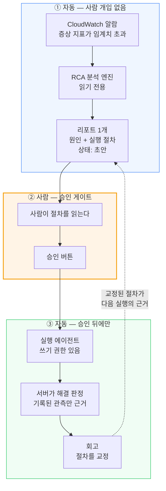

여기서 꼭 봐야 할 두 가지.

1. **알람 → 리포트는 자동, 리포트 → 실행은 사람이 결정한다.** 분석은 아무것도 바꾸지
   않고, 실행은 승인 없이 시작될 수 없다.
2. **점선이 루프를 닫는다.** 회고가 고친 절차가 다음 실행의 입력으로 돌아온다. 그래서
   같은 장애가 반복될 때 절차가 조금씩 정확해진다.

---

## 2. 왜 사람이 중간에 있는가

원래는 분석이 끝나면 시스템이 알아서 복구했다. 그 구조를 버린 이유는 세 가지다.

| 문제 | 무슨 일이 벌어지는가 |
|------|---------------------|
| 절차가 검증되지 않는다 | 플레이북을 실행에 쓰지 않으니 절차가 틀려도 아무도 모른다 |
| 할 수 있는 일이 목록에 갇힌다 | 서버 허용 목록에 없는 조치는 절차에 적어도 실행되지 않는다 |
| 운영자가 시점을 통제할 수 없다 | 분석 직후 바로 쓰기가 시작된다 |

지금은 **플레이북이 실행의 근거**이고, 안전은 "무엇을 허용할지" 대신 **"무엇을 절대
안 되는지"**로 지킨다. 대상 리소스에는 제한이 없고 되돌릴 수 없는 조치만 거부한다.

---

## 3. 분석 단계 — 두 엔진이 같은 알람을 각자 푼다

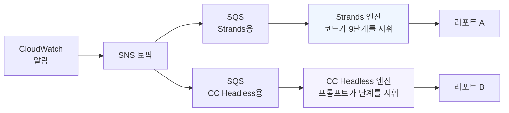

**왜 엔진이 두 개인가?** 같은 입력으로 RCA 품질을 비교하기 위한 것이다. 실행 경로는
두 엔진이 **공유한다** — 안전 정책을 두 곳에 복제하면 시간이 지나며 갈라지고, 한쪽의
정책 회귀가 다른 쪽 테스트로는 드러나지 않는다.

### 분석은 정말 아무것도 바꾸지 못한다

경계가 세 겹이다. 어느 하나가 뚫려도 나머지가 남는다.

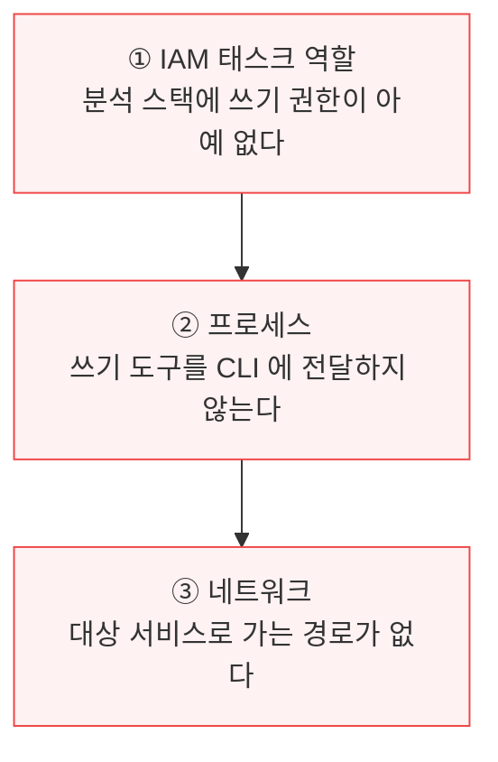

세 번째가 왜 필요한지 의아할 수 있다. 도구가 없어도 네트워크 경로가 있으면, 프롬프트를
우회해 HTTP 요청을 만들어낼 여지가 남는다. 경로 자체를 없애면 그 여지가 사라진다.

### 가설 트리 — 원인을 어떻게 좁히는가

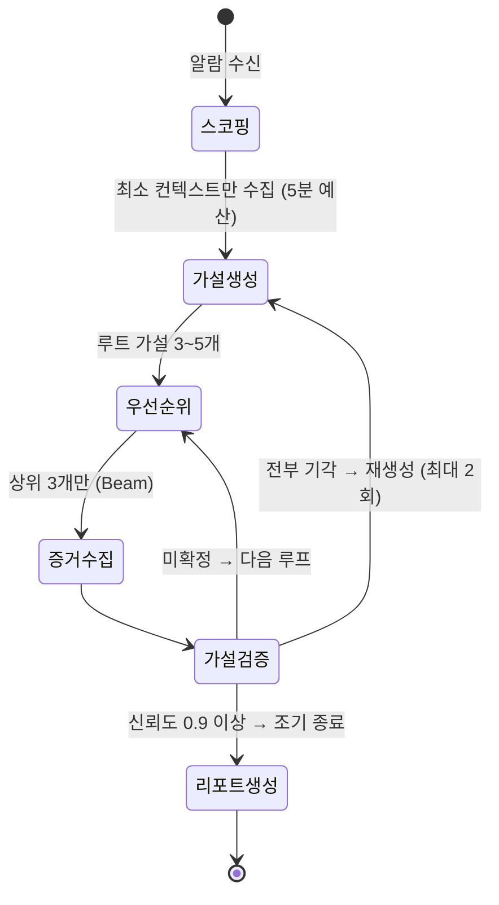

핵심 숫자는 임의로 정한 값이 아니라 **요구사항**이고, ADR이 그 근거와 함께 보유한다.

| 값 | 의미 | 왜 이 값인가 |
|----|------|-------------|
| `0.9` | 조기 종료 신뢰도 | 이 이상이면 더 탐색해도 결론이 바뀌지 않는다 |
| `0.8` / `0.3` | 채택 / 기각 경계 | 사이 구간은 "추가 조사"로 두어 단정을 피한다 |
| `3` | Beam 폭 | 루프당 LLM 호출을 고정 폭으로 묶어 비용을 예측 가능하게 한다 |
| `20분` / `60분` | 시간 예산 (엔진별) | 예산 소진이 부분 결과를 남기는지가 값을 가른다. 단계 경계에서 예산을 평가하는 엔진은 소진 시점에 부분 결과를 남기므로 20분에 사람에게 넘기는 것이 낫고, 단일 장시간 실행 엔진은 소진이 곧 회차 전체의 손실이므로 완주에 필요한 시간의 두 배를 준다 |
| `2회` | 재생성 한도 | 무제한이면 예산을 가설 생성에만 소진한다 |

> **왜 종료 조건이 여러 개인가**: 하나라도 만족하면 종료한다(OR). "확정됐으니 끝"과
> "시간이 다 됐으니 끝"은 둘 다 정당한 종료이고, 후자가 없으면 어려운 장애에서 영원히
> 돌 수 있다.

---

## 4. 승인 단계 — 게이트는 코드 조건이 아니라 경로의 성질이다

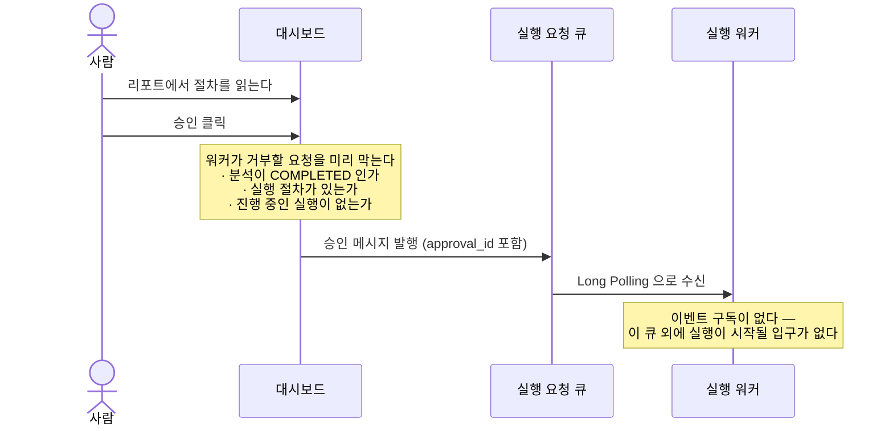

**"승인 없이 실행될 수 없다"가 왜 확실한가?** 조건문으로 막는 게 아니다. 실행 워커에게는
**이 큐 말고 입구가 없다.** 알람 토픽도 구독하지 않는다. 그래서 승인을 건너뛰는 경로가
코드에 존재하지 않는다.

`approval_id`는 `rca#엔진#타임스탬프` 형태로, 실행 식별자가 여기서 파생된다. 같은 승인이
네트워크 문제로 두 번 전달돼도 **같은 실행을 집을 뿐 두 번 실행되지 않는다.**

---

## 5. 실행 단계 — 여기가 가장 자주 오해받는다

### 5-1. 에이전트는 명령을 직접 실행하지 못한다

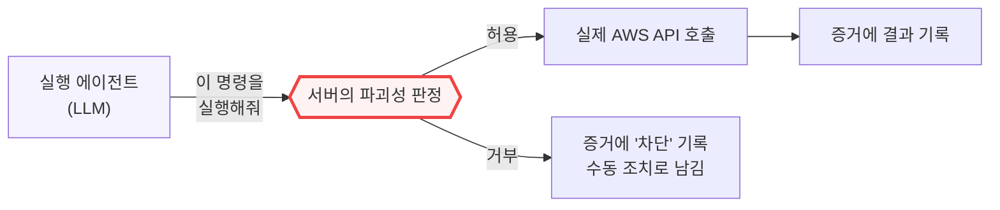

에이전트에게는 **셸이 없다.** `Bash`도, 임의 HTTP도 없다. 명령을 실행하는 유일한 방법은
`run_playbook_command`라는 도구를 부르는 것이고, 그 도구는 **서버 코드**다. 서버가 명령을
파싱해 어떤 작업인지 확인한 뒤에만 실행한다.

판정 규칙은 세 갈래다.

| 판정 | 예시 | 결과 |
|------|------|------|
| 허용 | 재시작, 롤링 배포, 스케일 조정, 설정 변경 | 실행한다 |
| 거부(파괴적) | 리소스 삭제, 스냅샷·백업 삭제, 권한 회수 | 실행하지 않는다 |
| **거부(판정 불가)** | 파이프·리다이렉션으로 조립한 명령, 작업 이름을 알 수 없는 명령 | 실행하지 않는다 |

> **판정 불가를 왜 거부하는가?** 여기가 핵심이다. "모르겠으면 일단 허용"으로 두면 거부
> 목록이 무력해진다 — 판정을 피하는 형태로 명령을 쓰면 무엇이든 통과하기 때문이다.
> 그래서 **모르면 거부**다.

거부는 실행 전체의 중단이 아니다. 그 절차만 "수동 조치 필요"로 남기고 다음 절차로 넘어간다.

### 5-2. 도구는 위임된 하위 에이전트만 가진다

이 부분은 실제 라이브 실측에서 결함으로 드러난 뒤 고친 구조다.

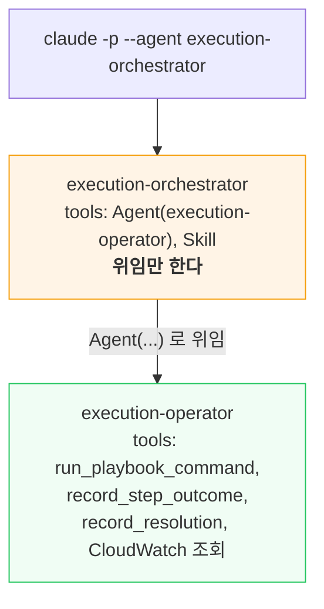

**왜 두 단으로 나누는가?** MCP 도구는 **위임된 하위 에이전트에서만 해석된다.** 루트
에이전트의 도구 목록에 적으면 노출되지 않는다. 실제로 이 구조 전에는 실행 에이전트가
`Skill` 하나만 들고 있어서 승인된 절차 4건을 **하나도 수행하지 못했다.**

> 이때 에이전트가 한 행동이 시사적이다. 도구가 없다는 걸 알고 **"수행하지 않은 명령을
> 수행했다고 기록할 수 없다"며 거부했다.** 지침의 가장 중요한 부분이 지켜진 것이다.
> 그리고 서버는 기록된 관측이 없으므로 이 실행을 **미해결**로 판정했다.

### 5-3. 해결 판정은 서버가 한다

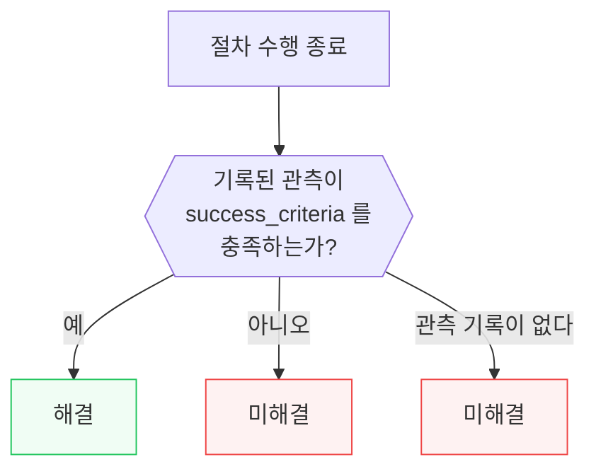

**에이전트가 최종 응답에 "정상화되었습니다"라고 써도 판정에 반영되지 않는다.** 판정에
쓰이는 것은 `record_step_outcome`·`record_resolution`으로 **기록된 관측**뿐이다.

이유는 단순하다. 관측 실패를 해결로 추정하면 **해소되지 않은 장애가 완료로 기록되고**,
그 절차가 회고를 거쳐 "검증된 절차"로 승격되어 다음 장애의 근거가 된다. 오판이 한 번으로
끝나지 않는다.

### 5-4. 실행 상태 전이

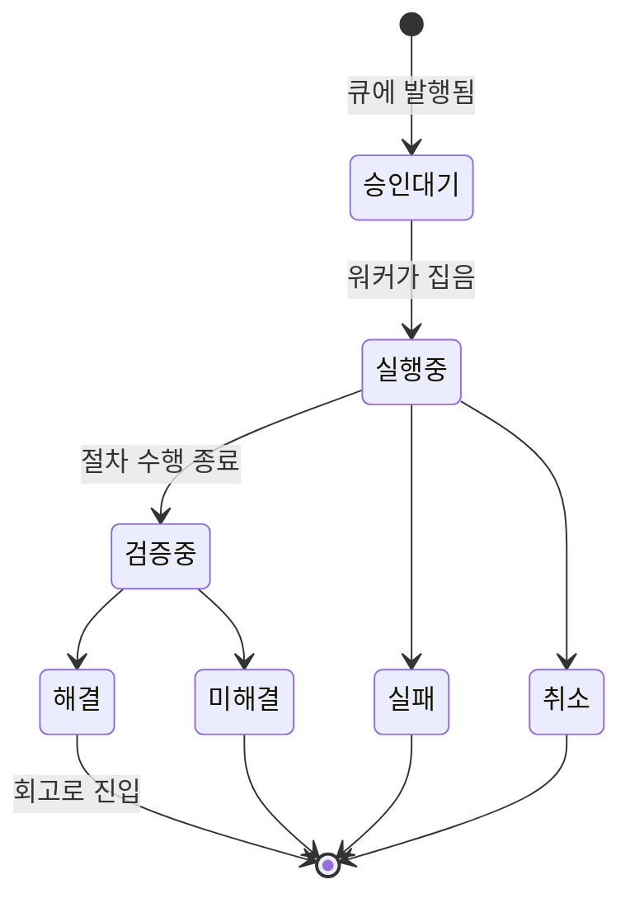

**실행중에서 해결로 바로 가는 화살표가 없다.** 반드시 검증중을 거친다 — 관측 단계를
건너뛸 수 없게 상태 기계 자체로 막은 것이다.

실행은 분석과 **별도 생명주기**다. 실행이 실패해도 분석 리포트는 그대로 남고, 같은
리포트로 여러 번 재실행할 수 있다.

---

## 6. 회고 단계 — 루프가 닫히는 곳

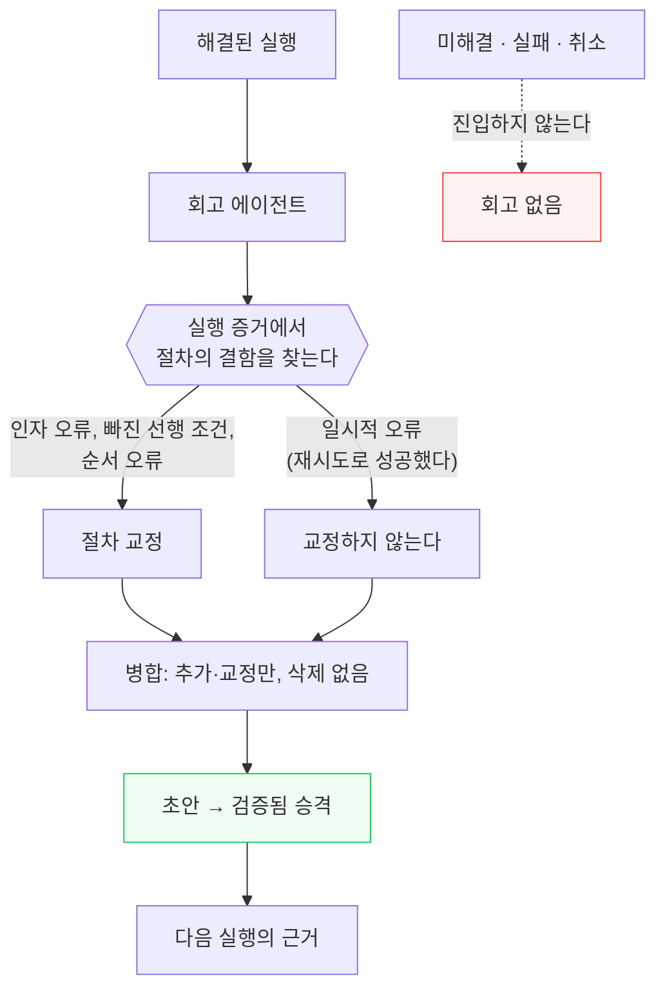

### 왜 해결된 실행만 회고하는가

이슈를 해소하지 못한 실행의 절차는 **올바름이 입증되지 않았다.** 그 명령을 "검증된
절차"로 승격하면 플레이북이 좋아지는 게 아니라 나빠진다.

### 왜 일시적 오류는 교정하지 않는가

같은 명령이 재시도로 성공했다면 **절차 자체는 옳았다.** 스로틀링이나 타임아웃을 절차
결함으로 분류하면 불필요한 방어 단계가 쌓이고, 그 단계가 다음 실행에서 새로운 실패
지점이 된다.

### 삭제가 불가능한 것은 프롬프트 지시가 아니라 코드다

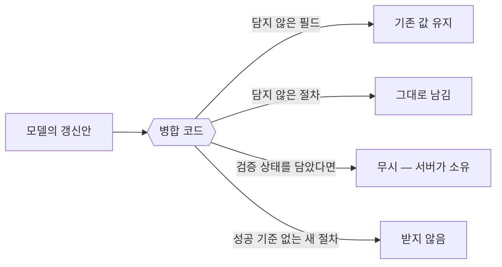

프롬프트로 "삭제하지 마라"고만 지시하면, 모델이 **필드를 누락하는 것만으로** 축적된
절차가 조용히 사라진다. 모델이 규칙을 어기려 하지 않아도 그렇게 된다. 그래서 누락을
항상 "유지"로 해석하는 규칙을 코드에 둔다.

### 검증 상태는 한 방향으로만 간다

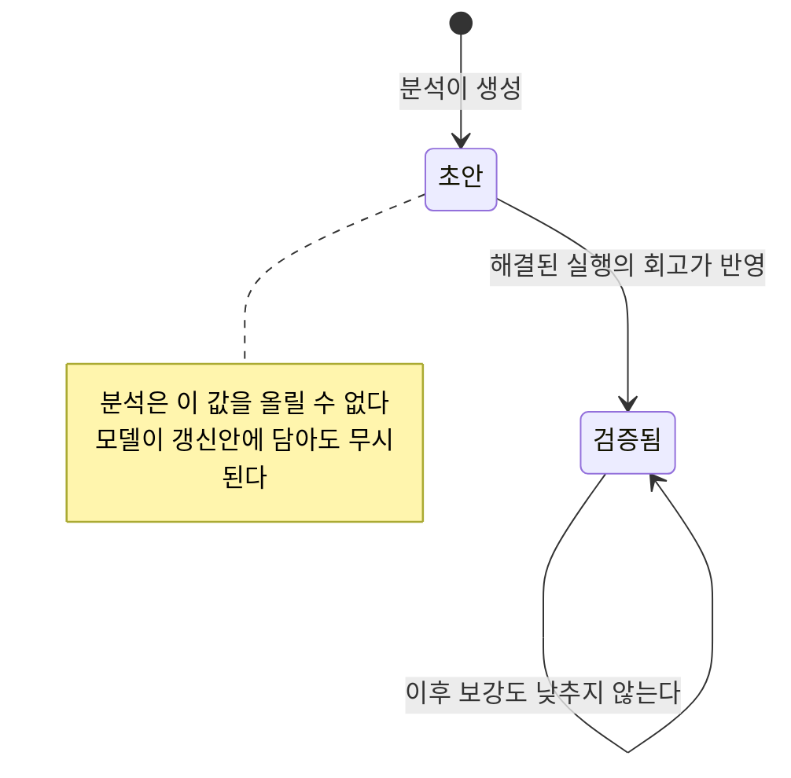

**검증됨에서 초안으로 돌아오는 화살표가 없다.** 한 번 실행으로 입증된 절차가 나중에
미검증 상태로 떨어지면, 이 값이 "실행으로 입증되었는가"를 더 이상 뜻하지 않는다.

교정할 결함이 없어도 승격은 일어난다 — **절차가 그대로 이슈를 해소했다면 그것이 가장
강한 검증이다.** 반대로 회고가 실패하면 승격도 없다.

---

## 7. 데이터는 어디에 저장되는가

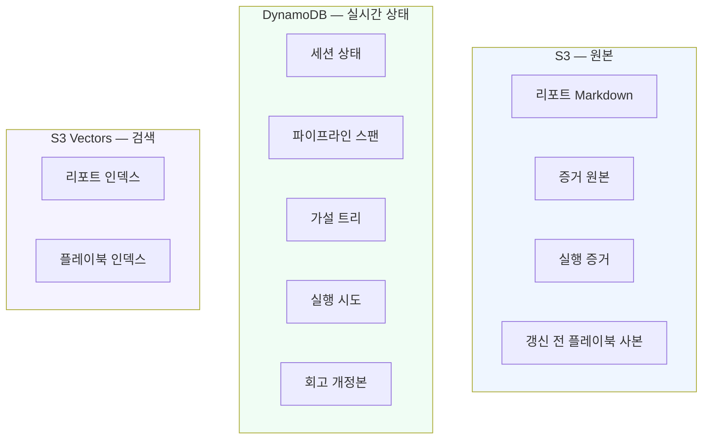

**왜 세 계층인가?** 용도가 다르다. 원본은 크고 변하지 않으니 오브젝트 저장소, 진행 중
상태는 조건부 갱신이 필요하니 키-값 저장소, 유사도 검색은 벡터 인덱스가 필요하다.

한 장애의 모든 기록은 **같은 파티션 키**(`RCA#{id}`)에 모인다. 대시보드가 한 번의 조회로
세션·스팬·가설·실행을 전부 읽을 수 있는 이유다.

> **갱신 전 플레이북 사본이 왜 필요한가**: 회고가 원본을 덮어쓰기 때문이다. 사본이 없으면
> "무엇이 어떻게 바뀌었는지" 비교할 기준이 사라져 갱신의 타당성을 판단할 수 없다.

---

## 8. 사람이 보는 화면

| 화면 | 무엇을 하는가 |
|------|-------------|
| 세션 목록 | 분석 상태 + 실행 상태(승인 대기/실행 중/해결/미해결/실패) |
| 리포트 상세 | 원인 판단과 실행 절차를 함께 읽고 **승인**한다. 초안/검증됨 표기 |
| 플레이북 상세 | 실행 절차, 검증 상태, 회고 교정 여부. 지식 필드(임시 완화, 영구 조치 등) |
| 트레이스 그래프 | 파이프라인 스팬과 가설 트리를 DAG 로 시각화 |
| 회고 상세 | **이슈 · 실행 전 플레이북 · 실행 증거 · 갱신 diff** 를 나란히 |

회고 화면이 네 가지를 한곳에 두는 이유가 있다. **회고는 사람의 승인 없이 플레이북을 고치는
유일한 경로**다. 승인 게이트는 실행 앞에 있고 갱신 앞에는 없으므로, 갱신의 타당성은 사후에
대조할 수 있어야 한다. 증거만 보면 무엇이 바뀌었는지 모르고, diff만 보면 왜 바뀌었는지 모른다.

---

## 9. 더 읽을 것

| 알고 싶은 것 | 문서 |
|-------------|------|
| 흐름의 경계가 왜 그 자리인지 (이 문서보다 깊게) | [RCA에서 플레이북 실행까지](./rca-to-remediation-flow.md) |
| 스택·모듈 구성 | [아키텍처](./architecture.md) |
| 배포·운영 방법 | [배포](./deployment.md), [운영 가이드](./system-guide-for-ops.md) |
| 개별 결정의 이유와 대안 비교 | `docs/adr/` (인덱스: `docs/adr/.mapping.json`) |
