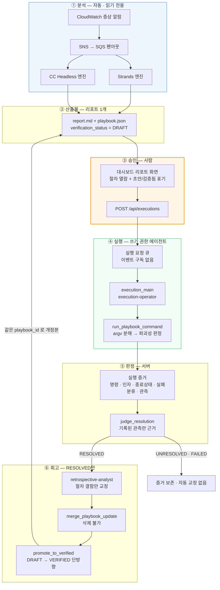

# RCA → 복구 루프 현황 점검 — 의도한 설계와 코드의 대조

- 점검일: 2026-08-01
- 점검 기준 커밋: `14137e4`
- 범위: `docs/adr/`, `packages/agent`, `packages/cc-headless`, `packages/infra`, `packages/dashboard`
- **상태 (2026-08-01)**: 갭 A·B·C 수정 완료(§4), 라이브 E2E에서 승인 이후 구간 전부 성립,
  검색 경로의 두 결함을 추가 발견해 수정(§6). **개정본 우선 조회와 CC 병합은 라이브
  재실측 대기.**

> **점검 후 정정 두 번**. 최초 작성 시 갭을 A·B 둘로 봤으나 수정에 착수하며 세 번째
> 갭(**갭 C**)을 찾았고, 그것이 루프가 열린 실제 원인이었다 — 회고 개정본을 **어느 엔진도**
> 읽지 않았다. 갭 B만 고치면 그 결함을 두 번째 경로로 복제하므로 순서를 C → A → B 로 잡았다.
>
> 그 뒤 라이브 E2E가 **또 두 개**를 드러냈다(§6). 검색과 저장이 다른 필드를 임베딩했고,
> 임계값 0.86이 같은 장애의 재발조차 통과시키지 못했다. 둘 다 실패가 빈 검색 결과로 나타나
> 정상적인 신규 생성과 구별되지 않았고, 그래서 오프라인 테스트도 로그도 잡지 못했다.
> **라이브 실측이 없었다면 세 갭을 다 고쳤다고 보고했을 것이다.**

## 이 문서의 목적

"RCA → 리포트 1개(플레이북 포함) → 사용자 승인 → 별도 권한 에이전트가 실행 → 해결 판정
→ 회고가 절차 교정 → 대시보드에서 이슈·플레이북·증거·diff 대조" 라는 **의도한 설계**를
기준으로, 현재 코드가 그 설계를 어디까지 구현했고 어디가 비었는지 항목별로 대조한다.

결론부터: **의도한 흐름은 이미 ADR로 결정되어 있었고 코드도 대부분 그 결정을 구현하고
있었다.** 실행이 불명확하게 느껴진 원인은 설계 부재가 아니라, **갭 3건**이 흐름의 세
지점에서 루프를 끊어 놓은 데 있었다. 그 셋을 §4에서 고쳤다.

가장 큰 것은 갭 C였다 — 회고가 절차를 교정해도 **그 교정본을 다음 분석이 읽지 않았다.**
루프의 마지막 화살표가 그려져 있지만 연결되어 있지 않은 상태였고, 검색과 병합이 정상
동작하므로 로그에도 실패로 남지 않았다.

> 흐름 자체의 서술과 각 경계의 근거는
> [RCA에서 플레이북 실행까지](./rca-to-remediation-flow.md)와
> [이 시스템은 어떻게 동작하는가](./how-it-works.md)가 보유한다. 이 문서는 그 문서들이
> 서술한 것과 코드가 실제로 하는 것의 **차이만** 다룬다.

---

## 1. 요약 — 의도 대비 구현 상태

| # | 의도한 설계 | 결정 기록 | 점검 시점 | 현재 |
|---|-------------|-----------|-----------|------|
| 1 | RCA 후 분석 리포트가 **1개** 나온다 | agent/0007 | ✅ | ✅ |
| 2 | 그 리포트가 **플레이북을 포함**한다 | agent/0007, 0008 | ⚠️ 갭 A — Strands 분리 | ✅ 수정 |
| 3 | 기존 플레이북이 있으면 **참조해서** 만든다 | agent/0008 | ⚠️ 갭 B — CC 미구현 | ✅ 수정 |
| 3b | 참조 대상이 **회고가 교정한 절차**여야 한다 | agent/0008, 0018 | ⚠️ **갭 C** — 양쪽 원본만 읽음 | ✅ 수정 |
| 4 | 사용자가 대시보드에서 **명시적으로** 실행 | agent/0017, infra/0008 | ✅ | ✅ |
| 5 | 실행은 **별도 권한 에이전트**가 한다 | agent/0017, infra/0008 | ✅ | ✅ |
| 6 | 실행 에이전트가 해소를 **보고 있다가** 완료로 갱신 | agent/0017 | ✅ 판정 권위는 서버 | ✅ |
| 7 | 실패한 명령·에러를 **종합해 보유** | infra/0002, 0005 | ✅ | ✅ |
| 8 | 같은 실수를 반복하지 않도록 **회고가 플레이북 갱신** | agent/0018 | ✅ | ✅ |
| 9 | 회고에서 **이슈·플레이북·증거·diff** 4종 대조 | agent/0018 | ✅ | ✅ |
| 10 | 기본 모델을 **Sonnet 5**로 | agent/0010 | ✅ 이미 완료 | ✅ |

**ADR 본문은 갭 C 한 곳만 수정했다.** 요청한 흐름은 이미 ADR 0007·0008·0017·0018과
infra/0002·0005·0008이 결정으로 보유하고 있었고, 갭 A·B는 ADR이 결정한 바를 코드가
따라오지 못한 것이므로 코드만 고쳤다. 갭 C는 달랐다 — ADR 0008이 "상세를 로드한다"까지만
쓰고 **어떤 상세인지**를 비워 두었기에, 코드가 분석 원본을 읽어도 ADR 위반이 아니었다.
결정의 공백이므로 ADR을 먼저 고쳤다.

---

## 2. 현재 동작하는 전체 흐름



---

## 3. 항목별 대조

### 3.1 리포트가 1개 나오는가 — ✅

두 엔진 모두 분석을 리포트 하나로 끝내고 멈춘다. 분석 완료 알림은 사람과 대시보드만
수신하며 어떤 기계 동작도 트리거하지 않는다(ADR agent/0009).

- CC: `packages/cc-headless/src/cc_headless/services/pipeline.py:240` 이후 —
  `validate_completion_artifacts` 통과 → 플레이북 저장 → 리포트 저장 → 알림 → 완료
- Strands: `packages/agent/src/rca_agent/services/pipeline.py:1071` 이후 — 리포트 저장 →
  플레이북 생성 → 알림 → 완료

### 3.2 리포트가 플레이북을 포함하는가 — ⚠️ 갭 A

**CC Headless는 계약으로 강제한다.** `report.md`의 `## 대응 플레이북` 서술과
`playbook.json`의 `execution_steps`가 **같은 `step_id`를 같은 순서로** 담는지 완료 게이트가
검사하고, 어긋나면 저장을 거부한다
(`packages/cc-headless/src/cc_headless/services/artifact_validation.py:383` 이후).

**Strands는 이 계약이 없다.** 리포트 마크다운 렌더러가 `RcaReport` 필드만 직렬화하고
`execution_steps`를 렌더하지 않는다
(`packages/agent/src/rca_agent/adapters/secondary/report/s3_report_store.py:154`,
`RcaReport` DTO는 `packages/agent/src/rca_agent/ports/dto/models.py:280`).

결과적으로 Strands 세션에서는:

- 리포트를 저장한 **뒤에** 플레이북을 만든다 → 리포트가 플레이북을 참조할 수 없다.
- 사람이 리포트 본문에서 승인할 절차를 읽을 수 없고, 대시보드가 플레이북을 별도 API로
  따로 불러와 나란히 보여주는 것으로 메꾼다.
- **승인한 서술과 실행할 구조의 일치가 보증되지 않는다** — ADR agent/0007이 두 표현의
  일치를 저장 조건으로 둔 이유가 여기서 무력화된다.

> 이 갭은 데모 실측에서도 드러났다. Strands가 전 가설을 기각하면 `execution_steps: 0`인
> 리포트가 나오고, 승인 대상 확보가 실측의 병목이 된다
> ([라이브 E2E 런북](./execution-live-e2e-runbook.md) 1장).

### 3.3 기존 플레이북을 참조해서 만드는가 — ⚠️ 갭 B

**Strands는 Search-First로 구현되어 있다.** 유사도 0.86 이상의 기존 플레이북을 찾고,
상세를 로드해 보강 여부를 판단하고, 보강 시 **같은 `playbook_id`를 유지**한다. 상세 로드가
실패하면 병합을 포기하고 신규 생성으로 떨어진다
(`packages/agent/src/rca_agent/services/playbook_gen.py:176` 이후).

**CC Headless에는 이 경로가 없다.** 플레이북 스토어 포트가 두 메서드만 노출한다:

```
# packages/cc-headless/src/cc_headless/ports/interfaces/playbook_store.py
load_playbook(artifact_dir)          # 산출물 파일 읽기
save_to_s3_vectors(playbook, ...)    # 인덱스에 쓰기
```

`search_similar`도 `load_detail`도 없고, Report 전문 에이전트에게 기존 플레이북을 전달하는
도구도 프롬프트도 없다. 즉 **CC 엔진은 같은 증상이 재발할 때마다 플레이북을 새로
만든다.** 새 `playbook_id`가 생기므로 축적이 갈라지고, 회고가 쌓아 온 검증된 절차가 다음
분석에서 참조되지 않는다.

이것이 루프를 끊는 지점이다. 회고는 개정본과 인덱스 양쪽을 갱신하지만
(`execution_pipeline.py`의 `_publish_playbook`), CC 분석이 인덱스를 **읽지 않으므로**
승격된 절차가 CC 경로에서는 다음 분석으로 돌아오지 않는다.

### 3.4 사용자가 명시적으로 실행하는가 — ✅

승인 게이트가 코드 조건이 아니라 **경로의 성질**로 서 있다.

- 실행 스택에 SNS 구독도 이벤트 규칙도 없고, 유일한 입구가 대시보드만 발행하는 큐다
  (`packages/infra/lib/stacks/playbook-execution-stack.ts`).
- 워커가 메시지에 `AlarmName`이나 `Trigger`가 있으면 실행 요청으로 해석하지 않는다
  (`services/execution_request.py`).
- 승인 API가 분석 세션이 `COMPLETED`가 아니면 거부하고, 실행 식별자를 요청 내용에서
  결정론적으로 파생해 재전달 중복을 claim으로 걸러낸다.
- 대시보드가 절차가 **초안인지 검증됨인지** 표기해 승인 판단의 근거로 삼게 한다
  (`packages/dashboard/app/pages/report/[id].vue:245`).

### 3.5 별도 권한 에이전트가 실행하는가 — ✅

| | 분석 | 실행 |
|---|------|------|
| 진입점 | `main.py` | `python -m cc_headless.execution_main` |
| 이벤트 구독 | 있음(알람) | **없음** |
| 쓰기 권한 | 없음 | 있음 — 시스템에서 유일한 쓰기 태스크 역할 |
| 하네스 | `.claude/` (읽기 전용 도구) | `.claude-execution/` (쓰기 도구) |

같은 컨테이너 이미지를 다른 진입점으로 실행하므로 실행 도구와 분석 도구가 같은 프로세스에
들어가는 일이 없다. 하네스 계약 테스트가 쓰기 도구의 혼입을 막는다
(`packages/cc-headless/tests/test_execution_harness_contracts.py`).

실행 에이전트의 쓰기 경로는 세 도구뿐이다 — `run_playbook_command`,
`record_step_outcome`, `record_resolution`. Bash도 임의 HTTP도 없고, 명령은 서버가 argv로
분해해 파괴성을 판정한 뒤에만 실행된다
(`packages/cc-headless/src/cc_headless/adapters/secondary/cc/cc_execution_runner.py:52` 이후,
판정은 `services/command_gate.py`).

### 3.6 해소를 보고 있다가 완료로 갱신하는가 — ✅ (판정 주체는 서버)

요청한 "실행 에이전트가 이슈 해결 여부를 보고 있다가 상태를 완료로 갱신"은
**에이전트가 관측하고, 서버가 판정한다**로 구현되어 있다. 에이전트는
`record_step_outcome`·`record_resolution`으로 관측을 기록하고, 상태 확정은
`judge_resolution`이 한다(`services/execution_outcome.py`).

해결로 전이하는 조건 셋이 모두 성립할 때만 `RESOLVED`다.

1. 실행 에이전트가 정상 종료했다.
2. 해소가 관측으로 확인되었다.
3. 시도된 절차 중 성공 기준 미달도, 관측 없는 것도 없다.

**관측 기록이 아예 없으면 `UNRESOLVED`다.** 모델이 "정상화되었습니다"라고 서술하는 것은
판정에 들어가지 않는다 — 이것을 근거로 삼으면 해소되지 않은 장애가 완료로 기록되고, 그
절차가 회고를 거쳐 검증됨으로 승격된다. 상태 기계에도 `EXECUTING → RESOLVED` 직접 전이가
없어 반드시 `VERIFYING`을 거친다.

### 3.7 실패한 명령과 에러를 종합해 보유하는가 — ✅

증거가 명령 단위로 누적되고, 절차 목록을 **플레이북 기준으로** 조립하므로 에이전트가
언급하지 않은 절차도 증거에 나타난다(시도되지 않은 절차가 조용히 사라지지 않는다).

| 기록 | 회고에서 쓰이는 방식 |
|------|---------------------|
| `step_id` | 교정을 붙일 위치 |
| 명령과 인자 | 잘못 부른 인자 특정 |
| 종료 상태·오류 출력 | 실패 분류의 근거 |
| 실패 분류 | 인자 오류 / 권한 부족 / 리소스 부재 / 일시 오류 / 거부 |
| 재시도·교정 내역 | 무엇으로 바꿔 성공했는지 = 절차에 넣을 정답 |
| 관측 결과 | 해결 판정의 유일한 근거 |

실패한 실행에서도 증거는 보존되고, 자격 증명으로 보이는 인자는 가린다(`redact`).
주 보관소는 S3, DynamoDB에는 요약만 둔다.

### 3.8 회고가 같은 실수를 막도록 플레이북을 갱신하는가 — ✅

**교정 대상은 절차의 결함으로 환원되는 실패뿐이다.** 잘못된 인자, 누락된 인자, 빠진 선행
조건, 순서 오류, 해결 확정에 필요했던 검증 절차. `failure_class`가
`TRANSIENT`·`THROTTLED`·`TIMEOUT`·`UNKNOWN`인 실패는 교정하지 않는다 — 재시도로 성공했다면
절차 자체는 옳았고, 일시 실패를 절차 결함으로 처리하면 불필요한 우회가 쌓인다.

**삭제 불가는 프롬프트 지시가 아니라 병합 코드의 성질이다**
(`services/playbook_merge.py`).

- 갱신안이 담지 않은 필드는 기존 값 유지
- 갱신안에 없는 절차는 그대로 남음
- `step_id`와 순서는 살아남고 새 절차는 뒤에 붙음
- 관측 가능한 성공 기준이 없는 새 절차는 거부
- 갱신안을 해석할 수 없으면 아무것도 바꾸지 않음

**승격은 단방향이다.** `DRAFT → VERIFIED`만 있고 되돌아오지 않으며, 이 값은 서버가
소유한다 — 회고 모델이 갱신안에 담아도 병합이 버린다. 교정할 결함이 없어 갱신이 비어
있어도 승격은 일어난다(절차가 그대로 이슈를 해소한 것이 가장 강한 검증).

실행 시작 시점에 **갱신 전 플레이북 사본을 S3에 보존**한다 — 회고가 원본을 덮어쓰므로
사본이 없으면 diff의 기준이 사라진다.

`UNRESOLVED`·`FAILED`·`CANCELLED`는 회고에 들어가지 않는다. 이슈를 해소하지 못한 절차는
올바름이 입증되지 않았고, 그 증거로 절차를 고치면 근거가 "이렇게 했더니 해결되지 않았다"가
된다. 증거는 보존되고 사람이 읽을 수 있다 — **자동으로 고치지 않는다**는 뜻이지 버린다는
뜻이 아니다.

### 3.9 이슈·플레이북·증거·diff 4종을 대조할 수 있는가 — ✅

전용 화면이 있고, API가 네 가지를 한 응답으로 조립한다
(`packages/dashboard/server/api/retrospectives/[rcaId]/[executionId].get.ts` →
`packages/dashboard/app/pages/retrospective/[rcaId]/[executionId].vue`).

| # | 내용 | 출처 |
|---|------|------|
| 1 | 이슈 | 세션 아이템 — 알람명, 근본원인, 확정 여부, 엔진 |
| 2 | 실행 전 플레이북 | 실행 시작 시점 S3 스냅샷 |
| 3 | 실행 증거 | 절차별 시도·명령·인자·오류·관측 |
| 4 | 갱신 diff | 교정된 절차의 필드별 before/after + 추가 절차 + 근거 |

`playbookAfter`(개정본)도 함께 반환한다. 진입 경로는 세션 목록의 "회고 반영" 배지
(`app/pages/index.vue:434`)와 리포트 상세의 실행 이력
(`app/pages/report/[id].vue:357`) 두 곳이다.

정리된 객체가 있으면 그 칸만 비워 보여주고 요청 전체를 실패시키지 않는다 — 네 가지 중
하나가 없다는 사실 자체가 사람이 알아야 할 정보다.

### 3.10 기본 모델이 Sonnet 5인가 — ✅ 이미 완료

**변경할 것이 없다.** 두 엔진 모두 이미 Sonnet 5 세대를 기본값으로 쓴다.

| 대상 | 설정 위치 | 값 |
|------|-----------|-----|
| Strands (로컬) | `packages/agent/src/rca_agent/config/settings.py:10` | `global.anthropic.claude-sonnet-5` |
| Strands (env) | `packages/agent/env/local.env:2` | 동일 |
| CC 분석 워커 | `packages/infra/lib/stacks/cc-headless-stack.ts:122` | `ANTHROPIC_DEFAULT_SONNET_MODEL` = 동일 |
| CC 실행 워커 | `packages/infra/lib/stacks/playbook-execution-stack.ts:127` | 동일 |

`packages/agent/tests/test_agent_factory.py`가 기본값을 테스트로 고정하고 있고, ADR
agent/0010이 "기본 모델은 Claude Sonnet 5 세대"를 결정으로 보유한다. 도입 커밋은
`9030937 feat(agent,infra): move the default model to the Sonnet 5 generation`.

이 세대의 호출 표면 제약 두 가지도 코드에 반영되어 있다(`agent_factory.py`):
`temperature`를 전달하지 않고, 사고량은 adaptive 여부로만 제어하며 `effort`를 보내지
않는다. 실행 워커는 Claude Code CLI를 Bedrock으로 붙이므로(`CLAUDE_CODE_USE_BEDROCK=1`)
모델 지정이 환경변수 한 곳에 모인다.

---

## 4. 갭 3건 — 무엇이 문제였고 어떻게 고쳤는가

세 갭은 **같은 뿌리**를 갖는다. CC와 Strands가 플레이북을 다루는 층위가 다르다 — CC는
플레이북을 리포트 산출물 계약의 일부로 두고, Strands는 리포트와 별개의 파이프라인 단계로
둔다. 그래서 CC에는 리포트-플레이북 일치 검사가 있고 축적 검색이 없으며, Strands에는
축적 검색이 있고 일치 검사가 없었다. 그리고 **어느 쪽도 회고 개정본을 읽지 않았다.**

### 갭 C — 회고 개정본을 분석이 읽지 않았다 (최우선, 루프가 열린 실제 원인)

**증상**: Strands의 상세 로드가 `span_type = PLAYBOOK` 필터로 조회했다. 회고 개정본은
`SK = "{engine}#PLAYBOOK_REVISION"` 아이템이고 `span_type` 속성이 **없으므로**, 그 필터가
개정본을 구조적으로 배제했다. 검색 경로가 있어 되는 것처럼 보였지만 로드하는 것은 회고가
교정하기 **전의** 원본이었다.

**왜 문제였나**: 병합이 모든 필드를 보존해도 결과가 교정 이전으로 퇴행한다. 검색과 병합이
정상 동작하므로 로그에도 실패로 남지 않고, 같은 장애가 반복될수록 회고가 매번 같은 교정을
다시 하게 되어 축적이 제자리에 머문다. 실행 워커와 승인 화면은 이미 개정본을 현재 절차로
판별하고 있었으므로, **분석 경로만 다른 문서를 읽는** 상태였다.

**고친 내용**:

- 상세 조회가 회고 개정본을 우선 조회하고, 없을 때만 분석 스팬으로 떨어진다. 파티션 쿼리
  한 번으로 둘을 함께 읽으므로 조회 횟수는 늘지 않는다.
- 개정본을 해석할 수 없으면 원본으로 떨어진다 — 그것을 병합 포기 사유로 삼으면 아직 병합
  가능한 플레이북이 버려지고 같은 유형이 새 식별자로 다시 생성된다.
- 벡터 인덱스 메타데이터에 `verification_status`를 담아, 상세를 로드하지 않고도 검색
  결과에서 승격 여부가 보인다. ADR 0008 결정사항 4의 "최소 필드"에 이 값을 포함시켰다.
- ADR 0008에 "보강 대상 상세는 회고 개정본 우선"을 명시하고 decision-log에 기록했다.

**고정한 계약**: 개정본 우선, 승격이 재로드를 견딤, 개정본 없으면 원본으로 폴백, 해석 불가
시 폴백, 다른 플레이북의 개정본은 무시.

### 갭 A — Strands 리포트가 실행 절차를 담지 않았다

**증상**: 리포트 마크다운에 `## 대응 플레이북` 섹션이 없었고, 리포트를 저장한 **뒤에**
플레이북을 만들었다. 승인 화면이 리포트 본문과 별도 API의 플레이북을 나란히 놓는 것으로
메꾸고 있었으며, 두 표현의 `step_id` 일치가 저장 조건으로 검사되지 않았다.

**왜 문제였나**: 사람은 서술을 보고 승인하는데 실행은 구조를 따라간다. 승인한 내용과
실행한 내용이 다르면 승인 게이트는 형식만 남는다.

**고친 내용**:

- 파이프라인 순서를 반전했다 — 플레이북을 먼저 만들고 리포트에 담는다. 순서가 반대면
  리포트는 자신이 담아야 할 절차를 모르는 상태로 확정된다.
- 리포트 저장에 플레이북을 **필수 인자**로 요구한다. 선택 인자로 두면 절차 없는 리포트가
  승인 버튼 뒤에 놓이는 경로가 남는다.
- 렌더러가 `## 대응 플레이북` 섹션에 각 절차의 `step_id`·의도·작업·성공 기준을 쓰고,
  초안임을 본문에 고정 표기한다.
- 확정 원인이 없으면 절차 대신 "왜 절차를 만들지 않았는지"를 쓴다.
- `step_id` 집합과 **순서**가 두 표현에서 같은지 검사하고, 어긋나면 저장을 거부한다.
- 프로덕션 호출처가 없던 중복 렌더러·저장 함수(`services/report.py`)를 제거했다. 남겨
  두면 일치 검사를 우회해 플레이북 없는 리포트를 쓰는 경로가 된다.

### 갭 B — CC 분석이 기존 플레이북을 참조하지 않았다

**증상**: CC의 플레이북 스토어 포트에 `search_similar`도 `load_detail`도 없었다. 같은
증상이 재발하면 매번 새 `playbook_id`가 생겨 축적이 갈라졌다.

**고친 내용**:

- 포트에 `search_similar(query_text, *, threshold)`와 `load_detail(match)`을 추가했다.
  상세 조회는 갭 C와 같은 우선순위(개정본 우선)를 따른다.
- 병합 임계값은 ADR이 고정한 **0.86**을 쓴다. 일반 조회보다 엄격한 이유는 다른 유형의
  장애를 같은 플레이북으로 병합하면 절차가 뒤섞여 어느 쪽에도 쓸 수 없어지기 때문이다.
- **임베딩 템플릿을 두 엔진이 공유한다.** 한쪽이 필드를 다르게 자르거나 라벨을 다르게
  붙이면 임베딩 공간이 갈라져 같은 증상의 플레이북이 서로를 찾지 못한다.
- 저장과 검색의 **입력 유형을 분리했다**(`search_document` / `search_query`). 한 유형으로
  양쪽을 처리하면 같은 장애의 저장 벡터와 검색 벡터가 어긋나 유사도가 낮게 나온다.
- 병합은 회고가 쓰는 `merge_playbook_update`를 재사용한다 — 삭제 불가 규칙이 이미 코드에
  있으므로 분석 보강에도 같은 규칙이 적용된다.
- 상세를 읽지 못한 후보는 병합 대상에서 **제외**하고 신규 생성으로 떨어진다.
- 병합 결과의 `playbook_id`와 `verification_status`는 기존 플레이북 값을 유지한다 —
  보강 한 번이 회고의 승격을 취소하지 않게 한다.
- 검색·병합 실패는 분석을 중단시키지 않는다. 플레이북은 미래를 위한 자산이고 이번 RCA의
  결과물은 리포트다.

### 갭이 아닌 것 — 판정 주체

요청 문구는 "실행 에이전트가 해결되면 상태를 완료로 업데이트"였지만 구현은 **서버가
판정**한다. 이것은 갭이 아니라 의도된 강화이므로 그대로 두었다. 에이전트의 닫는 요약은
관측이 아니고, 그것을 근거로 삼으면 해소되지 않은 장애가 완료로 기록된 뒤 회고를 거쳐
검증된 절차로 승격된다. 잘못된 절차가 다음 장애의 근거가 되므로 오류가 한 번의 오판으로
끝나지 않는다.

---

## 5. 검증 결과

| 대상 | 결과 |
|------|------|
| `packages/agent` 테스트 | **526 passed** (기존 516 + 신규 계약 테스트) |
| `packages/cc-headless` 테스트 | **538 passed** (기존 508 + 신규 계약 테스트) |
| `packages/infra` 빌드·테스트 | **31 passed** |
| `packages/dashboard` 빌드 | 성공 |
| Ruff (두 패키지) | All checks passed |

신규 계약 테스트가 고정하는 것:

- 상세 조회가 **개정본을 우선**하고, 승격이 재로드를 견디고, 개정본이 없거나 해석 불가면
  원본으로 폴백한다 (양쪽 엔진).
- 리포트가 절차를 렌더하고, 절차가 누락되거나 **순서가 다르면 저장을 거부**한다.
- CC 병합이 기존 식별자를 유지하고, 축적된 절차와 새 분석이 언급하지 않은 필드를 보존하고,
  **획득한 검증 상태를 낮추지 않는다**.
- 상세를 읽지 못한 후보는 건너뛰고, 검색 실패가 분석을 막지 않는다.
- 저장과 검색이 **다른 입력 유형**을 쓴다.
- 검색 쿼리와 저장 텍스트가 **같은 필드**에서 나온다 (§6에서 추가).
- 임계값이 재발 시나리오의 실측 유사도(0.83) 아래에 있다 (§6에서 추가).
- 검색이 **거리를 명시적으로 요청**하고, 거리 없는 결과는 순위에 들지 않는다 (§7에서 추가).

## 6. 라이브 E2E — 무엇이 성립했고 무엇이 더 나왔는가

`cbf6fd8` 이미지로 세 워커를 재배포한 뒤 실측했다. 두 알람이 계약대로 순서대로 떴다 —
커넥션 16:56:25, 증상 16:56:35.

| 확인 항목 | 결과 |
|-----------|------|
| Strands 리포트에 `## 대응 플레이북` 5절차 + 초안 표기 | ✅ |
| 서술과 구조가 같은 `step_id`를 같은 순서로 | ✅ |
| 승인 → 실행 (`attempted=5 blocked=0 failed=0`) | ✅ |
| 서버 판정 `RESOLVED` (관측 기록 근거) | ✅ |
| 회고 → 승격 (`VERIFIED`, 같은 `playbook_id`, 인덱스 갱신) | ✅ |
| **2차 주입에서 분석이 개정본을 참조** | ❌ 검색이 후보를 못 찾음 |

실행 에이전트는 revision 36을 식별해 35로 롤백하고, 커넥션을 15→2로 줄이고, 두 알람 OK
전환까지 관측했다. 승인 이후 구간은 전부 성립했다.

### 2차 주입이 드러낸 두 결함

`load_detail`은 **호출조차 되지 않았다.** 검색이 빈 결과로 돌아왔기 때문이다. 원인을
추적해 두 가지를 찾았고, 둘 다 이번에 고쳤다.

**결함 1 — 검색과 저장이 다른 필드를 임베딩했다.** 인덱스는 플레이북의 유형·패턴을
저장하는데 검색은 보고서의 근본 원인·요약으로 쿼리했다. 앞은 재사용을 위해 일반화된
서술이고 뒤는 이번 사건의 리소스 식별자·리비전·시각을 담은 개별 서술이라, 같은 장애를
놓고도 유사도가 낮게 나왔다. 갭 B에서 CC를 위해 "저장과 검색은 같은 렌더러를 써야 한다"고
고친 것과 같은 종류의 결함이 Strands 검색 경로에 남아 있었다 — 렌더러는 같고 **넣는 필드가
달랐다.**

**결함 2 — 임계값 0.86이 재발을 통과시키지 못했다.** Cohere embed-v4 실측:

| 시나리오 | 유사도 | 0.86 | 0.80 |
|----------|--------|------|------|
| 재발: 같은 유형·표현만 다름 | 0.8332 | 미달 | 통과 |
| 재발: 동일 텍스트 | 0.9646 | 통과 | 통과 |
| 무관: CPU 폭증 | 0.5242 | 미달 | 미달 |
| 무관: 메모리 릭 | 0.4385 | 미달 | 미달 |

결함 1을 고쳐도 재발이 0.83이므로 0.86은 **같은 장애의 재발조차 병합하지 못하는 값**이었다.
0.80으로 내리면 재발은 병합되고 무관한 장애는 여전히 신규로 떨어진다 — 0.83과 0.52 사이가
넓어 임계값이 둘을 명확히 가른다.

두 결함 모두 **실패가 빈 검색 결과로 나타나** 정상적인 신규 생성과 구별되지 않았다. 그래서
오프라인 계약 테스트도, 로그도 이것을 잡지 못했다. 기존 대칭 계약 테스트는 있었지만 검사할
때 리포트를 넘기는 방식이어서 프로덕션 경로의 비대칭을 통과시켰다 — 그 테스트도 실제 경로로
고쳤다.

임계값은 ADR이 근거와 함께 기록한 요구사항 값이므로 ADR 0008을 먼저 고치고 decision-log에
기록한 뒤 코드를 맞췄다.

> 배포 전 확인: 배포된 이미지가 현재 코드인지 먼저 대조한다. 태그가 HEAD보다 앞서 있어도
> 해당 워커의 빌드 컨텍스트에 변경이 없으면 이미지 내용은 같다(런북 0장). 이번 변경은
> **양쪽 분석 워커를 모두 건드렸다.**
>
> 실측에서 `cdk.out` 잠금을 6시간 붙들고 있는 잔여 CDK 프로세스를 만났다. 스택이
> `UPDATE_COMPLETE`인지 확인한 뒤 프로세스를 종료하고 잠금 파일을 제거해야 다음 배포가
> 나간다(런북 0장).

## 7. 재실측 — 검색을 죽이고 있던 세 번째 결함

`983596357a56`으로 세 워커를 재배포하고 §6의 두 수정이 유효한지 확인했다. 검색은 **여전히
빈 결과**였다. 임계값을 다시 만지기 전에 실제 유사도를 측정한 것이 원인을 드러냈다.

**결함 3 — 거리를 요청하지 않고 거리로 유사도를 계산했다.** `query_vectors`를
`returnDistance` 없이 호출하면 응답에 `distance` 필드가 아예 없다. 코드는 없는 값을 최대
거리 `1.0`으로 읽었고, 그래서 **모든 후보의 유사도가 항상 0.0**이 됐다. 임계값이 무엇이든
통과하는 후보가 없으므로 검색은 오류 없이 조용히 빈 결과만 냈다.

인덱스를 직접 조회하면 이것이 계산 단계의 실패였음이 분명하다 — 그 회차 초안으로 질의하면
자기 자신이 `distance=0.026`(유사도 0.974)으로 1위에 오고 관련 플레이북 10개가 순서대로
나온다. **인덱스는 후보를 정확히 찾고 있었고 버려진 지점은 유사도 계산이었다.**

세 스토어가 같은 결함을 공유했다 — 플레이북 보강 검색(agent·cc-headless)과 초기 스코핑의
유사 리포트 검색이다. 기존 계약 테스트는 스텁 응답에 `distance`를 직접 넣어줘서 이 결함을
볼 수 없었다. 요청 파라미터를 검증하는 테스트와, 거리 없는 결과가 순위에 들지 않는지
확인하는 테스트를 추가했다.

> **인덱스 재적재는 불필요했다.** §6이 "옛 텍스트로 임베딩돼 검색되지 않는다"고 판단한
> 것은 이 결함이 만든 착시였다. 수정 후 기존 49개 항목이 정상적으로 검색된다.

### 세 관문 모두 라이브에서 통과

`148f934cdbbd` 배포 후 실측한 결과다.

| 관문 | 결과 | 증거 |
|------|------|------|
| 1. 검색이 후보를 찾는다 (임계값 0.80) | ✅ | 유사도 0.9411·0.9423로 두 개정본을 찾음 |
| 2. 상세 조회가 회고 개정본을 반환한다 | ✅ | `Loaded playbook 998b0903 from its retrospective revision`, 절차 `step_id`가 개정본과 일치 |
| 3. 병합이 개정본 기준이고 `VERIFIED`가 유지된다 | ✅ | `Updating playbook 998b0903 with new RCA findings`, 같은 `playbook_id`, `VERIFIED` 보존 |

**개정본 우선 조회가 인덱스의 낡은 값을 덮어쓰는 설계도 확인됐다.** `998b0903`은 인덱스
메타데이터가 `DRAFT`인데 `load_detail`이 `VERIFIED`를 돌려준다 — 승격이 개정본에는 기록됐고
인덱스에는 반영되지 않은 상태에서도 조회 경로가 옳은 값을 복원한다.

### 이 실측이 추가로 드러낸 것

**`PLAYBOOK_TOP_K=3`이 후보를 이미 놓치고 있다.** 실측 후 측정한 분포다.

| 쿼리 | 임계값 통과 | 상위 3위 안 | 밖으로 밀림 | 상위 6 |
|------|------------|-----------|-----------|--------|
| 커넥션 누수(1차 회차) | 5 | 3 | **2** | 0.974 0.885 0.840 ǀ 0.822 0.815 0.796 |
| 커넥션 누수(검증 회차) | 1 | 1 | 0 | 0.953 0.710 0.704 ǀ 0.694 0.688 0.685 |
| VERIFIED 개정본 두 건 | 각 1 | 각 1 | 0 | 0.94 뒤로 0.8 미만 |

**다만 값을 올릴 근거는 아직 약하다.** 보강은 후보를 순서대로 돌며 첫 병합에서 즉시
반환하므로, 1위가 병합되면 밀려난 후보는 어차피 쓰이지 않는다. 값을 올려 결과가 달라지는
경우는 **상위 후보가 모두 "보강 불필요"로 판정될 때**뿐이고, 그때마다 병합 검사 LLM 호출이
후보 수만큼 늘어난다. 올린다면 위 분포의 통과 개수를 담는 5가 적당하지만, 그 판정이
실제로 관측된 뒤에 옮기는 것이 맞다.

**`RESOLVED`는 회차마다 갈린다.** 이번 실측의 첫 회차는 분석이 만든 절차에 배포 롤백이
없어 앱 재시작 후 결함 플래그가 즉시 누수를 재발시켰고, 실행이 `UNRESOLVED`로 끝나 회고가
진입하지 않았다(`attempted=5 blocked=2 failed=1`). §6 실측에서 롤백이 절차에 포함돼
`RESOLVED`가 된 것과 대비된다 — 상태 기계는 정상 동작했고, 갈린 것은 분석이 절차에 롤백을
담는지였다.

CC는 이번에도 예산 소진으로 `FAILED`했다. 그 병목을 §8에서 진단해 고쳤다.

## 8. CC 예산 — 무엇이 부족했고 왜 그 값인가

CC 경로는 오프라인 계약을 전부 통과했지만 라이브에서 한 번도 완주하지 못해, 갭 B가 계속
미확인으로 남아 있었다. 로그의 시작·종료 시각을 대조해 원인을 특정했다.

| 시작 | 종료 | 소요 | 결과 |
|------|------|------|------|
| 09:26:27 | 09:50:23 | 23분 56초 | 완주 |
| 09:50:23 | — | 30분 | 예산 소진 |
| 10:20:23 | 10:44:49 | 24분 26초 | 완주 |
| 12:13:25 | — | 30분 | 예산 소진 |
| 13:13:26 | 13:42:56 | 29분 30초 | 완주 |

**완주 회차가 예산의 81~98%를 쓴다.** 여유가 없어 회차 편차만으로 실패했다. 산출물 생성
시각을 보면 그 편차가 어디서 나오는지 드러난다 — 완주 회차는 첫 산출물(스코핑)까지 10분,
소진 회차는 22분 40초를 썼다. 완주한 회차의 결론은 정확했다(근본 원인 확정, 신뢰도 0.95,
결함 유형 일치). 부족했던 것은 시간뿐이다.

### 예산만 올리면 더 나빠지는 지점

이 워커는 한 세션씩 직렬로 처리하므로 예산 소진이 그만큼의 대기를 다음 알람에 전가한다.
오래된 알람 건너뛰기 기준이 예산보다 짧으면 **소진 한 번이 뒤따르는 알람을 통째로 버린다.**
실측에서 `age_seconds` 3992·3921·2852인 알람 4건이 그렇게 폐기됐다. 예산을 두 배로 늘리면
이 폐기도 두 배가 된다. 그래서 세 값을 함께 옮겼다.

| 값 | 이전 | 이후 | 관계 |
|----|------|------|------|
| CC 분석 예산 | 30분 | **60분** | 완주에 필요한 시간의 두 배 |
| 오래된 알람 건너뛰기 기준 | 30분 | **60분** | 예산 이상 — 코드에서 예산에 결합 |
| CC 큐 가시성 | 35분 | **65분** | 예산 + 여유 — 짧으면 재전달이 중복 분석 |

세 값의 정합을 계약 테스트로 고정했다. 건너뛰기 기준이 예산보다 짧아지면 테스트가 깨진다.

### 예산을 엔진별로 분리한 이유

ADR 0006이 "시간 예산 20분"을 근거와 함께 보유하고 있었고 Strands는 그 값을 지키는데 CC는
1800초를 쓰고 있어 이미 갈라진 상태였다. 두 값을 하나로 묶지 않고 **엔진별로 다른 예산임을
명시**했다 — 예산 소진의 결과가 다르기 때문이다.

Strands는 단계 경계에서 예산을 평가하므로 소진 시점에 누적 판정으로 부분 결과를 남긴다.
그 엔진에서 짧은 예산은 사람에게 빨리 넘기는 장점이다. CC는 소진이 곧 프로세스 강제 종료이고
산출물은 실행이 끝나야 저장되므로 부분 결과가 없다 — 소진은 **회차 전체의 손실**이다. 완주가
유일한 성과인 쪽에는 여유가 필요하다.

> 대안으로 CC도 단계마다 산출물을 확정해 짧은 예산을 쓰는 길이 있었지만, 하나의 실행 안에서
> 컨텍스트를 유지하는 것이 그 엔진의 채택 이유(ADR 0011)이므로 결정을 바꾸는 쪽이 된다.
> 예산을 늘리는 것은 결정을 바꾸지 않는다.

### 남은 대가

CC 한 회차가 최대 60분을 점유한다. 그 사이 도착한 알람은 대기하고 폐기되지는 않지만,
**최대 60분 지난 알람으로 분석을 시작할 수 있다.** 장애가 이미 해소된 뒤 시작한 분석은
복구 흔적을 원인으로 오독할 여지가 있다 — §6 실측에서 관측한 것과 같은 종류의 위험이다.

## 9. 관련 문서

| 문서 | 내용 |
|------|------|
| [RCA에서 플레이북 실행까지](./rca-to-remediation-flow.md) | 흐름의 각 경계와 그 경계가 왜 그 자리에 있는지 |
| [이 시스템은 어떻게 동작하는가](./how-it-works.md) | 처음 읽는 사람을 위한 동작 설명 |
| [실행 E2E 런북](./execution-live-e2e-runbook.md) | 승인 이후 구간을 실환경에서 돌리는 절차 |
| [High 발견사항 추적](./rca-remediation-high-findings.md) | H-01~H-20 (전부 해결됨) |
| [ADR agent/0007](./adr/agent/0007-rca-report-generation.md) | 플레이북을 포함한 단일 리포트 |
| [ADR agent/0008](./adr/agent/0008-playbook-generation.md) | Search-First 병합과 실행 절차 요구사항 |
| [ADR agent/0010](./adr/agent/0010-model-tier-architecture.md) | Sonnet 5 단일 모델 + Planning/Execution 분리 |
| [ADR agent/0017](./adr/agent/0017-playbook-execution-agent.md) | 승인 게이트와 파괴적 액션 차단 |
| [ADR agent/0018](./adr/agent/0018-playbook-retrospective.md) | 회고의 교정 범위와 현재 절차 내용에 종속된 검증 상태 |
| [ADR infra/0008](./adr/infra/0008-playbook-execution-stack.md) | 쓰기 권한 전용 실행 스택 |
