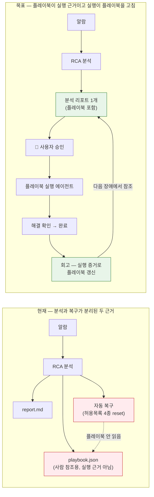
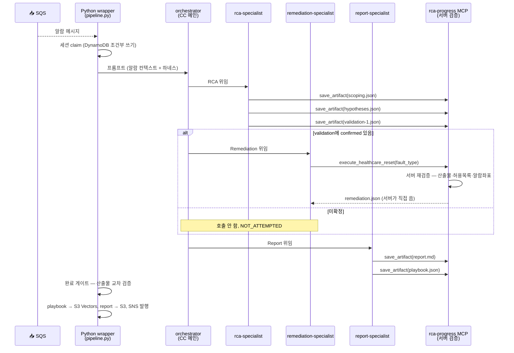
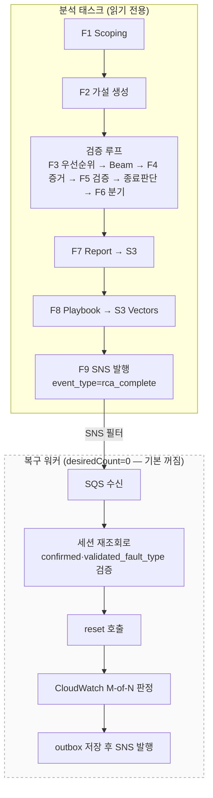
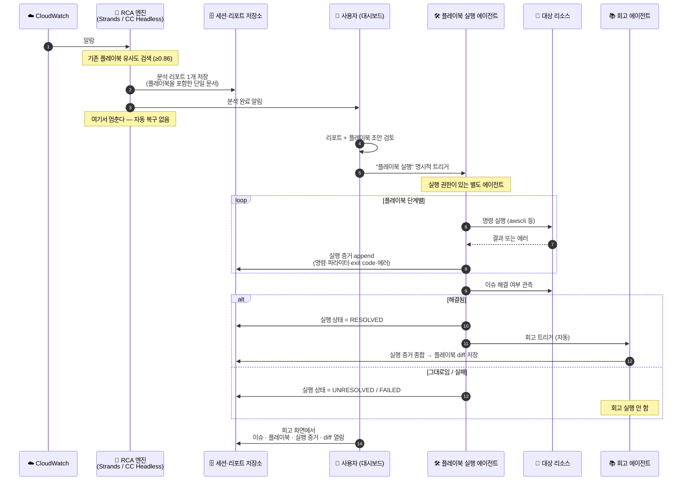
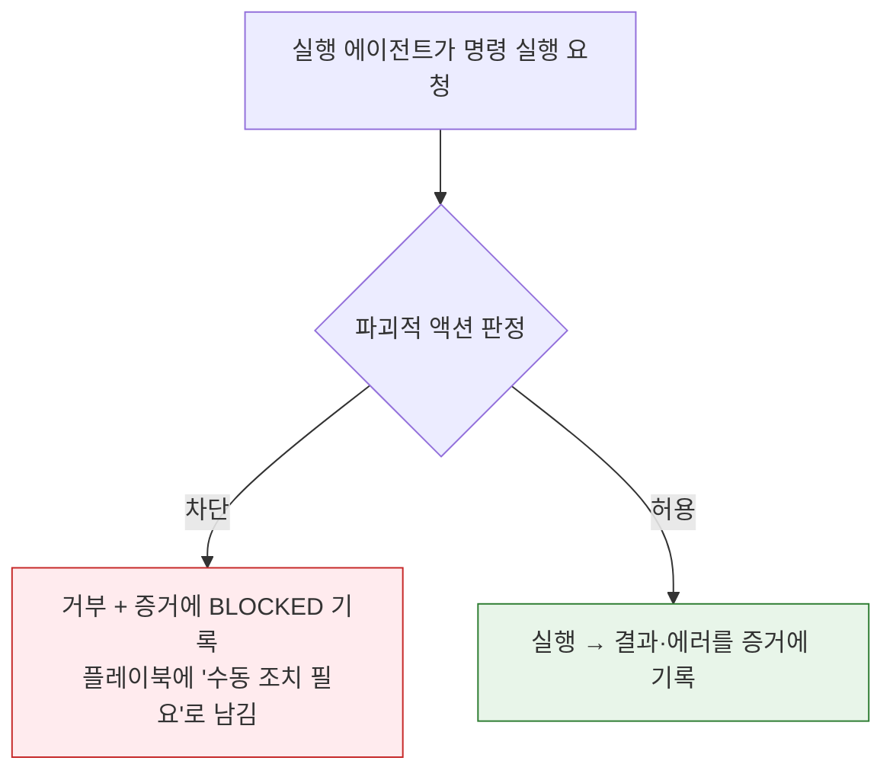
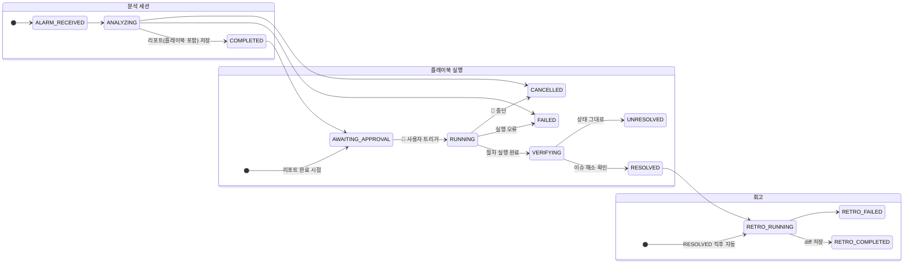

# RCA에서 플레이북 실행까지 — 현재 상태와 목표 구조

> 이 문서는 두 가지를 한곳에 담는다.
>
> 1. **지금 코드가 실제로 하는 일** (As-Is) — 문서가 아니라 소스에서 확인한 동작
> 2. **앞으로 가야 할 구조** (To-Be) — RCA 리포트 1개, 그 안의 플레이북, 사용자
>    승인 기반 실행, 실행 증거를 반영한 플레이북 회고
>
> 각 절 끝에 "무엇을 바꿔야 하는가"를 붙여 두었다. ADR과 코드 변경은 이 문서의
> 4장 매핑을 따른다.

---

## 0. 한 줄 요약

지금은 **분석과 복구가 각자 다른 근거로 움직이고, 플레이북은 실행에 쓰이지
않는다.** 목표는 **플레이북이 실행의 유일한 근거가 되고, 실행 결과가 다시
플레이북을 고치는 닫힌 루프**다.

---

## 1. 현재 상태 (As-Is)

### 1.1 등장하는 실행 주체

| 주체 | 배포 형태 | 트리거 | 권한 |
|------|-----------|--------|------|
| **Strands 엔진** | ECS Fargate, SQS Long Polling | CloudWatch 알람 (SNS→SQS) | 읽기 전용 (CloudWatch/CloudTrail/GitHub MCP) |
| **CC Headless 엔진** | ECS Fargate, SQS Long Polling | 같은 알람 (별도 SQS) | 읽기 전용 + Healthcare reset 4종 |
| **Strands 복구 워커** | ECS Fargate, `desiredCount=0` (기본 비활성) | RCA 완료 이벤트 (SNS 필터 `rca_complete`) | Healthcare reset 4종 |
| **대시보드** | 로컬 전용 Nuxt | 사람 | DynamoDB/S3 읽기 + 세션 취소/삭제 |

두 엔진이 같은 알람을 각자 분석하는 것은 **의도된 dual-stack**이다. 엔진 간
RCA 품질을 같은 입력으로 비교하기 위한 구조이므로 유지한다.

### 1.2 CC Headless의 실제 흐름

한 번의 CC CLI 실행 안에서 세 전문 에이전트를 순차 호출한다.

**중요한 현재 특성:**

- 복구는 **사람 개입 없이 같은 실행 안에서 자동으로** 일어난다.
- 복구 실행 여부는 `validation-{N}.json`의 `confirmed`와 서버 허용목록이 결정한다.
  **플레이북은 이 판단에 전혀 관여하지 않는다.**
- 산출물은 6종이고 `report.md`와 `playbook.json`은 **서로 다른 파일, 다른 저장소**다
  (report → S3, playbook → S3 Vectors + trace metadata).

### 1.3 Strands의 실제 흐름

9단계 파이프라인이 코드로 고정되어 있고, 복구는 **완전히 다른 프로세스**다.

기본값이 `desiredCount = 0`이므로 **현재 배포에서 Strands 복구는 아예 돌지
않는다**. 즉 지금 실제로 복구를 수행하는 경로는 CC Headless 하나뿐이다.

### 1.4 왜 "실행이 명확하지 않은" 상태인가

소스를 읽어 확인한 구조적 문제 6가지다.

| # | 문제 | 근거 |
|---|------|------|
| 1 | **플레이북이 실행 근거가 아니다** | ADR agent/0008이 "플레이북 절차를 복구 실행 경로에 넣지 않는다"를 명시적 결정으로 못박고 있다. 실행 근거는 `validated_fault_type` + 서버 허용목록이다. |
| 2 | **산출물이 리포트와 플레이북 2개로 갈라져 있다** | `report.md`(S3)와 `playbook.json`(S3 Vectors)이 별도 저장·별도 조회·별도 대시보드 페이지다. 사용자가 "리포트 1개"로 볼 수 있는 단위가 없다. |
| 3 | **실행 시점이 사용자 통제 밖이다** | CC Headless는 분석 직후 같은 실행에서 복구를 시작한다. 대시보드에는 실행 트리거가 없고 취소/삭제만 있다. |
| 4 | **실행 가능한 액션이 reset 4종뿐이다** | 허용목록이 `db-leak`, `high-cpu`, `high-memory`, `slow-query` reset으로 고정. 플레이북이 어떤 절차를 쓰든 실행할 수 없다. |
| 5 | **실행 증거가 학습으로 돌아오지 않는다** | 실행 결과는 `remediation.json` 한 장에 status/verification만 남는다. 어떤 명령을 어떤 파라미터로 호출했고 무엇이 실패했는지는 기록되지 않는다. 회고 단계 자체가 없다. |
| 6 | **복구 경로가 엔진별로 2개다** | CC는 in-process, Strands는 외부 워커. 안전 정책을 양쪽에 이중으로 유지해야 하고 ADR도 그 드리프트 위험을 스스로 적고 있다. |

---

## 2. 목표 구조 (To-Be)

### 2.1 전체 흐름

### 2.2 확정한 설계 결정

| 항목 | 결정 |
|------|------|
| **분석 산출물** | 리포트 **1개**. 플레이북은 이 리포트에 포함된 섹션이며, 실행에 필요한 구조화 필드를 함께 갖는다. |
| **기존 플레이북 참조** | 유사도 검색으로 기존 플레이북을 찾아 초안의 출발점으로 삼는다 (현재 search-first 전략 유지). |
| **실행 트리거** | **항상 사용자 명시 승인.** 자동 복구는 완전히 제거한다. 확정/미확정 여부와 무관하게 사람이 대시보드에서 실행을 눌러야 시작한다. |
| **실행 주체** | 실행 권한이 있는 **별도 에이전트**. headless-cc 형태로 그 에이전트가 실행까지 직접 수행한다. |
| **실행 권한 범위** | **대상 리소스 제한 없음. 파괴적 액션만 차단.** awscli를 실제로 호출할 수 있어야 파라미터 오류 같은 실수를 수집할 수 있다. |
| **완료 판정** | 실행 에이전트가 플레이북 실행 후 이슈 해결 여부를 관측한다. 해결되면 상태를 완료로 갱신한다. |
| **회고 시점** | **실행 성공 직후 자동.** 실패한 실행은 회고 대상이 아니다 (미해결 이슈의 잘못된 절차가 플레이북에 섞이는 것을 막는다). |
| **회고 산출물** | 이슈 · 플레이북(실행 전) · 실행 증거 · 갱신 diff 4종을 함께 볼 수 있어야 한다. |
| **엔진 구성** | Strands / CC Headless dual-stack 유지 (엔진 비교 분석 목적). **두 엔진 모두 같은 실행 에이전트를 트리거**한다. |
| **기본 모델** | Sonnet 5 (`global.anthropic.claude-sonnet-5`) — Strands와 headless-cc 양쪽. |

### 2.3 실행 권한 경계 — "파괴적 액션만 차단"

리소스 범위를 열되 되돌릴 수 없는 액션을 차단한다. 실행 에이전트의 게이트는
다음을 기준으로 판단한다.

**차단 대상(되돌릴 수 없는 것):** 리소스 삭제·종료, 데이터 파괴, 스냅샷/백업
삭제, 자격증명·정책의 광범위 회수, 계정/조직 수준 변경.

**허용 대상:** 조회, 메트릭/로그 확인, 재시작·롤링 배포, 스케일 조정, 설정
값 되돌리기, Healthcare fault reset.

> 판정 기준의 정확한 목록은 ADR이 요구사항으로 보유하고 코드가 이를 집행한다.
> 실행 에이전트의 프롬프트 지시만으로 제한하지 않고, 도구 계층에서 서버가 다시
> 검증한다 — 현재 `execute_healthcare_reset`이 산출물을 재검증하는 것과 같은 원리.

### 2.4 실행 증거의 형태

회고가 "같은 실수를 반복하지 않도록" 플레이북을 고치려면, 실행 증거가 명령
단위로 남아야 한다. 최소 다음을 기록한다.

| 필드 | 왜 필요한가 |
|------|-------------|
| 플레이북 단계 참조 | 어느 절차를 실행 중이었는지 — diff를 붙일 위치 |
| 실행한 명령과 파라미터 | 잘못 부른 파라미터가 무엇인지 특정 |
| 종료 코드 · 표준 오류 | 실패 분류의 근거 |
| 실패 분류 | 파라미터 오류 / 권한 부족 / 리소스 부재 / 일시 오류 등 |
| 재시도와 교정 내역 | 무엇으로 바꿔서 성공했는지 = 플레이북에 넣을 정답 |
| 관측 결과 | 이슈 해결 여부 판정의 근거 |

### 2.5 상태 모델

분석 세션과 실행은 **서로 다른 생명주기**다. 실행 실패가 이미 만들어진 분석
리포트를 훼손하지 않아야 하므로 분리한다.

`UNRESOLVED`와 `FAILED`는 회고로 넘어가지 않는다. 다만 증거는 보존되어 사람이
읽을 수 있어야 한다.

### 2.6 대시보드가 새로 가져야 하는 것

| 화면 | 내용 |
|------|------|
| 세션 목록 | 실행 상태 컬럼 추가 (`승인 대기` / `실행 중` / `해결` / `미해결` / `실패`) |
| 리포트 상세 | 플레이북을 리포트 안에서 함께 렌더 (별도 페이지 분리 해소) + **실행 버튼** |
| 실행 상세 | 단계별 명령·파라미터·에러 타임라인 |
| **회고 상세 (신규)** | 이슈 요약 · 실행 전 플레이북 · 실행 증거 · 갱신 diff 4단 비교 |

---

## 3. 현재와 목표의 차이 정리

| 축 | 현재 | 목표 |
|----|------|------|
| 분석 산출물 | report.md + playbook.json (2개, 저장소 분리) | 플레이북을 포함한 리포트 1개 |
| 실행 근거 | `validated_fault_type` + 서버 허용목록 | **플레이북 절차** (서버가 파괴성만 재검증) |
| 실행 시작 | 분석 직후 자동 (CC) / 이벤트 기반 워커 (Strands) | **사용자 명시 승인** 후 실행 에이전트 |
| 실행 주체 | CC 내부 서브 에이전트 / 별도 Strands 워커 | 실행 권한을 가진 **단일 실행 에이전트** |
| 실행 가능 액션 | reset 4종 | 리소스 무제한, 파괴적 액션만 차단 |
| 완료 판정 | 서버가 M-of-N으로 `NORMALIZED`/`PENDING` | 실행 에이전트가 해결 여부 관측 → 완료 갱신 |
| 실행 증거 | status + verification 요약 | 명령·파라미터·에러·재시도 단위 기록 |
| 플레이북 학습 | 다음 RCA 때 유사도 검색으로 보강 | **실행 증거 기반 회고**로 즉시 갱신 |
| 회고 열람 | 없음 | 이슈·플레이북·증거·diff 4단 화면 |
| 기본 모델 | Sonnet 4.6 | **Sonnet 5** |

---

## 4. 변경 계획 — ADR과 코드 매핑

> ADR을 먼저 고치고 코드를 그 결정에 맞춘다. 각 항목의 상세 결정은 해당 ADR
> 본문이 보유하며, 이 표는 어디를 손대야 하는지에 대한 색인이다.

### 4.1 ADR 변경

| 대상 | 성격 | 요지 |
|------|------|------|
| `agent/0007` RCA 보고서 생성 | 개정 | 리포트가 플레이북을 포함하는 단일 산출물임을 결정에 반영. 복구 결과 기록은 실행 생명주기 분리에 맞춰 재서술. |
| `agent/0008` 플레이북 생성 | **중대 개정** | "플레이북은 실행 근거가 아니다"를 뒤집는다. 플레이북이 실행 근거가 되며, 실행 가능한 구조화 절차를 갖는다. search-first 보강 전략은 유지. |
| `agent/0012` 자동 복구 실행 경계 | **대체** | 자동 복구를 제거하고 사용자 승인 게이트로 교체. 안전 경계를 "확정 원인 + 허용목록"에서 "파괴적 액션 차단"으로 재정의. |
| `agent/0011` CC Headless 오케스트레이션 | 개정 | RCA → 조건부 Remediation → Report 순서에서 Remediation 단계를 제거. 리포트 단일 산출물 계약으로 변경. |
| `agent/0010` 모델 티어 | 개정 | 기본 모델을 Sonnet 5로. |
| **신규** `agent/00NN` 플레이북 실행 에이전트 | 신규 | 실행 주체, 승인 게이트, 파괴성 판정, 실행 증거 스키마, 해결 판정, 상태 전이. |
| **신규** `agent/00NN` 플레이북 회고 | 신규 | 성공 직후 자동 트리거, 증거 종합 규칙, diff 생성·보존, 열람 계약. |
| `infra/0003` CC Headless 실행 인프라 | 개정 | 실행 에이전트 스택 분리와 권한 경계. |
| `infra/0002` 증거 저장 | 개정 | 실행 증거·회고 diff의 저장 계층 결정. |
| `infra/0005` 실행 trace | 개정 | 실행/회고 스팬 타입 추가. |
| `agent/decision-log.md`, `infra/decision-log.md` | 추가 | 위 전환을 각각 한 줄로 기록. |

### 4.2 코드 변경

| 패키지 | 변경 |
|--------|------|
| `packages/cc-headless` | `remediation-specialist` 제거 → 실행 에이전트로 분리. `execute_healthcare_reset` → 파괴성 게이트가 붙은 범용 실행 도구. 산출물 계약을 리포트 단일화에 맞춰 개정 (`artifact_validation`, `prompts/`, `.claude/agents/`, `.claude/skills/`). 실행/회고 파이프라인 신설. |
| `packages/agent` | `remediation_main`·`remediation_pipeline`·`remediation`·`verification`을 실행 에이전트 트리거로 대체. 리포트에 플레이북 포함. |
| `packages/infra` | `RemediationAgentStack` → 실행 에이전트 스택으로 재정의(사용자 트리거 진입점). SNS 자동 트리거 구독 제거. 모델 환경변수 Sonnet 5. |
| `packages/dashboard` | 실행 트리거 API, 실행 상세, 회고 상세 화면. 리포트 안에 플레이북 렌더. |
| `tests/`, 각 패키지 `tests/` | 승인 없는 실행 차단, 파괴적 액션 차단, 증거 기록, 회고 트리거 조건의 계약·회귀 테스트. |
| 문서 | `architecture.md`, `architecture-and-demo-flow.md`, `system-guide-for-ops.md`, `AGENTS.md`의 흐름·모델 서술 갱신. |

### 4.3 순서

인프라 → 엔진 → 대시보드 (의존성 하향). ADR은 각 단계의 코드 변경보다 앞선다.

1. ADR 개정·신설 + decision-log
2. 기본 모델 Sonnet 5 전환 (독립적, 선행 가능)
3. 리포트 단일화 (플레이북 포함)
4. 자동 복구 제거 + 승인 게이트
5. 실행 에이전트 (파괴성 게이트, 실행 증거, 해결 판정)
6. 회고 에이전트 (diff 생성·보존)
7. 대시보드 (트리거, 실행 상세, 회고 상세)
8. `/adr-sync`로 ADR↔코드 정합

---

## 5. 관련 문서

- [플레이북 실행 전환 인계서](./playbook-execution-migration-plan.md) — 이 전환의 진행 상황과 남은 작업
- [아키텍처](./architecture.md) — dual-stack, 파이프라인, 저장소
- [아키텍처 & 데모 흐름](./architecture-and-demo-flow.md) — 단계별 상세 다이어그램
- [운영 가이드](./system-guide-for-ops.md) — 인프라·데모 운영
- [High 발견사항 추적](./rca-remediation-high-findings.md) — 미해결 H 항목
- ADR 인덱스: `docs/adr/.mapping.json`
