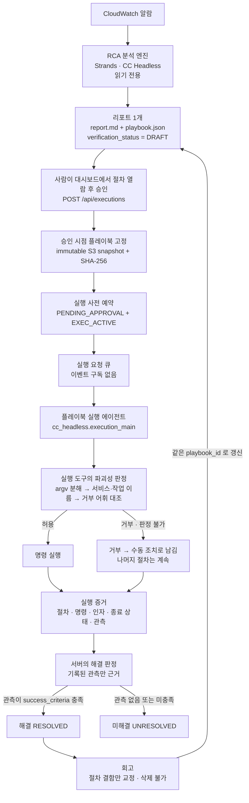
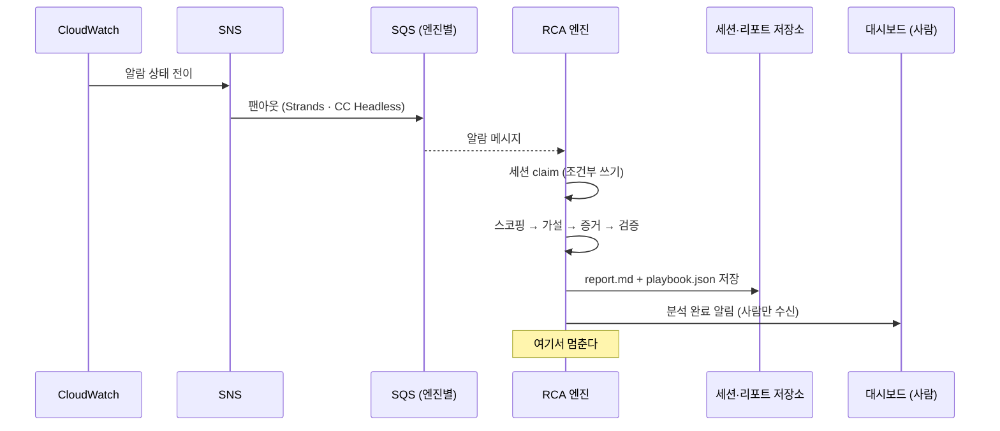
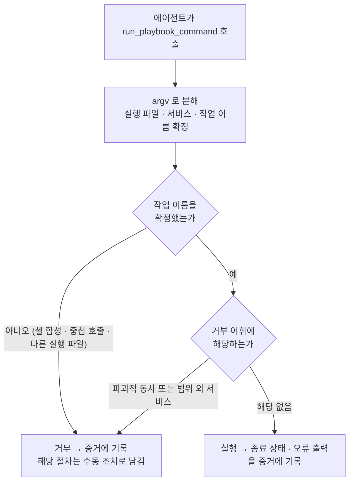
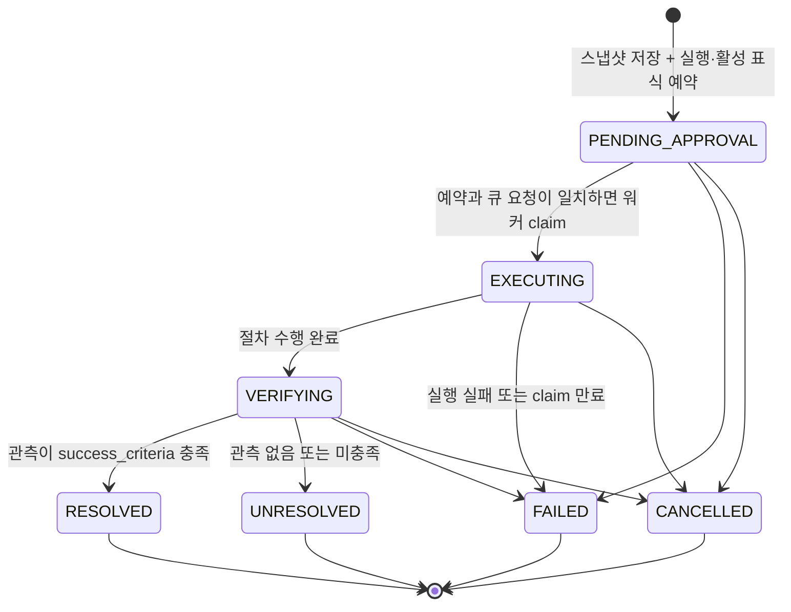

# RCA에서 플레이북 실행까지 — 닫힌 루프

이 문서는 알람 하나가 시스템에 들어와 **분석되고, 사람이 승인하고, 절차가 실행되고,
해결이 판정되고, 회고가 그 절차를 고쳐 다음 실행의 근거가 되기까지**를 한곳에서
설명한다. 아키텍처 문서는 스택과 모듈 구성을 다루고, 개별 결정 기록은 결정 하나를
깊게 다룬다. 이 문서는 그 사이 층위에서 **하나의 흐름이 어디서 어디로 넘어가는지와
그 경계가 왜 그 자리에 있는지**를 다룬다.

루프는 다음 순서로 닫힌다.

**RCA 분석 → 리포트(플레이북 포함) → 사용자 승인 → 플레이북 실행 → 해결 판정 →
회고 → 갱신된 플레이북이 다음 실행의 근거**

---

## 1. 전체 흐름

이 그림에서 읽어야 할 것은 두 가지다. 첫째, 알람에서 리포트까지는 **자동**이고 리포트에서
실행까지는 **사람**이다. 둘째, 회고가 만든 갱신 플레이북이 다시 실행의 입력으로 돌아온다 —
루프가 닫히는 지점이 여기다.

---

## 2. 분석 — 읽기 전용이고 리포트 하나로 끝난다

같은 CloudWatch 알람을 SNS가 두 개의 SQS 큐로 팬아웃하고, Strands 엔진과 CC Headless
엔진이 각자 독립적으로 RCA를 수행한다. 두 엔진을 유지하는 이유는 같은 입력으로 RCA 품질을
비교하기 위한 것이며, 실행 경로는 두 엔진이 공유한다.

분석은 **어떤 것도 변경하지 않는다.** 분석 태스크 역할에 쓰기 권한이 없고, 분석 하네스에
쓰기 도구가 없고, 대상 서비스로 가는 네트워크 경로도 없다. 하네스 계약 테스트가 쓰기 도구의
혼입을 막는다.

분석은 **리포트 하나를 만들고 끝난다.** 예전에는 분석이 끝난 자리에서 복구가 이어졌지만,
지금은 이어지지 않는다. 분석 완료 알림은 사람과 대시보드만 수신하며 어떤 기계 동작도
트리거하지 않는다.

---

## 3. 리포트와 플레이북 — 하나의 산출물, 두 표현

산출물은 **플레이북을 포함한 리포트 하나**다. `report.md`는 사람이 읽는 서술이고
`playbook.json`은 실행과 유사도 검색이 쓰는 구조다. 둘은 별개의 문서가 아니라 같은 리포트의
두 표현이며, 완료 게이트가 두 표현의 절차 목록이 **같은 `step_id`를 같은 순서로** 담는지
확인한다. 하나라도 어긋나면 저장이 거부된다.

사람이 읽는 서술과 실행이 읽는 구조가 갈라지면, 사람은 서술을 보고 승인하는데 실행은 구조를
따라간다. 승인한 내용과 실행한 내용이 다르면 승인 게이트는 형식만 남는다. 그래서 두 표현의
일치를 저장 조건으로 둔다.

플레이북의 실행 근거는 `execution_steps`이고 각 절차는 네 필드를 갖는다.

| 필드 | 내용 |
|------|------|
| `step_id` | 절차 식별자. 증거와 회고 diff가 이 값으로 절차를 가리킨다 |
| `intent` | 이 절차가 무엇을 달성하려는지 |
| `action` | 수행할 작업. **자연어**다 |
| `success_criteria` | 성공했는지를 판정할 관측 기준 |

`action`을 완성된 명령줄이 아니라 자연어로 두는 이유는, 리소스 식별자와 리전이 분석 시점이
아니라 **실행 시점의 알람 컨텍스트**에서 결정되기 때문이다. 플레이북은 같은 증상이 다른
리소스에서 재현될 때 다시 쓰인다. 절차에 특정 리소스 식별자를 박아 두면 그 플레이북은 한 번만
쓸 수 있다.

`verification_status`는 항상 `DRAFT`다. 분석은 이 값을 다른 값으로 쓸 수 없다 — 실행으로
검증되지 않은 절차를 검증된 절차로 표기하면 사람이 승인 판단을 잘못한다. 이 값이 바뀌는 경로는
실행과 회고를 거치는 것뿐이다.

확정된 근본원인이 없으면 실행 절차를 만들지 않고, 무엇을 더 조사해야 하는지를 쓴다. 추측
절차가 승인 버튼 뒤에 놓이면 사람이 검증된 절차로 오인한다.

---

## 4. 승인 — 게이트는 코드 조건이 아니라 경로의 성질이다

실행은 사람이 대시보드에서 절차를 읽고 승인 버튼을 누를 때만 시작된다.
`POST /api/executions`는 승인 시점의 플레이북을 결정적 JSON으로 직렬화해
`approvals/{rca_id}/{execution_id}/playbook.json`에 변경 불가능한 스냅샷으로 저장하고,
그 바이트의 SHA-256 digest를 계산한다. 승인은 RCA 식별자만 허가하는 것이 아니라
**사람이 읽은 정확한 플레이북 내용**을 허가한다.

그 다음 DynamoDB 트랜잭션으로 실행 항목 `EXEC#{execution_id}`를
`PENDING_APPROVAL` 상태로 만들고 같은 RCA 파티션에 `EXEC_ACTIVE`를 함께 예약한 뒤,
그 예약과 스냅샷을 가리키는 메시지를 실행 요청 큐에 발행한다. 큐 전송이 실패해도 승인
스냅샷과 예약은 남으며, 클라이언트는 같은 승인 UUID로 재시도한다. 다른 내용이 같은 승인
UUID를 사용하거나 같은 RCA에 다른 활성 승인이 있으면 거부된다.

실행 스택에는 SNS 구독도 이벤트 규칙도 없고, 실행 역할은 자기 요청 큐에 메시지를 보낼 수
없다. 그러나 큐 메시지만으로도 승인을 위조할 수 없도록 워커는 **이미 존재하는 예약의 모든
필드와 활성 실행 표식이 정확히 일치할 때만** `EXECUTING`으로 claim한다. 즉 실행의 유일한
입구는 `사용자 승인 → immutable snapshot → 사전 예약 → 큐 메시지`의 완전한 경로다.

같은 전제를 실행 워커도 다시 확인한다. 메시지에 `AlarmName`이나 `Trigger`가 들어 있으면
실행 요청으로 해석하지 않는다. 알람 토픽 구독이 잘못 연결되어 알람이 이 큐로 흘러 들어오는
경우에도 그것이 실행으로 이어지지 않게 하기 위해서다.

승인 API는 워커가 어차피 거부할 요청을 발행하지 않는다. 분석 세션이 `COMPLETED`이고
근본원인이 확정됐으며 S3 리포트가 존재해야 한다. 플레이북은 중복되지 않은 `step_id`와
비어 있지 않은 `action`·`success_criteria`를 가진 실행 절차를 포함해야 한다. 승인 UUID는
한 승인 시도 동안 유지되며 같은 요청의 재전달은 같은 실행 예약으로 수렴한다.

---

## 5. 실행 — 절차를 명령으로 옮긴다

실행은 분석과 별개의 워커다. 진입점은 `python -m cc_headless.execution_main`이며 분석
워커와 **같은 컨테이너 이미지를 다른 진입점으로** 실행한다. 하나의 하네스를 두 진입점으로
나눈 것이므로 실행 도구와 분석 도구가 같은 프로세스에 들어가는 일이 없다.

실행 에이전트는 승인 API가 고정한 플레이북 스냅샷의 `execution_steps`를 순서대로 수행한다.
워커는 S3에서 읽은 원본 바이트의 digest를 요청의 `playbook_digest`와 비교하고, 다르면
실행하지 않는다. 승인 뒤 회고나 새 RCA가 최신 개정본을 바꾸더라도 이번 실행은 최신본을
다시 조회하지 않는다. 바뀐 플레이북은 다음 승인 화면에는 나타나지만, 실행하려면 새 승인이
필요하다.

실행 도구는 호출된 `step_id`가 승인 스냅샷에 선언됐는지 서버에서 검사한다. 선언되지 않은
식별자의 명령과 관측은 거부된다. 해결 판정에는 선언된 모든 절차의 시도와 관측이 필요하므로,
모델이 절차를 건너뛰거나 빈 해결 관측만 기록해서 `RESOLVED`로 만들 수 없다.

### 파괴성 판정 — 서버가 거부한다

실행 경계는 대상 리소스를 제한하지 않는다. 대신 **되돌릴 수 없는 작업을 거부**한다. 리소스를
제한하면 실제로 잘못 부른 인자나 빠진 선행 조건 같은 실수를 수집할 수 없고, 그 실수가 회고의
입력이다.

판정은 프롬프트 지시가 아니라 **실행 도구가 서버 측에서** 수행한다.

거부 어휘는 두 축이다. 하나는 되돌릴 수 없는 제어 평면 동사(`delete`, `terminate`,
`revoke`, `detach`, `drop` 등)이고, 다른 하나는 실행 대상이 아닌 서비스 범위
(organizations, account, billing, IAM, SSO 등)다. AWS API 이름이 동사+명사 형태이므로 동사만
보면 서비스가 늘어나도 같은 판정이 적용된다.

**작업 이름을 확정할 수 없는 명령은 거부한다.** 판정 불가를 허용으로 읽으면 거부 목록이
비어 버린다 — 셸 합성이나 중첩 호출로 실제 작업 이름을 감출 수 있고, 그러면 어떤 파괴적
명령도 판정 불가 형태로 바꿔 통과시킬 수 있다. 거부 목록의 유효성은 판정 불가를 거부로
처리하는 데서 나온다.

### 거부는 실행을 중단시키지 않는다

거부된 절차는 증거에 남고 **수동 조치**로 표시되며, 남은 절차는 계속 수행된다. 한 절차가
파괴적이라는 이유로 전체를 중단하면, 되돌릴 수 있는 나머지 조치까지 사람 손으로 넘어간다.
플레이북의 대부분이 안전한 조치라면 그 부분은 실행되는 것이 낫다.

---

## 6. 해결 판정 — 서버가 판정한다

절차 수행이 끝나면 실행 상태는 `VERIFYING`으로 넘어가고, **서버가 기록된 관측만 근거로**
해결 여부를 확정한다. 에이전트가 요약에 무엇을 썼는지는 판정에 들어가지 않는다.

**닫는 요약은 관측이 아니다.** 모델이 "정상화되었습니다"라고 서술하는 것과 지표가 기준을
만족한 것은 다르다. 전자를 근거로 삼으면 해소되지 않은 장애가 완료로 기록되고, 그 절차가
회고를 통해 검증된 절차로 승격된다. 잘못된 절차가 다음 장애의 근거가 되므로 오류는 한 번의
오판으로 끝나지 않는다.

해결로 전이하는 조건은 셋이 모두 성립할 때다.

1. 실행 에이전트가 정상 종료했다.
2. 해소가 관측으로 확인되었다 (`record_resolution`에 관측 기록이 있다).
3. 시도된 절차 중 성공 기준을 만족하지 못한 것도, 관측이 없는 것도 없다.

하나라도 아니면 `UNRESOLVED`다. 특히 **관측 기록이 아예 없는 경우도 `UNRESOLVED`**다 —
관측되지 않은 것을 해결로 추정하지 않는다.

증거는 플레이북의 절차 목록을 기준으로 조립하므로, 에이전트가 언급하지 않은 절차도 증거에
나타난다. 시도되지 않은 절차가 조용히 사라지면 실행이 절차를 건너뛴 사실을 사람이 알 수 없다.

---

## 7. 상태와 생명주기

실행은 분석 세션과 **별도 생명주기**다.

한국어 표기는 `승인 대기` → `실행 중` → `검증 중` → `해결`/`미해결`, 그리고 `실행 중` →
`실패`/`취소`다.

**`실행 중`에서 `해결`로 직접 가는 전이는 없다.** 검증 상태를 반드시 거치게 만든 것은
6장의 판정을 상태 기계 차원에서 강제하는 장치다. 직접 전이가 존재하면 관측을 건너뛴 해결이
가능해진다.

실행 실패는 분석 세션을 실패로 만들지 않고 이미 저장된 리포트를 변경하지 않는다. 분석은
이미 끝난 작업이고, 그 결과물의 품질은 실행이 성공했는지와 무관하다. 하나의 리포트는 여러 번
실행될 수 있으며, 실행 아이템은 세션과 같은 DynamoDB 파티션에 `EXEC#{execution_id}`로
저장된다 — 세션 아이템과 달리 **엔진 접두사를 붙이지 않는다.** 어느 엔진이 리포트를 만들었든
실행 경로는 하나이기 때문이다.

claim이 만료된 실행은 다른 워커가 자동으로 이어받지 않는다. 외부 명령이 실제로 수행된 뒤
응답만 유실됐을 가능성이 있어 자동 재실행하면 한 번의 승인이 두 번의 쓰기가 될 수 있다.
따라서 해당 실행을 `FAILED`로 끝내고 `EXEC_ACTIVE`를 해제하며, 다시 실행하려면 사용자가
새 승인 UUID로 승인해야 한다. 모든 종료 전이는 자신이 소유한 `EXEC_ACTIVE`만 해제한다.

---

## 8. 실행 증거

증거는 명령 단위로 누적된다.

| 기록 | 왜 필요한가 |
|------|-------------|
| 절차 식별자 | 어느 절차를 수행 중이었는지 — 회고가 교정을 붙일 위치 |
| 명령과 인자 | 잘못 부른 인자가 무엇인지 특정 |
| 종료 상태와 오류 출력 | 실패 분류의 근거 |
| 실패 분류 | 인자 오류 / 권한 부족 / 리소스 부재 / 일시 오류 / 거부 |
| 재시도와 교정 내역 | 무엇으로 바꿔서 성공했는지 = 절차에 넣을 정답 |
| 관측 결과 | 해결 판정의 유일한 근거 |

**실행이 실패해도 증거는 보존된다.** 실패한 실행에서 사람이 원인을 알 수 있는 유일한 기록이
증거이므로, 실패를 이유로 지우면 실패에서 배울 수 없다.

주 보관소는 S3이고 DynamoDB에는 요약만 둔다. 증거는 명령 단위로 길어지므로 상태 저장소에
전문을 두면 아이템 크기 한계에 걸린다. 자격 증명으로 보이는 인자는 가린다 — 증거는 사람이
읽는 자료이고, 자격 증명이 남으면 열람 자체가 노출이 된다.

---

## 9. 회고 — 실행 증거가 절차를 고친다

`RESOLVED` 실행 직후 회고가 자동으로 돌아간다.

### RESOLVED만 회고에 들어가는 이유

`UNRESOLVED`·`FAILED`·`CANCELLED`는 회고에 들어가지 않는다. **이슈를 해소하지 못한 절차는
올바름이 입증되지 않았기 때문이다.** 미해결 실행의 증거로 절차를 고치면, 고친 근거가 "이렇게
했더니 해결되었다"가 아니라 "이렇게 했더니 해결되지 않았다"가 된다. 무엇이 옳은지는 그 증거에
없다. 실패한 시도에서 얻은 추측을 검증된 절차 자리에 올리면 플레이북은 실행할수록 나빠진다.

미해결·실패한 실행의 증거는 보존되고 사람이 읽을 수 있다. 회고에 들어가지 않는다는 것은
**절차를 자동으로 고치지 않는다**는 뜻이며, 기록을 버린다는 뜻이 아니다.

### 무엇을 고치는가

교정 대상은 **절차의 결함으로 환원되는 실패**뿐이다. 잘못된 인자, 누락된 인자, 빠진 선행
조건, 순서 오류, 해결 확정에 필요했던 검증 절차가 여기 해당한다.

**일시적 오류는 교정하지 않는다.** 같은 명령이 재시도로 성공했다면 절차 자체는 옳았다.
일시적 실패를 절차 결함으로 처리하면 절차에 불필요한 우회가 쌓이고, 그 우회가 다음 실행에서
새로운 실패 지점이 된다.

### 삭제는 코드가 막는다

갱신은 추가와 교정만 한다. **삭제가 불가능한 것은 프롬프트 지시가 아니라 병합 코드의
성질이다.**

- 갱신안이 담지 않은 필드는 기존 값을 유지한다.
- 갱신안에 없는 절차는 그대로 남는다.
- `step_id`와 절차 순서는 살아남고, 새 절차는 뒤에 붙는다.
- 관측 가능한 성공 기준이 없는 새 절차는 받지 않는다.
- 갱신안을 해석할 수 없으면 아무것도 바꾸지 않는다.

프롬프트로 "삭제하지 마라"고 지시하면, 모델이 필드를 누락하는 것만으로 축적된 절차가 조용히
사라진다. 모델이 규칙을 어기려 하지 않아도 그렇게 된다 — 갱신안을 전체 문서로 다시 쓰는
형태라면 언급하지 않은 것이 곧 삭제이기 때문이다. 누락과 삭제를 구별하는 판단을 모델에게
맡기지 않고, 병합 규칙이 누락을 항상 "유지"로 해석한다.

승인 시점에 보존한 **immutable 플레이북 스냅샷**이 실행과 회고의 기준이다. 회고가 현재
개정본을 덮어써도 승인·실행된 원문과 갱신 diff의 기준은 바뀌지 않는다.

### 승격 — 초안이 검증됨이 되는 유일한 지점

회고가 갱신을 반영하면 `verification_status`가 `DRAFT`에서 `VERIFIED`로 올라간다.
다만 이 상태는 플레이북 식별자 전체가 아니라 **현재 실행 절차 내용이 검증됐음**을 뜻한다.
이후 분석이나 병합이 설명·태그만 보강하면 `VERIFIED`를 유지하지만,
`execution_steps`가 추가되거나 교정되면 새 내용은 아직 실행되지 않았으므로 다시
`DRAFT`가 된다.

승격 주체가 회고인 이유는 **해결 판정과 절차 교정을 모두 통과한 지점이 여기뿐**이기
때문이다. 해결 판정 직후 실행 에이전트가 올리면 인자 오류를 남긴 절차가 검증됨으로 표기된다
— 실행이 성공했다는 것과 절차가 옳다는 것은 다르다.

- 교정할 결함이 없어 갱신이 비어 있어도 **승격은 일어난다.** 절차가 그대로 이슈를 해소했다면
  그것이 가장 강한 검증이다.
- 회고가 실패하면 승격도 없다. 갱신을 반영하지 못한 회고는 절차를 확인한 것이 아니다.
  다음 실행이 해결되면 그때 승격되므로 지연될 뿐 유실되지는 않는다.
- 미해결·실패·취소는 회고에 들어가지 않으므로 승격 경로 자체가 없다.

이 값은 **서버가 소유한다.** 회고 모델이 갱신안에 담아도 병합이 버린다. LLM 출력이 검증
여부의 권위가 되면 실행되지 않은 절차가 검증됨으로 표기되고, 사람이 그것을 승인 판단의
근거로 삼는다.

승격은 개정본과 검색 인덱스 **양쪽에 함께** 반영된다. 다음 승인 화면은 개정본을 읽고 다음
RCA의 보강은 인덱스를 읽으므로, 한쪽만 갱신하면 승격이 한 경로에서만 보인다. 이후 보강은
실행 절차가 동일할 때만 이 값을 유지한다.

### 루프가 닫힌다

갱신된 플레이북은 **같은 `playbook_id`를 유지**한다. 새 식별자를 만들면 축적이 갈라지고
"같은 증상의 플레이북"이 여러 개가 된다. 같은 식별자를 유지하므로, 다음 승인 화면은 원본보다
이 갱신본을 우선해 보여주고 사용자가 승인한 정확한 갱신본을 새 스냅샷으로 고정한다.
**갱신된 플레이북이 다음 승인의 근거가 되고, 그 승인이 다음 실행의 근거가 되는 지점이
여기다.**

Strands 엔진은 새 분석에서 플레이북을 만들 때 기존 플레이북을 유사도로 먼저 찾는다. 충분히
닮은 플레이북이 있으면 새로 만들지 않고 그것을 갱신 대상으로 삼는다. 검색 임계값이 일반 조회보다
엄격한데, 엉뚱한 플레이북에 병합하는 것이 새로 하나 만드는 것보다 나쁘기 때문이다.

회고 실패는 이미 확정된 해결을 되돌리지 않는다. 실행은 실제로 이슈를 해소했고, 그 사실은
회고가 성공했는지와 무관하다.

---

## 10. 사람이 보는 화면

| 화면 | 내용 |
|------|------|
| 세션 목록 | 분석 상태와 함께 실행 상태 표기 (`승인 대기`/`실행 중`/`해결`/`미해결`/`실패`), 회고로 플레이북이 갱신되었는지 표시 |
| 리포트 상세 | 리포트 안에서 실행 절차를 렌더하고 **승인 버튼**을 둔다. 절차가 초안인지 검증됨인지 함께 표기해 승인 판단의 근거로 삼게 한다. 진행 중인 실행이 있거나 실행 절차가 없으면 승인할 수 없다. 실행 이력을 함께 보여준다 |
| 회고 상세 | **이슈 · 실행 전 플레이북 · 실행 증거 · 갱신 diff** 네 가지를 나란히 본다 |

회고 화면이 네 가지를 한 화면에 두는 이유는, **회고가 사람의 승인 없이 플레이북을 고치는
유일한 경로**라는 데 있다. 승인 게이트는 실행 앞에 있고 갱신 앞에는 없으므로, 갱신의 타당성은
사후에 대조할 수 있어야 한다. 넷 중 하나만 보면 갱신이 정당했는지 판단할 수 없다 — 증거만
보면 무엇이 바뀌었는지 모르고, diff만 보면 왜 바뀌었는지 모른다.

---

## 11. 실행 주체와 권한 경계

| | 분석 | 실행 |
|---|------|------|
| 진입점 | `main.py` (엔진별) | `python -m cc_headless.execution_main` |
| 트리거 | CloudWatch 알람 (SNS→SQS) | 대시보드가 발행한 실행 요청 큐 메시지 |
| 이벤트 구독 | 있음 (알람) | **없음** |
| 배치 | ECS Fargate 상시 | ECS Fargate 상시 1 태스크 |
| 쓰기 권한 | 없음 | 있음 — **시스템에서 유일한 쓰기 태스크 역할** |
| 대상 서비스 네트워크 | 없음 | 있음 |

실행 스택의 태스크 역할은 PowerUserAccess를 기반으로 하고, 실행 대상이 아닌 범위를 명시적으로
Deny한다: organizations, account, billing, budgets, ce, cur, aws-portal, sso, identitystore,
그리고 IAM 변경.

**거부 어휘는 이 정책에 담지 않는다.** 작업 이름의 어휘와 IAM 액션 이름이 일대일로
대응하지 않으므로 정책으로 표현하면 빈틈이 남고, 정책 거부는 어느 절차가 왜 차단되었는지를
증거에 기록하거나 그 절차를 수동 조치로 표시할 수 없다. 도구는 둘 다 할 수 있다. 그래서
정책은 **애초에 실행 대상이 아닌 범위를 잘라내는 거친 경계**만 담당하고, 되돌릴 수 없는
작업의 판정은 5장의 실행 도구가 맡는다.

두 역할을 나눈 것은 분석 경로의 결함이 쓰기 권한에 닿지 않게 하기 위해서다. 하나의 역할을
공유하면 분석 하네스에 쓰기 도구가 없다는 사실이 유일한 방어선이 된다.

실행은 `success_criteria`가 관측 가능해질 때까지 기다리므로 오래 걸린다. 실행 타임아웃은
3600초이고 요청 큐의 visibility timeout은 4500초다. claim이 최악의 실행 시간보다 짧으면
진행 중인 요청이 재전달되어 같은 절차가 두 번 실행된다.

---

## 12. 관련 문서

- [아키텍처](./architecture.md) — dual-stack, 파이프라인, 저장소, 기술 스택
- [아키텍처 & 데모 흐름](./architecture-and-demo-flow.md) — 단계별 상세 다이어그램
- [운영 가이드](./system-guide-for-ops.md) — 인프라·데모 운영
- [High 발견사항 추적](./rca-remediation-high-findings.md) — 미해결 H 항목
