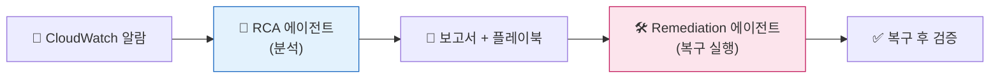
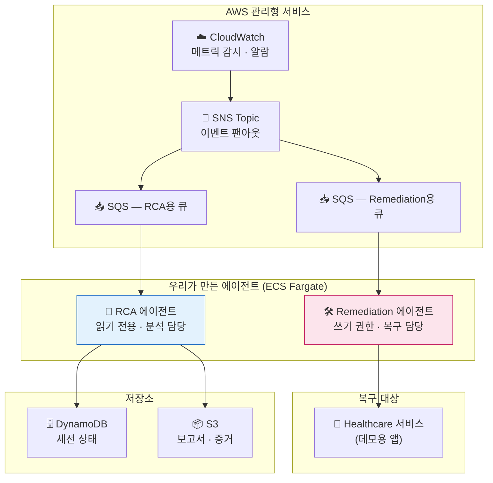
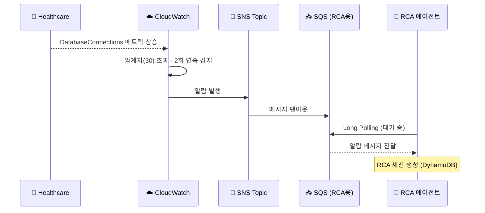
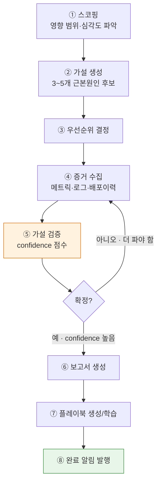
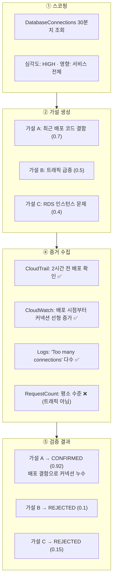
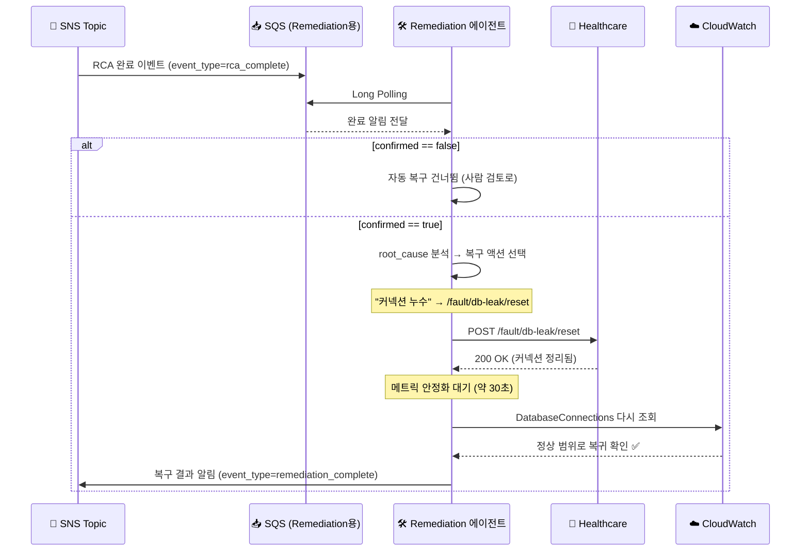
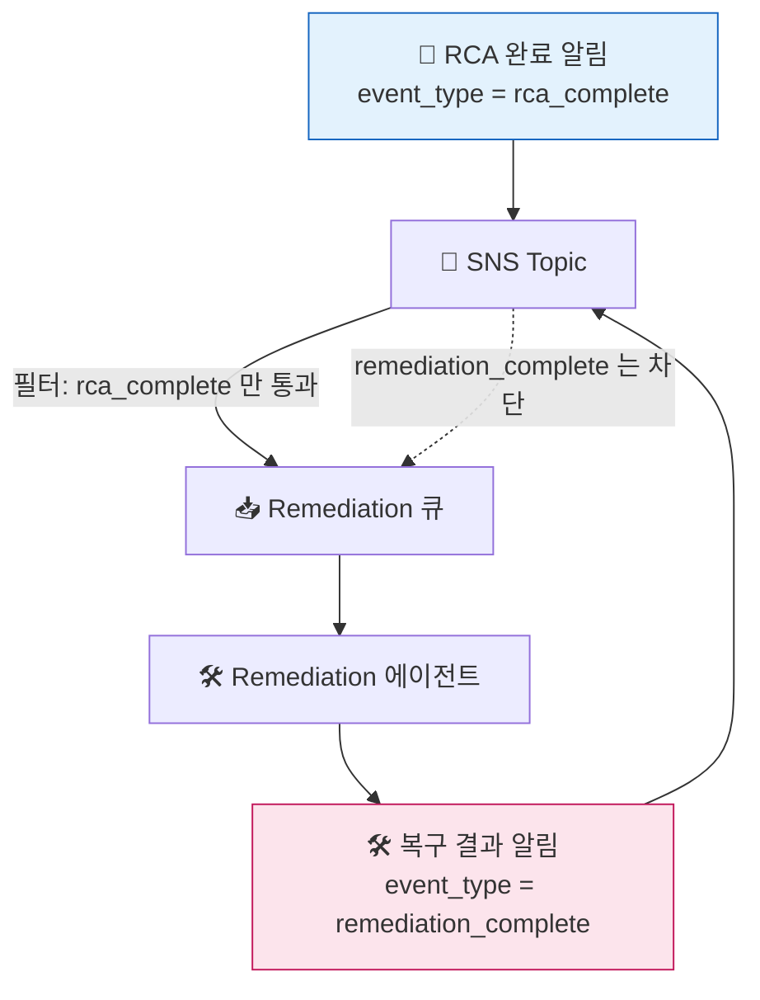
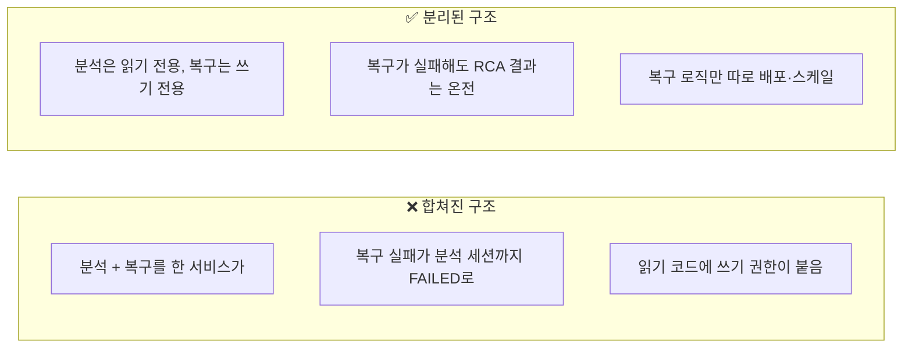
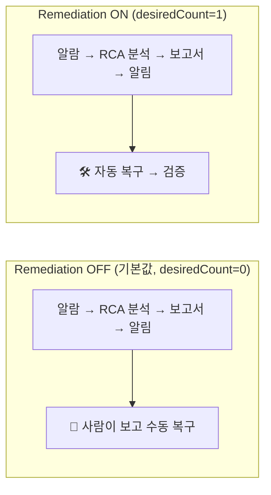
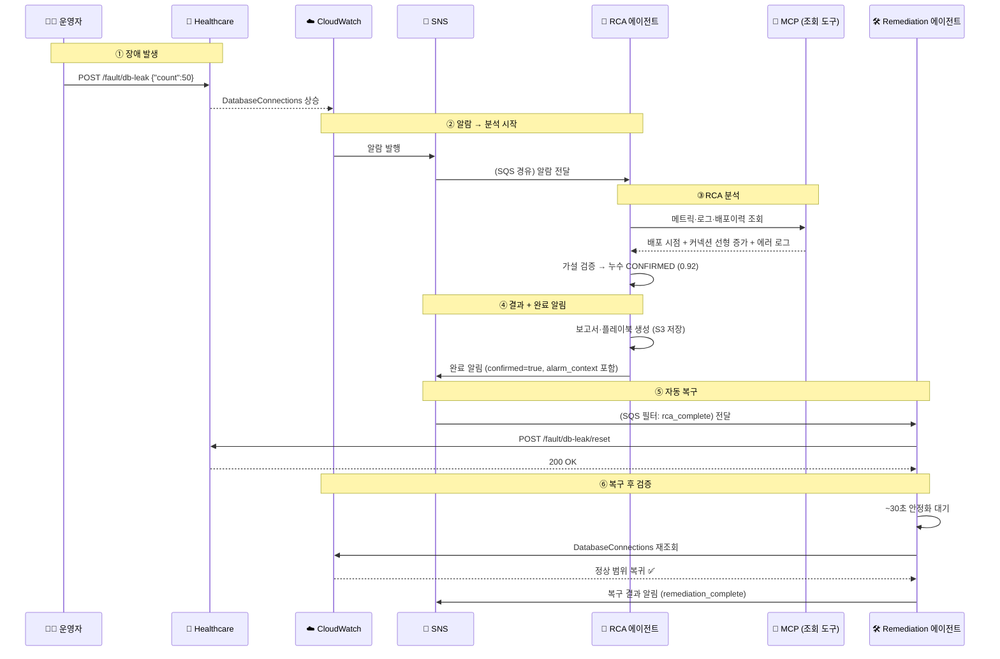

# RCA부터 자동 복구까지 — 전체 흐름 가이드

> 주니어 엔지니어를 위한 설명서. CloudWatch 알람 하나가 어떻게 자동 분석되고,
> 보고서가 만들어지고, 최종적으로 자동 복구까지 이어지는지를 **하나의 예시
> (DB 커넥션 누수)**를 따라가며 설명합니다.

이 문서를 다 읽으면 다음 질문에 답할 수 있습니다.

- 알람이 뜨면 누가 먼저 받나요? 어디로 흐르나요?
- RCA 에이전트는 "분석"을 구체적으로 어떻게 하나요?
- 분석이 끝나면 자동으로 장애를 고치나요? 누가 고치나요?
- 왜 분석과 복구를 **다른 서비스**로 나눴나요?

---

## 0. 한 장으로 보는 전체 그림

먼저 큰 그림부터 봅시다. 알람에서 시작해 복구까지 **4개의 큰 단계**가 있습니다.



여기서 **가장 중요한 개념 한 가지**: 분석하는 에이전트와 복구하는 에이전트는
**서로 다른 서비스**입니다. RCA 에이전트는 "무엇이 문제인지" 알아내기만 하고,
실제로 장애를 고치는 건 별도의 Remediation 에이전트가 담당합니다.

> 왜 나눴는지는 [7장](#7-왜-분석과-복구를-나눴을까)에서 자세히 설명합니다.
> 지금은 "읽기(분석)와 쓰기(복구)를 분리했다"고만 기억하세요.

---

## 1. 등장인물 소개

흐름을 따라가기 전에, 누가 무슨 일을 하는지 먼저 알아둡시다.



| 등장인물 | 역할 | 권한 |
|----------|------|------|
| **CloudWatch** | 메트릭이 임계치를 넘으면 알람 발생 | — |
| **SNS Topic** | 알람/완료 이벤트를 여러 구독자에게 팬아웃 | — |
| **SQS 큐** | 각 에이전트가 자기 큐를 폴링해 이벤트 소비 | — |
| **RCA 에이전트** | 알람을 분석해 근본원인·보고서·플레이북 생성 | **읽기 전용** (메트릭/로그/배포이력 조회) |
| **Remediation 에이전트** | 확정된 근본원인에 맞춰 복구 액션 실행 | **쓰기** (리셋 API 호출, ECS 재배포) |
| **Healthcare 서비스** | 데모용 대상 앱. 장애를 주입/리셋할 수 있음 | — |

> 💡 **핵심**: RCA 에이전트에는 쓰기 권한이 아예 없습니다. 코드를 잘못 짜서
> 실수로 서비스를 건드릴 위험 자체를 없앤 겁니다. 복구 권한은 Remediation
> 에이전트에만 부여합니다.

---

## 2. 예시 장애 소개 — DB 커넥션 누수

이 문서 전체에서 다음 시나리오를 따라갑니다.

> **상황**: Healthcare 서비스가 DB 커넥션을 열고 반환하지 않는 버그(누수)가
> 있습니다. 시간이 지날수록 커넥션이 쌓이고, 결국 커넥션 풀이 고갈되어
> 서비스가 응답하지 못합니다.

데모에서는 이 장애를 API로 직접 주입합니다.

```bash
# 장애 주입: 커넥션 50개를 열고 반환하지 않음
POST http://<healthcare-host>:8000/fault/db-leak  {"count": 50}

# 나중에 복구할 때 쓰는 리셋 API
POST http://<healthcare-host>:8000/fault/db-leak/reset
```

커넥션이 쌓이면 `AWS/RDS`의 `DatabaseConnections` 메트릭이 올라가고,
임계치(예: 30개)를 넘으면 CloudWatch 알람이 울립니다. 여기서 우리 흐름이 시작됩니다.

---

## 3. 1단계 — 알람이 뜨고 RCA 에이전트가 받기까지

알람이 발생하면 곧장 에이전트로 가지 않습니다. **SNS → SQS**를 거칩니다.



**왜 SNS와 SQS를 거칠까요?**

- **SNS(팬아웃)**: 알람 하나를 여러 구독자에게 동시에 뿌립니다. 지금 우리
  시스템은 같은 알람을 두 종류의 RCA 엔진(Strands / CC Headless)이 각자
  분석합니다. SNS 덕분에 알람 소스는 구독자가 몇 개든 신경 쓸 필요가 없습니다.
- **SQS(버퍼)**: 에이전트가 바쁘거나 잠깐 죽어도 메시지가 큐에 남습니다.
  처리에 실패하면 다시 시도하고, 계속 실패하면 DLQ(Dead Letter Queue)로
  보관합니다. 이벤트를 잃지 않기 위한 안전장치입니다.

에이전트는 큐를 **Long Polling**으로 계속 지켜보다가, 메시지가 오면 꺼내서
분석을 시작하고 DynamoDB에 세션을 만듭니다(중복 알람이면 여기서 걸러집니다).

---

## 4. 2단계 — RCA 에이전트의 분석 (핵심)

이제 진짜 분석입니다. RCA 에이전트는 사람 SRE가 하던 일을 흉내 냅니다:
**메트릭 보고 → 가설 세우고 → 증거 모아 검증 → 확정.**



우리 DB 누수 예시로 각 단계가 실제로 어떻게 흘러가는지 봅시다.



증거를 모아 보니 **가설 A(배포 결함으로 인한 커넥션 누수)**가 confidence
0.92로 확정(CONFIRMED)되었습니다. 트래픽 급증과 RDS 문제는 반증되어
기각(REJECTED)되었습니다.

> 📌 **주니어가 헷갈리는 지점**: RCA 에이전트는 여기까지만 합니다.
> "누수가 원인이다"라고 **알아내기만** 하고, 커넥션을 정리하거나 서비스를
> 재시작하지는 **않습니다**. 실제 복구는 다음 단계에서 다른 에이전트가 합니다.

---

## 5. 3단계 — 보고서, 플레이북, 그리고 "완료 알림"

분석이 끝나면 RCA 에이전트는 세 가지 산출물을 만듭니다.

1. **보고서(report.md)** — 사람이 읽는 한글 RCA 문서. S3에 저장됩니다.
2. **플레이북(playbook.json)** — 재사용 가능한 대응 절차. 다음에 비슷한 장애가
   오면 검색해서 재활용합니다.
3. **완료 알림** — SNS로 발행하는 이벤트. **여기에 복구에 필요한 정보가 들어갑니다.**

이 완료 알림이 바로 RCA 에이전트와 Remediation 에이전트를 잇는 **다리**입니다.
알림 메시지에는 이런 내용이 담깁니다(예시).

```json
{
  "rca_id": "a1b2c3d4-...",
  "confirmed": true,
  "root_cause": "배포된 코드가 DB 커넥션을 반환하지 않아 풀이 고갈됨",
  "root_cause_summary": "database connection pool exhausted",
  "playbook": {
    "failure_type": "db_connection_leak",
    "temporary_mitigation": "누수 커넥션 정리 (fault reset)",
    "verification_steps": ["DatabaseConnections가 정상 범위로 복귀 확인"]
  },
  "alarm_context": {
    "alarm_name": "RcaAgentDev-Healthcare-RdsHighConnections",
    "namespace": "AWS/RDS",
    "metric_name": "DatabaseConnections",
    "threshold": 30.0
  }
}
```

각 필드가 왜 필요한지 봅시다.

| 필드 | 용도 |
|------|------|
| `confirmed` | **true일 때만** 자동 복구를 시도합니다. 원인이 불확실하면 사람에게 넘깁니다. |
| `root_cause` | 어떤 복구 액션을 고를지 판단하는 근거 (예: "커넥션 누수" → 리셋 API) |
| `playbook` | 복구 절차와 검증 단계의 힌트 |
| `alarm_context` | 복구 **후 검증**에서 어떤 메트릭을 다시 확인할지 알려줌 |

> 💡 왜 `alarm_context`를 알림에 실어 보낼까요? Remediation 에이전트는 별도
> 서비스라, 원래 알람이 어떤 메트릭이었는지 모릅니다. 복구 후 "정말 나아졌나"를
> 확인하려면 그 메트릭 정보가 필요하므로, RCA 에이전트가 알림에 함께 넣어 줍니다.

---

## 6. 4단계 — Remediation 에이전트의 복구와 검증

이제 복구 담당입니다. Remediation 에이전트는 자기 전용 SQS 큐를 폴링하다가
**"RCA 완료" 이벤트**를 받으면 움직입니다.



**복구 액션은 어떻게 고를까요?** 근본원인 텍스트와 플레이북을 보고 규칙으로
매칭합니다(MVP 범위).

| 근본원인 패턴 | 복구 액션 |
|---------------|-----------|
| 커넥션 누수 · 풀 소진 | `POST /fault/db-leak/reset` |
| 높은 CPU · CPU 급등 | `POST /fault/high-cpu/reset` |
| 메모리 부족 · OOM | `POST /fault/high-memory/reset` |
| 느린 쿼리 · 읽기 지연 | `POST /fault/slow-query/reset` |
| (적합한 리셋 API 없음) | ECS 강제 새 배포 = 롤링 재시작/롤백 |

우리 예시는 "커넥션 누수"이므로 `/fault/db-leak/reset`을 호출합니다. 호출 후
바로 "복구 완료"라고 하지 않고, **약 30초 기다렸다가** 원래 알람 메트릭
(`DatabaseConnections`)을 다시 조회해 정말 정상으로 돌아왔는지 확인합니다.
이 검증에 앞서 받은 `alarm_context`가 쓰입니다.

### ⚠️ 무한 루프를 막는 장치

여기서 미묘한 함정이 하나 있습니다. Remediation 에이전트도 마지막에 SNS로
"복구 결과"를 발행합니다. 그런데 이 알림이 **자기 큐로 되돌아오면** 무한 루프가
됩니다(복구 → 알림 → 복구 → 알림 …).

이걸 막기 위해 **메시지에 꼬리표(`event_type`)를 붙이고, 큐는 특정 꼬리표만
받도록 필터**를 겁니다.



Remediation 큐는 `event_type=rca_complete`인 메시지만 구독합니다. 복구 결과
알림(`remediation_complete`)은 필터에서 걸려 큐로 들어오지 못하므로 루프가
생기지 않습니다. 대신 이 결과 알림은 SRE/대시보드가 소비합니다.

---

## 7. 왜 분석과 복구를 나눴을까?

이 아키텍처에서 가장 자주 나오는 질문입니다. RCA 에이전트가 분석 직후 바로
복구까지 하면 코드도 짧고 빠를 텐데, 왜 굳이 서비스를 둘로 나눴을까요?



| 이유 | 설명 |
|------|------|
| **권한 최소화** | 분석 서비스에 쓰기 권한을 안 줌 → 실수/버그로 인한 사고 원천 차단 |
| **장애 격리** | 복구가 실패해도 RCA 분석 결과(보고서)는 멀쩡하게 남음 |
| **독립 배포** | 복구 정책을 바꿔도 RCA 에이전트는 건드리지 않음 |
| **점진적 활성화** | Remediation 에이전트를 아예 안 켜면, 기존처럼 "분석 + 알림"까지만 동작 |

마지막 항목이 중요합니다. Remediation 에이전트는 **피처 플래그**로 켜고 끕니다
(ECS desired count `0` = 꺼짐, `1` = 켜짐). 기본값은 **꺼짐**입니다.



즉, RCA 에이전트는 **항상** 완료 알림을 발행하고, 그 알림을 받아 복구할
에이전트가 켜져 있느냐 없느냐만 다릅니다. 알림 발행 로직은 그대로 두고
수신자만 붙였다 뗐다 할 수 있는 구조입니다.

---

## 8. 처음부터 끝까지 — 전체 시퀀스

지금까지 조각조각 본 것을 하나의 시퀀스로 이어 봅시다. (Remediation이 켜진
상태 기준)



---

## 9. 자주 나오는 질문 (FAQ)

**Q. RCA 에이전트가 원인을 못 찾으면 복구는 안 되나요?**
네. 완료 알림의 `confirmed`가 `false`면 Remediation 에이전트는 복구를
건너뛰고 사람 검토로 넘깁니다. 불확실한 원인에 함부로 쓰기 액션을 실행하지
않기 위한 안전장치입니다.

**Q. CC Headless 엔진은 복구를 하나요?**
아니요. CC Headless 엔진은 복구 "권고"와 검증 "계획"만 문서로 작성하고, 실제
실행은 하지 않습니다(도구 권한 자체가 읽기 전용). 두 RCA 엔진 모두 실행은
Remediation 에이전트에 맡깁니다.

**Q. 복구 액션이 실패하면요?**
복구 결과 알림에 실패로 기록되어 SRE에게 전달됩니다. 복구 실패는 RCA 세션과
분리되어 있으므로, 이미 만들어진 보고서에는 영향을 주지 않습니다. 메시지 처리
자체가 반복 실패하면 SQS DLQ로 보관됩니다.

**Q. 리셋 API로 못 고치는 장애는요?**
근본원인에 맞는 리셋 API가 없으면 ECS 강제 새 배포(롤링 재시작/롤백)를 대체
액션으로 선택합니다.

**Q. 같은 알람이 여러 번 오면 중복 복구되지 않나요?**
RCA 세션은 멱등성 키로 중복을 거릅니다. 그리고 복구 액션(리셋 API, 강제 배포)은
여러 번 실행해도 안전하도록(멱등) 설계되어 있습니다.

---

## 10. 관련 문서

- [시스템 운영 가이드](./system-guide-for-ops.md) — 인프라·데모 시나리오 전반
- [아키텍처 & 데모 흐름](./architecture-and-demo-flow.md) — 9단계 파이프라인 상세
- 자동 복구의 실행 경계·안전 정책과 완료 알림 발행 결정은 해당 ADR 본문을
  참조하라 (ADR 인덱스: `.mapping.json`)
