# RCA Agent 시스템 운영 가이드

> 주니어 DevOps 운영팀원을 위한 시스템 아키텍처, 데이터 흐름, 데모 시나리오 안내 문서

## 목차

1. [시스템이 하는 일](#1-시스템이-하는-일)
2. [전체 아키텍처](#2-전체-아키텍처)
3. [AWS 인프라 구성](#3-aws-인프라-구성)
4. [데이터 흐름 — 알람부터 보고서까지](#4-데이터-흐름--알람부터-보고서까지)
5. [두 가지 RCA 엔진 비교](#5-두-가지-rca-엔진-비교)
6. [Fargate 엔진 — 12단계 파이프라인](#6-fargate-엔진--12단계-파이프라인)
7. [CC Headless 엔진 — ECS Fargate](#7-cc-headless-엔진--ecs-fargate)
8. [MCP 서버 — 외부 데이터 수집 도구](#8-mcp-서버--외부-데이터-수집-도구)
9. [Healthcare Sensor App — 데모용 서비스](#9-healthcare-sensor-app--데모용-서비스)
10. [데모 시나리오 1: DB 커넥션 누수](#10-데모-시나리오-1-db-커넥션-누수)
11. [데모 시나리오 2: CPU 과부하](#11-데모-시나리오-2-cpu-과부하)
12. [데모 시나리오 3: Slow Query](#12-데모-시나리오-3-slow-query)
13. [세션 상태와 DynamoDB](#13-세션-상태와-dynamodb)
14. [장애 대응 체크리스트](#14-장애-대응-체크리스트)
15. [부록: 데모 실행 가이드](#15-부록-데모-실행-가이드)

---

## 1. 시스템이 하는 일

CloudWatch 알람이 발생하면, AI 에이전트가 **자동으로 근본원인분석(RCA)**을 수행합니다.

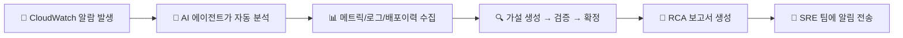

**핵심 가치**: 장애 발생 시 SRE가 직접 CloudWatch 콘솔을 뒤지고, 로그를 검색하고, 배포 이력을 추적하는 작업을 AI가 대신 수행합니다. 보통 30분~1시간 걸리는 초기 분석을 **1~5분** 내에 자동 완료합니다.

---

## 2. 전체 아키텍처

이 시스템은 **동일한 알람에 대해 두 가지 독립적인 RCA 엔진**이 동시에 분석을 수행하는 **Dual-Stack** 구조입니다.

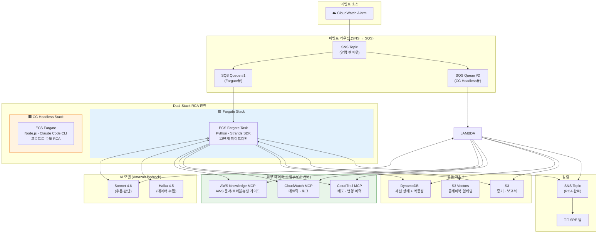

**왜 두 개의 엔진을 사용하나요?**

| | Fargate (Strands) | Fargate (CC Headless) |
|---|---|---|
| 장점 | 정교한 12단계 분석, 플레이북 학습 | 프롬프트 주도로 유연, 코드 간단 |
| 단점 | 항시 실행, 비용 발생 | 동작이 덜 예측 가능 |
| 용도 | 정밀 분석이 필요한 복잡한 장애 | 빠른 초기 대응, 간단한 장애 |

---

## 3. AWS 인프라 구성

전체 인프라는 AWS CDK로 관리되며, 9개의 스택으로 구성됩니다.

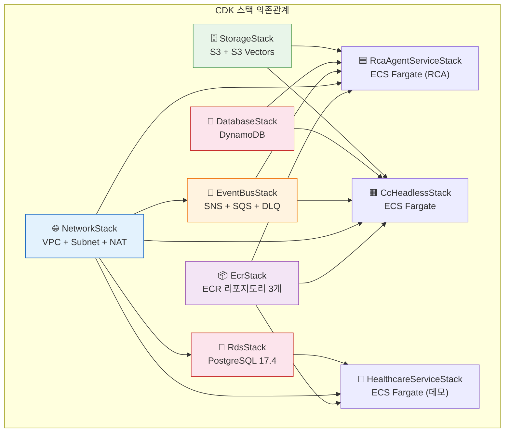

### 주요 리소스 요약

| 리소스 | 용도 | 스펙 |
|--------|------|------|
| **VPC** | 모든 서비스의 네트워크 | Public + Private Subnet, NAT Gateway |
| **SNS (알람 수신)** | CloudWatch 알람 팬아웃 | 1개 토픽 → 2개 SQS로 분배 |
| **SQS (Fargate용)** | Fargate Long Polling | visibility=25분, retention=4일, DLQ 연결 |
| **SQS (CC Headless용)** | CC Headless Long Polling | visibility=35분, retention=4일, DLQ 연결 |
| **DynamoDB** | RCA 세션 상태 관리 | PAY_PER_REQUEST, PITR, TTL, GSI(멱등성) |
| **S3 (Evidence)** | 수집 증거 + 보고서 저장 | 60일 lifecycle, S3 managed encryption |
| **S3 Vectors** | 플레이북 임베딩 검색 | cosine 유사도, 1024차원 벡터 |
| **ECS Fargate** | RCA Agent + Healthcare App | ARM64, 1vCPU, 2GB RAM |
| **ECS Fargate (CC Headless)** | CC Headless RCA | ARM64, 1vCPU, 2GB RAM |
| **RDS PostgreSQL** | Healthcare 센서 데이터 | PostgreSQL 17.4 |
| **ECR** | Docker 이미지 레지스트리 | rca-agent, cc-headless, healthcare 3개 |

---

## 4. 데이터 흐름 — 알람부터 보고서까지

하나의 CloudWatch 알람이 발생했을 때 시스템 전체를 관통하는 데이터 흐름입니다.

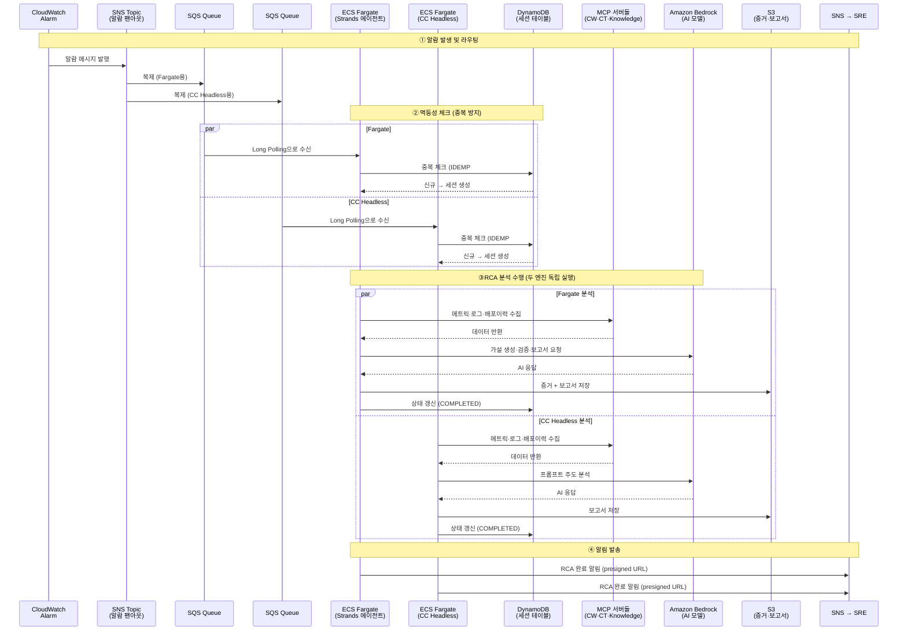

**핵심 포인트**:
- SNS 팬아웃으로 **하나의 알람이 두 SQS 큐에 동시 전달**됩니다
- 각 엔진은 **DynamoDB IDEMP# 키**로 같은 알람을 중복 처리하지 않습니다 (자기 엔진 내에서)
- 두 엔진은 서로 독립적으로 동작하며, `engine` 필드(`strands` vs `cc-headless`)로 구분됩니다
- 보고서는 **S3 presigned URL**로 SRE 팀에 전달됩니다

---

## 5. 두 가지 RCA 엔진 비교

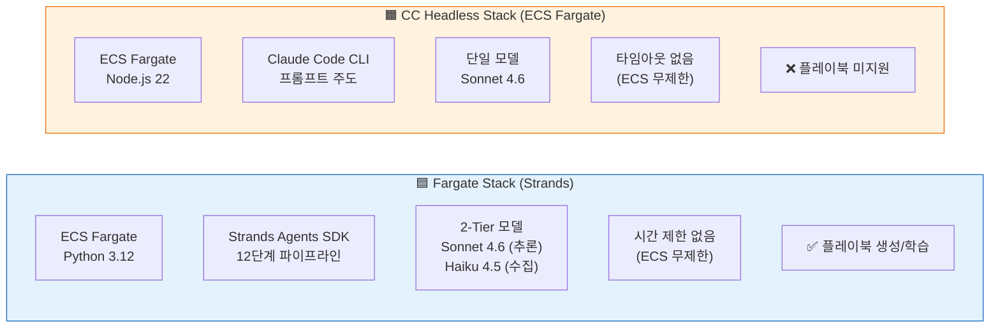

| 항목 | Fargate (Strands) | Fargate (CC Headless) |
|------|-------------------|---------------------|
| **실행 환경** | ECS Fargate (항시 실행) | ECS Fargate (항시 실행) |
| **에이전트 프레임워크** | Strands Agents SDK (Python) | Claude Code CLI (Node.js) |
| **RCA 방식** | 12단계 파이프라인 (코드로 정의) | 프롬프트에 워크플로우 정의, CC가 자율 실행 |
| **AI 모델** | Sonnet 4.6 + Haiku 4.5 (2-Tier) | Sonnet 4.6 (단일) |
| **분석 깊이** | 가설 트리 탐색 (depth 최대 5) | 프롬프트 기반 (depth 최대 3) |
| **플레이북** | 생성 + S3 Vectors 인덱싱 | 미지원 |
| **이벤트 수신** | SQS Long Polling | SQS Long Polling |
| **타임아웃** | 없음 (종료조건 기반) | 없음 (ECS 무제한) |
| **동시성** | Fargate 태스크 스케일링 | Fargate 태스크 스케일링 |
| **비용 모델** | 항시 실행 비용 | 항시 실행 비용 |

---

## 6. Fargate 엔진 — 12단계 파이프라인

Strands SDK 기반 Fargate 엔진은 RCA를 체계적인 12단계로 수행합니다.

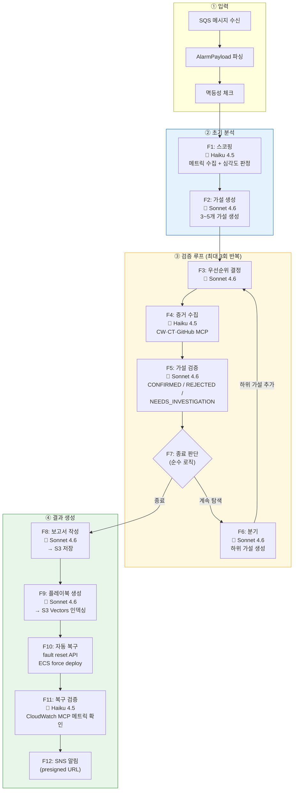

### 종료 조건 (5가지 중 하나라도 충족 시 종료)

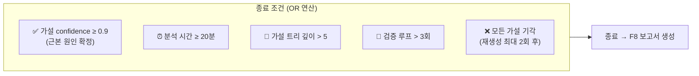

### 2-Tier 모델 아키텍처

비용과 성능을 최적화하기 위해 두 가지 모델 티어를 사용합니다.

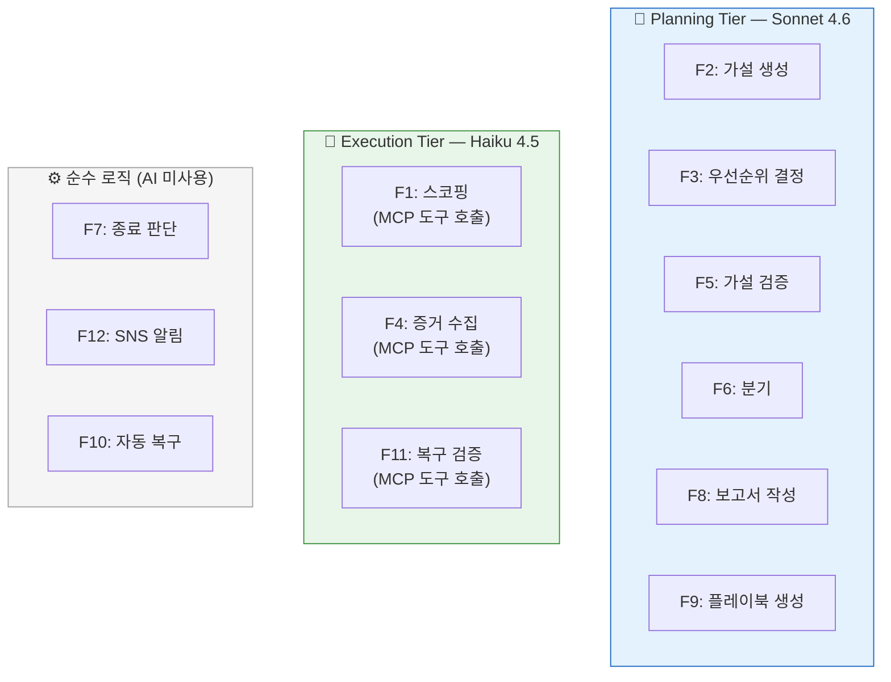

- **Planning Tier** (Sonnet 4.6): 추론·판단이 필요한 단계 → 고성능 모델, 비용 높음
- **Execution Tier** (Haiku 4.5): 도구 호출·데이터 수집 → 가벼운 모델, 비용 낮음, 응답 빠름
- **순수 로직**: AI 불필요 → 코드로 직접 처리

---

## 7. CC Headless 엔진 — ECS Fargate

Claude Code CLI를 ECS Fargate에서 headless 모드로 실행하여, 프롬프트 하나로 전체 RCA를 수행합니다.

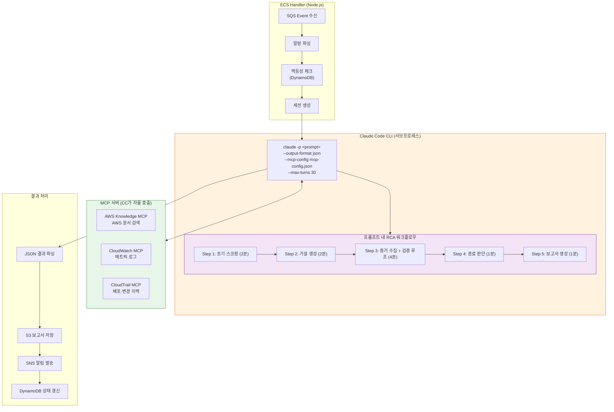

**Fargate와의 차이점**:
- Fargate는 각 단계를 **Python 코드로** 명시적으로 구현
- CC Headless는 모든 단계를 **프롬프트로 설명**하고, Claude Code가 자율적으로 실행
- 따라서 CC Headless 엔진은 코드가 훨씬 간단하지만, 동작이 덜 예측 가능함

---

## 8. MCP 서버 — 외부 데이터 수집 도구

MCP(Model Context Protocol)는 AI 에이전트가 외부 서비스의 데이터를 조회할 수 있게 해주는 프로토콜입니다.

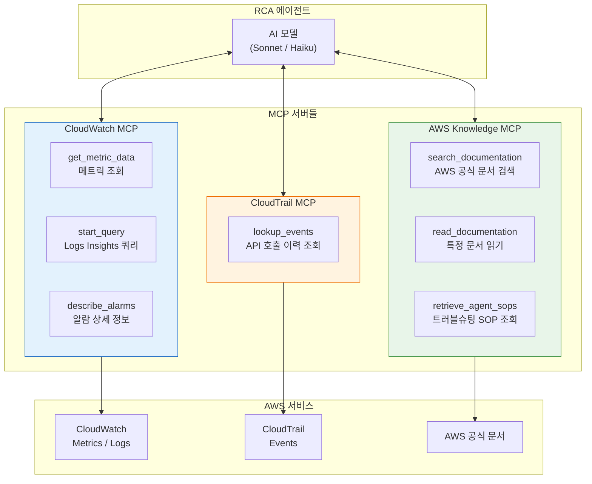

### MCP 서버 설치 방식

| MCP 서버 | 실행 방식 | 비고 |
|----------|----------|------|
| AWS Knowledge | `uvx fastmcp run https://...` (stdio) | AWS 공식 문서/SOP 검색 |
| CloudWatch | `uvx --from awslabs-cloudwatch-mcp-server awslabs.cloudwatch-mcp-server` (stdio) | 메트릭·로그 조회 |
| CloudTrail | `uvx --from awslabs-cloudtrail-mcp-server awslabs.cloudtrail-mcp-server` (stdio) | 배포·변경 이력 |
| GitHub | `github-mcp-server stdio` (Go 바이너리, 컨테이너 내장) | 커밋 diff·PR 조회 |

AWS 관련 MCP 서버는 `uvx` (Python 패키지 런처)로 실행됩니다. GitHub MCP 서버는 Go 바이너리로, Docker 이미지 빌드 시 GitHub Releases에서 다운로드하여 포함합니다.

---

## 9. Healthcare Sensor App — 데모용 서비스

RCA 에이전트의 정확도를 검증하기 위한 **의도적으로 장애를 주입할 수 있는** 데모 서비스입니다.

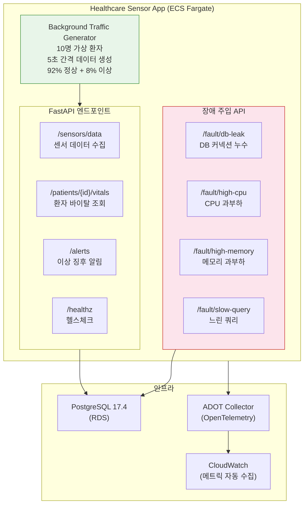

### 장애 주입 API 목록

| 엔드포인트 | 동작 | CloudWatch 알람 트리거 |
|-----------|------|----------------------|
| `POST /fault/db-leak` | DB 커넥션을 열고 닫지 않음 | RDS DatabaseConnections 급증 |
| `POST /fault/db-leak/reset` | 누수된 커넥션 정리 | — |
| `POST /fault/high-cpu` | CPU 집중 작업 실행 | ECS CPUUtilization 급증 |
| `POST /fault/high-cpu/reset` | CPU 부하 중지 | — |
| `POST /fault/high-memory` | 메모리 대량 할당 | ECS MemoryUtilization 급증 |
| `POST /fault/high-memory/reset` | 할당 메모리 해제 | — |
| `POST /fault/slow-query` | 의도적으로 느린 쿼리 실행 | RDS ReadLatency 급증 |
| `POST /fault/slow-query/reset` | 느린 쿼리 중지 | — |

> **참고**: `high-cpu`와 `slow-query` 장애는 명시적으로 reset 호출할 때까지 지속됩니다.

> **Cloud Map DNS**: VPC 내부에서 `healthcare.rcaagentdev.local`로 접근할 수 있습니다.

### RCA 대시보드

`packages/dashboard`에 Nuxt.js 기반 로컬 전용 대시보드가 있습니다. DynamoDB 세션 목록과 S3 보고서를 조회할 수 있습니다.

```bash
cd packages/dashboard
pnpm dev   # http://localhost:3100
```

---

## 10. 데모 시나리오 1: DB 커넥션 누수

가장 대표적인 데모 시나리오입니다. DB 커넥션을 누수시켜 장애를 발생시키고, RCA 에이전트가 이를 자동 분석합니다.

### 전체 흐름

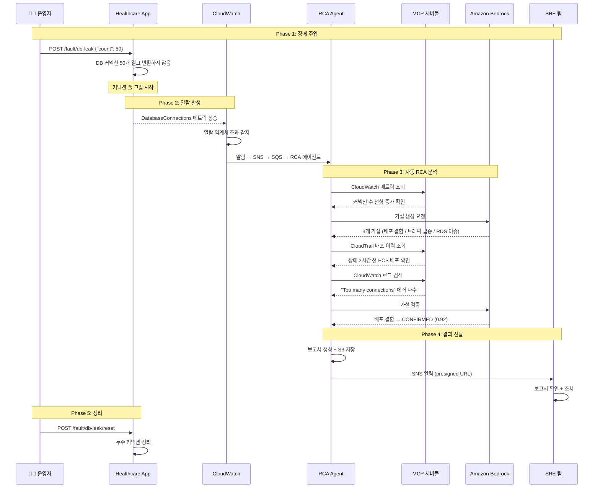

### RCA 에이전트가 실제로 수행하는 분석

```mermaid
graph TD
    subgraph Scoping["① 스코핑"]
        S1["DatabaseConnections 메트릭 조회 (30분)"]
        S2["Latency, ErrorRate 메트릭 조회"]
        S3["심각도 판정: HIGH<br/>영향 범위: 서비스 전체"]
    end

    subgraph Hypothesis["② 가설 생성"]
        H_A["가설 A: 최근 배포 코드 결함<br/>confidence: 0.7"]
        H_B["가설 B: 트래픽 급증<br/>confidence: 0.5"]
        H_C["가설 C: RDS 인스턴스 문제<br/>confidence: 0.4"]
    end

    subgraph Evidence["③ 증거 수집"]
        E_A1["CloudTrail: 2시간 전 ECS 배포 확인 ✅"]
        E_A2["CloudWatch: 배포 시점부터 커넥션 선형 증가 ✅"]
        E_A3["CloudWatch Logs: Too many connections ✅"]
        E_B1["CloudWatch: RequestCount 평소 수준 ❌"]
        E_C1["CloudWatch: FreeStorageSpace/CPU 정상 ❌"]
    end

    subgraph Validation["④ 검증 결과"]
        V_A["가설 A: NEEDS_INVESTIGATION (0.75)<br/>배포 관련이지만 구체적 결함 미확인"]
        V_B["가설 B: REJECTED (0.1)"]
        V_C["가설 C: REJECTED (0.15)"]
    end

    subgraph Branch["⑤ 분기 (가설 A 세분화)"]
        B1["A-1: 커넥션 풀 설정 변경"]
        B2["A-2: 코드에서 커넥션 미반환 (누수)"]
    end

    subgraph Final["⑥ 최종 검증"]
        F1["A-1: REJECTED (풀 설정 변경 없음)"]
        F2["A-2: CONFIRMED ✅ (confidence: 0.92)<br/>배포 시점 + 선형 증가 + 에러 패턴 일치"]
    end

    Scoping --> Hypothesis --> Evidence --> Validation --> Branch --> Final

    style Final fill:#e8f5e9,stroke:#388e3c
```

---

## 11. 데모 시나리오 2: CPU 과부하

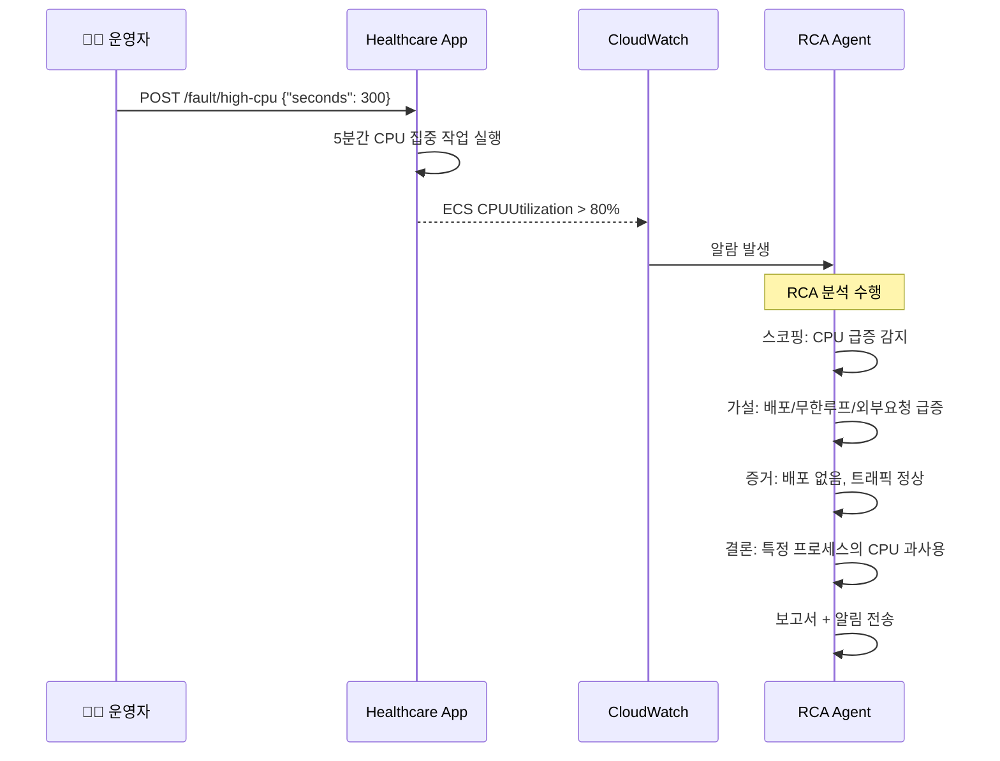

이 시나리오에서 RCA 에이전트는:
- CloudWatch 메트릭에서 CPU 급증 시점 확인
- CloudTrail에서 최근 배포/변경 없음 확인
- 트래픽 패턴 정상 확인
- "특정 프로세스의 비정상적 CPU 사용" 으로 결론

---

## 12. 데모 시나리오 3: Slow Query

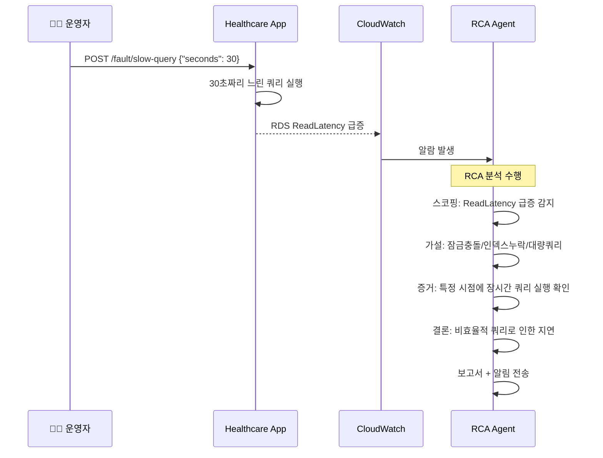

---

## 13. 세션 상태와 DynamoDB

RCA 세션의 생명주기를 DynamoDB에서 추적합니다. 두 엔진 모두 같은 테이블을 공유합니다.

### Fargate 세션 상태 전이

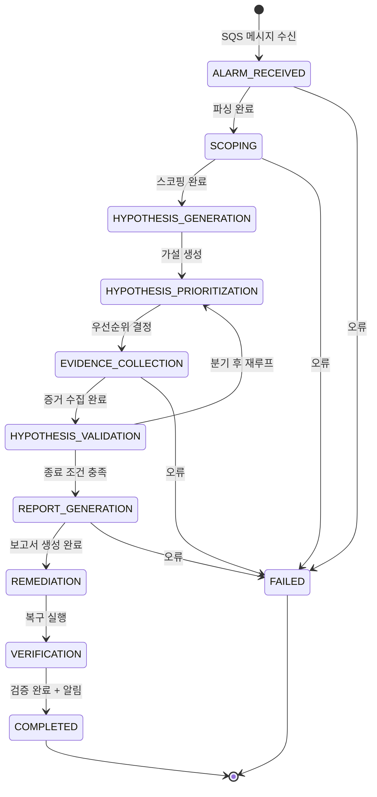

### CC Headless 세션 상태 전이

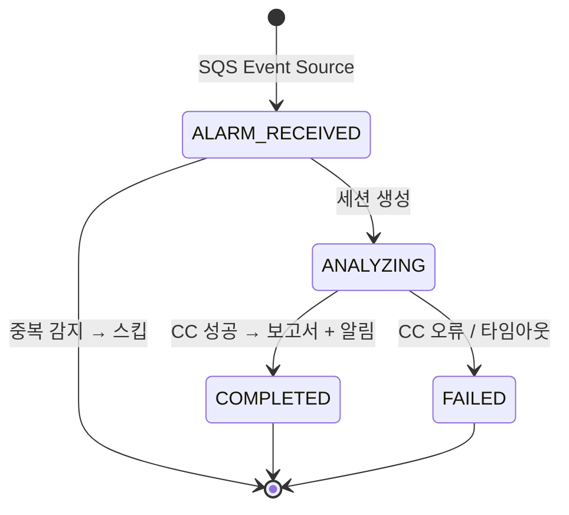

### DynamoDB 테이블 구조

| 키 | 설명 | 예시 |
|----|------|------|
| `PK` (Partition Key) | `RCA#{rca_id}` | `RCA#a1b2c3d4-...` |
| `SK` (Sort Key) | `SESSION` | `SESSION` |
| `engine` | 실행 엔진 구분 | `strands` 또는 `cc-headless` |
| `state` | 현재 상태 | `ANALYZING`, `COMPLETED`, `FAILED` |
| `alarm_name` | 알람 이름 | `HighDatabaseConnections` |
| `idempotency_key` | 중복 방지 키 | `AlarmName#2026-04-23T10:00:00Z` |
| `ttl` | 자동 삭제 시간 | 30일 후 |

---

## 14. 장애 대응 체크리스트

RCA 에이전트 시스템 자체에 문제가 생겼을 때 확인할 사항입니다.

### RCA가 동작하지 않을 때

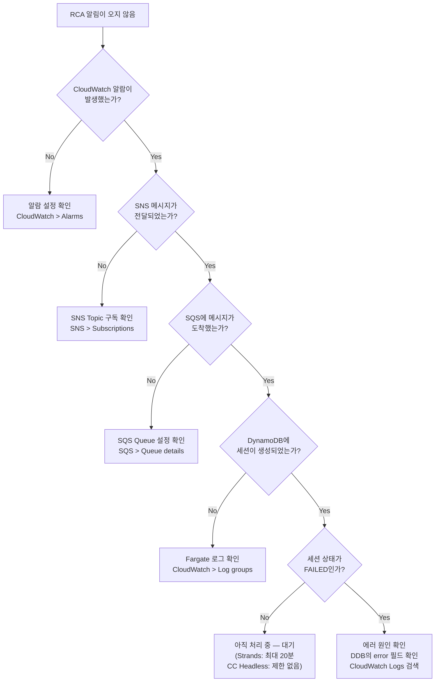

### 확인할 CloudWatch Log Groups

| 서비스 | Log Group | 확인 사항 |
|--------|-----------|----------|
| Fargate RCA Agent | `/ecs/rca-agent-*` | MCP 연결 실패, Bedrock API 오류 |
| Fargate CC Headless | `/ecs/*/cc-headless` | CC CLI 오류 |
| Healthcare App | `/ecs/healthcare-*` | 장애 주입 동작, 트래픽 생성기 |
| SQS DLQ | DLQ 메시지 수 | 처리 실패한 알람 메시지 |

### 일반적인 문제와 해결책

| 증상 | 원인 | 해결 |
|------|------|------|
| MCP 서버 연결 실패 | uvx 패키지 다운로드 실패 | NAT Gateway/인터넷 연결 확인 |
| CC CLI 0초 완료 | HOME 디렉토리 미설정 | 컨테이너 환경변수 HOME=/tmp 확인 |
| 중복 RCA 실행 | 멱등성 키 불일치 | DynamoDB GSI `idempotency-index` 확인 |
| Bedrock API 오류 | 리전/모델 설정 오류 | BEDROCK_REGION, MODEL_ID 환경변수 확인 |
| 보고서 S3 업로드 실패 | IAM 권한 부족 | Task Role의 S3 PutObject 권한 확인 |

---

## 15. 부록: 데모 실행 가이드

### 데모 실행 순서

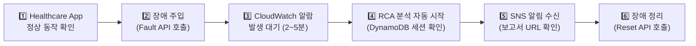

### DB 커넥션 누수 데모 실행

```bash
# 1. Healthcare App 엔드포인트 확인 (ECS Service 주소)
HEALTH_URL="http://<healthcare-service-endpoint>:8000"

# 2. 헬스체크 확인
curl $HEALTH_URL/healthz

# 3. 장애 주입: DB 커넥션 50개 누수
curl -X POST $HEALTH_URL/fault/db-leak \
  -H "Content-Type: application/json" \
  -d '{"count": 50}'

# 4. CloudWatch 알람 발생 대기 (2~5분)
# → RCA 에이전트가 자동으로 분석 시작

# 5. DynamoDB에서 세션 상태 확인
aws dynamodb scan \
  --table-name <RCA-SESSION-TABLE> \
  --filter-expression "#s = :state" \
  --expression-attribute-names '{"#s": "state"}' \
  --expression-attribute-values '{":state": {"S": "COMPLETED"}}' \
  --query 'Items[0].{rca_id:rca_id.S,state:state.S,engine:engine.S}'

# 6. 장애 정리
curl -X POST $HEALTH_URL/fault/db-leak/reset
```

### CPU 과부하 데모 실행

```bash
# CPU 부하 생성 (reset 호출 전까지 지속)
curl -X POST $HEALTH_URL/fault/high-cpu

# 장애 정리
curl -X POST $HEALTH_URL/fault/high-cpu/reset
```

### Slow Query 데모 실행

```bash
# 30초 간격 느린 쿼리 반복 실행 (reset 호출 전까지 지속)
curl -X POST $HEALTH_URL/fault/slow-query \
  -H "Content-Type: application/json" \
  -d '{"seconds": 30}'

# 장애 정리
curl -X POST $HEALTH_URL/fault/slow-query/reset
```

### RCA 보고서 확인

RCA 완료 후 SNS 알림에 포함된 S3 presigned URL로 보고서를 확인할 수 있습니다. 또는 S3에서 직접 조회합니다:

```bash
# S3에서 보고서 목록 확인
aws s3 ls s3://<REPORT-BUCKET>/reports/ --recursive

# 최신 보고서 다운로드
aws s3 cp s3://<REPORT-BUCKET>/reports/<rca_id>.md ./rca-report.md
cat rca-report.md
```
