# RCA Agent 시스템 운영 가이드

> 주니어 DevOps 운영팀원을 위한 시스템 아키텍처, 데이터 흐름, 데모 시나리오 안내 문서

## 목차

1. [시스템이 하는 일](#1-시스템이-하는-일)
2. [전체 아키텍처](#2-전체-아키텍처)
3. [AWS 인프라 구성](#3-aws-인프라-구성)
4. [데이터 흐름 — 알람부터 보고서까지](#4-데이터-흐름--알람부터-보고서까지)
5. [두 가지 RCA 엔진 비교](#5-두-가지-rca-엔진-비교)
6. [Fargate 엔진 — 9단계 파이프라인](#6-fargate-엔진--9단계-파이프라인)
7. [CC Headless 엔진 — ECS Fargate](#7-cc-headless-엔진--ecs-fargate)
8. [플레이북 실행 — 사용자 승인 게이트](#8-플레이북-실행--사용자-승인-게이트)
9. [MCP 서버 — 외부 데이터 수집 도구](#9-mcp-서버--외부-데이터-수집-도구)
10. [Healthcare Sensor App — 데모용 서비스](#10-healthcare-sensor-app--데모용-서비스)
11. [데모 시나리오 1: DB 커넥션 누수](#11-데모-시나리오-1-db-커넥션-누수)
12. [데모 시나리오 2: CPU 과부하](#12-데모-시나리오-2-cpu-과부하)
13. [데모 시나리오 3: Slow Query](#13-데모-시나리오-3-slow-query)
14. [세션 상태와 DynamoDB](#14-세션-상태와-dynamodb)
15. [장애 대응 체크리스트](#15-장애-대응-체크리스트)
16. [부록: 데모 실행 가이드](#16-부록-데모-실행-가이드)

---

## 1. 시스템이 하는 일

CloudWatch 알람이 발생하면, AI 에이전트가 **자동으로 근본원인분석(RCA)**을 수행합니다. 분석은 여기서 끝납니다 — 조치는 사람이 승인한 뒤에 별도 실행 에이전트가 수행합니다.

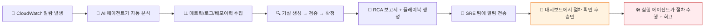
```mermaid
flowchart LR
    A["🔔 CloudWatch 알람 발생"] --> B["🤖 AI 에이전트가 자동 분석"]
    B --> C["📊 메트릭/로그/배포이력 수집"]
    C --> D["🔍 가설 생성 → 검증 → 확정"]
    D --> E["📝 RCA 보고서 + 플레이북 생성"]
    E --> F["📨 SRE 팀에 알림 전송"]
    F --> G["👤 대시보드에서 절차 확인 후 승인"]
    G --> H["🛠️ 실행 에이전트가 절차 수행 + 회고"]

    style G fill:#fff3e0,stroke:#ef6c00
    style H fill:#ffebee,stroke:#c62828
```

**핵심 가치**: 장애 발생 시 SRE가 직접 CloudWatch 콘솔을 뒤지고, 로그를 검색하고, 배포 이력을 추적하는 작업을 AI가 대신 수행합니다. 보통 30분~1시간 걸리는 초기 분석을 **1~5분** 내에 자동 완료합니다.

**분석은 아무것도 바꾸지 않습니다.** 두 RCA 엔진 모두 읽기 전용이고, 태스크 역할에 쓰기 권한이 없습니다. 조치가 실행되는 경로는 하나뿐입니다 — 사람이 대시보드에서 절차를 읽고 승인하는 것. 실행 워커는 그 승인 메시지만 소비하고 이벤트 구독을 갖지 않으므로, **승인 없이 실행이 시작될 경로가 존재하지 않습니다.**

---

## 2. 전체 아키텍처

이 시스템은 **동일한 알람에 대해 두 가지 독립적인 RCA 엔진**이 동시에 분석을 수행하는 **Dual-Stack** 구조이며, 그 뒤에 **사용자 승인 게이트와 별도 실행 스택**이 붙습니다.

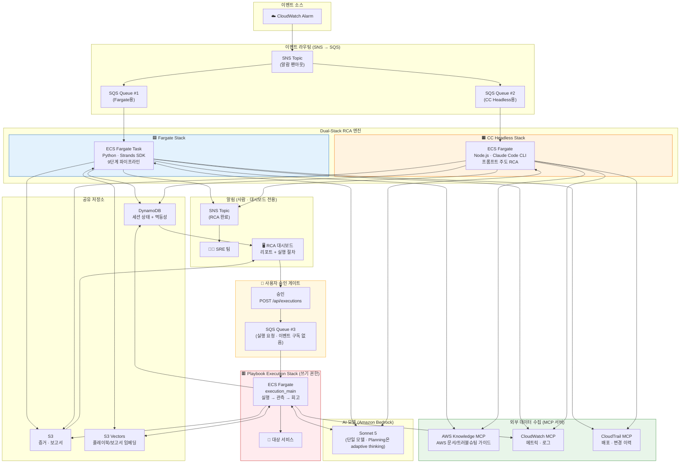
```mermaid
graph TB
    subgraph EventSource["이벤트 소스"]
        CW["☁️ CloudWatch Alarm"]
    end

    subgraph Routing["이벤트 라우팅 (SNS → SQS)"]
        SNS["SNS Topic<br/>(알람 팬아웃)"]
        SQS_F["SQS Queue #1<br/>(Fargate용)"]
        SQS_L["SQS Queue #2<br/>(CC Headless용)"]
    end

    subgraph DualStack["Dual-Stack RCA 엔진"]
        subgraph FargateStack["🟦 Fargate Stack"]
            ECS["ECS Fargate Task<br/>Python · Strands SDK<br/>9단계 파이프라인"]
        end
        subgraph CcHeadlessStack["🟧 CC Headless Stack"]
            CCFARGATE["ECS Fargate<br/>Node.js · Claude Code CLI<br/>프롬프트 주도 RCA"]
        end
    end

    subgraph Tools["외부 데이터 수집 (MCP 서버)"]
        AK["AWS Knowledge MCP<br/>AWS 문서/트러블슈팅 가이드"]
        CW_MCP["CloudWatch MCP<br/>메트릭 · 로그"]
        CT_MCP["CloudTrail MCP<br/>배포 · 변경 이력"]
    end

    subgraph LLM["AI 모델 (Amazon Bedrock)"]
        SONNET["Sonnet 5<br/>(단일 모델 · Planning은 adaptive thinking)"]
    end

    subgraph SharedStorage["공유 저장소"]
        DDB["DynamoDB<br/>세션 상태 + 멱등성"]
        S3["S3<br/>증거 · 보고서"]
        S3V["S3 Vectors<br/>플레이북/보고서 임베딩"]
    end

    subgraph Notify["알림 (사람 · 대시보드 전용)"]
        SNS_OUT["SNS Topic<br/>(RCA 완료)"]
        SRE["👩‍💻 SRE 팀"]
        DASH["🖥️ RCA 대시보드<br/>리포트 + 실행 절차"]
    end

    subgraph Gate["👤 사용자 승인 게이트"]
        APPROVE["승인<br/>POST /api/executions"]
        SQS_EXEC["SQS Queue #3<br/>(실행 요청 · 이벤트 구독 없음)"]
        APPROVE --> SQS_EXEC
    end

    subgraph ExecStack["🟥 Playbook Execution Stack (쓰기 권한)"]
        EXEC["ECS Fargate<br/>execution_main<br/>실행 → 관측 → 회고"]
        TARGET["🏥 대상 서비스"]
        EXEC --> TARGET
    end

    CW --> SNS
    SNS --> SQS_F --> ECS
    SNS --> SQS_L --> CCFARGATE

    ECS <--> SONNET
    CCFARGATE <--> SONNET

    ECS --> AK
    ECS --> CW_MCP
    ECS --> CT_MCP
    CCFARGATE --> AK
    CCFARGATE --> CW_MCP
    CCFARGATE --> CT_MCP

    ECS --> DDB
    ECS --> S3
    ECS <--> S3V
    CCFARGATE --> DDB
    CCFARGATE --> S3

    ECS --> SNS_OUT
    CCFARGATE --> SNS_OUT
    SNS_OUT --> SRE

    DDB --> DASH
    S3 --> DASH
    DASH --> APPROVE
    SQS_EXEC --> EXEC
    EXEC <--> SONNET
    EXEC --> CW_MCP
    EXEC --> DDB
    EXEC --> S3
    EXEC <--> S3V

    style FargateStack fill:#e3f2fd,stroke:#1565c0
    style CcHeadlessStack fill:#fff3e0,stroke:#ef6c00
    style Tools fill:#e8f5e9,stroke:#388e3c
    style Gate fill:#fff8e1,stroke:#f9a825
    style ExecStack fill:#ffebee,stroke:#c62828
```

**RCA 완료 알림에서 실행 스택으로 가는 화살표가 없다는 점을 보세요.** 알림은 사람과 대시보드만 소비하며 아무것도 트리거하지 않습니다. 실행으로 가는 유일한 간선은 사람의 승인입니다.

**왜 두 개의 엔진을 사용하나요?**

| | Fargate (Strands) | Fargate (CC Headless) |
|---|---|---|
| 장점 | 정교한 9단계 분석, 가설 트리 탐색, 플레이북 학습 | 프롬프트 주도로 유연, 코드 간단 |
| 단점 | 항시 실행, 비용 발생 | 동작이 덜 예측 가능 |
| 용도 | 정밀 분석이 필요한 복잡한 장애 | 빠른 초기 대응, 간단한 장애 |

두 엔진 모두 읽기 전용이고 산출물은 플레이북을 포함한 리포트 하나입니다. 어느 엔진의 리포트를 승인하더라도 실행 경로는 하나입니다.

---

## 3. AWS 인프라 구성

전체 인프라는 AWS CDK로 관리되며, 10개의 스택으로 구성됩니다.

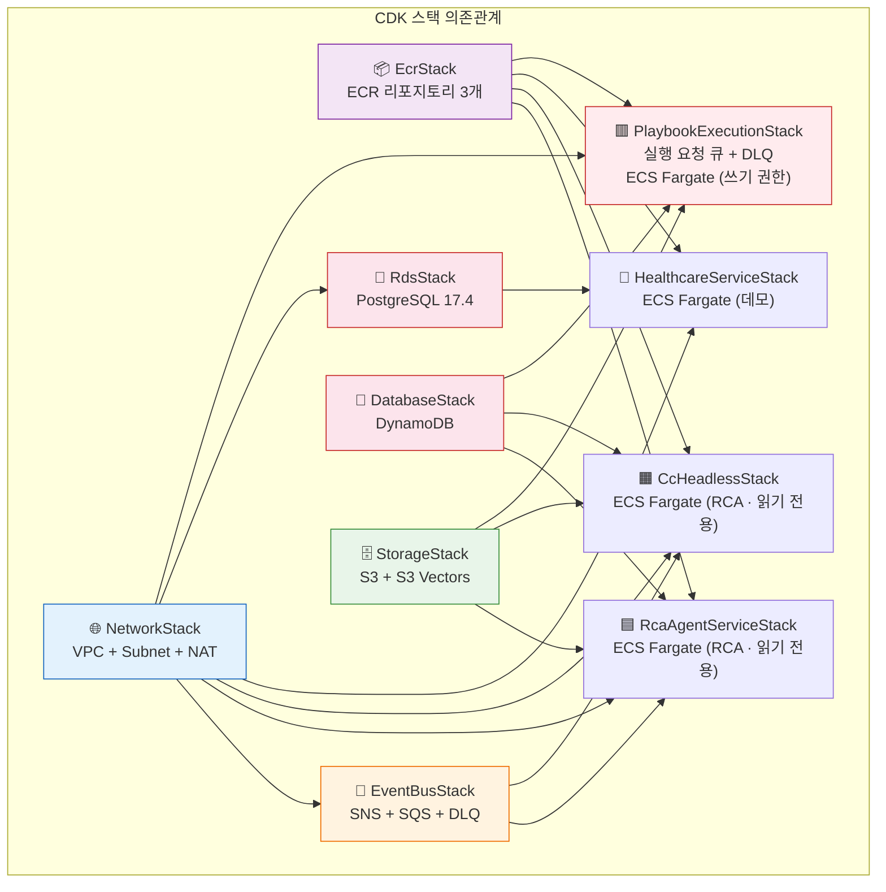
```mermaid
graph TB
    subgraph Infra["CDK 스택 의존관계"]
        ECR["📦 EcrStack<br/>ECR 리포지토리 3개"]
        NET["🌐 NetworkStack<br/>VPC + Subnet + NAT"]
        EVENT["📡 EventBusStack<br/>SNS + SQS + DLQ"]
        DB["💾 DatabaseStack<br/>DynamoDB"]
        STORAGE["🗄️ StorageStack<br/>S3 + S3 Vectors"]
        RDS["🐘 RdsStack<br/>PostgreSQL 17.4"]
        AGENT["🟦 RcaAgentServiceStack<br/>ECS Fargate (RCA · 읽기 전용)"]
        CC["🟧 CcHeadlessStack<br/>ECS Fargate (RCA · 읽기 전용)"]
        HEALTH["🏥 HealthcareServiceStack<br/>ECS Fargate (데모)"]
        EXEC["🟥 PlaybookExecutionStack<br/>실행 요청 큐 + DLQ<br/>ECS Fargate (쓰기 권한)"]
    end

    ECR --> AGENT
    ECR --> CC
    ECR --> HEALTH
    ECR --> EXEC
    NET --> EVENT
    NET --> AGENT
    NET --> CC
    NET --> HEALTH
    NET --> RDS
    NET --> EXEC
    EVENT --> AGENT
    EVENT --> CC
    DB --> AGENT
    DB --> CC
    DB --> EXEC
    STORAGE --> AGENT
    STORAGE --> CC
    STORAGE --> EXEC
    RDS --> HEALTH

    style ECR fill:#f3e5f5,stroke:#7b1fa2
    style NET fill:#e3f2fd,stroke:#1565c0
    style EVENT fill:#fff3e0,stroke:#ef6c00
    style DB fill:#fce4ec,stroke:#c62828
    style STORAGE fill:#e8f5e9,stroke:#388e3c
    style RDS fill:#fce4ec,stroke:#c62828
    style EXEC fill:#ffebee,stroke:#c62828
```

`PlaybookExecutionStack`은 `EventBusStack`에 의존하지 않습니다. 알람 토픽을 구독하지 않기 때문입니다 — 실행 요청 큐는 이 스택이 직접 소유하고 대시보드만 발행합니다.

`PlaybookExecutionStack`이 Healthcare 서비스의 보안 그룹 인그레스를 여는데, `HealthcareServiceStack`에 명시적 의존을 두면 순환 참조가 되므로 의존 선언은 하지 않습니다.

### 주요 리소스 요약

| 리소스 | 용도 | 스펙 |
|--------|------|------|
| **VPC** | 모든 서비스의 네트워크 | Public + Private Subnet, NAT Gateway |
| **SNS (알람 수신)** | CloudWatch 알람 팬아웃 | 1개 토픽 → 2개 SQS로 분배 |
| **SQS (Fargate용)** | Fargate Long Polling | visibility=25분, retention=4일, DLQ 연결 |
| **SQS (CC Headless용)** | CC Headless Long Polling | visibility=35분, retention=4일, DLQ 연결 |
| **SQS (실행 요청용)** | 대시보드 승인 발행 → 실행 워커 소비 | visibility=75분(4500초), retention=4일, DLQ 연결. 이벤트 구독 없음 |
| **DynamoDB** | RCA 세션 상태 + 실행 이력 관리 | PAY_PER_REQUEST, PITR, TTL, GSI(멱등성) |
| **S3 (Evidence)** | 수집 증거 + 보고서 + 실행 증거 + 갱신 전 플레이북 사본 | 60일 lifecycle, S3 managed encryption |
| **S3 Vectors** | 플레이북/보고서 임베딩 검색 | cosine 유사도, 1536차원 벡터 (Cohere Embed V4) |
| **ECS Fargate** | RCA Agent + Healthcare App | ARM64, 1vCPU, 2GB RAM |
| **ECS Fargate (CC Headless)** | CC Headless RCA | ARM64, 1vCPU, 2GB RAM |
| **ECS Fargate (Playbook Execution)** | 승인된 플레이북 실행 + 회고 | ARM64, 1vCPU, 2GB RAM, desiredCount 1 (상시) |
| **RDS PostgreSQL** | Healthcare 센서 데이터 | PostgreSQL 17.4 |
| **ECR** | Docker 이미지 레지스트리 | rca-agent, cc-headless, healthcare 3개 (실행 워커는 cc-headless 이미지 재사용) |

### 실행 스택의 권한 경계

`PlaybookExecutionStack`의 태스크 역할은 **시스템에서 쓰기 권한을 가진 유일한 역할**입니다. 분석 스택과 역할을 공유하지 않는데, 공유하면 분석 경로의 결함이 쓰기 권한에 닿기 때문입니다.

| 항목 | 설정 | 왜 |
|------|------|-----|
| 트리거 | 실행 요청 큐만 (SNS 구독 없음) | 승인이 곧 메시지다. 승인 없이 실행이 기동될 경로가 인프라에 없다 |
| 대상 리소스 | 제한하지 않음 | ARN으로 제한하면 플레이북의 표현력을 다시 허용 목록 안으로 되돌린다 |
| 기본 권한 | `PowerUserAccess` | 플레이북이 필요할 수 있는 넓은 조치 범위 |
| 명시적 Deny | organizations, account, billing, budgets, ce, cur, aws-portal, sso, identitystore, IAM 변경 | 실행 대상이 될 수 없는 범위. 템플릿에서 경계가 읽히게 하려고 명시한다 |
| 파괴적 조치 차단 | IAM이 아니라 **실행 도구가 수행** | 작업 이름 어휘와 IAM 액션 이름이 일대일이 아니라 정책으로는 빈틈이 생기고, 정책 거부는 무엇이 왜 막혔는지 기록하거나 그 절차를 수동 조치로 남길 수 없다 |
| visibility timeout | 4500초 > 실행 상한 3600초 | 실행 중인 요청이 재전달되어 두 번 실행되지 않게 |
| 태스크 수 | 상시 1 | 태스크 수로 기능을 여닫는 것은 트리거가 이벤트 구독이던 시절의 장치다. 승인 게이트가 있으면 큐가 이미 실행 여부를 결정한다 |

분석 스택(`CcHeadlessStack`)은 Healthcare 서비스로의 네트워크 경로도, `HEALTHCARE_*` 환경변수도 갖지 않습니다. 대상 서비스에 접근하는 것은 실행 스택뿐입니다.

---

## 4. 데이터 흐름 — 알람부터 보고서까지

하나의 CloudWatch 알람이 발생했을 때 분석 경로를 관통하는 데이터 흐름입니다. 이 흐름은 알림에서 끝나고, 조치는 8장의 승인 게이트를 거쳐 별도로 시작됩니다.

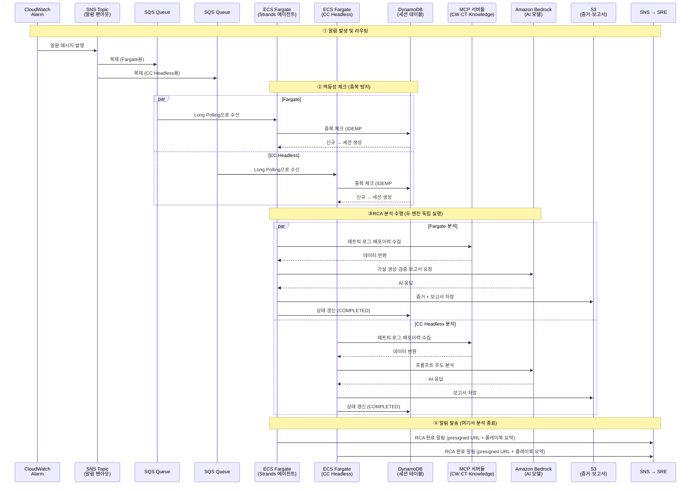
```mermaid
sequenceDiagram
    participant CW as CloudWatch<br/>Alarm
    participant SNS as SNS Topic<br/>(알람 팬아웃)
    participant SQS1 as SQS Queue #1<br/>(Fargate용)
    participant SQS2 as SQS Queue #2<br/>(CC Headless용)
    participant ECS as ECS Fargate<br/>(Strands 에이전트)
    participant CCH as ECS Fargate<br/>(CC Headless)
    participant DDB as DynamoDB<br/>(세션 테이블)
    participant MCP as MCP 서버들<br/>(CW·CT·Knowledge)
    participant BED as Amazon Bedrock<br/>(AI 모델)
    participant S3 as S3<br/>(증거·보고서)
    participant NOTIFY as SNS → SRE

    Note over CW,NOTIFY: ① 알람 발생 및 라우팅
    CW->>SNS: 알람 메시지 발행
    SNS->>SQS1: 복제 (Fargate용)
    SNS->>SQS2: 복제 (CC Headless용)

    Note over ECS,DDB: ② 멱등성 체크 (중복 방지)
    par Fargate
        SQS1->>ECS: Long Polling으로 수신
        ECS->>DDB: 중복 체크 (IDEMP# 키)
        DDB-->>ECS: 신규 → 세션 생성
    and CC Headless
        SQS2->>CCH: Long Polling으로 수신
        CCH->>DDB: 중복 체크 (IDEMP# 키)
        DDB-->>CCH: 신규 → 세션 생성
    end

    Note over ECS,BED: ③ RCA 분석 수행 (두 엔진 독립 실행)
    par Fargate 분석
        ECS->>MCP: 메트릭·로그·배포이력 수집
        MCP-->>ECS: 데이터 반환
        ECS->>BED: 가설 생성·검증·보고서 요청
        BED-->>ECS: AI 응답
        ECS->>S3: 증거 + 보고서 저장
        ECS->>DDB: 상태 갱신 (COMPLETED)
    and CC Headless 분석
        CCH->>MCP: 메트릭·로그·배포이력 수집
        MCP-->>CCH: 데이터 반환
        CCH->>BED: 프롬프트 주도 분석
        BED-->>CCH: AI 응답
        CCH->>S3: 보고서 저장
        CCH->>DDB: 상태 갱신 (COMPLETED)
    end

    Note over ECS,NOTIFY: ④ 알림 발송 (여기서 분석 종료)
    ECS->>NOTIFY: RCA 완료 알림 (presigned URL + 플레이북 요약)
    CCH->>NOTIFY: RCA 완료 알림 (presigned URL + 플레이북 요약)
```

**핵심 포인트**:
- SNS 팬아웃으로 **하나의 알람이 두 SQS 큐에 동시 전달**됩니다
- 각 엔진은 **DynamoDB IDEMP# 키**로 같은 알람을 중복 처리하지 않습니다 (자기 엔진 내에서)
- 두 엔진은 서로 독립적으로 동작하며, `engine` 필드(`strands` vs `cc-headless`)로 구분됩니다
- 보고서는 **S3 presigned URL**로 SRE 팀에 전달됩니다
- **완료 알림은 아무것도 트리거하지 않습니다.** 수신자는 사람과 대시보드뿐이고, payload에는 승인 판단에 필요한 요약만 담깁니다. 실행 절차 본문은 담지 않는데, 실행 주체는 저장된 리포트를 직접 읽어야 하고 알림 payload를 실행 입력으로 쓰면 전달 과정에서 잘린 절차가 실행될 수 있기 때문입니다

---

## 5. 두 가지 RCA 엔진 비교

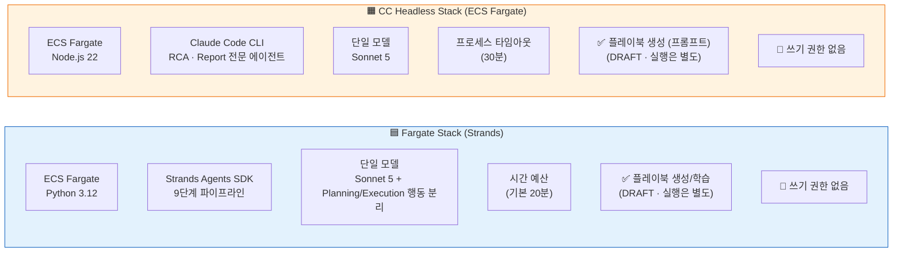
```mermaid
graph LR
    subgraph Fargate["🟦 Fargate Stack (Strands)"]
        direction TB
        F_ENV["ECS Fargate<br/>Python 3.12"]
        F_SDK["Strands Agents SDK<br/>9단계 파이프라인"]
        F_MODEL["단일 모델<br/>Sonnet 5 + Planning/Execution 행동 분리"]
        F_TIME["시간 예산<br/>(기본 20분)"]
        F_PLAY["✅ 플레이북 생성/학습<br/>(DRAFT · 실행은 별도)"]
        F_WRITE["🚫 쓰기 권한 없음"]
    end

    subgraph CcStack["🟧 CC Headless Stack (ECS Fargate)"]
        direction TB
        L_ENV["ECS Fargate<br/>Node.js 22"]
        L_SDK["Claude Code CLI<br/>RCA · Report 전문 에이전트"]
        L_MODEL["단일 모델<br/>Sonnet 5"]
        L_TIME["프로세스 타임아웃<br/>(30분)"]
        L_PLAY["✅ 플레이북 생성 (프롬프트)<br/>(DRAFT · 실행은 별도)"]
        L_WRITE["🚫 쓰기 권한 없음"]
    end

    style Fargate fill:#e3f2fd,stroke:#1565c0
    style CcStack fill:#fff3e0,stroke:#ef6c00
```

| 항목 | Fargate (Strands) | Fargate (CC Headless) |
|------|-------------------|---------------------|
| **실행 환경** | ECS Fargate (항시 실행) | ECS Fargate (항시 실행) |
| **에이전트 프레임워크** | Strands Agents SDK (Python) | Claude Code CLI (Node.js) |
| **RCA 방식** | 9단계 파이프라인 (코드로 정의) | RCA·Report 전문 에이전트 순차 실행 |
| **AI 모델** | Sonnet 5 (Planning은 adaptive thinking) | Sonnet 5 |
| **분석 깊이** | 가설 트리 탐색 (depth 최대 5) | 프롬프트 기반 (depth 최대 3) |
| **플레이북** | 생성 + S3 Vectors 인덱싱 (search-first) | Report 전문 에이전트가 생성 |
| **쓰기 권한** | 없음 (읽기 전용 분석) | 없음 (읽기 전용 분석) |
| **조치 실행** | 두 엔진 공통 — 사용자 승인 후 별도 실행 스택이 수행 (8장) |
| **이벤트 수신** | SQS Long Polling | SQS Long Polling |
| **타임아웃** | 20분 시간 예산 + 종료조건 | 30분 프로세스 제한 |
| **동시성** | Fargate 태스크 스케일링 | Fargate 태스크 스케일링 |
| **비용 모델** | 항시 실행 비용 | 항시 실행 비용 |

---

## 6. Fargate 엔진 — 9단계 파이프라인

Strands SDK 기반 Fargate 엔진은 RCA를 9개 서비스 단계로 수행합니다. 파이프라인은
읽기 전용이며 F9 알림에서 끝납니다. 복구를 수행하는 워커가 없고, 생성된 플레이북은
`verification_status=DRAFT` 초안입니다 — 실행과 회고를 거치지 않은 절차는 검증되지
않았기 때문입니다.

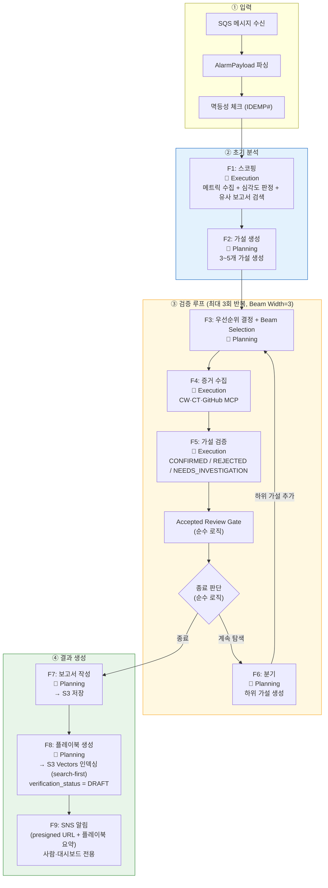
```mermaid
flowchart TD
    subgraph Input["① 입력"]
        SQS["SQS 메시지 수신"]
        PARSE["AlarmPayload 파싱"]
        DEDUP["멱등성 체크 (IDEMP#)"]
        SQS --> PARSE --> DEDUP
    end

    subgraph Phase1["② 초기 분석"]
        F1["F1: 스코핑<br/>🔧 Execution<br/>메트릭 수집 + 심각도 판정 + 유사 보고서 검색"]
        F2["F2: 가설 생성<br/>🧠 Planning<br/>3~5개 가설 생성"]
    end

    subgraph Loop["③ 검증 루프 (최대 3회 반복, Beam Width=3)"]
        F3["F3: 우선순위 결정 + Beam Selection<br/>🧠 Planning"]
        F4["F4: 증거 수집<br/>🔧 Execution<br/>CW·CT·GitHub MCP"]
        F5["F5: 가설 검증<br/>🔧 Execution<br/>CONFIRMED / REJECTED / NEEDS_INVESTIGATION"]
        RG["Accepted Review Gate<br/>(순수 로직)"]
        TERM{"종료 판단<br/>(순수 로직)"}
        F6["F6: 분기<br/>🧠 Planning<br/>하위 가설 생성"]

        F3 --> F4 --> F5 --> RG --> TERM
        TERM -->|"계속 탐색"| F6
        F6 -->|"하위 가설 추가"| F3
    end

    subgraph Output["④ 결과 생성"]
        F7["F7: 보고서 작성<br/>🧠 Planning<br/>→ S3 저장"]
        F8["F8: 플레이북 생성<br/>🧠 Planning<br/>→ S3 Vectors 인덱싱 (search-first)<br/>verification_status = DRAFT"]
        F9["F9: SNS 알림<br/>(presigned URL + 플레이북 요약)<br/>사람·대시보드 전용"]
        F7 --> F8 --> F9
    end

    DEDUP --> F1
    F1 --> F2
    F2 --> F3
    TERM -->|"종료"| F7

    style Phase1 fill:#e3f2fd,stroke:#1565c0
    style Loop fill:#fff8e1,stroke:#f9a825
    style Output fill:#e8f5e9,stroke:#388e3c
```

### 종료 조건 (OR 평가 — 하나라도 충족 시 종료)

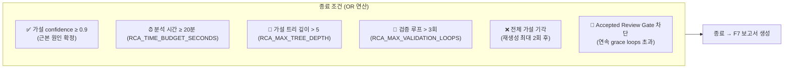
```mermaid
graph LR
    subgraph Conditions["종료 조건 (OR 연산)"]
        C1["✅ 가설 confidence ≥ 0.9<br/>(근본 원인 확정)"]
        C2["⏰ 분석 시간 ≥ 20분 (RCA_TIME_BUDGET_SECONDS)"]
        C3["🌲 가설 트리 깊이 > 5 (RCA_MAX_TREE_DEPTH)"]
        C4["🔄 검증 루프 > 3회 (RCA_MAX_VALIDATION_LOOPS)"]
        C5["❌ 전체 가설 기각<br/>(재생성 최대 2회 후)"]
        C6["🛑 Accepted Review Gate 차단<br/>(연속 grace loops 초과)"]
    end

    Conditions --> STOP["종료 → F7 보고서 생성"]
```

### 단일 모델 + Planning/Execution 행동 분리

비용과 품질의 균형을 맞추기 위해 단일 Sonnet 5 모델을 사용하되, 단계별로 adaptive thinking 유무로 호출 특성을 구분합니다.

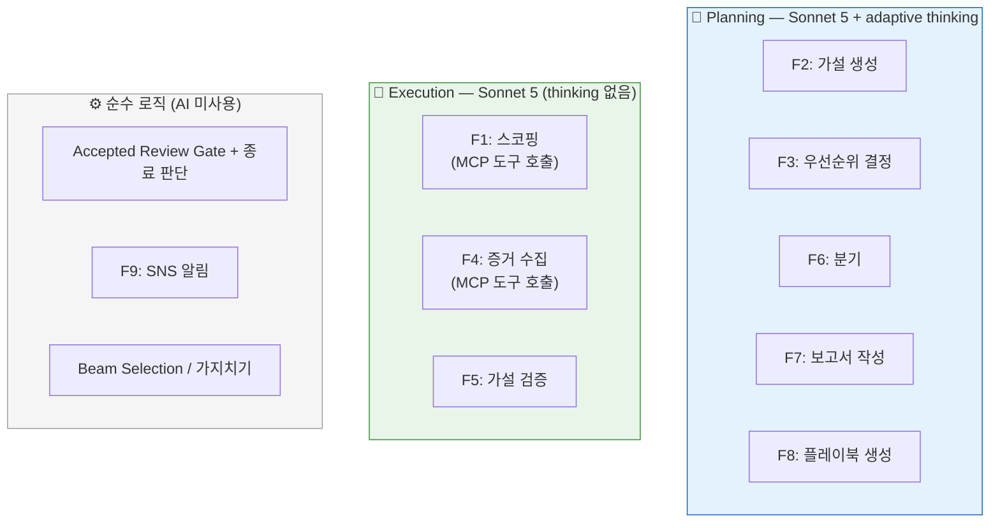
```mermaid
graph TB
    subgraph Planning["🧠 Planning — Sonnet 5 + adaptive thinking"]
        P1["F2: 가설 생성"]
        P2["F3: 우선순위 결정"]
        P4["F6: 분기"]
        P5["F7: 보고서 작성"]
        P6["F8: 플레이북 생성"]
    end

    subgraph Execution["🔧 Execution — Sonnet 5 (thinking 없음)"]
        E1["F1: 스코핑<br/>(MCP 도구 호출)"]
        E2["F4: 증거 수집<br/>(MCP 도구 호출)"]
        E3["F5: 가설 검증"]
    end

    subgraph NoLLM["⚙️ 순수 로직 (AI 미사용)"]
        N1["Accepted Review Gate + 종료 판단"]
        N2["F9: SNS 알림"]
        N3["Beam Selection / 가지치기"]
    end

    style Planning fill:#e3f2fd,stroke:#1565c0
    style Execution fill:#e8f5e9,stroke:#388e3c
    style NoLLM fill:#f5f5f5,stroke:#9e9e9e
```

- **Planning**: 추론·판단이 필요한 단계 → adaptive thinking 활성화 (`THINKING_ENABLED=true` 시)
- **Execution**: 도구 호출·데이터 수집·검증 → thinking 없이 호출
- **순수 로직**: AI 불필요 → 코드로 직접 처리
- **모델 ID**: `BEDROCK_MODEL_ID`만 사용. Haiku 티어(`BEDROCK_HAIKU_MODEL_ID`)는 제거됨

#### Sonnet 5 세대의 호출 제약

Bedrock에서 실측으로 확인한 제약입니다. 이 파라미터를 다시 넣으면 **모든 LLM 호출이
`ValidationException`으로 실패**합니다.

| 파라미터 | 상태 | 대응 |
|----------|------|------|
| `temperature` | ❌ 거부 (`deprecated for this model`) | 전달하지 않음. 출력 특성은 프롬프트로 조정 |
| `effort` (thinking 하위 또는 최상위) | ❌ 거부 (`Extra inputs are not permitted`) | 전달하지 않음. Planning/Execution은 adaptive 온·오프로만 구분 |
| `thinking: {"type": "adaptive"}` | ✅ 정상 | Planning 티어에서 사용 |
| forced `toolChoice` + adaptive thinking | ✅ 정상 | structured output 경로에서 사용 |

모델을 올릴 때는 최소 호출로 파라미터 허용 여부를 먼저 확인한 뒤 코드를 옮깁니다.

---

## 7. CC Headless 엔진 — ECS Fargate

Claude Code CLI를 ECS Fargate에서 headless 모드로 실행하고, 메인 에이전트는
오케스트레이터로서 RCA와 Report 두 전문 에이전트만 순차 호출합니다. 이 실행에는
서비스나 인프라를 바꾸는 도구가 없고, 산출물은 플레이북을 포함한 리포트 하나입니다.

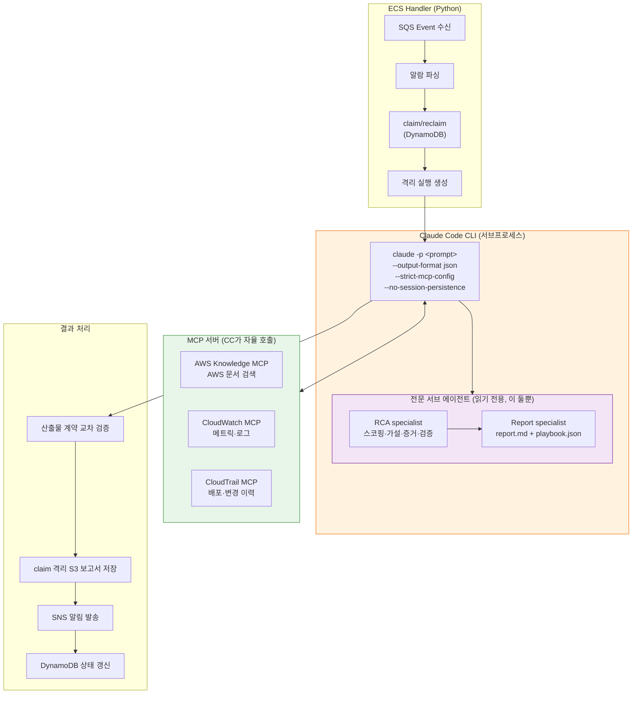
```mermaid
flowchart TD
    subgraph EcsHandler["ECS Handler (Python)"]
        SQS["SQS Event 수신"]
        PARSE["알람 파싱"]
        IDEMP["claim/reclaim<br/>(DynamoDB)"]
        SESSION["격리 실행 생성"]
        SQS --> PARSE --> IDEMP --> SESSION
    end

    subgraph CCProcess["Claude Code CLI (서브프로세스)"]
        CC["claude -p &lt;prompt&gt;<br/>--output-format json<br/>--strict-mcp-config<br/>--no-session-persistence"]

        subgraph Prompt["전문 서브 에이전트 (읽기 전용, 이 둘뿐)"]
            S1["RCA specialist<br/>스코핑·가설·증거·검증"]
            S3["Report specialist<br/>report.md + playbook.json"]
            S1 --> S3
        end

        CC --> Prompt
    end

    subgraph MCPServers["MCP 서버 (CC가 자율 호출)"]
        AK["AWS Knowledge MCP<br/>AWS 문서 검색"]
        CW["CloudWatch MCP<br/>메트릭·로그"]
        CT["CloudTrail MCP<br/>배포·변경 이력"]
    end

    subgraph Output["결과 처리"]
        RESULT["산출물 계약 교차 검증"]
        S3_SAVE["claim 격리 S3 보고서 저장"]
        SNS_SEND["SNS 알림 발송"]
        DDB_UP["DynamoDB 상태 갱신"]
        RESULT --> S3_SAVE --> SNS_SEND --> DDB_UP
    end

    SESSION --> CC
    CC <--> MCPServers
    CC --> RESULT

    style CCProcess fill:#fff3e0,stroke:#ef6c00
    style MCPServers fill:#e8f5e9,stroke:#388e3c
    style Prompt fill:#f3e5f5,stroke:#7b1fa2
```

**Fargate와의 차이점**:
- Fargate는 각 단계를 **Python 코드로** 명시적으로 구현
- CC Headless는 역할별 전문 에이전트를 프롬프트 계약으로 분리하고 서버가 산출물
  계약과 완료 조건을 강제
- claim을 잃거나 DynamoDB 소유권을 확인하지 못한 실행은 외부 쓰기를 시작하지 않음
- 산출물은 `scoping.json`, `hypotheses.json`, `validation-{N}.json`, `playbook.json`,
  `report.md` 다섯 가지이며 이 목록이 전부

---

## 8. 플레이북 실행 — 사용자 승인 게이트

실행은 두 분석 엔진과 별개의 워커입니다. **분석 워커와 같은 컨테이너 이미지를 다른
진입점으로** 실행합니다: `python -m cc_headless.execution_main`.

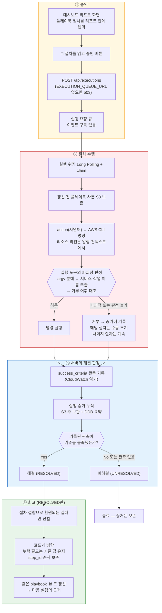
```mermaid
flowchart TD
    subgraph Approve["① 승인"]
        REPORT["대시보드 리포트 화면<br/>플레이북 절차를 리포트 안에 렌더"]
        HUMAN["👤 절차를 읽고 승인 버튼"]
        POST["POST /api/executions<br/>(EXECUTION_QUEUE_URL 없으면 503)"]
        QUEUE["실행 요청 큐<br/>이벤트 구독 없음"]
        REPORT --> HUMAN --> POST --> QUEUE
    end

    subgraph Run["② 절차 수행"]
        POLL["실행 워커 Long Polling + claim"]
        SNAP["갱신 전 플레이북 사본 S3 보존"]
        MAP["action(자연어) → AWS CLI 명령<br/>리소스·리전은 알람 컨텍스트에서"]
        GATE{{"실행 도구의 파괴성 판정<br/>argv 분해 → 서비스·작업 이름 추출<br/>→ 거부 어휘 대조"}}
        EXEC["명령 실행"]
        BLOCK["거부 → 증거에 기록<br/>해당 절차는 수동 조치<br/>나머지 절차는 계속"]
        POLL --> SNAP --> MAP --> GATE
        GATE -->|허용| EXEC
        GATE -->|파괴적 또는 판정 불가| BLOCK
    end

    subgraph Judge["③ 서버의 해결 판정"]
        OBS["success_criteria 관측 기록<br/>(CloudWatch 읽기)"]
        EVID["실행 증거 누적<br/>S3 주 보관 + DDB 요약"]
        VERDICT{{"기록된 관측이<br/>기준을 충족했는가?"}}
        RES["해결 (RESOLVED)"]
        UNRES["미해결 (UNRESOLVED)"]
        OBS --> EVID --> VERDICT
        VERDICT -->|Yes| RES
        VERDICT -->|No 또는 관측 없음| UNRES
    end

    subgraph Retro["④ 회고 (RESOLVED만)"]
        PICK["절차 결함으로 환원되는 실패만 선별"]
        MERGE["코드가 병합<br/>누락 필드는 기존 값 유지<br/>step_id·순서 보존"]
        NEXT["같은 playbook_id 로 갱신<br/>→ 다음 실행의 근거"]
        PICK --> MERGE --> NEXT
    end

    QUEUE --> POLL
    EXEC --> OBS
    BLOCK --> OBS
    RES --> PICK
    UNRES --> STOP["종료 — 증거는 보존"]

    style Approve fill:#fff8e1,stroke:#f9a825
    style Run fill:#ffebee,stroke:#c62828
    style Judge fill:#e3f2fd,stroke:#1565c0
    style Retro fill:#e8f5e9,stroke:#388e3c
```

### 실행 상태 전이

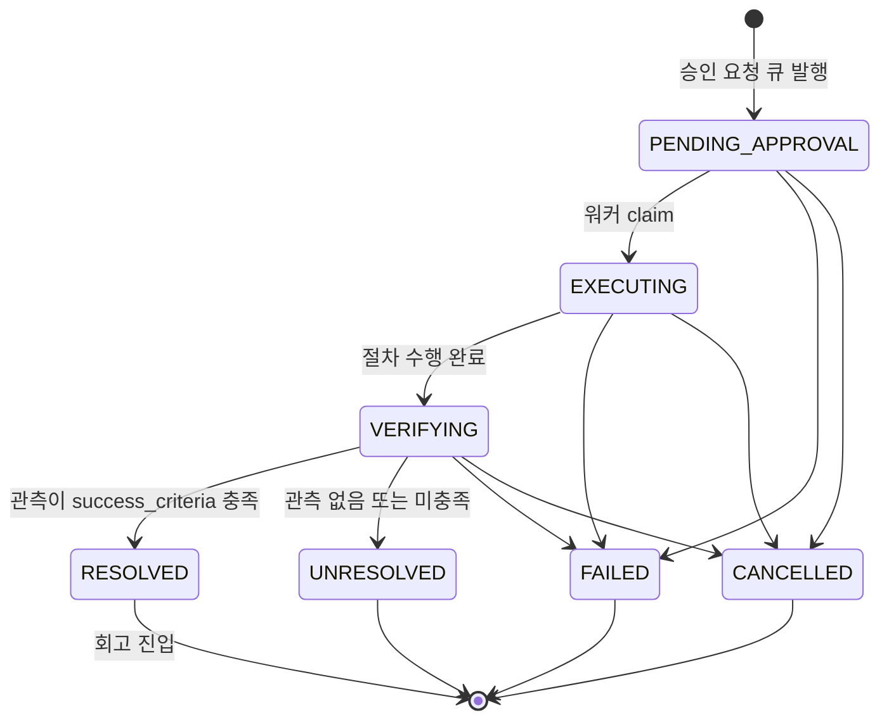
```mermaid
stateDiagram-v2
    [*] --> PENDING_APPROVAL: 승인 요청 큐 발행
    PENDING_APPROVAL --> EXECUTING: 워커 claim
    EXECUTING --> VERIFYING: 절차 수행 완료
    VERIFYING --> RESOLVED: 관측이 success_criteria 충족
    VERIFYING --> UNRESOLVED: 관측 없음 또는 미충족

    PENDING_APPROVAL --> FAILED
    PENDING_APPROVAL --> CANCELLED
    EXECUTING --> FAILED
    EXECUTING --> CANCELLED
    VERIFYING --> FAILED
    VERIFYING --> CANCELLED

    RESOLVED --> [*]: 회고 진입
    UNRESOLVED --> [*]
    FAILED --> [*]
    CANCELLED --> [*]
```

대시보드 표기: `승인 대기(PENDING_APPROVAL)` → `실행 중(EXECUTING)` →
`검증 중(VERIFYING)` → `해결(RESOLVED)`/`미해결(UNRESOLVED)`, 그리고
`실행 중` → `실패(FAILED)`/`취소(CANCELLED)`.

**`실행 중`에서 `해결`로 바로 가는 전이는 없습니다.** 관측 없이 해결로 전이하면
해소되지 않은 장애가 완료로 기록됩니다.

### 운영자가 알아야 할 다섯 가지

| 사실 | 왜 그렇게 만들었는가 |
|------|---------------------|
| 승인 없이 실행이 시작될 수 없다 | 승인이 곧 메시지다. 실행 스택에 이벤트 구독이 없으므로 사람이 승인하지 않고 실행이 기동될 경로가 존재하지 않는다 |
| 파괴적 명령은 서버가 거부한다 | IAM이나 프롬프트가 아니라 실행 도구가 명령을 argv로 분해해 작업 이름을 추출하고 거부 어휘와 대조한다. 정책 거부는 어떤 절차가 왜 막혔는지 기록할 수 없다 |
| 작업 이름을 확정할 수 없는 명령도 거부한다 | 판정 불가를 허용으로 읽으면 셸 합성이나 중첩 호출로 거부 목록을 비울 수 있다 |
| 해결 판정은 서버가 한다 | 에이전트가 "정상화되었습니다"라고 말하는 것은 관측이 아니다. 기록된 관측만 완료의 근거가 되고, 관측하지 못하면 `UNRESOLVED`로 남는다 |
| 실패한 실행의 증거도 남는다 | 사람이 왜 실패했는지 알 수 있는 유일한 기록이다. 명령·인자·종료 상태·오류·실패 분류·재시도·관측이 절차 단위로 S3에 남고 DDB에는 요약만 둔다 |

거부된 절차는 실행 전체를 중단시키지 않습니다. 증거에 기록되고 수동 조치로 표시된
뒤 남은 절차가 계속 수행됩니다.

### 실행과 분석의 생명주기 분리

- 실행 실패는 분석 세션을 실패로 만들지 않고 저장된 리포트를 변경하지 않습니다.
- 하나의 리포트를 여러 번 실행할 수 있습니다.
- 실행 아이템은 세션과 같은 파티션에 `EXEC#{execution_id}`로 저장되며 엔진 접두사를 붙이지 않습니다 — 실행 경로가 엔진과 무관하게 하나이기 때문입니다.
- 자격 증명으로 보이는 인자는 증거에서 가려집니다. 증거는 사람이 읽는 자료이고 자격 증명이 남으면 열람 자체가 노출이 됩니다.

### 회고

`RESOLVED` 실행만 회고에 들어갑니다. `UNRESOLVED`·`FAILED`·`CANCELLED`는 들어가지
않는데, 이슈를 해소하지 못한 절차는 올바름이 입증되지 않았기 때문입니다.

- 교정 대상은 **절차 결함으로 환원되는 실패**뿐입니다: 잘못된·누락된 인자, 빠진 선행 조건, 순서 오류, 해결 확정에 필요했던 검증 절차.
- **일시적 오류는 교정하지 않습니다.** 같은 명령이 재시도로 성공했다면 절차 자체는 옳았습니다. 이것을 절차 결함으로 분류하면 불필요한 방어 단계가 절차에 쌓입니다.
- **삭제는 일어나지 않으며 이것은 프롬프트가 아니라 코드가 보장합니다.** 모델이 담지 않은 필드는 기존 값을 유지하고, `step_id`와 순서는 살아남고, 관측 가능한 성공 기준이 없는 새 절차는 버립니다.
- 실행 시작 시점에 **갱신 전 플레이북 사본을 보존**합니다. 회고가 원본을 덮어쓰므로 사본이 없으면 갱신 diff의 기준이 사라집니다.
- 갱신된 플레이북은 같은 `playbook_id`를 유지하며 다음 실행의 근거가 됩니다.
- **회고가 갱신을 반영하면 `verification_status`가 `DRAFT` → `VERIFIED`로 승격됩니다.** 되돌리는 전이는 없으며, 이후 분석이나 병합이 이 값을 낮추지 않습니다. 교정할 결함이 없어도 승격되고(절차가 그대로 이슈를 해소한 것), 회고가 실패하면 승격되지 않습니다. 대시보드 리포트 화면이 초안/검증됨을 표기하므로 운영자는 승인 전에 절차가 실행으로 입증된 것인지 구분할 수 있습니다.
- 회고 실패는 이미 확정된 해결을 되돌리지 않습니다.

---

## 9. MCP 서버 — 외부 데이터 수집 도구

MCP(Model Context Protocol)는 AI 에이전트가 외부 서비스의 데이터를 조회할 수 있게 해주는 프로토콜입니다.

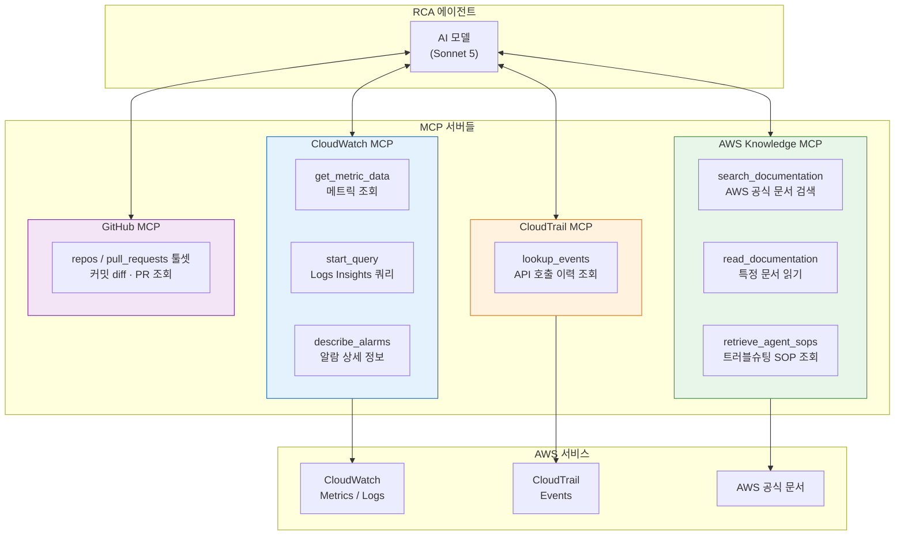
```mermaid
graph TB
    subgraph Agent["RCA 에이전트"]
        AI["AI 모델<br/>(Sonnet 5)"]
    end

    subgraph MCP["MCP 서버들"]
        subgraph AK["AWS Knowledge MCP"]
            AK1["search_documentation<br/>AWS 공식 문서 검색"]
            AK2["read_documentation<br/>특정 문서 읽기"]
            AK3["retrieve_agent_sops<br/>트러블슈팅 SOP 조회"]
        end

        subgraph CW["CloudWatch MCP"]
            CW1["get_metric_data<br/>메트릭 조회"]
            CW2["start_query<br/>Logs Insights 쿼리"]
            CW3["describe_alarms<br/>알람 상세 정보"]
        end

        subgraph CT["CloudTrail MCP"]
            CT1["lookup_events<br/>API 호출 이력 조회"]
        end

        subgraph GH["GitHub MCP"]
            GH1["repos / pull_requests 툴셋<br/>커밋 diff · PR 조회"]
        end
    end

    subgraph AWS["AWS 서비스"]
        CW_API["CloudWatch<br/>Metrics / Logs"]
        CT_API["CloudTrail<br/>Events"]
        AWS_DOCS["AWS 공식 문서"]
    end

    AI <--> AK
    AI <--> CW
    AI <--> CT
    AI <--> GH

    AK --> AWS_DOCS
    CW --> CW_API
    CT --> CT_API

    style AK fill:#e8f5e9,stroke:#388e3c
    style CW fill:#e3f2fd,stroke:#1565c0
    style CT fill:#fff3e0,stroke:#ef6c00
    style GH fill:#f3e5f5,stroke:#7b1fa2
```

### MCP 서버 설치 방식

| MCP 서버 | 실행 방식 | 비고 |
|----------|----------|------|
| AWS Knowledge | `fastmcp run https://...` (stdio) | AWS 공식 문서/SOP 검색 |
| CloudWatch | `uvx --from awslabs-cloudwatch-mcp-server awslabs.cloudwatch-mcp-server` (stdio) | 메트릭·로그 조회 |
| CloudTrail | `uvx --from awslabs-cloudtrail-mcp-server awslabs.cloudtrail-mcp-server` (stdio) | 배포·변경 이력 |
| GitHub | `github-mcp-server stdio` (Go 바이너리, 컨테이너 내장) | 커밋 diff·PR 조회 |

AWS Knowledge 서버는 컨테이너에 설치된 FastMCP로 실행하고, CloudWatch와
CloudTrail 서버는 컨테이너에 준비된 Python 패키지를 사용합니다. GitHub MCP
서버는 Go 바이너리로 이미지에 포함합니다.

---

## 10. Healthcare Sensor App — 데모용 서비스

RCA 에이전트의 정확도를 검증하기 위한 **의도적으로 장애를 주입할 수 있는** 데모 서비스입니다.

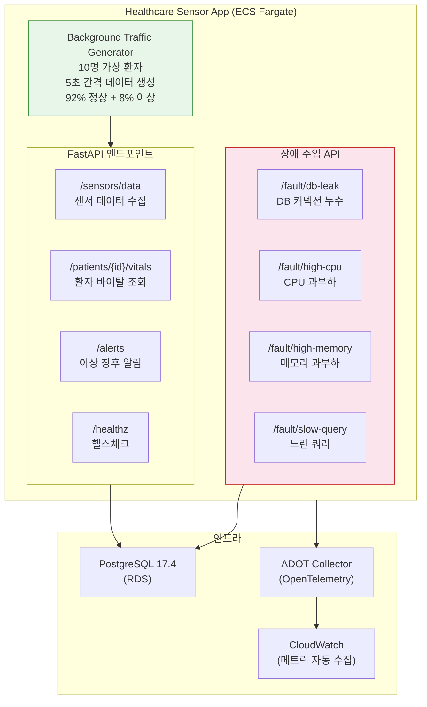
```mermaid
graph TB
    subgraph HealthApp["Healthcare Sensor App (ECS Fargate)"]
        subgraph API["FastAPI 엔드포인트"]
            SENSOR["/sensors/data<br/>센서 데이터 수집"]
            PATIENT["/patients/{id}/vitals<br/>환자 바이탈 조회"]
            ALERT["/alerts<br/>이상 징후 알림"]
            HEALTH["/healthz<br/>헬스체크"]
        end

        subgraph FaultAPI["장애 주입 API"]
            DB_LEAK["/fault/db-leak<br/>DB 커넥션 누수"]
            HIGH_CPU["/fault/high-cpu<br/>CPU 과부하"]
            HIGH_MEM["/fault/high-memory<br/>메모리 과부하"]
            SLOW_Q["/fault/slow-query<br/>느린 쿼리"]
        end

        TRAFFIC["Background Traffic Generator<br/>10명 가상 환자<br/>5초 간격 데이터 생성<br/>92% 정상 + 8% 이상"]
    end

    subgraph Infra["인프라"]
        RDS["PostgreSQL 17.4<br/>(RDS)"]
        CW2["CloudWatch<br/>(메트릭 자동 수집)"]
        OTEL["ADOT Collector<br/>(OpenTelemetry)"]
    end

    API --> RDS
    FaultAPI --> RDS
    TRAFFIC --> API
    HealthApp --> OTEL --> CW2

    style FaultAPI fill:#fce4ec,stroke:#c62828
    style TRAFFIC fill:#e8f5e9,stroke:#388e3c
```

### 장애 주입 API 목록

| 엔드포인트 | 동작 | CloudWatch 알람 트리거 |
|-----------|------|----------------------|
| `POST /fault/db-leak` | DB 커넥션을 열고 닫지 않음 | RDS DatabaseConnections 급증 |
| `POST /fault/db-leak/reset` | 누수된 커넥션 정리 | — |
| `POST /fault/high-cpu` | CPU 집중 작업 실행 | ECS CPUUtilization 급증 |
| `POST /fault/high-cpu/reset` | CPU 부하 중지 | — |
| `POST /fault/high-memory` | 메모리 대량 할당 | ECS MemoryUtilization 급증 |
| `POST /fault/high-memory/reset` | 할당 메모리 해제 | — |
| `POST /fault/slow-query` | 의도적으로 느린 쿼리 실행 | RDS ReadLatency 급증 |
| `POST /fault/slow-query/reset` | 느린 쿼리 중지 | — |

> **참고**: `high-cpu`와 `slow-query` 장애는 명시적으로 reset 호출할 때까지 지속됩니다.

> **Cloud Map DNS**: VPC 내부에서 `healthcare.rcaagentdev.local`로 접근할 수 있습니다.

### RCA 대시보드

`packages/dashboard`에 Nuxt.js 기반 로컬 전용 대시보드가 있습니다. DynamoDB 세션 목록과 S3 보고서를 조회할 수 있고, **플레이북 실행 승인의 유일한 진입점**입니다.

```bash
cd packages/dashboard
pnpm dev   # http://localhost:3100
```

| 화면 / API | 용도 |
|-----------|------|
| 세션 목록 (`/`) | 상태별 통계 + 목록. 실행 상태 컬럼 포함 |
| 리포트 상세 (`/report/:id`) | 보고서 렌더 + **플레이북 실행 절차 인라인 표시 + 승인 버튼**. 사람이 분석을 읽으면서 그 분석이 만든 절차를 승인한다 |
| `POST /api/executions` | 승인 발행 (실행 요청 큐). `EXECUTION_QUEUE_URL` 미설정 시 503 |
| `GET /api/executions/:rcaId` | 실행 시도 이력 (실패한 실행의 증거도 보존) |
| `GET /api/retrospectives/:rcaId/:executionId` | 회고 조회 |
| 회고 화면 (`/retrospective/:rcaId/:executionId`) | 이슈 · 실행 전 플레이북 · 실행 증거 · 갱신 diff 4단 비교 |

`EXECUTION_QUEUE_URL`이 없으면 승인 발행이 503으로 실패합니다 — 잘못 설정된 대시보드가 조용히 승인한 것처럼 보이면 안 되기 때문입니다.

---

## 11. 데모 시나리오 1: DB 커넥션 누수

가장 대표적인 데모 시나리오입니다. DB 커넥션을 누수시켜 장애를 발생시키고, RCA 에이전트가 이를 자동 분석합니다.

### 전체 흐름

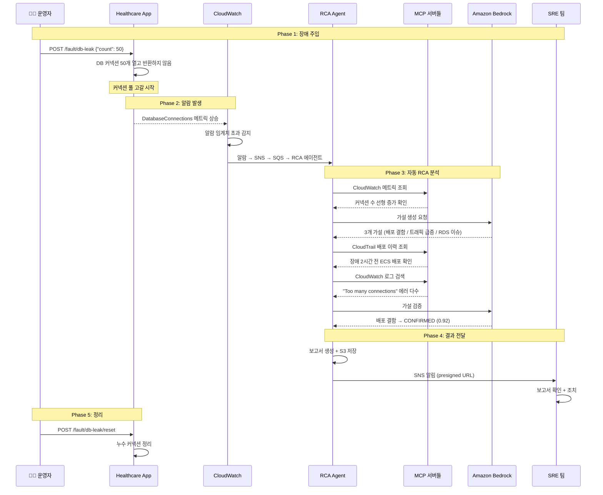
```mermaid
sequenceDiagram
    participant OPS as 👩‍💻 운영자
    participant APP as Healthcare App
    participant CW as CloudWatch
    participant RCA as RCA Agent
    participant MCP as MCP 서버들
    participant AI as Amazon Bedrock
    participant SRE as SRE 팀

    Note over OPS,SRE: Phase 1: 장애 주입
    OPS->>APP: POST /fault/db-leak {"count": 50}
    APP->>APP: DB 커넥션 50개 열고 반환하지 않음
    Note over APP: 커넥션 풀 고갈 시작

    Note over APP,CW: Phase 2: 알람 발생
    APP-->>CW: DatabaseConnections 메트릭 상승
    CW->>CW: 알람 임계치 초과 감지
    CW->>RCA: 알람 → SNS → SQS → RCA 에이전트

    Note over RCA,AI: Phase 3: 자동 RCA 분석
    RCA->>MCP: CloudWatch 메트릭 조회
    MCP-->>RCA: 커넥션 수 선형 증가 확인
    RCA->>AI: 가설 생성 요청
    AI-->>RCA: 3개 가설 (배포 결함 / 트래픽 급증 / RDS 이슈)

    RCA->>MCP: CloudTrail 배포 이력 조회
    MCP-->>RCA: 장애 2시간 전 ECS 배포 확인
    RCA->>MCP: CloudWatch 로그 검색
    MCP-->>RCA: "Too many connections" 에러 다수

    RCA->>AI: 가설 검증
    AI-->>RCA: 배포 결함 → CONFIRMED (0.92)

    Note over RCA,SRE: Phase 4: 결과 전달
    RCA->>RCA: 보고서 생성 + S3 저장
    RCA->>SRE: SNS 알림 (presigned URL)
    SRE->>SRE: 보고서 확인 + 조치

    Note over OPS,APP: Phase 5: 정리
    OPS->>APP: POST /fault/db-leak/reset
    APP->>APP: 누수 커넥션 정리
```

### RCA 에이전트가 실제로 수행하는 분석


```mermaid
graph TD
    subgraph Scoping["① 스코핑"]
        S1["DatabaseConnections 메트릭 조회 (30분)"]
        S2["Latency, ErrorRate 메트릭 조회"]
        S3["심각도 판정: HIGH<br/>영향 범위: 서비스 전체"]
    end

    subgraph Hypothesis["② 가설 생성"]
        H_A["가설 A: 최근 배포 코드 결함<br/>confidence: 0.7"]
        H_B["가설 B: 트래픽 급증<br/>confidence: 0.5"]
        H_C["가설 C: RDS 인스턴스 문제<br/>confidence: 0.4"]
    end

    subgraph Evidence["③ 증거 수집"]
        E_A1["CloudTrail: 2시간 전 ECS 배포 확인 ✅"]
        E_A2["CloudWatch: 배포 시점부터 커넥션 선형 증가 ✅"]
        E_A3["CloudWatch Logs: Too many connections ✅"]
        E_B1["CloudWatch: RequestCount 평소 수준 ❌"]
        E_C1["CloudWatch: FreeStorageSpace/CPU 정상 ❌"]
    end

    subgraph Validation["④ 검증 결과"]
        V_A["가설 A: NEEDS_INVESTIGATION (0.75)<br/>배포 관련이지만 구체적 결함 미확인"]
        V_B["가설 B: REJECTED (0.1)"]
        V_C["가설 C: REJECTED (0.15)"]
    end

    subgraph Branch["⑤ 분기 (가설 A 세분화)"]
        B1["A-1: 커넥션 풀 설정 변경"]
        B2["A-2: 코드에서 커넥션 미반환 (누수)"]
    end

    subgraph Final["⑥ 최종 검증"]
        F1["A-1: REJECTED (풀 설정 변경 없음)"]
        F2["A-2: CONFIRMED ✅ (confidence: 0.92)<br/>배포 시점 + 선형 증가 + 에러 패턴 일치"]
    end

    Scoping --> Hypothesis --> Evidence --> Validation --> Branch --> Final

    style Final fill:#e8f5e9,stroke:#388e3c
```

---

## 12. 데모 시나리오 2: CPU 과부하

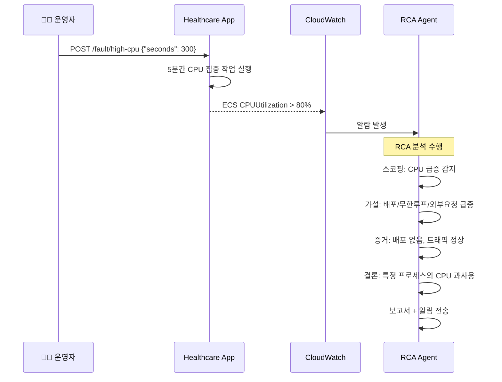
```mermaid
sequenceDiagram
    participant OPS as 👩‍💻 운영자
    participant APP as Healthcare App
    participant CW as CloudWatch
    participant RCA as RCA Agent

    OPS->>APP: POST /fault/high-cpu {"seconds": 300}
    APP->>APP: 5분간 CPU 집중 작업 실행
    APP-->>CW: ECS CPUUtilization > 80%
    CW->>RCA: 알람 발생

    Note over RCA: RCA 분석 수행
    RCA->>RCA: 스코핑: CPU 급증 감지
    RCA->>RCA: 가설: 배포/무한루프/외부요청 급증
    RCA->>RCA: 증거: 배포 없음, 트래픽 정상
    RCA->>RCA: 결론: 특정 프로세스의 CPU 과사용
    RCA->>RCA: 보고서 + 알림 전송
```

이 시나리오에서 RCA 에이전트는:
- CloudWatch 메트릭에서 CPU 급증 시점 확인
- CloudTrail에서 최근 배포/변경 없음 확인
- 트래픽 패턴 정상 확인
- "특정 프로세스의 비정상적 CPU 사용" 으로 결론

---

## 13. 데모 시나리오 3: Slow Query

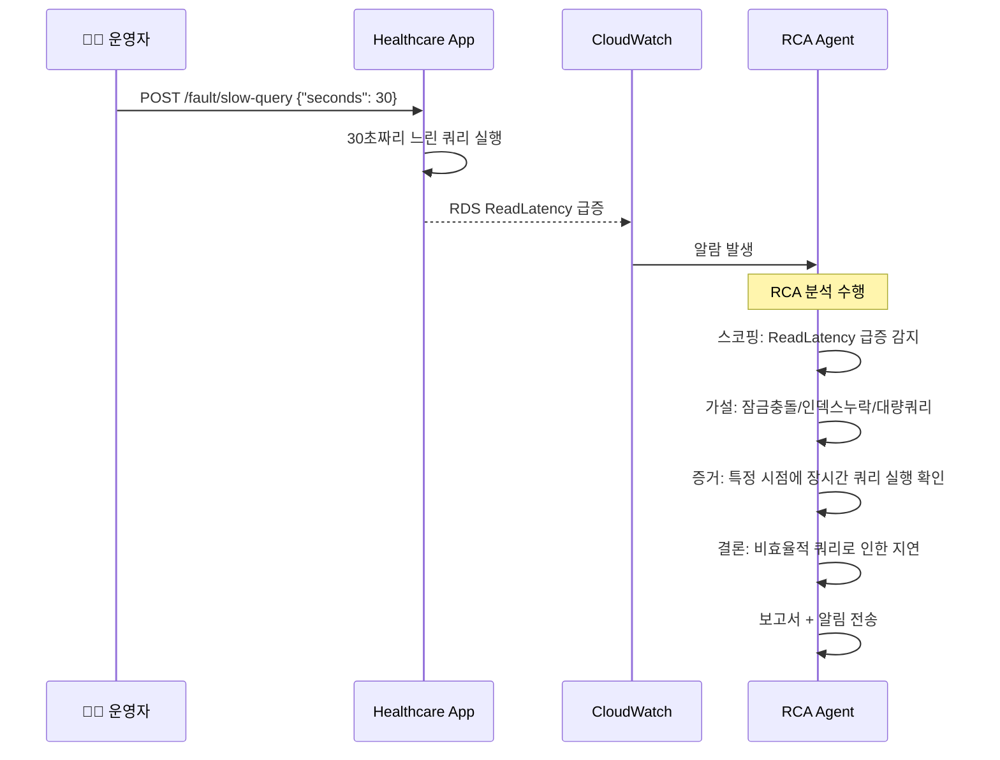
```mermaid
sequenceDiagram
    participant OPS as 👩‍💻 운영자
    participant APP as Healthcare App
    participant CW as CloudWatch
    participant RCA as RCA Agent

    OPS->>APP: POST /fault/slow-query {"seconds": 30}
    APP->>APP: 30초짜리 느린 쿼리 실행
    APP-->>CW: RDS ReadLatency 급증
    CW->>RCA: 알람 발생

    Note over RCA: RCA 분석 수행
    RCA->>RCA: 스코핑: ReadLatency 급증 감지
    RCA->>RCA: 가설: 잠금충돌/인덱스누락/대량쿼리
    RCA->>RCA: 증거: 특정 시점에 장시간 쿼리 실행 확인
    RCA->>RCA: 결론: 비효율적 쿼리로 인한 지연
    RCA->>RCA: 보고서 + 알림 전송
```

---

## 14. 세션 상태와 DynamoDB

RCA 세션의 생명주기를 DynamoDB에서 추적합니다. 두 엔진 모두 같은 테이블을 공유하며, 플레이북 실행도 같은 테이블에 별도 생명주기로 기록됩니다.

### Fargate 세션 상태 전이

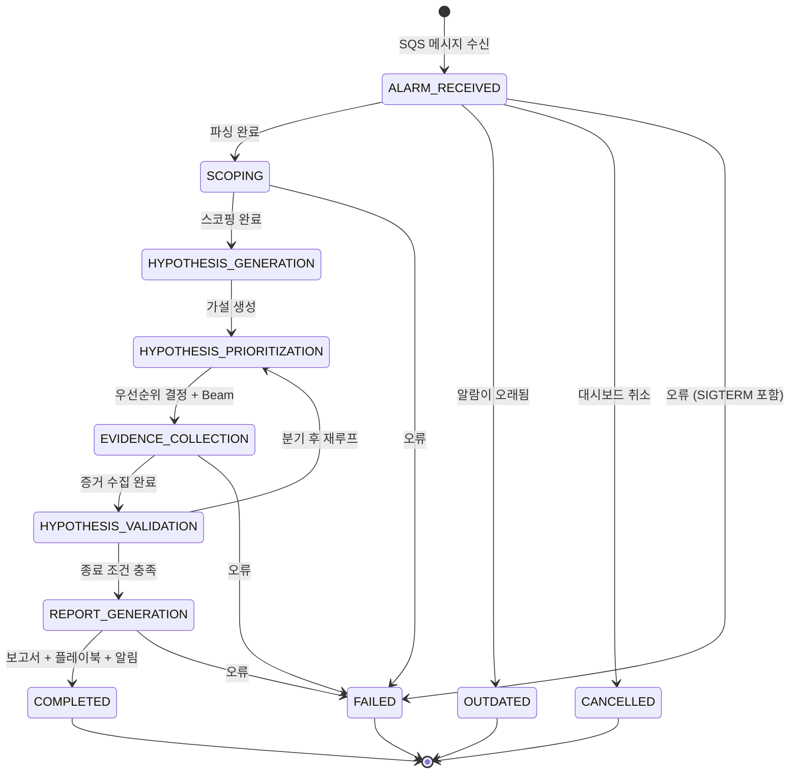
```mermaid
stateDiagram-v2
    [*] --> ALARM_RECEIVED: SQS 메시지 수신

    ALARM_RECEIVED --> SCOPING: 파싱 완료
    SCOPING --> HYPOTHESIS_GENERATION: 스코핑 완료
    HYPOTHESIS_GENERATION --> HYPOTHESIS_PRIORITIZATION: 가설 생성
    HYPOTHESIS_PRIORITIZATION --> EVIDENCE_COLLECTION: 우선순위 결정 + Beam
    EVIDENCE_COLLECTION --> HYPOTHESIS_VALIDATION: 증거 수집 완료
    HYPOTHESIS_VALIDATION --> REPORT_GENERATION: 종료 조건 충족
    HYPOTHESIS_VALIDATION --> HYPOTHESIS_PRIORITIZATION: 분기 후 재루프
    REPORT_GENERATION --> COMPLETED: 보고서 + 플레이북 + 알림

    ALARM_RECEIVED --> OUTDATED: 알람이 오래됨
    ALARM_RECEIVED --> CANCELLED: 대시보드 취소
    ALARM_RECEIVED --> FAILED: 오류 (SIGTERM 포함)
    SCOPING --> FAILED: 오류
    EVIDENCE_COLLECTION --> FAILED: 오류
    REPORT_GENERATION --> FAILED: 오류

    COMPLETED --> [*]
    FAILED --> [*]
    CANCELLED --> [*]
    OUTDATED --> [*]
```

### CC Headless 세션 상태 전이

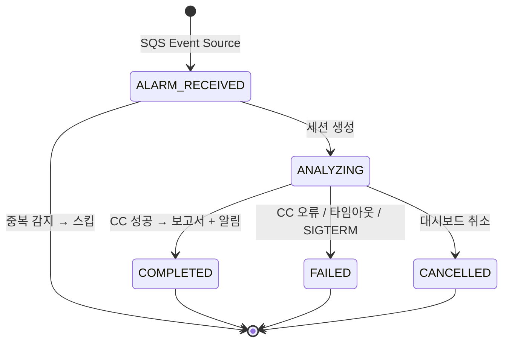
```mermaid
stateDiagram-v2
    [*] --> ALARM_RECEIVED: SQS Event Source

    ALARM_RECEIVED --> ANALYZING: 세션 생성
    ALARM_RECEIVED --> [*]: 중복 감지 → 스킵

    ANALYZING --> COMPLETED: CC 성공 → 보고서 + 알림
    ANALYZING --> FAILED: CC 오류 / 타임아웃 / SIGTERM
    ANALYZING --> CANCELLED: 대시보드 취소

    COMPLETED --> [*]
    FAILED --> [*]
    CANCELLED --> [*]
```

두 엔진의 세션 상태에 REMEDIATION이나 VERIFICATION은 없습니다. 분석이 복구를 수행하지 않기 때문입니다.

### 실행 상태 전이 (분석 세션과 별도)

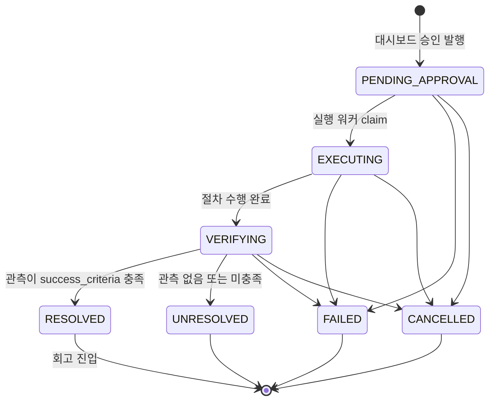
```mermaid
stateDiagram-v2
    [*] --> PENDING_APPROVAL: 대시보드 승인 발행
    PENDING_APPROVAL --> EXECUTING: 실행 워커 claim
    EXECUTING --> VERIFYING: 절차 수행 완료
    VERIFYING --> RESOLVED: 관측이 success_criteria 충족
    VERIFYING --> UNRESOLVED: 관측 없음 또는 미충족

    PENDING_APPROVAL --> FAILED
    PENDING_APPROVAL --> CANCELLED
    EXECUTING --> FAILED
    EXECUTING --> CANCELLED
    VERIFYING --> FAILED
    VERIFYING --> CANCELLED

    RESOLVED --> [*]: 회고 진입
    UNRESOLVED --> [*]
    FAILED --> [*]
    CANCELLED --> [*]
```

실행 실패는 분석 세션을 실패로 만들지 않고 저장된 리포트를 변경하지 않습니다. 하나의 리포트는 여러 번 실행할 수 있습니다.

### DynamoDB 싱글테이블 스키마

하나의 DynamoDB 테이블에 세션, 스팬(실행 트레이스), 가설, 실행 네 가지 엔티티를 저장합니다. `PK`로 RCA 세션을 묶고, `SK` 접두사로 엔티티 유형을 구분하는 싱글테이블 설계입니다.

```mermaid
erDiagram
    RCA_SESSION {
        string PK "RCA#{rca_id}"
        string SK "{engine}#SESSION"
        string engine "strands | cc-headless"
        string state "ALARM_RECEIVED → COMPLETED"
        string alarm_name "CloudWatch 알람 이름"
        string alarm_arn "알람 ARN"
        string idempotency_key "AlarmName#timestamp"
        string root_cause "확정된 근본 원인"
        boolean confirmed "근본 원인 확정 여부"
        string error_reason "실패 사유"
        string created_at "ISO 8601"
        string updated_at "ISO 8601"
        number ttl "TTL (90일)"
    }

    SPAN {
        string PK "RCA#{rca_id}"
        string SK "{engine}#SPAN#{span_id}"
        string engine "strands | cc-headless"
        string span_type "SCOPING | HYPOTHESIS_GENERATION | VALIDATION_LOOP | REPORT | PLAYBOOK | ..."
        string span_status "RUNNING | COMPLETED | FAILED"
        string parent_span_id "부모 스팬 ID (선택)"
        number loop_index "검증 루프 번호 (선택)"
        string input_summary "단계 입력 요약"
        string output_summary "단계 출력 요약"
        string error "에러 메시지 (선택)"
        map metadata "추가 데이터 (선택)"
        string start_time "ISO 8601"
        string end_time "ISO 8601"
        number duration_ms "소요 시간 (ms)"
        number ttl "TTL (90일)"
    }

    HYPOTHESIS {
        string PK "RCA#{rca_id}"
        string SK "{engine}#HYPO#{hypothesis_id}"
        string engine "strands | cc-headless"
        string tree_id "가설 트리 ID"
        string parent_id "부모 가설 ID (선택)"
        number depth "트리 깊이 (0-based)"
        string description "가설 설명"
        string category "DEPLOYMENT | INFRASTRUCTURE | ..."
        number confidence_score "신뢰도 (0.0-1.0)"
        string status "PENDING | CONFIRMED | REJECTED"
        list required_evidence "필요한 증거 목록"
        string referenced_playbook_id "참조 플레이북 ID (선택)"
        string evidence_summary "증거 요약"
        string judgment_reasoning "판단 근거"
        number judgment_confidence "판단 신뢰도"
        string created_at "ISO 8601"
        string updated_at "ISO 8601"
        number ttl "TTL (90일)"
    }

    EXECUTION {
        string PK "RCA#{rca_id}"
        string SK "EXEC#{execution_id} (엔진 접두사 없음)"
        string execution_id "실행 식별자"
        string engine "리포트를 만든 엔진 (실행 경로는 공통)"
        string execution_state "PENDING_APPROVAL → EXECUTING → VERIFYING → RESOLVED | UNRESOLVED"
        string approval_id "승인 식별자 (재전달 멱등성)"
        string requested_by "승인한 사람"
        string claim_token "실행 claim 토큰"
        number claim_expires_at "claim 만료 (epoch)"
        number attempt "시도 횟수"
        map evidence_summary "실행 증거 요약 (원본은 S3)"
        string evidence_s3_key "실행 증거 원본 위치"
        string playbook_snapshot_s3_key "갱신 전 플레이북 사본"
        string retrospective_summary "회고 요약"
        string retrospective_diff_s3_key "갱신 diff 위치"
        string error_reason "실패 사유"
        string created_at "ISO 8601"
        string updated_at "ISO 8601"
        number ttl "TTL (90일)"
    }
```

### 키 구조 및 접근 패턴

동일한 `PK = RCA#{rca_id}` 파티션 안에 세션 1개, 스팬 N개, 가설 N개, 실행 N개가 저장됩니다. `SK` 접두사로 엔티티를 구분하며, 세션·스팬·가설은 `{engine}#` 접두사로 Strands와 CC Headless의 데이터를 분리합니다.

**실행 아이템만 엔진 접두사를 붙이지 않습니다.** 어느 엔진이 리포트를 만들었든 실행 경로는 하나이기 때문입니다.

```mermaid
flowchart TD
    subgraph Partition["PK = RCA#a1b2c3d4-..."]
        direction TB
        S1["SK: strands#SESSION<br/>state=COMPLETED, alarm_name=HighDBConn"]
        S2["SK: cc-headless#SESSION<br/>state=COMPLETED, alarm_name=HighDBConn"]

        SP1["SK: strands#SPAN#uuid-1<br/>span_type=SCOPING, 3.2s"]
        SP2["SK: strands#SPAN#uuid-2<br/>span_type=HYPOTHESIS_GENERATION, 5.1s"]
        SP3["SK: strands#SPAN#uuid-3<br/>span_type=PLAYBOOK, metadata={...}, 8.4s"]
        SP4["SK: cc-headless#SPAN#uuid-a<br/>span_type=SCOPING, 4.0s"]

        H1["SK: strands#HYPO#uuid-h1<br/>depth=0, DB 커넥션 누수, CONFIRMED 0.92"]
        H2["SK: strands#HYPO#uuid-h2<br/>depth=0, 트래픽 급증, REJECTED 0.1"]
        H3["SK: cc-headless#HYPO#uuid-h3<br/>depth=0, 커넥션 풀 고갈, CONFIRMED 0.88"]

        E1["SK: EXEC#uuid-e1<br/>execution_state=RESOLVED<br/>회고 완료, 갱신 diff 있음"]
        E2["SK: EXEC#uuid-e2<br/>execution_state=UNRESOLVED<br/>증거는 보존"]
    end

    style S1 fill:#e3f2fd,stroke:#1565c0
    style S2 fill:#fff3e0,stroke:#ef6c00
    style SP1 fill:#e8f5e9,stroke:#388e3c
    style SP2 fill:#e8f5e9,stroke:#388e3c
    style SP3 fill:#e8f5e9,stroke:#388e3c
    style SP4 fill:#f3e5f5,stroke:#7b1fa2
    style H1 fill:#fce4ec,stroke:#c62828
    style H2 fill:#fce4ec,stroke:#c62828
    style H3 fill:#f3e5f5,stroke:#7b1fa2
    style E1 fill:#ffebee,stroke:#c62828
    style E2 fill:#ffebee,stroke:#c62828
```

### 접근 패턴 일람

| 접근 패턴 | 오퍼레이션 | 키 조건 | 사용처 |
|-----------|-----------|---------|--------|
| 세션 생성 (멱등) | `PutItem` | `PK=RCA#{id}`, `SK={engine}#SESSION`, `attribute_not_exists(SK)` | 에이전트 시작 시 |
| 중복 체크 | `GetItem` | `PK=RCA#{id}`, `SK={engine}#SESSION` | 알람 수신 시 |
| 상태 전이 | `UpdateItem` | `PK=RCA#{id}`, `SK={engine}#SESSION`, `state <> CANCELLED` | 파이프라인 각 단계 |
| 취소 감지 | `GetItem` | `PK=RCA#{id}`, `SK={engine}#SESSION`, `ProjectionExpression=state` | 파이프라인 주기적 폴링 |
| 완료 마킹 | `UpdateItem` | `PK=RCA#{id}`, `SK={engine}#SESSION` | 파이프라인 종료 시 |
| 스팬 시작 | `PutItem` | `PK=RCA#{id}`, `SK={engine}#SPAN#{span_id}` | 각 분석 단계 시작 |
| 스팬 종료 | `UpdateItem` | `PK=RCA#{id}`, `SK={engine}#SPAN#{span_id}` | 각 분석 단계 완료 |
| 가설 배치 저장 | `BatchWriteItem` | `PK=RCA#{id}`, `SK={engine}#HYPO#{hypo_id}` | 가설 생성/분기 시 |
| 가설 상태 갱신 | `UpdateItem` | `PK=RCA#{id}`, `SK={engine}#HYPO#{hypo_id}` | 가설 검증 결과 반영 |
| 전체 트레이스 조회 | `Query` | `PK=RCA#{id}` | 대시보드 트레이스 뷰 |
| 세션 목록 조회 | `Scan` | `FilterExpression: contains(SK, '#SESSION') AND begins_with(PK, 'RCA#')` | 대시보드 세션 목록 |
| 세션 삭제 | `Query` → `BatchWriteItem` | `PK=RCA#{id}` 전체 아이템 삭제 | 대시보드 세션 삭제 |
| 세션 취소 | `UpdateItem` | `PK=RCA#{id}`, `SK={engine}#SESSION`, `state → CANCELLED` | 대시보드 취소 버튼 |
| 실행 claim | `PutItem` | `PK=RCA#{id}`, `SK=EXEC#{execution_id}`, `attribute_not_exists(SK)` | 실행 워커가 승인 요청을 집을 때 (종료된 실행의 재전달은 중복으로 판정) |
| 실행 상태 전이 | `UpdateItem` | `PK=RCA#{id}`, `SK=EXEC#{execution_id}`, claim token 조건 | 실행 → 검증 → 해결/미해결 |
| 실행 이력 조회 | `Query` | `PK=RCA#{id}`, `begins_with(SK, 'EXEC#')` | 대시보드 실행 이력·회고 화면 |

### GSI

| 인덱스 이름 | 파티션 키 | 프로젝션 | 용도 |
|-------------|----------|----------|------|
| `idempotency-index` | `idempotency_key` (String) | KEYS_ONLY | 멱등성 키로 기존 세션 유무 조회 |

### DynamoDB 데이터 흐름

아래 다이어그램은 하나의 알람에 대해 두 엔진이 동시에 DynamoDB를 사용하고, 이후 승인된 실행이 같은 파티션에 기록되는 전체 데이터 흐름입니다.

```mermaid
sequenceDiagram
    participant SA as Strands Agent
    participant DDB as DynamoDB<br/>(싱글테이블)
    participant CCA as CC Headless Agent
    participant DASH as Dashboard
    participant EXE as Execution Worker

    Note over SA,CCA: 1. 세션 생성 (멱등)
    SA->>DDB: PutItem PK=RCA#id, SK=strands#SESSION<br/>ConditionExpression: attribute_not_exists(SK)
    CCA->>DDB: PutItem PK=RCA#id, SK=cc-headless#SESSION<br/>ConditionExpression: attribute_not_exists(SK)

    Note over SA,DDB: 2. 파이프라인 실행 (Strands)
    SA->>DDB: PutItem SK=strands#SPAN#{id} (SCOPING 시작)
    SA->>DDB: UpdateItem SK=strands#SPAN#{id} (SCOPING 완료)
    SA->>DDB: BatchWriteItem SK=strands#HYPO#{id} × N (가설 저장)
    SA->>DDB: PutItem SK=strands#SPAN#{id} (검증루프 시작)
    SA->>DDB: UpdateItem SK=strands#HYPO#{id} (검증 결과)
    SA->>DDB: PutItem + UpdateItem (PLAYBOOK span + metadata)
    SA->>DDB: UpdateItem SK=strands#SESSION (state=COMPLETED)

    Note over CCA,DDB: 3. 파이프라인 실행 (CC Headless)
    CCA->>CCA: save_artifact로 실행별 산출물 저장
    CCA->>DDB: artifact watcher가 SPAN/HYPO 아이템 기록
    CCA->>DDB: BatchWriteItem SK=cc-headless#HYPO#{id} × N
    CCA->>DDB: UpdateItem SK=cc-headless#SESSION (state=COMPLETED)

    Note over DASH,DDB: 4. 대시보드 조회
    DASH->>DDB: Scan (세션 목록 + 실행 상태 컬럼)
    DDB-->>DASH: SESSION + EXEC 아이템들 반환
    DASH->>DDB: Query PK=RCA#id (트레이스 상세)
    DDB-->>DASH: SESSION + SPAN[] + HYPO[] 반환

    Note over DASH,EXE: 5. 사용자 승인 후 실행 (별도 생명주기)
    DASH->>EXE: 실행 요청 큐 발행 (POST /api/executions)
    EXE->>DDB: PutItem SK=EXEC#{execution_id}<br/>ConditionExpression: attribute_not_exists(SK)
    EXE->>DDB: UpdateItem SK=EXEC#{id} (증거 요약 + S3 키)
    EXE->>DDB: UpdateItem SK=EXEC#{id} (execution_state=RESOLVED | UNRESOLVED)
    EXE->>DDB: UpdateItem SK=EXEC#{id} (회고 요약 + diff S3 키)
    DASH->>DDB: Query PK=RCA#id, begins_with(SK,'EXEC#')
    DDB-->>DASH: 실행 이력 + 회고 반환
```

실행은 SESSION 아이템을 갱신하지 않습니다. 실행 실패가 분석 세션이나 저장된 리포트를 훼손하지 않게 하려는 것입니다.

---

## 15. 장애 대응 체크리스트

RCA 에이전트 시스템 자체에 문제가 생겼을 때 확인할 사항입니다.

### RCA가 동작하지 않을 때

```mermaid
flowchart TD
    START["RCA 알림이 오지 않음"] --> Q1{"CloudWatch 알람이<br/>발생했는가?"}
    Q1 -->|"No"| A1["알람 설정 확인<br/>CloudWatch > Alarms"]
    Q1 -->|"Yes"| Q2{"SNS 메시지가<br/>전달되었는가?"}
    Q2 -->|"No"| A2["SNS Topic 구독 확인<br/>SNS > Subscriptions"]
    Q2 -->|"Yes"| Q3{"SQS에 메시지가<br/>도착했는가?"}
    Q3 -->|"No"| A3["SQS Queue 설정 확인<br/>SQS > Queue details"]
    Q3 -->|"Yes"| Q4{"DynamoDB에<br/>세션이 생성되었는가?"}
    Q4 -->|"No"| A4["Fargate 로그 확인<br/>CloudWatch > Log groups"]
    Q4 -->|"Yes"| Q5{"세션 상태가<br/>FAILED인가?"}
    Q5 -->|"No"| A5["아직 처리 중 — 대기<br/>(Strands: 최대 20분<br/>CC Headless: 최대 30분)"]
    Q5 -->|"Yes"| A6["에러 원인 확인<br/>DDB의 error 필드 확인<br/>CloudWatch Logs 검색"]
```

### 확인할 CloudWatch Log Groups

| 서비스 | Log Group | 확인 사항 |
|--------|-----------|----------|
| Fargate RCA Agent | `/ecs/rca-agent-*` | MCP 연결 실패, Bedrock API 오류 |
| Fargate CC Headless | `/ecs/*/cc-headless` | CC CLI 오류 |
| Playbook Execution | `/ecs/*/playbook-execution` | 실행 요청 수신, 명령 거부, 관측 실패, 회고 오류 |
| Healthcare App | `/ecs/healthcare-*` | 장애 주입 동작, 트래픽 생성기 |
| SQS DLQ | DLQ 메시지 수 | 처리 실패한 알람 메시지, 처리 실패한 실행 요청 |

### 일반적인 문제와 해결책

| 증상 | 원인 | 해결 |
|------|------|------|
| MCP 서버 연결 실패 | uvx 패키지 다운로드 실패 | NAT Gateway/인터넷 연결 확인 |
| CC CLI 0초 완료 | HOME 디렉토리 미설정 | 컨테이너 환경변수 HOME=/tmp 확인 |
| 중복 RCA 실행 | 멱등성 키 불일치 | DynamoDB GSI `idempotency-index` 확인 |
| Bedrock API 오류 | 리전/모델 설정 오류 | `BEDROCK_REGION`, `BEDROCK_MODEL_ID` 환경변수 확인 |
| 보고서 S3 업로드 실패 | IAM 권한 부족 | Task Role의 S3 PutObject 권한 확인 |
| 세션이 "분석중"에서 멈춤 | 태스크 크래시/롤링 배포 중 SIGTERM | SQS Visibility Timeout 만료 후 자동 재처리. 이전 세션은 FAILED 마킹되고 새 세션이 생성됨 |
| 재처리가 너무 느림 | SQS Visibility Timeout이 처리 시간의 50% 이상 여유 없음 | `event-bus-stack.ts`의 visibilityTimeout 설정 확인 (Strands 25분, CC Headless 35분) |
| 승인 버튼이 503으로 실패 | 대시보드에 `EXECUTION_QUEUE_URL` 미설정 | 환경변수 설정. 미설정 시 조용히 성공한 것처럼 보이지 않도록 의도적으로 503으로 실패한다 |
| 승인이 409로 거부됨 | 분석이 COMPLETED가 아니거나, 리포트에 실행 절차가 없거나, 이미 진행 중인 실행이 있음 | 대시보드의 실행 이력에서 진행 중 실행 확인. 미확정 원인의 리포트는 실행 절차를 갖지 않는다 |
| 실행이 UNRESOLVED로 끝남 | `success_criteria`를 관측하지 못했거나 관측이 기준을 만족하지 못함 | 실행 증거(S3)에서 절차별 관측 결과 확인. 관측되지 않은 결과를 해결로 기록하지 않는 것이 설계다 |
| 절차가 수동 조치로 남음 | 명령이 파괴적으로 판정되었거나 작업 이름을 확정할 수 없었음 | 증거의 `failure_class`가 `BLOCKED_DESTRUCTIVE`/`BLOCKED_UNDECIDABLE`인지 확인. 사람이 직접 조치한다 |
| 회고가 실행되지 않음 | 실행이 `RESOLVED`가 아님 | 정상 동작. 해소하지 못한 절차는 올바름이 입증되지 않았으므로 회고에 들어가지 않는다 |
| 같은 승인이 두 번 실행됨 | 실행 요청 큐의 visibility timeout이 실행 상한보다 짧음 | `playbook-execution-stack.ts`의 visibility(4500초) > `EXECUTION_TIMEOUT_SECONDS`(3600초) 확인 |

---

## 16. 부록: 데모 실행 가이드

### 데모 실행 순서

```mermaid
flowchart LR
    A["1️⃣ Healthcare App<br/>정상 동작 확인"] --> B["2️⃣ 장애 주입<br/>(Fault API 호출)"]
    B --> C["3️⃣ CloudWatch 알람<br/>발생 대기 (2~5분)"]
    C --> D["4️⃣ RCA 분석 자동 시작<br/>(DynamoDB 세션 확인)"]
    D --> E["5️⃣ SNS 알림 수신<br/>(보고서 URL 확인)"]
    E --> F["6️⃣ 대시보드에서 절차 확인 후 승인<br/>(선택 — 실행 데모)"]
    F --> G["7️⃣ 실행 결과·회고 확인<br/>(실행 이력 · 4단 비교 화면)"]
    G --> H["8️⃣ 장애 정리<br/>(Reset API 호출)"]

    style F fill:#fff3e0,stroke:#ef6c00
```

6단계는 사람이 직접 눌러야 진행됩니다. 승인 없이 자동으로 넘어가는 경로는 없습니다.

### DB 커넥션 누수 데모 실행

```bash
# 1. Healthcare App 엔드포인트 확인 (ECS Service 주소)
HEALTH_URL="http://<healthcare-service-endpoint>:8000"

# 2. 헬스체크 확인
curl $HEALTH_URL/healthz

# 3. 장애 주입: DB 커넥션 50개 누수
curl -X POST $HEALTH_URL/fault/db-leak \
  -H "Content-Type: application/json" \
  -d '{"count": 50}'

# 4. CloudWatch 알람 발생 대기 (2~5분)
# → RCA 에이전트가 자동으로 분석 시작

# 5. DynamoDB에서 세션 상태 확인
aws dynamodb scan \
  --table-name <RCA-SESSION-TABLE> \
  --filter-expression "#s = :state" \
  --expression-attribute-names '{"#s": "state"}' \
  --expression-attribute-values '{":state": {"S": "COMPLETED"}}' \
  --query 'Items[0].{rca_id:rca_id.S,state:state.S,engine:engine.S}'

# 6. 장애 정리
curl -X POST $HEALTH_URL/fault/db-leak/reset
```

### CPU 과부하 데모 실행

```bash
# CPU 부하 생성 (reset 호출 전까지 지속)
curl -X POST $HEALTH_URL/fault/high-cpu

# 장애 정리
curl -X POST $HEALTH_URL/fault/high-cpu/reset
```

### Slow Query 데모 실행

```bash
# 30초 간격 느린 쿼리 반복 실행 (reset 호출 전까지 지속)
curl -X POST $HEALTH_URL/fault/slow-query \
  -H "Content-Type: application/json" \
  -d '{"seconds": 30}'

# 장애 정리
curl -X POST $HEALTH_URL/fault/slow-query/reset
```

### RCA 보고서 확인

RCA 완료 후 SNS 알림에 포함된 S3 presigned URL로 보고서를 확인할 수 있습니다. 또는 S3에서 직접 조회합니다:

```bash
# S3에서 보고서 목록 확인
aws s3 ls s3://<REPORT-BUCKET>/reports/ --recursive

# 최신 보고서 다운로드
aws s3 cp s3://<REPORT-BUCKET>/reports/<rca_id>.md ./rca-report.md
cat rca-report.md
```
