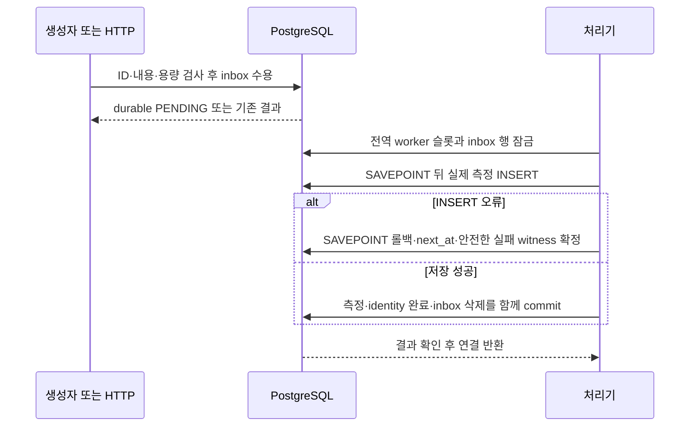

# Vital 이벤트 저장과 검증 필드

기존 `sensor_readings`와 그 `timestamp` 컬럼·기존 행은 유지한다. 아래 세 테이블만 추가한다.
정상/결함/복원 앱은 같은 테이블과 입력 경로를 사용하며, 실제 측정 INSERT의 컬럼 선택만 다르다.

## 입력과 대상 식별자

`POST /sensors/events`는 단일 이벤트를 받는다. 필수는 `event_id`, `sensor_id`, 정수
`schema_version`(1 또는 2), `reading_type`, 유한한 숫자 `value`, `unit`, 버전별 측정 시각이다.
v1은 `timestamp`, v2는 `sampled_at`만 허용하며 반대 버전 필드는 명시적 null도 거부한다.
측정 시각에는 시간대가 있어야 한다. HTTP와 자동 생성은 같은 입력 변환기를 쓴다.
자동 생성기는 실제 `sampled_at` 필드가 있는 v2 입력을 이 변환기에 전달한다.

`patient_id`는 기존 환자별 조회 키와의 명시적 연결이다. 생략하면 이 합성 데모의 고정
대상 `P-001`을 사용한다. 이는 실제 환자 연결의 증명이 아니며 `sensor_id`를 환자 ID로
복사하지 않는다. sensor ID는 별도 보존한다. 기존 `/sensors/data`는 기존 배치 API이며 새
버전 이벤트와 재시작 후에도 남는 접수 기록은 `/sensors/events`에 해당한다.

내용 지문은 이벤트 ID, 센서 ID, 명시적·기본 데모 대상, 버전, 종류, 숫자 값, 단위,
원래 측정 시각의 UTC 표현을 순서와 값 표현이 일정한 JSON으로 만든 SHA-256 해시다.
숫자와 시간대 표현만 통일하며 측정 시점을 수신 시각으로 바꾸지 않는다. 버전이 달라진 같은 ID도
다른 내용이다. 반복 입력의 지문이 다르면 409이며 기존 입력을 바꾸지 않는다.

## `vital_event_identity`

| 필드 | 의미 |
|---|---|
| `event_id` | 전역 중복 검사의 기본키(PK), 최대 128자 |
| `payload_sha256` | 정규화한 전체 의미 필드의 내용 지문 |
| `admission_sequence` | 조정 행의 accepted_total에서 수용 시 할당하는 고유 단조 순번 |
| `sensor_id` | 원래 센서 식별자, 환자 ID와 별도 |
| `schema_version` | 실제 수용한 1 또는 2 |
| `reading_id` | 수용 시 생성한 고유 UUID, 재시도 중 불변; 로그의 opaque reading_ref |
| `measurement_id` | 완료된 sensor_readings.id를 가리키는 외래키(FK), 미완료는 null; 고유하며 reading_id와 일치 |
| `created_at` | 수용 트랜잭션에서 샘플링한 DB 시각; commit 뒤에만 보임 |
| `completed_at` | 완료 트랜잭션에서 샘플링한 DB 시각; commit 뒤에만 보임. 실제 commit wall-clock 자체는 아님 |
| `failure_count` | 원자적으로 보존된 실제 SQL 실패 결과 횟수 |
| `last_failure_at` | 최근 보존된 실패 결과의 DB 시각 |
| `failure_sqlstates` | 실제 driver 코드별 `{count, last_at}`. 오류 문자열·SQL·입력 값 없음 |

완료된 ID도 내용 지문을 유지한다. `measurement_id` FK의 ON DELETE CASCADE로 중복 판정 정보는
측정 행의 기존 보존 수명에 연결된다. 미완료 identity는 측정 FK가 null이고 inbox가 참조한다.
미완료 데이터를 시간만으로 삭제하는 작업은 없다. 현재 서비스에 측정 보존 삭제 작업을 새로
추가하지 않는다. 보존 후 사라진 ID/측정을 영원히 검증했다고 주장하지 않는다.

## `vital_inbox`

| 필드 | 의미 |
|---|---|
| `event_id` | identity FK이자 PK, 이벤트 하나에 미완료 입력 하나 |
| `payload` | 위 정규화한 원래 입력. DB 내부에만 보존하며 진단 로그에 출력하지 않음 |
| `attempt_count` | 원자적으로 확정한 처리 시도 번호 |
| `next_at` | 다음 시도 가능 시각 |
| `created_at` | 최초 수용 시각 |

`(next_at, created_at)` 인덱스로 처리할 입력을 찾는다. 처리기는 애플리케이션용 잠금으로
제한한 전역 처리 슬롯을 잡고, `FOR UPDATE SKIP LOCKED`로 다른 처리기가 잠그지 않은
미완료 행을 잠근다. 이 잠금은 트랜잭션 일부만 되돌릴 수 있는 저장점(SAVEPOINT)보다 먼저
획득한다. 실제 INSERT 오류는 저장점까지만 되돌리고, 다음 시각·실패 근거·결과 계수를 바깥 트랜잭션에서
확정한다. 따라서 다른 worker가 next_at 보존 전에 같은 행을 처리하지 않는다.
성공은 측정 INSERT·identity 완료·inbox 삭제·계수 변경이 한 트랜잭션이다.

재시도 간격의 상한은 1초부터 지수적으로 증가해 최대 60초가 된다. 상한의 절반은 고정하고
나머지 절반은 무작위로 정하므로 실제 지연은 상한의 절반부터 상한까지다. 전역 처리 슬롯은
2개다. 이 값들은 자원 조절용 구현
선택이며 보존 횟수/기간 제한이 아니다. DB 연결을 가진 채 재시도 시간만큼 sleep하지 않는다.
알 수 없는 commit 결과는 완료로 기록하지 않고 같은 ID 재조회/재시도로 DB 상태를 따른다.

## `vital_coordinator`

기본키는 `id=1`이며 `epoch`는 저장 세대를 구별하기 위해 초기 생성한 UUID다. 기존 이벤트 데이터가 있는데 이 행이 없으면
새 epoch/계수를 추정해 복구하지 않고 시작을 거부한다.

| 필드 | 의미 |
|---|---|
| `last_slot` | DB 현재 UTC epoch-second 중 마지막으로 처리한 생성 슬롯 |
| `pending_count` | 수용/완료 트랜잭션에서 함께 증감, 0..86,400 CHECK |
| `generated_total` | 자동 생성되어 내구 수용된 누적 이벤트 |
| `accepted_total` | 고유 내구 수용 누적값 및 다음 admission_sequence 기반 |
| `skipped_capacity_total` | 실제 관측한 포화 슬롯에서 새 생성을 중단한 횟수 |
| `sql_attempts_total` | **commit된 outcome attempts**, 모든 물리 SQL 시작 횟수가 아님 |
| `sql_failures_total` | commit된 실패 outcome 수 |
| `retries_total` | 최초 이후의 commit된 시도 outcome 수 |
| `committed_total` | 실제 측정과 원자적으로 증가한 고유 저장 누적값 |

짧은 수용 트랜잭션이 조정 행을 잠근다. 기존 ID를 먼저 검사하므로 동일 입력은 포화 상태에서도
슬롯을 추가 사용하지 않는다. 새 이벤트의 86,400건 상한은 수용과 같은 트랜잭션에서 검사한다.
처리기는 느린 측정 INSERT 동안 이 전역 행을 잠그지 않는다. 완료/실패 결과의 마지막 계수
갱신만 잠그므로 생성은 SQL 재시도를 기다리는 루프로 연결되지 않는다.

여러 태스크가 같은 현재 DB 초의 슬롯을 제안해도 한 트랜잭션만 생성한다. 지난 슬롯을 반복하는
루프는 없으며 앱/DB 중단 뒤 현재 슬롯부터 재개한다. 중단 구간의 측정이나 수용을 만들어내지 않는다.

## 검증 대상 집합을 읽는 API

검증 대상 집합(cohort)은 고정한 수용 순번 구간에 속한 이벤트다. 재시도할 때 이미
저장됐다는 이유로 집합에서 빼거나, 뒤에 들어온 이벤트를 임의로 추가하지 않는다.

`GET /sensors/events/checkpoint`:

- `epoch`, `upper_inclusive=accepted_total`, `observed_at`.
- `lower_exclusive`는 현재 가장 이른 pending admission_sequence−1. pending이 없으면 현재 upper.
- 한 SQL snapshot으로 읽어 시작 전에 남아 있던 pending도 포함한다.

시작 checkpoint의 lower와 종료 checkpoint의 upper를 보존한 뒤
`GET /sensors/events/cohort?epoch=...&lower_exclusive=...&upper_inclusive=...`로 검증한다.
범위는 보수적 `(lower, upper]`이며 실패 행만 골라 축소하지 않는다.

응답은 `expected_events`, `retained_identities`, `matched_measurements`, `pending_events`,
`lost_pending_inputs`, `missing_measurements`, `missing_identities`, `payload_mismatches`,
`observed_42703_events`, `latest_42703_at`, `complete`다. source reset/bound 불일치는
`complete=false`와 reason을 반환한다. 실제 inbox를 outer join하므로 완료 identity에 inbox가
남아 있어도 pending으로 잡고, 미완료 identity의 inbox가 사라지면 lost_pending_inputs로 구분한다.

실제 측정 필드와 retained sensor/version/ID를 다시 조합해 원래 payload SHA를 대조한다.
측정 값·sensor/patient 값은 응답에 넣지 않는다. 해당 집합의 identity·측정이 모두 있고,
지문이 모두 일치하고 실제 pending이 0일 때만 complete다. 보존 수명 때문에 원본이
사라진 경우도 완료로 추정하지 않는다.

`observed_42703_events`는 C 안에서 실제 코드 42703이 보존된 이벤트 수다. `latest_42703_at`는
그 실제 witness의 가장 늦은 시각이다. root는 자신의 고정 trial 시간 범위와 함께 대조해야 한다.
글로벌 오류 한 건으로 해당 집합의 원인을 대신하지 않는다. 빈 구간은 일반 조회에서 완료로
반환될 수 있으나 **전체 데모는 expected_events>0, 실제 장애 구간의 42703 근거, 고정 집합의 완료를 모두
요구**한다. 서버 실행 RESOLVED와 이 추가 cohort 완료는 별도다.

## 지표·수명·권한

`Healthcare/Sensor`와 `ServiceName=healthcare-sensor-app`, 기존 실패 알람 좌표는 바꾸지 않는다.
표시 이름만 Vital Sensor다. `VitalIngestAttempts/Failures`는 확인된 완료 결과 기반 의미를 유지한다.
`VitalMeasurementSQLStarted`는 실제 measurement INSERT의 driver 호출 시작을 센다(성공/commit 보증 아님).
unknown/cancelled commit은 확인된 성공 계수에 넣지 않는다.

DB snapshot의 `VitalPendingEvents`, `VitalEventsGeneratedTotal`, `VitalEventsAcceptedTotal`,
`VitalGenerationCapacitySkippedTotal`, `VitalSQLOutcomeAttemptsTotal`, `VitalSQLOutcomeFailuresTotal`,
`VitalRetriesTotal`, `VitalUniqueCommittedTotal`은 **게이지/누적값으로 Maximum**을 사용한다.
여러 태스크 snapshot을 Sum으로 더하지 않는다. 새 snapshot이 있는 flush에만 포함하며 DB 조회가
실패하면 stale 값이나 0을 새 시각에 발행하지 않는다. metric 전송 exactly-once는 보장하지 않는다.

기존 `TRAFFIC_ENABLED`는 자동 신규 생성에 적용하며 durable consumer는 남은 입력을 처리한다.
기존 혼합 트래픽 scheduler는 production에서 조회/알림 읽기만 한다. 공유 pool+overflow가 3보다
작으면 두 worker와 producer의 최소 headroom이 없어 durable 서비스 시작을 거부한다. 기본 5+10은
그대로이며 숨은 별도 engine을 만들지 않는다. 종료 시 모든 owned coroutine/연결을 drain한다.

스키마·API·worker는 환자 레지스트리를 만들지 않으며 AWS 권한/자원도 추가하지 않는다.

## 관련 결정

- [Vital Sensor 입력·저장 계약](../adr/infra/0004-rds-healthcare-deployment.md)
- [실제 장애·승인 롤백·데모 완료 기준](../adr/infra/0007-demo-symptom-alarm-and-deployment-fault-injection.md)
