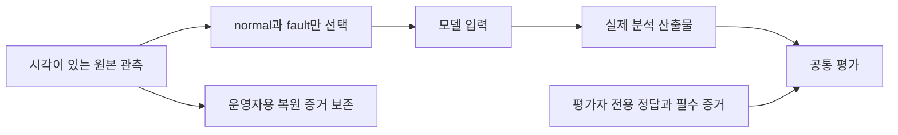
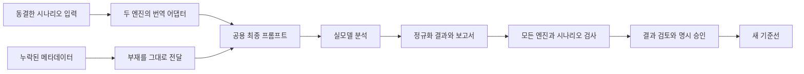
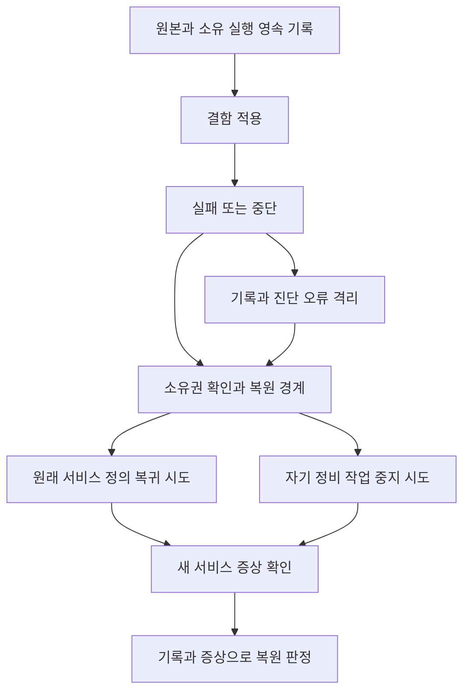

# ADR implementation review

## At a glance

독립 코드 재검토는 PASS이며 F1/F2/F3/F4와 관측시간 U3를 해소했다. 현재 로컬 proof·이미지의 출처가 일치한다.

최종 모델 평가 0 PASS/8 FAIL과 새 fixture 미승인을 기록했다. 평가용 AWS·로컬 자원은 정리와 부재 확인을 마쳤으며 기존 기준선과 Proposed를 유지한다.

실제 Healthcare AWS 알람·배포 복원은 미검증이다. 모델 자체 확정 8/8을 정답으로 취급하지 않으며 안전성 정적 검출은 실제 위험 작업 실행을 뜻하지 않는다. AWS를 새 상태 승격 선행조건으로 추가하지 않는다.

INCONCLUSIVE.

## Review mode

full. 독립 필요성·충족성 검토와 잔여 반례 재검토를 합성했다. 코드 재검토 PASS와 전체 증거 INCONCLUSIVE를 구분한다.

## Scope

전체 ADR 본문과 원래 호출 경로는 scope에, 실제 관련 변경은 changeScope에 기록했다. 이전 RCA 효율 수정의 재설계는 포함하지 않는다. 원본 검토 사본은 이력이며 현재 판정은 `sufficiency-closed-coverage.json`과 main 합성이다. 세 ADR은 Proposed로 유지한다.

## Context

<!-- generated review context start -->

두 분석 엔진을 같은 관측·원인·반증·안전성 계약으로 비교하며 일반 CI와 실모델·배포 검증을 분리한다.

사설 서비스 또는 전용 로컬 PostgreSQL, 소유 실행 ID, 불변 소스와 같은 부하 조건을 전제로 한다.

네 평가 계층, 공용 분석 경로, 관측의 부재·출처, 엔진 공통 기준과 두 엔진 전수 결과의 명시 승인 경계를 보존한다.

전체 ADR 본문과 원래 호출 경로를 검토했다. 독립 코드 재검토는 PASS이며 열린 코드 발견사항은 없다. 남은 미검증 행은 실제 AWS 실행과 모델 품질·승인의 증거 한계이므로 전체 판정은 INCONCLUSIVE다.

**ADR 0007: 데모 시나리오 — 실제 결함·증상 관측·원상복원** (`docs/adr/infra/0007-demo-symptom-alarm-and-deployment-fault-injection.md`)와 비교하면 관측의 원본·시간을 보존하고 실제 결함·복원 증거와 합성 입력을 구별한다. 반면 agent/0016의 model-eval은 제공 관측의 해석·인용을 평가하며 infra/0007의 실제 배포 알람·회복 검증을 대신하지 않는다. 따라서 같은 원본을 읽어도 모델 품질, 로컬 DB 메커니즘, AWS 증거 탐색의 결과를 서로 다른 증거 수준으로 기록한다.


<!-- generated review context end -->

## 실제 결함 관측에서 사고 입력을 만든다

동일 요청에서 생긴 네 원인을 구별할 관측만 모델에 제공하는가?

<!-- generated container zoom start -->

실제 결함 관측에서 사고 입력을 만든다. 모델 입력은 실제 PostgreSQL의 정상·결함 구간에서 선택하며 원인 정답은 평가자 측에 둔다.

원본 검토는 중립 obs/capture 식별자와 4개 source snippet의 hash·줄 일치를 확인했다.

미래 복원 결과나 정리 성공을 입력에 넣으면 사고 시점에 알 수 없던 정보를 원인 근거로 쓰게 된다.

원본 시각·단위·리소스와 코드 차이가 있는 사고 입력을 만든다. 원본 보존과 모델 투영을 분리하고 동일 원본의 normal과 fault를 선택한다.

실제 원인 관측과 평가 기대값의 혼입을 막는 경계를 읽을 수 있다. 현재 canonical 관측은 SHA-256 83aac573…의 컴파일된 로컬 proof를 가리킨다. 실제 proof와 이미지 3개는 verified=true이며 소스가 일치한다. 복원·정답의 입력 혼입 거부 시험도 통과했다.

<!-- generated container zoom end -->

화살표는 호출 순서 또는 자료 이동을 나타낸다. 실제 실행 증거의 범위는 도식 아래 문장과 함께 읽는다.



Notice: 복원 원본은 운영자에게 남고 모델은 사고 전후 두 구간만 받는다.

<!-- generated component zoom start -->

### Component C1 · 사고 전후 관측의 선택

**책임.** 모델 입력에서 미래 복원 정보와 평가자의 정답을 제외한다.

**상세 구현.** 같은 원본의 normal과 fault만 pair로 구성하고 원본 포인터 매핑을 따로 둔다. 관측 식별자는 중립적인 obs/capture 값이다.

**검증 결과.** 원본 T10 15 PASS, T12 projection 함수 문서 보완 후 11 PASS. 입력 변경 불변성은 catalog 회귀로 검사했다.

#### Code 1 · excerpt · tests/harness/scenario-capture-boundary.mjs:207

```
export function projectIncidentCaptures(scenarioId, proof, snippets = {}) {
  const caseName = CASES[scenarioId];
  assert.ok(caseName, 'unknown catalog id');
  const baseline = phaseData(proof, caseName, 'normal');
  const incident = phaseData(proof, caseName, 'fault');
  const pair = [baseline, incident];
  const resource = { runId: proof.run_id, schema: proof.schema };
  const operatorMapping = {};
```

- 코드 근거 설명: 모델로 들어갈 두 구간을 직접 선택하는 연속 코드다. 복원·cleanup 구간을 pair에 추가하지 않는다.
- 테스트: 원본 T10 15 PASS, T12 projection 함수 문서 보완 후 11 PASS. 입력 변경 불변성은 catalog 회귀로 검사했다.

### Component C2 · 같은 입력과 세션 수명

**책임.** 저장·조회가 같은 요청 조건과 세션 정리 경계를 사용한다.

**상세 구현.** 데이터 접근부는 session_context로 요청 본문의 예외를 정리 경로에 전달한다. 빌드 리비전 r2는 실제 행별 SQL을, r3는 예외 경로 반환 누락을 선택한다.

**검증 결과.** 현재 compiled proof83aac573…의 실제 SQL 1/121/1과 같은 응답 hash; main PostgreSQL2 PASS, Healthcare125 PASS. 독립 검토는 보존 증거를 재검사했다.

#### Code 1 · diff · packages/healthcare-sensor-app/src/test_service/adapters/secondary/sensor_repository/sqlalchemy_sensor_repository.py

```diff
@@ -6,14 +6,17 @@ from test_service.adapters.secondary.sensor_repository.models import SensorReadi
 from test_service.ports.dto.sensor import SensorReadingEntity
 from test_service.ports.interfaces.database import DatabasePort
 from test_service.ports.interfaces.sensor_reading_repository import SensorReadingRepositoryPort
+from test_service.revision.query import fetch_patient_rows
 
 
 class SqlAlchemySensorReadingRepository(SensorReadingRepositoryPort):
     def __init__(self, database: DatabasePort) -> None:
+        """Use the database port's lifetime contract rather than owning a separate pool."""
         self._database = database
 
     async def save_batch(self, readings: list[SensorReadingEntity]) -> list[SensorReadingEntity]:
-        async for session in self._database.session():
+        """Persist a batch in one scope so flush errors reach the compiled cleanup path."""
+        async with self._database.session_context() as session:
             rows = []
             for r in readings:
                 row = SensorReadingRow(
```

- 코드 근거 설명: generator 순회에서 context manager로 바꾼 실제 diff다. 세션의 종료 책임이 요청 본문 실패와 연결된다.
- 테스트: 현재 compiled proof83aac573…의 실제 SQL 1/121/1과 같은 응답 hash; main PostgreSQL2 PASS, Healthcare125 PASS. 독립 검토는 보존 증거를 재검사했다.

<!-- generated component zoom end -->

<!-- generated hill evidence start -->

### R1 · 충족됨 · 공통 시나리오는 실제 풀 설정 회귀, 업무 SQL 조회 증폭, 정비 트랜잭션의 락, 예외 경로의 세션 반환 누락을 다룬다. 정상→결함→복원 구간은 같은 요청 조건으로 비교하며, 코드·설정·SQL·연결 수명으로 원인을 구별할 수 있어야 한다.

**구현.** 네 scenario가 최신 현재-source PostgreSQL baseline/incident를 사용한다. 같은 입력의 restore 검증은 원본에 유지하되 모델 input에는 넣지 않는다.

**근거.** tests/harness/scenario-capture-boundary.mjs:207; packages/healthcare-sensor-app/demo/local_worker.py; proof-review-fixed-01 15phases

**테스트.** N1/N4/N5, canonical source hash83aac573…

### R2 · 충족됨 · 에이전트에 제공하는 관측은 시간 구간, 단위, 리소스 좌표, 로그와 변경 전후 차이를 보존한다. 관측 식별자는 중립적인 참조이며 정답 유형이나 장애 활성화 플래그 이름을 정답의 대용물로 사용하지 않는다. 정답과 필수 증거 목록은 평가자의 계약에만 둔다.

**구현.** 중립 obs/capture ID, UTC/단위/run/schema와 current-source snippets를 유지. expectation/미래cleanup은 projection 밖. source metadata는 실제 최종prompt까지 보존.

**근거.** tests/harness/scenario-capture-boundary.mjs:37,207; 양 eval_adapter→DTO→prompt source-view 경로

**테스트.** N2 canonical projection·metadata tests; N3 finalprompt probes; N5 source/snippet 대조

<!-- generated hill evidence end -->

## 제공된 메타데이터와 같은 기준으로 두 엔진을 평가한다

없는 알람 정보를 만들어내지 않고 두 엔진의 실제 결과가 모두 모여야 승인되는가?

두 엔진의 락 사례는 기대 유형 unsupported 대신 slow-query로 분류됐다. Headless의 세션 정리·정비 락·풀 설정 사례에는 확정 원인에 필요한 인용이 각각 누락됐다. Headless 세션 정리 사례의 step-1은 안전성 정적 검사에 걸렸지만, main 검토에서는 메모리상의 소유 집합 제거와 rollback 표현에 따른 오탐 가능성을 남겼다. 실제로 위험한 작업을 실행했다는 증거로 해석하지 않는다.

Strands의 세션 정리 설명은 예외 위치를 commit 이후로 서술했다. main이 대조한 probe의 SQL 오류는 commit 이전에 발생하므로 이 설명에는 사건 순서의 정밀도 한계가 있다. 이는 제공된 정성 검토 결과이며 새로운 코드 결함 판정을 추가하지 않는다.

<!-- generated container zoom start -->

제공된 메타데이터와 같은 기준으로 두 엔진을 평가한다. 평가 어댑터는 제공된 메타데이터의 값과 부재를 공용 최종 프롬프트까지 유지하며 운영 기본값은 보존한다.

region이 없는 현재 네 입력에는 not provided가 표시된다. region만 ap-northeast-2로 주고 ARN을 생략한 입력은 그 리전을 유지한다.

누락·null·공백은 not provided로 표현하지만 제공된 0이나 빈 차원 집합은 지우지 않는다. 새 세션 시각을 사고의 원본 시각으로 제시하지 않는다.

두 엔진의 원인·반증·산출물·안전성 기준을 같은 규칙으로 검사한다. 입력 어댑터, 공용 프롬프트, 실제 분석, 정규화 결과와 공통 평가가 이어지고 전수 결과 뒤에 검토·승인이 온다.

오프라인 통과나 한 엔진의 부분 결과만으로 새 모델 품질을 승인하지 않는다. F4 관련 시험과 독립 prompt 재현은 통과했다. 최종 실모델 결과 8개는 모두 필수 평가에 실패했고 경쟁 원인 기각은 0/8이다. 기준선 변경이나 새 fixture 승인은 없다.

<!-- generated container zoom end -->

화살표는 호출 순서 또는 자료 이동을 나타낸다. 실제 실행 증거의 범위는 도식 아래 문장과 함께 읽는다.



Notice: 없는 사고 metadata를 기본값으로 채우지 않는 경계는 검증됐다. 새 기준선 화살표는 승인 조건이며 현재 승인 사실이 아니다.

<!-- generated component zoom start -->

### Component C1 · 원본 알람 메타데이터의 전달

**책임.** 평가 어댑터가 제공 값과 부재를 공용 분석 경계로 옮긴다.

**상세 구현.** 제공된 Region/AlarmArn/Trigger와 명시적 eval source view를 전달한다. 없는 region/statistic/period/time은 최종 프롬프트에서 not provided로 표시하고 운영 기본값을 유지한다.

**검증 결과.** Strands113/Headless201 PASS 및 Curie의 실제 최종 prompt 재현 PASS. 현재 네 입력·minimal·region-only·null/blank·0/{} 경계를 확인했다.

#### Code 1 · diff · packages/agent/src/rca_agent/eval_adapter.py

```diff
@@ -128,9 +153,32 @@ def _alarm_envelope(scenario: dict[str, Any], *, state_change_time: str) -> dict
         "NewStateReason": state_reason,
         "StateChangeTime": state_change_time,
     }
-    metric = alarm.get("metric")
-    if metric:
-        envelope["Trigger"] = {"MetricName": metric, "Namespace": "", "Dimensions": []}
+    for source, target in (("region", "Region"), ("arn", "AlarmArn")):
+        if source in alarm and alarm[source] is not None:
+            envelope[target] = alarm[source]
+    trigger = {
+        target: alarm[source]
+        for source, target in (
+            ("metric", "MetricName"),
+            ("namespace", "Namespace"),
+            ("statistic", "Statistic"),
+            ("period", "Period"),
+            ("threshold", "Threshold"),
+            ("comparisonOperator", "ComparisonOperator"),
+            ("evaluationPeriods", "EvaluationPeriods"),
+            ("datapointsToAlarm", "DatapointsToAlarm"),
+            ("treatMissingData", "TreatMissingData"),
+        )
+        if source in alarm and alarm[source] is not None
+    }
+    if alarm.get("dimensions") is not None:
+        trigger["Dimensions"] = [{"name": name, "value": value} for name, value in alarm["dimensions"].items()]
+    if trigger:
+        envelope["Trigger"] = trigger
+    if _supports_model_eval(scenario):
+        # An explicit source view prevents production defaults and the fresh
+        # session timestamp from being presented as incident observations.
+        envelope["EvalSourceMetadata"] = {**metadata, "metric": alarm.get("metric")}
     return envelope
```

- 코드 근거 설명: 현재 실제 diff는 어댑터 경계의 변경 증거다. 기존 좁은 테스트의 통과를 최종 프롬프트 비노출 보장으로 확대하지 않는다.
- 테스트: Strands113/Headless201 PASS 및 Curie의 실제 최종 prompt 재현 PASS. 현재 네 입력·minimal·region-only·null/blank·0/{} 경계를 확인했다.

<!-- generated component zoom end -->

<!-- generated hill evidence start -->

### D0 · 검증 필요 · RCA 검증을 **오프라인 계약, fixture 구조 회귀, 실모델 계약 평가, 배포 E2E**의 네 계층으로 구성하고, 모노레포 루트 하네스가 계층별 실행 정책을 통제한다.

**구현.** 네 계층/공용 분석 경로/오프라인 enforcement는 구현·검사됨. 현행 fixture 승인digest gate는 FAIL, 최종8model 결과와 검토·승인은 아직 완료되지 않음(U2). 실제E2E 품질은 별도runtime미검증(U1).

**근거.** tests/harness/model-cli.mjs:runModelEvaluation; evaluator.mjs:evaluateResults/createBaseline; 양 eval_adapter의 공용 runner/pipeline 호출

**테스트.** N2 Strands113/Headless201 PASS; catalog gates41/42; 최종model8/AWS NOT RUN by reviewer

### R3 · 충족됨 · 알람의 리전·네임스페이스·차원·평가 조건이 제공되면 평가 어댑터는 이를 공용 파이프라인에 전달한다. 메타데이터가 없으면 만들어 채우지 않는다.

**구현.** F4 해소. eval 전용source view에서 없는/null/blank metadata는not provided; 제공된region은ARN 없이도 유지. numeric0/{} 유지. Strands의 새session시각은 모델의 원본시각으로 제시하지 않음. 운영기본값은별도호환 유지.

**근거.** packages/agent/src/rca_agent/eval_adapter.py:181; ports/dto/models.py:101; services/scoping.py:124; packages/headless-codex/src/headless_codex/eval_adapter.py:317; services/prompt_builder.py:67

**테스트.** N2 113+201 PASS; N3 current4+minimal/region-only 양엔진 PASS; N5 production3사례/engine before-after 동등

### R4 · 충족됨 · 합성 관측은 합성임을 명시하고 실제 AWS 수집 결과로 보고하지 않는다. 실제 데이터베이스의 재현 결과와 배포 E2E 결과도 구별한다. 배포 E2E는 준비된 관측을 주입하지 않고 실제 증상·증거·원상복원을 검증한다.

**구현.** 새관측은localPG로 명시, alarm은illustrative. model-eval만sourceview/observation을 전달하며 production/deployed 옵트아웃 유지. 배포E2E 성공은 주장하지 않음.

**근거.** tests/scenarios/*.json:provenance; 양eval_adapter mode checks; scripts/run_deployed_e2e.py:run

**테스트.** N2 opt-out·projection·metadata PASS; AWS NOT RUN

### R6 · 충족됨 · 원인 분류의 기존 허용 집합과 신뢰도·탐색 한도는 유지한다. 풀 설정이나 락을 커넥션 누수로 강제 분류하지 않는다. 각 사례의 필수 원인·반증 증거와 안전성 기준은 양쪽 엔진에 동일하게 적용한다.

**구현.** 허용 5종 유지. pool/lock=unsupported, query=slow-query, exception=db-leak. 0.8 확정/0.3 기각/0.9 종료, 깊이3·검증3·재생성2 유지. 경쟁 원인별 분리된 증거와 안전성 기준은 공통 evaluator.

**근거.** tests/harness/evaluator.mjs:10,75,351; packages/agent/src/rca_agent/config/settings.py:24; packages/headless-codex/src/headless_codex/services/analysis_contract.py:10

**테스트.** 원 검토의 T2,T3,T4,T5,T10; 정책 파일 git diff 없음

### R7 · 충족됨 · 교체된 입력과 기존 평가 결과는 이력으로 보존한다. 새 기준선은 새 입력을 사용한 두 엔진 전수 결과가 통과하고 검토된 뒤에만 승인한다. 기존 실패를 숨기거나 모델 결과를 만들어 채워 승인하지 않는다.

**구현.** 교체된입력/원본결과와 실패이력 보존. 현재결과fixture는미승인/부재, baseline미변경. 두엔진전수결과의검토전에는새baseline을 만들지 않고 현재digest변경을차단함.

**근거.** tests/fixtures/historical; tests/fixtures/results/README.md; tests/harness/evaluator.mjs:createBaseline

**테스트.** N2 archive/hash/approval-policy PASS; 승인digest assertion FAIL; 승인 실행 없음

<!-- generated hill evidence end -->

## 배포 검증을 실제 복원 증거로 제한한다

deployed-e2e를 선언한 실행이 실제 소유 자원과 서비스 회복으로 끝나는가?

<!-- generated container zoom start -->

배포 검증을 실제 복원 증거로 제한한다. 현재 네 사례는 model-eval만 선언하며 배포 E2E 성공을 선언하지 않는다.

F2 저장·진단 동시 오류의 원래 반례가 원본 서비스 복귀와 소유 작업 정리로 끝난다. Python56·Node4는 성공 표시와 소유권의 경계도 확인한다.

reset 응답이나 준비된 관측만으로 실제 배포와 서비스 회복을 통과시킬 수 없다.

실행 가능한 제어와 실제 복원 관측이 있는 배포 사례만 허용한다. 소유 원본 기록에서 서비스와 정비 작업의 복원을 각각 시도하고 후속 증상을 확인한다.

제공 관측 평가와 실제 증거 탐색의 검증 범위를 분리한다. 코드 복원 경로는 검증됐지만 실제 AWS 태스크 종료·서비스 증상 회복은 수행하지 않았다. R5의 미검증 상태는 이 실행 증거 한계를 표시한다.

<!-- generated container zoom end -->

화살표는 호출 순서 또는 자료 이동을 나타낸다. 실제 실행 증거의 범위는 도식 아래 문장과 함께 읽는다.



Notice: 이 도식은 검증해야 할 배포 경계이며 AWS 성공 증거를 대신하지 않는다.

<!-- generated component zoom start -->

### Component C1 · 고정 정비 명령과 기존 실행 복원

**책임.** 소유된 정비 모듈만 시작하고 과거 journal의 임의 프로그램 실행을 거부한다.

**상세 구현.** 명령은 MAINTENANCE_COMMAND에서 만들고 run ID·유한 유지 시간·schema를 검사한다. 기존 journal의 복원은 launch 검증과 분리된다.

**검증 결과.** necessity-review-final.md: 독립 N1 반례 재검사 PASS, Python 40 PASS, 관련 Node 15 PASS. 실제 AWS 호출 없음.

#### Code 1 · excerpt · scripts/run_realistic_demo.py:131

```
def maintenance_command(options):
    """Build only the bounded maintenance module command, including for old journals."""
    if (
        "maintenance_command" in options
        and options["maintenance_command"] != MAINTENANCE_COMMAND
    ):
        raise RuntimeError(
            "journal records an unsupported maintenance command; restore only"
        )
    run_id = options["run_id"]
    hold_seconds = options["hold_seconds"]
    schema = options.get("maintenance_schema", "public")
    if not isinstance(run_id, str) or not re.fullmatch(r"[A-Za-z0-9_-]{1,48}", run_id):
        raise ValueError("RunId must be 1..48 letters, digits, underscores or hyphens")
    if type(hold_seconds) not in (int, float) or not 0 < hold_seconds <= 7200:
        raise ValueError("hold-seconds must be finite, positive and <=7200")
    if not isinstance(schema, str) or not re.fullmatch(
        r"[a-z_][a-z0-9_]{0,62}", schema
    ):
        raise ValueError("maintenance-schema must be a safe PostgreSQL identifier")
    return [
        part.format(run_id=run_id, hold_seconds=hold_seconds, schema=schema)
        for part in MAINTENANCE_COMMAND
    ]
```

- 코드 근거 설명: N1 해소를 확인한 고정 명령 경계다. 임의 command를 포맷하여 실행하는 기존 선택 기능이 없다.
- 테스트: necessity-review-final.md: 독립 N1 반례 재검사 PASS, Python 40 PASS, 관련 Node 15 PASS. 실제 AWS 호출 없음.

### Component C2 · 기록·진단 출력 실패와 복원 제어의 분리

**책임.** 복원 중 저장 오류와 stderr 출력 오류를 메모리에 남기고 정리를 계속한다. 신규 변경의 사전 기록 실패는 원래 저장 오류를 다시 던진다.

**상세 구현.** 복원 중 저장 오류와 stderr 출력 오류를 메모리에 남기고 정리를 계속한다. 신규 변경의 사전 기록 실패는 원래 저장 오류를 다시 던진다.

**검증 결과.** Curie recheck-03: Python56 PASS/Node4 PASS, 원래 반례의 OSError와 실제 닫힌 stream ValueError 모두 원본:1 복원 PASS.

#### Code 1 · excerpt · scripts/run_realistic_demo.py:337

```
def record(self, kind, data, *, recovery=False):
        """Keep new intents strict while neither storage nor diagnostic I/O blocks cleanup."""
        try:
            return self.journal.append(kind, data)
        except RECOVERABLE_ERRORS as error:
            failure = {
                "step": "journal",
                "event": kind,
                "error": f"journal append failed: {type(error).__name__}",
            }
            self.journal_errors.append(failure)
            # Do not expose event payloads or arbitrary filesystem exception text.
            try:
                print(
                    json.dumps(failure | {"recoveryVerified": False}), file=sys.stderr
                )
            except (OSError, ValueError) as diagnostic_error:
                # The returned in-memory evidence survives even a closed/full stderr.
                failure["diagnosticErrorType"] = type(diagnostic_error).__name__
            if not recovery:
                raise
            return None
```

- 코드 근거 설명: F2의 마지막 잔여 반례를 닫은 실제 코드다. 기록 오류를 먼저 보존하고 진단 출력 실패를 따로 격리한다.
- 테스트: Curie recheck-03: Python56 PASS/Node4 PASS, 원래 반례의 OSError와 실제 닫힌 stream ValueError 모두 원본:1 복원 PASS.

<!-- generated component zoom end -->

<!-- generated hill evidence start -->

### R5 · 검증 필요 · 실행 가능한 배포 제어와 복원 경로가 있는 사례만 `deployed-e2e`를 선언한다. 복원은 원래 설정·이미지의 복귀, 소유 정비 작업 종료와 서비스 증상의 회복으로 확인하며 reset 응답만으로 통과하지 않는다.

**구현.** active 사례는 model-eval만 선언하며 미검증 deployed-e2e 선언을 하지 않음. CLI의 사전원본/소유task 복원과 F2 오류경로 검사는 통과했다. 실제AWS task/증상복원만 U1 runtime으로 미검증이며 추가배포를 ADR상태선행조건으로 만들지 않는다.

**근거.** tests/scenarios/*.json:executionModes; scripts/run_realistic_demo.py:restore,status

**테스트.** 보존된 CLI lifecycle + 최종 Python56/Node4 PASS; 실제AWS runtime NOT RUN

<!-- generated hill evidence end -->

## Findings

<!-- generated review diagnostics start -->

### 계약과 범위

26개 원본 계약을 모두 기록했고 코드 위반 0개다. 21 PROVEN/5 UNVERIFIED는 세 보고서 합계다.

sufficiency-residual-final-recheck.md; sufficiency-closed-coverage.json

### 자체 검증 결과

독립 코드 재검토는 PASS다. 최종 실모델 회차 realistic-final-20260910T025818Z-a57123은 정규화 결과 8개를 모두 남겼고 평가는 0 PASS/8 FAIL이다. 입력 digest는 8dc813d320341b5347ed5f299a5c52217a5c84a7d02863e8be79e2672e860cfc로 유지됐다. 산출물 완비 8/8, 증거 연결 7/8, 제안 안전성 정적 검사 7/8, 원인 식별 4/8이며 경쟁 원인 기각은 모두 false(0/8)다. 모델의 자체 확정 8/8은 모델이 내린 표시이며 검토자의 정답 판정이 아니다. 기존 기준선은 그대로이고 승인된 새 fixture는 없다.

평가용 자원 정리는 완료됐다. 최종 AWS 회차의 DynamoDB 테이블 4개, S3 버킷 1개, 벡터 버킷 1개와 인덱스 8개 삭제가 main에 의해 확인됐고, cleanup-verification.json의 자원 부재 검사는 allAbsent=true다. 중단한 이전 두 회차도 각각 allAbsent=true다. 로컬 PostgreSQL은 잔여 proof schema 0개를 확인한 뒤 소유 컨테이너와 익명 볼륨을 제거했다. 이 정리 결과는 평가용 자원의 종료 증거이며 Healthcare AWS 배포 E2E나 500ms 알람 관계의 성공을 의미하지 않는다. 출처: tests/results/model/realistic-final-20260910T025818Z-a57123/final-report.json; tests/results/model/realistic-final-20260910T025818Z-a57123/cleanup-verification.json; docs/test-reports/realistic-demo-evidence-2026-09-10/local-cleanup.json

### 필요성과 과다 변경

N1 독립 해소, N2 선택적·변경 없음. 열린 필수 코드 수정 없음.

necessity-review-final.md; sufficiency-residual-final-recheck.md

<!-- generated review diagnostics end -->

열린 코드 발견사항은 없다. HTTP 로그 F1, 복원 F2, 함수 문서 F3, 메타데이터 F4와 최소 관측시간 U3는 독립 재검토로 해소됐다. N1도 종료됐고 N2는 선택적 정리로 변경하지 않았다.

### F1. U1 — 실제 AWS 알람과 배포 복원의 실행 증거는 미검증이다.

로컬 PostgreSQL과 이미지 검증은 AWS 알람 전이·전달·서비스 회복을 직접 관측한 결과가 아니다.

Healthcare AWS 배포 E2E는 수행하지 않았다. 별도 평가용 AWS 자원과 로컬 PostgreSQL 자원은 정리 후 부재 확인을 마쳤다.

현재 실행 증거의 한계로 기록한다. 새 코드 수정이나 상태 승격 선행조건을 추가하지 않는다.

### F2. U2 — 최종 모델 평가 8개가 모두 실패했고 새 기준선은 미승인이다.

오프라인 코드 시험 통과는 새 관측에 대한 두 모델의 원인·반증·안전성 품질을 증명하지 않는다.

정규화 결과 8개가 완료됐고 필수 평가는0 PASS/8 FAIL이다. 입력 digest는 유지됐으며 기존 기준선과 승인되지 않은 새 fixture 상태를 보존한다.

최종 실패 결과를 그대로 보존하고 모델 자체 확정, 정적 안전성 검출과 실제 실행 사실을 구분해 읽는다. 이 문서에서 코드 종료 판정이나 승인 정책을 바꾸지 않는다.

## ADR contract coverage

| 계약 | 상태 | Hill | 요구사항 |
| --- | --- | --- | --- |
| D0 | 검증 필요 | H2 | RCA 검증을 **오프라인 계약, fixture 구조 회귀, 실모델 계약 평가, 배포 E2E**의 네 계층으로 구성하고, 모노레포 루트 하네스가 계층별 실행 정책을 통제한다. |
| R1 | 충족됨 | H1 | 공통 시나리오는 실제 풀 설정 회귀, 업무 SQL 조회 증폭, 정비 트랜잭션의 락, 예외 경로의 세션 반환 누락을 다룬다. 정상→결함→복원 구간은 같은 요청 조건으로 비교하며, 코드·설정·SQL·연결 수명으로 원인을 구별할 수 있어야 한다. |
| R2 | 충족됨 | H1 | 에이전트에 제공하는 관측은 시간 구간, 단위, 리소스 좌표, 로그와 변경 전후 차이를 보존한다. 관측 식별자는 중립적인 참조이며 정답 유형이나 장애 활성화 플래그 이름을 정답의 대용물로 사용하지 않는다. 정답과 필수 증거 목록은 평가자의 계약에만 둔다. |
| R3 | 충족됨 | H2 | 알람의 리전·네임스페이스·차원·평가 조건이 제공되면 평가 어댑터는 이를 공용 파이프라인에 전달한다. 메타데이터가 없으면 만들어 채우지 않는다. |
| R4 | 충족됨 | H2 | 합성 관측은 합성임을 명시하고 실제 AWS 수집 결과로 보고하지 않는다. 실제 데이터베이스의 재현 결과와 배포 E2E 결과도 구별한다. 배포 E2E는 준비된 관측을 주입하지 않고 실제 증상·증거·원상복원을 검증한다. |
| R5 | 검증 필요 | H3 | 실행 가능한 배포 제어와 복원 경로가 있는 사례만 `deployed-e2e`를 선언한다. 복원은 원래 설정·이미지의 복귀, 소유 정비 작업 종료와 서비스 증상의 회복으로 확인하며 reset 응답만으로 통과하지 않는다. |
| R6 | 충족됨 | H2 | 원인 분류의 기존 허용 집합과 신뢰도·탐색 한도는 유지한다. 풀 설정이나 락을 커넥션 누수로 강제 분류하지 않는다. 각 사례의 필수 원인·반증 증거와 안전성 기준은 양쪽 엔진에 동일하게 적용한다. |
| R7 | 충족됨 | H2 | 교체된 입력과 기존 평가 결과는 이력으로 보존한다. 새 기준선은 새 입력을 사용한 두 엔진 전수 결과가 통과하고 검토된 뒤에만 승인한다. 기존 실패를 숨기거나 모델 결과를 만들어 채워 승인하지 않는다. |

## Notable implementation choices

| Selected value or behavior | Code evidence | Why it fits the ADR intent | Why it matters |
| --- | --- | --- | --- |
| 로컬 latency 후보29.73166643641889ms, 초기 AWS500ms | demo/local_runner.py:194; healthcare-service-stack.ts:314 | 측정과 환경별 calibration(R6)을 분리 | 서로 다른 지표 집계이며 전자를 AWS 보장값으로 쓰지 않는다. |
| alarm envelope는 illustrative, 현재 observation은 baseline+incident만 | scenario-capture-boundary.mjs:phaseData,projectIncidentCaptures; tests/scenarios/*.json | 원인 답안·미래 복원을 input에 누설하지 않는 경계(A16 R2/R4) | source hash와 원본 capture 참조로 현재 입력을 추적한다. |
| eval source view의 None은 운영 경로, dict는 제공값 전용 평가 경로 | 양 DTO/eval_adapter와 공용 scoping/prompt_builder | 제공되지 않은 사고 metadata를 런타임 기본값으로 채우지 않는다. | 누락값은 not provided지만 실제 0/{}는 보존하고 운영 프롬프트 호환성을 유지한다. |

## Tests

main 최신 집계는 단위 1,771 PASS(agent740/headless824/healthcare125/infra82), 루트136 PASS/1 FAIL이다. 루트 실패는 이전 승인 기준선 digest와 새 입력의 차이이며 기준선을 그대로 보존했다. format/lint/build/typecheck PASS, 기존 skip2/xfail1을 구분한다.

F4는 Strands113/Headless201 및 독립 최종 prompt 재현이 통과했다. 마지막 F2는 Python56/Node4와 journal·stderr 동시 오류의 원래 두 반례가 통과했다. 이미지 pin은 독립 focused48/2 suites와 main 전체 infra82를 구분한다. 같은 시험의 재실행 수를 합산하지 않는다.

실제 PostgreSQL 통합2 PASS와 fixed-proof `83aac573c02bd6eb9596ced5e0797460018704b62b955905b68b15707d1b4f2b`, 컴파일 소스와 이미지3개 일치를 보존한다. 이 실제 compiled proof와 이미지의 manifest는 verified=true다. UNBUILT 체크아웃 manifest의 verified=false와 구분한다.

최종 실모델 회차 realistic-final-20260910T025818Z-a57123은 정규화 결과 8개를 모두 남겼고 평가는 0 PASS/8 FAIL이다. 입력 digest는 8dc813d320341b5347ed5f299a5c52217a5c84a7d02863e8be79e2672e860cfc로 유지됐다. 산출물 완비 8/8, 증거 연결 7/8, 제안 안전성 정적 검사 7/8, 원인 식별 4/8이며 경쟁 원인 기각은 모두 false(0/8)다. 모델의 자체 확정 8/8은 모델이 내린 표시이며 검토자의 정답 판정이 아니다. 기존 기준선은 그대로이고 승인된 새 fixture는 없다.

두 엔진의 락 사례는 기대 유형 unsupported 대신 slow-query로 분류됐다. Headless의 세션 정리·정비 락·풀 설정 사례에는 확정 원인에 필요한 인용이 각각 누락됐다. Headless 세션 정리 사례의 step-1은 안전성 정적 검사에 걸렸지만, main 검토에서는 메모리상의 소유 집합 제거와 rollback 표현에 따른 오탐 가능성을 남겼다. 실제로 위험한 작업을 실행했다는 증거로 해석하지 않는다.

Strands의 세션 정리 설명은 예외 위치를 commit 이후로 서술했다. main이 대조한 probe의 SQL 오류는 commit 이전에 발생하므로 이 설명에는 사건 순서의 정밀도 한계가 있다. 이는 제공된 정성 검토 결과이며 새로운 코드 결함 판정을 추가하지 않는다.

평가용 자원 정리는 완료됐다. 최종 AWS 회차의 DynamoDB 테이블 4개, S3 버킷 1개, 벡터 버킷 1개와 인덱스 8개 삭제가 main에 의해 확인됐고, cleanup-verification.json의 자원 부재 검사는 allAbsent=true다. 중단한 이전 두 회차도 각각 allAbsent=true다. 로컬 PostgreSQL은 잔여 proof schema 0개를 확인한 뒤 소유 컨테이너와 익명 볼륨을 제거했다. 이 정리 결과는 평가용 자원의 종료 증거이며 Healthcare AWS 배포 E2E나 500ms 알람 관계의 성공을 의미하지 않는다.

모델 결과 출처: `tests/results/model/realistic-final-20260910T025818Z-a57123/final-report.json`. 정리 출처: `tests/results/model/realistic-final-20260910T025818Z-a57123/cleanup-verification.json`, `docs/test-reports/realistic-demo-evidence-2026-09-10/local-cleanup.json`.

실행 명령과 출처는 다음과 같다.

| 실행 | 관측 결과·출처 |
| --- | --- |
| `python3 tests/harness/realistic_demo_cases.py -v` | 최종56 PASS; Curie recheck-03/python56-final.log |
| `node --test tests/harness/realistic-demo-script.test.mjs` | 4 PASS; recheck-03/node4.log |
| `pnpm --filter infra exec jest --runInBand --cache=false test/healthcare-service-stack.test.ts test/healthcare-image-config.test.ts` | 독립48 PASS/2 suites; recheck-03/infra-pin.log |
| Healthcare venv의 `sufficiency-recheck-03/original-repro.py` | OSError와 닫힌 stream ValueError 모두 원본:1 복원 PASS |
| 양 엔진 `tests/test_eval_alarm_metadata.py` 및 관련 caller/prompt suite | Strands113/Headless201 PASS; sufficiency-final-review.md의 정확한 N2 명령 |
| 루트·패키지 최종 검증 | main-verification.json과 realistic-demo-evidence-2026-09-10 로그; 단위1771, 루트136/1 |

## Residual risks

코드 종료 판정은 PASS다. 전체 증거는 21 PROVEN/0 VIOLATED/5 UNVERIFIED로 INCONCLUSIVE이며, 미검증은 실제 runtime·알람과 모델 품질·승인 범위를 표시한다. AWS 배포를 ADR 상태 승격의 새로운 선행조건으로 추가하지 않는다. 현재 Proposed를 유지하며 승인 기준선은 갱신하지 않았다.

AWS 배포 E2E·500ms 알람 관계는 실행하지 않았다. 최종 모델 평가는 0 PASS/8 FAIL이며 이전 진단 실패와 중단 기록을 보존한다. 최종 회차와 중단 두 회차, 로컬 PostgreSQL 자원의 정리를 확인했다. 코드 종료 시점의 closed coverage는 유지하고 이후 모델 결과를 이 절에 기록했다.

NOT_OPENED — 이전 자동 승인 검토의 local file:// 차단과 사용자의 HTTP·shell·다른 브라우저 우회 금지에 따른다. open helper·브라우저 시각 검사는 수행하지 않았다. 정적 SVG XML·관계 도형·내부 링크만 검사한다.
