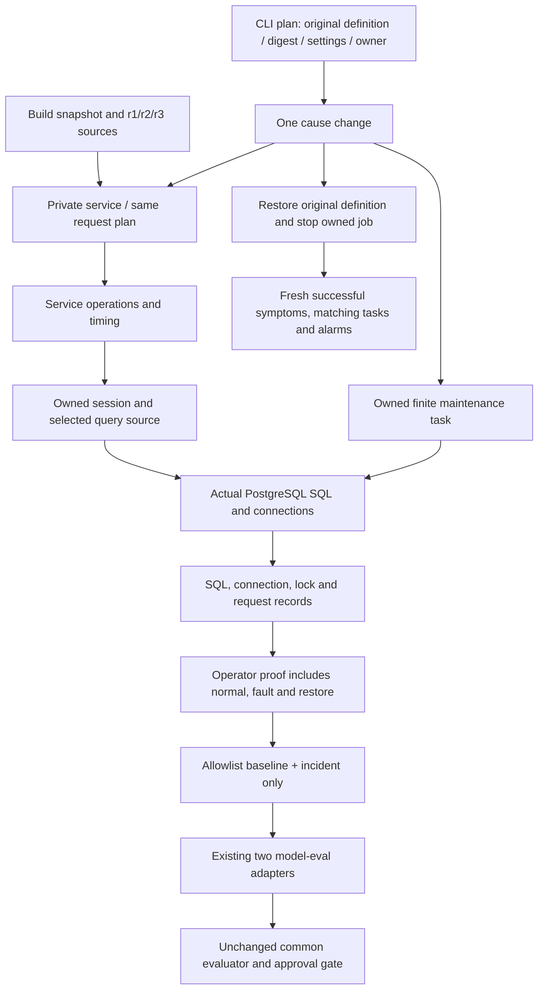

# Necessity Review

## Verdict

**FIX_REQUIRED — N1: remove the unused arbitrary maintenance-command extension.**

This is an independent necessity verdict, not an implementation-sufficiency, model-quality, deployment, or ADR-promotion verdict. The implemented real mechanisms, bounded workload, source manifests, owned restoration, and incident-only observations have current consumers and must remain. N2 is a small, nonblocking cleanup opportunity.

| ADR | Necessity result | Reason |
| --- | --- | --- |
| `docs/adr/infra/0004-rds-healthcare-deployment.md` | PASS, with optional N2 | No material removable mechanism, observer, lifecycle, or infrastructure change found. The private metric wrapper can be tidied without changing the required migration. |
| `docs/adr/infra/0007-demo-symptom-alarm-and-deployment-fault-injection.md` | FIX_REQUIRED | N1 makes the owned maintenance runner an arbitrary program launcher, although its only actual mechanism is the existing maintenance module. |
| `docs/adr/agent/0016-rca-evaluation-test-harness.md` | PASS for necessity | The catalog, incident projection, metadata adapters, preserved history, and rejection tests serve the approved contract. Approval remains blocked by the unchanged baseline gate; this review does not authorize rebaselining. |

Reviewed repository: `/Users/dongkyl/git/rca-agent`; HEAD `bc5a7d5ea182d4d220b45671a09787aed465ff20`. The working tree is deliberately mixed and uncommitted. Exact reviewed input fingerprints are in `necessity-input-fingerprints.json`; targeted reproduction and output are in `necessity-reproduce.py` and `necessity-reproduction.json` beside this report.

## Independent grounding and scope

Read the requested `/private/tmp/rca-adr-tools-0.8.19/agents/adr-impl-necessity-reviewer.md`, the complete `references/implementation-evidence.md`, all three target ADR bodies and mapping entries, the supplied baseline/ledger, root AGENTS, healthcare/infra/headless package AGENTS, and `docs/agent-protocol.md`. `packages/agent/AGENTS.md` does not exist. Repository ADR README/TEMPLATE are the available seeded conventions; repository `authoring-rules.md` and `concepts.md` do not exist. Used the requested 0.8.19 template fallback, especially **“Concrete numbers — keep requirement values, drop tuning values,” “Non-numeric requirements — value sets, mandatory fields, permissions, ordering,”** and **“The abstraction ladder.”**

Inspected raw tracked diffs and untracked production/test sources directly. Did not read refactor reports, sufficiency reports, explanation HTML/documents, or artifact-contract. The freeze JSON was used only to identify file hashes; its claimed test results were not used as execution evidence. No repository code, ADR, mapping, baseline, or test was edited. No AWS API, model, or browser was invoked.

The older RCA efficiency changes are separate: agent queue/main/beam/planning/validation changes, destructive-action changes, headless specialist routing, prompt/runner/session-redelivery changes, and their older tests/reports are **not excess scope findings for this demo**. In the mixed headless eval-adapter diff, the alarm metadata block is the realistic-demo unit; role routing and evidence-summary citation handling were inspected as existing adjacent consumers, not presumed to be newly authorized demo functionality. No claim is made about the historical origin of individual mixed hunks beyond the supplied baseline.

## Minimum contract

The ADR level owns the four actual causes, stable comparison conditions, mandatory provenance, source identity, ownership, cleanup, visibility, units, legacy values, evaluation boundaries, and unchanged approval policy. Function names, module organization, hash representation, and internal polling/default tuning are implementation discretion. The evidence contract also makes necessary function documentation and executable boundary evidence non-removable; tests are not excess simply because an ideal case already works.

- **infra/0004 D0:** independently deploy the relational database and private Healthcare service; retain secret references, demo-scale topology, built-in workload, optional tracing, and the admitted VPC-wide database ingress tradeoff. Add only the controlled workload, immutable revisions, real maintenance mechanism, observability, and owned cleanup needed for reproducibility.
- **infra/0007 D0:** connect actual configuration regression, immutable faulty images, and an owned maintenance transaction to symptoms; compare normal → fault → restore under the same request conditions. The selected mechanisms are actual pool shrinkage, repeated business SELECTs, a write-conflicting transaction lock, and missing session return on an exceptional path.
- **agent/0016 D0:** retain the common four-layer harness: offline contracts, fixture structural regression, explicit real-model evaluation, and separate deployed E2E. Both engines retain the same structural cause/evidence/artifact/safety/rejection requirements and existing confidence/search limits. The headless model/provider/effort contract remains unchanged.
- Requirement values remain verbatim: legacy pool **5 + 10**, connection alarm **12**, direct connection injection default **20**, ingest aggregation **30 seconds**, alarm **1-minute periods × 2**, and legacy observation window **at least 2 minutes 30 seconds**. Also retain the pre-existing ADR 0016 prohibition on confirmation below **0.8**, validation numbering from **1**, and a fourth validation. None is a deletion candidate.
- Runtime faults and direct injection remain compatibility paths, not evidence of the new four causes. Prepared observations are allowed only in model-eval, not deployed E2E. Current catalog entries correctly declare only `model-eval`; no new evaluated result snapshots or approved baseline are fabricated.
- Out of scope: redesigning RCA efficiency, changing models or grading thresholds, weakening rejection/safety/approval, deleting historical failures, adding a generic job execution feature, or claiming AWS E2E success from local data. Restoration observations stay with the operator; the model receives only the baseline and incident projection.
- Risk tolerance: failures/cancellation/restarts and concurrent ownership matter. Do not shrink journal, source, owner, or cleanup checks merely because ideal-case execution works. AWS deployed E2E and model runs are outside this read-only pass.

## Contract-to-hill ledger

Each supplied D0/R row is assigned once below. “Required” is a necessity disposition, not proof of deployed sufficiency. U references are the implementation-unit ledger in the following section.

### infra/0004

| Contract | Hill | Minimum obligation (original ledger wording) | Necessity evidence |
| --- | --- | --- | --- |
| D0 | H1 | Full Decision, summarized above | Required: U1,U2,U3 |
| R1 | H1 | 데이터베이스와 서비스는 사설 네트워크에서 동작하고 자격 증명은 비밀 참조로 주입한다. 배포 구성과 이미지에 자격 증명을 포함하지 않는다. | Required: U1 |
| R2 | H1 | 서비스는 제한된 동시 실행 수와 완료 속도에 독립적인 요청 시작 계획을 사용한다. 상한 때문에 실행하지 못한 요청은 별도 기록하고 무한 대기열이나 몰아 보내기를 만들지 않는다. | Required: U2,U3 |
| R3 | H1 | 정상 이미지가 기본이며, 실제 설정 변경·불변 결함 이미지·소유 정비 작업으로 네 시나리오를 재현한다. 기존 장애 플래그와 직접 주입 경로는 호환용으로 보존한다. | Required: U4,U5,U6 |
| R4 | H1 | 요청 상태, SQL 횟수·시간, 연결 수명과 유효 풀 설정을 관측하되 SQL 매개변수와 자격 증명을 기록하지 않는다. 지표 방출은 요청 완료에 의존하지 않는다. | Required: U3,U7,U8 |
| R5 | H2 | 서비스와 정비 작업의 종료·실패·종료 신호는 소유한 작업과 연결을 정리한다. 정비 트랜잭션은 유한한 유지 한도를 가지며 자기 트랜잭션만 롤백한다. | Required: U5,U6,U8,U10 |
| R6 | H1 | 배포된 이미지와 소스 리비전을 식별할 수 있어야 하며 정상·결함·복원은 같은 부하 조건으로 검증한다. | Required: U4,U9 |

### infra/0007

| Contract | Hill | Minimum obligation (original ledger wording) | Necessity evidence |
| --- | --- | --- | --- |
| D0 | H1 | Full Decision, summarized above | Required: U4,U5,U6,U9 |
| R1 | H1 | 풀 설정 회귀는 실제 애플리케이션 풀 설정 변경으로 재현하고 원래 설정 복원 뒤 같은 부하에서 저장과 연결 대기가 회복되어야 한다. | Required: U2,U5,U9,U13 |
| R2 | H1 | 조회 증폭은 불변 결함 이미지의 실제 업무 SQL 증가로 재현한다. 정상 이미지로 되돌리면 같은 응답 데이터와 SQL 횟수·조회 시간이 회복되어야 한다. | Required: U4,U5,U9 |
| R3 | H2 | 정비 트랜잭션은 실제 쓰기 충돌 락과 소유 실행 식별자를 가져야 한다. 유한한 유지 한도와 종료·실패·시그널의 롤백 경로가 있고 다른 실행의 작업은 종료하지 않는다. | Required: U6,U10,U13,U14 |
| R4 | H1 | 세션 정리 회귀는 같은 예외 입력에서 결함 이미지에만 반환 누락이 생겨 이후 정상 저장을 방해해야 한다. 정상 이미지 복원과 결함 태스크 종료 뒤 연결 반환과 저장 성공을 확인한다. | Required: U4,U5,U9 |
| R5 | H1 | 요청 시작·완료·실패·진행 중 상태와 실행하지 못한 부하를 구분하며 무한 대기열이나 몰아 보내기를 만들지 않는다. 기존 완료 기반 지표 의미는 보존한다. | Required: U2,U3 |
| R6 | H1 | 조회 시간은 밀리초로 관측하고 요청 완료와 독립적으로 메트릭을 방출한다. 정상·복원은 비위반이고 결함은 위반인 증상 알람 관계를 실제 비교로 확인한다. | Required: U3,U9,U15 |
| R7 | H3 | 관측은 시각·단위·리소스·원본 로그·변경 차이를 보존한다. 정답성 플래그나 해석을 관측으로 대신하지 않으며 SQL 매개변수와 자격 증명은 기록하지 않는다. | Required: U7,U9,U16 |
| R8 | H2 | 변경 전에 원래 실행 정의·이미지·관련 설정과 부재 값을 소유 실행 ID에 묶어 보존한다. 실패·중단에도 모든 복원 단계를 시도하고 서비스 회복으로 성공을 판정한다. | Required: U11,U12,U13,U14,U15 |
| R9 | H1 | 레거시 기본 풀 5개·초과 10개, 연결 알람 12개, 직접 연결 주입 기본 20개는 유지한다. 기존 저장 실패 알람의 30초 집계·1분 주기 2회 평가·최소 2분 30초 관측 구간을 해당 경로에 유지한다. | Required: U1,U3,U5,U17 |
| R10 | H3 | 합성·실제 PostgreSQL·배포 E2E 증거를 구분하고, 배포 E2E에 준비된 정답 관측을 주입하지 않는다. 새 입력과 양쪽 엔진 결과 검토 전에는 기준선을 갱신하지 않는다. | Required: U16,U18,U19 |

### agent/0016

| Contract | Hill | Minimum obligation (original ledger wording) | Necessity evidence |
| --- | --- | --- | --- |
| D0 | H3 | Full Decision, summarized above | Required: U16,U18,U19 |
| R1 | H1 | 공통 시나리오는 실제 풀 설정 회귀, 업무 SQL 조회 증폭, 정비 트랜잭션의 락,   예외 경로의 세션 반환 누락을 다룬다. 정상→결함→복원 구간은 같은 요청 조건으로   비교하며, 코드·설정·SQL·연결 수명으로 원인을 구별할 수 있어야 한다. | Required: U4,U5,U6,U9 |
| R2 | H3 | 에이전트에 제공하는 관측은 시간 구간, 단위, 리소스 좌표, 로그와 변경 전후 차이를   보존한다. 관측 식별자는 중립적인 참조이며 정답 유형이나 장애 활성화 플래그 이름을   정답의 대용물로 사용하지 않는다. 정답과 필수 증거 목록은 평가자의 계약에만 둔다. | Required: U7,U16,U18 |
| R3 | H3 | 알람의 리전·네임스페이스·차원·평가 조건이 제공되면 평가 어댑터는 이를 공용   파이프라인에 전달한다. 메타데이터가 없으면 만들어 채우지 않는다. | Required: U18 |
| R4 | H3 | 합성 관측은 합성임을 명시하고 실제 AWS 수집 결과로 보고하지 않는다.   실제 데이터베이스의 재현 결과와 배포 E2E 결과도 구별한다. 배포 E2E는 준비된   관측을 주입하지 않고 실제 증상·증거·원상복원을 검증한다. | Required: U9,U16,U19 |
| R5 | H2 | 실행 가능한 배포 제어와 복원 경로가 있는 사례만 `deployed-e2e`를 선언한다.   복원은 원래 설정·이미지의 복귀, 소유 정비 작업 종료와 서비스 증상의 회복으로   확인하며 reset 응답만으로 통과하지 않는다. | Required: U13,U14,U15,U16 |
| R6 | H3 | 원인 분류의 기존 허용 집합과 신뢰도·탐색 한도는 유지한다. 풀 설정이나 락을   커넥션 누수로 강제 분류하지 않는다. 각 사례의 필수 원인·반증 증거와 안전성   기준은 양쪽 엔진에 동일하게 적용한다. | Required: U18,U19 |
| R7 | H3 | 교체된 입력과 기존 평가 결과는 이력으로 보존한다. 새 기준선은 새 입력을 사용한   두 엔진 전수 결과가 통과하고 검토된 뒤에만 승인한다. 기존 실패를 숨기거나   모델 결과를 만들어 채워 승인하지 않는다. | Required: U19 |

## Review-unit ledger and complete relevant callscope

Paths below are relative to the repository. For compactness, **HS** means `packages/healthcare-sensor-app`, **CLI** means `scripts/run_realistic_demo.py`, and **HC** means `packages/headless-codex/src/headless_codex`. Each row accounts for current consumers, the deletion consequence, and an existing-path alternative.

| Unit | Disposition and concrete call path | Deletion hypothesis / existing alternative |
| --- | --- | --- |
| U1 — infrastructure | Required. `packages/infra/bin/infra.ts:64` passes loader controls into `healthcare-service-stack.ts:69,183,259`; task environment reaches `AppSettings`, secrets remain references, private service remains private. Existing `rds-stack.ts:19,30` owns DB ingress/secret/topology. | Removing new controlled environment wiring prevents deployment of the same measured profile. No new IAM service, database, or topology is introduced. Schema validation checks input shape; stack validation also protects direct stack callers, exercised by tests. |
| U2 — workload controls and scheduler | Required. `HS/src/test_service/config/settings.py:33,85` → `main.py:50` → `services/traffic_generator.py:85` → `_run_request:152`; fixed slots, bounded task set, skipped-count accounting, slot-local seeded inputs. | The old loop awaited completion before sleeping; restoring it changes offered load when the fault stalls. No existing finite independent scheduler satisfies this path. Values are tunable, but positive/finite constraints prevent unbounded work. |
| U3 — service symptom accounting | Required. `services/sensor.py:31,105,126` → `symptom_metrics.py:72,80,90,118,153,168`; one container-shared publisher. Query duration is milliseconds, abnormal-ingest delay remains seconds, cancellation releases the gauge without pretending a completed ingest. | Existing completed-reading counts cannot expose stalled work or query time. Periodic flush remains necessary even though recording can opportunistically flush; sample-cap flushing and periodic flushing address different failure cases. N2 concerns only a stranded private wrapper. |
| U4 — immutable source revisions | Required. `HS/Dockerfile:10` and `demo/local_runner.py:292` → `demo/build_revision.py:31,69`; fixed r1 base, r2 query and r3 session overlays; runtime `revision/manifest.py:8` called at adapter startup and by the proof worker. | Runtime flags cannot establish a source-code regression. Source snapshot capture prevents concurrent edits from changing comparison phases. Manifest hashing is read by CLI baseline validation and proof/source projection; it is not unused metadata. No new dependency required. |
| U5 — query/session ownership | Required. `sqlalchemy_sensor_repository.py:17,38,69` uses `DatabasePort.session_context` → adapter `session_context:86` → build-selected `session_scope`; patient query calls `fetch_patient_rows`. r2 runs ID query then per-row SELECT, r3 omits exceptional cleanup. | Reverting the async-context migration loses body-exception delivery and deterministic cleanup. The existing generator is retained for `services/health.py:19` and legacy tests. The bridge in `ports/interfaces/database.py:10` has current SQLite/test-adapter consumers. Stable tie ordering preserves identical rows. Separate owned/legacy registries are consumed by disposal/reset, not speculative caches. |
| U6 — maintenance transaction | Required core. `HS/src/test_service/maintenance.py:148` → `_main:120` → `hold_lock:30`; bounded SHARE lock, backend/run identity, signal stop, transaction rollback and connection close. CLI uses the same module/image. | Artificial sleep or pool exhaustion cannot replace a real lock with blocker/waiter evidence. `native_dsn:25` is consumed by the module and local proof. The arbitrary command override is separately removable (N1); the owned transaction implementation is not. |
| U7 — DB evidence | Required. Service operation contexts → `db_observability.py:40,74` event hooks; adapter checkout timing at `database_adapter.py:94`; `wait_snapshot:178` reads bounded activity/locks/capacity; `observe:237` publishes independently. | Completion-only metrics cannot distinguish SQL amplification, lock waits, and absent return. Observer pool/lock is a real single-consumer limit and avoids waiting behind the exhausted application pool. SQL hashes avoid parameter text. Context attribution remains useful when checkin occurs after request exit. |
| U8 — service lifecycle | Required. `main.py:18` owns scheduler/observer/flush tasks; `_cancel_and_drain:87` awaits all; `di/app_container.py:108` flushes then disposes; adapter `dispose:157` closes only its owned sessions and both engines. | Deleting explicit task draining or independent cleanup restores resource leaks and lets one failure skip sibling cleanup. Shared containers and legacy reset paths predate the task; do not replace them with a new framework. |
| U9 — local mechanism and calibration evidence | Required. `demo/local_runner.py:253` freezes source/builds, runs setup and normal/fault/restore processes; `local_worker.py:297` uses real service/repository functions and case probes at `118,141,168,183,221`. `check_proof:106` recomputes invariants; `calibrate_local_query_threshold:194` checks same-run sample separation. | Unit mocks cannot demonstrate actual SELECT count, lock relation, session occupancy, same responses, or local timing. Extra cancellation probe is a relevant lifecycle edge, not a fifth product scenario. Calibration is explicitly LOCAL_ONLY and is not an AWS threshold result. |
| U10 — local process cleanup | Required. `local_runner.py:32,42,56` and `run` track owned process groups, not merely leaders; `cancellable_run:404` delivers cancellation through cleanup. | Killing/waiting only the phase leader leaves the maintenance descendant holding pipes/locks after a crash. Orphan cleanup tests exercise this exact consumer. Separate schema cleanup and process cleanup cannot substitute for each other. |
| U11 — durable CLI journal and locking | Required. CLI `main:1383` canonicalizes service ARNs and uses a nonblocking service file lock; `Journal:149` validates contiguous hash-linked events; `atomic_create:131` publishes complete create-only files. `plan:360` snapshots values and absence before mutation. | Old injection script retains no equivalently immutable full original-state journal. Plain overwrites or process-local state lose restart/uncertain-response evidence. Local lock and cloud ownership serve different boundaries; do not delete one as duplication. Shared journal-root remains an operational precondition, not a distributed-lock guarantee. |
| U12 — target/baseline/source guards | Required. CLI helpers `container:240`, `env_map:248`, `immutable_baseline_image:262`, `settings:281`, `stable:286`; `Demo.service/task_definition/tasks/describe_tasks/alarms:308–358`; `baseline_source_manifests:500`, `image_digests:567`, `tasks_match:578`, `owner_tags:592`, `assert_owner:599`. | Current consumers are plan/apply/status/restore. Removing checks allows stale/mutable baseline, mixed tasks, foreign owner, or unrelated configuration to be accepted. Task-scoped r1 logs add source evidence beyond image digest; image identity alone does not prove healthy r1 source. |
| U13 — exact cause deployment | Required core. CLI `apply:718` journals intent, claims, calls `register:628`, then UpdateService or RunTask; `assert_scenario_environment:691` prevents workload drift; `wait_applied:815` observes rollout/failure. `Aws:195` is injected by 38 mock lifecycle tests. | Existing `inject_deployment_fault.py:208` changes runtime flags and clones the current definition. It does not implement digest-pinned source changes, the real maintenance job, or exact original-definition recovery. Replacing the new CLI with it breaks the admitted contract. N1 is the small unnecessary branch inside this required unit. |
| U14 — job rediscovery and restoration | Required. CLI `token:860`/`owned_tasks:864` rediscover RunTask after lost response and check tags/start marker/definition; `restore:1145`/`restore_once:1168` independently attempt service rollback and owned StopTask, then verify and release tags. | Removing intent/token/tag checks risks stopping another run or abandoning an acknowledged-but-lost launch. Removing the second cleanup branch lets a service error skip maintenance cleanup. Fresh bounded restoration wait is consumed after apply failure and standalone restore. |
| U15 — observations of recovery | Required. CLI `metrics:893`, `metrics_healthy:934`, `status:965`, `revision_observation:1054`, `maintenance_restoration:1110`; distinguish unchanged settings/image, stopped jobs, full fresh metric buckets, alarm state and configuration, automatic rollback, and already-expired holds. | Stable ECS or reset success alone cannot prove recovered service. Derived observation fields are consumed by apply waiting, restore decisions, and operator output. Their explicitly unestablished causality is not fabricated success. Query threshold default is initial tuning, not a measured guarantee. |
| U16 — incident-only catalog projection | Required. `tests/harness/scenario-capture-boundary.mjs:30,193` projects normal/fault windows, allowlisted raw records, source snippets, and neutral IDs; four scenario JSON files retain only model-eval plus evaluator-side expectations; operator mapping stays outside prompts. | Directly injecting full proof leaks restoration outcomes/labels. Deleting projection removes the executable guarantee that later cleanup edits cannot change model input. Duplicate use of a raw request across different evidence dimensions is not grounds to remove required IDs or weaken the existing per-cause rejection contract. |
| U17 — legacy compatibility | Required preserved path. `services/fault_state.py`, `services/fault.py`, primary fault controllers, adapter `leaky_session:117`, `services/health.py:19`, and `scripts/inject_deployment_fault.py` remain reachable. | These are not unused obsolete features: the ADR explicitly retains direct injection/flags and values. Global reset and adapter-local disposal have different owners, so collapsing their registries/cleanup would change behavior. |
| U18 — engine translation | Required. Agent `eval_adapter.py:115` → `AlarmPayload.from_cloudwatch_sns` → `PipelineOrchestrator.process_alarm` at `eval_adapter.py:485`; observation seed in `services/pipeline.py:808`. Headless `eval_adapter.py:268` → `build_prompt` for actual RCA/report roles → `CodexSubprocessRunner.run:579` → validation and normalization. | DTOs/parser/prompts do not all retain/render every optional field. Keeping supplied metadata in the reason and in supported structured fields is purposeful, not redundant unused state. Missing/null stays absent, original observation time stays distinct from fresh session identity. No alternate analysis algorithm or evaluation-only remediation execution is added. |
| U19 — history and unchanged common evaluator | Required. `tests/harness/evaluator.mjs:154,463,528,597,686` still validates, scores, digests and approves; `model-cli.mjs:325` loads common catalog and selects model-eval. Old 4 scenarios + 8 results moved byte-for-byte to history; changed evaluator/model tests explicitly select those old fixtures. `realistic-scenarios.test.mjs` validates new catalog/rejection/input boundaries. | Deleting archived bytes violates history; copying them into active results fabricates new-run credit. Deleting rejection/digest gates weakens approval. Active results remain absent. Structural probes exist only in memory and are not model results. |

### Call-path summary



## Findings

### N1 — [Unnecessary change] Arbitrary maintenance program override

- **Priority / weight:** Medium, now; blocks necessity approval for infra/0007.
- **whyItMatters:** The only approved maintenance mechanism is a bounded, run-owned database transaction. A generic program override adds another validation and operating surface and allows a task that never obtains or releases that transaction. Operator ownership tags do not give an arbitrary program the module's rollback guarantees.
- **expectedBehavior:** Run the existing `test_service.maintenance` module from the pinned baseline image, supplying the owned run ID, finite hold duration and validated schema. Preserve journal, task ownership, lost-response recovery, signal handling and service recovery verification.
- **observedBehavior:** `parse_args` accepts any nonempty argv containing two placeholder strings, and `Demo.register(maintenance=True)` installs it as the ECS entrypoint/command. Repository-wide executable-source search found no actual alternative maintenance implementation or production caller requiring this override. Only the default module and tests consume it.
- **requestedChange:** Remove `--maintenance-command-json` and its generic parsing/assignment. Construct the launch command from the already-existing fixed `MAINTENANCE_COMMAND`. If serialized command provenance is retained, store the fixed command as evidence; do not allow it to select an arbitrary program. Preserve safe handling of already-created journals and all owner/restore checks.
- **editTargets:** `scripts/run_realistic_demo.py`: option declaration at 1271–1274, plan-controls entry at 1305, custom parsing at 1343–1358, command construction in `Demo.register` at 647–652, and the `main` options field at 1432 if no longer needed. Adjust `tests/harness/realistic-demo-script.test.mjs`'s invalid-custom-option probe and `tests/harness/realistic_demo_cases.py` only as needed to assert the fixed module. No ADR or evaluator-policy change is required.
- **completionCriteria:** Every maintenance launch uses `python -m test_service.maintenance` with validated run/hold/schema values; arbitrary argv is rejected before AWS access; default same-digest job and independent cleanup/lost-response tests still pass. Re-run the two realistic harness files; the removal itself was not implemented in this read-only pass.
- **confidence:** high.
- **ADR:** infra/0007: “정비 작업은 소유 실행 식별자와 유한한 유지 한도를 가지며 종료·예외·시그널에서 자기 트랜잭션과 연결을 정리한다.” The arbitrary extension is code-level discretion, not an allowed mechanism or permission requirement. The authoring-rule non-numeric requirement gate protects the owned transaction; it does not require a generic command interface.
- **code:** `scripts/run_realistic_demo.py:1348` checks `isinstance(command, list)`, nonempty strings, and placeholder membership; `:1358` does `args.maintenance_command = command`. At `:647`, `app["entryPoint"] = options["maintenance_command"][:1]`; `:652` iterates that supplied command.
- **evidence:** Pure parser plus the in-memory `Cloud` fake accepted `["python", "-c", "pass", "{run_id}", "{hold_seconds}"]` and produced entrypoint `["python"]`, command `["-c", "pass", "run-1", "180"]`. It was not executed. The existing fixed default already launches the actual mechanism; `test_maintenance_cli_bound_matches_app_and_passes_explicit_schema` exercises that complete default contract. Removing only the override leaves the required program and all validated inputs intact.
- **test:** `PYTHONDONTWRITEBYTECODE=1 python3 /private/tmp/rca-realistic-review/necessity-reproduce.py`; `node --test tests/harness/realistic-demo-script.test.mjs tests/harness/realistic-scenarios.test.mjs`.
- **testResult:** Reproduction confirmed, exit 0; focused harness 14/14 passed, including 38 Python lifecycle cases inside the CLI wrapper. No cloud calls. Post-removal verification is proposed, not claimed.
- **fix:** Shrink the extension to the existing fixed module; do not add a broader command validator or another execution framework.

### N2 — [Refactor] Finish the required ingest-accounting migration

- **Priority / weight:** Low, optional, not a release blocker. Do not regenerate all measured source evidence solely for this four-line cleanup.
- **whyItMatters:** A private wrapper left behind by the new required accounting flow appears to be another active metric path even though it has no caller.
- **expectedBehavior:** Preserve legacy completed-reading counters, live-start accounting, cancellation behavior, and public `SymptomMetrics.record_ingest` compatibility.
- **observedBehavior:** New `SensorService.ingest` records final state through `record_ingest_finished` in `finally`. The old private `_record_ingest` wrapper remains, although its two former calls were removed by this change.
- **requestedChange:** At the next appropriate source update, delete only `SensorService._record_ingest`; keep `SymptomMetrics.record_ingest` because existing direct callers/tests use it.
- **editTargets:** `packages/healthcare-sensor-app/src/test_service/services/sensor.py:92–95`.
- **completionCriteria:** No private wrapper references remain; ingest success/failure/cancellation and legacy metric tests continue passing.
- **confidence:** high for repository scope; no assertion about arbitrary out-of-repository reflection.
- **ADR:** infra/0007 R5: “기존 완료 기반 지표 의미는 보존한다.” The required new accounting fulfills this independently of the wrapper.
- **code:** `sensor.py:55–57` calls `record_ingest_finished`; `:92–95` contains the now-unused `_record_ingest` delegation.
- **evidence:** AST call count is two in HEAD (lines 58,65) and zero in worktree. Repository `rg` finds no other `_record_ingest` consumer. This is a consequence of the current metric migration, not an attributed older RCA-efficiency change.
- **test:** `necessity-reproduce.py` N2 AST check; service targeted suite listed below.
- **testResult:** Static reproduction confirmed; 111 service tests passed, with the stated skip/xfail. No source deletion was performed, so post-deletion results are not claimed.
- **fix:** Delete that private method only. No abstraction change, new test harness, or policy change.

## Targeted verification and final-state evidence

All commands below completed. Existing tests were run without installing dependencies. Python used installed `.venv/bin/python`, `PYTHONDONTWRITEBYTECODE=1`, and `-p no:cacheprovider`.

| Verification | Actual result |
| --- | --- |
| Healthcare pytest: `test_bounded_observability.py`, `test_bounded_workload.py`, `test_observability_lifespan.py`, `test_real_mechanisms.py`, `test_local_runner_process_cleanup.py`, `test_workload_settings.py`, `test_deployed_leak_path.py`, `test_fault_resets.py`, `test_symptom_metrics.py` | **111 passed, 1 skipped, 1 xfailed**, 2.44s. PostgreSQL live test skipped because `HEALTHCARE_PROOF_ENV_FILE` was not supplied. |
| Infra `pnpm exec jest --runInBand test/healthcare-service-stack.test.ts` | **10 passed**, 7.633s. Local CDK synthesis only. Existing RDS class/version and encryption template warnings surfaced; unchanged `rds-stack.ts` is not a new realistic-demo excess finding. |
| Agent `pytest tests/test_eval_alarm_metadata.py` | **13 passed**, 0.03s. |
| Headless `pytest tests/test_eval_alarm_metadata.py tests/test_eval_citation_fields.py` | **37 passed**, 0.36s. Citation tests are adjacent regression verification, not evidence of a newly approved policy change. |
| `node --test tests/harness/realistic-demo-script.test.mjs tests/harness/realistic-scenarios.test.mjs` | **14 passed** after final projection/proof refresh, 8.903s; CLI wrapper runs **38 Python lifecycle tests**. Earlier 14-test pass is not double-counted. |
| `node --test tests/harness/evaluator.test.mjs tests/harness/model-and-approval.test.mjs` | **30 passed, 1 failed**. Failure is `evaluator.test.mjs:531`, assertion at 568: current input digest/file set differs from the approved baseline. Fake-engine subprocesses only; no models. |
| Archive comparison directly against `git show HEAD:<original path>` | **12 exact byte matches**: four old scenario files and eight normalized engine-result files. Did not rely solely on archive documentation hashes. |
| Pure `check_proof` and `calibrate_local_query_threshold` applied to final raw proof | All mechanism, ownership, UTC-window and common-source checks recomputed successfully; local-only calibration relation true; `aws_alarm_evaluated=false`. This rechecks retained observations; it is not a fresh DB experiment. |
| Final proof source snapshot vs worktree | **54 recorded source files, zero hash mismatches**. |
| N1/N2 standalone reproduction | Confirmed with fake cloud and AST-only inspection; output retained in `necessity-reproduction.json`. |

Final active observation source inspected:

`tests/fixtures/observations/realistic-local-20260910/proof-time-aligned-03.json.txt`

SHA-256: `4087598ac6f67460b88d52cb1d0f3d876655a51aa94db734f8eba513e11b1a38`.

The final projection adds the measured identical query input and excludes restoration/shutdown fields. Re-ran catalog projection and leakage tests after this concurrent refresh. Four active entries remain `model-eval` only; cause classes remain exception→`db-leak`, query→`slow-query`, pool/lock→`unsupported`. Neither grading policy nor baseline file was edited by this review.

The observed baseline failure was:

```text
evaluation input digest drifted
sha256:2e55a2d8af232a5ac1f19be705f673182c7daf56fad06cd6466025532065fb9a
!= sha256:a8fd8357506019d0d7af6bd2de268466205e7595bc201ac25c2aeb69f07cb5dd
evaluation input file set drifted
```

This is an approval/validation blocker, **not a removable gate**. The minimal permitted resolution is the existing reviewed full two-engine evaluation/approval workflow after final inputs settle. Do not delete/relax `evaluator.test.mjs:568`, overwrite old results, fabricate new snapshots, or auto-approve to make the check green. Main is independently handling model setup; this review neither ran nor judged that work.

## Limits

- **AWS deployed E2E was not run and has not passed in this review.** No claim about real CloudWatch calibration/ALARM transitions, SNS/SQS delivery, deployed winning session, live evidence discovery, or approved remediation causality follows from mock/local evidence.
- No models ran. The current active catalog has no approved new two-engine result set; the strict baseline gate is still failing as described.
- Retained PostgreSQL proof was independently parsed/recomputed and matched to current source. The DB experiment itself was not rerun by this reviewer; the opt-in live test was skipped.
- Necessity review is not a comprehensive bug, sufficiency, docstring, or deployment-readiness audit. Mandatory implementation documentation/tests were treated as legitimate scope, not candidates for deletion. No explanation-document quality claims are made.
- Removal hypotheses were grounded in current consumers, existing default behavior, static call inspection and non-destructive tests. Repository mutations to implement a candidate were prohibited; no before/after edited-tree test is claimed.
- Concurrent edits continued during review. This conclusion is tied to the final fingerprint file and final proof above. Further changes to the reported command override, source, projection or catalog require a narrow recheck. Older RCA efficiency changes remain outside this verdict.
