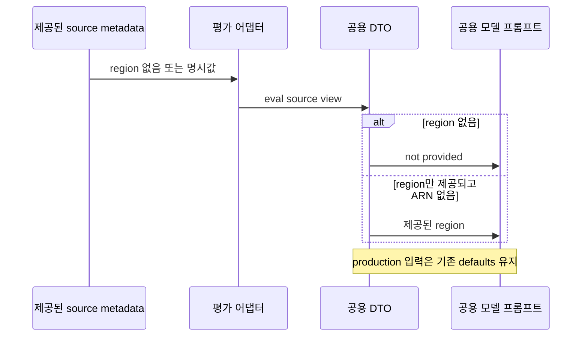

## ADR Impl Review — final independent SUFFICIENCY recheck

### Verdict
FIX_REQUIRED

남은 코드 차단 항목은 **F2 residual: journal과 stderr 출력이 함께 실패하면 복원을 시작하지 못함**이다. F1/F3/F4/U3는 재검토 범위에서 해소됐다. 최종26개 계약 행은 **PROVEN20 / VIOLATED1 / UNVERIFIED5**다.

UNVERIFIED는 증거 범위를 표시한다. AWS 배포를 ADR Status 승격의 새 선행조건으로 추가하지 않는다. 실제500ms 알람 관계와 배포 runtime은 U1로, 현행 모델 품질/승인 gate는 U2로 구분한다. 이 보고서의 FIX_REQUIRED 근거는 검증된 F2 코드 반례이며 “배포를 아직 하지 않았다”가 아니다. 모델 품질 gate는 현재 실패/미완료 상태이며 최종8회차를 통과했다고 주장하지 않는다.

### Scope and preservation
- 세 원본 ADR 전체 계약과 `contract-ledger.json`의 ID/문구를 그대로 적용했다. `docs/adr/.mapping.json`도 읽기 전용이다. 원본 `sufficiency-review.md`와 이전 `sufficiency-final-recheck.md`를 보존했다.
- 독립 범위는 최초 전체 scope(서비스/DB/이미지/부하/관측/복원CLI/평가)와 이후 F1/F2/F3/U3 재검토를 이어받고, 이번에는 F4 실제 코드·공용 caller·최종 prompt·notification DTO 및 갱신된 canonical capture/image provenance를 재검증했다.
- 사용자 지정 `f4-test-plan.md`와 `f4.patch`는 실제 적용 delta/시험 목록으로 읽고 현재10개 파일 hash와 대조했다. 패치를 다시 적용하지 않았다. necessity/refactor/종합설명 보고서는 읽지 않았고 artifact-contract를 읽거나 종합HTML을 생성하지 않았다.
- 코드/ADR/mapping/모델입력/기준선 수정, AWS 호출, 모델 호출, 이미지 빌드·실행, 브라우저 열기 없음. 로컬 `docker image inspect`3회는 기존 imageID 확인만 수행했다. 재현/시험 출력은 `sufficiency-recheck-02/`에만 만들었다.

### Active finding

#### F2 residual [Spec violation] 진단 출력이 실패하면 복원도 생략된다
- perspective: sufficiency; confidence: high; severity: High; weight: now; impact: localized fix / 소유 변경 복원.
- basis: infra/0007 R8 — “실패·중단에도 모든 복원 단계를 시도”. 원본/소유 intent가 이미 보존된 변경에 대한 derived cleanup obligation이다.
- evidence: `scripts/run_realistic_demo.py:349`의 `print(json.dumps(failure | {"recoveryVerified": False}), file=sys.stderr)`에는 예외 격리가 없다. `Demo.apply`도 `self.record("apply_error", ..., recovery=True)` 이후에야 `self.restore(...)`를 실행한다.
- test: `sufficiency-recheck-02/reproduce.py:check_journal(True)`; 실제 temp journal의 snapshot/register/update_intent 이후 상태형 Cloud double의 update를 성공시키고 journal write와 stderr.write를 각각 OSError로 실패시킨다. 실제 AWS 호출 없음.
- testResult: FAIL (계약). `reproduction-results.json:F2_diagnostic_failure`: original=:1, current=:2, restore_intents=0, cleanup_result=null, update-service는 결함 적용1회뿐. 현재 최종 소스에서도 재현됐다.
- whyItMatters: journal과 진단 출력이 가득 찬 저장장치에 기록되거나 stderr가 닫힌 자동 실행 환경에서는 오류를 알리는 동작이 복원 제어를 끊을 수 있다.
- expectedBehavior: 진단 출력이 불가능해도 오류는 메모리/반환값에 남기고, 사전 원본·소유권·영속 intent로 가능한 소유 서비스/정비 작업 정리를 각각 시도한다. 증거가 불완전하면 recoveryVerified=false와 owner를 유지한다.
- observedBehavior: recovery=True에서도 stderr 오류가 전파되어 restore에 들어가지 못한다. stderr가 정상인 원래 journal-only 반례는 :1로 복원된다.
- requestedChange / fix: `Demo.record()`의 stderr 방출 실패를 best-effort로 격리한다. 새로운 mutation의 사전 영속성 및 foreign/immutable-image 검증을 약화하지 않는다. 현재 사용자 지시대로 reviewer는 수정하지 않았다.
- editTargets: `scripts/run_realistic_demo.py:Demo.record`, `tests/harness/realistic_demo_cases.py`.
- completionCriteria: journal 실패+stderr OSError/closed-stream을 함께 주입해 원본 서비스 복귀와 소유 task stop, foreign 자원 불변, 원래 적용 오류 보존, recoveryVerified=false/owner 유지를 확인한다.
- route: 코드 수정; ADR sync/모델 임계값/승인 정책 변경 대상 아님.

### Closed findings and exact boundaries

| Item | Final disposition | Verified evidence |
| --- | --- | --- |
| F1 | RESOLVED | 순수 ASGI 경계가 body와 streaming/background 실패를 모두 감쌈. generic500 또는 원래 cause/context가 없는 안전한 late-error. canary 미노출, HTTP429/404/422/405와 취소 유지, 세션 반환·실패리딩 계수·다음 정상 저장 확인. Healthcare125 PASS 및 독립 원래 canary 재현 PASS. |
| F2 original journal-only case | RESOLVED; residual remains OPEN | 현재 :1 복귀 및 journalErrors/recoveryVerified=false 확인. CLI55 PASS. 별도 stderr-failure 반례는 위와 같이 FAIL. |
| F3 | RESOLVED | 모든 named projection helper/callback의 JSDoc과11개 projection 회귀를 확인. 문서화만의 변경을 관측 의미 변경으로 간주하지 않음. |
| F4 | RESOLVED | 양 엔진 현재4개 catalog가 source region 없이 최종 prompt에 `not provided`를 표시. region-only ap-northeast-2도 올바름. 없음/null/blank/whitespace, numeric0/empty{}, 원본time·ARN과 non-eval opt-out 검사. Strands113/Headless201 PASS. |
| U3 | RESOLVED as code enforcement | monotonic으로 post-fault validator 경과>=150초를 강제.149초 exit0은 실패,150초 exit0은 통과, cleanup 실행. pre-fault delay 제외. 실제AWS150초 trial을 실행했다는 뜻은 아님. |

### Remaining evidence limits
- **U1 — UNVERIFIED runtime:** local PG/이미지 source chain은 확인했다. 실제 AWS alarm normal→fault→restore 관계, 초기500ms, 배포된 실제 task·SNS/SQS 전달·단일 분석 소유·서비스복원 성공은 이 검토가 증명하지 않는다. 이 미검증 runtime을 새 ADR Status prerequisite로 만들지 않는다.
- **U2 — model/approval quality not passed:** 현재 approved-baseline digest 검사는 실제로 실패했다. 신규 정규화 fixture는 아직 승인되지 않았고 최종8개 모델 결과가 검토되지 않았다. 모델 품질 gate가 현재 실패한다는 caller 상태와도 일치하지만, reviewer가 모델을 실행하거나 결과를 만들어 채우지 않았다. 오프라인 구조 시험 PASS와 모델 의미 품질 PASS는 다른 주장이다.
- main 전체 verify는 사용자 업데이트상 진행 중이다. reviewer의 아래 scoped test 결과로 전체 verify 완료를 대체하지 않는다. 기준선을 갱신하거나 실패 gate를 약화하지 않았다.

### Current provenance and verifiable premises
1. **실측 원본:** `/private/tmp/rca-realism-ea868dcd/proof-review-fixed-01/evidence.json`; SHA256 `83aac573c02bd6eb9596ced5e0797460018704b62b955905b68b15707d1b4f2b`.15개 phase와 현재54개 source snapshot 일치, schema_removed=true, cleanup_errors=[]는 이전 narrow recheck의 raw 검사 및 이번 source hash 재확인으로 지지된다. reviewer가 DB실험을 새로 수행한 것은 아니다.
2. **canonical capture:** 현재4개 `tests/scenarios/*.json` 모두 위 SHA를 가리킨다. 최신 projection은 원본과 다시 일치했으며 답안/후속복원/op label의 입력 유입을 거부하는 시험도 통과했다. 과거 proof03/진단 모델자료를 현재 입력으로 혼동하지 않았다.
3. **3개 새 이미지:** `review-fixed-images.json`에 기록된 sourceFingerprint가 같은 revision의 실측 manifest와 모두 일치한다. 로컬 `docker image inspect`가 각 tag의 실제 imageID도 확인했다. 아래는 caller가 수행한 image-manifest 검증 기록을 실측 및 현재 로컬 imageID와 대조한 결과이며, reviewer가 컨테이너 내부 검증을 다시 실행한 것은 아니다.

| Revision | Existing local imageID | Recorded source matches measurement |
| --- | --- | --- |
| r1 | sha256:d50a760b35022be41407cd3e6f248807fea4f704ec9e718659ce4878835baec4 | yes |
| r2 | sha256:218a8eeb3874d6b06fe38f68286169a86e3e7edb7773f7edcce32a54a6dba730 | yes |
| r3 | sha256:9ff21da1885601251e53945c54d62811a827454f062dc09565456d520fe8938a | yes |

4. **F4 compatibility:** `f4-applied.json`의10개 현재파일hash 일치. 저장된 before/after production 예시3개/engine가 byte-identical이며 Headless는3역할 모두 동일하다. 현재 실제코드의 production default 회귀도 N2에서 통과했다. 이6예시를 모든 가능한 production 입력에 대한 수학적 증명으로 표현하지 않는다.
5. **정책:** taxonomy5종, 확정0.8/기각0.3/조기종료0.9, 깊이3·검증3·재생성2 및 두엔진전체 승인 규칙은 원래 계약대로 검사했다. F4는 평가 source metadata 표시와 optional DTO전달만 바꾸고 채점·원인분류·모델정책을 변경하지 않는다.
6. **로컬 threshold:** 최신 fixed-proof의 후보는29.73166643641889ms(healthy max14.916833024471998, fault min44.546499848365784), 같은 표본에서 계산한 값이다. 기존 proof03 후보33.2784ms나 AWS500ms와 같은 검증으로 취급하지 않는다. 실제AWS alarm은 계속 U1이다.

### Notable implementation choices

| Choice | Code evidence | Contract fit / relevance |
| --- | --- | --- |
| eval_source_metadata=None은 production, dict는 source-only eval | 양 DTO 및 eval_adapter; Strands models.py:101; Headless prompt_builder.py:67 | 런타임 기본 리전/새session timestamp와 관측된source값을 분리하여 A16 R3 보존. |
| 누락/null/blank는not provided,0와{}는 그대로 | Strands scoping.py:124; Headless prompt_builder.py:67 | falsey 값 때문에 제공된 수치가 바뀌지 않는다. source 없는 ARN을 만들지 않는다. |
| production period 단위를 template에서formatter로 이동 | Strands scoping.py:119; Headless prompt_builder.py:62 | 기존production문자열을 유지하면서 eval unknown에 단위를 붙이지 않음. |
| 순수 ASGI의 전체response 수명 처리 | healthcare middleware/logging.py:17 | F1 body 이후오류도 같은 비노출 경계로 처리. HTTP계약과 취소 유지. |
| strict 신규intent / best-effort 복원기록 / sticky journalErrors | run_realistic_demo.py:337,354,1273 | 사전영속성·소유복원 경계 보존. unguardedstderr라는 F2예외가 남음. |
| >=150초 monotonic guard | run_deployed_e2e.py:422 | U3의 최소 관측시간을 코드로 강제; 측정내용의 정확성을 대신하지 않는다. |

### Final contract coverage

각 ADR의 D0와 원래 Rn을 **정확히 한 번씩** 기록한다. 요구 문구는 원본ledger와 일치한다. PROVEN은 명시된 구현/검증 증거 범위에서만 유효하며, UNVERIFIED runtime과 코드 미구현을 혼동하지 않는다. Tn은 원본 전체 review의 보존된 시험; Nn은 아래 후속검사다.

#### docs/adr/infra/0004-rds-healthcare-deployment.md

| ID / Hill | Status | ADR basis (원문) | Implementation / remaining bound | Evidence | Tests |
| --- | --- | --- | --- | --- | --- |
| D0 / H1 | PROVEN | Decision | 독립 RDS/Healthcare 스택, 사설 배치, DB 선행 의존성을 코드와 합성으로 확인. 실제 AWS 배포 성공을 뜻하지 않는다. | packages/infra/bin/infra.ts:48; packages/infra/lib/stacks/rds-stack.ts:29; packages/infra/lib/stacks/healthcare-service-stack.ts:37 | 원 검토의 T1,T6 |
| R1 / H1 | PROVEN | 데이터베이스와 서비스는 사설 네트워크에서 동작하고 자격 증명은 비밀 참조로 주입한다. 배포 구성과 이미지에 자격 증명을 포함하지 않는다. | 사설 서브넷·공인 IP 없음·VPC CIDR DB 접근, 생성 비밀의 username/password 참조. Docker는 소스·가상환경만 복사한다. | packages/infra/lib/stacks/rds-stack.ts:23; packages/infra/lib/stacks/healthcare-service-stack.ts:138; packages/healthcare-sensor-app/Dockerfile:22 | 원 검토의 T1,T6 |
| R2 / H1 | PROVEN | 서비스는 제한된 동시 실행 수와 완료 속도에 독립적인 요청 시작 계획을 사용한다. 상한 때문에 실행하지 못한 요청은 별도 기록하고 무한 대기열이나 몰아 보내기를 만들지 않는다. | 완료와 분리된 슬롯 계획, active 상한, missed/capacity skipped 계수, 취소 후 gather. | packages/healthcare-sensor-app/src/test_service/services/traffic_generator.py:85 (특히 121–144) | 원 검토의 T1: test_stalled_requests_do_not_stop_offers_or_exceed_concurrency; test_event_loop_delay_skips_missed_deadlines_without_catchup_tasks |
| R3 / H1 | PROVEN | 정상 이미지가 기본이며, 실제 설정 변경·불변 결함 이미지·소유 정비 작업으로 네 시나리오를 재현한다. 기존 장애 플래그와 직접 주입 경로는 호환용으로 보존한다. | r1 빌드 기본; r2 실제 121 SELECT, r3 예외 뒤 세션 잔류; 풀 설정·별도 락 작업; 레거시 플래그/API 별도 유지. 로컬 원본은 verified=false. | packages/healthcare-sensor-app/Dockerfile:12; demo/build_revision.py:67; demo/revisions/r2/query.py:10; demo/revisions/r3/session.py:23; services/fault.py (후자의 상대 경로는 healthcare 패키지) | 원 검토의 T1,T7,T9,T10 |
| R4 / H1 | PROVEN | 요청 상태, SQL 횟수·시간, 연결 수명과 유효 풀 설정을 관측하되 SQL 매개변수와 자격 증명을 기록하지 않는다. 지표 방출은 요청 완료에 의존하지 않는다. | F1 해소. 요청·SQL·연결·풀 관측/독립 방출을 유지하며 HTTP driver 예외는 안전한500 또는 원래 context 없는 late-error로 처리. 실패 리딩 계수·세션 반환은 유지. | packages/healthcare-sensor-app/src/test_service/middleware/logging.py:17; services/db_observability.py:83; services/symptom_metrics.py:153 | N1 Healthcare125 PASS; F1 재현 generic500/canary=false |
| R5 / H2 | PROVEN | 서비스와 정비 작업의 종료·실패·종료 신호는 소유한 작업과 연결을 정리한다. 정비 트랜잭션은 유한한 유지 한도를 가지며 자기 트랜잭션만 롤백한다. | 서비스 작업 drain 뒤 소유 세션/관측 풀 정리; 정비는 자기 transaction만 rollback. 정상·취소·SIGTERM·기한 만료는 실측, start/LOCK/rollback 오류는 독립 probe에서 close 확인. | packages/healthcare-sensor-app/src/test_service/main.py:69; adapters/secondary/database_adapter.py:157; maintenance.py:91; demo/local_runner.py:44 | 원 검토의 T1,T7,T8/maintenance_failure_probes,T9 |
| R6 / H1 | UNVERIFIED | 배포된 이미지와 소스 리비전을 식별할 수 있어야 하며 정상·결함·복원은 같은 부하 조건으로 검증한다.  | 구현·로컬 이미지/소스 식별·같은 부하의3구간 검사는 확인. 세 최신 imageID/기록된 source fingerprint가 현재 실측과 일치한다. 실제 AWS 배포 자원의 이미지와3구간 관측은 미검증(U1 runtime); 새 ADR 상태 선행조건으로 요구하지 않음. | revision/manifest.py:source_manifest (healthcare src/test_service); scripts/run_realistic_demo.py:immutable_baseline_image,baseline_source_manifests; review-fixed-images.json | N1/N5 current-source proof; N5 docker image inspect3/3 및 fingerprint 대조 |

#### docs/adr/infra/0007-demo-symptom-alarm-and-deployment-fault-injection.md

| ID / Hill | Status | ADR basis (원문) | Implementation / remaining bound | Evidence | Tests |
| --- | --- | --- | --- | --- | --- |
| D0 / H1 | UNVERIFIED | Decision | 실제 설정/불변 소스/소유 락 및 같은 입력의 정상→결함→복원은 현재 로컬 증거로 지지됨. 실제 AWS symptom alarm의 관계는 미검증(U1 runtime). 이는 배포를 상태 승격 선행조건으로 새로 추가하는 판정이 아님. | packages/healthcare-sensor-app/demo/local_runner.py:check_proof; packages/infra/lib/stacks/healthcare-service-stack.ts:newAlarms | N1 및 N5; AWS alarm trial NOT RUN |
| R1 / H1 | PROVEN | 풀 설정 회귀는 실제 애플리케이션 풀 설정 변경으로 재현하고 원래 설정 복원 뒤 같은 부하에서 저장과 연결 대기가 회복되어야 한다. | 동일 8×1000 쓰기에서 정상/복원 pool=8, fault=1; 동일 overflow=0, timeout=.02. 정상·복원 8건 성공, 결함에 실제 checkout timeout. CLI 원래 definition 복귀도 mock 검증. AWS 성공 판정은 제외. | packages/healthcare-sensor-app/demo/local_worker.py:125,301; scripts/run_realistic_demo.py:register,assert_scenario_environment; proof-review-fixed-01 pool phases | 원 검토의 T1,T2,T7,T9,T10 |
| R2 / H1 | PROVEN | 조회 증폭은 불변 결함 이미지의 실제 업무 SQL 증가로 재현한다. 정상 이미지로 되돌리면 같은 응답 데이터와 SQL 횟수·조회 시간이 회복되어야 한다. | 같은 120개 응답의 전체 hash 동일, 정상/복원 1 SQL·결함 121 SQL, 실제 시간 분리. 빌드 고정 overlay 및 runtime 변경 거부 확인. AWS 이미지 실행은 제외. | packages/healthcare-sensor-app/demo/local_worker.py:101; demo/revisions/r2/query.py:10; demo/build_revision.py:67; proof-review-fixed-01 query phases | 원 검토의 T1,T7,T9 |
| R3 / H2 | PROVEN | 정비 트랜잭션은 실제 쓰기 충돌 락과 소유 실행 식별자를 가져야 한다. 유한한 유지 한도와 종료·실패·시그널의 롤백 경로가 있고 다른 실행의 작업은 종료하지 않는다. | 독립 backend의 SHARE 락과 쓰기 blocker 관계, run ID, 유한 7200초 상한, 만료·SIGTERM rollback 실측. 오류 close probe 및 foreign-task stop 거부 검증. | packages/healthcare-sensor-app/src/test_service/maintenance.py:30; scripts/run_realistic_demo.py:owned_tasks,maintenance_command; proof-review-fixed-01 lock-fault | 원 검토의 T1,T2,T7,T8,T9,T10 |
| R4 / H1 | PROVEN | 세션 정리 회귀는 같은 예외 입력에서 결함 이미지에만 반환 누락이 생겨 이후 정상 저장을 방해해야 한다. 정상 이미지 복원과 결함 태스크 종료 뒤 연결 반환과 저장 성공을 확인한다. | 같은 limit=-1 입력에 r3만 1/2/3 checkout 잔류와 후속 저장 timeout. r1 복원 뒤 반환·저장 성공, 소유 프로세스/연결 종료 확인. ECS 실제 task 종료 판정은 제외. | packages/healthcare-sensor-app/demo/local_worker.py:149; demo/revisions/r3/session.py:23; src/test_service/adapters/primary/patients/patient_controller.py:24; proof-review-fixed-01 exception phases | 원 검토의 T1,T7,T9 |
| R5 / H1 | PROVEN | 요청 시작·완료·실패·진행 중 상태와 실행하지 못한 부하를 구분하며 무한 대기열이나 몰아 보내기를 만들지 않는다. 기존 완료 기반 지표 의미는 보존한다. | offered/started/completed/failed/cancelled/skipped 분리, 진행 중 gauge 유지, 취소는 기존 완료 리딩 수에서 제외. | packages/healthcare-sensor-app/src/test_service/services/traffic_generator.py:147; services/symptom_metrics.py:73,90 | 원 검토의 T1: test_bounded_workload.py; test_bounded_observability.py |
| R6 / H1 | UNVERIFIED | 조회 시간은 밀리초로 관측하고 요청 완료와 독립적으로 메트릭을 방출한다. 정상·복원은 비위반이고 결함은 위반인 증상 알람 관계를 실제 비교로 확인한다. | Milliseconds/완료 독립 EMF와 Average/60초/2회 구성은 구현. 현재 로컬 후보29.73166643641889ms는 같은 표본에서 계산한 값이며 AWS 초기500ms의 실제 정상/결함/복원 알람 관계는 미검증(U1 runtime). | packages/healthcare-sensor-app/src/test_service/services/symptom_metrics.py:153; packages/infra/lib/stacks/healthcare-service-stack.ts:newAlarms; proof-review-fixed-01/local_query_calibration | 원 검토 infra10 PASS; N1/N5 로컬 PASS; 실제500ms alarm trial NOT RUN |
| R7 / H3 | PROVEN | 관측은 시각·단위·리소스·원본 로그·변경 차이를 보존한다. 정답성 플래그나 해석을 관측으로 대신하지 않으며 SQL 매개변수와 자격 증명은 기록하지 않는다. | F1 해소. 새 canonical 자료는 현재 source proof의 baseline+incident를 투영하고 원본 시간·좌표·hash·코드 차이를 보존. HTTP 로그 비노출과 F4 최종 prompt의 metadata 부재도 확인. | tests/harness/scenario-capture-boundary.mjs:phaseData,projectIncidentCaptures; packages/healthcare-sensor-app/src/test_service/middleware/logging.py:17 | N1 HTTP/projection; N2/N3 canonical metadata; N4 원본 hash 대조 |
| R8 / H2 | VIOLATED | 변경 전에 원래 실행 정의·이미지·관련 설정과 부재 값을 소유 실행 ID에 묶어 보존한다. 실패·중단에도 모든 복원 단계를 시도하고 서비스 회복으로 성공을 판정한다. | 원래 journal-only 실패는 exact원본:1로 복원됨. 그러나 journal 오류+stderr 출력 오류가 함께 나면 record()의 print가 restore를 차단하여 결함:2가 남음(F2 residual). | scripts/run_realistic_demo.py:337–352,861–863; sufficiency-recheck-02/reproduction-results.json:F2_diagnostic_failure | N1 CLI55 PASS; N3 F2 original PASS / simultaneous-diagnostic failure FAIL |
| R9 / H1 | PROVEN | 레거시 기본 풀 5개·초과 10개, 연결 알람 12개, 직접 연결 주입 기본 20개는 유지한다. 기존 저장 실패 알람의 30초 집계·1분 주기 2회 평가·최소 2분 30초 관측 구간을 해당 경로에 유지한다. | 5+10 풀, 연결12, 직접20, EMF30초, 저장알람60초×2 보존. U3 guard가 post-fault validator의 monotonic 경과>=150초를 강제하고149초 성공exit를 거부하며 cleanup실행. | settings.py:get_settings 및 primary/schemas.py:FaultRequest (healthcare src/test_service); packages/infra/lib/stacks/healthcare-service-stack.ts:newAlarms; scripts/run_deployed_e2e.py:35,422–444 | 원 검토 수치 회귀; N1 driver25(149거부/150허용/cleanup), runbook4 PASS |
| R10 / H3 | PROVEN | 합성·실제 PostgreSQL·배포 E2E 증거를 구분하고, 배포 E2E에 준비된 정답 관측을 주입하지 않는다. 새 입력과 양쪽 엔진 결과 검토 전에는 기준선을 갱신하지 않는다.  | 합성 alarm envelope/실제 localPG/배포E2E 경계 명시. active4개는model-eval만 선언; 새 canonical source는fixed-proof SHA. 과거자료·실패 결과 보존, 승인baseline 미갱신. | tests/scenarios/*.json:provenance,executionModes; tests/fixtures/results/README.md; tests/harness/evaluator.mjs:evaluateResults,createBaseline | N2 catalog/regression41 PASS; old approved-digest assertion1 FAIL은 의도된 미승인 차단 |

#### docs/adr/agent/0016-rca-evaluation-test-harness.md

| ID / Hill | Status | ADR basis (원문) | Implementation / remaining bound | Evidence | Tests |
| --- | --- | --- | --- | --- | --- |
| D0 / H3 | UNVERIFIED | Decision | 네 계층/공용 분석 경로/오프라인 enforcement는 구현·검사됨. 현행 fixture 승인digest gate는 FAIL, 최종8model 결과와 검토·승인은 아직 완료되지 않음(U2). 실제E2E 품질은 별도runtime미검증(U1). | tests/harness/model-cli.mjs:runModelEvaluation; evaluator.mjs:evaluateResults/createBaseline; 양 eval_adapter의 공용 runner/pipeline 호출 | N2 Strands113/Headless201 PASS; catalog gates41/42; 최종model8/AWS NOT RUN by reviewer |
| R1 / H1 | PROVEN | 공통 시나리오는 실제 풀 설정 회귀, 업무 SQL 조회 증폭, 정비 트랜잭션의 락,   예외 경로의 세션 반환 누락을 다룬다. 정상→결함→복원 구간은 같은 요청 조건으로   비교하며, 코드·설정·SQL·연결 수명으로 원인을 구별할 수 있어야 한다. | 네 scenario가 최신 현재-source PostgreSQL baseline/incident를 사용한다. 같은 입력의 restore 검증은 원본에 유지하되 모델 input에는 넣지 않는다. | tests/harness/scenario-capture-boundary.mjs:207; packages/healthcare-sensor-app/demo/local_worker.py; proof-review-fixed-01 15phases | N1/N4/N5, canonical source hash83aac573… |
| R2 / H3 | PROVEN | 에이전트에 제공하는 관측은 시간 구간, 단위, 리소스 좌표, 로그와 변경 전후 차이를   보존한다. 관측 식별자는 중립적인 참조이며 정답 유형이나 장애 활성화 플래그 이름을   정답의 대용물로 사용하지 않는다. 정답과 필수 증거 목록은 평가자의 계약에만 둔다. | 중립 obs/capture ID, UTC/단위/run/schema와 current-source snippets를 유지. expectation/미래cleanup은 projection 밖. source metadata는 실제 최종prompt까지 보존. | tests/harness/scenario-capture-boundary.mjs:37,207; 양 eval_adapter→DTO→prompt source-view 경로 | N2 canonical projection·metadata tests; N3 finalprompt probes; N5 source/snippet 대조 |
| R3 / H3 | PROVEN | 알람의 리전·네임스페이스·차원·평가 조건이 제공되면 평가 어댑터는 이를 공용   파이프라인에 전달한다. 메타데이터가 없으면 만들어 채우지 않는다. | F4 해소. eval 전용source view에서 없는/null/blank metadata는not provided; 제공된region은ARN 없이도 유지. numeric0/{} 유지. Strands의 새session시각은 모델의 원본시각으로 제시하지 않음. 운영기본값은별도호환 유지. | packages/agent/src/rca_agent/eval_adapter.py:181; ports/dto/models.py:101; services/scoping.py:124; packages/headless-codex/src/headless_codex/eval_adapter.py:317; services/prompt_builder.py:67 | N2 113+201 PASS; N3 current4+minimal/region-only 양엔진 PASS; N5 production3사례/engine before-after 동등 |
| R4 / H3 | PROVEN | 합성 관측은 합성임을 명시하고 실제 AWS 수집 결과로 보고하지 않는다.   실제 데이터베이스의 재현 결과와 배포 E2E 결과도 구별한다. 배포 E2E는 준비된   관측을 주입하지 않고 실제 증상·증거·원상복원을 검증한다. | 새관측은localPG로 명시, alarm은illustrative. model-eval만sourceview/observation을 전달하며 production/deployed 옵트아웃 유지. 배포E2E 성공은 주장하지 않음. | tests/scenarios/*.json:provenance; 양eval_adapter mode checks; scripts/run_deployed_e2e.py:run | N2 opt-out·projection·metadata PASS; AWS NOT RUN |
| R5 / H2 | UNVERIFIED | 실행 가능한 배포 제어와 복원 경로가 있는 사례만 `deployed-e2e`를 선언한다.   복원은 원래 설정·이미지의 복귀, 소유 정비 작업 종료와 서비스 증상의 회복으로   확인하며 reset 응답만으로 통과하지 않는다. | 검증되지 않은 activecase에 deployed-e2e를 선언하지 않음은 충족. 실행가능CLI의 소유원본/복구판정 구조는 확인했으나 F2 진단실패와 실제AWStask/증상복원 검증한계는 남음. 추가배포를 ADR상태조건으로 만들지 않음. | tests/scenarios/*.json:executionModes; scripts/run_realistic_demo.py:restore,status | N1 CLI55; N3 F2residual FAIL; 실제AWS runtime NOT RUN |
| R6 / H3 | PROVEN | 원인 분류의 기존 허용 집합과 신뢰도·탐색 한도는 유지한다. 풀 설정이나 락을   커넥션 누수로 강제 분류하지 않는다. 각 사례의 필수 원인·반증 증거와 안전성   기준은 양쪽 엔진에 동일하게 적용한다. | 허용 5종 유지. pool/lock=unsupported, query=slow-query, exception=db-leak. 0.8 확정/0.3 기각/0.9 종료, 깊이3·검증3·재생성2 유지. 경쟁 원인별 분리된 증거와 안전성 기준은 공통 evaluator. | tests/harness/evaluator.mjs:10,75,351; packages/agent/src/rca_agent/config/settings.py:24; packages/headless-codex/src/headless_codex/services/analysis_contract.py:10 | 원 검토의 T2,T3,T4,T5,T10; 정책 파일 git diff 없음 |
| R7 / H3 | PROVEN | 교체된 입력과 기존 평가 결과는 이력으로 보존한다. 새 기준선은 새 입력을 사용한   두 엔진 전수 결과가 통과하고 검토된 뒤에만 승인한다. 기존 실패를 숨기거나   모델 결과를 만들어 채워 승인하지 않는다.  | 교체된입력/원본결과와 실패이력 보존. 현재결과fixture는미승인/부재, baseline미변경. 두엔진전수결과의검토전에는새baseline을 만들지 않고 현재digest변경을차단함. | tests/fixtures/historical; tests/fixtures/results/README.md; tests/harness/evaluator.mjs:createBaseline | N2 archive/hash/approval-policy PASS; 승인digest assertion FAIL; 승인 실행 없음 |

### Review Hiking — final delta
- H1 실제 메커니즘/부하/관측: 현재 proof와3이미지 source chain, 동일 입력의 SQL/연결 효과 및 F1 HTTP 경계를 확인했다. 기존원리/수치범위를 유지한다. 실제 AWS알람 관계는 U1이다.
- H2 소유변경 복원: 사전 영속snapshot/absence→owned mutation→독립복원→fresh symptom→release를 확인했다. 기존 journal-only 실패는 복원되지만 stderr 실패는 F2로 남는다. 이 하나의 반례가 최종코드 verdict를 결정한다.
- H3 평가입력/두엔진: 최신canonical source→baseline+incident projection→eval source view→공용scoping/role prompts→정규화와공통gate를 확인했다. F4는 DTO 수준에서 멈추지 않고 최종prompt까지 재현했다. staleapproval gate는 계속 실패한다.
- Hill과 계약배정은 원본검토와 동일하고26행에 중복배정 없음. 원본 diagram은 보존하며 이번 delta는 아래 하나의 경계도로 충분하다. 렌더링/브라우저는 수행하지 않았다.

Notice: 모델의 실행 리전이나 Strands 세션식별 시각을 관측된 사고좌표로 추가하지 않는다.

### Tests and evidence executed

| ID | Exact command / operation | Result and source |
| --- | --- | --- |
| N1 retained narrow run | Healthcare `.venv/bin/python -m pytest tests -q -p no:cacheprovider`; root `python3 tests/harness/realistic_demo_cases.py -v`; `node --test tests/harness/deployed-e2e-driver.test.mjs tests/harness/realistic-scenarios.test.mjs tests/harness/live-e2e-runbook.test.mjs` | 125 PASS/2SKIP/1XFAIL;55 PASS;40 PASS(25driver+11projection+4runbook). 보존로그=`sufficiency-recheck-01/`. 이번에무변경범위의전체시험을 불필요하게 반복하지 않음. |
| N2 Strands | cwd=packages/agent; `.venv/bin/python -m pytest tests/test_eval_alarm_metadata.py tests/test_harness_prompt_dto_contracts.py tests/test_scoping.py tests/test_models.py tests/test_notification.py tests/test_eval_adapter_pipeline_contract.py -q -p no:cacheprovider` |113 PASS; recheck-02/f4-agent.log |
| N2 Headless | cwd=packages/headless-codex; `.venv/bin/python -m pytest tests/test_eval_alarm_metadata.py tests/test_eval_adapter.py tests/test_eval_citation_fields.py tests/test_prompt_builder.py tests/test_prompt_contracts.py tests/test_alarm_parser.py tests/test_pipeline.py -q -p no:cacheprovider` |201 PASS; recheck-02/f4-headless.log |
| N2 catalog/gates | root `node --test tests/harness/realistic-scenarios.test.mjs tests/harness/evaluator.test.mjs tests/harness/model-and-approval.test.mjs` |41 PASS/1 FAIL. `fixtures and approved baseline pass structural and digest gates` fails because current8dc813d3… differs from approveda8fd8357…. recheck-02/catalog-gates.log |
| N3 final prompt | 각엔진venv에서 `sufficiency-recheck-02/alarm-prompt-repro.py headless` 또는 `... strands` | 현재4case + minimal/region-only, 실제최종prompt에서 missing=not provided/region-only=ap-northeast-2; 모델호출없음. JSON/log보존. |
| N3 original+residual probes | Healthcarevenv에서 `sufficiency-recheck-02/reproduce.py` | F1 original PASS, F2 original PASS, F2 diagnostic-failure FAIL. reproduction-results.json |
| N4 canonical hash/projection | 각현재scenario의 provenance sourceSHA를 fixed-proof와 대조, N2 projection 재실행 |4/4 및11projection PASS. 과거/미래증거경계 보존. |
| N5 images/source/compatibility | 현재54sourceSHA, F4파일10hash, 저장productionbefore/after문자열, image-record fingerprint를 실측과 대조; `docker image inspect --format '{{.Id}}' <각 review-fixed tag>` |source mismatch0, F4 mismatch0, production3/engine 동등,3imageID 일치. provenance-validation.json |

모든 Python probe/시험은 PYTHONDONTWRITEBYTECODE=1 및 recheck-02 TMPDIR를 사용했다. 최신입력digest는 `sha256:8dc813d320341b5347ed5f299a5c52217a5c84a7d02863e8be79e2672e860cfc`; 과거승인 `sha256:a8fd8357506019d0d7af6bd2de268466205e7595bc201ac25c2aeb69f07cb5dd`를 수정하지 않았다. 이 오류를 없애려고 현재input이나 gate를 고치지 않았다.

### Notes
- 최종코드 후속조치는 F2 residual 하나다. 다른 확인된 기능을 다시설계하거나 원래계약/모델정책을 바꿀 결정 요청은 없다.
- 배포E2E·알람500ms·최종모델8결과는 별도runtime/품질증거로 남긴다. 이를 현재시점의 성공으로 표기하거나 ADR상태의추가필수배포조건으로 사용하지 않는다.
- 이파일과 `sufficiency-final-coverage.json`이 최종현재스냅샷이며, 원본및이전narrowreport는 이력으로 그대로보존된다. 소스지문검사는 recheck-02/final-validation.json.
