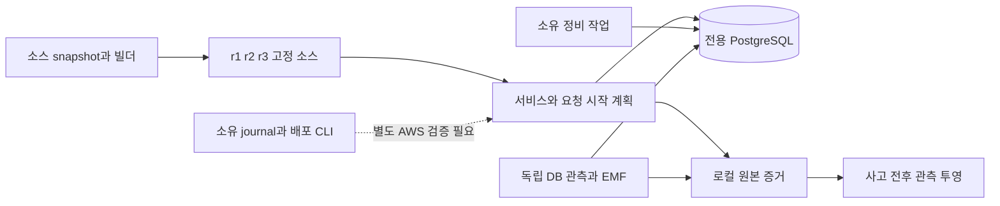
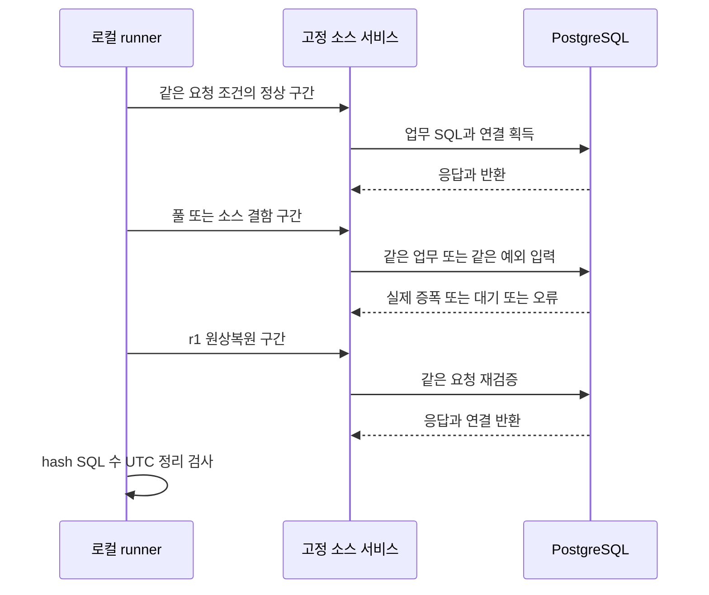
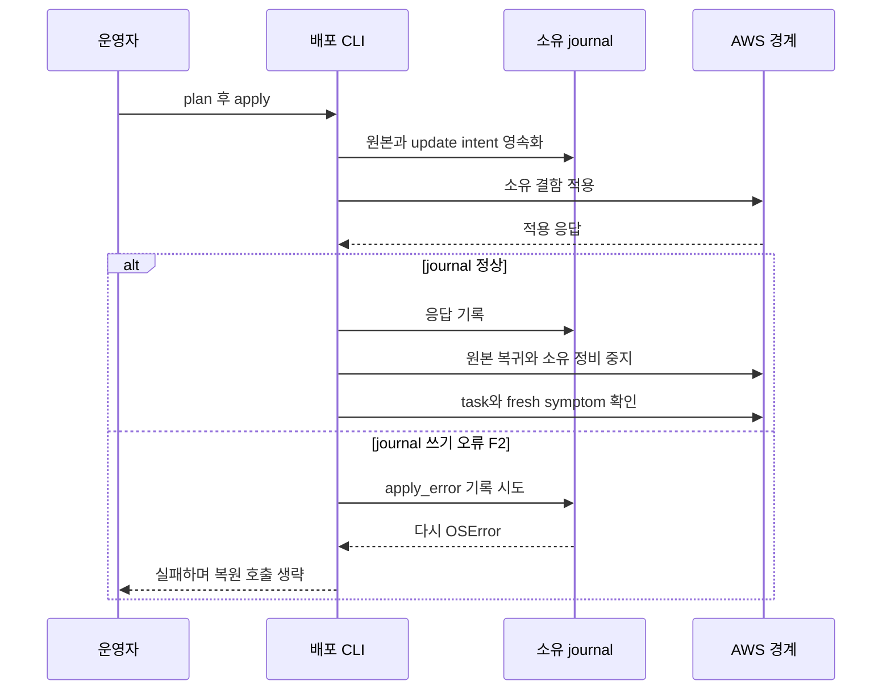
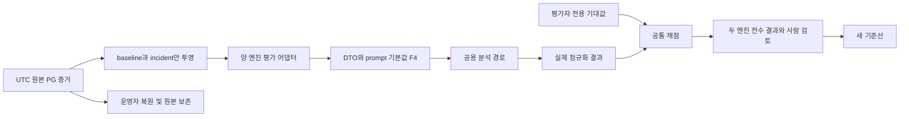

## ADR Impl Review: realistic RCA demo — independent SUFFICIENCY

### Verdict
FIX_REQUIRED

실제 코드 반례 3건(F1 로그 값 노출, F2 journal 장애가 복원을 막음, F4 제공하지 않은 alarm metadata의 프롬프트 노출)이 있다. 검토 중 확인했던 투영 함수 문서화 누락(F3)은 최종 파일에서 보완되어 활성 발견사항에서 제외했다. 클라우드 실측·새 모델 기준선·레거시 관측 시간은 별도로 UNVERIFIED다. 새 모델 결과가 없다는 이유로 실패를 지우거나 기준선을 승인해서는 안 된다.

### Scope
- ADR: `docs/adr/infra/0004-rds-healthcare-deployment.md`, `docs/adr/infra/0007-demo-symptom-alarm-and-deployment-fault-injection.md`, `docs/adr/agent/0016-rca-evaluation-test-harness.md` — 모두 Proposed. 전체 Context/Drivers/Decision/Requirement contract/대안/Consequences/Implementation Notes를 검토했다.
- Mapping: `docs/adr/.mapping.json`의 agent/infra는 dependsOn=[]이며 tableDocs는 없다. 해당 세 항목 Status/summary를 읽었다. Related에 연결된 기존 분석·실행 안전 경계는 공용 코드와 테스트로 추적했다.
- 기준: `review-baseline.md`, 원본 `contract-ledger.json`; HEAD `bc5a7d5ea182d4d220b45671a09787aed465ff20` + 작업 트리. 기존 efficiency 변경은 현재 시나리오의 호출 관계 확인에 필요한 범위만 보았으며 별도 재설계를 요구하지 않았다.
- 독립성: necessity/refactor/explanation 보고서를 읽지 않았다. artifact-contract도 읽지 않았다. 세 Hill은 최초 baseline의 수직 기능 구분을 유지했다.
- 관례: root AGENTS.md/CONTRIBUTING.md, docs/agent-protocol.md, infra/healthcare/headless-codex AGENTS.md. agent 패키지에는 별도 AGENTS.md가 없어서 root를 적용했다. docs/adr/README.md와 `/private/tmp/rca-adr-tools-0.8.19/templates/adr/{concepts,authoring-rules,structure}.md` fallback을 읽었다. reviewer 지침과 implementation-evidence/review-hiking/visualization을 적용했다.
- 독립 도출한 코드 범위: infra `bin/infra.ts`, config loader, RdsStack/HealthcareServiceStack; Healthcare Docker/build manifest/정상·r2·r3 소스, settings→DI→lifespan→traffic/service→repository→DB/session/observer, HTTP controller/middleware/telemetry, legacy health/fault 경로; `demo/local_runner.py`/`local_worker.py`; 새 deployment CLI와 기존 inject/deployed driver; active/archived scenarios/observations/results, projector/evaluator/model/approval CLI; 양 eval adapter→공용 pipeline/runner→prompt/artifact/analysis contract→정규화 및 안전 gate. diff 밖의 HTTP 오류 경로에서 F1을 찾았다.
- 실행 제한 준수: 제품/ADR/mapping을 수정하지 않았다. 재현 파일·출력은 이 검토 디렉터리 안에만 만들었다. AWS 쓰기·조회, 모델 호출, 브라우저 열기, 별도 Docker 빌드는 실행하지 않았다. 실제 프로세스 정리 테스트는 그 테스트가 생성한 임시 프로세스만 대상으로 했다.

### Findings

#### F1 [Spec violation] HTTP 예외 경로가 SQL 값이 포함된 드라이버 오류를 그대로 기록한다
- perspective: sufficiency; severity: High; confidence: high; weight: now; impact: localized fix / data confidentiality.
- basis: infra/0004 R4, infra/0007 R7 — “SQL 매개변수와 자격 증명은 기록하지 않는다.”
- evidence: `packages/healthcare-sensor-app/src/test_service/middleware/logging.py:29`: `logger.exception("Request failed", extra=extra)`; 이어지는 `raise`로 최종 서버 오류 처리까지 원래 예외가 전달된다. `telemetry.py:9`의 JSON formatter는 exc_info를 제거하지 않는다. 새 DB adapter의 `hide_parameters=True`는 driver DETAIL 문자열을 삭제하지 않는다.
- test: `T8`의 `log_counterexample()` — 실제 LoggingMiddleware.dispatch에 합성 DBAPIError를 전달한다. SQLAlchemy 오류에 hide_parameters=True를 주고, driver DETAIL에 무해한 `CANARY_SQL_PARAMETER`를 넣었다. DB/AWS 호출 없음.
- testResult: FAIL (계약); 재현 실행은 정상 종료. `sufficiency-log-repro.json`: canary_in_log=true, parameters_hidden_banner=true. 실제 PostgreSQL에서 개인정보를 사용한 테스트라는 뜻이 아니다.
- whyItMatters: SQL hook과 서비스 로그만 검사하면 HTTP로 들어온 DB 실패가 비노출 경계를 우회한다. 로그를 RCA 증거로 사용하는 흐름으로 값이 퍼질 수 있다.
- expectedBehavior: HTTP DB 실패도 요청 식별자/오류 종류/안전한 상태만 기록하고 바인드 값·원문 driver DETAIL·자격 증명은 남기지 않는다.
- observedBehavior: 값 숨김 배너와 동시에 driver DETAIL의 canary가 exc_info에 기록됐다.
- requestedChange / fix: 미들웨어와 최종 ASGI 오류 경계에서 안전한 오류 응답·종류만 내보내고 원문 예외가 재기록되지 않게 처리한다. SQL hook만 고치면 부족하다.
- editTargets: `packages/healthcare-sensor-app/src/test_service/middleware/logging.py:dispatch`, 필요한 `main.py:create_app`의 예외 처리 배선, HTTP 로그 회귀 테스트.
- completionCriteria: HTTP 요청으로 드라이버 DETAIL/바인드 값 canary가 있는 실패를 발생시켜 앱·서버 로그 모두 비노출을 확인하고, 오류 HTTP 상태·요청 계수·세션 반환은 유지한다.
- route: 구현 코드 수정. ADR 계약을 약화하는 sync 대상이 아니다.

#### F2 [Spec violation] 변경 후 journal 저장 오류가 복원을 시작하지 못하게 한다
- perspective: sufficiency; severity: High; confidence: high; weight: now; impact: localized failure-path fix / owned resource restoration.
- basis: infra/0007 R8 — “실패·중단에도 모든 복원 단계를 시도” 및 실행 소유권 절 4의 독립 정리 의무.
- evidence: `scripts/run_realistic_demo.py:Demo.apply`의 실제 순서: `except BaseException as error:` → `self.journal.append("apply_error", {"error": str(error)})` → `try:` → `self.restore(wait_seconds=wait_seconds)`. `restore_once`도 `self.journal.append("restore_intent", {})`를 두 정리 try 블록보다 먼저 실행한다.
- test: `T8`의 `journal_counterexample()` — 기존 상태형 Cloud double을 사용. 사전 snapshot/register/update_intent까지 저장하고 UpdateService는 성공시킨 뒤 update_response/apply_error의 저장을 OSError로 실패시킨다. 실제 AWS 호출 없음.
- testResult: FAIL (계약); `sufficiency-journal-repro.json`: current_definition=:2, original_definition=:1, restore_intent_count=0, update-service는 결함 적용 1회뿐. 최종 maintenance 명령 제한 변경 후에도 재현했다.
- whyItMatters: 디스크 용량·권한·저장소 I/O 실패 한 번이 이미 적용한 결함을 그대로 남긴다. 보존된 원본/소유권이 있는데 진단 기록 실패가 복원 제어를 막는다.
- expectedBehavior: 사전 영속 snapshot과 소유권을 사용할 수 있으면 오류 기록 실패를 격리하고 소유 서비스 복귀와 정비 작업 정리를 각각 시도한다. 검증·기록이 불충분하면 성공/소유권 해제로 표시하지 않는다.
- observedBehavior: 예외 기록이 다시 실패하여 복원 함수에 도달하지 않는다. 단순히 restore를 finally로 옮겨도 restore_intent 기록의 동일 실패가 다음 장애물이 된다.
- requestedChange / fix: 사전 기록이 없는 신규 변경은 계속 거부한다. 이미 기록된 변경의 실패 복원에서는 기록 오류가 독립 정리를 막지 않도록 처리하고 stderr 등 안전한 실패 출력을 남긴다. 원본·소유권 검증을 건너뛰지는 않는다.
- editTargets: `scripts/run_realistic_demo.py:Demo.apply`, `Demo.restore_once` 및 cleanup 중 journal 호출; `tests/harness/realistic_demo_cases.py`.
- completionCriteria: 성공한 update/run-task 뒤의 journal 장애, 오류 기록 장애, restore_intent/정리 기록 장애를 각각 주입해 가능한 두 정리를 모두 시도하고 foreign 자원은 건드리지 않으며 recoveryVerified=false/실패 exit를 유지한다.
- route: 구현 코드 수정. 기존 R8에서 도출되는 의무로 추가 제품 결정은 필요하지 않다.

#### F4 [Spec violation] 제공하지 않은 AWS 리전이 양 엔진의 실제 프롬프트에서 관측 사실로 표시된다
- perspective: sufficiency; severity: High; confidence: high; weight: now; impact: source provenance / recovery target correctness.
- basis: agent/0016 R3 — “메타데이터가 없으면 만들어 채우지 않는다.” 기존 DTO 기본값의 존재 자체가 아니라 평가 입력에서 공용 분석 모델로 넘어가는 **표시 경계**의 위반이다.
- evidence: Headless `ports/dto/models.py:12`: `region: str = "us-east-1"`; `_alarm_for`는 region이 없으면 이 기본값을 그대로 둔다. `services/prompt_builder.py:57`: `"{region}": alarm.region`; `prompts/rca-user.md:8`: `- **리전**: {region}`. 현재 네 catalog 입력을 실제 `build_prompt(..., role="rca"/"report")`에 통과시키면 모두 `- **리전**: us-east-1`이다.
- evidence (Strands): `ports/dto/models.py:111`: `region = "us-east-1"`; parser는 AlarmArn이 있을 때만 이를 바꾸며 raw Region을 읽지 않는다. `services/scoping.py:113`: `region=alarm.region`이 `prompts/scoping.py:42`의 `- **Region**: {region}`에 들어간다. 현재 네 catalog의 scoping prompt 모두 같은 가짜 리전이 표시된다.
- test: T11 `sufficiency-alarm-prompt-repro.py headless` 및 `... strands`. 실제 catalog는 읽기만 했다. 별도의 메모리 입력으로 metadata 없음 및 region=ap-northeast-2/ARN 없음도 확인했다. 프롬프트 조립까지만 실행했고 모델·AWS는 호출하지 않았다.
- testResult: FAIL (계약). `sufficiency-headless-alarm-prompt-repro.json`, `sufficiency-strands-alarm-prompt-repro.json`: 네 입력 supplied_region=null → parsed/prompt region=us-east-1. Strands의 region-only 예제는 supplied=ap-northeast-2인데 region 상세는 us-east-1이다. 양쪽 minimal input은 통계/주기가 없는데도 Average/300초를 표시한다. 현재 catalog에는 statistic/period가 제공되므로 그 두 값의 현재 catalog drift를 주장하지 않는다.
- whyItMatters: 로컬 관측에는 AWS 리소스 좌표가 없다. 그런데 알람 상세가 특정 리전을 관측된 사실처럼 제시하여 잘못된 조회·복원 대상의 근거가 될 수 있다. 실제 모델 출력의 특정 행동이 오직 이 문제 때문이라고 인과를 단정하지 않는다.
- expectedBehavior: model-eval에서 없는 source region/statistic/period는 제공되지 않음으로 표시하고, 제공한 region은 ARN 없이도 공용 모델 경계에서 일관되게 보존한다. 모델 provider/runtime의 실행 리전과 사고 리소스의 관측 리전을 구분한다.
- observedBehavior: source metadata JSON에는 없는 값이 별도 Alarm Details 항목에서 조용히 추가된다. 기존 테스트는 envelope/state_reason 또는 DTO 기본값 일치를 검사하여 이 경계를 놓쳤다.
- requestedChange / fix: 활성 모델 실행 중에는 아무 입력도 바꾸지 않는다. 이후 평가 경로의 제공 여부를 공용 프롬프트까지 보존하고, Strands parser의 Region/ARN 처리와 양쪽 프롬프트의 fallback 표시를 수정한다. 누락 좌표를 scenario에 만들어 넣어 해결하지 않는다.
- editTargets: `packages/agent/src/rca_agent/ports/dto/models.py:AlarmPayload.from_cloudwatch_sns`, `services/scoping.py:_build_user_prompt`, 필요한 eval adapter 배선; `packages/headless-codex/src/headless_codex/eval_adapter.py:_alarm_for`, `ports/dto/models.py:AlarmContext`, `services/prompt_builder.py:build_prompt`; 양 `tests/test_eval_alarm_metadata.py`.
- completionCriteria: region/ARN 없음, region만 있음, null/빈 optional 값, 누락 statistic/period를 양 엔진 최종 prompt에서 검사. 현재 네 catalog에서 없는 AWS 좌표를 출력하지 않고 제공 메타데이터와 상세가 충돌하지 않아야 한다. 실행 중 회차/입력 digest는 보존하고 변경 뒤 별도 회차로 재평가한다.
- route: 구현 코드와 최종 프롬프트 경계 테스트. R3를 기존 기본값에 맞춰 완화하는 ADR sync 대상이 아니다.

#### U1 [Unverified risk] 최신 이미지와 실제 증상 알람 관계의 증거가 아직 없다
- perspective: sufficiency; confidence: medium; weight: now; impact: demo validity; basis: infra/0004 R6, infra/0007 D0/R6, agent/0016 R5.
- evidence: `healthcare-service-stack.ts`의 `threshold: props.queryLatencyThresholdMs ?? 500`; proof03 calibration의 `aws_alarm_evaluated: false`, `aws_threshold_calibrated: false`; controller `scenarioSuccess: False`. 최신 이미지 재빌드는 사용자 업데이트에서 진행 중이었다.
- test / testResult: T6 정적 alarm 구성 PASS, T7/T9 로컬 SQL 실측 PASS; 최신 이미지 및 AWS normal/fault/restore 알람 시험 NOT RUN — 검토의 AWS 금지 범위 및 아직 결과 없음.
- whyItMatters / verifiable premise: 선택 부하와 실제 배포에서 정상/복원은 비위반, 결함은 위반이라는 관계가 있어야 증상 알람으로 시나리오를 시작할 수 있다. 로컬 개별 요청의 임계치를 CloudWatch 1분 Average에 그대로 대입할 수 없다.
- expectedBehavior: 최신 이미지·소스·동일 부하·알람 조건을 묶은 실제 3구간 관측으로 주장한다.
- observedBehavior: 로컬 3구간은 있으나 AWS 3구간은 없다. 초기 500ms 성공을 주장하지 않았다.
- requestedChange: 허용된 별도 실행에서 최신 이미지 provenance와 실제 알람 비교를 확보. 그 전까지 UNVERIFIED 유지.
- editTargets: 실행 증거/후속 검증 기록; 현 단계 코드/ADR 값을 추측하여 바꿀 대상 없음.
- completionCriteria: digest·source manifest·부하·원시 EMF·CloudWatch bucket/alarm transition·복원 task 상태를 같은 실행에 연결.
- route: 검증 후속 작업, 자동 코드 수정 대상 아님.

#### U2 [Unverified risk] 새 입력의 양 엔진 전수 모델 결과와 승인이 아직 없다
- perspective: sufficiency; confidence: high; weight: now; impact: release evidence; basis: agent/0016 D0, infra/0007 R10, agent/0016 R7의 승인 경계.
- evidence: `tests/fixtures/results/README.md`: “There are no normalized model-result fixtures for the new realistic catalog.”; `evaluator.test.mjs:568`: `assert.equal(baselineReport.passed, true, baselineReport.failures.join('\n'));`가 현재 digest mismatch로 실패한다.
- test / testResult: T2 84개 중 83 PASS, 위 1개 FAIL. actual digest `2e55a2d8af232a5ac1f19be705f673182c7daf56fad06cd6466025532065fb9a`, 기존 승인 `a8fd8357506019d0d7af6bd2de268466205e7595bc201ac25c2aeb69f07cb5dd`. 새 모델 호출 NOT RUN — 별도 후속 단계.
- whyItMatters: 구조 probe/과거 fixture/로컬 DB 성공은 새 관측에서 두 모델이 필수 원인·반증·안전 계약을 충족했다는 증거가 아니다.
- expectedBehavior: 동결 입력으로 두 엔진 모든 사례를 실행·검토한 후에만 명시적으로 새 baseline을 승인한다.
- observedBehavior: archive의 구조 검사와 새 입력 검사는 통과하지만, 현재 입력은 과거 승인과 일치하지 않는다. 이를 실패 숨김이나 모델 결함으로 해석하지 않았다.
- requestedChange: 계획된 실모델 검증을 별도로 완료하고 결과를 검토. 이 실패를 없애려고 baseline/digest/평가기준을 지금 바꾸지 않는다.
- editTargets: 향후 실제 model result/검토 기록; 승인 전 제품/정책 수정 없음.
- completionCriteria: 두 엔진×4사례의 진짜 정규화 결과·읽을 수 있는 보고서·같은 digest·전체 필수 gate 통과·명시 승인.
- route: 증거/승인 후속 작업.

#### U3 [Unverified risk] 레거시 저장 알람 경로의 최소 150초 관측은 입증되지 않았다
- perspective: sufficiency; confidence: medium; weight: now; impact: numerical requirement coverage; basis: infra/0007 R9.
- evidence: `scripts/run_deployed_e2e.py:312`: `parser.add_argument("--red-herring-delay-seconds", type=float, default=150)`는 실제 db-leak 주입 **전** 대기다. 이후 `validation_child = subprocess.Popen(args.validation_command, ...)` / `validation_child.wait()`는 호출자 검증 명령의 실행을 기다린다. inspected runner/runbook/harness에서 증상 관측 구간 >=150초를 입증하는 검사/실행 결과는 확보하지 못했다.
- test / testResult: T1/T2/T6으로 나머지 legacy 수치 확인; 실제 150초 관측 및 그보다 짧은 관측의 거부 시험 NOT RUN — 현재 증거로 그 보장을 확인할 수 없음.
- whyItMatters / verifiable premise: 30초 방출과 1분×2회 알람에서 충분한 관측 구간을 확보해야 한다. 값 150이 다른 대기에 존재한다는 사실로 충족 처리하면 안 된다.
- expectedBehavior: 그 알람을 사용하는 경로가 최소 150초 관측을 유지하고 증거에 시작/끝을 남긴다.
- observedBehavior: 상수 5/10/12/20/30/60/2는 확인했으나 이 구간 보장은 unverified.
- requestedChange: 실제 호출자/검증 경로에서 150초 의무를 만족하는 검사 또는 실행 증거를 제시하고, 없으면 해당 관측 경로에 한정해 보강한다.
- editTargets: `scripts/run_deployed_e2e.py`에서 호출하는 validation 경로와 그 테스트(확인 후 한정); 새 조회 알람 임계치를 변경할 근거가 아니다.
- completionCriteria: 149초는 충분한 증거로 통과하지 않고 >=150초 경로의 타임스탬프를 검증한다. 기존 pre-fault 대기를 post-fault 관측으로 잘못 세지 않는다.
- route: 범위 한정 검증; 확인 전 자동 Spec violation 단정/ADR 변경 금지.

### Notable implementation choices

| Selected value or behavior | Code evidence | Why it fits the ADR intent | Why it matters |
| --- | --- | --- | --- |
| 개별 요청 간격5초, 동시1, query20, 고정 seed/patient 선택 | healthcare settings.py:25; traffic_generator.py:121 | 유한 요청 시작 계획(R2/R5)을 유지하는 조정값 | 데모 성공 부하를 보장하는 수치가 아니다. 늦은 슬롯은 버리고 다음 due=now+interval로 잡는다. |
| 8% 비정상 프로필, 6 ingest/query 쌍마다 alerts 슬롯 | traffic_generator.py:48 | 자동 baseline과 일부 이상치 유지 | 완료 지연과 무관한 입력 종류를 유지한다. |
| observer 별도 pool1/overflow0, pool timeout2초, statement timeout2000ms; activity100/locks200 | database_adapter.py:178 | 앱 풀 고갈 중에도 유한 읽기 관측(R4) | 관측 연결 자체가 연결 수에 포함되므로 앱 pool과 DB 전체를 분리한다. |
| SHA256 SQL 패턴, DB wait SQL은 MD5; 본문/바인드 생략 | db_observability.py:84; database_adapter.py:203 | SQL 횟수/수명 관측과 비노출 intent | 두 hash를 같은 값으로 join하면 안 된다. backend PID·요청 ID·시간을 함께 써야 한다. F1이 전체 경계의 예외다. |
| EMF sample 배열100, 기본 flush30초, gauge 유지 | symptom_metrics.py:27,118,168 | 독립 방출과 유한 메모리 | sample capacity 방출은 정상이며 취소를 기존 완료 계수에 더하지 않는다. 30초는 legacy 계약 수치다. |
| r1 정상, r2 N+1, r3 획득 후 body-error cleanup 누락을 빌드 overlay로 고정 | Dockerfile:12; demo/build_revision.py:67 | 명시적인 불변 소스 선택(R3), 같은 응답(R2) | 런타임 환경 이름으로 구현을 바꾸지 않는다. r3의 고의 결함 자체는 정상 코드 버그로 신고하지 않았다. |
| 정비 기본120초/상한7200초, 배포 CLI 기본7200초, LOCK 대기10초/connect5초 | maintenance.py:22,47,153; run_realistic_demo.py:parse_args | 유한 소유 트랜잭션(R3/R5) | 자동 만료와 승인 복원 원인을 구분한다. 최종 CLI는 임의 maintenance argv 확장을 제거했다. |
| fsync + hard-link create-only hash chain, 동일 canonical service의 공유 journal-root flock | run_realistic_demo.py:atomic_create,Journal,main | 변경 전 원본/부재값 보존과 협력 실행 소유권(R8) | 모든 operator가 같은 lock 저장소를 써야 한다. tag 자체가 분산 compare-and-swap 보장이라는 전제는 두지 않았다. F2는 기록 저장소 장애 문제다. |
| 원본 @sha256 이미지와 task별 r1 manifest를 plan 전에 요구 | run_realistic_demo.py:immutable_baseline_image,baseline_source_manifests | 원래 소스/이미지로 복귀(R6/R8) | 가변 tag 원본 및 이전 미검증 journal은 apply 거부; 실제 cloud 검증과는 구별. |
| 복구 후 완전한 최신 1분 bucket2개, ingest>0/failures=0/queryAverage<threshold | run_realistic_demo.py:metrics,metrics_healthy,status | API 성공이 아닌 서비스 회복으로 판정(R8) | 없음/오래된 데이터가 recoveryVerified를 통과하지 않는다. |
| 로컬 latency 후보33.27841707505286ms, 초기 AWS500ms | demo/local_runner.py:194; healthcare-service-stack.ts:314 | 측정과 환경별 calibration(R6)을 분리 | 서로 다른 지표 집계이며 전자를 AWS 보장값으로 쓰지 않는다. |
| alarm envelope는 illustrative, 현재 observation은 baseline+incident만 | scenario-capture-boundary.mjs:phaseData,projectIncidentCaptures; tests/scenarios/*.json | 원인 답안·미래 복원을 input에 누설하지 않는 경계(A16 R2/R4) | source hash와 원본 capture 참조로 현재 입력을 추적한다. |

### Verifiable premises
- proof03 원본 SHA256=`4087598ac6f67460b88d52cb1d0f3d876655a51aa94db734f8eba513e11b1a38`; source snapshot fingerprint=`70e84e25864eb2e9968f66467ddaf581340708bad427d345afd4102c589a9c9e`. 54개 snapshot 파일의 현재 해시가 일치. `check_proof()`를 원본 자료에 다시 실행해 15 phases의 UTC/작업/정리/동일 소스 조건을 검사했다(T7). 이것은 DB를 새로 실행한 것이 아니다.
- 실제 DB 실행은 별도 제공 로그 `/private/tmp/rca-realistic-postgres-tests.log`의 `test_real_postgresql_all_mechanisms`와 `test_slow_query_integration` 2/2 PASS(T9)로 명시한다. SQL 횟수·blocker·backend 정리를 증거에서 확인했다. 최종 r1/r2/r3 Docker 빌드는 별도 진행 중이라 이전 이미지 검증을 최신 소스 증거로 승격하지 않았다.
- 4개 code snippet의 hash와 기록된 각 줄을 현재 source/overlay와 직접 비교하여 모두 일치했다. projector는 trust된 원본/검토 snippet을 전제로 한다; 외부 임의 자료의 암호학적 진실성이나 모델 결과를 검증하는 도구로 주장하지 않는다.
- 현재 active 시나리오의 공개 조건은 model-eval뿐이다. 원래 결과의 byte 보존은 archive manifest 테스트로 확인. expectation은 채점/정규화에서만 사용하고 build_state_reason에는 넣지 않는다.
- 두 엔진의 공용 실행 경로는 Strands `eval_adapter→PipelineOrchestrator.process_alarm` 및 운영 main의 동일 호출, Headless `eval_adapter/운영 pipeline→CodexSubprocessRunner.run` + 공용 artifact validation이다. 외부 모델/provider 실제 동일성은 T2의 구성 거부 테스트까지 확인했으며 새 모델 호출은 하지 않았다.
- 외부 AWS 전제: ECS 실제 task/image/secret/network, CloudWatch 수집·분기·alarm, 공유 queue 단일 승자, 실제 복원은 mock/synth로 실재성을 증명할 수 없다. U1/U2로 남겼다. 공유 journal-root의 협력 operator 범위를 벗어난 외부 변경에 대한 원자적 소유권은 검증하지 않았다.

### Contract coverage

표의 PROVEN은 명시한 로컬/코드/실행 증거가 그 의무를 뒷받침하며 반례를 찾지 않았다는 뜻이다. AWS 배포 성공이나 수학적 증명을 뜻하지 않는다. 한 행에 여러 문장이 있는 원본 계약은 부분 성공으로 PROVEN 처리하지 않았고 미확인 부분을 설명했다. `D0`는 전체 Decision을 포함한다.

#### docs/adr/infra/0004-rds-healthcare-deployment.md

Verdict: FIX_REQUIRED

| Requirement / Hill | Status | ADR basis (원문) | How the implementation meets it | Evidence | Tests |
| --- | --- | --- | --- | --- | --- |
| D0 / H1 | PROVEN | Decision | 독립 RDS/Healthcare 스택, 사설 배치, DB 선행 의존성을 코드와 합성으로 확인. 실제 AWS 배포 성공을 뜻하지 않는다. | packages/infra/bin/infra.ts:48; packages/infra/lib/stacks/rds-stack.ts:29; packages/infra/lib/stacks/healthcare-service-stack.ts:37 | T1,T6 |
| R1 / H1 | PROVEN | 데이터베이스와 서비스는 사설 네트워크에서 동작하고 자격 증명은 비밀 참조로 주입한다. 배포 구성과 이미지에 자격 증명을 포함하지 않는다. | 사설 서브넷·공인 IP 없음·VPC CIDR DB 접근, 생성 비밀의 username/password 참조. Docker는 소스·가상환경만 복사한다. | packages/infra/lib/stacks/rds-stack.ts:23; packages/infra/lib/stacks/healthcare-service-stack.ts:138; packages/healthcare-sensor-app/Dockerfile:22 | T1,T6 |
| R2 / H1 | PROVEN | 서비스는 제한된 동시 실행 수와 완료 속도에 독립적인 요청 시작 계획을 사용한다. 상한 때문에 실행하지 못한 요청은 별도 기록하고 무한 대기열이나 몰아 보내기를 만들지 않는다. | 완료와 분리된 슬롯 계획, active 상한, missed/capacity skipped 계수, 취소 후 gather. | packages/healthcare-sensor-app/src/test_service/services/traffic_generator.py:85 (특히 121–144) | T1: test_stalled_requests_do_not_stop_offers_or_exceed_concurrency; test_event_loop_delay_skips_missed_deadlines_without_catchup_tasks |
| R3 / H1 | PROVEN | 정상 이미지가 기본이며, 실제 설정 변경·불변 결함 이미지·소유 정비 작업으로 네 시나리오를 재현한다. 기존 장애 플래그와 직접 주입 경로는 호환용으로 보존한다. | r1 빌드 기본; r2 실제 121 SELECT, r3 예외 뒤 세션 잔류; 풀 설정·별도 락 작업; 레거시 플래그/API 별도 유지. 로컬 원본은 verified=false. | packages/healthcare-sensor-app/Dockerfile:12; demo/build_revision.py:67; demo/revisions/r2/query.py:10; demo/revisions/r3/session.py:23; services/fault.py (후자의 상대 경로는 healthcare 패키지) | T1,T7,T9,T10 |
| R4 / H1 | VIOLATED | 요청 상태, SQL 횟수·시간, 연결 수명과 유효 풀 설정을 관측하되 SQL 매개변수와 자격 증명을 기록하지 않는다. 지표 방출은 요청 완료에 의존하지 않는다. | SQL/풀 계측과 독립 EMF는 구현됨. HTTP 오류 경로가 드라이버 DETAIL 값을 traceback에 노출한다(F1). | packages/healthcare-sensor-app/src/test_service/middleware/logging.py:29; services/db_observability.py:83; services/symptom_metrics.py:153 | T1,T8/log_boundary: canary_in_log=true |
| R5 / H2 | PROVEN | 서비스와 정비 작업의 종료·실패·종료 신호는 소유한 작업과 연결을 정리한다. 정비 트랜잭션은 유한한 유지 한도를 가지며 자기 트랜잭션만 롤백한다. | 서비스 작업 drain 뒤 소유 세션/관측 풀 정리; 정비는 자기 transaction만 rollback. 정상·취소·SIGTERM·기한 만료는 실측, start/LOCK/rollback 오류는 독립 probe에서 close 확인. | packages/healthcare-sensor-app/src/test_service/main.py:69; adapters/secondary/database_adapter.py:157; maintenance.py:91; demo/local_runner.py:44 | T1,T7,T8/maintenance_failure_probes,T9 |
| R6 / H1 | UNVERIFIED | 배포된 이미지와 소스 리비전을 식별할 수 있어야 하며 정상·결함·복원은 같은 부하 조건으로 검증한다.<br> | 소스 manifest·원본 digest 검증·같은 로컬 부하 비교는 확인. 최신 Docker 재빌드 완료/실배포 이미지 식별/같은 부하의 AWS 복원 증거는 이 검토 시점 미확인(U1). | packages/healthcare-sensor-app/src/test_service/revision/manifest.py:8; scripts/run_realistic_demo.py:immutable_baseline_image,baseline_source_manifests; proof03/source_snapshot | T1,T7,T9,T10; 최신 이미지/AWS: NOT RUN |

#### docs/adr/infra/0007-demo-symptom-alarm-and-deployment-fault-injection.md

Verdict: FIX_REQUIRED

| Requirement / Hill | Status | ADR basis (원문) | How the implementation meets it | Evidence | Tests |
| --- | --- | --- | --- | --- | --- |
| D0 / H1 | UNVERIFIED | Decision | 네 실제 메커니즘과 복원은 로컬에서 확인. 증상 알람의 정상→결함→복원 실제 관계는 AWS에서 아직 검증되지 않음(U1). | packages/healthcare-sensor-app/demo/local_runner.py:106; packages/infra/lib/stacks/healthcare-service-stack.ts:283; scripts/run_realistic_demo.py:status | T1,T6,T7,T9; AWS: NOT RUN |
| R1 / H1 | PROVEN | 풀 설정 회귀는 실제 애플리케이션 풀 설정 변경으로 재현하고 원래 설정 복원 뒤 같은 부하에서 저장과 연결 대기가 회복되어야 한다. | 동일 8×1000 쓰기에서 정상/복원 pool=8, fault=1; 동일 overflow=0, timeout=.02. 정상·복원 8건 성공, 결함에 실제 checkout timeout. CLI 원래 definition 복귀도 mock 검증. AWS 성공 판정은 제외. | packages/healthcare-sensor-app/demo/local_worker.py:125,301; scripts/run_realistic_demo.py:register,assert_scenario_environment; proof03 pool phases | T1,T2,T7,T9,T10 |
| R2 / H1 | PROVEN | 조회 증폭은 불변 결함 이미지의 실제 업무 SQL 증가로 재현한다. 정상 이미지로 되돌리면 같은 응답 데이터와 SQL 횟수·조회 시간이 회복되어야 한다. | 같은 120개 응답의 전체 hash 동일, 정상/복원 1 SQL·결함 121 SQL, 실제 시간 분리. 빌드 고정 overlay 및 runtime 변경 거부 확인. AWS 이미지 실행은 제외. | packages/healthcare-sensor-app/demo/local_worker.py:101; demo/revisions/r2/query.py:10; demo/build_revision.py:67; proof03 query phases | T1,T7,T9 |
| R3 / H2 | PROVEN | 정비 트랜잭션은 실제 쓰기 충돌 락과 소유 실행 식별자를 가져야 한다. 유한한 유지 한도와 종료·실패·시그널의 롤백 경로가 있고 다른 실행의 작업은 종료하지 않는다. | 독립 backend의 SHARE 락과 쓰기 blocker 관계, run ID, 유한 7200초 상한, 만료·SIGTERM rollback 실측. 오류 close probe 및 foreign-task stop 거부 검증. | packages/healthcare-sensor-app/src/test_service/maintenance.py:30; scripts/run_realistic_demo.py:owned_tasks,maintenance_command; proof03 lock-fault | T1,T2,T7,T8,T9,T10 |
| R4 / H1 | PROVEN | 세션 정리 회귀는 같은 예외 입력에서 결함 이미지에만 반환 누락이 생겨 이후 정상 저장을 방해해야 한다. 정상 이미지 복원과 결함 태스크 종료 뒤 연결 반환과 저장 성공을 확인한다. | 같은 limit=-1 입력에 r3만 1/2/3 checkout 잔류와 후속 저장 timeout. r1 복원 뒤 반환·저장 성공, 소유 프로세스/연결 종료 확인. ECS 실제 task 종료 판정은 제외. | packages/healthcare-sensor-app/demo/local_worker.py:149; demo/revisions/r3/session.py:23; src/test_service/adapters/primary/patients/patient_controller.py:24; proof03 exception phases | T1,T7,T9 |
| R5 / H1 | PROVEN | 요청 시작·완료·실패·진행 중 상태와 실행하지 못한 부하를 구분하며 무한 대기열이나 몰아 보내기를 만들지 않는다. 기존 완료 기반 지표 의미는 보존한다. | offered/started/completed/failed/cancelled/skipped 분리, 진행 중 gauge 유지, 취소는 기존 완료 리딩 수에서 제외. | packages/healthcare-sensor-app/src/test_service/services/traffic_generator.py:147; services/symptom_metrics.py:73,90 | T1: test_bounded_workload.py; test_bounded_observability.py |
| R6 / H1 | UNVERIFIED | 조회 시간은 밀리초로 관측하고 요청 완료와 독립적으로 메트릭을 방출한다. 정상·복원은 비위반이고 결함은 위반인 증상 알람 관계를 실제 비교로 확인한다. | Milliseconds·독립 heartbeat·Average/60초/2회 구성은 확인. 로컬 후보 33.27841707505286ms는 같은 표본에 맞춘 값이며 AWS 초기 500ms를 입증하지 않는다(U1). | packages/healthcare-sensor-app/src/test_service/services/sensor.py:121; services/symptom_metrics.py:153; packages/infra/lib/stacks/healthcare-service-stack.ts:314; demo/local_runner.py:194 | T1,T6,T7,T9; AWS 알람 비교 NOT RUN |
| R7 / H3 | VIOLATED | 관측은 시각·단위·리소스·원본 로그·변경 차이를 보존한다. 정답성 플래그나 해석을 관측으로 대신하지 않으며 SQL 매개변수와 자격 증명은 기록하지 않는다. | 모델 입력의 시간·단위·좌표·원본 참조·소스 차이 보존은 확인. HTTP traceback 값 노출로 서비스 전체 비노출 의무는 실패(F1). | tests/harness/scenario-capture-boundary.mjs:phaseData,projectIncidentCaptures; packages/healthcare-sensor-app/src/test_service/middleware/logging.py:29 | T2,T8/log_boundary,T10 |
| R8 / H2 | VIOLATED | 변경 전에 원래 실행 정의·이미지·관련 설정과 부재 값을 소유 실행 ID에 묶어 보존한다. 실패·중단에도 모든 복원 단계를 시도하고 서비스 회복으로 성공을 판정한다. | 사전 snapshot/부재값/소유 ID·정상 오류 복원은 구현. UpdateService 성공 후 journal 쓰기 실패 시 오류 기록이 다시 실패하여 restore에 진입하지 않는다(F2). | scripts/run_realistic_demo.py:apply except BaseException; restore_once 첫 restore_intent append | T2,T8/journal_boundary,T10: 원본 :1 대신 :2 잔류, 복원 시도 0 |
| R9 / H1 | UNVERIFIED | 레거시 기본 풀 5개·초과 10개, 연결 알람 12개, 직접 연결 주입 기본 20개는 유지한다. 기존 저장 실패 알람의 30초 집계·1분 주기 2회 평가·최소 2분 30초 관측 구간을 해당 경로에 유지한다. | 5+10 풀, 연결 12, 직접주입 20, EMF 30초, 저장알람 60초×2는 확인. 해당 저장 실패 경로의 최소 150초 관측 보장은 찾거나 실행으로 입증하지 못함(U3). 주입 전 red-herring 대기 150초와 구별. | settings.py:98; primary/schemas.py:40 (healthcare src/test_service); packages/infra/lib/stacks/healthcare-service-stack.ts:131,297,356; scripts/run_deployed_e2e.py:312,399 | T1,T2,T6; 150초 관측 보장 NOT RUN |
| R10 / H3 | PROVEN | 합성·실제 PostgreSQL·배포 E2E 증거를 구분하고, 배포 E2E에 준비된 정답 관측을 주입하지 않는다. 새 입력과 양쪽 엔진 결과 검토 전에는 기준선을 갱신하지 않는다.<br> | 네 active case는 model-eval만 선언. 합성 alarm envelope와 로컬 PG 자료를 구분. 기존 결과는 archive, 새 model fixture 없음, baseline 무변경·drift 차단. | tests/scenarios/*.json:executionModes/provenance; tests/fixtures/results/README.md; tests/harness/evaluator.mjs:611; approve-cli.mjs:34 | T2,T10; baseline 갱신 없음 |

#### docs/adr/agent/0016-rca-evaluation-test-harness.md

Verdict: FIX_REQUIRED (F4 메타데이터 경계); 모델·E2E 완결성은 INCONCLUSIVE

| Requirement / Hill | Status | ADR basis (원문) | How the implementation meets it | Evidence | Tests |
| --- | --- | --- | --- | --- | --- |
| D0 / H3 | UNVERIFIED | Decision | 네 평가 계층·공용 하네스/분석 호출·상태·안전 gate는 확인. 새 입력의 양 엔진 모델 결과와 승인 스냅샷 미존재, 현재 offline digest gate 실패. 실제 전달·단일 승자·산출물 E2E 미실행(U2). | tests/harness/model-cli.mjs:296; evaluator.mjs:611; packages/agent/src/rca_agent/eval_adapter.py:475; packages/headless-codex/src/headless_codex/eval_adapter.py:576; scripts/run_deployed_e2e.py:329 | T2,T3,T4,T5; 모델/AWS NOT RUN |
| R1 / H1 | PROVEN | 공통 시나리오는 실제 풀 설정 회귀, 업무 SQL 조회 증폭, 정비 트랜잭션의 락,<br>  예외 경로의 세션 반환 누락을 다룬다. 정상→결함→복원 구간은 같은 요청 조건으로<br>  비교하며, 코드·설정·SQL·연결 수명으로 원인을 구별할 수 있어야 한다. | 네 active 입력은 실제 PG proof03 정상/결함에서 투영. 복원 증거는 원본에 보존하고 입력에서는 제외. 동일 요청/소스 차이로 각 메커니즘을 구별. | tests/harness/scenario-capture-boundary.mjs:projectIncidentCaptures; packages/healthcare-sensor-app/demo/local_worker.py:101; proof03 15 phases | T1,T7,T9,T10 |
| R2 / H3 | PROVEN | 에이전트에 제공하는 관측은 시간 구간, 단위, 리소스 좌표, 로그와 변경 전후 차이를<br>  보존한다. 관측 식별자는 중립적인 참조이며 정답 유형이나 장애 활성화 플래그 이름을<br>  정답의 대용물로 사용하지 않는다. 정답과 필수 증거 목록은 평가자의 계약에만 둔다. | obs-xx/capture-xxxx 중립 ID, UTC 구간/단위/run/schema, 본문·code excerpt만 입력. expectation/복원/정리 결과는 projection 밖. 현재 excerpt의 실제 파일 hash·모든 줄을 독립 대조함. | tests/harness/scenario-capture-boundary.mjs:projectIncidentCaptures; tests/harness/realistic-scenarios.test.mjs:196; tests/fixtures/observations/realistic-local-20260910/source-snippets.json | T2,T10; source snippet 4개 hash/line 대조 PASS |
| R3 / H3 | VIOLATED | 알람의 리전·네임스페이스·차원·평가 조건이 제공되면 평가 어댑터는 이를 공용<br>  파이프라인에 전달한다. 메타데이터가 없으면 만들어 채우지 않는다. | envelope/reason은 부재를 보존하지만 공용 parser/DTO/prompt가 리전 us-east-1을 생성한다. 양 엔진의 현재 네 입력에서 확인. Strands는 region만 제공해도 ARN이 없으면 다른 리전을 출력한다(F4). | packages/agent/src/rca_agent/ports/dto/models.py:111; services/scoping.py:113; packages/headless-codex/src/headless_codex/ports/dto/models.py:12; services/prompt_builder.py:57 | T3/T4 좁은 경계 테스트 PASS; T11 실제 model-bound prompt 계약 FAIL |
| R4 / H3 | PROVEN | 합성 관측은 합성임을 명시하고 실제 AWS 수집 결과로 보고하지 않는다.<br>  실제 데이터베이스의 재현 결과와 배포 E2E 결과도 구별한다. 배포 E2E는 준비된<br>  관측을 주입하지 않고 실제 증상·증거·원상복원을 검증한다. | 합성 envelope를 명시하고 AWS 실측 false. 모델 전용 observation 삽입; 배포 driver는 제공 관측을 삽입하지 않음. 선언 경계 확인이지 E2E 실행 성공이 아님. | tests/scenarios/*.json:provenance; agent/eval_adapter.py:125; headless_codex/eval_adapter.py:298; scripts/run_deployed_e2e.py:399 | T2,T3,T4,T10 |
| R5 / H2 | UNVERIFIED | 실행 가능한 배포 제어와 복원 경로가 있는 사례만 `deployed-e2e`를 선언한다.<br>  복원은 원래 설정·이미지의 복귀, 소유 정비 작업 종료와 서비스 증상의 회복으로<br>  확인하며 reset 응답만으로 통과하지 않는다. | 미검증 case의 deployed-e2e 선언 없음은 충족. 복원 CLI와 local cleanup은 있지만 최신 AWS 배포·정비 task 종료·증상 회복은 미검증이고 journal 장애 반례도 존재(F2,U1). | tests/scenarios/*.json:executionModes; scripts/run_realistic_demo.py:restore_once,status; tests/fixtures/results/README.md | T2,T7,T9,T10; AWS NOT RUN |
| R6 / H3 | PROVEN | 원인 분류의 기존 허용 집합과 신뢰도·탐색 한도는 유지한다. 풀 설정이나 락을<br>  커넥션 누수로 강제 분류하지 않는다. 각 사례의 필수 원인·반증 증거와 안전성<br>  기준은 양쪽 엔진에 동일하게 적용한다. | 허용 5종 유지. pool/lock=unsupported, query=slow-query, exception=db-leak. 0.8 확정/0.3 기각/0.9 종료, 깊이3·검증3·재생성2 유지. 경쟁 원인별 분리된 증거와 안전성 기준은 공통 evaluator. | tests/harness/evaluator.mjs:10,75,351; packages/agent/src/rca_agent/config/settings.py:24; packages/headless-codex/src/headless_codex/services/analysis_contract.py:10 | T2,T3,T4,T5,T10; 정책 파일 git diff 없음 |
| R7 / H3 | PROVEN | 교체된 입력과 기존 평가 결과는 이력으로 보존한다. 새 기준선은 새 입력을 사용한<br>  두 엔진 전수 결과가 통과하고 검토된 뒤에만 승인한다. 기존 실패를 숨기거나<br>  모델 결과를 만들어 채워 승인하지 않는다.<br> | 원래 4입력·8결과와 실패/초안 자료 archive 보존. 신규 결과 없음. 기준선 원본 유지, 둘 다 결과 있어야 승인. 현재 drift 실패는 이 정책의 정상 차단이며 새 모델 합격 증거가 아님. | tests/fixtures/historical/original-four; tests/fixtures/results/README.md; tests/harness/evaluator.mjs:690; tests/harness/approve-cli.mjs:34 | T2,T10; 원본 byte hash 테스트 PASS; 승인 미실행 |

Decision ledger: **26행 전부 accounted — PROVEN 16, VIOLATED 4, UNVERIFIED 6**. 각 ADR의 D0/Rn은 한 번씩만 있다. 누락/중복/새 ID 없음.

### Review Hiking

- Context intent: 네 실제 원인을 같은 요청의 정상/결함/복원에서 구별한다.
- Preconditions: 전용 local PG 또는 사설 ECS/DB, 검증 가능한 소스/이미지, 소유 run ID, 같은 부하, 관측의 실제 UTC 시각. AWS 쓰기/모델은 이번 독립 검토의 실행 범위 밖이다.
- Contracts: 위 26행의 원본 계약. 기존 fault 허용 집합/신뢰도/승인·읽기 전용 경계는 보존한다.
- ScopeAndRisk: 동시성·트랜잭션·연결/프로세스 수명·복원 기록·증거 경계 때문에 full mode. H1의 로그 비노출은 H3의 증거 전달과 교차하며 F1을 두 계약에 명시했다. 계약 행은 중복 배정하지 않았다.

#### H1 같은 요청에서 실제 결함을 재현한다
- sliceType: logical-capability; sliceName: 실제 결함과 사용자 증상의 비교.
- Question: 소스/풀/트랜잭션 차이가 같은 입력에서 실제 SQL·연결·저장 차이로 나타나는가?
- Contracts: infra/0004 D0,R1,R2,R3,R4,R6; infra/0007 D0,R1,R2,R4,R5,R6,R9; agent/0016 R1.
- Container responsibility/interactions/outcome: 빌더가 소스를 고정하고 bounded workload/서비스가 실제 DB를 호출한다. observer/EMF는 별도 소유 작업이다. local runner가 정상→결함→복원을 비교한다. 로컬 메커니즘은 지지되지만 HTTP 로그 F1과 미검증 cloud/150초 조건은 남는다.
- C1 소스·배포 구성: r1 기본 overlay와 manifest, private stack/비밀 참조; T1/T6/T7/T9로 확인. Code excerpt `Dockerfile:12`: `ARG SOURCE_REVISION=r1`; `build_revision.py:82`: `shutil.copytree(...)` 뒤 overlay와 `files` manifest 기록.
- C2 부하·업무·관측: 고정 슬롯에서 active 상한으로 admit/skip, repository가 session_context에 body 오류 전달. T1 stalled/delay/cancel/EMF 테스트 PASS, F1 별도 FAIL. Code excerpt `traffic_generator.py:121`: `missed = max(0, math.floor((now - next_due) / interval)) if interval else 0`; :144 `next_due = now + interval`.
- C3 실제 PG 비교: query full-result hash+SQL1/121/1; pool8/1/8; exception checkout0 vs1/2/3; 프로세스 그룹/스키마 정리. T7 증거 재검사 및 T9 2개 PG 시험 PASS. Code excerpt `local_worker.py:158`: `lambda: service.get_patient_vitals(patient, limit=-1)`; `local_runner.py:check_proof` SQL_count/row_count/hash assertion.
- Code diff (현재 변경):
```diff
-        async for session in self._database.session():
+        async with self._database.session_context() as session:
```
  Location: healthcare `adapters/secondary/sensor_repository/sqlalchemy_sensor_repository.py:save_batch` (focused before/after; 기존 코드는 generator를 소비). 본문 실패가 compiled cleanup 경로에 도달하도록 바뀌었다. Tests: T1 bridge/cancel + T9 actual PG PASS.
- diagramIds: V1,V2. 아래 도식은 구조와 요청 순서를 구분한다. 실측되지 않은 AWS 동작의 성공을 표시하지 않는다.


Notice: 관측 경로도 제한된 자기 연결을 사용하고, local 증거에서 AWS 성공으로 향하는 화살표는 없다.


Notice: 임의 sleep으로 느린 쿼리를 대신하지 않고 실제 SQL 수와 반환 기록을 비교한다.

#### H2 실패해도 소유 변경을 복원한다
- sliceType: user-flow; sliceName: 실행 원본 보존과 소유 복원.
- Question: apply 중 실패하거나 응답을 잃어도 원래 서비스와 자기 정비 작업을 정리하는가?
- Contracts: infra/0004 R5; infra/0007 R3,R8; agent/0016 R5.
- Container responsibility/interactions/outcome: canonical service lock→snapshot→owner tags→clone/update 또는 run-task→복원→fresh symptoms 확인. 종료 시 소유 transaction/session/process만 정리. 정상 cloud double 경로는 통과하지만 journal 저장 실패는 F2로 실패한다.
- C1 원본·소유권: image @digest/task별 r1 manifest/부재값/서비스 설정/알람 조건을 사전 보존. `assert_owner`, `owned_tasks`는 foreign definition/tag/startedBy를 거부. 최종 maintenance 명령은 고정 module+검증된 run/hold/schema만 허용. T2/T10의 lost response/foreign ownership/immutable baseline/명령 제한 PASS.
- C2 트랜잭션·프로세스 수명: `maintenance.py:95` `await transaction.rollback()` 및 finally `await conn.close(timeout=5)`; runner process group TERM/KILL는 자기 그룹만. T1/T7/T8/T9 PASS.
- C3 복원과 관측: `restore_once` 독립 service/jobs try, `metrics_healthy` 2개의 fresh full-minute bucket 확인. T2/T10 정상 부분실패 복원 PASS; T8 journal 예외 FAIL. 자동 만료/자동 rollback을 approved restore의 인과적 성공으로 표시하지 않는 필드도 확인했다.
- Code excerpt: `run_realistic_demo.py:Demo.apply`의 `self.journal.append("apply_error", ...)`가 `self.restore(...)`보다 먼저 실행된다. 이를 OSError로 실패시킨 T8은 restore 0회를 기록했다.
- diagramIds: V3.


Notice: Cloud는 실제 실행한 대상이 아니라 이 검토에서 상태형 double로 검증한 경계다. 실패 분기는 현재 구현의 반례다.

#### H3 사고 시점 관측으로 두 엔진을 같은 기준에서 평가한다
- sliceType: logical-capability; sliceName: 관측 입력과 평가 승인.
- Question: 미래 복원·정답 라벨이 관측으로 들어가지 않고 두 엔진이 같은 원인/반증/안전 기준으로 평가되는가?
- Contracts: infra/0007 R7,R10; agent/0016 D0,R2,R3,R4,R6,R7.
- Container responsibility/interactions/outcome: 원본 해시/UTC → baseline+incident 투영 → 공용 adapter/분석 → normalized result → 공통 evaluator → 두 엔진 전수 승인. 현재 입력은 추적 가능하고 중립적이며, 새 결과가 없어 baseline gate는 닫혀 있다.
- C1 시간·출처 필터: `phaseData`의 lock cutoff는 blocked_write.completed_at. `projectIncidentCaptures`는 restore phase/cleanup 값을 선택하지 않는다. T10은 미래 증거/cleanup/operator sentinel 변경이 input을 바꾸지 않음을 검증한다. 현재 snippet은 독립 byte/line 검증 PASS. 최종 함수별 JSDoc을 확인했고 문서화 누락은 해소됐다(T12).
- C2 공용 번역 경로: `_alarm_envelope`/`_alarm_for`의 raw metadata는 부재를 보존하고 관측 ID는 model-eval에만 전달한다. 그러나 공용 parser/DTO/prompt에서 없는 리전이 추가된다(F4). T3/T4/T5는 PASS였으나 더 넓은 최종 prompt 반례 T11은 FAIL. 운영 main/pipeline의 동일 core runner를 확인했다.
- C3 공통 채점·승인: 허용 taxonomy5종, 원인별 disjoint refutations, root-linked citations, artifact/safeguard 필수, 전체 엔진 승인. T2 정책 테스트 PASS; 승인 digest 일치 시험만 현재 stale baseline 때문에 FAIL(U2). 새 실패를 과거 fixture로 덮지 않는다.
- Code excerpt `scenario-capture-boundary.mjs:projectIncidentCaptures`: baseline=`phaseData(...,'normal')`, incident=`phaseData(...,'fault')`; `evaluator.mjs:createBaseline`: `assert.equal(report.passed, true, ...)`와 두 엔진 존재 검사. Tests T2/T10.
- diagramIds: V1,V4.


Notice: Expected나 복원 결과에서 Adapter로 향하는 경로는 없다. DTO/prompt 기본값이 없는 리전을 추가하는 F4가 확인됐고, 새 모델 결과/승인은 아직 검토되지 않았다.

### Tests executed

모든 독립 시험은 repo root에서 시작했고 Python에 `PYTHONDONTWRITEBYTECODE=1`, `TMPDIR=/private/tmp/rca-realistic-review/sufficiency-tmp`, pytest `-p no:cacheprovider`를 적용했다. 약어 Tn은 위 행과 동일하다.

| ID | Exact command / source | Result / limits |
| --- | --- | --- |
| T1 | cwd=packages/healthcare-sensor-app; `.venv/bin/python -m pytest tests -q -p no:cacheprovider` | 117 PASS, 2 SKIP, 1 XFAIL; sufficiency-healthcare-tests.log. opt-in PG는 이 실행에서 제외됨. |
| T2 | `node --test tests/harness/realistic-demo-script.test.mjs tests/harness/realistic-scenarios.test.mjs tests/harness/evaluator.test.mjs tests/harness/model-and-approval.test.mjs tests/harness/engine-parity.test.mjs tests/harness/deployed-e2e-driver.test.mjs tests/harness/deployment-fault-script.test.mjs` | 83/84 PASS, 1 FAIL(stale approved digest); sufficiency-contracts-tests.log. CLI 초기38 Python cases 포함. |
| T3 | cwd=packages/agent; `.venv/bin/python -m pytest tests/test_eval_alarm_metadata.py tests/test_harness_prompt_dto_contracts.py -q -p no:cacheprovider` | 39 PASS; sufficiency-agent-tests.log |
| T4 | cwd=packages/headless-codex; `.venv/bin/python -m pytest tests/test_eval_alarm_metadata.py tests/test_eval_citation_fields.py tests/test_eval_adapter.py tests/test_prompt_contracts.py -q -p no:cacheprovider` | 118 PASS; sufficiency-headless-tests.log |
| T5a | cwd=packages/agent; `.venv/bin/python -m pytest tests/test_state_machine.py tests/test_harness_validation_contracts.py tests/test_termination.py -q -p no:cacheprovider` | 64 PASS; sufficiency-agent-policy-tests.log |
| T5b | cwd=packages/headless-codex; `.venv/bin/python -m pytest tests/test_artifact_shape.py tests/test_artifact_validation.py tests/test_execution_harness_contracts.py tests/test_artifact_watcher.py -q -p no:cacheprovider` | 129 PASS; sufficiency-headless-policy-tests.log |
| T6 | `pnpm --filter infra exec jest --runInBand --cache=false test/healthcare-service-stack.test.ts test/rds-stack.test.ts` | 10 PASS in 1 matched suite; dedicated rds-stack test file 없음. Healthcare test가 RdsStack도 합성. sufficiency-infra-tests.log |
| T7 | healthcare Python에서 `local_runner.check_proof(json.load(proof03)['phases'])`; snapshot 파일 SHA256 및 snippet hash/line 대조 | 모두 PASS; sufficiency-proof-verification.json. 데이터에 대한 재검사이며 DB 새 실행 아님. |
| T8 | `packages/healthcare-sensor-app/.venv/bin/python /private/tmp/rca-realistic-review/sufficiency-reproductions.py` | 재현 정상 종료. F1 canary 누출/F2 restore 0회 = 계약 FAIL. maintenance start/lock/rollback failure close 3종 PASS. sufficiency-reproductions.json |
| T9 | 사용자 제공 `/private/tmp/rca-realistic-postgres-tests.log` | main의 opt-in PG: test_real_postgresql_all_mechanisms + test_slow_query_integration 2 PASS/15.54s. 독립 reviewer가 직접 실행한 것으로 세지 않음. |
| T10 | 최종 CLI 명령 제한 변경 후 `node --test tests/harness/realistic-demo-script.test.mjs tests/harness/realistic-scenarios.test.mjs` | 15 PASS; sufficiency-final-catalog-cli-tests.log. 동일 스코프 변경 때문에 한정 재실행. |

| T11 | `packages/headless-codex/.venv/bin/python /private/tmp/rca-realistic-review/sufficiency-alarm-prompt-repro.py headless`; `packages/agent/.venv/bin/python /private/tmp/rca-realistic-review/sufficiency-alarm-prompt-repro.py strands` | 양 엔진 현재4입력 + metadata 없음/region-only 실제 prompt 조립. missing region→us-east-1 확인, 계약 FAIL. 모델 호출/입력 수정 없음. |

| T12 | `node --test tests/harness/realistic-scenarios.test.mjs` | 함수별 JSDoc 보완 뒤 최종 projection/catalog 회귀 11 PASS; sufficiency-final-projection-tests.log. F3 해소 확인. |

Root 전체1682 unit/lint/build/typecheck/format PASS는 사용자 제공 main 상태이며 독립 재실행 수로 합산하지 않았다. ADR R17은 제공 agent-lint.json/infra-lint.json이 ok=true/errors=[]여서 중복 실행하지 않았다. legacy seeded-rule/driver/번호 warnings를 새 코드 결함으로 바꾸지 않았다. 신규 property/mutation/security tool을 설치하지 않았다. 전체 offline baseline 통과, 모델, AWS 배포/E2E, 최신 Docker 완료를 주장하지 않는다.

### Notes
- Derived obligations: I4 R4/I7 R7 → 모든 실제 진입 경로의 로그 비노출(F1); I7 R8 → 사전 원본 보존 뒤 journal 실패도 가능한 소유 정리를 생략하면 안 됨(F2); A16 R2 → 미래 복원/정답 기대값이 제공 관측을 바꾸면 안 됨(T10); A16 R3 → 제공 여부가 최종 모델 프롬프트까지 유지되어야 함(F4).
- Domain defaults: tuning과 정책을 구별했다. pool5+10/legacy12/20/30초/60초×2 및 taxonomy/confidence/loop는 계약값; observer1/slot5초/기본query20/local 후보는 구현 조정값이다. 유지 한도7200은 유한성의 구현이며 무한 extension을 승인하지 않았다.
- Decision request: 없음. F1/F2/F4는 이미 승인된 계약으로 해결 방향이 정해져 있다. U1/U2는 별도 실행 증거가 필요한 조건이고 새 정책 결정을 만들지 않는다.
- Refactor: 이번 독립 관점에서는 필수 수정과 무관한 정리 제안을 추가하지 않았다.
- 최신 CLI의 임의 maintenance command 확장 제거를 다시 읽고 T10 및 F2를 재확인했다. 최종 controller freeze manifest(02:41:59 UTC)도 재확인했고 마지막 소스 지문은 `sufficiency-reviewed-sources.json`을 권위로 사용한다.
- Browser/HTML 합성은 이번 독립 Markdown 관점의 범위가 아니다. Mermaid 원문과 의미를 검토했으며 렌더링 검증은 하지 않았다. artifact-contract를 읽거나 종합 보고서를 생성하지 않았다.
