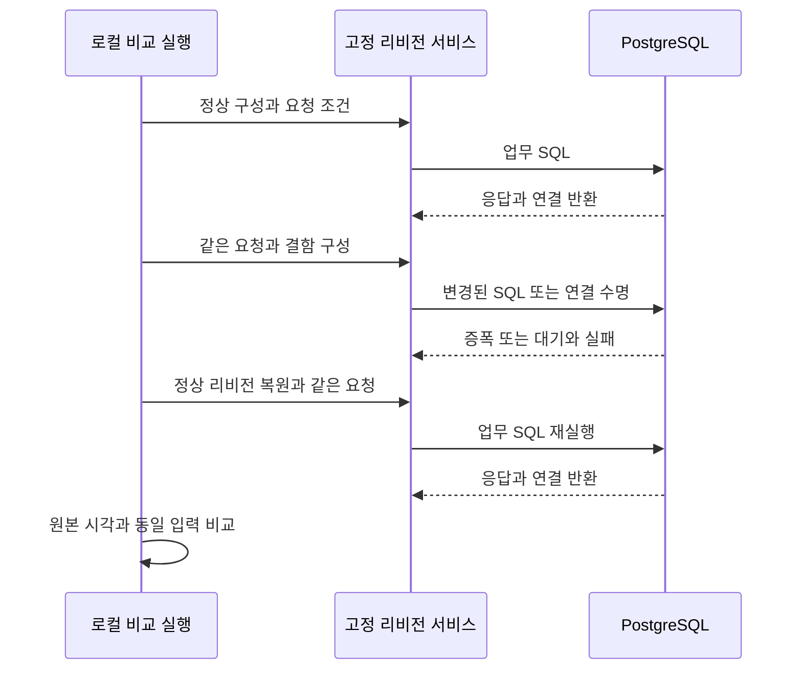
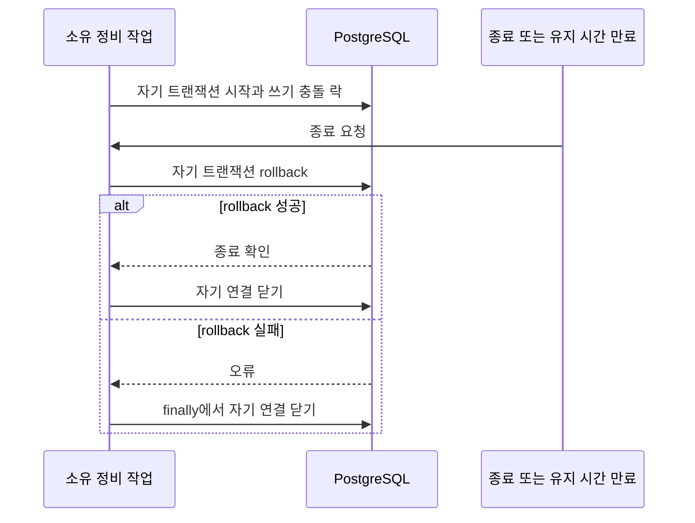

# ADR implementation review

## At a glance

독립 코드 재검토는 PASS이며 F1/F2/F3/F4와 관측시간 U3를 해소했다. 현재 로컬 proof·이미지의 출처가 일치한다.

최종 모델 평가 0 PASS/8 FAIL과 새 fixture 미승인을 기록했다. 평가용 AWS·로컬 자원은 정리와 부재 확인을 마쳤으며 기존 기준선과 Proposed를 유지한다.

실제 Healthcare AWS 알람·배포 복원은 미검증이다. 모델 자체 확정 8/8을 정답으로 취급하지 않으며 안전성 정적 검출은 실제 위험 작업 실행을 뜻하지 않는다. AWS를 새 상태 승격 선행조건으로 추가하지 않는다.

INCONCLUSIVE.

## Review mode

full. 독립 필요성·충족성 검토와 잔여 반례 재검토를 합성했다. 코드 재검토 PASS와 전체 증거 INCONCLUSIVE를 구분한다.

## Scope

전체 ADR 본문과 원래 호출 경로는 scope에, 실제 관련 변경은 changeScope에 기록했다. 이전 RCA 효율 수정의 재설계는 포함하지 않는다. 원본 검토 사본은 이력이며 현재 판정은 `sufficiency-closed-coverage.json`과 main 합성이다. 세 ADR은 Proposed로 유지한다.

## Context

<!-- generated review context start -->

실제 데이터베이스를 사용하는 사설 데모 서비스를 두고, 코드·설정 차이가 사용자 증상으로 나타나는지 비교한다.

사설 서비스 또는 전용 로컬 PostgreSQL, 소유 실행 ID, 불변 소스와 같은 부하 조건을 전제로 한다.

사설 네트워크와 비밀 참조, 정상 이미지 기본값, 제한된 부하, SQL 값 비노출, 소유 연결 정리와 동일 부하 비교를 보존한다.

전체 ADR 본문과 원래 호출 경로를 검토했다. 독립 코드 재검토는 PASS이며 열린 코드 발견사항은 없다. 남은 미검증 행은 실제 AWS 실행과 모델 품질·승인의 증거 한계이므로 전체 판정은 INCONCLUSIVE다.

**ADR 0007: 데모 시나리오 — 실제 결함·증상 관측·원상복원** (`docs/adr/infra/0007-demo-symptom-alarm-and-deployment-fault-injection.md`)와 비교하면 정상·결함·복원을 같은 요청 조건으로 비교하고 소유 연결을 정리한다. 반면 infra/0004는 서비스 배포와 관측 기반을, infra/0007은 결함 적용과 알람·복원 판단을 정한다. 따라서 서비스의 제한된 부하와 로그 비노출은 여기서 읽고, 실제 알람 성공 여부는 별도 실행 증거로 구분한다.


<!-- generated review context end -->

## 같은 부하에서 실제 결함과 안전한 관측을 비교한다

처리가 지연되어도 같은 요청 계획을 유지하고 값 노출 없이 실제 증상을 관측하는가?

<!-- generated container zoom start -->

같은 부하에서 실제 결함과 안전한 관측을 비교한다. 요청 완료와 분리한 부하 계획, 실제 결함 리비전과 안전한 HTTP 관측 경계가 같은 조건의 로컬 비교를 뒷받침한다.

원본 검토의 120개 응답 비교에서는 정상·복원의 SQL 1회와 결함의 121회가 같은 응답 hash를 유지했다.

수정 전 F1에서는 driver DETAIL의 canary가 로그에 남았다. 수정 후 같은 반례는 일반 500 응답과 canary 비노출로 바뀌었다.

정상·결함·복원에 같은 요청 조건을 적용한다. 내장 부하가 서비스와 DB를 호출하고, 독립 관측 경로가 요청 상태와 SQL 시간을 남긴다.

요청 시작량과 완료량을 구별하며 실제 SQL·연결 차이를 비교할 수 있다. 현재 컴파일된 로컬 proof와 이미지 3개는 verified=true이며 소스가 일치한다. verified=false는 UNBUILT 체크아웃 manifest에만 해당한다. 실제 AWS 배포 관측은 U1로 남는다.

<!-- generated container zoom end -->

화살표는 호출 순서 또는 자료 이동을 나타낸다. 실제 실행 증거의 범위는 도식 아래 문장과 함께 읽는다.



Notice: 이 순서도는 로컬 비교를 설명하며 실제 AWS 알람 전이를 확인했다는 뜻이 아니다.

<!-- generated component zoom start -->

### Component C1 · 완료 지연과 독립적인 요청 시작

**책임.** 처리 중인 요청 상한과 실행하지 못한 요청을 구별한다.

**상세 구현.** 정해진 슬롯을 놓치면 skipped로 세고, active 상한이면 새 작업을 만들지 않는다. 다음 시각은 현재 시각과 간격으로 잡아 몰아 보내기를 피한다.

**검증 결과.** 원본 T1의 stalled_requests 및 event_loop_delay 경계 시험 PASS; 반복 실행 결과를 새 측정으로 세지 않는다.

#### Code 1 · excerpt · packages/healthcare-sensor-app/src/test_service/services/traffic_generator.py:121

```
missed = max(0, math.floor((now - next_due) / interval)) if interval else 0
            slot += missed
            if symptom_metrics is not None:
                symptom_metrics.record_traffic(offered=missed + 1, skipped=missed)
            if len(active) >= max_concurrency:
                if symptom_metrics is not None:
                    symptom_metrics.record_traffic(skipped=1)
            else:
                # Slot-local seeds preserve inputs for matching slots despite skipped work.
                rng = random.Random(f"{seed}:{slot}") if seed is not None else None
                task = asyncio.create_task(
                    _run_request(
                        sensor_service,
                        _REQUEST_PLAN[slot % len(_REQUEST_PLAN)],
                        rng=rng,
                        patient_id=patient_id,
                        query_limit=query_limit,
                        symptom_metrics=symptom_metrics,
                    ),
                    name="healthcare-traffic-request",
                )
                active.add(task)
```

- 코드 근거 설명: missed와 active 상한이 서로 다른 생략 사유를 계수한다. 이 발췌는 실제 함수의 연속 구간이다.
- 테스트: 원본 T1의 stalled_requests 및 event_loop_delay 경계 시험 PASS; 반복 실행 결과를 새 측정으로 세지 않는다.

### Component C2 · 같은 입력과 세션 수명

**책임.** 저장·조회가 같은 요청 조건과 세션 정리 경계를 사용한다.

**상세 구현.** 데이터 접근부는 session_context로 요청 본문의 예외를 정리 경로에 전달한다. 빌드 리비전 r2는 실제 행별 SQL을, r3는 예외 경로 반환 누락을 선택한다.

**검증 결과.** 현재 compiled proof83aac573…의 실제 SQL 1/121/1과 같은 응답 hash; main PostgreSQL2 PASS, Healthcare125 PASS. 독립 검토는 보존 증거를 재검사했다.

#### Code 1 · diff · packages/healthcare-sensor-app/src/test_service/adapters/secondary/sensor_repository/sqlalchemy_sensor_repository.py

```diff
@@ -6,14 +6,17 @@ from test_service.adapters.secondary.sensor_repository.models import SensorReadi
 from test_service.ports.dto.sensor import SensorReadingEntity
 from test_service.ports.interfaces.database import DatabasePort
 from test_service.ports.interfaces.sensor_reading_repository import SensorReadingRepositoryPort
+from test_service.revision.query import fetch_patient_rows
 
 
 class SqlAlchemySensorReadingRepository(SensorReadingRepositoryPort):
     def __init__(self, database: DatabasePort) -> None:
+        """Use the database port's lifetime contract rather than owning a separate pool."""
         self._database = database
 
     async def save_batch(self, readings: list[SensorReadingEntity]) -> list[SensorReadingEntity]:
-        async for session in self._database.session():
+        """Persist a batch in one scope so flush errors reach the compiled cleanup path."""
+        async with self._database.session_context() as session:
             rows = []
             for r in readings:
                 row = SensorReadingRow(
```

- 코드 근거 설명: generator 순회에서 context manager로 바꾼 실제 diff다. 세션의 종료 책임이 요청 본문 실패와 연결된다.
- 테스트: 현재 compiled proof83aac573…의 실제 SQL 1/121/1과 같은 응답 hash; main PostgreSQL2 PASS, Healthcare125 PASS. 독립 검토는 보존 증거를 재검사했다.

### Component C3 · HTTP 오류의 안전한 기록

**책임.** 요청 처리 중 드라이버 오류의 원문 값이 앱·서버 로그로 넘어가는 것을 막는다.

**상세 구현.** 전체 응답 수명을 감싸는 ASGI 경계에서 오류 종류만 추출한다. 응답 전 오류는 일반 500 응답으로 처리하고, 응답 시작 뒤 오류는 원래 예외가 연결되지 않은 안전한 오류로 종료한다.

**검증 결과.** Curie Healthcare125 PASS 및 원래 canary 반례 PASS. 전체 응답 수명과 오류·취소·세션 반환·다음 정상 저장을 확인했다.

#### Code 1 · diff · packages/healthcare-sensor-app/src/test_service/middleware/logging.py

```diff
@@ -16,8 +41,12 @@ class LoggingMiddleware(BaseHTTPMiddleware):
-            response = await call_next(request)
-            elapsed_ms = int((time.perf_counter() - start) * 1000)
-            extra = {
-                "method": request.method,
-                "path": request.url.path,
-                "status_code": response.status_code,
-                "elapsed_ms": elapsed_ms,
-            }
+            await self.app(scope, receive, track_response)
+        except Exception as exc:
+            error_type = type(exc).__name__
+
+        # Outside the except block: logging/send failures must not chain driver data.
+        extra = {
+            "method": scope["method"],
+            "path": getattr(scope.get("route"), "path", "<unmatched>"),
+            "status_code": status_code if status_code is not None else 500,
+            "elapsed_ms": int((time.perf_counter() - start) * 1000),
+        }
+        if error_type is None:
@@ -25,6 +54,8 @@ class LoggingMiddleware(BaseHTTPMiddleware):
-            return response
-        except Exception:
-            elapsed_ms = int((time.perf_counter() - start) * 1000)
-            extra = {"method": request.method, "path": request.url.path, "elapsed_ms": elapsed_ms}
-            logger.exception("Request failed", extra=extra)
-            raise
+            return
+        logger.error("Request failed", extra={**extra, "error_type": error_type})
+        if status_code is None:
+            response = JSONResponse({"detail": "Internal server error"}, status_code=500)
+            await response(scope, receive, send)
+            return
+
+        raise RuntimeError("HTTP response failed after headers were sent")
```

- 코드 근거 설명: 원래 logger.exception과 재전파를 바꾼 실제 diff다. driver DETAIL을 그대로 기록하지 않는 HTTP 경계를 보여준다.
- 테스트: Curie Healthcare125 PASS 및 원래 canary 반례 PASS. 전체 응답 수명과 오류·취소·세션 반환·다음 정상 저장을 확인했다.

### Component C4 · 배포 이미지의 선택적 digest 고정

**책임.** imageDigest가 있으면 repository@sha256를 사용하고 없으면 기존 repository:tag를 유지한다. imageTag는 기존 리비전 라벨로 남는다.

**상세 구현.** imageDigest가 있으면 repository@sha256를 사용하고 없으면 기존 repository:tag를 유지한다. imageTag는 기존 리비전 라벨로 남는다.

**검증 결과.** Curie의 loader→bin→stack focused 48 PASS/2 suites; main 전체 infra 82 PASS. 실제 AWS 배포는 미실행.

#### Code 1 · excerpt · packages/infra/lib/stacks/healthcare-service-stack.ts:75

```
if (
      props.imageDigest !== undefined &&
      (props.imageDigest.length !== 71 ||
        !/^sha256:[a-f0-9]{64}$/.test(props.imageDigest))
    ) {
      throw new Error(
        'healthcare.imageDigest must be sha256:<64 lowercase hex digits>',
      );
    }
    const imageSuffix =
      props.imageDigest === undefined
        ? `:${props.imageTag}`
        : `@${props.imageDigest}`;
```

- 코드 근거 설명: 정상 배포에서도 CLI가 요구하는 불변 이미지 원본을 선택할 수 있게 하는 경계다. 소스 manifest 검증과 이미지 식별은 별도로 유지한다.
- 테스트: Curie의 loader→bin→stack focused 48 PASS/2 suites; main 전체 infra 82 PASS. 실제 AWS 배포는 미실행.

<!-- generated component zoom end -->

<!-- generated hill evidence start -->

### D0 · 충족됨 · 관계형 데이터베이스와 Healthcare 서비스를 독립 스택으로 배포한다.

**구현.** 독립 RDS/Healthcare 스택, 사설 배치, DB 선행 의존성을 코드와 합성으로 확인. 실제 AWS 배포 성공을 뜻하지 않는다.

**근거.** packages/infra/bin/infra.ts:48; packages/infra/lib/stacks/rds-stack.ts:29; packages/infra/lib/stacks/healthcare-service-stack.ts:37

**테스트.** 원 검토의 T1,T6

### R1 · 충족됨 · 데이터베이스와 서비스는 사설 네트워크에서 동작하고 자격 증명은 비밀 참조로 주입한다. 배포 구성과 이미지에 자격 증명을 포함하지 않는다.

**구현.** 사설 서브넷·공인 IP 없음·VPC CIDR DB 접근, 생성 비밀의 username/password 참조. Docker는 소스·가상환경만 복사한다.

**근거.** packages/infra/lib/stacks/rds-stack.ts:23; packages/infra/lib/stacks/healthcare-service-stack.ts:138; packages/healthcare-sensor-app/Dockerfile:22

**테스트.** 원 검토의 T1,T6

### R2 · 충족됨 · 서비스는 제한된 동시 실행 수와 완료 속도에 독립적인 요청 시작 계획을 사용한다. 상한 때문에 실행하지 못한 요청은 별도 기록하고 무한 대기열이나 몰아 보내기를 만들지 않는다.

**구현.** 완료와 분리된 슬롯 계획, active 상한, missed/capacity skipped 계수, 취소 후 gather.

**근거.** packages/healthcare-sensor-app/src/test_service/services/traffic_generator.py:85 (특히 121–144)

**테스트.** 원 검토의 T1: test_stalled_requests_do_not_stop_offers_or_exceed_concurrency; test_event_loop_delay_skips_missed_deadlines_without_catchup_tasks

### R3 · 충족됨 · 정상 이미지가 기본이며, 실제 설정 변경·불변 결함 이미지·소유 정비 작업으로 네 시나리오를 재현한다. 기존 장애 플래그와 직접 주입 경로는 호환용으로 보존한다.

**구현.** r1 빌드 기본; r2 실제 121 SELECT, r3 예외 뒤 세션 잔류; 풀 설정·별도 락 작업; 레거시 플래그/API 별도 유지. verified=false는 UNBUILT 체크아웃 manifest에만 해당한다. 현재 컴파일된 로컬 proof와 이미지 3개는 verified=true이며 소스가 일치한다.

**근거.** packages/healthcare-sensor-app/Dockerfile:12; demo/build_revision.py:67; demo/revisions/r2/query.py:10; demo/revisions/r3/session.py:23; services/fault.py (후자의 상대 경로는 healthcare 패키지)

**테스트.** 원 검토의 T1,T7,T9,T10

### R4 · 충족됨 · 요청 상태, SQL 횟수·시간, 연결 수명과 유효 풀 설정을 관측하되 SQL 매개변수와 자격 증명을 기록하지 않는다. 지표 방출은 요청 완료에 의존하지 않는다.

**구현.** F1 해소. 요청·SQL·연결·풀 관측/독립 방출을 유지하며 HTTP driver 예외는 안전한500 또는 원래 context 없는 late-error로 처리. 실패 리딩 계수·세션 반환은 유지.

**근거.** packages/healthcare-sensor-app/src/test_service/middleware/logging.py:17; services/db_observability.py:83; services/symptom_metrics.py:153

**테스트.** N1 Healthcare125 PASS; F1 재현 generic500/canary=false

### R6 · 검증 필요 · 배포된 이미지와 소스 리비전을 식별할 수 있어야 하며 정상·결함·복원은 같은 부하 조건으로 검증한다.

**구현.** 구현·로컬 이미지/소스 식별·같은 부하의3구간 검사는 확인. 세 최신 imageID/기록된 source fingerprint가 현재 실측과 일치한다. 실제 AWS 배포 자원의 이미지와3구간 관측은 미검증(U1 runtime); 새 ADR 상태 선행조건으로 요구하지 않음. 선택적 HEALTHCARE_IMAGE_DIGEST/TOML imageDigest가 real loader→bin→stack의 repository@sha256로 연결되며 잘못된 pin은 거부한다. 현재인프라48시험으로 확인.

**근거.** revision/manifest.py:source_manifest (healthcare src/test_service); scripts/run_realistic_demo.py:immutable_baseline_image,baseline_source_manifests; review-fixed-images.json; packages/infra/config/loader.ts:143; packages/infra/bin/infra.ts:64; packages/infra/lib/stacks/healthcare-service-stack.ts:75–87,122

**테스트.** N1/N5 current-source proof; N5 docker image inspect3/3 및 fingerprint 대조; recheck-03 infra-pin:48 PASS/2 suites

<!-- generated hill evidence end -->

## 종료와 실패에서 자기 트랜잭션을 정리한다

종료 신호나 rollback 실패가 발생해도 자기 연결 정리를 마치는가?

<!-- generated container zoom start -->

종료와 실패에서 자기 트랜잭션을 정리한다. 정비 작업은 자신이 연 트랜잭션과 연결만 정리한다.

원본 T8은 트랜잭션 시작·LOCK·rollback 오류 각각에서 close 호출을 확인했다.

다른 실행의 연결을 닫는 방식은 이 계약을 충족하지 않는다. 소유권 거부 시험을 별도로 유지한다.

유한한 락 유지와 종료 처리를 하나의 작업이 소유한다. 종료 요청은 cleanup 작업을 기다리고, rollback 성공 여부와 무관하게 연결을 닫는다.

서비스 종료나 유지 한도 만료 뒤 자기 DB 자원을 남기지 않는 경로를 검사한다. 소유 연결 정리는 독립 오류 시험과 보존된 실제 PostgreSQL 증거로 확인했다. 코드 종료 판정은 PASS이며 AWS 실행 증거와 구분한다.

<!-- generated container zoom end -->

화살표는 호출 순서 또는 자료 이동을 나타낸다. 실제 실행 증거의 범위는 도식 아래 문장과 함께 읽는다.



Notice: rollback 오류 뒤에도 연결 닫기 화살표가 이어지는지가 검토 지점이다.

<!-- generated component zoom start -->

### Component C1 · 소유 트랜잭션 종료

**책임.** 정비 작업 자신의 트랜잭션과 연결을 종료한다.

**상세 구현.** rollback이 실패해도 finally에서 connection을 닫는다. cleanup task를 shield하고 취소 중에도 종료를 기다린다.

**검증 결과.** 원본 T8의 start/LOCK/rollback 오류 close 3종 PASS; T9는 실제 PostgreSQL 별도 제공 실행 2 PASS.

#### Code 1 · excerpt · packages/healthcare-sensor-app/src/test_service/maintenance.py:93

```
async def release():
            """Rollback this task's transaction and close its backend even if rollback fails."""
            try:
                if started:
                    await transaction.rollback()
            finally:
                await conn.close(timeout=5)

        cleanup = asyncio.create_task(release())
        try:
            await asyncio.shield(cleanup)
        except asyncio.CancelledError:
            await cleanup
            raise
```

- 코드 근거 설명: 소유 연결 정리가 rollback의 성공 여부와 독립적으로 실행되는 실제 코드다.
- 테스트: 원본 T8의 start/LOCK/rollback 오류 close 3종 PASS; T9는 실제 PostgreSQL 별도 제공 실행 2 PASS.

<!-- generated component zoom end -->

<!-- generated hill evidence start -->

### R5 · 충족됨 · 서비스와 정비 작업의 종료·실패·종료 신호는 소유한 작업과 연결을 정리한다. 정비 트랜잭션은 유한한 유지 한도를 가지며 자기 트랜잭션만 롤백한다.

**구현.** 서비스 작업 drain 뒤 소유 세션/관측 풀 정리; 정비는 자기 transaction만 rollback. 정상·취소·SIGTERM·기한 만료는 실측, start/LOCK/rollback 오류는 독립 probe에서 close 확인.

**근거.** packages/healthcare-sensor-app/src/test_service/main.py:69; adapters/secondary/database_adapter.py:157; maintenance.py:91; demo/local_runner.py:44

**테스트.** 원 검토의 T1,T7,T8/maintenance_failure_probes,T9

<!-- generated hill evidence end -->

## Findings

<!-- generated review diagnostics start -->

### 계약과 범위

26개 원본 계약을 모두 기록했고 코드 위반 0개다. 21 PROVEN/5 UNVERIFIED는 세 보고서 합계다.

sufficiency-residual-final-recheck.md; sufficiency-closed-coverage.json

### 자체 검증 결과

독립 코드 재검토는 PASS다. 최종 실모델 회차 realistic-final-20260910T025818Z-a57123은 정규화 결과 8개를 모두 남겼고 평가는 0 PASS/8 FAIL이다. 입력 digest는 8dc813d320341b5347ed5f299a5c52217a5c84a7d02863e8be79e2672e860cfc로 유지됐다. 산출물 완비 8/8, 증거 연결 7/8, 제안 안전성 정적 검사 7/8, 원인 식별 4/8이며 경쟁 원인 기각은 모두 false(0/8)다. 모델의 자체 확정 8/8은 모델이 내린 표시이며 검토자의 정답 판정이 아니다. 기존 기준선은 그대로이고 승인된 새 fixture는 없다.

평가용 자원 정리는 완료됐다. 최종 AWS 회차의 DynamoDB 테이블 4개, S3 버킷 1개, 벡터 버킷 1개와 인덱스 8개 삭제가 main에 의해 확인됐고, cleanup-verification.json의 자원 부재 검사는 allAbsent=true다. 중단한 이전 두 회차도 각각 allAbsent=true다. 로컬 PostgreSQL은 잔여 proof schema 0개를 확인한 뒤 소유 컨테이너와 익명 볼륨을 제거했다. 이 정리 결과는 평가용 자원의 종료 증거이며 Healthcare AWS 배포 E2E나 500ms 알람 관계의 성공을 의미하지 않는다. 출처: tests/results/model/realistic-final-20260910T025818Z-a57123/final-report.json; tests/results/model/realistic-final-20260910T025818Z-a57123/cleanup-verification.json; docs/test-reports/realistic-demo-evidence-2026-09-10/local-cleanup.json

### 필요성과 과다 변경

N1 독립 해소, N2 선택적·변경 없음. 열린 필수 코드 수정 없음.

necessity-review-final.md; sufficiency-residual-final-recheck.md

<!-- generated review diagnostics end -->

열린 코드 발견사항은 없다. HTTP 로그 F1, 복원 F2, 함수 문서 F3, 메타데이터 F4와 최소 관측시간 U3는 독립 재검토로 해소됐다. N1도 종료됐고 N2는 선택적 정리로 변경하지 않았다.

### F1. U1 — 실제 AWS 알람과 배포 복원의 실행 증거는 미검증이다.

로컬 PostgreSQL과 이미지 검증은 AWS 알람 전이·전달·서비스 회복을 직접 관측한 결과가 아니다.

Healthcare AWS 배포 E2E는 수행하지 않았다. 별도 평가용 AWS 자원과 로컬 PostgreSQL 자원은 정리 후 부재 확인을 마쳤다.

현재 실행 증거의 한계로 기록한다. 새 코드 수정이나 상태 승격 선행조건을 추가하지 않는다.

## ADR contract coverage

| 계약 | 상태 | Hill | 요구사항 |
| --- | --- | --- | --- |
| D0 | 충족됨 | H1 | 관계형 데이터베이스와 Healthcare 서비스를 독립 스택으로 배포한다. |
| R1 | 충족됨 | H1 | 데이터베이스와 서비스는 사설 네트워크에서 동작하고 자격 증명은 비밀 참조로 주입한다. 배포 구성과 이미지에 자격 증명을 포함하지 않는다. |
| R2 | 충족됨 | H1 | 서비스는 제한된 동시 실행 수와 완료 속도에 독립적인 요청 시작 계획을 사용한다. 상한 때문에 실행하지 못한 요청은 별도 기록하고 무한 대기열이나 몰아 보내기를 만들지 않는다. |
| R3 | 충족됨 | H1 | 정상 이미지가 기본이며, 실제 설정 변경·불변 결함 이미지·소유 정비 작업으로 네 시나리오를 재현한다. 기존 장애 플래그와 직접 주입 경로는 호환용으로 보존한다. |
| R4 | 충족됨 | H1 | 요청 상태, SQL 횟수·시간, 연결 수명과 유효 풀 설정을 관측하되 SQL 매개변수와 자격 증명을 기록하지 않는다. 지표 방출은 요청 완료에 의존하지 않는다. |
| R5 | 충족됨 | H2 | 서비스와 정비 작업의 종료·실패·종료 신호는 소유한 작업과 연결을 정리한다. 정비 트랜잭션은 유한한 유지 한도를 가지며 자기 트랜잭션만 롤백한다. |
| R6 | 검증 필요 | H1 | 배포된 이미지와 소스 리비전을 식별할 수 있어야 하며 정상·결함·복원은 같은 부하 조건으로 검증한다. |

## Notable implementation choices

| Selected value or behavior | Code evidence | Why it fits the ADR intent | Why it matters |
| --- | --- | --- | --- |
| 개별 요청 간격5초, 동시1, query20, 고정 seed/patient 선택 | healthcare settings.py:25; traffic_generator.py:121 | 유한 요청 시작 계획(R2/R5)을 유지하는 조정값 | 데모 성공 부하를 보장하는 수치가 아니다. 늦은 슬롯은 버리고 다음 due=now+interval로 잡는다. |
| observer 별도 pool1/overflow0, pool timeout2초, statement timeout2000ms; activity100/locks200 | database_adapter.py:178 | 앱 풀 고갈 중에도 유한 읽기 관측(R4) | 관측 연결 자체가 연결 수에 포함되므로 앱 pool과 DB 전체를 분리한다. |
| EMF sample 배열100, 기본 flush30초, gauge 유지 | symptom_metrics.py:27,118,168 | 독립 방출과 유한 메모리 | sample capacity 방출은 정상이며 취소를 기존 완료 계수에 더하지 않는다. 30초는 legacy 계약 수치다. |
| r1 정상, r2 N+1, r3 획득 후 body-error cleanup 누락을 빌드 overlay로 고정 | Dockerfile:12; demo/build_revision.py:67 | 명시적인 불변 소스 선택(R3), 같은 응답(R2) | 런타임 환경 이름으로 구현을 바꾸지 않는다. r3의 고의 결함 자체는 정상 코드 버그로 신고하지 않았다. |

## Tests

main 최신 집계는 단위 1,771 PASS(agent740/headless824/healthcare125/infra82), 루트136 PASS/1 FAIL이다. 루트 실패는 이전 승인 기준선 digest와 새 입력의 차이이며 기준선을 그대로 보존했다. format/lint/build/typecheck PASS, 기존 skip2/xfail1을 구분한다.

F4는 Strands113/Headless201 및 독립 최종 prompt 재현이 통과했다. 마지막 F2는 Python56/Node4와 journal·stderr 동시 오류의 원래 두 반례가 통과했다. 이미지 pin은 독립 focused48/2 suites와 main 전체 infra82를 구분한다. 같은 시험의 재실행 수를 합산하지 않는다.

실제 PostgreSQL 통합2 PASS와 fixed-proof `83aac573c02bd6eb9596ced5e0797460018704b62b955905b68b15707d1b4f2b`, 컴파일 소스와 이미지3개 일치를 보존한다. 이 실제 compiled proof와 이미지의 manifest는 verified=true다. UNBUILT 체크아웃 manifest의 verified=false와 구분한다.

최종 실모델 회차 realistic-final-20260910T025818Z-a57123은 정규화 결과 8개를 모두 남겼고 평가는 0 PASS/8 FAIL이다. 입력 digest는 8dc813d320341b5347ed5f299a5c52217a5c84a7d02863e8be79e2672e860cfc로 유지됐다. 산출물 완비 8/8, 증거 연결 7/8, 제안 안전성 정적 검사 7/8, 원인 식별 4/8이며 경쟁 원인 기각은 모두 false(0/8)다. 모델의 자체 확정 8/8은 모델이 내린 표시이며 검토자의 정답 판정이 아니다. 기존 기준선은 그대로이고 승인된 새 fixture는 없다.

평가용 자원 정리는 완료됐다. 최종 AWS 회차의 DynamoDB 테이블 4개, S3 버킷 1개, 벡터 버킷 1개와 인덱스 8개 삭제가 main에 의해 확인됐고, cleanup-verification.json의 자원 부재 검사는 allAbsent=true다. 중단한 이전 두 회차도 각각 allAbsent=true다. 로컬 PostgreSQL은 잔여 proof schema 0개를 확인한 뒤 소유 컨테이너와 익명 볼륨을 제거했다. 이 정리 결과는 평가용 자원의 종료 증거이며 Healthcare AWS 배포 E2E나 500ms 알람 관계의 성공을 의미하지 않는다.

모델 결과 출처: `tests/results/model/realistic-final-20260910T025818Z-a57123/final-report.json`. 정리 출처: `tests/results/model/realistic-final-20260910T025818Z-a57123/cleanup-verification.json`, `docs/test-reports/realistic-demo-evidence-2026-09-10/local-cleanup.json`.

실행 명령과 출처는 다음과 같다.

| 실행 | 관측 결과·출처 |
| --- | --- |
| `python3 tests/harness/realistic_demo_cases.py -v` | 최종56 PASS; Curie recheck-03/python56-final.log |
| `node --test tests/harness/realistic-demo-script.test.mjs` | 4 PASS; recheck-03/node4.log |
| `pnpm --filter infra exec jest --runInBand --cache=false test/healthcare-service-stack.test.ts test/healthcare-image-config.test.ts` | 독립48 PASS/2 suites; recheck-03/infra-pin.log |
| Healthcare venv의 `sufficiency-recheck-03/original-repro.py` | OSError와 닫힌 stream ValueError 모두 원본:1 복원 PASS |
| 양 엔진 `tests/test_eval_alarm_metadata.py` 및 관련 caller/prompt suite | Strands113/Headless201 PASS; sufficiency-final-review.md의 정확한 N2 명령 |
| 루트·패키지 최종 검증 | main-verification.json과 realistic-demo-evidence-2026-09-10 로그; 단위1771, 루트136/1 |

## Residual risks

코드 종료 판정은 PASS다. 전체 증거는 21 PROVEN/0 VIOLATED/5 UNVERIFIED로 INCONCLUSIVE이며, 미검증은 실제 runtime·알람과 모델 품질·승인 범위를 표시한다. AWS 배포를 ADR 상태 승격의 새로운 선행조건으로 추가하지 않는다. 현재 Proposed를 유지하며 승인 기준선은 갱신하지 않았다.

AWS 배포 E2E·500ms 알람 관계는 실행하지 않았다. 최종 모델 평가는 0 PASS/8 FAIL이며 이전 진단 실패와 중단 기록을 보존한다. 최종 회차와 중단 두 회차, 로컬 PostgreSQL 자원의 정리를 확인했다. 코드 종료 시점의 closed coverage는 유지하고 이후 모델 결과를 이 절에 기록했다.

NOT_OPENED — 이전 자동 승인 검토의 local file:// 차단과 사용자의 HTTP·shell·다른 브라우저 우회 금지에 따른다. open helper·브라우저 시각 검사는 수행하지 않았다. 정적 SVG XML·관계 도형·내부 링크만 검사한다.
