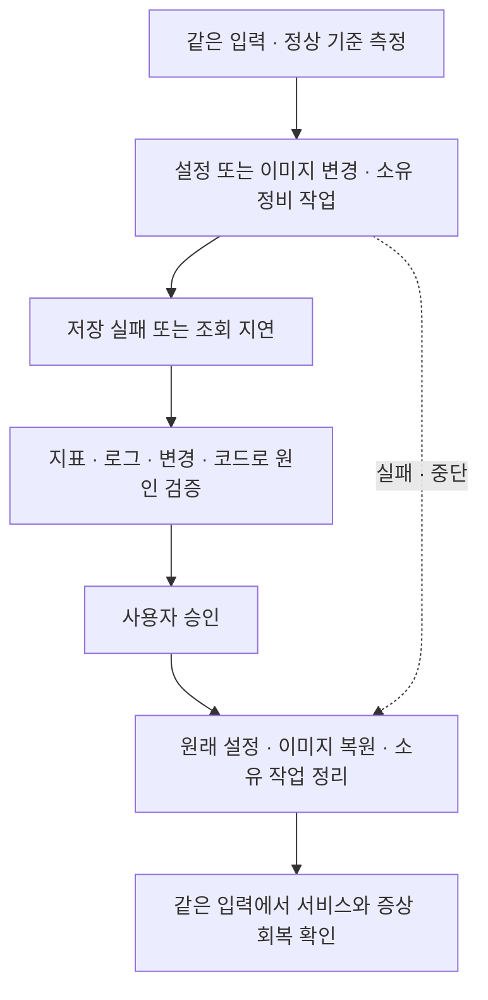

# ADR 0007: 데모 시나리오 — 실제 결함·증상 관측·원상복원

Date: 2026-07-29
Updated: 2026-09-10

## Status

Proposed

## Context

Healthcare 데모는 같은 입력이 정상 구성에서는 성공하고 결함 구성에서는 실패하며,
복원 뒤 다시 성공하는 인과 사슬을 보여야 한다. 알람 이름이나 장애 플래그를 정답처럼
읽는 것으로는 코드·설정·지표를 연결하는 RCA 능력을 검증할 수 없다.

## Decision Drivers

- 알람은 사용자에게 보이는 저장 실패나 조회 지연을 전달하고 원인을 누설하지 않아야 한다.
- 실제 업무 SQL과 연결 수명에서 결함이 발생해야 하고 단순 대기 시간 추가로 대체하지 않는다.
- 정상·결함·복원에 같은 부하를 사용하고, 처리 지연 때문에 줄어든 처리량을 부하 감소로 오인하지 않아야 한다.
- 경쟁 원인은 독립적인 관측으로 구별되어야 하며 근거 없는 기각은 허용하지 않는다.
- 실패나 중단 뒤에도 호출자가 만든 변경과 작업을 식별하고 원래 상태로 되돌릴 수 있어야 한다.

## Decision

**실제 설정 회귀·불변 결함 이미지·소유된 정비 작업을 증상 알람과 연결하고,
같은 요청 조건의 정상→결함→복원 비교로 검증한다.**

### Requirement contract

- 풀 설정 회귀는 실제 애플리케이션 풀 설정 변경으로 재현하고 원래 설정 복원 뒤 같은 부하에서 저장과 연결 대기가 회복되어야 한다.
- 조회 증폭은 불변 결함 이미지의 실제 업무 SQL 증가로 재현한다. 정상 이미지로 되돌리면 같은 응답 데이터와 SQL 횟수·조회 시간이 회복되어야 한다.
- 정비 트랜잭션은 실제 쓰기 충돌 락과 소유 실행 식별자를 가져야 한다. 유한한 유지 한도와 종료·실패·시그널의 롤백 경로가 있고 다른 실행의 작업은 종료하지 않는다.
- 세션 정리 회귀는 같은 예외 입력에서 결함 이미지에만 반환 누락이 생겨 이후 정상 저장을 방해해야 한다. 정상 이미지 복원과 결함 태스크 종료 뒤 연결 반환과 저장 성공을 확인한다.
- 요청 시작·완료·실패·진행 중 상태와 실행하지 못한 부하를 구분하며 무한 대기열이나 몰아 보내기를 만들지 않는다. 기존 완료 기반 지표 의미는 보존한다.
- 조회 시간은 밀리초로 관측하고 요청 완료와 독립적으로 메트릭을 방출한다. 정상·복원은 비위반이고 결함은 위반인 증상 알람 관계를 실제 비교로 확인한다.
- 관측은 시각·단위·리소스·원본 로그·변경 차이를 보존한다. 정답성 플래그나 해석을 관측으로 대신하지 않으며 SQL 매개변수와 자격 증명은 기록하지 않는다.
- 변경 전에 원래 실행 정의·이미지·관련 설정과 부재 값을 소유 실행 ID에 묶어 보존한다. 실패·중단에도 모든 복원 단계를 시도하고 서비스 회복으로 성공을 판정한다.
- 레거시 기본 풀 5개·초과 10개, 연결 알람 12개, 직접 연결 주입 기본 20개는 유지한다. 기존 저장 실패 알람의 30초 집계·1분 주기 2회 평가·최소 2분 30초 관측 구간을 해당 경로에 유지한다.
- 합성·실제 PostgreSQL·배포 E2E 증거를 구분하고, 배포 E2E에 준비된 정답 관측을 주입하지 않는다. 새 입력과 양쪽 엔진 결과 검토 전에는 기준선을 갱신하지 않는다.

### 시나리오 계약

| 시나리오 | 결함과 증상 | 원인 입증 | 복원 |
|---|---|---|---|
| 풀 설정 회귀 | 같은 부하에서 실제 애플리케이션 풀 용량을 축소한 배포가 연결 획득 대기와 저장 실패를 만든다. | 변경 전후의 유효 풀 설정, 획득 대기, 반환 기록과 요청량을 대조한다. RDS 전체 연결 상한과 앱 풀 상한을 구별한다. | 원래 실행 정의의 설정을 복원하고 같은 입력에서 저장과 대기가 회복되는지 확인한다. |
| 조회 증폭 | 정상 구현의 일괄 조회를 행별 재조회하는 결함 이미지가 같은 응답 데이터를 더 많은 SQL로 읽어 조회를 지연시킨다. | 같은 결과 행 수에 대한 SQL 횟수·개별 실행 시간·전체 조회 시간과 실제 코드 차이를 연결한다. | 정상 이미지로 롤백해 응답 데이터, SQL 횟수와 조회 시간이 회복되는지 확인한다. |
| 정비 트랜잭션 락 | 별도 정비 작업이 쓰기와 충돌하는 락을 가진 트랜잭션을 끝내지 않아 저장을 막는다. | 차단자·대기자 식별자, 트랜잭션 시각, 락 관계, SQL과 저장 대기·실패를 연결한다. | 해당 실행이 소유한 정비 트랜잭션을 롤백하거나 소유 작업을 종료하고 저장 재개를 확인한다. |
| 세션 정리 회귀 | 정상/결함 이미지가 같은 예외 입력을 처리하지만 결함 이미지의 빠진 정리 경로가 연결을 반환하지 않아 이후 정상 저장까지 실패하게 한다. | 요청 식별자별 획득·반환, 요청 종료 뒤 남은 연결, 정리 경로의 코드 차이와 풀 대기를 연결한다. | 정상 이미지로 되돌리고 결함 태스크가 종료된 뒤 같은 예외 입력에도 연결이 반환되며 정상 저장이 유지되는지 확인한다. |

풀 설정 회귀와 조회 증폭부터 구현·검증하되 네 시나리오가 같은 실행·복원 계약을 사용한다.
정상 이미지는 기본값이며 결함 이미지는 명시적으로 선택한다. 결함 코드의 선택은 이미지
구성에 고정되고 일반 실행 환경에서 정답성 장애 플래그를 켜는 방식으로 대체하지 않는다.
정비 작업은 소유 실행 식별자와 유한한 유지 한도를 가지며 종료·예외·시그널에서 자기
트랜잭션과 연결을 정리한다. 다른 실행의 연결이나 작업을 종료하지 않는다.

### 증상과 관측

- 저장 성공·실패와 요청 시작·완료·진행 중 상태를 구분한다. 기존 완료 기반 지표의
  의미를 바꾸지 않고 실제 시작과 대기 상태를 추가로 관측한다.
- 환자 조회의 소요 시간은 밀리초 단위로 관측하고 조회 지연을 나타내는 증상 알람을 둔다.
  기존 이상치 저장 지연 지표를 조회 응답 시간으로 재해석하지 않는다.
- 지표는 구조화 로그에 내장한 메트릭으로 주기 방출하며 요청 완료에 의존하지 않는다.
  DB 대기 중에도 살아 있는 발행 경로와 진행 중 작업을 관측할 수 있어야 한다.
- 요청 시작 계획과 동시 실행 상한을 분리한다. 무한 대기열과 지연된 요청의 몰아 보내기를
  만들지 않고 실행하지 못한 부하를 별도 기록한다. 정상·결함·복원에 같은 설정을 사용한다.
- SQL 패턴별 횟수·시간, 연결 획득·반환, 유효 풀 설정, 배포 이미지·소스 식별자를 남긴다.
  SQL 매개변수와 자격 증명은 진단 로그에 포함하지 않는다.
- 락과 DB 대기 관측은 서비스가 소유한 제한된 관측 경로를 이용한다. 분석 엔진에
  데이터베이스 직접 쓰기 권한을 부여하지 않는다.
- 새 시나리오의 부하량과 알람 임계치는 실제 비교 실험으로 정한다. 정상과 복원 구간은
  비위반이고 결함 구간은 위반이라는 관계가 성립해야 한다. 측정하지 않은 숫자를 실측값으로
  기록하거나 주입 사실만으로 알람 발생을 보장했다고 표시하지 않는다.

### 관측 입력과 원인 비교

알람은 증상을 전달한다. 에이전트용 관측은 시각·단위·리소스와 원본 로그·변경 차이를
제공하고 정답을 서술하지 않는다. 원인 라벨과 예상 결과는 평가자 측에서 관리한다.
중립적인 관측 식별자를 사용하며 합성 스냅샷은 합성임을 표시한다.

경쟁 원인마다 실제 반증 근거가 있어야 한다. 요청량, 연결 반환, SQL 횟수·실행 시간,
DB 대기 상태와 무관한 변경을 이용해 다른 인과 주장을 구별한다. 데이터의 부재를
기각으로 간주하지 않는다. 근본 원인 분류가 같아도 실제 설정·이미지·작업에 맞는 복원
절차를 요구하며 기존 fault reset의 적합성을 추정하지 않는다.

### 실행 소유권과 원상복원

1. 변경 전에 호출자 소유 실행 ID와 원래 실행 정의·이미지·관련 설정을 보존한다.
   원래 없던 설정의 부재도 보존한다. 이 기록 없이 변경을 시작하지 않는다.
2. 같은 실행이 만든 결함 리비전·정비 작업·테스트 데이터만 관리한다. 실행 ID는
   관측 계보이며 RCA의 알람 식별이나 분석 소유권을 우회하지 않는다.
3. 정상→결함→복원 순서를 실행하고 단계별 실제 관측을 보존한다. 중간 실패·예외·중단에도
   복원을 시도하고 성공 여부를 별도로 검증한다.
4. 원래 설정·이미지 복원과 소유 정비 작업 해제를 모두 시도한다. 하나의 정리 실패가
   나머지 정리를 생략하게 해서는 안 된다. 다른 실행의 자원을 정리하지 않는다.
5. 복구 완료는 서비스의 성공 처리와 증상 지표 회복으로 판정한다. 배포 API나 reset의
   성공 응답만으로 해결을 기록하지 않는다. 승인 실행 경계와 파괴적 작업 거부는 유지한다.

### 레거시 경로의 호환 계약

기존 직접 주입 API와 장애 플래그는 빠른 회귀 검증용으로 유지한다. 기본 앱 풀 5개와
초과 연결 10개, 기존 커넥션 알람 임계치 12개는 유지한다. 기존 정상 연결 수 3개는
과거 관측 기준이며 새 부하와 관측 구성을 적용한 실행은 정상값을 다시 측정한다.
직접 연결 주입 API의 기본값 20개도 유지하되, 앱 풀 밖 연결 20개 생성과 앱 풀 15개
고갈을 같은 메커니즘으로 간주하지 않는다.

기존 저장 실패 증상의 30초 집계와 1분 주기 2회 알람 평가, 최소 2분 30초 관측 구간은
그 알람을 이용하는 경로에 적용한다. 새 조회 지연 알람은 같은 서비스의 조회 관측으로
평가한다. 레거시 CPU 부하·대기 주입이 새 네 시나리오의 증상과 복원을 입증하지는 않는다.

### 검증 경계

실제 PostgreSQL에서 정상→결함→복원을 확인한 결과, 제공 관측으로 두 모델을 평가한
결과, AWS 배포 E2E 결과를 구분한다. 배포 E2E에서는 준비한 정답 관측을 분석 엔진에
주입하지 않는다. 새 입력과 양쪽 엔진의 결과를 검토하기 전에는 평가 기준선을 갱신하지 않는다.

## 대안 검토

| 대안 | 장점 | 단점 및 미채택 이유 |
|---|---|---|
| 장애 이름을 담은 플래그와 정답성 관측만 사용 | 단순하고 반복이 빠르다. | 설정 이름을 읽는 것으로 정답에 도달하고 실제 SQL·연결 수명을 검증하지 못한다. |
| 매 실행마다 임의 결함 코드를 생성 | 결함을 다양하게 만들 수 있다. | 같은 결함의 재현성과 코드·이미지 출처를 보장하기 어렵다. |
| 불변 결함 이미지·실제 설정·소유 정비 작업 | 실행한 코드와 변경을 추적하고 원래 상태로 복귀할 수 있다. | 여러 이미지와 부하·관측·복원 경로를 유지해야 한다. |
| 지연 API의 성공으로 장애와 복원을 판정 | 검증 시간이 짧다. | 업무 SQL이나 서비스 증상과 무관하게 통과할 수 있다. |
| 같은 부하의 정상·결함·복원 비교 | 원인 메커니즘과 실제 회복을 검증한다. | 데이터량·지연·부하를 환경별로 측정해야 한다. |

## Consequences

### Positive

- 실제 설정·코드·트랜잭션과 사용자 증상을 연결해 분석 능력을 검증한다.
- 원인별 복원을 구분하고 중단 뒤에도 원래 상태로 돌아갈 수 있다.
- 요청 시작량과 완료량, 연결 부족의 원인과 결과를 분리해 해석한다.

### Negative

- 결함 이미지, 부하 생성, 진단 로그와 복원 절차의 유지 비용이 생긴다.
- 새 환경에서는 부하와 증상 임계치의 정합성을 다시 검증해야 한다.
- 원인과 반증 근거를 실제로 확보하지 못하면 데모와 평가가 실패로 드러난다.

### Risks

- 소유권 확인이나 복원 기록이 누락되면 다른 작업을 종료하거나 원래 설정을 잃을 수 있다.
- 결함 이미지가 기본 배포에 선택되지 않도록 명시적 선택과 이미지 출처 검증이 필요하다.
- 관측 연결과 부하 생성 자체가 DB 부하에 영향을 주므로 정상·결함·복원에 동일하게 적용한다.
- 로컬 재현만으로 AWS 알람 전달·모델 분석·승인 실행의 성공을 주장할 수 없다.

## Related

- [ADR infra/0004: Healthcare 배포](0004-rds-healthcare-deployment.md)
- [ADR infra/0001: 알람 수신](0001-alarm-ingestion-sns-sqs-fargate.md)
- [ADR agent/0016: 평가 하네스](../agent/0016-rca-evaluation-test-harness.md)
- [ADR agent/0017: 승인 실행](../agent/0017-playbook-execution-agent.md)
- [ADR tools/0005: 코드 변경 분석](../tools/0005-code-change-analysis.md)
