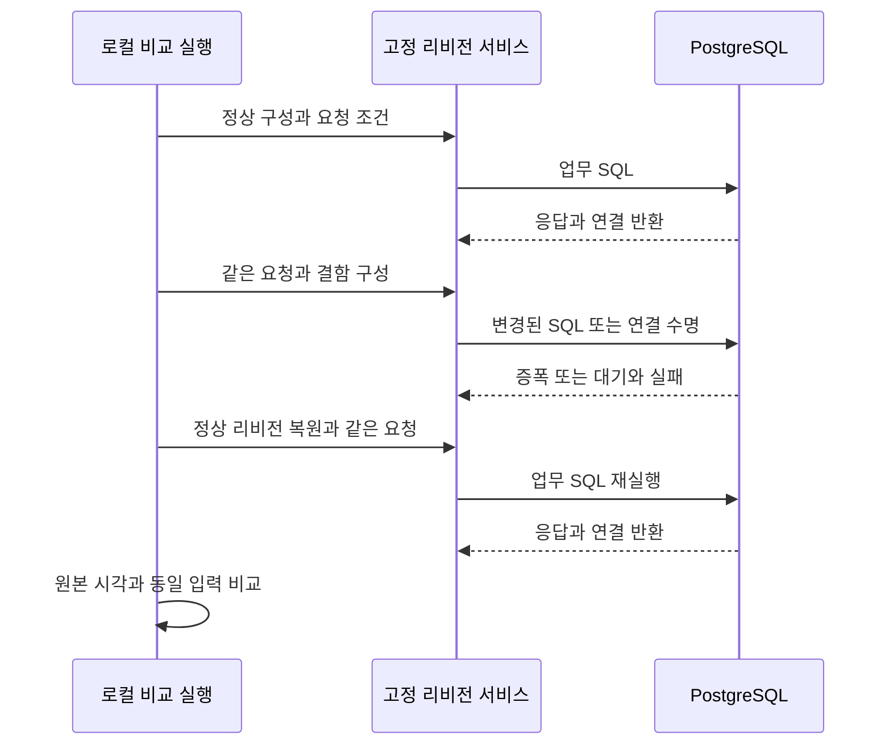
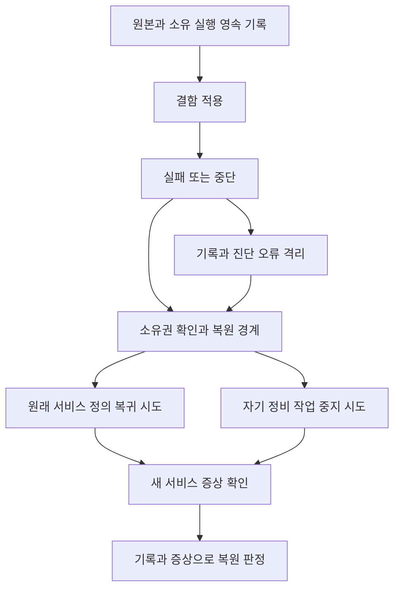
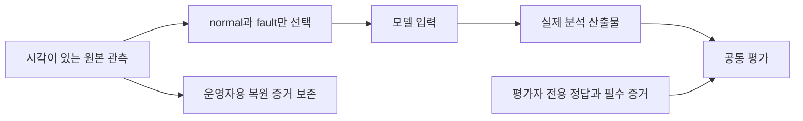

# ADR implementation review

## At a glance

독립 코드 재검토는 PASS이며 F1/F2/F3/F4와 관측시간 U3를 해소했다. 현재 로컬 proof·이미지의 출처가 일치한다.

최종 모델 평가 0 PASS/8 FAIL과 새 fixture 미승인을 기록했다. 평가용 AWS·로컬 자원은 정리와 부재 확인을 마쳤으며 기존 기준선과 Proposed를 유지한다.

실제 Healthcare AWS 알람·배포 복원은 미검증이다. 모델 자체 확정 8/8을 정답으로 취급하지 않으며 안전성 정적 검출은 실제 위험 작업 실행을 뜻하지 않는다. AWS를 새 상태 승격 선행조건으로 추가하지 않는다.

INCONCLUSIVE.

## Review mode

full. 독립 필요성·충족성 검토와 잔여 반례 재검토를 합성했다. 코드 재검토 PASS와 전체 증거 INCONCLUSIVE를 구분한다.

## Scope

전체 ADR 본문과 원래 호출 경로는 scope에, 실제 관련 변경은 changeScope에 기록했다. 이전 RCA 효율 수정의 재설계는 포함하지 않는다. 원본 검토 사본은 이력이며 현재 판정은 `sufficiency-closed-coverage.json`과 main 합성이다. 세 ADR은 Proposed로 유지한다.

## Context

<!-- generated review context start -->

같은 입력에 대한 정상 성공, 실제 결함의 증상, 복원 후 회복을 연결해 데모의 인과관계를 확인한다.

사설 서비스 또는 전용 로컬 PostgreSQL, 소유 실행 ID, 불변 소스와 같은 부하 조건을 전제로 한다.

실제 네 원인, 변경 전 원본 보존, 독립 복원, 관측의 출처·비노출과 레거시 수치 계약을 보존한다.

전체 ADR 본문과 원래 호출 경로를 검토했다. 독립 코드 재검토는 PASS이며 열린 코드 발견사항은 없다. 남은 미검증 행은 실제 AWS 실행과 모델 품질·승인의 증거 한계이므로 전체 판정은 INCONCLUSIVE다.

**ADR 0004: Healthcare 데모 서비스와 데이터베이스 배포 — RCA 검증 환경** (`docs/adr/infra/0004-rds-healthcare-deployment.md`)와 비교하면 서비스가 실제 DB 증상을 만들고 소유 작업을 정리한다는 경계를 공유한다. 반면 infra/0007은 변경 원본 보존과 전체 복원 판단까지 요구하므로 서비스 자체 cleanup보다 범위가 넓다. 따라서 서비스 단위 종료 시험만으로 journal 장애 후 배포 복원이나 AWS 알람 관계를 충족 처리하지 않는다.


<!-- generated review context end -->

## 같은 요청으로 네 결함의 증상을 구별한다

풀·SQL·연결 수명의 차이를 같은 요청으로 비교하고 알람 의무를 지키는가?

<!-- generated container zoom start -->

같은 요청으로 네 결함의 증상을 구별한다. 풀 축소, SQL 증폭, 정비 락, 예외 뒤 반환 누락은 서로 다른 실제 메커니즘이다.

원본 검토에서 pool 8/1/8 비교와 SQL 1/121/1 비교, r3의 1/2/3 checkout 잔류를 확인했다.

주입 전 대기는 최소 관측 시간에 포함하지 않는다. 수정된 경계는 주입 후 검사 실행 149초의 성공 종료를 거부하고 150초를 허용한다.

실제 원인의 변화와 요청 결과를 연결한다. 고정 소스 서비스와 제한된 부하가 PostgreSQL에 같은 업무를 보내고 원본 관측을 남긴다.

저장 실패와 조회 지연을 장애 플래그 이름에 의존하지 않고 비교한다. 네 실제 메커니즘과 최소 관측시간의 코드 경계는 확인했다. AWS 정상·결함·복원 알람 관계와 초기 500ms는 U1로 미검증이다.

<!-- generated container zoom end -->

화살표는 호출 순서 또는 자료 이동을 나타낸다. 실제 실행 증거의 범위는 도식 아래 문장과 함께 읽는다.



Notice: 로컬 조회 표본의 시간과 CloudWatch 1분 집계를 혼동하지 않으며 500ms 충족을 주장하지 않는다.

<!-- generated component zoom start -->

### Component C1 · 같은 입력과 세션 수명

**책임.** 저장·조회가 같은 요청 조건과 세션 정리 경계를 사용한다.

**상세 구현.** 데이터 접근부는 session_context로 요청 본문의 예외를 정리 경로에 전달한다. 빌드 리비전 r2는 실제 행별 SQL을, r3는 예외 경로 반환 누락을 선택한다.

**검증 결과.** 현재 compiled proof83aac573…의 실제 SQL 1/121/1과 같은 응답 hash; main PostgreSQL2 PASS, Healthcare125 PASS. 독립 검토는 보존 증거를 재검사했다.

#### Code 1 · diff · packages/healthcare-sensor-app/src/test_service/adapters/secondary/sensor_repository/sqlalchemy_sensor_repository.py

```diff
@@ -6,14 +6,17 @@ from test_service.adapters.secondary.sensor_repository.models import SensorReadi
 from test_service.ports.dto.sensor import SensorReadingEntity
 from test_service.ports.interfaces.database import DatabasePort
 from test_service.ports.interfaces.sensor_reading_repository import SensorReadingRepositoryPort
+from test_service.revision.query import fetch_patient_rows
 
 
 class SqlAlchemySensorReadingRepository(SensorReadingRepositoryPort):
     def __init__(self, database: DatabasePort) -> None:
+        """Use the database port's lifetime contract rather than owning a separate pool."""
         self._database = database
 
     async def save_batch(self, readings: list[SensorReadingEntity]) -> list[SensorReadingEntity]:
-        async for session in self._database.session():
+        """Persist a batch in one scope so flush errors reach the compiled cleanup path."""
+        async with self._database.session_context() as session:
             rows = []
             for r in readings:
                 row = SensorReadingRow(
```

- 코드 근거 설명: generator 순회에서 context manager로 바꾼 실제 diff다. 세션의 종료 책임이 요청 본문 실패와 연결된다.
- 테스트: 현재 compiled proof83aac573…의 실제 SQL 1/121/1과 같은 응답 hash; main PostgreSQL2 PASS, Healthcare125 PASS. 독립 검토는 보존 증거를 재검사했다.

### Component C2 · 완료 지연과 독립적인 요청 시작

**책임.** 처리 중인 요청 상한과 실행하지 못한 요청을 구별한다.

**상세 구현.** 정해진 슬롯을 놓치면 skipped로 세고, active 상한이면 새 작업을 만들지 않는다. 다음 시각은 현재 시각과 간격으로 잡아 몰아 보내기를 피한다.

**검증 결과.** 원본 T1의 stalled_requests 및 event_loop_delay 경계 시험 PASS; 반복 실행 결과를 새 측정으로 세지 않는다.

#### Code 1 · excerpt · packages/healthcare-sensor-app/src/test_service/services/traffic_generator.py:121

```
missed = max(0, math.floor((now - next_due) / interval)) if interval else 0
            slot += missed
            if symptom_metrics is not None:
                symptom_metrics.record_traffic(offered=missed + 1, skipped=missed)
            if len(active) >= max_concurrency:
                if symptom_metrics is not None:
                    symptom_metrics.record_traffic(skipped=1)
            else:
                # Slot-local seeds preserve inputs for matching slots despite skipped work.
                rng = random.Random(f"{seed}:{slot}") if seed is not None else None
                task = asyncio.create_task(
                    _run_request(
                        sensor_service,
                        _REQUEST_PLAN[slot % len(_REQUEST_PLAN)],
                        rng=rng,
                        patient_id=patient_id,
                        query_limit=query_limit,
                        symptom_metrics=symptom_metrics,
                    ),
                    name="healthcare-traffic-request",
                )
                active.add(task)
```

- 코드 근거 설명: missed와 active 상한이 서로 다른 생략 사유를 계수한다. 이 발췌는 실제 함수의 연속 구간이다.
- 테스트: 원본 T1의 stalled_requests 및 event_loop_delay 경계 시험 PASS; 반복 실행 결과를 새 측정으로 세지 않는다.

<!-- generated component zoom end -->

<!-- generated hill evidence start -->

### D0 · 검증 필요 · **실제 설정 회귀·불변 결함 이미지·소유된 정비 작업을 증상 알람과 연결하고, 같은 요청 조건의 정상→결함→복원 비교로 검증한다.**

**구현.** 실제 설정/불변 소스/소유 락 및 같은 입력의 정상→결함→복원은 현재 로컬 증거로 지지됨. 실제 AWS symptom alarm의 관계는 미검증(U1 runtime). 이는 배포를 상태 승격 선행조건으로 새로 추가하는 판정이 아님.

**근거.** packages/healthcare-sensor-app/demo/local_runner.py:check_proof; packages/infra/lib/stacks/healthcare-service-stack.ts:newAlarms

**테스트.** N1 및 N5; AWS alarm trial NOT RUN

### R1 · 충족됨 · 풀 설정 회귀는 실제 애플리케이션 풀 설정 변경으로 재현하고 원래 설정 복원 뒤 같은 부하에서 저장과 연결 대기가 회복되어야 한다.

**구현.** 동일 8×1000 쓰기에서 정상/복원 pool=8, fault=1; 동일 overflow=0, timeout=.02. 정상·복원 8건 성공, 결함에 실제 checkout timeout. CLI 원래 definition 복귀도 mock 검증. AWS 성공 판정은 제외.

**근거.** packages/healthcare-sensor-app/demo/local_worker.py:125,301; scripts/run_realistic_demo.py:register,assert_scenario_environment; proof-review-fixed-01 pool phases

**테스트.** 원 검토의 T1,T2,T7,T9,T10

### R2 · 충족됨 · 조회 증폭은 불변 결함 이미지의 실제 업무 SQL 증가로 재현한다. 정상 이미지로 되돌리면 같은 응답 데이터와 SQL 횟수·조회 시간이 회복되어야 한다.

**구현.** 같은 120개 응답의 전체 hash 동일, 정상/복원 1 SQL·결함 121 SQL, 실제 시간 분리. 빌드 고정 overlay 및 runtime 변경 거부 확인. AWS 이미지 실행은 제외.

**근거.** packages/healthcare-sensor-app/demo/local_worker.py:101; demo/revisions/r2/query.py:10; demo/build_revision.py:67; proof-review-fixed-01 query phases

**테스트.** 원 검토의 T1,T7,T9

### R4 · 충족됨 · 세션 정리 회귀는 같은 예외 입력에서 결함 이미지에만 반환 누락이 생겨 이후 정상 저장을 방해해야 한다. 정상 이미지 복원과 결함 태스크 종료 뒤 연결 반환과 저장 성공을 확인한다.

**구현.** 같은 limit=-1 입력에 r3만 1/2/3 checkout 잔류와 후속 저장 timeout. r1 복원 뒤 반환·저장 성공, 소유 프로세스/연결 종료 확인. ECS 실제 task 종료 판정은 제외.

**근거.** packages/healthcare-sensor-app/demo/local_worker.py:149; demo/revisions/r3/session.py:23; src/test_service/adapters/primary/patients/patient_controller.py:24; proof-review-fixed-01 exception phases

**테스트.** 원 검토의 T1,T7,T9

### R5 · 충족됨 · 요청 시작·완료·실패·진행 중 상태와 실행하지 못한 부하를 구분하며 무한 대기열이나 몰아 보내기를 만들지 않는다. 기존 완료 기반 지표 의미는 보존한다.

**구현.** offered/started/completed/failed/cancelled/skipped 분리, 진행 중 gauge 유지, 취소는 기존 완료 리딩 수에서 제외.

**근거.** packages/healthcare-sensor-app/src/test_service/services/traffic_generator.py:147; services/symptom_metrics.py:73,90

**테스트.** 원 검토의 T1: test_bounded_workload.py; test_bounded_observability.py

### R6 · 검증 필요 · 조회 시간은 밀리초로 관측하고 요청 완료와 독립적으로 메트릭을 방출한다. 정상·복원은 비위반이고 결함은 위반인 증상 알람 관계를 실제 비교로 확인한다.

**구현.** Milliseconds/완료 독립 EMF와 Average/60초/2회 구성은 구현. 현재 로컬 후보29.73166643641889ms는 같은 표본에서 계산한 값이며 AWS 초기500ms의 실제 정상/결함/복원 알람 관계는 미검증(U1 runtime).

**근거.** packages/healthcare-sensor-app/src/test_service/services/symptom_metrics.py:153; packages/infra/lib/stacks/healthcare-service-stack.ts:newAlarms; proof-review-fixed-01/local_query_calibration

**테스트.** 원 검토 infra10 PASS; N1/N5 로컬 PASS; 실제500ms alarm trial NOT RUN

### R9 · 충족됨 · 레거시 기본 풀 5개·초과 10개, 연결 알람 12개, 직접 연결 주입 기본 20개는 유지한다. 기존 저장 실패 알람의 30초 집계·1분 주기 2회 평가·최소 2분 30초 관측 구간을 해당 경로에 유지한다.

**구현.** 5+10 풀, 연결12, 직접20, EMF30초, 저장알람60초×2 보존. U3 guard가 post-fault validator의 monotonic 경과>=150초를 강제하고149초 성공exit를 거부하며 cleanup실행.

**근거.** settings.py:get_settings 및 primary/schemas.py:FaultRequest (healthcare src/test_service); packages/infra/lib/stacks/healthcare-service-stack.ts:newAlarms; scripts/run_deployed_e2e.py:35,422–444

**테스트.** 원 검토 수치 회귀; N1 driver25(149거부/150허용/cleanup), runbook4 PASS

<!-- generated hill evidence end -->

## 기록 장애가 나도 소유 변경의 복원을 시도한다

변경 뒤 journal 저장에 실패해도 원래 서비스와 자기 정비 작업을 각각 정리하는가?

<!-- generated container zoom start -->

기록 장애가 나도 소유 변경의 복원을 시도한다. 변경 전 원본과 소유 실행 정보를 보존하고, 복원 중의 기록·진단 오류를 정리 제어와 분리한다.

같은 저장·stderr 동시 오류에서 수정 전에는 결함 정의 :2와 복원 0회가 남았다. 수정 후 OSError와 닫힌 stream ValueError 모두 원래 :1로 돌아가고 복원 1회를 기록했다.

진단 출력이 실패했다는 이유로 원래 저장 오류를 잃거나 recoveryVerified=true로 표시하면 안 된다. 회귀 시험은 원래 오류·미검증 복원 결과·소유권 유지를 확인했다.

보존된 원본과 소유권에 따라 각 정리를 시도하고 증상 회복을 확인한다. 서비스와 자기 정비 작업의 정리를 각각 시도한다. journalErrors에 출력 실패 종류도 남기고, 불완전한 증거는 복원 성공으로 표시하지 않는다.

복원 성공은 API 응답만으로 정하지 않고 실제 서비스 증상과 기록 조건으로 판정한다. Curie의 마지막 F2 재검토가 PASS다. Python56·Node4와 원래 반례가 통과했고 열린 코드 수정 항목은 없다.

<!-- generated container zoom end -->

화살표는 호출 순서 또는 자료 이동을 나타낸다. 실제 실행 증거의 범위는 도식 아래 문장과 함께 읽는다.



Notice: 기록·진단 오류가 정리 제어를 막지 않는 것은 독립 재검토로 확인했다. AWS의 실제 증상 회복은 별도 미검증이다.

<!-- generated component zoom start -->

### Component C1 · 고정 정비 명령과 기존 실행 복원

**책임.** 소유된 정비 모듈만 시작하고 과거 journal의 임의 프로그램 실행을 거부한다.

**상세 구현.** 명령은 MAINTENANCE_COMMAND에서 만들고 run ID·유한 유지 시간·schema를 검사한다. 기존 journal의 복원은 launch 검증과 분리된다.

**검증 결과.** necessity-review-final.md: 독립 N1 반례 재검사 PASS, Python 40 PASS, 관련 Node 15 PASS. 실제 AWS 호출 없음.

#### Code 1 · excerpt · scripts/run_realistic_demo.py:131

```
def maintenance_command(options):
    """Build only the bounded maintenance module command, including for old journals."""
    if (
        "maintenance_command" in options
        and options["maintenance_command"] != MAINTENANCE_COMMAND
    ):
        raise RuntimeError(
            "journal records an unsupported maintenance command; restore only"
        )
    run_id = options["run_id"]
    hold_seconds = options["hold_seconds"]
    schema = options.get("maintenance_schema", "public")
    if not isinstance(run_id, str) or not re.fullmatch(r"[A-Za-z0-9_-]{1,48}", run_id):
        raise ValueError("RunId must be 1..48 letters, digits, underscores or hyphens")
    if type(hold_seconds) not in (int, float) or not 0 < hold_seconds <= 7200:
        raise ValueError("hold-seconds must be finite, positive and <=7200")
    if not isinstance(schema, str) or not re.fullmatch(
        r"[a-z_][a-z0-9_]{0,62}", schema
    ):
        raise ValueError("maintenance-schema must be a safe PostgreSQL identifier")
    return [
        part.format(run_id=run_id, hold_seconds=hold_seconds, schema=schema)
        for part in MAINTENANCE_COMMAND
    ]
```

- 코드 근거 설명: N1 해소를 확인한 고정 명령 경계다. 임의 command를 포맷하여 실행하는 기존 선택 기능이 없다.
- 테스트: necessity-review-final.md: 독립 N1 반례 재검사 PASS, Python 40 PASS, 관련 Node 15 PASS. 실제 AWS 호출 없음.

### Component C2 · 소유 트랜잭션 종료

**책임.** 정비 작업 자신의 트랜잭션과 연결을 종료한다.

**상세 구현.** rollback이 실패해도 finally에서 connection을 닫는다. cleanup task를 shield하고 취소 중에도 종료를 기다린다.

**검증 결과.** 원본 T8의 start/LOCK/rollback 오류 close 3종 PASS; T9는 실제 PostgreSQL 별도 제공 실행 2 PASS.

#### Code 1 · excerpt · packages/healthcare-sensor-app/src/test_service/maintenance.py:93

```
async def release():
            """Rollback this task's transaction and close its backend even if rollback fails."""
            try:
                if started:
                    await transaction.rollback()
            finally:
                await conn.close(timeout=5)

        cleanup = asyncio.create_task(release())
        try:
            await asyncio.shield(cleanup)
        except asyncio.CancelledError:
            await cleanup
            raise
```

- 코드 근거 설명: 소유 연결 정리가 rollback의 성공 여부와 독립적으로 실행되는 실제 코드다.
- 테스트: 원본 T8의 start/LOCK/rollback 오류 close 3종 PASS; T9는 실제 PostgreSQL 별도 제공 실행 2 PASS.

### Component C3 · 기록·진단 출력 실패와 복원 제어의 분리

**책임.** 복원 중 저장 오류와 stderr 출력 오류를 메모리에 남기고 정리를 계속한다. 신규 변경의 사전 기록 실패는 원래 저장 오류를 다시 던진다.

**상세 구현.** 복원 중 저장 오류와 stderr 출력 오류를 메모리에 남기고 정리를 계속한다. 신규 변경의 사전 기록 실패는 원래 저장 오류를 다시 던진다.

**검증 결과.** Curie recheck-03: Python56 PASS/Node4 PASS, 원래 반례의 OSError와 실제 닫힌 stream ValueError 모두 원본:1 복원 PASS.

#### Code 1 · excerpt · scripts/run_realistic_demo.py:337

```
def record(self, kind, data, *, recovery=False):
        """Keep new intents strict while neither storage nor diagnostic I/O blocks cleanup."""
        try:
            return self.journal.append(kind, data)
        except RECOVERABLE_ERRORS as error:
            failure = {
                "step": "journal",
                "event": kind,
                "error": f"journal append failed: {type(error).__name__}",
            }
            self.journal_errors.append(failure)
            # Do not expose event payloads or arbitrary filesystem exception text.
            try:
                print(
                    json.dumps(failure | {"recoveryVerified": False}), file=sys.stderr
                )
            except (OSError, ValueError) as diagnostic_error:
                # The returned in-memory evidence survives even a closed/full stderr.
                failure["diagnosticErrorType"] = type(diagnostic_error).__name__
            if not recovery:
                raise
            return None
```

- 코드 근거 설명: F2의 마지막 잔여 반례를 닫은 실제 코드다. 기록 오류를 먼저 보존하고 진단 출력 실패를 따로 격리한다.
- 테스트: Curie recheck-03: Python56 PASS/Node4 PASS, 원래 반례의 OSError와 실제 닫힌 stream ValueError 모두 원본:1 복원 PASS.

<!-- generated component zoom end -->

<!-- generated hill evidence start -->

### R3 · 충족됨 · 정비 트랜잭션은 실제 쓰기 충돌 락과 소유 실행 식별자를 가져야 한다. 유한한 유지 한도와 종료·실패·시그널의 롤백 경로가 있고 다른 실행의 작업은 종료하지 않는다.

**구현.** 독립 backend의 SHARE 락과 쓰기 blocker 관계, run ID, 유한 7200초 상한, 만료·SIGTERM rollback 실측. 오류 close probe 및 foreign-task stop 거부 검증.

**근거.** packages/healthcare-sensor-app/src/test_service/maintenance.py:30; scripts/run_realistic_demo.py:owned_tasks,maintenance_command; proof-review-fixed-01 lock-fault

**테스트.** 원 검토의 T1,T2,T7,T8,T9,T10

### R8 · 충족됨 · 변경 전에 원래 실행 정의·이미지·관련 설정과 부재 값을 소유 실행 ID에 묶어 보존한다. 실패·중단에도 모든 복원 단계를 시도하고 서비스 회복으로 성공을 판정한다.

**구현.** F2 residual 해소. journal과 stderr가 OSError 또는 closed-stream ValueError로 함께 실패해도 원본서비스/소유task를 복원한다. diagnosticErrorType을 in-memory journalErrors에 보존하고 strict intent는 원래 저장오류를 다시 던진다. foreign/원본image/사전영속intent 보호와 recoveryVerified=false/owner유지 확인.

**근거.** scripts/run_realistic_demo.py:Demo.record(337–360); tests/harness/realistic_demo_cases.py:test_journal_and_diagnostic_failure_still_restore_owned_resources; sufficiency-recheck-03/original-repro-results.json

**테스트.** 최종 Ruff 정리 뒤 Python56 PASS; Node4 PASS; 독립 기존잔여반례 OSError+실제닫힌stream ValueError 모두 원본:1 복원 PASS

<!-- generated hill evidence end -->

## 원본 관측과 모델 평가의 증거 수준을 분리한다

사고 관측의 출처를 보존하면서 복원 결과나 정답이 모델 입력으로 들어가는 것을 막는가?

<!-- generated container zoom start -->

원본 관측과 모델 평가의 증거 수준을 분리한다. 시각·단위·원본 로그와 코드 차이는 관측에 남기고 정답과 복원 정보는 별도로 보존한다.

projectIncidentCaptures는 normal과 fault만 선택하며 복원·cleanup 변경이 입력을 바꾸지 않는 시험이 통과했다.

수정 전 F1의 HTTP 오류와 F4의 알람 기본값은 관측 경계를 벗어났다. 현재 재검토는 두 경계의 수정을 확인했다.

관측·평가 기대값·운영자 복원 증거의 용도를 구별한다. 원본에서 사고 입력을 선택하고, 분석 결과는 별도의 공통 평가 기준과 비교한다.

로컬 DB 실측을 AWS 수집 결과나 모델 합격으로 잘못 해석하지 않는다. 관측 경계의 코드 검사는 통과했다. 최종 모델 8개 평가는 모두 실패했고 입력 digest를 유지했다. 평가용 자원 정리는 완료됐으며 새 fixture는 승인하지 않았다.

<!-- generated container zoom end -->

화살표는 호출 순서 또는 자료 이동을 나타낸다. 실제 실행 증거의 범위는 도식 아래 문장과 함께 읽는다.



Notice: 정답과 복원 증거에서 모델 입력으로 향하는 연결은 없다.

<!-- generated component zoom start -->

### Component C1 · 사고 전후 관측의 선택

**책임.** 모델 입력에서 미래 복원 정보와 평가자의 정답을 제외한다.

**상세 구현.** 같은 원본의 normal과 fault만 pair로 구성하고 원본 포인터 매핑을 따로 둔다. 관측 식별자는 중립적인 obs/capture 값이다.

**검증 결과.** 원본 T10 15 PASS, T12 projection 함수 문서 보완 후 11 PASS. 입력 변경 불변성은 catalog 회귀로 검사했다.

#### Code 1 · excerpt · tests/harness/scenario-capture-boundary.mjs:207

```
export function projectIncidentCaptures(scenarioId, proof, snippets = {}) {
  const caseName = CASES[scenarioId];
  assert.ok(caseName, 'unknown catalog id');
  const baseline = phaseData(proof, caseName, 'normal');
  const incident = phaseData(proof, caseName, 'fault');
  const pair = [baseline, incident];
  const resource = { runId: proof.run_id, schema: proof.schema };
  const operatorMapping = {};
```

- 코드 근거 설명: 모델로 들어갈 두 구간을 직접 선택하는 연속 코드다. 복원·cleanup 구간을 pair에 추가하지 않는다.
- 테스트: 원본 T10 15 PASS, T12 projection 함수 문서 보완 후 11 PASS. 입력 변경 불변성은 catalog 회귀로 검사했다.

### Component C2 · HTTP 오류의 안전한 기록

**책임.** 요청 처리 중 드라이버 오류의 원문 값이 앱·서버 로그로 넘어가는 것을 막는다.

**상세 구현.** 전체 응답 수명을 감싸는 ASGI 경계에서 오류 종류만 추출한다. 응답 전 오류는 일반 500 응답으로 처리하고, 응답 시작 뒤 오류는 원래 예외가 연결되지 않은 안전한 오류로 종료한다.

**검증 결과.** Curie Healthcare125 PASS 및 원래 canary 반례 PASS. 전체 응답 수명과 오류·취소·세션 반환·다음 정상 저장을 확인했다.

#### Code 1 · diff · packages/healthcare-sensor-app/src/test_service/middleware/logging.py

```diff
@@ -16,8 +41,12 @@ class LoggingMiddleware(BaseHTTPMiddleware):
-            response = await call_next(request)
-            elapsed_ms = int((time.perf_counter() - start) * 1000)
-            extra = {
-                "method": request.method,
-                "path": request.url.path,
-                "status_code": response.status_code,
-                "elapsed_ms": elapsed_ms,
-            }
+            await self.app(scope, receive, track_response)
+        except Exception as exc:
+            error_type = type(exc).__name__
+
+        # Outside the except block: logging/send failures must not chain driver data.
+        extra = {
+            "method": scope["method"],
+            "path": getattr(scope.get("route"), "path", "<unmatched>"),
+            "status_code": status_code if status_code is not None else 500,
+            "elapsed_ms": int((time.perf_counter() - start) * 1000),
+        }
+        if error_type is None:
@@ -25,6 +54,8 @@ class LoggingMiddleware(BaseHTTPMiddleware):
-            return response
-        except Exception:
-            elapsed_ms = int((time.perf_counter() - start) * 1000)
-            extra = {"method": request.method, "path": request.url.path, "elapsed_ms": elapsed_ms}
-            logger.exception("Request failed", extra=extra)
-            raise
+            return
+        logger.error("Request failed", extra={**extra, "error_type": error_type})
+        if status_code is None:
+            response = JSONResponse({"detail": "Internal server error"}, status_code=500)
+            await response(scope, receive, send)
+            return
+
+        raise RuntimeError("HTTP response failed after headers were sent")
```

- 코드 근거 설명: 원래 logger.exception과 재전파를 바꾼 실제 diff다. driver DETAIL을 그대로 기록하지 않는 HTTP 경계를 보여준다.
- 테스트: Curie Healthcare125 PASS 및 원래 canary 반례 PASS. 전체 응답 수명과 오류·취소·세션 반환·다음 정상 저장을 확인했다.

<!-- generated component zoom end -->

<!-- generated hill evidence start -->

### R7 · 충족됨 · 관측은 시각·단위·리소스·원본 로그·변경 차이를 보존한다. 정답성 플래그나 해석을 관측으로 대신하지 않으며 SQL 매개변수와 자격 증명은 기록하지 않는다.

**구현.** F1 해소. 새 canonical 자료는 현재 source proof의 baseline+incident를 투영하고 원본 시간·좌표·hash·코드 차이를 보존. HTTP 로그 비노출과 F4 최종 prompt의 metadata 부재도 확인.

**근거.** tests/harness/scenario-capture-boundary.mjs:phaseData,projectIncidentCaptures; packages/healthcare-sensor-app/src/test_service/middleware/logging.py:17

**테스트.** N1 HTTP/projection; N2/N3 canonical metadata; N4 원본 hash 대조

### R10 · 충족됨 · 합성·실제 PostgreSQL·배포 E2E 증거를 구분하고, 배포 E2E에 준비된 정답 관측을 주입하지 않는다. 새 입력과 양쪽 엔진 결과 검토 전에는 기준선을 갱신하지 않는다.

**구현.** 합성 alarm envelope/실제 localPG/배포E2E 경계 명시. active4개는model-eval만 선언; 새 canonical source는fixed-proof SHA. 과거자료·실패 결과 보존, 승인baseline 미갱신.

**근거.** tests/scenarios/*.json:provenance,executionModes; tests/fixtures/results/README.md; tests/harness/evaluator.mjs:evaluateResults,createBaseline

**테스트.** N2 catalog/regression41 PASS; old approved-digest assertion1 FAIL은 의도된 미승인 차단

<!-- generated hill evidence end -->

## Findings

<!-- generated review diagnostics start -->

### 계약과 범위

26개 원본 계약을 모두 기록했고 코드 위반 0개다. 21 PROVEN/5 UNVERIFIED는 세 보고서 합계다.

sufficiency-residual-final-recheck.md; sufficiency-closed-coverage.json

### 자체 검증 결과

독립 코드 재검토는 PASS다. 최종 실모델 회차 realistic-final-20260910T025818Z-a57123은 정규화 결과 8개를 모두 남겼고 평가는 0 PASS/8 FAIL이다. 입력 digest는 8dc813d320341b5347ed5f299a5c52217a5c84a7d02863e8be79e2672e860cfc로 유지됐다. 산출물 완비 8/8, 증거 연결 7/8, 제안 안전성 정적 검사 7/8, 원인 식별 4/8이며 경쟁 원인 기각은 모두 false(0/8)다. 모델의 자체 확정 8/8은 모델이 내린 표시이며 검토자의 정답 판정이 아니다. 기존 기준선은 그대로이고 승인된 새 fixture는 없다.

평가용 자원 정리는 완료됐다. 최종 AWS 회차의 DynamoDB 테이블 4개, S3 버킷 1개, 벡터 버킷 1개와 인덱스 8개 삭제가 main에 의해 확인됐고, cleanup-verification.json의 자원 부재 검사는 allAbsent=true다. 중단한 이전 두 회차도 각각 allAbsent=true다. 로컬 PostgreSQL은 잔여 proof schema 0개를 확인한 뒤 소유 컨테이너와 익명 볼륨을 제거했다. 이 정리 결과는 평가용 자원의 종료 증거이며 Healthcare AWS 배포 E2E나 500ms 알람 관계의 성공을 의미하지 않는다. 출처: tests/results/model/realistic-final-20260910T025818Z-a57123/final-report.json; tests/results/model/realistic-final-20260910T025818Z-a57123/cleanup-verification.json; docs/test-reports/realistic-demo-evidence-2026-09-10/local-cleanup.json

### 필요성과 과다 변경

N1 독립 해소, N2 선택적·변경 없음. 열린 필수 코드 수정 없음.

necessity-review-final.md; sufficiency-residual-final-recheck.md

<!-- generated review diagnostics end -->

열린 코드 발견사항은 없다. HTTP 로그 F1, 복원 F2, 함수 문서 F3, 메타데이터 F4와 최소 관측시간 U3는 독립 재검토로 해소됐다. N1도 종료됐고 N2는 선택적 정리로 변경하지 않았다.

### F1. U1 — 실제 AWS 알람과 배포 복원의 실행 증거는 미검증이다.

로컬 PostgreSQL과 이미지 검증은 AWS 알람 전이·전달·서비스 회복을 직접 관측한 결과가 아니다.

Healthcare AWS 배포 E2E는 수행하지 않았다. 별도 평가용 AWS 자원과 로컬 PostgreSQL 자원은 정리 후 부재 확인을 마쳤다.

현재 실행 증거의 한계로 기록한다. 새 코드 수정이나 상태 승격 선행조건을 추가하지 않는다.

### F2. U2 — 최종 모델 평가 8개가 모두 실패했고 새 기준선은 미승인이다.

오프라인 코드 시험 통과는 새 관측에 대한 두 모델의 원인·반증·안전성 품질을 증명하지 않는다.

정규화 결과 8개가 완료됐고 필수 평가는0 PASS/8 FAIL이다. 입력 digest는 유지됐으며 기존 기준선과 승인되지 않은 새 fixture 상태를 보존한다.

최종 실패 결과를 그대로 보존하고 모델 자체 확정, 정적 안전성 검출과 실제 실행 사실을 구분해 읽는다. 이 문서에서 코드 종료 판정이나 승인 정책을 바꾸지 않는다.

## ADR contract coverage

| 계약 | 상태 | Hill | 요구사항 |
| --- | --- | --- | --- |
| D0 | 검증 필요 | H1 | **실제 설정 회귀·불변 결함 이미지·소유된 정비 작업을 증상 알람과 연결하고, 같은 요청 조건의 정상→결함→복원 비교로 검증한다.** |
| R1 | 충족됨 | H1 | 풀 설정 회귀는 실제 애플리케이션 풀 설정 변경으로 재현하고 원래 설정 복원 뒤 같은 부하에서 저장과 연결 대기가 회복되어야 한다. |
| R2 | 충족됨 | H1 | 조회 증폭은 불변 결함 이미지의 실제 업무 SQL 증가로 재현한다. 정상 이미지로 되돌리면 같은 응답 데이터와 SQL 횟수·조회 시간이 회복되어야 한다. |
| R3 | 충족됨 | H2 | 정비 트랜잭션은 실제 쓰기 충돌 락과 소유 실행 식별자를 가져야 한다. 유한한 유지 한도와 종료·실패·시그널의 롤백 경로가 있고 다른 실행의 작업은 종료하지 않는다. |
| R4 | 충족됨 | H1 | 세션 정리 회귀는 같은 예외 입력에서 결함 이미지에만 반환 누락이 생겨 이후 정상 저장을 방해해야 한다. 정상 이미지 복원과 결함 태스크 종료 뒤 연결 반환과 저장 성공을 확인한다. |
| R5 | 충족됨 | H1 | 요청 시작·완료·실패·진행 중 상태와 실행하지 못한 부하를 구분하며 무한 대기열이나 몰아 보내기를 만들지 않는다. 기존 완료 기반 지표 의미는 보존한다. |
| R6 | 검증 필요 | H1 | 조회 시간은 밀리초로 관측하고 요청 완료와 독립적으로 메트릭을 방출한다. 정상·복원은 비위반이고 결함은 위반인 증상 알람 관계를 실제 비교로 확인한다. |
| R7 | 충족됨 | H3 | 관측은 시각·단위·리소스·원본 로그·변경 차이를 보존한다. 정답성 플래그나 해석을 관측으로 대신하지 않으며 SQL 매개변수와 자격 증명은 기록하지 않는다. |
| R8 | 충족됨 | H2 | 변경 전에 원래 실행 정의·이미지·관련 설정과 부재 값을 소유 실행 ID에 묶어 보존한다. 실패·중단에도 모든 복원 단계를 시도하고 서비스 회복으로 성공을 판정한다. |
| R9 | 충족됨 | H1 | 레거시 기본 풀 5개·초과 10개, 연결 알람 12개, 직접 연결 주입 기본 20개는 유지한다. 기존 저장 실패 알람의 30초 집계·1분 주기 2회 평가·최소 2분 30초 관측 구간을 해당 경로에 유지한다. |
| R10 | 충족됨 | H3 | 합성·실제 PostgreSQL·배포 E2E 증거를 구분하고, 배포 E2E에 준비된 정답 관측을 주입하지 않는다. 새 입력과 양쪽 엔진 결과 검토 전에는 기준선을 갱신하지 않는다. |

## Notable implementation choices

| Selected value or behavior | Code evidence | Why it fits the ADR intent | Why it matters |
| --- | --- | --- | --- |
| r1 정상, r2 N+1, r3 획득 후 body-error cleanup 누락을 빌드 overlay로 고정 | Dockerfile:12; demo/build_revision.py:67 | 명시적인 불변 소스 선택(R3), 같은 응답(R2) | 런타임 환경 이름으로 구현을 바꾸지 않는다. r3의 고의 결함 자체는 정상 코드 버그로 신고하지 않았다. |
| 정비 기본120초/상한7200초, 배포 CLI 기본7200초, LOCK 대기10초/connect5초 | maintenance.py:22,47,153; run_realistic_demo.py:parse_args | 유한 소유 트랜잭션(R3/R5) | 자동 만료와 승인 복원 원인을 구분한다. 최종 CLI는 임의 maintenance argv 확장을 제거했다. |
| fsync + hard-link create-only hash chain, 동일 canonical service의 공유 journal-root flock | run_realistic_demo.py:atomic_create,Journal,main | 변경 전 원본/부재값 보존과 협력 실행 소유권(R8) | 모든 operator가 같은 lock 저장소를 써야 한다. tag 자체가 분산 compare-and-swap 보장이라는 전제는 두지 않았다. 후속 F2 수정은 저장·진단 오류를 격리하고 소유 복원을 유지한다. |
| 원본 @sha256 이미지와 task별 r1 manifest를 plan 전에 요구 | run_realistic_demo.py:immutable_baseline_image,baseline_source_manifests | 원래 소스/이미지로 복귀(R6/R8) | 가변 tag 원본 및 이전 미검증 journal은 apply 거부; 실제 cloud 검증과는 구별. |
| 복구 후 완전한 최신 1분 bucket2개, ingest>0/failures=0/queryAverage<threshold | run_realistic_demo.py:metrics,metrics_healthy,status | API 성공이 아닌 서비스 회복으로 판정(R8) | 없음/오래된 데이터가 recoveryVerified를 통과하지 않는다. |

## Tests

main 최신 집계는 단위 1,771 PASS(agent740/headless824/healthcare125/infra82), 루트136 PASS/1 FAIL이다. 루트 실패는 이전 승인 기준선 digest와 새 입력의 차이이며 기준선을 그대로 보존했다. format/lint/build/typecheck PASS, 기존 skip2/xfail1을 구분한다.

F4는 Strands113/Headless201 및 독립 최종 prompt 재현이 통과했다. 마지막 F2는 Python56/Node4와 journal·stderr 동시 오류의 원래 두 반례가 통과했다. 이미지 pin은 독립 focused48/2 suites와 main 전체 infra82를 구분한다. 같은 시험의 재실행 수를 합산하지 않는다.

실제 PostgreSQL 통합2 PASS와 fixed-proof `83aac573c02bd6eb9596ced5e0797460018704b62b955905b68b15707d1b4f2b`, 컴파일 소스와 이미지3개 일치를 보존한다. 이 실제 compiled proof와 이미지의 manifest는 verified=true다. UNBUILT 체크아웃 manifest의 verified=false와 구분한다.

최종 실모델 회차 realistic-final-20260910T025818Z-a57123은 정규화 결과 8개를 모두 남겼고 평가는 0 PASS/8 FAIL이다. 입력 digest는 8dc813d320341b5347ed5f299a5c52217a5c84a7d02863e8be79e2672e860cfc로 유지됐다. 산출물 완비 8/8, 증거 연결 7/8, 제안 안전성 정적 검사 7/8, 원인 식별 4/8이며 경쟁 원인 기각은 모두 false(0/8)다. 모델의 자체 확정 8/8은 모델이 내린 표시이며 검토자의 정답 판정이 아니다. 기존 기준선은 그대로이고 승인된 새 fixture는 없다.

평가용 자원 정리는 완료됐다. 최종 AWS 회차의 DynamoDB 테이블 4개, S3 버킷 1개, 벡터 버킷 1개와 인덱스 8개 삭제가 main에 의해 확인됐고, cleanup-verification.json의 자원 부재 검사는 allAbsent=true다. 중단한 이전 두 회차도 각각 allAbsent=true다. 로컬 PostgreSQL은 잔여 proof schema 0개를 확인한 뒤 소유 컨테이너와 익명 볼륨을 제거했다. 이 정리 결과는 평가용 자원의 종료 증거이며 Healthcare AWS 배포 E2E나 500ms 알람 관계의 성공을 의미하지 않는다.

모델 결과 출처: `tests/results/model/realistic-final-20260910T025818Z-a57123/final-report.json`. 정리 출처: `tests/results/model/realistic-final-20260910T025818Z-a57123/cleanup-verification.json`, `docs/test-reports/realistic-demo-evidence-2026-09-10/local-cleanup.json`.

실행 명령과 출처는 다음과 같다.

| 실행 | 관측 결과·출처 |
| --- | --- |
| `python3 tests/harness/realistic_demo_cases.py -v` | 최종56 PASS; Curie recheck-03/python56-final.log |
| `node --test tests/harness/realistic-demo-script.test.mjs` | 4 PASS; recheck-03/node4.log |
| `pnpm --filter infra exec jest --runInBand --cache=false test/healthcare-service-stack.test.ts test/healthcare-image-config.test.ts` | 독립48 PASS/2 suites; recheck-03/infra-pin.log |
| Healthcare venv의 `sufficiency-recheck-03/original-repro.py` | OSError와 닫힌 stream ValueError 모두 원본:1 복원 PASS |
| 양 엔진 `tests/test_eval_alarm_metadata.py` 및 관련 caller/prompt suite | Strands113/Headless201 PASS; sufficiency-final-review.md의 정확한 N2 명령 |
| 루트·패키지 최종 검증 | main-verification.json과 realistic-demo-evidence-2026-09-10 로그; 단위1771, 루트136/1 |

## Residual risks

코드 종료 판정은 PASS다. 전체 증거는 21 PROVEN/0 VIOLATED/5 UNVERIFIED로 INCONCLUSIVE이며, 미검증은 실제 runtime·알람과 모델 품질·승인 범위를 표시한다. AWS 배포를 ADR 상태 승격의 새로운 선행조건으로 추가하지 않는다. 현재 Proposed를 유지하며 승인 기준선은 갱신하지 않았다.

AWS 배포 E2E·500ms 알람 관계는 실행하지 않았다. 최종 모델 평가는 0 PASS/8 FAIL이며 이전 진단 실패와 중단 기록을 보존한다. 최종 회차와 중단 두 회차, 로컬 PostgreSQL 자원의 정리를 확인했다. 코드 종료 시점의 closed coverage는 유지하고 이후 모델 결과를 이 절에 기록했다.

NOT_OPENED — 이전 자동 승인 검토의 local file:// 차단과 사용자의 HTTP·shell·다른 브라우저 우회 금지에 따른다. open helper·브라우저 시각 검사는 수행하지 않았다. 정적 SVG XML·관계 도형·내부 링크만 검사한다.
