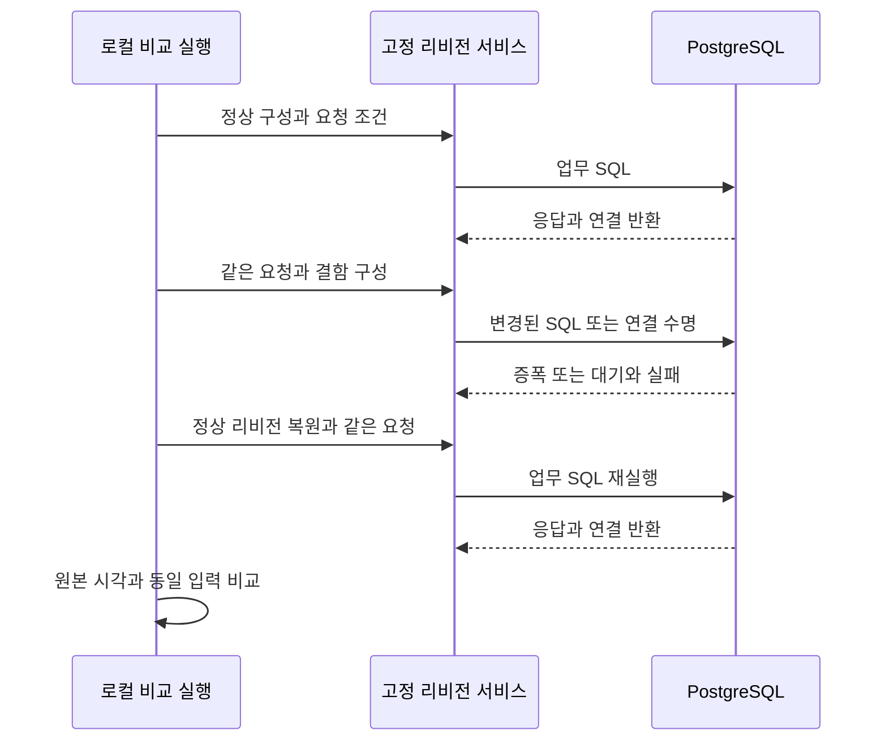
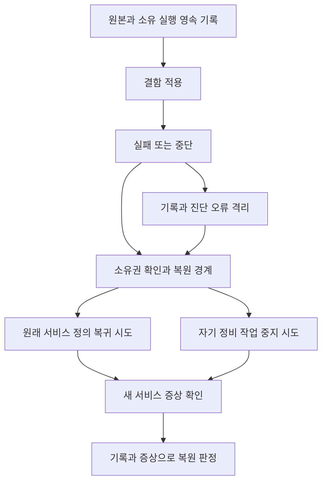
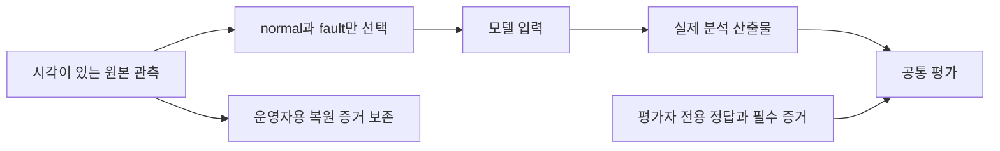

# ADR implementation review

## At a glance

<!-- generated from findings.json -->

## Review mode

full. 독립 필요성·충족성 검토와 잔여 반례 재검토를 합성했다. 코드 재검토 PASS와 전체 증거 INCONCLUSIVE를 구분한다.

## Scope

전체 ADR 본문과 원래 호출 경로는 scope에, 실제 관련 변경은 changeScope에 기록했다. 이전 RCA 효율 수정의 재설계는 포함하지 않는다. 원본 검토 사본은 이력이며 현재 판정은 `sufficiency-closed-coverage.json`과 main 합성이다. 세 ADR은 Proposed로 유지한다.

## Context

<!-- generated review context from findings.json -->

## 같은 요청으로 네 결함의 증상을 구별한다

풀·SQL·연결 수명의 차이를 같은 요청으로 비교하고 알람 의무를 지키는가?

<!-- generated container zoom from findings.json -->

화살표는 호출 순서 또는 자료 이동을 나타낸다. 실제 실행 증거의 범위는 도식 아래 문장과 함께 읽는다.

Notice: 로컬 조회 표본의 시간과 CloudWatch 1분 집계를 혼동하지 않으며 500ms 충족을 주장하지 않는다.

<!-- generated component zoom from findings.json -->

<!-- generated hill evidence from findings.json -->

## 기록 장애가 나도 소유 변경의 복원을 시도한다

변경 뒤 journal 저장에 실패해도 원래 서비스와 자기 정비 작업을 각각 정리하는가?

<!-- generated container zoom from findings.json -->

화살표는 호출 순서 또는 자료 이동을 나타낸다. 실제 실행 증거의 범위는 도식 아래 문장과 함께 읽는다.

Notice: 기록·진단 오류가 정리 제어를 막지 않는 것은 독립 재검토로 확인했다. AWS의 실제 증상 회복은 별도 미검증이다.

<!-- generated component zoom from findings.json -->

<!-- generated hill evidence from findings.json -->

## 원본 관측과 모델 평가의 증거 수준을 분리한다

사고 관측의 출처를 보존하면서 복원 결과나 정답이 모델 입력으로 들어가는 것을 막는가?

<!-- generated container zoom from findings.json -->

화살표는 호출 순서 또는 자료 이동을 나타낸다. 실제 실행 증거의 범위는 도식 아래 문장과 함께 읽는다.

Notice: 정답과 복원 증거에서 모델 입력으로 향하는 연결은 없다.

<!-- generated component zoom from findings.json -->

<!-- generated hill evidence from findings.json -->

## Findings

<!-- generated review diagnostics from findings.json -->

열린 코드 발견사항은 없다. HTTP 로그 F1, 복원 F2, 함수 문서 F3, 메타데이터 F4와 최소 관측시간 U3는 독립 재검토로 해소됐다. N1도 종료됐고 N2는 선택적 정리로 변경하지 않았다.

### F1. U1 — 실제 AWS 알람과 배포 복원의 실행 증거는 미검증이다.

로컬 PostgreSQL과 이미지 검증은 AWS 알람 전이·전달·서비스 회복을 직접 관측한 결과가 아니다.

Healthcare AWS 배포 E2E는 수행하지 않았다. 별도 평가용 AWS 자원과 로컬 PostgreSQL 자원은 정리 후 부재 확인을 마쳤다.

현재 실행 증거의 한계로 기록한다. 새 코드 수정이나 상태 승격 선행조건을 추가하지 않는다.

### F2. U2 — 최종 모델 평가 8개가 모두 실패했고 새 기준선은 미승인이다.

오프라인 코드 시험 통과는 새 관측에 대한 두 모델의 원인·반증·안전성 품질을 증명하지 않는다.

정규화 결과 8개가 완료됐고 필수 평가는0 PASS/8 FAIL이다. 입력 digest는 유지됐으며 기존 기준선과 승인되지 않은 새 fixture 상태를 보존한다.

최종 실패 결과를 그대로 보존하고 모델 자체 확정, 정적 안전성 검출과 실제 실행 사실을 구분해 읽는다. 이 문서에서 코드 종료 판정이나 승인 정책을 바꾸지 않는다.

## ADR contract coverage

<!-- generated from findings.json -->

## Notable implementation choices

<!-- generated from findings.json -->

## Tests

main 최신 집계는 단위 1,771 PASS(agent740/headless824/healthcare125/infra82), 루트136 PASS/1 FAIL이다. 루트 실패는 이전 승인 기준선 digest와 새 입력의 차이이며 기준선을 그대로 보존했다. format/lint/build/typecheck PASS, 기존 skip2/xfail1을 구분한다.

F4는 Strands113/Headless201 및 독립 최종 prompt 재현이 통과했다. 마지막 F2는 Python56/Node4와 journal·stderr 동시 오류의 원래 두 반례가 통과했다. 이미지 pin은 독립 focused48/2 suites와 main 전체 infra82를 구분한다. 같은 시험의 재실행 수를 합산하지 않는다.

실제 PostgreSQL 통합2 PASS와 fixed-proof `83aac573c02bd6eb9596ced5e0797460018704b62b955905b68b15707d1b4f2b`, 컴파일 소스와 이미지3개 일치를 보존한다. 이 실제 compiled proof와 이미지의 manifest는 verified=true다. UNBUILT 체크아웃 manifest의 verified=false와 구분한다.

최종 실모델 회차 realistic-final-20260910T025818Z-a57123은 정규화 결과 8개를 모두 남겼고 평가는 0 PASS/8 FAIL이다. 입력 digest는 8dc813d320341b5347ed5f299a5c52217a5c84a7d02863e8be79e2672e860cfc로 유지됐다. 산출물 완비 8/8, 증거 연결 7/8, 제안 안전성 정적 검사 7/8, 원인 식별 4/8이며 경쟁 원인 기각은 모두 false(0/8)다. 모델의 자체 확정 8/8은 모델이 내린 표시이며 검토자의 정답 판정이 아니다. 기존 기준선은 그대로이고 승인된 새 fixture는 없다.

평가용 자원 정리는 완료됐다. 최종 AWS 회차의 DynamoDB 테이블 4개, S3 버킷 1개, 벡터 버킷 1개와 인덱스 8개 삭제가 main에 의해 확인됐고, cleanup-verification.json의 자원 부재 검사는 allAbsent=true다. 중단한 이전 두 회차도 각각 allAbsent=true다. 로컬 PostgreSQL은 잔여 proof schema 0개를 확인한 뒤 소유 컨테이너와 익명 볼륨을 제거했다. 이 정리 결과는 평가용 자원의 종료 증거이며 Healthcare AWS 배포 E2E나 500ms 알람 관계의 성공을 의미하지 않는다.

모델 결과 출처: `tests/results/model/realistic-final-20260910T025818Z-a57123/final-report.json`. 정리 출처: `tests/results/model/realistic-final-20260910T025818Z-a57123/cleanup-verification.json`, `docs/test-reports/realistic-demo-evidence-2026-09-10/local-cleanup.json`.

실행 명령과 출처는 다음과 같다.

| 실행 | 관측 결과·출처 |
| --- | --- |
| `python3 tests/harness/realistic_demo_cases.py -v` | 최종56 PASS; Curie recheck-03/python56-final.log |
| `node --test tests/harness/realistic-demo-script.test.mjs` | 4 PASS; recheck-03/node4.log |
| `pnpm --filter infra exec jest --runInBand --cache=false test/healthcare-service-stack.test.ts test/healthcare-image-config.test.ts` | 독립48 PASS/2 suites; recheck-03/infra-pin.log |
| Healthcare venv의 `sufficiency-recheck-03/original-repro.py` | OSError와 닫힌 stream ValueError 모두 원본:1 복원 PASS |
| 양 엔진 `tests/test_eval_alarm_metadata.py` 및 관련 caller/prompt suite | Strands113/Headless201 PASS; sufficiency-final-review.md의 정확한 N2 명령 |
| 루트·패키지 최종 검증 | main-verification.json과 realistic-demo-evidence-2026-09-10 로그; 단위1771, 루트136/1 |

## Residual risks

코드 종료 판정은 PASS다. 전체 증거는 21 PROVEN/0 VIOLATED/5 UNVERIFIED로 INCONCLUSIVE이며, 미검증은 실제 runtime·알람과 모델 품질·승인 범위를 표시한다. AWS 배포를 ADR 상태 승격의 새로운 선행조건으로 추가하지 않는다. 현재 Proposed를 유지하며 승인 기준선은 갱신하지 않았다.

AWS 배포 E2E·500ms 알람 관계는 실행하지 않았다. 최종 모델 평가는 0 PASS/8 FAIL이며 이전 진단 실패와 중단 기록을 보존한다. 최종 회차와 중단 두 회차, 로컬 PostgreSQL 자원의 정리를 확인했다. 코드 종료 시점의 closed coverage는 유지하고 이후 모델 결과를 이 절에 기록했다.

NOT_OPENED — 이전 자동 승인 검토의 local file:// 차단과 사용자의 HTTP·shell·다른 브라우저 우회 금지에 따른다. open helper·브라우저 시각 검사는 수행하지 않았다. 정적 SVG XML·관계 도형·내부 링크만 검사한다.
